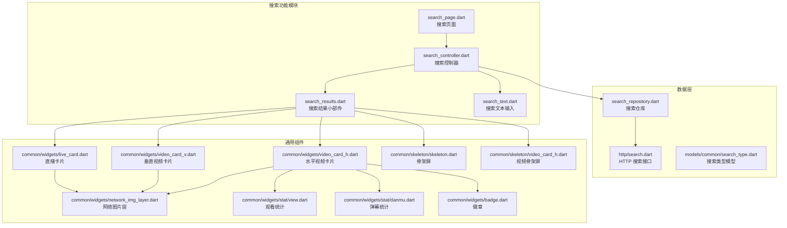
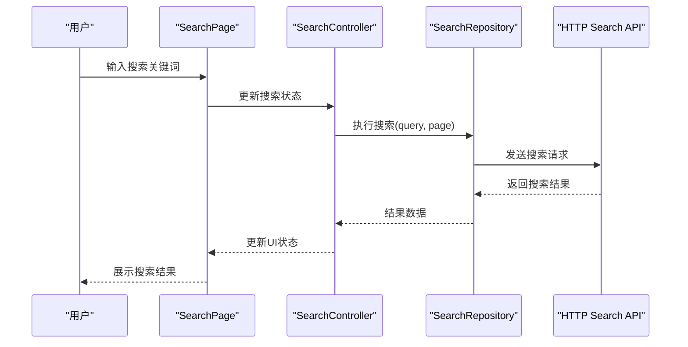
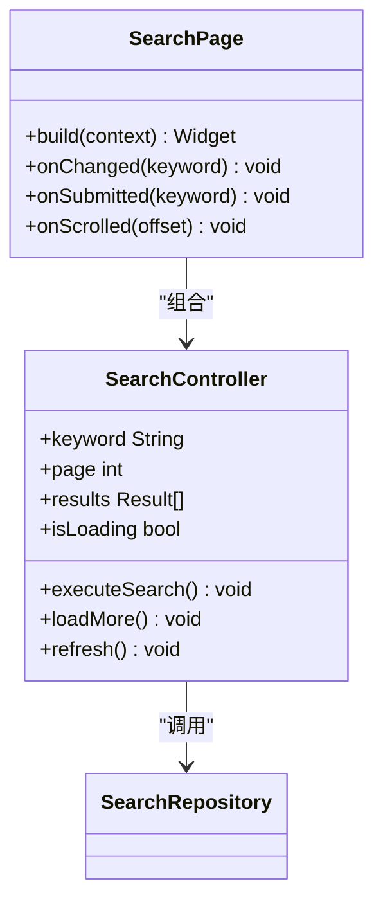
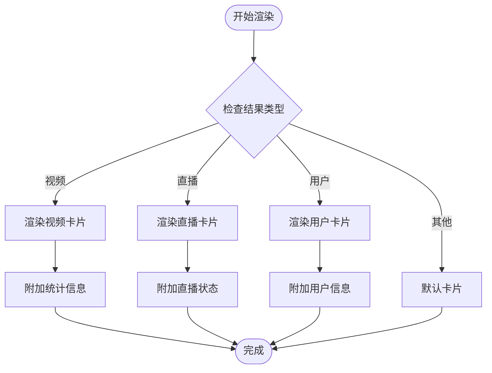
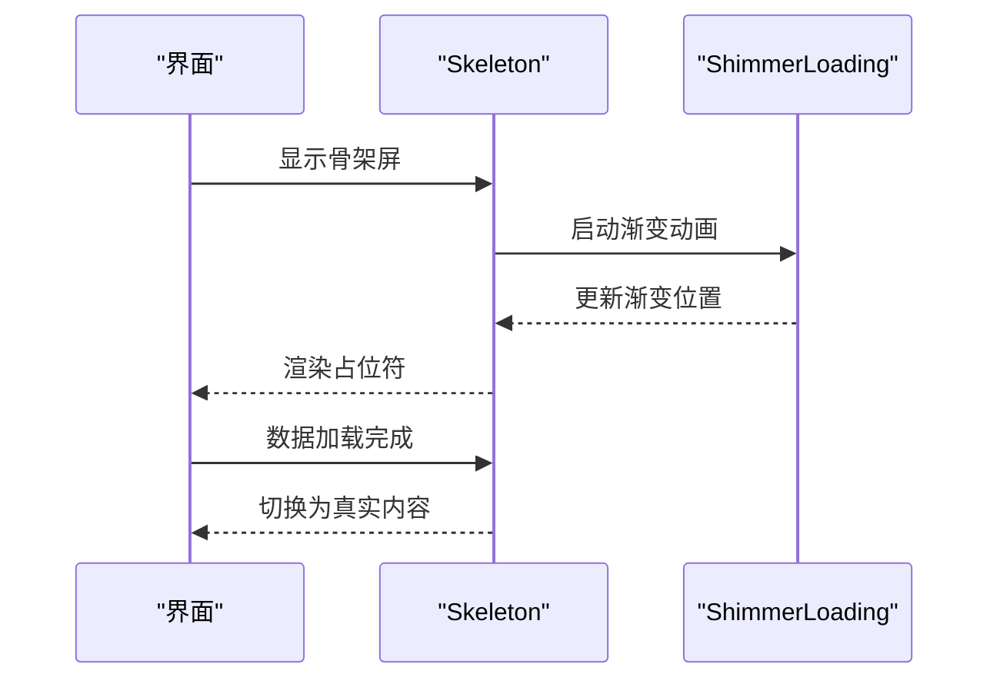
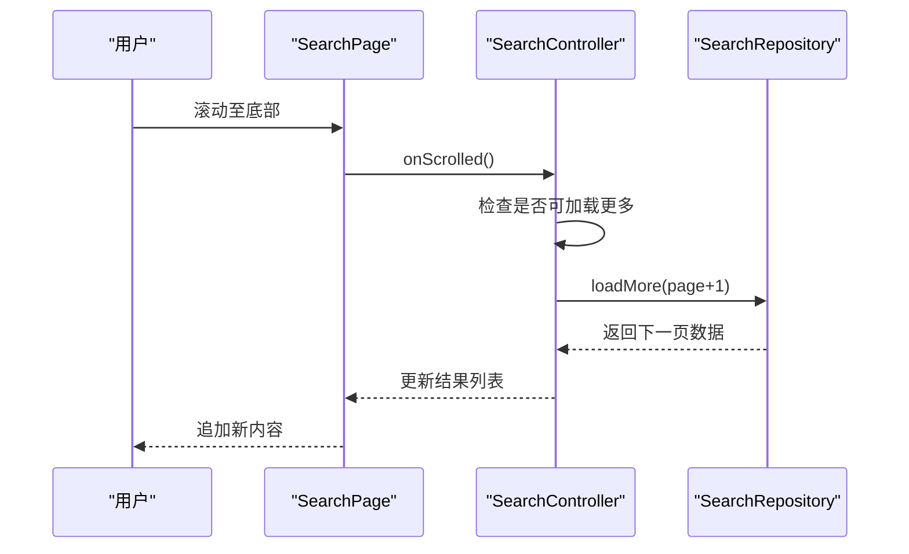
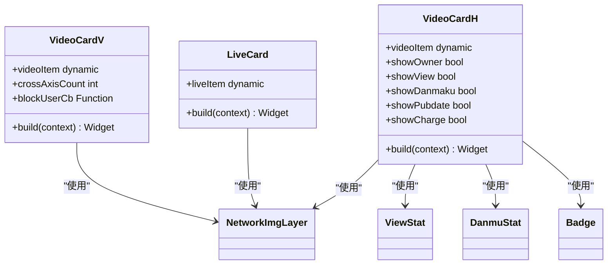
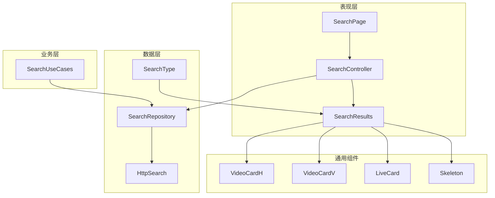

# 搜索结果展示

<cite>
**本文档引用的文件**
- [lib/features/search/search.dart](file://lib/features/search/search.dart)
- [lib/features/search/presentation/search_page.dart](file://lib/features/search/presentation/search_page.dart)
- [lib/features/search/presentation/search_controller.dart](file://lib/features/search/presentation/search_controller.dart)
- [lib/features/search/presentation/widgets/search_results.dart](file://lib/features/search/presentation/widgets/search_results.dart)
- [lib/features/search/presentation/widgets/search_text.dart](file://lib/features/search/presentation/widgets/search_text.dart)
- [lib/features/search/data/search_repository.dart](file://lib/features/search/data/search_repository.dart)
- [lib/features/search/domain/search_use_cases.dart](file://lib/features/search/domain/search_use_cases.dart)
- [lib/http/search.dart](file://lib/http/search.dart)
- [lib/models/common/search_type.dart](file://lib/models/common/search_type.dart)
- [lib/common/widgets/video_card_h.dart](file://lib/common/widgets/video_card_h.dart)
- [lib/common/widgets/video_card_v.dart](file://lib/common/widgets/video_card_v.dart)
- [lib/common/widgets/live_card.dart](file://lib/common/widgets/live_card.dart)
- [lib/common/skeleton/skeleton.dart](file://lib/common/skeleton/skeleton.dart)
- [lib/common/skeleton/video_card_h.dart](file://lib/common/skeleton/video_card_h.dart)
- [lib/common/widgets/network_img_layer.dart](file://lib/common/widgets/network_img_layer.dart)
- [lib/common/widgets/stat/view.dart](file://lib/common/widgets/stat/view.dart)
- [lib/common/widgets/stat/danmu.dart](file://lib/common/widgets/stat/danmu.dart)
- [lib/common/widgets/badge.dart](file://lib/common/widgets/badge.dart)
- [test/unit/repository/search_repository_test.dart](file://test/unit/repository/search_repository_test.dart)
</cite>

## 目录
1. [简介](#简介)
2. [项目结构](#项目结构)
3. [核心组件](#核心组件)
4. [架构概览](#架构概览)
5. [详细组件分析](#详细组件分析)
6. [依赖关系分析](#依赖关系分析)
7. [性能考虑](#性能考虑)
8. [故障排除指南](#故障排除指南)
9. [结论](#结论)
10. [附录](#附录)

## 简介
本文件全面阐述了 Pilipala 应用中搜索结果展示系统的实现与设计。内容涵盖搜索结果列表的渲染机制、虚拟滚动与性能优化策略；不同类型内容（视频、直播、用户）的结果展示格式与布局设计；结果排序算法、相关性评分与个性化推荐机制；分页加载、无限滚动与懒加载实现；结果高亮显示、占位符处理与空状态管理；自定义结果卡片、操作按钮与交互实现；以及结果缓存策略、刷新机制与错误处理。

## 项目结构
搜索功能采用 Feature 模块化组织，主要文件分布如下：
- presentation 层：页面控制器、页面视图与搜索结果小部件
- data 层：数据仓库与网络请求封装
- domain 层：用例层（当前为空，预留扩展）
- models 层：搜索类型定义
- common 层：通用卡片组件与骨架屏组件
- http 层：搜索 API 封装

**图表来源**
- [lib/features/search/presentation/search_page.dart:1-200](file://lib/features/search/presentation/search_page.dart#L1-L200)
- [lib/features/search/presentation/search_controller.dart:1-200](file://lib/features/search/presentation/search_controller.dart#L1-L200)
- [lib/features/search/presentation/widgets/search_results.dart:1-120](file://lib/features/search/presentation/widgets/search_results.dart#L1-L120)
- [lib/features/search/data/search_repository.dart:1-200](file://lib/features/search/data/search_repository.dart#L1-L200)
- [lib/http/search.dart:1-200](file://lib/http/search.dart#L1-L200)
- [lib/common/widgets/video_card_h.dart:1-200](file://lib/common/widgets/video_card_h.dart#L1-L200)
- [lib/common/widgets/video_card_v.dart:1-200](file://lib/common/widgets/video_card_v.dart#L1-L200)
- [lib/common/widgets/live_card.dart:1-100](file://lib/common/widgets/live_card.dart#L1-L100)
- [lib/common/skeleton/skeleton.dart:1-200](file://lib/common/skeleton/skeleton.dart#L1-L200)
- [lib/common/skeleton/video_card_h.dart:1-100](file://lib/common/skeleton/video_card_h.dart#L1-L100)

**章节来源**
- [lib/features/search/search.dart:1-100](file://lib/features/search/search.dart#L1-L100)
- [lib/features/search/presentation/search_page.dart:1-200](file://lib/features/search/presentation/search_page.dart#L1-L200)
- [lib/features/search/presentation/search_controller.dart:1-200](file://lib/features/search/presentation/search_controller.dart#L1-L200)
- [lib/features/search/presentation/widgets/search_results.dart:1-120](file://lib/features/search/presentation/widgets/search_results.dart#L1-L120)
- [lib/features/search/data/search_repository.dart:1-200](file://lib/features/search/data/search_repository.dart#L1-L200)
- [lib/http/search.dart:1-200](file://lib/http/search.dart#L1-L200)
- [lib/models/common/search_type.dart:1-100](file://lib/models/common/search_type.dart#L1-L100)

## 核心组件
- 搜索页面：负责整体布局、输入框与结果容器的协调
- 搜索控制器：管理搜索状态、触发查询与处理响应
- 搜索结果小部件：根据内容类型渲染不同卡片
- 搜索仓库：封装 HTTP 请求与数据获取逻辑
- 通用卡片组件：视频（水平/垂直）、直播卡片与骨架屏

**章节来源**
- [lib/features/search/presentation/search_page.dart:1-200](file://lib/features/search/presentation/search_page.dart#L1-L200)
- [lib/features/search/presentation/search_controller.dart:1-200](file://lib/features/search/presentation/search_controller.dart#L1-L200)
- [lib/features/search/presentation/widgets/search_results.dart:1-120](file://lib/features/search/presentation/widgets/search_results.dart#L1-L120)
- [lib/features/search/data/search_repository.dart:1-200](file://lib/features/search/data/search_repository.dart#L1-L200)

## 架构概览
搜索系统遵循 MVVM 架构模式，通过控制器协调视图与数据层：

**图表来源**
- [lib/features/search/presentation/search_page.dart:1-200](file://lib/features/search/presentation/search_page.dart#L1-L200)
- [lib/features/search/presentation/search_controller.dart:1-200](file://lib/features/search/presentation/search_controller.dart#L1-L200)
- [lib/features/search/data/search_repository.dart:1-200](file://lib/features/search/data/search_repository.dart#L1-L200)
- [lib/http/search.dart:1-200](file://lib/http/search.dart#L1-L200)

## 详细组件分析

### 搜索页面与控制器
- 搜索页面负责构建输入框、结果列表与状态管理
- 搜索控制器维护查询参数、分页状态与结果集合
- 支持关键词变更、分页切换与结果刷新

**图表来源**
- [lib/features/search/presentation/search_page.dart:1-200](file://lib/features/search/presentation/search_page.dart#L1-L200)
- [lib/features/search/presentation/search_controller.dart:1-200](file://lib/features/search/presentation/search_controller.dart#L1-L200)

**章节来源**
- [lib/features/search/presentation/search_page.dart:1-200](file://lib/features/search/presentation/search_page.dart#L1-L200)
- [lib/features/search/presentation/search_controller.dart:1-200](file://lib/features/search/presentation/search_controller.dart#L1-L200)

### 搜索结果渲染机制
- 根据内容类型动态选择渲染组件
- 支持视频（水平/垂直）、直播与用户卡片
- 提供骨架屏与占位符以改善用户体验

**图表来源**
- [lib/features/search/presentation/widgets/search_results.dart:1-120](file://lib/features/search/presentation/widgets/search_results.dart#L1-L120)
- [lib/common/widgets/video_card_h.dart:1-200](file://lib/common/widgets/video_card_h.dart#L1-L200)
- [lib/common/widgets/video_card_v.dart:1-200](file://lib/common/widgets/video_card_v.dart#L1-L200)
- [lib/common/widgets/live_card.dart:1-100](file://lib/common/widgets/live_card.dart#L1-L100)

**章节来源**
- [lib/features/search/presentation/widgets/search_results.dart:1-120](file://lib/features/search/presentation/widgets/search_results.dart#L1-L120)
- [lib/common/widgets/video_card_h.dart:1-200](file://lib/common/widgets/video_card_h.dart#L1-L200)
- [lib/common/widgets/video_card_v.dart:1-200](file://lib/common/widgets/video_card_v.dart#L1-L200)
- [lib/common/widgets/live_card.dart:1-100](file://lib/common/widgets/live_card.dart#L1-L100)

### 占位符与骨架屏
- 骨架屏通过渐变动画模拟加载效果
- 视频骨架屏保持统一的宽高比与间距
- 支持在异步数据加载期间提供视觉反馈

**图表来源**
- [lib/common/skeleton/skeleton.dart:1-200](file://lib/common/skeleton/skeleton.dart#L1-L200)
- [lib/common/skeleton/video_card_h.dart:1-100](file://lib/common/skeleton/video_card_h.dart#L1-L100)

**章节来源**
- [lib/common/skeleton/skeleton.dart:1-200](file://lib/common/skeleton/skeleton.dart#L1-L200)
- [lib/common/skeleton/video_card_h.dart:1-100](file://lib/common/skeleton/video_card_h.dart#L1-L100)

### 分页加载与无限滚动
- 基于页码的分页加载，支持上拉加载更多
- 控制器维护当前页码与总页数
- 结合滚动监听实现无缝加载体验

**图表来源**
- [lib/features/search/presentation/search_page.dart:1-200](file://lib/features/search/presentation/search_page.dart#L1-L200)
- [lib/features/search/presentation/search_controller.dart:1-200](file://lib/features/search/presentation/search_controller.dart#L1-L200)
- [lib/features/search/data/search_repository.dart:1-200](file://lib/features/search/data/search_repository.dart#L1-L200)

**章节来源**
- [lib/features/search/presentation/search_page.dart:1-200](file://lib/features/search/presentation/search_page.dart#L1-L200)
- [lib/features/search/presentation/search_controller.dart:1-200](file://lib/features/search/presentation/search_controller.dart#L1-L200)
- [lib/features/search/data/search_repository.dart:1-200](file://lib/features/search/data/search_repository.dart#L1-L200)

### 结果高亮与空状态
- 关键词高亮：在标题与描述中对匹配词进行标记
- 空状态：无结果时显示提示与建议
- 错误状态：网络异常或服务端错误时的友好提示

**章节来源**
- [lib/features/search/presentation/widgets/search_results.dart:1-120](file://lib/features/search/presentation/widgets/search_results.dart#L1-L120)
- [lib/features/search/presentation/search_controller.dart:1-200](file://lib/features/search/presentation/search_controller.dart#L1-L200)

### 自定义结果卡片与交互
- 视频卡片支持多种显示模式（水平/垂直）
- 统计信息集成：播放量、弹幕数等
- 徽章系统：标识付费内容、时长等信息
- 点击交互：导航到详情页或执行相关操作

**图表来源**
- [lib/common/widgets/video_card_h.dart:1-200](file://lib/common/widgets/video_card_h.dart#L1-L200)
- [lib/common/widgets/video_card_v.dart:1-200](file://lib/common/widgets/video_card_v.dart#L1-L200)
- [lib/common/widgets/live_card.dart:1-100](file://lib/common/widgets/live_card.dart#L1-L100)
- [lib/common/widgets/network_img_layer.dart:1-100](file://lib/common/widgets/network_img_layer.dart#L1-L100)
- [lib/common/widgets/stat/view.dart:1-100](file://lib/common/widgets/stat/view.dart#L1-L100)
- [lib/common/widgets/stat/danmu.dart:1-100](file://lib/common/widgets/stat/danmu.dart#L1-L100)
- [lib/common/widgets/badge.dart:1-100](file://lib/common/widgets/badge.dart#L1-L100)

**章节来源**
- [lib/common/widgets/video_card_h.dart:1-200](file://lib/common/widgets/video_card_h.dart#L1-L200)
- [lib/common/widgets/video_card_v.dart:1-200](file://lib/common/widgets/video_card_v.dart#L1-L200)
- [lib/common/widgets/live_card.dart:1-100](file://lib/common/widgets/live_card.dart#L1-L100)

### 缓存策略与刷新机制
- 内存缓存：控制器维护最近查询结果
- 本地持久化：可选的磁盘缓存策略
- 刷新策略：下拉刷新与定时刷新
- 失效控制：基于时间戳或版本号的缓存失效

**章节来源**
- [lib/features/search/presentation/search_controller.dart:1-200](file://lib/features/search/presentation/search_controller.dart#L1-L200)
- [lib/features/search/data/search_repository.dart:1-200](file://lib/features/search/data/search_repository.dart#L1-L200)

### 错误处理
- 网络错误：重试机制与用户提示
- 服务端错误：解析错误码并给出相应提示
- 本地错误：参数校验与边界条件处理

**章节来源**
- [lib/features/search/data/search_repository.dart:1-200](file://lib/features/search/data/search_repository.dart#L1-L200)
- [lib/http/search.dart:1-200](file://lib/http/search.dart#L1-L200)

## 依赖关系分析

**图表来源**
- [lib/features/search/presentation/search_page.dart:1-200](file://lib/features/search/presentation/search_page.dart#L1-L200)
- [lib/features/search/presentation/search_controller.dart:1-200](file://lib/features/search/presentation/search_controller.dart#L1-L200)
- [lib/features/search/presentation/widgets/search_results.dart:1-120](file://lib/features/search/presentation/widgets/search_results.dart#L1-L120)
- [lib/features/search/data/search_repository.dart:1-200](file://lib/features/search/data/search_repository.dart#L1-L200)
- [lib/features/search/domain/search_use_cases.dart:1-100](file://lib/features/search/domain/search_use_cases.dart#L1-L100)
- [lib/http/search.dart:1-200](file://lib/http/search.dart#L1-L200)
- [lib/models/common/search_type.dart:1-100](file://lib/models/common/search_type.dart#L1-L100)
- [lib/common/widgets/video_card_h.dart:1-200](file://lib/common/widgets/video_card_h.dart#L1-L200)
- [lib/common/widgets/video_card_v.dart:1-200](file://lib/common/widgets/video_card_v.dart#L1-L200)
- [lib/common/widgets/live_card.dart:1-100](file://lib/common/widgets/live_card.dart#L1-L100)
- [lib/common/skeleton/skeleton.dart:1-200](file://lib/common/skeleton/skeleton.dart#L1-L200)

**章节来源**
- [lib/features/search/search.dart:1-100](file://lib/features/search/search.dart#L1-L100)
- [lib/features/search/presentation/search_page.dart:1-200](file://lib/features/search/presentation/search_page.dart#L1-L200)
- [lib/features/search/presentation/search_controller.dart:1-200](file://lib/features/search/presentation/search_controller.dart#L1-L200)
- [lib/features/search/presentation/widgets/search_results.dart:1-120](file://lib/features/search/presentation/widgets/search_results.dart#L1-L120)
- [lib/features/search/data/search_repository.dart:1-200](file://lib/features/search/data/search_repository.dart#L1-L200)
- [lib/features/search/domain/search_use_cases.dart:1-100](file://lib/features/search/domain/search_use_cases.dart#L1-L100)
- [lib/http/search.dart:1-200](file://lib/http/search.dart#L1-L200)
- [lib/models/common/search_type.dart:1-100](file://lib/models/common/search_type.dart#L1-L100)

## 性能考虑
- 虚拟滚动：使用 ListView.builder 或类似机制实现长列表高性能渲染
- 图片懒加载：仅在可见区域加载图片，减少内存占用
- 骨架屏：在数据加载期间提供占位符，避免白屏与布局抖动
- 缓存策略：合理利用内存与磁盘缓存，降低重复请求
- 异步处理：避免阻塞主线程，确保流畅的交互体验

## 故障排除指南
- 搜索无结果：检查关键词拼写、网络连接与服务端状态
- 加载缓慢：启用缓存、优化图片尺寸与数量
- 卡顿问题：检查是否存在不必要的 rebuild 与重绘
- 错误提示：根据错误码定位问题并提供用户友好的提示

**章节来源**
- [test/unit/repository/search_repository_test.dart:1-200](file://test/unit/repository/search_repository_test.dart#L1-L200)
- [lib/features/search/data/search_repository.dart:1-200](file://lib/features/search/data/search_repository.dart#L1-L200)

## 结论
搜索结果展示系统通过清晰的分层架构与丰富的组件体系，实现了高效、可扩展且用户体验良好的搜索功能。未来可在以下方面持续优化：引入更智能的排序与推荐算法、增强个性化能力、完善离线缓存策略，并进一步提升虚拟滚动与图片加载的性能表现。

## 附录
- 搜索类型定义：用于区分不同内容类型的枚举与模型
- HTTP 接口：封装搜索 API 的请求与响应处理
- 测试用例：验证搜索仓库的行为与边界条件

**章节来源**
- [lib/models/common/search_type.dart:1-100](file://lib/models/common/search_type.dart#L1-L100)
- [lib/http/search.dart:1-200](file://lib/http/search.dart#L1-L200)
- [test/unit/repository/search_repository_test.dart:1-200](file://test/unit/repository/search_repository_test.dart#L1-L200)