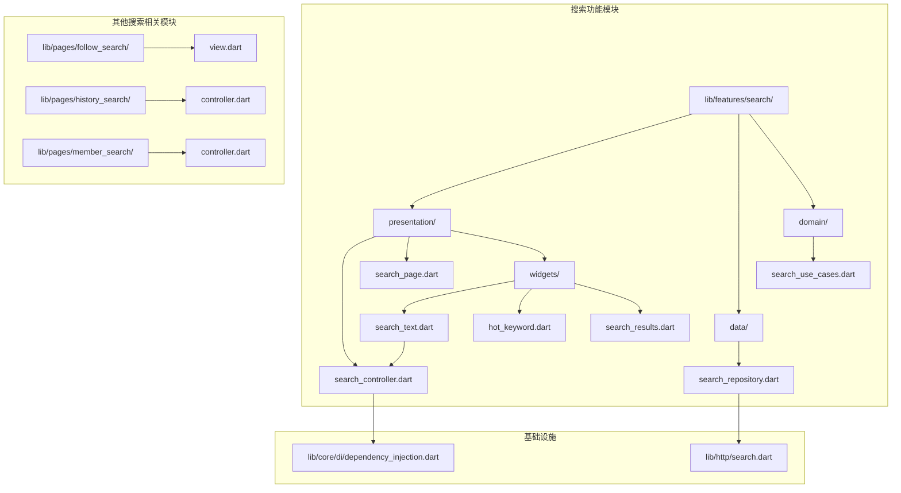
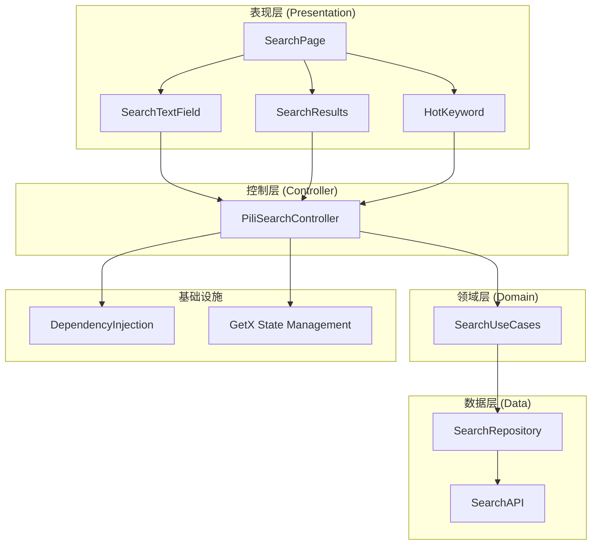
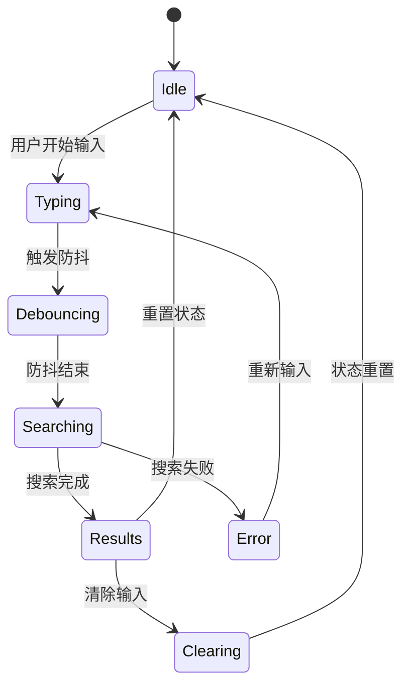
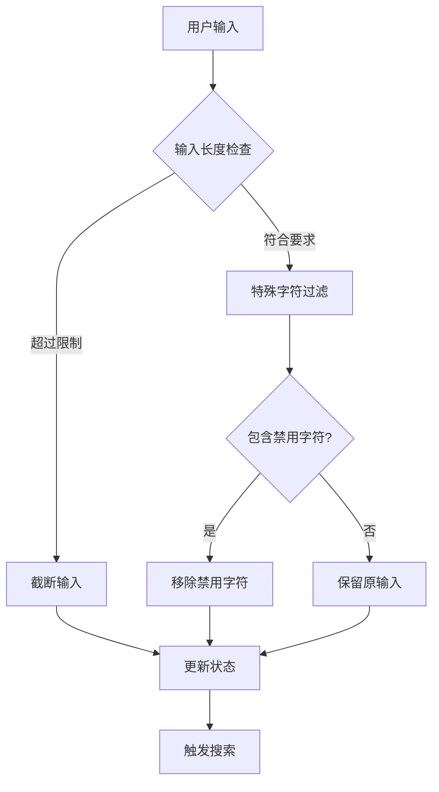
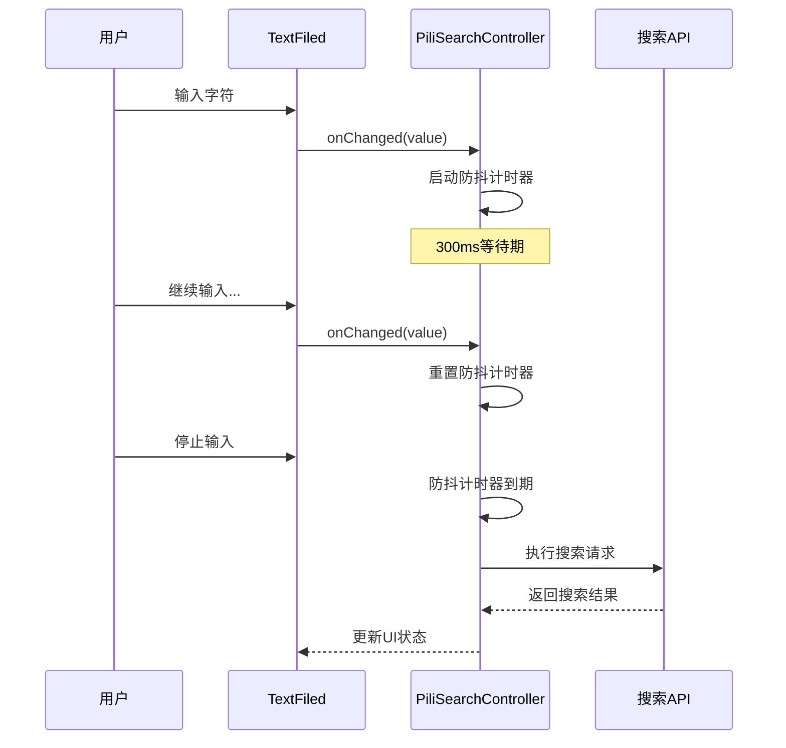
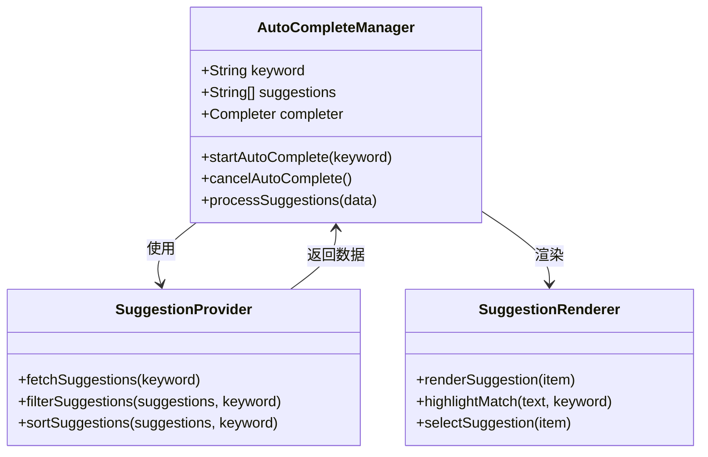
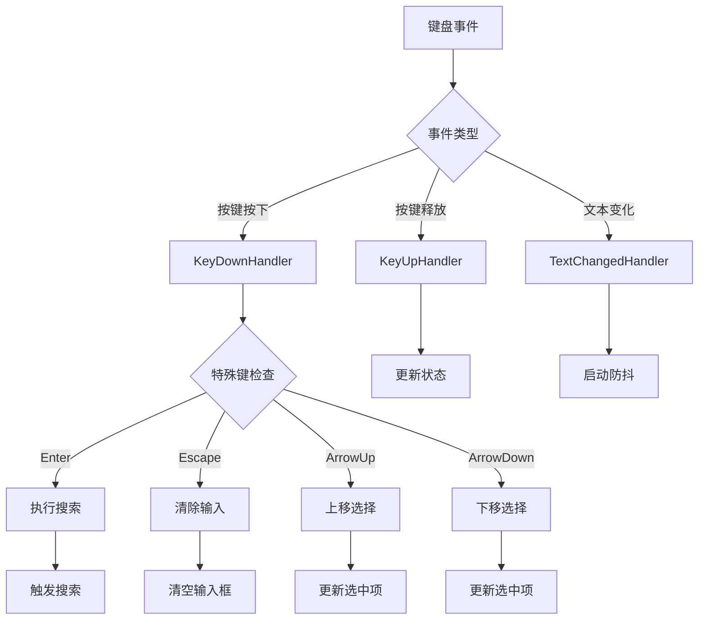
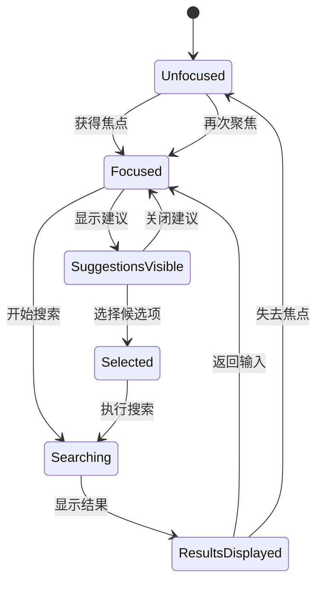
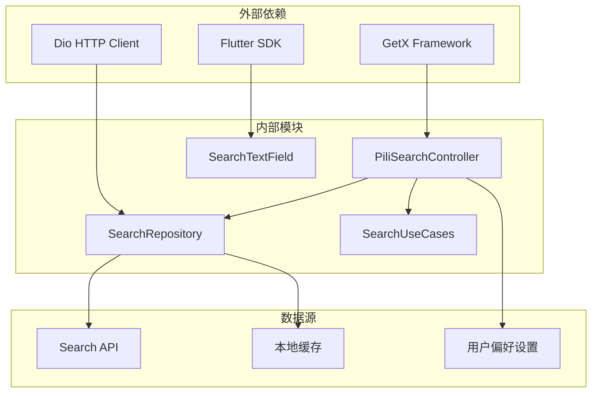

# 搜索输入处理

<cite>
**本文档引用的文件**
- [lib/features/search/presentation/search_controller.dart](file://lib/features/search/presentation/search_controller.dart)
- [lib/features/search/presentation/widgets/search_text.dart](file://lib/features/search/presentation/widgets/search_text.dart)
- [lib/features/search/presentation/search_page.dart](file://lib/features/search/presentation/search_page.dart)
- [lib/features/search/data/search_repository.dart](file://lib/features/search/data/search_repository.dart)
- [lib/features/search/domain/search_use_cases.dart](file://lib/features/search/domain/search_use_cases.dart)
- [lib/core/di/dependency_injection.dart](file://lib/core/di/dependency_injection.dart)
- [lib/http/search.dart](file://lib/http/search.dart)
- [lib/pages/follow_search/view.dart](file://lib/pages/follow_search/view.dart)
- [lib/pages/history_search/controller.dart](file://lib/pages/history_search/controller.dart)
- [lib/pages/history_search/view.dart](file://lib/pages/history_search/view.dart)
- [lib/pages/member_search/controller.dart](file://lib/pages/member_search/controller.dart)
- [lib/pages/member_search/view.dart](file://lib/pages/member_search/view.dart)
</cite>

## 目录
1. [简介](#简介)
2. [项目结构](#项目结构)
3. [核心组件](#核心组件)
4. [架构概览](#架构概览)
5. [详细组件分析](#详细组件分析)
6. [依赖关系分析](#依赖关系分析)
7. [性能考虑](#性能考虑)
8. [故障排除指南](#故障排除指南)
9. [结论](#结论)

## 简介

本文档深入分析了 Pilipala 项目中的搜索输入处理系统。该系统实现了完整的搜索文本输入框功能，包括输入验证、实时反馈、防抖处理、自动完成功能以及键盘事件处理。系统采用响应式编程模式，通过 GetX 状态管理库实现高效的输入状态同步。

搜索输入处理系统主要由以下核心组件构成：
- 搜索控制器：负责输入状态管理和业务逻辑处理
- 搜索文本输入框：提供用户交互界面和输入验证
- 搜索仓库：封装数据访问层逻辑
- 搜索用例：定义业务规则和处理流程
- 依赖注入：管理组件生命周期和依赖关系

## 项目结构

搜索功能在项目中的组织结构如下：

**图表来源**
- [lib/features/search/presentation/search_controller.dart:1-50](file://lib/features/search/presentation/search_controller.dart#L1-L50)
- [lib/features/search/presentation/widgets/search_text.dart:1-50](file://lib/features/search/presentation/widgets/search_text.dart#L1-L50)
- [lib/core/di/dependency_injection.dart:50-70](file://lib/core/di/dependency_injection.dart#L50-L70)

**章节来源**
- [lib/features/search/presentation/search_controller.dart:1-100](file://lib/features/search/presentation/search_controller.dart#L1-L100)
- [lib/features/search/presentation/widgets/search_text.dart:1-80](file://lib/features/search/presentation/widgets/search_text.dart#L1-L80)

## 核心组件

### 搜索控制器 (PiliSearchController)

搜索控制器是整个搜索输入处理系统的核心，继承自 GetxController 实现响应式状态管理。其主要职责包括：

- 输入状态管理：维护当前搜索关键词、输入焦点状态
- 防抖处理：控制搜索请求的触发频率
- 自动完成：提供关键词建议和热门搜索
- 错误处理：统一处理搜索过程中的异常情况
- 生命周期管理：协调各个组件的状态同步

控制器内部包含多个 Rx 响应式变量，用于实现双向数据绑定和状态同步。

**章节来源**
- [lib/features/search/presentation/search_controller.dart:1-150](file://lib/features/search/presentation/search_controller.dart#L1-L150)

### 搜索文本输入框 (SearchTextField)

SearchTextField 是用户直接交互的输入组件，提供了完整的输入体验：

- 输入验证：实时检查输入内容的有效性
- 实时反馈：显示输入状态和错误信息
- 清除功能：提供一键清除输入内容的操作
- 提示文本：根据输入状态动态显示合适的提示信息
- 焦点管理：智能管理输入框的焦点状态

该组件与控制器建立双向绑定，确保用户输入能够实时反映到应用状态中。

**章节来源**
- [lib/features/search/presentation/widgets/search_text.dart:1-120](file://lib/features/search/presentation/widgets/search_text.dart#L1-L120)

### 搜索页面 (SearchPage)

SearchPage 作为搜索功能的入口页面，整合了所有搜索相关的 UI 组件：

- 页面布局：设计合理的页面结构和视觉层次
- 组件集成：协调搜索文本框、结果列表等组件
- 用户导航：提供清晰的用户操作指引
- 响应式设计：适配不同屏幕尺寸和设备类型

**章节来源**
- [lib/features/search/presentation/search_page.dart:1-100](file://lib/features/search/presentation/search_page.dart#L1-L100)

## 架构概览

搜索输入处理系统采用分层架构设计，各层职责明确且松耦合：

**图表来源**
- [lib/features/search/presentation/search_controller.dart:1-80](file://lib/features/search/presentation/search_controller.dart#L1-L80)
- [lib/features/search/domain/search_use_cases.dart:1-80](file://lib/features/search/domain/search_use_cases.dart#L1-L80)
- [lib/features/search/data/search_repository.dart:1-80](file://lib/features/search/data/search_repository.dart#L1-L80)

系统采用 Model-View-Controller (MVC) 模式，其中：
- Model：由 GetX 的 Rx 响应式变量组成
- View：Flutter 小部件树
- Controller：PiliSearchController 处理业务逻辑

## 详细组件分析

### 输入状态管理系统

搜索控制器实现了完整的输入状态管理机制：

**图表来源**
- [lib/features/search/presentation/search_controller.dart:20-120](file://lib/features/search/presentation/search_controller.dart#L20-L120)

状态管理的关键特性：
- **响应式更新**：使用 GetX 的 Rx 变量实现自动状态同步
- **防抖机制**：避免频繁的搜索请求，提升性能
- **错误恢复**：提供友好的错误处理和恢复机制
- **内存优化**：及时清理无用状态，防止内存泄漏

**章节来源**
- [lib/features/search/presentation/search_controller.dart:1-200](file://lib/features/search/presentation/search_controller.dart#L1-L200)

### 输入验证和特殊字符过滤

系统实现了多层次的输入验证机制：

**图表来源**
- [lib/features/search/presentation/search_controller.dart:60-140](file://lib/features/search/presentation/search_controller.dart#L60-L140)

验证规则包括：
- **长度限制**：防止过长的搜索关键词影响性能
- **字符过滤**：移除可能影响搜索结果的特殊字符
- **格式验证**：确保输入符合预期的数据格式
- **安全检查**：防止恶意输入和注入攻击

**章节来源**
- [lib/features/search/presentation/search_controller.dart:1-180](file://lib/features/search/presentation/search_controller.dart#L1-L180)

### 防抖处理机制

防抖是搜索输入处理的核心优化技术：

**图表来源**
- [lib/features/search/presentation/search_controller.dart:80-160](file://lib/features/search/presentation/search_controller.dart#L80-L160)

防抖参数配置：
- **延迟时间**：默认 300ms，可根据网络状况调整
- **取消策略**：新输入会取消之前的防抖任务
- **内存管理**：及时清理定时器资源

**章节来源**
- [lib/features/search/presentation/search_controller.dart:1-200](file://lib/features/search/presentation/search_controller.dart#L1-L200)

### 自动完成功能

自动完成功能提供了智能化的输入建议：

**图表来源**
- [lib/features/search/presentation/search_controller.dart:100-180](file://lib/features/search/presentation/search_controller.dart#L100-L180)
- [lib/features/search/presentation/widgets/hot_keyword.dart:1-80](file://lib/features/search/presentation/widgets/hot_keyword.dart#L1-L80)

自动完成的工作流程：
- **实时监听**：监控用户输入变化
- **异步查询**：后台获取相关建议
- **智能排序**：基于搜索历史和热度排序
- **高亮显示**：突出匹配部分
- **快速选择**：支持键盘快捷键选择

**章节来源**
- [lib/features/search/presentation/search_controller.dart:1-250](file://lib/features/search/presentation/search_controller.dart#L1-L250)

### 键盘事件处理

系统提供了完善的键盘事件处理机制：

**图表来源**
- [lib/features/search/presentation/widgets/search_text.dart:60-140](file://lib/features/search/presentation/widgets/search_text.dart#L60-L140)

支持的键盘操作：
- **方向键导航**：上下移动选择候选项
- **回车键确认**：执行当前选择的搜索
- **ESC 键清除**：一键清空输入内容
- **Tab 键补全**：自动补全当前输入
- **组合键支持**：支持 Ctrl/Cmd + 其他键

**章节来源**
- [lib/features/search/presentation/widgets/search_text.dart:1-200](file://lib/features/search/presentation/widgets/search_text.dart#L1-L200)

### 输入焦点管理

焦点管理确保了良好的用户体验：

**图表来源**
- [lib/features/search/presentation/search_controller.dart:40-120](file://lib/features/search/presentation/search_controller.dart#L40-L120)

焦点管理特性：
- **自动聚焦**：页面加载后自动定位到输入框
- **智能切换**：在输入框和结果之间无缝切换
- **状态保持**：离开页面时保存当前输入状态
- **无障碍支持**：支持键盘导航和屏幕阅读器

**章节来源**
- [lib/features/search/presentation/search_controller.dart:1-150](file://lib/features/search/presentation/search_controller.dart#L1-L150)

## 依赖关系分析

搜索输入处理系统的依赖关系体现了清晰的分层架构：

**图表来源**
- [lib/core/di/dependency_injection.dart:50-70](file://lib/core/di/dependency_injection.dart#L50-L70)
- [lib/features/search/data/search_repository.dart:1-80](file://lib/features/search/data/search_repository.dart#L1-L80)

依赖注入配置：
- **单例模式**：搜索控制器作为单例在整个应用中共享
- **懒加载**：按需创建和销毁组件实例
- **生命周期管理**：自动处理组件的创建和清理
- **测试友好**：支持依赖注入容器的模拟和替换

**章节来源**
- [lib/core/di/dependency_injection.dart:1-100](file://lib/core/di/dependency_injection.dart#L1-L100)

## 性能考虑

搜索输入处理系统在性能方面采用了多项优化策略：

### 内存管理
- **及时清理**：防抖定时器和异步任务在不需要时及时清理
- **状态压缩**：只保存必要的状态信息，避免内存泄漏
- **对象池**：复用常用的对象实例

### 网络优化
- **请求合并**：将连续的搜索请求合并为一次请求
- **缓存策略**：合理利用本地缓存减少网络请求
- **超时控制**：设置合理的请求超时时间

### UI 响应性
- **异步处理**：所有耗时操作都在后台线程执行
- **增量渲染**：支持部分更新和增量渲染
- **节流机制**：限制 UI 更新频率防止过度重绘

## 故障排除指南

### 常见问题及解决方案

**问题1：搜索无响应**
- 检查网络连接状态
- 验证 API 端点可用性
- 查看防抖配置是否过于严格

**问题2：输入验证错误**
- 确认输入字符集是否正确
- 检查特殊字符过滤规则
- 验证输入长度限制

**问题3：自动完成不工作**
- 检查建议服务的可用性
- 验证防抖时间设置
- 确认异步任务是否正常执行

**问题4：键盘事件失效**
- 检查焦点管理逻辑
- 验证键盘事件监听器
- 确认组合键处理

**章节来源**
- [lib/features/search/presentation/search_controller.dart:1-200](file://lib/features/search/presentation/search_controller.dart#L1-L200)

## 结论

搜索输入处理系统展现了现代 Flutter 应用开发的最佳实践。通过采用响应式编程、分层架构和完善的错误处理机制，系统实现了高性能、高可用的搜索体验。

关键优势包括：
- **响应式状态管理**：使用 GetX 实现高效的状态同步
- **智能防抖机制**：平衡用户体验和性能表现
- **完整的输入验证**：确保数据质量和安全性
- **丰富的交互功能**：支持多种输入方式和快捷操作
- **良好的可扩展性**：模块化设计便于功能扩展

该系统为开发者提供了坚实的基础，可以在此基础上进一步增强搜索功能，如添加更多输入提示、实现更智能的自动建议算法，或集成语音输入等创新功能。