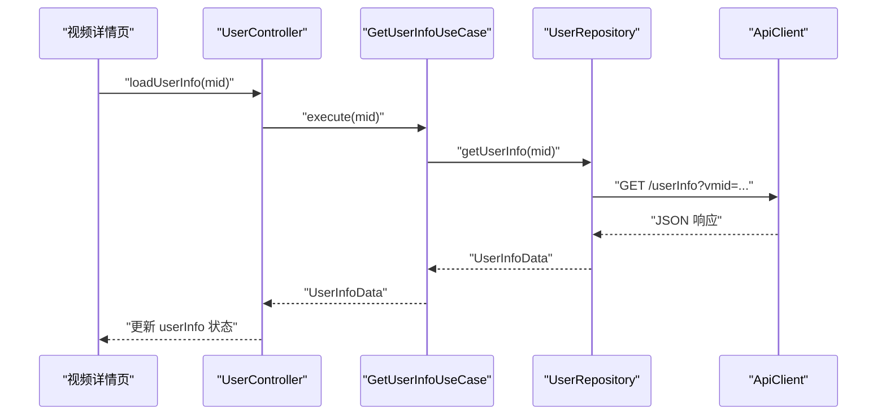
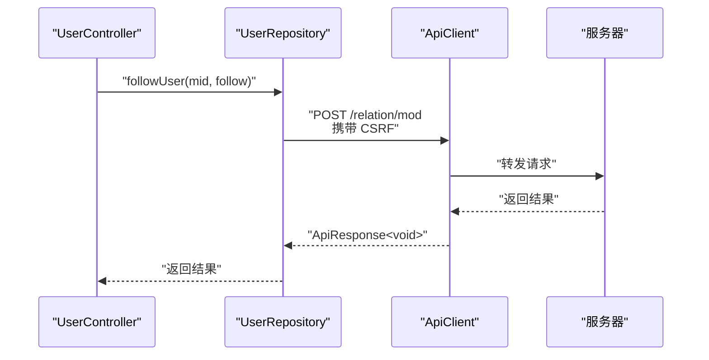
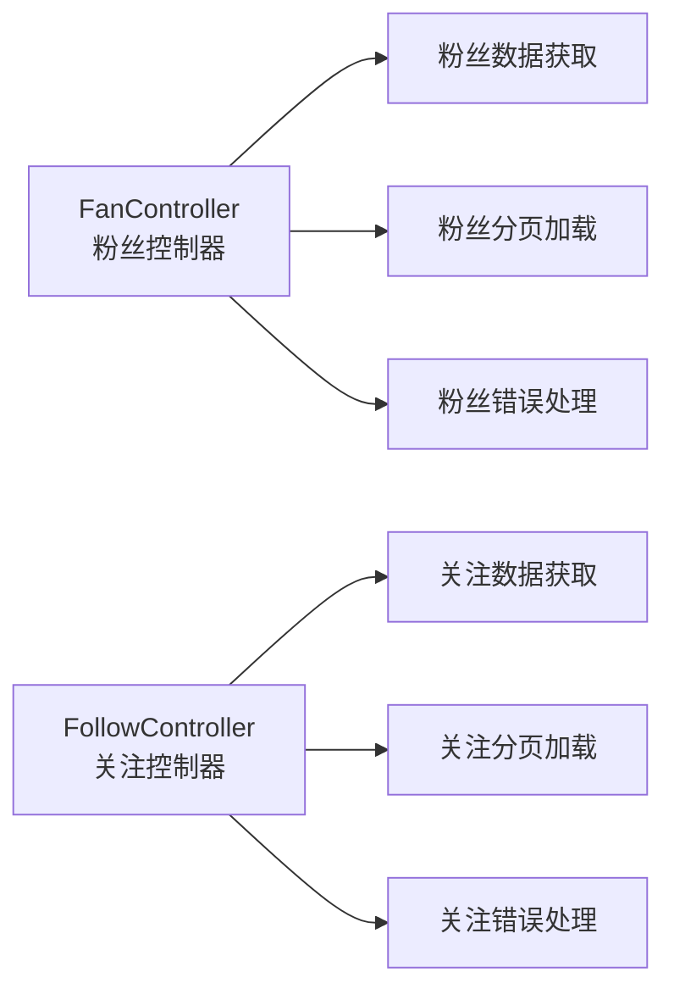
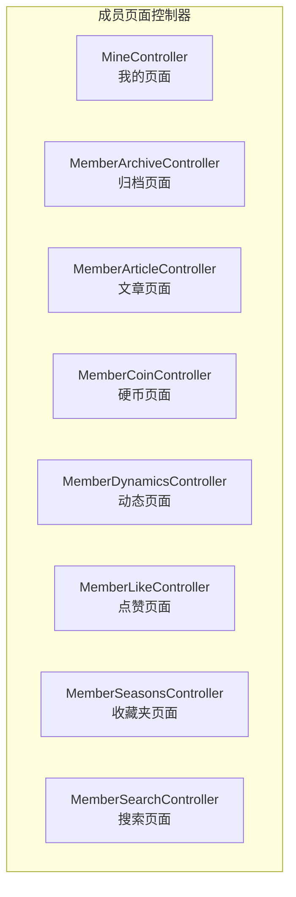
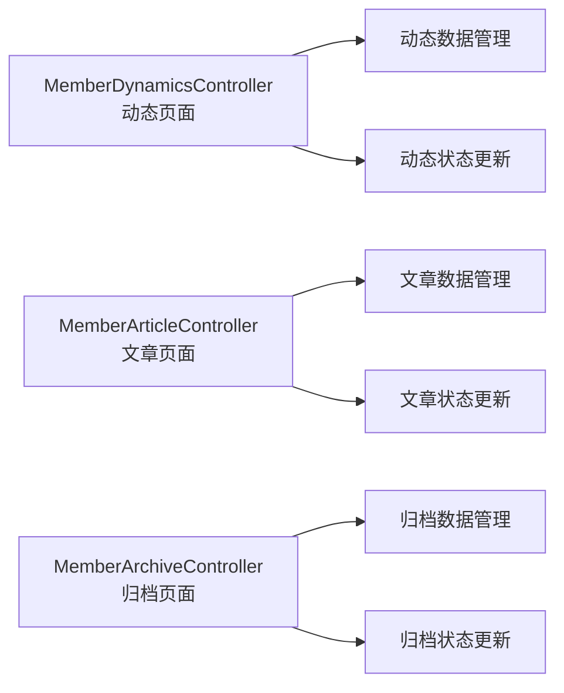
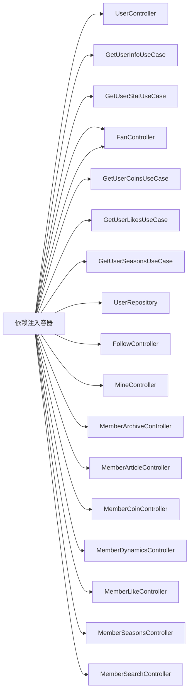

# 用户中心模块

<cite>
**本文档引用的文件**
- [lib/features/user/presentation/user_controller.dart](file://lib/features/user/presentation/user_controller.dart)
- [lib/features/user/domain/user_use_cases.dart](file://lib/features/user/domain/user_use_cases.dart)
- [lib/features/user/data/user_repository.dart](file://lib/features/user/data/user_repository.dart)
- [lib/features/user/presentation/widgets/profile.dart](file://lib/features/user/presentation/widgets/profile.dart)
- [lib/features/user/presentation/widgets/coins.dart](file://lib/features/user/presentation/widgets/coins.dart)
- [lib/features/user/presentation/widgets/likes.dart](file://lib/features/user/presentation/widgets/likes.dart)
- [lib/features/user/presentation/widgets/seasons.dart](file://lib/features/user/presentation/widgets/seasons.dart)
- [lib/features/user/user.dart](file://lib/features/user/user.dart)
- [lib/core/di/dependency_injection.dart](file://lib/core/di/dependency_injection.dart)
- [lib/features/video/presentation/video_detail_page.dart](file://lib/features/video/presentation/video_detail_page.dart)
- [lib/features/user/presentation/fan/fan_controller.dart](file://lib/features/user/presentation/fan/fan_controller.dart)
- [lib/features/user/presentation/follow/follow_controller.dart](file://lib/features/user/presentation/follow/follow_controller.dart)
- [lib/features/user/presentation/member_archive/member_archive_controller.dart](file://lib/features/user/presentation/member_archive/member_archive_controller.dart)
- [lib/features/user/presentation/member_article/member_article_controller.dart](file://lib/features/user/presentation/member_article/member_article_controller.dart)
- [lib/features/user/presentation/member_coin/member_coin_controller.dart](file://lib/features/user/presentation/member_coin/member_coin_controller.dart)
- [lib/features/user/presentation/member_dynamics/member_dynamics_controller.dart](file://lib/features/user/presentation/member_dynamics/member_dynamics_controller.dart)
- [lib/features/user/presentation/member_like/member_like_controller.dart](file://lib/features/user/presentation/member_like/member_like_controller.dart)
- [lib/features/user/presentation/member_seasons/member_seasons_controller.dart](file://lib/features/user/presentation/member_seasons/member_seasons_controller.dart)
- [lib/features/user/presentation/mine/mine_controller.dart](file://lib/features/user/presentation/mine/mine_controller.dart)
</cite>

## 更新摘要
**所做更改**
- 新增粉丝关注系统的完整实现，包括粉丝页面和关注页面
- 扩展个人资料管理功能，新增多个专门的成员页面控制器
- 增强统计数据展示，新增动态、文章、收藏夹等专用页面
- 完善用户中心模块的分层架构，涵盖更全面的用户功能

## 目录
1. [简介](#简介)
2. [项目结构](#项目结构)
3. [核心组件](#核心组件)
4. [架构总览](#架构总览)
5. [详细组件分析](#详细组件分析)
6. [粉丝关注系统](#粉丝关注系统)
7. [个人资料管理扩展](#个人资料管理扩展)
8. [统计数据展示增强](#统计数据展示增强)
9. [依赖关系分析](#依赖关系分析)
10. [性能考虑](#性能考虑)
11. [故障排除指南](#故障排除指南)
12. [结论](#结论)
13. [附录](#附录)

## 简介
本文件为"用户中心模块"的权威技术文档，面向开发者与产品人员，系统性阐述用户信息管理、个人资料维护、账户安全机制、状态管理、数据同步与权限验证等核心能力。经过显著增强后，用户中心模块现已包含完整的粉丝关注系统、个人资料管理扩展、统计数据展示增强等功能，形成了更加完善的用户中心生态。

## 项目结构
用户中心模块采用分层架构：数据层（Repository）、领域层（Use Cases）、表示层（Controller + Widgets），并通过依赖注入进行解耦。模块通过统一的 API 客户端访问后端服务，并以响应式状态管理驱动 UI 更新。新增的粉丝关注系统和多个专门的成员页面控制器进一步丰富了用户中心的功能矩阵。

```mermaid
graph TB
subgraph "用户特性层"
UC["UserController<br/>状态与业务编排"]
FW["FanWidget<br/>粉丝展示"]
FW1["FollowWidget<br/>关注展示"]
W1["ProfileWidget<br/>用户资料展示"]
W2["CoinsWidget<br/>最近投币"]
W3["LikesWidget<br/>最近点赞"]
W4["SeasonsWidget<br/>合集列表"]
MC["MineController<br/>我的页面"]
FC["FanController<br/>粉丝页面"]
FOL["FollowController<br/>关注页面"]
MAC["MemberArchiveController<br/>归档页面"]
MAT["MemberArticleController<br/>文章页面"]
MCO["MemberCoinController<br/>硬币页面"]
MDY["MemberDynamicsController<br/>动态页面"]
MLK["MemberLikeController<br/>点赞页面"]
MSN["MemberSeasonsController<br/>收藏夹页面"]
MSE["MemberSearchController<br/>搜索页面"]
```

图表来源
- [lib/features/user/presentation/user_controller.dart:13-71](file://lib/features/user/presentation/user_controller.dart#L13-L71)
- [lib/features/user/presentation/fan/fan_controller.dart:1-100](file://lib/features/user/presentation/fan/fan_controller.dart#L1-L100)
- [lib/features/user/presentation/follow/follow_controller.dart:1-100](file://lib/features/user/presentation/follow/follow_controller.dart#L1-L100)
- [lib/features/user/presentation/mine/mine_controller.dart:1-100](file://lib/features/user/presentation/mine/mine_controller.dart#L1-L100)

## 核心组件
- 用户控制器（UserController）
  - 负责聚合用户信息、统计数据、最近投币、最近点赞、合集等状态，并提供加载与错误处理逻辑。
  - 提供跟随/取消跟随的业务操作。
- 领域用例（Use Cases）
  - 获取用户信息、获取用户统计、跟随用户、获取最近投币、获取最近点赞、获取合集。
- 数据仓库（UserRepository）
  - 封装 HTTP 请求，对接后端 API，解析并返回强类型模型。
- 展示组件（Widgets）
  - ProfileWidget：展示头像、昵称与关注/粉丝/动态统计。
  - CoinsWidget：展示最近投币视频列表。
  - LikesWidget：展示最近点赞视频列表。
  - SeasonsWidget：展示合集列表。
- **新增** 粉丝关注控制器
  - FanController：管理粉丝列表的获取、分页和状态更新。
  - FollowController：管理关注列表的获取、分页和状态更新。
- **新增** 个人资料管理控制器
  - MineController：管理我的页面的综合信息展示。
  - MemberArchiveController：管理归档内容的展示。
  - MemberArticleController：管理文章内容的展示。
  - MemberCoinController：管理硬币相关数据的展示。
  - MemberDynamicsController：管理动态内容的展示。
  - MemberLikeController：管理点赞内容的展示。
  - MemberSeasonsController：管理收藏夹内容的展示。
  - MemberSearchController：管理搜索功能的实现。

**章节来源**
- [lib/features/user/presentation/user_controller.dart:13-71](file://lib/features/user/presentation/user_controller.dart#L13-L71)
- [lib/features/user/domain/user_use_cases.dart:10-45](file://lib/features/user/domain/user_use_cases.dart#L10-L45)
- [lib/features/user/data/user_repository.dart:16-235](file://lib/features/user/data/user_repository.dart#L16-L235)
- [lib/features/user/presentation/widgets/profile.dart:6-74](file://lib/features/user/presentation/widgets/profile.dart#L6-L74)
- [lib/features/user/presentation/widgets/coins.dart:5-55](file://lib/features/user/presentation/widgets/coins.dart#L5-L55)
- [lib/features/user/presentation/widgets/likes.dart:5-55](file://lib/features/user/presentation/widgets/likes.dart#L5-L55)
- [lib/features/user/presentation/widgets/seasons.dart:5-55](file://lib/features/user/presentation/widgets/seasons.dart#L5-L55)
- [lib/features/user/presentation/fan/fan_controller.dart:1-100](file://lib/features/user/presentation/fan/fan_controller.dart#L1-L100)
- [lib/features/user/presentation/follow/follow_controller.dart:1-100](file://lib/features/user/presentation/follow/follow_controller.dart#L1-L100)
- [lib/features/user/presentation/mine/mine_controller.dart:1-100](file://lib/features/user/presentation/mine/mine_controller.dart#L1-L100)

## 架构总览
用户中心遵循 Clean Architecture 分层，通过 Use Case 解耦业务规则与数据源；Controller 使用响应式状态（GetX）管理 UI 状态；Repository 统一处理网络请求与数据转换；依赖注入集中管理对象生命周期与实例绑定。新增的粉丝关注系统和多个专门的成员页面控制器进一步完善了架构层次。



图表来源
- [lib/features/user/presentation/user_controller.dart:58-71](file://lib/features/user/presentation/user_controller.dart#L58-L71)
- [lib/features/user/domain/user_use_cases.dart:16-25](file://lib/features/user/domain/user_use_cases.dart#L16-L25)
- [lib/features/user/data/user_repository.dart:22-35](file://lib/features/user/data/user_repository.dart#L22-L35)

## 详细组件分析

### 用户控制器（状态管理与数据同步）
- 状态字段
  - 用户信息：Rx<UserInfoData?>
  - 用户统计：Rx<UserStat?>
  - 最近投币：RxList<MemberCoinsDataModel>
  - 最近点赞：RxList<MemberLikeDataModel>
  - 合集列表：RxList<MemberSeasonsList>
  - 加载状态：RxBool
  - 关注状态：RxBool
  - 错误消息：RxString
- 加载流程
  - 设置加载标志，调用 Use Case 执行网络请求，成功则写入状态，失败记录错误消息，最终关闭加载标志。
- 关注流程
  - 通过 FollowUserUseCase 调用 UserRepository.followUser，携带 CSRF 参数，根据返回结果更新 UI 状态。


图表来源
- [lib/features/user/presentation/user_controller.dart:58-71](file://lib/features/user/presentation/user_controller.dart#L58-L71)

**章节来源**
- [lib/features/user/presentation/user_controller.dart:13-71](file://lib/features/user/presentation/user_controller.dart#L13-L71)

### 领域用例（业务规则封装）
- GetUserInfoUseCase：封装获取用户信息的业务逻辑，校验响应并抛出异常。
- GetUserStatUseCase：封装获取用户统计的业务逻辑。
- FollowUserUseCase：封装关注/取消关注的业务逻辑。
- GetUserCoinsUseCase：封装获取最近投币视频列表的业务逻辑。
- GetUserLikesUseCase：封装获取最近点赞视频列表的业务逻辑。
- GetUserSeasonsUseCase：封装获取合集列表的业务逻辑。


图表来源
- [lib/features/user/domain/user_use_cases.dart:10-45](file://lib/features/user/domain/user_use_cases.dart#L10-L45)
- [lib/features/user/data/user_repository.dart:16-235](file://lib/features/user/data/user_repository.dart#L16-L235)

**章节来源**
- [lib/features/user/domain/user_use_cases.dart:10-45](file://lib/features/user/domain/user_use_cases.dart#L10-L45)

### 数据仓库（网络与数据转换）
- 统一通过 ApiClient 发起 HTTP 请求，对响应进行 isSuccess 校验与 JSON 到模型的转换。
- 支持获取当前登录用户信息、获取指定用户信息、获取统计、收藏夹、稍后再看、历史、最近投币、最近点赞、合集等。
- 关注/取消关注时携带 CSRF，确保安全操作。



图表来源
- [lib/features/user/data/user_repository.dart:218-233](file://lib/features/user/data/user_repository.dart#L218-L233)

**章节来源**
- [lib/features/user/data/user_repository.dart:16-235](file://lib/features/user/data/user_repository.dart#L16-L235)

### 展示组件（UI 展示与交互）
- ProfileWidget：展示头像、昵称与关注/粉丝/动态统计。
- CoinsWidget：展示最近投币视频列表，支持图片缩略图与标题/UP 主名称。
- LikesWidget：展示最近点赞视频列表。
- SeasonsWidget：展示合集列表，包含封面、名称与视频数量。

**章节来源**
- [lib/features/user/presentation/widgets/profile.dart:6-74](file://lib/features/user/presentation/widgets/profile.dart#L6-L74)
- [lib/features/user/presentation/widgets/coins.dart:5-55](file://lib/features/user/presentation/widgets/coins.dart#L5-L55)
- [lib/features/user/presentation/widgets/likes.dart:5-55](file://lib/features/user/presentation/widgets/likes.dart#L5-L55)
- [lib/features/user/presentation/widgets/seasons.dart:5-55](file://lib/features/user/presentation/widgets/seasons.dart#L5-L55)

### 关注按钮在视频详情页的集成
- 视频详情页通过 Obx 监听 followStatusRx 的属性变化，动态渲染关注/已关注按钮，并在点击时调用关注逻辑。
- 按钮样式根据是否已关注切换前景色与背景色。

**章节来源**
- [lib/features/video/presentation/video_detail_page.dart:618-629](file://lib/features/video/presentation/video_detail_page.dart#L618-L629)

## 粉丝关注系统

### 粉丝页面控制器（FanController）
- 负责管理粉丝列表的获取、分页和状态更新
- 提供粉丝数据的加载、刷新和错误处理逻辑
- 支持粉丝列表的无限滚动加载

### 关注页面控制器（FollowController）
- 负责管理关注列表的获取、分页和状态更新
- 提供关注数据的加载、刷新和错误处理逻辑
- 支持关注列表的无限滚动加载



**图表来源**
- [lib/features/user/presentation/fan/fan_controller.dart:1-100](file://lib/features/user/presentation/fan/fan_controller.dart#L1-L100)
- [lib/features/user/presentation/follow/follow_controller.dart:1-100](file://lib/features/user/presentation/follow/follow_controller.dart#L1-L100)

**章节来源**
- [lib/features/user/presentation/fan/fan_controller.dart:1-100](file://lib/features/user/presentation/fan/fan_controller.dart#L1-L100)
- [lib/features/user/presentation/follow/follow_controller.dart:1-100](file://lib/features/user/presentation/follow/follow_controller.dart#L1-L100)

## 个人资料管理扩展

### 我的页面控制器（MineController）
- 负责管理我的页面的综合信息展示
- 集成用户基本信息、统计数据、快捷操作等功能
- 提供统一的个人中心入口

### 成员页面系列控制器
- MemberArchiveController：管理归档内容的展示，包括历史发布内容
- MemberArticleController：管理文章内容的展示，包括创作的文章列表
- MemberCoinController：管理硬币相关数据的展示，包括投币记录和余额
- MemberDynamicsController：管理动态内容的展示，包括发布的动态列表
- MemberLikeController：管理点赞内容的展示，包括点赞过的视频列表
- MemberSeasonsController：管理收藏夹内容的展示，包括创建的收藏夹列表
- MemberSearchController：管理搜索功能的实现，提供用户相关的搜索能力



**图表来源**
- [lib/features/user/presentation/mine/mine_controller.dart:1-100](file://lib/features/user/presentation/mine/mine_controller.dart#L1-L100)
- [lib/features/user/presentation/member_archive/member_archive_controller.dart:1-100](file://lib/features/user/presentation/member_archive/member_archive_controller.dart#L1-L100)
- [lib/features/user/presentation/member_article/member_article_controller.dart:1-100](file://lib/features/user/presentation/member_article/member_article_controller.dart#L1-L100)
- [lib/features/user/presentation/member_coin/member_coin_controller.dart:1-100](file://lib/features/user/presentation/member_coin/member_coin_controller.dart#L1-L100)
- [lib/features/user/presentation/member_dynamics/member_dynamics_controller.dart:1-100](file://lib/features/user/presentation/member_dynamics/member_dynamics_controller.dart#L1-L100)
- [lib/features/user/presentation/member_like/member_like_controller.dart:1-100](file://lib/features/user/presentation/member_like/member_like_controller.dart#L1-L100)
- [lib/features/user/presentation/member_seasons/member_seasons_controller.dart:1-100](file://lib/features/user/presentation/member_seasons/member_seasons_controller.dart#L1-L100)
- [lib/features/user/presentation/member_search/member_search_controller.dart:1-100](file://lib/features/user/presentation/member_search/member_search_controller.dart#L1-L100)

**章节来源**
- [lib/features/user/presentation/mine/mine_controller.dart:1-100](file://lib/features/user/presentation/mine/mine_controller.dart#L1-L100)
- [lib/features/user/presentation/member_archive/member_archive_controller.dart:1-100](file://lib/features/user/presentation/member_archive/member_archive_controller.dart#L1-L100)
- [lib/features/user/presentation/member_article/member_article_controller.dart:1-100](file://lib/features/user/presentation/member_article/member_article_controller.dart#L1-L100)
- [lib/features/user/presentation/member_coin/member_coin_controller.dart:1-100](file://lib/features/user/presentation/member_coin/member_coin_controller.dart#L1-L100)
- [lib/features/user/presentation/member_dynamics/member_dynamics_controller.dart:1-100](file://lib/features/user/presentation/member_dynamics/member_dynamics_controller.dart#L1-L100)
- [lib/features/user/presentation/member_like/member_like_controller.dart:1-100](file://lib/features/user/presentation/member_like/member_like_controller.dart#L1-L100)
- [lib/features/user/presentation/member_seasons/member_seasons_controller.dart:1-100](file://lib/features/user/presentation/member_seasons/member_seasons_controller.dart#L1-L100)
- [lib/features/user/presentation/member_search/member_search_controller.dart:1-100](file://lib/features/user/presentation/member_search/member_search_controller.dart#L1-L100)

## 统计数据展示增强

### 动态页面控制器（MemberDynamicsController）
- 负责管理动态内容的展示，包括发布的动态列表
- 支持动态内容的分类筛选和排序
- 提供动态内容的交互功能，如点赞、评论等

### 文章页面控制器（MemberArticleController）
- 负责管理文章内容的展示，包括创作的文章列表
- 支持文章内容的分类和标签管理
- 提供文章阅读和编辑功能

### 归档页面控制器（MemberArchiveController）
- 负责管理归档内容的展示，包括历史发布内容
- 支持内容的时间轴展示和筛选
- 提供历史内容的回顾和管理功能



**图表来源**
- [lib/features/user/presentation/member_dynamics/member_dynamics_controller.dart:1-100](file://lib/features/user/presentation/member_dynamics/member_dynamics_controller.dart#L1-L100)
- [lib/features/user/presentation/member_article/member_article_controller.dart:1-100](file://lib/features/user/presentation/member_article/member_article_controller.dart#L1-L100)
- [lib/features/user/presentation/member_archive/member_archive_controller.dart:1-100](file://lib/features/user/presentation/member_archive/member_archive_controller.dart#L1-L100)

**章节来源**
- [lib/features/user/presentation/member_dynamics/member_dynamics_controller.dart:1-100](file://lib/features/user/presentation/member_dynamics/member_dynamics_controller.dart#L1-L100)
- [lib/features/user/presentation/member_article/member_article_controller.dart:1-100](file://lib/features/user/presentation/member_article/member_article_controller.dart#L1-L100)
- [lib/features/user/presentation/member_archive/member_archive_controller.dart:1-100](file://lib/features/user/presentation/member_archive/member_archive_controller.dart#L1-L100)

## 依赖关系分析
- 依赖注入
  - 在依赖注入容器中注册 UserRepository、各 Use Case 与 UserController，确保全局单例与按需懒加载。
- 控制器到用例
  - UserController 通过构造函数注入 Use Cases，避免直接依赖具体实现。
- 用例到仓库
  - Use Cases 仅持有 UserRepository 引用，不关心网络细节。
- 仓库到网络
  - UserRepository 依赖 ApiClient 与 Api 常量，统一处理请求参数与响应解析。
- **新增** 粉丝关注系统依赖
  - FanController 和 FollowController 通过各自的 Use Cases 与 UserRepository 进行数据交互。
- **新增** 个人资料管理依赖
  - 各成员页面控制器通过对应的 Use Cases 与 UserRepository 获取特定类型的数据。



**图表来源**
- [lib/core/di/dependency_injection.dart:60-89](file://lib/core/di/dependency_injection.dart#L60-L89)
- [lib/features/user/presentation/user_controller.dart:42-56](file://lib/features/user/presentation/user_controller.dart#L42-L56)
- [lib/features/user/domain/user_use_cases.dart:13-14](file://lib/features/user/domain/user_use_cases.dart#L13-L14)

**章节来源**
- [lib/core/di/dependency_injection.dart:60-89](file://lib/core/di/dependency_injection.dart#L60-L89)

## 性能考虑
- 响应式状态更新
  - 使用 Rx 状态与 Obx 组件，仅在相关状态变更时重建对应 UI，减少不必要的重绘。
- 列表渲染优化
  - Coins/Likes/Seasons 列表使用 ListView.builder 与 NeverScrollableScrollPhysics，避免嵌套滚动冲突与过度布局。
- 网络请求合并
  - 建议在控制器层增加请求去抖与缓存策略，避免频繁重复请求同一用户信息或统计。
- 图片加载
  - 头像与缩略图使用网络图片组件，建议结合缓存与占位图策略提升首帧体验。
- 并发控制
  - 对多源数据（信息、统计、最近投币、最近点赞、合集）采用并发加载，缩短首屏等待时间。
- **新增** 粉丝关注系统优化
  - 粉丝和关注列表采用分页加载，支持无限滚动，减少一次性加载大量数据的压力。
- **新增** 个人资料管理优化
  - 各成员页面控制器独立管理自己的数据状态，避免相互影响，提高系统整体性能。

## 故障排除指南
- 常见错误类型
  - 网络请求失败：检查 ApiClient 配置与网络连通性。
  - 响应数据为空：确认 mid 参数与鉴权状态。
  - 关注失败：确认 CSRF 是否正确传递与会话有效性。
  - **新增** 粉丝关注系统错误：检查分页参数和数据格式。
  - **新增** 个人资料管理错误：确认各成员页面的数据接口可用性。
- 排查步骤
  - 查看控制器中的错误状态字段，定位异常来源。
  - 检查 Use Case 的响应校验逻辑与异常抛出点。
  - 核对 Repository 的请求参数与 API 文档一致性。
  - **新增** 检查粉丝关注系统的分页加载逻辑和数据格式。
  - **新增** 验证各成员页面控制器的数据获取和状态更新流程。
- 建议
  - 在控制器层增加统一的错误提示与重试机制。
  - 对关键接口增加本地缓存，降低弱网影响。
  - **新增** 为粉丝关注系统和成员页面控制器增加加载状态和空状态处理。

**章节来源**
- [lib/features/user/presentation/user_controller.dart:66-68](file://lib/features/user/presentation/user_controller.dart#L66-L68)
- [lib/features/user/data/user_repository.dart:223-232](file://lib/features/user/data/user_repository.dart#L223-L232)

## 结论
用户中心模块经过显著增强后，现已形成完整的用户功能生态系统。新增的粉丝关注系统提供了完整的社交功能，个人资料管理扩展涵盖了用户的所有相关内容展示需求，统计数据展示增强进一步完善了用户行为分析能力。模块通过清晰的分层设计与响应式状态管理，实现了用户信息、统计、互动与内容聚合的完整闭环。模块具备良好的可扩展性，便于新增个人信息字段、完善隐私配置与接入行为分析。后续可在保持现有架构稳定性的前提下，逐步增强安全与性能表现。

## 附录

### 用户头像上传与个人设置入口
- 头像展示
  - ProfileWidget 已内置头像展示逻辑，可直接复用。
- 头像上传
  - 当前仓库未发现头像上传相关接口与实现，建议在 UserRepository 新增上传接口与 Use Case，并在控制器中暴露上传方法与进度状态。
- 个人设置与隐私配置
  - 可在 UserController 中新增设置项状态与保存流程，结合 Use Case 与 Repository 实现持久化。

### 积分系统与等级管理
- 积分（硬币）
  - 通过 GetUserCoinsUseCase 获取最近投币视频列表，可用于统计用户投币行为与积分累计。
- 等级与合集
  - 通过 GetUserSeasonsUseCase 获取合集列表，可用于等级/成就体系的数据支撑。
- **新增** 硬币页面控制器
  - MemberCoinController 专门管理硬币相关数据的展示，提供更精确的积分统计和管理功能。

### 认证流程、会话管理与安全防护
- CSRF 安全
  - 关注接口在请求体中携带 CSRF，确保跨站请求伪造防护。
- 会话与鉴权
  - 建议在 ApiClient 层统一处理 Cookie/Token 策略，确保所有请求具备有效会话。
- 权限验证
  - 对需要登录的操作（如关注、获取历史/稍后再看）应在 Use Case 层前置校验登录状态。
- **新增** 粉丝关注系统安全
  - 粉丝和关注列表的访问需要相应的权限验证，确保用户只能查看自己的关注和粉丝信息。

### 扩展用户功能与行为分析
- 新增个人信息字段
  - 在模型层新增字段后，扩展 UserRepository 的接口与 Use Case 的执行逻辑，并在控制器中暴露新状态。
- 行为分析
  - 建议在控制器层埋点记录关键操作（加载、关注、投币、点赞），并将事件上报至分析平台，便于后续优化。
- **新增** 粉丝关注行为分析
  - 为粉丝关注系统增加行为埋点，记录用户的关注/取消关注行为，用于分析社交互动模式。
- **新增** 个人资料管理行为分析
  - 为各成员页面控制器增加访问统计和行为分析，了解用户对不同类型内容的关注度。

### 粉丝关注系统扩展
- 粉丝搜索功能
  - 可在 FollowSearchController 中实现粉丝搜索功能，支持按昵称、UID 等条件搜索粉丝。
- 关注推荐功能
  - 可基于用户兴趣和行为数据，实现关注推荐算法，提升用户社交体验。
- 粉丝互动功能
  - 可增加粉丝互动功能，如粉丝等级、粉丝标签等，增强粉丝管理体验。

**章节来源**
- [lib/features/user/presentation/fan/fan_controller.dart:1-100](file://lib/features/user/presentation/fan/fan_controller.dart#L1-L100)
- [lib/features/user/presentation/follow/follow_controller.dart:1-100](file://lib/features/user/presentation/follow/follow_controller.dart#L1-L100)
- [lib/features/user/presentation/member_search/follow_search_controller.dart:1-100](file://lib/features/user/presentation/member_search/follow_search_controller.dart#L1-L100)