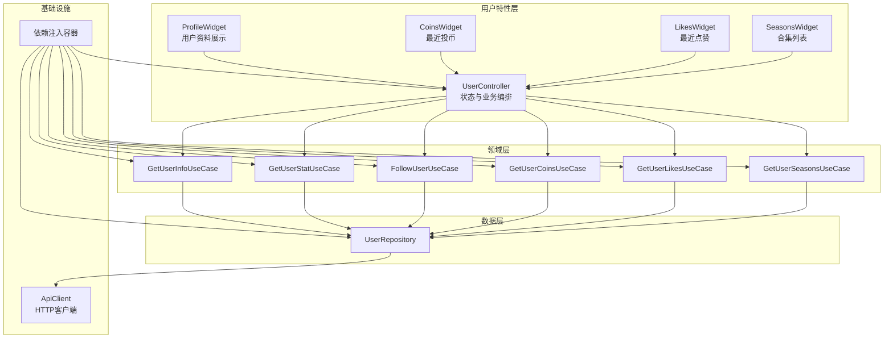
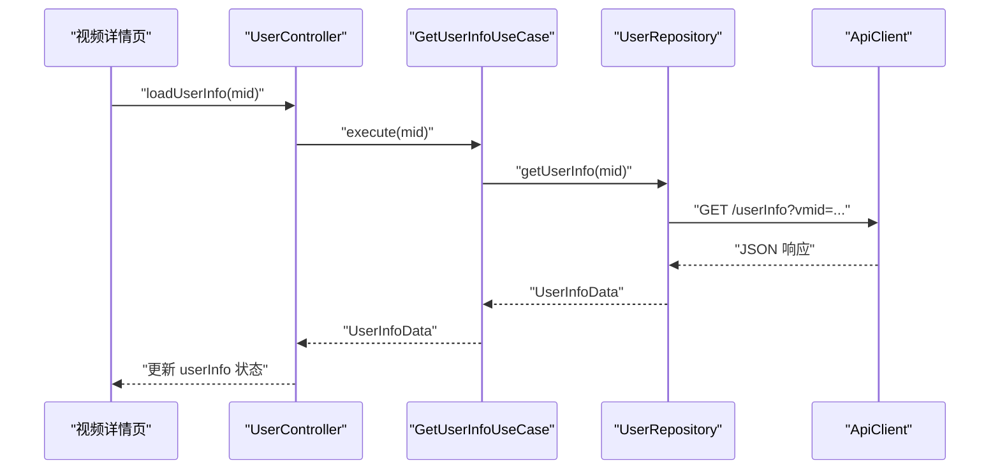
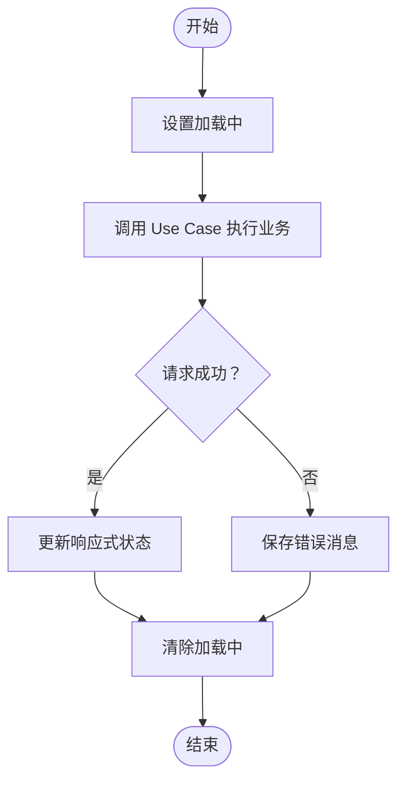
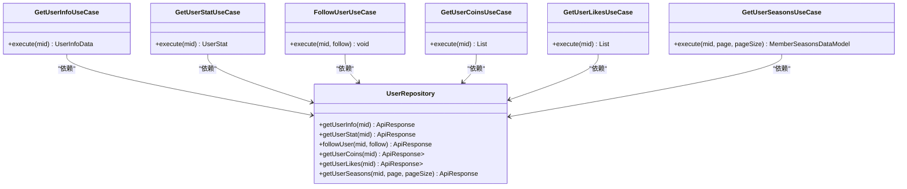
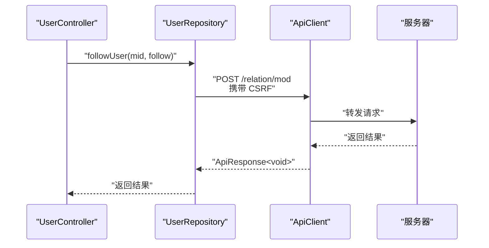
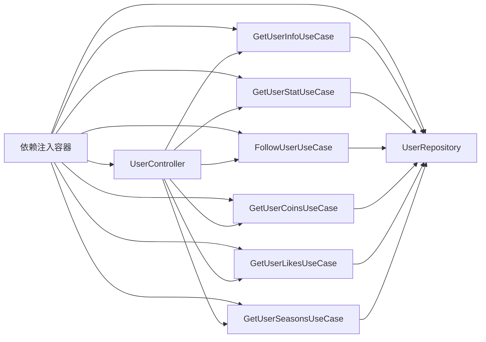

# 用户中心模块

<cite>
**本文档引用的文件**
- [lib/features/user/presentation/user_controller.dart](file://lib/features/user/presentation/user_controller.dart)
- [lib/features/user/domain/user_use_cases.dart](file://lib/features/user/domain/user_use_cases.dart)
- [lib/features/user/data/user_repository.dart](file://lib/features/user/data/user_repository.dart)
- [lib/features/user/presentation/widgets/profile.dart](file://lib/features/user/presentation/widgets/profile.dart)
- [lib/features/user/presentation/widgets/coins.dart](file://lib/features/user/presentation/widgets/coins.dart)
- [lib/features/user/presentation/widgets/likes.dart](file://lib/features/user/presentation/widgets/likes.dart)
- [lib/features/user/presentation/widgets/seasons.dart](file://lib/features/user/presentation/widgets/seasons.dart)
- [lib/features/user/user.dart](file://lib/features/user/user.dart)
- [lib/core/di/dependency_injection.dart](file://lib/core/di/dependency_injection.dart)
- [lib/features/video/presentation/video_detail_page.dart](file://lib/features/video/presentation/video_detail_page.dart)
</cite>

## 目录
1. [简介](#简介)
2. [项目结构](#项目结构)
3. [核心组件](#核心组件)
4. [架构总览](#架构总览)
5. [详细组件分析](#详细组件分析)
6. [依赖关系分析](#依赖关系分析)
7. [性能考虑](#性能考虑)
8. [故障排除指南](#故障排除指南)
9. [结论](#结论)
10. [附录](#附录)

## 简介
本文件为“用户中心模块”的权威技术文档，面向开发者与产品人员，系统性阐述用户信息管理、个人资料维护、账户安全机制、状态管理、数据同步与权限验证等核心能力。同时覆盖用户头像展示、个人设置入口、隐私配置接口、用户统计信息、积分（硬币）系统、等级与合集管理、认证与会话安全、以及可扩展性与行为分析建议。

## 项目结构
用户中心模块采用分层架构：数据层（Repository）、领域层（Use Cases）、表示层（Controller + Widgets），并通过依赖注入进行解耦。模块通过统一的 API 客户端访问后端服务，并以响应式状态管理驱动 UI 更新。

图表来源
- [lib/features/user/presentation/user_controller.dart:13-71](file://lib/features/user/presentation/user_controller.dart#L13-L71)
- [lib/features/user/domain/user_use_cases.dart:10-45](file://lib/features/user/domain/user_use_cases.dart#L10-L45)
- [lib/features/user/data/user_repository.dart:16-235](file://lib/features/user/data/user_repository.dart#L16-L235)
- [lib/core/di/dependency_injection.dart:60-89](file://lib/core/di/dependency_injection.dart#L60-L89)

章节来源
- [lib/features/user/user.dart:1-11](file://lib/features/user/user.dart#L1-L11)
- [lib/core/di/dependency_injection.dart:60-89](file://lib/core/di/dependency_injection.dart#L60-L89)

## 核心组件
- 用户控制器（UserController）
  - 负责聚合用户信息、统计数据、最近投币、最近点赞、合集等状态，并提供加载与错误处理逻辑。
  - 提供跟随/取消跟随的业务操作。
- 领域用例（Use Cases）
  - 获取用户信息、获取用户统计、跟随用户、获取最近投币、获取最近点赞、获取合集。
- 数据仓库（UserRepository）
  - 封装 HTTP 请求，对接后端 API，解析并返回强类型模型。
- 展示组件（Widgets）
  - ProfileWidget：展示头像、昵称与关注/粉丝/动态统计。
  - CoinsWidget：展示最近投币视频列表。
  - LikesWidget：展示最近点赞视频列表。
  - SeasonsWidget：展示合集列表。

章节来源
- [lib/features/user/presentation/user_controller.dart:13-71](file://lib/features/user/presentation/user_controller.dart#L13-L71)
- [lib/features/user/domain/user_use_cases.dart:10-45](file://lib/features/user/domain/user_use_cases.dart#L10-L45)
- [lib/features/user/data/user_repository.dart:16-235](file://lib/features/user/data/user_repository.dart#L16-L235)
- [lib/features/user/presentation/widgets/profile.dart:6-74](file://lib/features/user/presentation/widgets/profile.dart#L6-L74)
- [lib/features/user/presentation/widgets/coins.dart:5-55](file://lib/features/user/presentation/widgets/coins.dart#L5-L55)
- [lib/features/user/presentation/widgets/likes.dart:5-55](file://lib/features/user/presentation/widgets/likes.dart#L5-L55)
- [lib/features/user/presentation/widgets/seasons.dart:5-55](file://lib/features/user/presentation/widgets/seasons.dart#L5-L55)

## 架构总览
用户中心遵循 Clean Architecture 分层，通过 Use Case 解耦业务规则与数据源；Controller 使用响应式状态（GetX）管理 UI 状态；Repository 统一处理网络请求与数据转换；依赖注入集中管理对象生命周期与实例绑定。

图表来源
- [lib/features/user/presentation/user_controller.dart:58-71](file://lib/features/user/presentation/user_controller.dart#L58-L71)
- [lib/features/user/domain/user_use_cases.dart:16-25](file://lib/features/user/domain/user_use_cases.dart#L16-L25)
- [lib/features/user/data/user_repository.dart:22-35](file://lib/features/user/data/user_repository.dart#L22-L35)

## 详细组件分析

### 用户控制器（状态管理与数据同步）
- 状态字段
  - 用户信息：Rx<UserInfoData?>
  - 用户统计：Rx<UserStat?>
  - 最近投币：RxList<MemberCoinsDataModel>
  - 最近点赞：RxList<MemberLikeDataModel>
  - 合集列表：RxList<MemberSeasonsList>
  - 加载状态：RxBool
  - 关注状态：RxBool
  - 错误消息：RxString
- 加载流程
  - 设置加载标志，调用 Use Case 执行网络请求，成功则写入状态，失败记录错误消息，最终关闭加载标志。
- 关注流程
  - 通过 FollowUserUseCase 调用 UserRepository.followUser，携带 CSRF 参数，根据返回结果更新 UI 状态。

图表来源
- [lib/features/user/presentation/user_controller.dart:58-71](file://lib/features/user/presentation/user_controller.dart#L58-L71)

章节来源
- [lib/features/user/presentation/user_controller.dart:13-71](file://lib/features/user/presentation/user_controller.dart#L13-L71)

### 领域用例（业务规则封装）
- GetUserInfoUseCase：封装获取用户信息的业务逻辑，校验响应并抛出异常。
- GetUserStatUseCase：封装获取用户统计的业务逻辑。
- FollowUserUseCase：封装关注/取消关注的业务逻辑。
- GetUserCoinsUseCase：封装获取最近投币视频列表的业务逻辑。
- GetUserLikesUseCase：封装获取最近点赞视频列表的业务逻辑。
- GetUserSeasonsUseCase：封装获取合集列表的业务逻辑。

图表来源
- [lib/features/user/domain/user_use_cases.dart:10-45](file://lib/features/user/domain/user_use_cases.dart#L10-L45)
- [lib/features/user/data/user_repository.dart:16-235](file://lib/features/user/data/user_repository.dart#L16-L235)

章节来源
- [lib/features/user/domain/user_use_cases.dart:10-45](file://lib/features/user/domain/user_use_cases.dart#L10-L45)

### 数据仓库（网络与数据转换）
- 统一通过 ApiClient 发起 HTTP 请求，对响应进行 isSuccess 校验与 JSON 到模型的转换。
- 支持获取当前登录用户信息、获取指定用户信息、获取统计、收藏夹、稍后再看、历史、最近投币、最近点赞、合集等。
- 关注/取消关注时携带 CSRF，确保安全操作。

图表来源
- [lib/features/user/data/user_repository.dart:218-233](file://lib/features/user/data/user_repository.dart#L218-L233)

章节来源
- [lib/features/user/data/user_repository.dart:16-235](file://lib/features/user/data/user_repository.dart#L16-L235)

### 展示组件（UI 展示与交互）
- ProfileWidget：展示头像、昵称与关注/粉丝/动态统计。
- CoinsWidget：展示最近投币视频列表，支持图片缩略图与标题/UP 主名称。
- LikesWidget：展示最近点赞视频列表。
- SeasonsWidget：展示合集列表，包含封面、名称与视频数量。

章节来源
- [lib/features/user/presentation/widgets/profile.dart:6-74](file://lib/features/user/presentation/widgets/profile.dart#L6-L74)
- [lib/features/user/presentation/widgets/coins.dart:5-55](file://lib/features/user/presentation/widgets/coins.dart#L5-L55)
- [lib/features/user/presentation/widgets/likes.dart:5-55](file://lib/features/user/presentation/widgets/likes.dart#L5-L55)
- [lib/features/user/presentation/widgets/seasons.dart:5-55](file://lib/features/user/presentation/widgets/seasons.dart#L5-L55)

### 关注按钮在视频详情页的集成
- 视频详情页通过 Obx 监听 followStatusRx 的属性变化，动态渲染关注/已关注按钮，并在点击时调用关注逻辑。
- 按钮样式根据是否已关注切换前景色与背景色。

章节来源
- [lib/features/video/presentation/video_detail_page.dart:618-629](file://lib/features/video/presentation/video_detail_page.dart#L618-L629)

## 依赖关系分析
- 依赖注入
  - 在依赖注入容器中注册 UserRepository、各 Use Case 与 UserController，确保全局单例与按需懒加载。
- 控制器到用例
  - UserController 通过构造函数注入 Use Cases，避免直接依赖具体实现。
- 用例到仓库
  - Use Cases 仅持有 UserRepository 引用，不关心网络细节。
- 仓库到网络
  - UserRepository 依赖 ApiClient 与 Api 常量，统一处理请求参数与响应解析。

图表来源
- [lib/core/di/dependency_injection.dart:60-89](file://lib/core/di/dependency_injection.dart#L60-L89)
- [lib/features/user/presentation/user_controller.dart:42-56](file://lib/features/user/presentation/user_controller.dart#L42-L56)
- [lib/features/user/domain/user_use_cases.dart:13-14](file://lib/features/user/domain/user_use_cases.dart#L13-L14)

章节来源
- [lib/core/di/dependency_injection.dart:60-89](file://lib/core/di/dependency_injection.dart#L60-L89)

## 性能考虑
- 响应式状态更新
  - 使用 Rx 状态与 Obx 组件，仅在相关状态变更时重建对应 UI，减少不必要的重绘。
- 列表渲染优化
  - Coins/Likes/Seasons 列表使用 ListView.builder 与 NeverScrollableScrollPhysics，避免嵌套滚动冲突与过度布局。
- 网络请求合并
  - 建议在控制器层增加请求去抖与缓存策略，避免频繁重复请求同一用户信息或统计。
- 图片加载
  - 头像与缩略图使用网络图片组件，建议结合缓存与占位图策略提升首帧体验。
- 并发控制
  - 对多源数据（信息、统计、最近投币、最近点赞、合集）采用并发加载，缩短首屏等待时间。

## 故障排除指南
- 常见错误类型
  - 网络请求失败：检查 ApiClient 配置与网络连通性。
  - 响应数据为空：确认 mid 参数与鉴权状态。
  - 关注失败：确认 CSRF 是否正确传递与会话有效性。
- 排查步骤
  - 查看控制器中的错误状态字段，定位异常来源。
  - 检查 Use Case 的响应校验逻辑与异常抛出点。
  - 核对 Repository 的请求参数与 API 文档一致性。
- 建议
  - 在控制器层增加统一的错误提示与重试机制。
  - 对关键接口增加本地缓存，降低弱网影响。

章节来源
- [lib/features/user/presentation/user_controller.dart:66-68](file://lib/features/user/presentation/user_controller.dart#L66-L68)
- [lib/features/user/data/user_repository.dart:223-232](file://lib/features/user/data/user_repository.dart#L223-L232)

## 结论
用户中心模块通过清晰的分层设计与响应式状态管理，实现了用户信息、统计、互动与内容聚合的完整闭环。模块具备良好的可扩展性，便于新增个人信息字段、完善隐私配置与接入行为分析。后续可在保持现有架构稳定性的前提下，逐步增强安全与性能表现。

## 附录

### 用户头像上传与个人设置入口
- 头像展示
  - ProfileWidget 已内置头像展示逻辑，可直接复用。
- 头像上传
  - 当前仓库未发现头像上传相关接口与实现，建议在 UserRepository 新增上传接口与 Use Case，并在控制器中暴露上传方法与进度状态。
- 个人设置与隐私配置
  - 可在 UserController 中新增设置项状态与保存流程，结合 Use Case 与 Repository 实现持久化。

### 积分系统与等级管理
- 积分（硬币）
  - 通过 GetUserCoinsUseCase 获取最近投币视频列表，可用于统计用户投币行为与积分累计。
- 等级与合集
  - 通过 GetUserSeasonsUseCase 获取合集列表，可用于等级/成就体系的数据支撑。

### 认证流程、会话管理与安全防护
- CSRF 安全
  - 关注接口在请求体中携带 CSRF，确保跨站请求伪造防护。
- 会话与鉴权
  - 建议在 ApiClient 层统一处理 Cookie/Token 策略，确保所有请求具备有效会话。
- 权限验证
  - 对需要登录的操作（如关注、获取历史/稍后再看）应在 Use Case 层前置校验登录状态。

### 扩展用户功能与行为分析
- 新增个人信息字段
  - 在模型层新增字段后，扩展 UserRepository 的接口与 Use Case 的执行逻辑，并在控制器中暴露新状态。
- 行为分析
  - 建议在控制器层埋点记录关键操作（加载、关注、投币、点赞），并将事件上报至分析平台，便于后续优化。