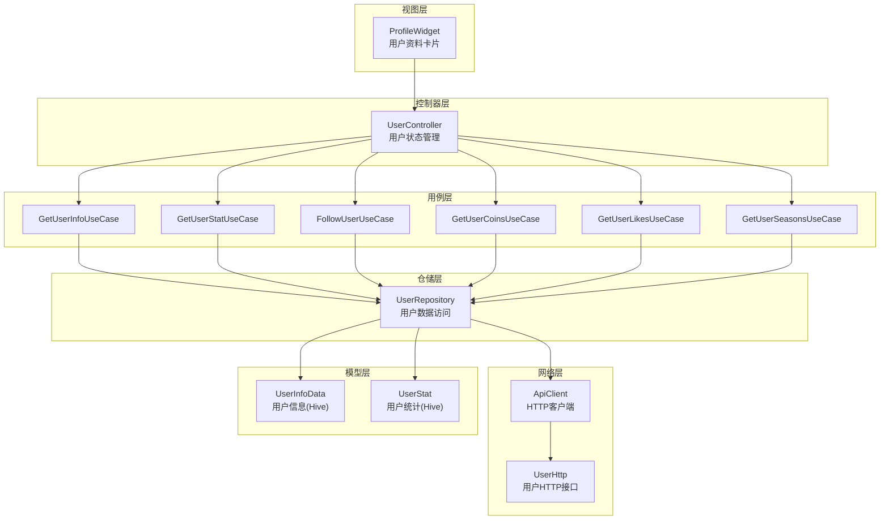
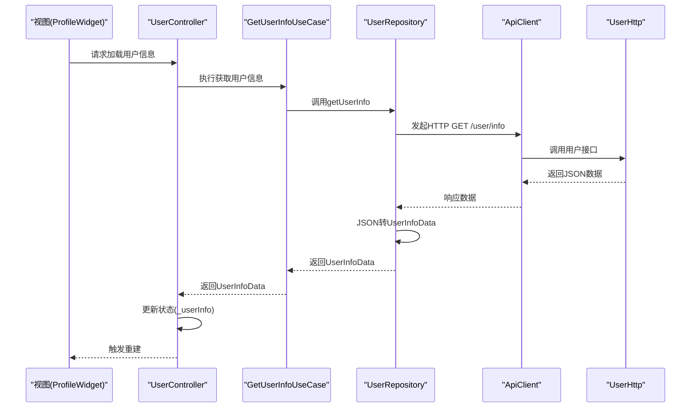
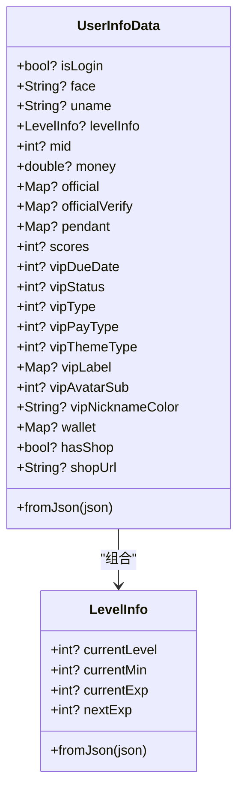
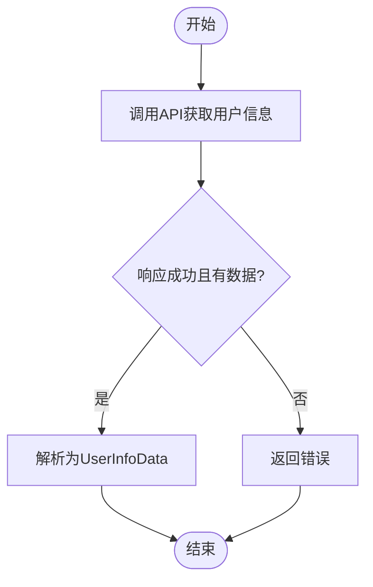
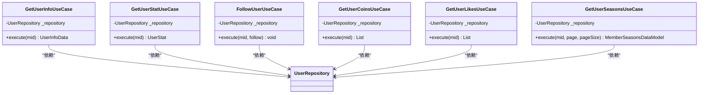
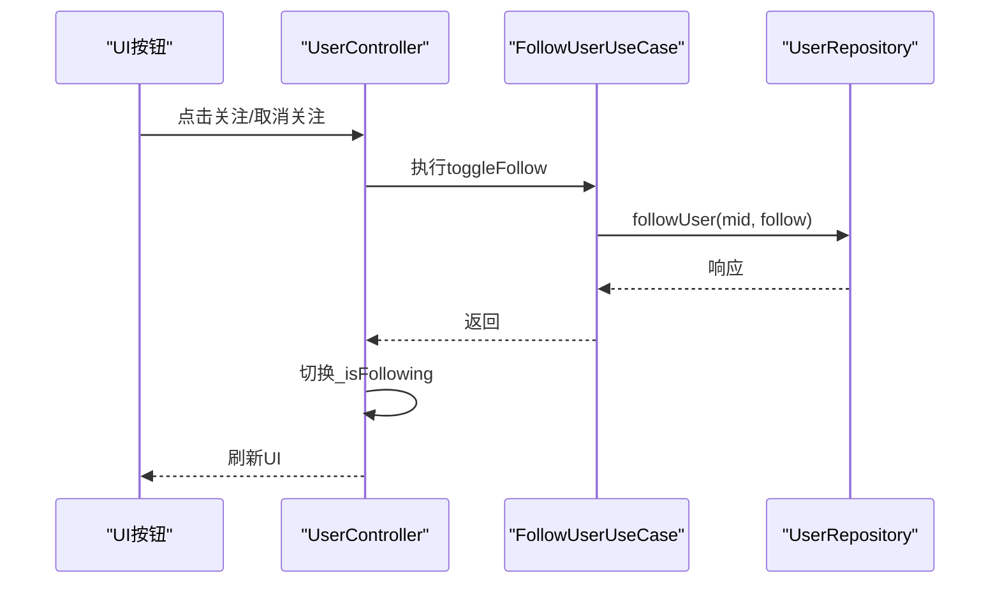
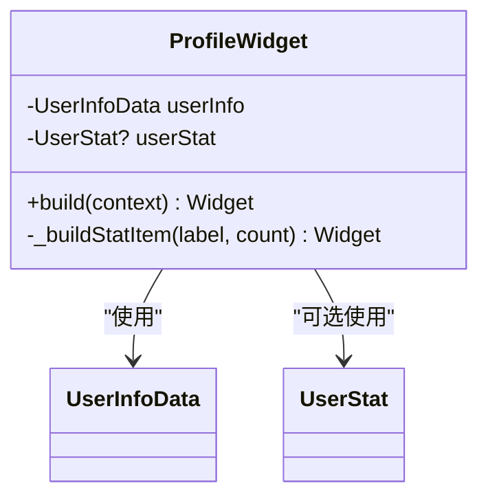
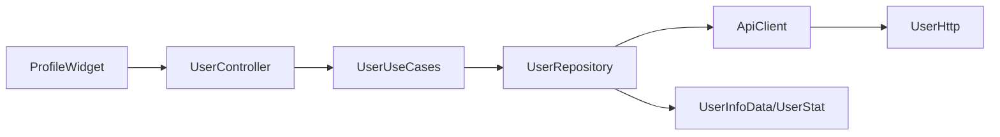

# 用户信息管理

<cite>
**本文引用的文件**
- [lib/models/user/info.dart](file://lib/models/user/info.dart)
- [lib/features/user/data/user_repository.dart](file://lib/features/user/data/user_repository.dart)
- [lib/features/user/domain/user_use_cases.dart](file://lib/features/user/domain/user_use_cases.dart)
- [lib/features/user/presentation/user_controller.dart](file://lib/features/user/presentation/user_controller.dart)
- [lib/features/user/presentation/widgets/profile.dart](file://lib/features/user/presentation/widgets/profile.dart)
- [lib/http/user.dart](file://lib/http/user.dart)
- [lib/http/api.dart](file://lib/http/api.dart)
- [lib/core/network/api_client.dart](file://lib/core/network/api_client.dart)
- [lib/pages/member/index.dart](file://lib/pages/member/index.dart)
- [lib/pages/member/view.dart](file://lib/pages/member/view.dart)
- [lib/pages/member/controller.dart](file://lib/pages/member/controller.dart)
- [lib/models/user/stat.dart](file://lib/models/user/stat.dart)
- [lib/models/user/history.dart](file://lib/models/user/history.dart)
- [lib/models/user/fav_detail.dart](file://lib/models/user/fav_detail.dart)
- [lib/models/user/fav_folder.dart](file://lib/models/user/fav_folder.dart)
- [lib/models/member/coin.dart](file://lib/models/member/coin.dart)
- [lib/models/member/like.dart](file://lib/models/member/like.dart)
- [lib/models/member/seasons.dart](file://lib/models/member/seasons.dart)
</cite>

## 目录
1. [引言](#引言)
2. [项目结构](#项目结构)
3. [核心组件](#核心组件)
4. [架构总览](#架构总览)
5. [详细组件分析](#详细组件分析)
6. [依赖关系分析](#依赖关系分析)
7. [性能考虑](#性能考虑)
8. [故障排查指南](#故障排查指南)
9. [结论](#结论)
10. [附录](#附录)

## 引言
本文件系统性阐述用户信息管理功能的设计与实现，覆盖用户基本信息的获取、展示与交互；用户头像显示、昵称展示等基础能力；以及围绕用户数据的验证、存储、同步、缓存、离线编辑与冲突处理的策略。同时给出隐私设置、公开程度控制与数据保护的实现要点，并提供扩展用户信息字段、新增个人属性与数据迁移的实践建议。

## 项目结构
用户信息相关代码采用“模型-仓储-用例-控制器-视图”的分层组织，遵循领域驱动设计与Clean Architecture思想：
- 模型层：定义用户信息与统计的数据结构（Hive序列化）。
- 仓储层：封装HTTP请求与API调用，负责数据获取与转换。
- 用例层：封装业务用例，屏蔽仓储细节。
- 控制器层：管理状态与生命周期，协调用例执行。
- 视图层：渲染用户资料卡片与统计数据。

图表来源
- [lib/features/user/presentation/widgets/profile.dart:1-74](file://lib/features/user/presentation/widgets/profile.dart#L1-L74)
- [lib/features/user/presentation/user_controller.dart:1-146](file://lib/features/user/presentation/user_controller.dart#L1-L146)
- [lib/features/user/domain/user_use_cases.dart:1-134](file://lib/features/user/domain/user_use_cases.dart#L1-L134)
- [lib/features/user/data/user_repository.dart:1-235](file://lib/features/user/data/user_repository.dart#L1-L235)
- [lib/core/network/api_client.dart](file://lib/core/network/api_client.dart)
- [lib/http/user.dart](file://lib/http/user.dart)
- [lib/models/user/info.dart:1-137](file://lib/models/user/info.dart#L1-L137)
- [lib/models/user/stat.dart](file://lib/models/user/stat.dart)

章节来源
- [lib/features/user/presentation/widgets/profile.dart:1-74](file://lib/features/user/presentation/widgets/profile.dart#L1-L74)
- [lib/features/user/presentation/user_controller.dart:1-146](file://lib/features/user/presentation/user_controller.dart#L1-L146)
- [lib/features/user/domain/user_use_cases.dart:1-134](file://lib/features/user/domain/user_use_cases.dart#L1-L134)
- [lib/features/user/data/user_repository.dart:1-235](file://lib/features/user/data/user_repository.dart#L1-L235)

## 核心组件
- 用户信息模型（Hive序列化）
  - 用户信息模型包含登录态、头像、等级、昵称、VIP状态、钱包等字段，并提供fromJson构造。
  - 等级信息模型包含当前等级、经验等字段，支持fromJson构造。
- 用户仓储
  - 提供获取用户信息、统计、收藏夹、稍后再看、历史、最近投币/点赞视频、会员番剧等接口。
  - 统一封装HTTP请求与响应转换。
- 用户用例
  - 封装具体业务场景：获取用户信息、获取统计、关注/取消关注、获取最近投币/点赞视频、获取会员番剧。
- 用户控制器
  - 管理用户信息、统计、关注状态、加载与错误状态，协调用例执行。
- 资料卡片组件
  - 展示头像、昵称与关注/粉丝/动态等统计数据。

章节来源
- [lib/models/user/info.dart:1-137](file://lib/models/user/info.dart#L1-L137)
- [lib/features/user/data/user_repository.dart:1-235](file://lib/features/user/data/user_repository.dart#L1-L235)
- [lib/features/user/domain/user_use_cases.dart:1-134](file://lib/features/user/domain/user_use_cases.dart#L1-L134)
- [lib/features/user/presentation/user_controller.dart:1-146](file://lib/features/user/presentation/user_controller.dart#L1-L146)
- [lib/features/user/presentation/widgets/profile.dart:1-74](file://lib/features/user/presentation/widgets/profile.dart#L1-L74)

## 架构总览
用户信息管理遵循“表现层-控制器-用例-仓储-网络-模型”的分层架构，数据流从网络层经仓储层转换为模型，再由控制器管理状态，最终由视图渲染。

图表来源
- [lib/features/user/presentation/widgets/profile.dart:1-74](file://lib/features/user/presentation/widgets/profile.dart#L1-L74)
- [lib/features/user/presentation/user_controller.dart:1-146](file://lib/features/user/presentation/user_controller.dart#L1-L146)
- [lib/features/user/domain/user_use_cases.dart:1-26](file://lib/features/user/domain/user_use_cases.dart#L1-L26)
- [lib/features/user/data/user_repository.dart:22-49](file://lib/features/user/data/user_repository.dart#L22-L49)
- [lib/core/network/api_client.dart](file://lib/core/network/api_client.dart)
- [lib/http/user.dart](file://lib/http/user.dart)

## 详细组件分析

### 用户信息模型与序列化
- UserInfoData
  - 字段涵盖登录态、头像URL、昵称、等级、邮箱/手机认证、VIP状态、钱包、商店等。
  - 支持fromJson构造，便于从HTTP响应或本地存储恢复。
- LevelInfo
  - 当前等级、经验区间等，支持fromJson构造。
- Hive注解
  - 使用HiveType/HiveField进行类型标识与字段映射，便于本地持久化与快速读写。

图表来源
- [lib/models/user/info.dart:5-137](file://lib/models/user/info.dart#L5-L137)

章节来源
- [lib/models/user/info.dart:1-137](file://lib/models/user/info.dart#L1-L137)

### 用户仓储与数据获取
- 获取用户信息
  - 支持按mid查询或当前登录用户，默认路径为用户信息接口。
  - 成功时将JSON转换为UserInfoData对象。
- 获取用户统计
  - 调用用户统计接口，返回UserStat对象。
- 关注/取消关注
  - 通过关系操作接口提交act=1/2与CSRF令牌。
- 其他数据
  - 收藏夹、收藏夹详情、稍后再看、历史、最近投币/点赞视频、会员番剧等均通过对应接口获取。

图表来源
- [lib/features/user/data/user_repository.dart:22-49](file://lib/features/user/data/user_repository.dart#L22-L49)

章节来源
- [lib/features/user/data/user_repository.dart:1-235](file://lib/features/user/data/user_repository.dart#L1-L235)

### 用户用例与业务编排
- GetUserInfoUseCase
  - 调用UserRepository.getUserInfo，异常时抛出错误。
- GetUserStatUseCase
  - 调用UserRepository.getUserStat，异常时抛出错误。
- FollowUserUseCase
  - 调用UserRepository.followUser，失败时抛出错误。
- GetUserCoinsUseCase / GetUserLikesUseCase / GetUserSeasonsUseCase
  - 分别获取最近投币/点赞视频与会员番剧列表，异常时抛出错误。

图表来源
- [lib/features/user/domain/user_use_cases.dart:1-134](file://lib/features/user/domain/user_use_cases.dart#L1-L134)

章节来源
- [lib/features/user/domain/user_use_cases.dart:1-134](file://lib/features/user/domain/user_use_cases.dart#L1-L134)

### 用户控制器与状态管理
- 状态字段
  - 用户信息、统计、最近投币/点赞视频、会员番剧列表、加载中、关注状态、错误信息。
- 加载与错误处理
  - 在每次加载前设置isLoading=true，捕获异常设置error，finally统一关闭loading。
- 关注切换
  - 调用FollowUserUseCase，成功后翻转关注状态。
- 数据装载
  - 分别调用各用例加载用户信息、统计、投币/点赞视频、会员番剧。

图表来源
- [lib/features/user/presentation/user_controller.dart:88-99](file://lib/features/user/presentation/user_controller.dart#L88-L99)
- [lib/features/user/domain/user_use_cases.dart:47-68](file://lib/features/user/domain/user_use_cases.dart#L47-L68)
- [lib/features/user/data/user_repository.dart:218-233](file://lib/features/user/data/user_repository.dart#L218-L233)

章节来源
- [lib/features/user/presentation/user_controller.dart:1-146](file://lib/features/user/presentation/user_controller.dart#L1-L146)

### 资料卡片组件
- 展示头像与昵称，支持可选显示关注/粉丝/动态等统计。
- 头像来源于用户信息模型的face字段，昵称来源于uname字段。

图表来源
- [lib/features/user/presentation/widgets/profile.dart:1-74](file://lib/features/user/presentation/widgets/profile.dart#L1-L74)

章节来源
- [lib/features/user/presentation/widgets/profile.dart:1-74](file://lib/features/user/presentation/widgets/profile.dart#L1-L74)

### 用户页面与集成
- 会员页（member）
  - 包含用户信息、收藏夹、历史、投币/点赞视频、会员番剧等子页面与控制器。
  - 与用户信息管理功能紧密耦合，复用UserInfoData/UserStat等模型。

章节来源
- [lib/pages/member/index.dart](file://lib/pages/member/index.dart)
- [lib/pages/member/view.dart](file://lib/pages/member/view.dart)
- [lib/pages/member/controller.dart](file://lib/pages/member/controller.dart)

## 依赖关系分析
- 组件内聚与耦合
  - 控制器对用例强依赖，用例对仓储强依赖，仓储对网络层强依赖，模型独立于上层。
- 外部依赖
  - 网络层依赖ApiClient与具体HTTP接口类。
  - 模型依赖Hive进行序列化。
- 可能的循环依赖
  - 当前结构清晰，未见循环依赖迹象。

图表来源
- [lib/features/user/presentation/widgets/profile.dart:1-74](file://lib/features/user/presentation/widgets/profile.dart#L1-L74)
- [lib/features/user/presentation/user_controller.dart:1-146](file://lib/features/user/presentation/user_controller.dart#L1-L146)
- [lib/features/user/domain/user_use_cases.dart:1-134](file://lib/features/user/domain/user_use_cases.dart#L1-L134)
- [lib/features/user/data/user_repository.dart:1-235](file://lib/features/user/data/user_repository.dart#L1-L235)
- [lib/core/network/api_client.dart](file://lib/core/network/api_client.dart)
- [lib/http/user.dart](file://lib/http/user.dart)
- [lib/models/user/info.dart:1-137](file://lib/models/user/info.dart#L1-L137)
- [lib/models/user/stat.dart](file://lib/models/user/stat.dart)

章节来源
- [lib/features/user/data/user_repository.dart:1-235](file://lib/features/user/data/user_repository.dart#L1-L235)
- [lib/features/user/domain/user_use_cases.dart:1-134](file://lib/features/user/domain/user_use_cases.dart#L1-L134)
- [lib/features/user/presentation/user_controller.dart:1-146](file://lib/features/user/presentation/user_controller.dart#L1-L146)

## 性能考虑
- 网络请求
  - 合理使用分页参数（如收藏夹、历史、番剧），避免一次性拉取大量数据。
  - 对频繁访问的用户信息与统计进行缓存，减少重复请求。
- 序列化与存储
  - 模型已使用Hive序列化，建议在仓储层增加本地缓存策略，优先读取缓存，异步刷新。
- UI渲染
  - 使用响应式状态（GetX）仅在必要时重建，避免全量重绘。
- 离线与冲突
  - 对于需要编辑的字段，采用本地草稿+冲突合并策略；对只读字段（头像、昵称）优先使用缓存。

## 故障排查指南
- 常见错误
  - 网络请求失败：检查ApiClient配置与UserHttp接口路径。
  - JSON解析失败：确认响应结构与模型字段一致，必要时增加容错处理。
  - 关注操作失败：确认CSRF令牌正确生成与携带。
- 排查步骤
  - 在控制器中捕获异常并记录错误信息，定位具体用例与仓储方法。
  - 检查API返回码与消息，核对参数与鉴权信息。
  - 对模型转换失败的情况，打印原始JSON以辅助诊断。

章节来源
- [lib/features/user/presentation/user_controller.dart:58-71](file://lib/features/user/presentation/user_controller.dart#L58-L71)
- [lib/features/user/presentation/user_controller.dart:88-99](file://lib/features/user/presentation/user_controller.dart#L88-L99)
- [lib/features/user/data/user_repository.dart:218-233](file://lib/features/user/data/user_repository.dart#L218-L233)

## 结论
用户信息管理功能以清晰的分层架构实现，具备良好的可维护性与扩展性。通过模型、仓储、用例与控制器的职责分离，实现了用户信息的获取、展示与交互。建议后续在以下方面持续优化：完善本地缓存与离线编辑、增强数据校验与错误处理、细化隐私与公开度控制，并提供便捷的字段扩展与迁移方案。

## 附录

### 用户信息字段与验证规则
- 字段清单（节选）
  - 登录态、头像URL、昵称、等级信息、mid、钱包、VIP状态、商店信息等。
- 验证规则建议
  - 头像URL：非空校验、URL格式校验。
  - 昵称：长度限制、字符集限制、唯一性校验（若平台要求）。
  - VIP状态：数值范围校验（类型、等级、到期时间）。
  - 钱包：金额类型校验与精度控制。
- 存储策略
  - 使用Hive进行本地持久化，关键字段建立索引，定期清理过期数据。
- 同步机制
  - 定时刷新与事件驱动刷新结合；网络可用时优先同步远端最新值。

章节来源
- [lib/models/user/info.dart:5-137](file://lib/models/user/info.dart#L5-L137)

### 头像上传与昵称修改流程
- 头像上传
  - 选择图片 -> 上传到服务端 -> 获取新URL -> 更新UserInfoData.face -> 刷新UI。
- 昵称修改
  - 输入校验 -> 提交修改请求 -> 成功后更新UserInfoData.uname -> 刷新UI。
- 冲突处理
  - 若网络延迟导致并发修改，采用“最后提交获胜”或“合并策略”，并在UI提示冲突。

（本小节为概念性流程，不直接对应具体源码）

### 用户数据缓存、离线编辑与冲突解决
- 缓存策略
  - LRU缓存用户信息与统计；热点数据驻留内存；冷数据落盘。
- 离线编辑
  - 对可编辑字段（如昵称）允许本地草稿，联网后自动同步。
- 冲突解决
  - 时间戳优先；或基于版本号；或用户确认合并。

（本小节为通用实践，不直接对应具体源码）

### 隐私设置、公开程度控制与数据保护
- 隐私设置
  - 头像、昵称、简介等字段的可见范围分级（仅自己、粉丝、所有人）。
- 公开程度控制
  - 通过权限位或开关字段控制字段是否对外展示。
- 数据保护
  - 对敏感字段（如mid、钱包）进行最小化暴露；传输加密；本地加密存储。

（本小节为通用实践，不直接对应具体源码）

### 扩展用户信息字段与迁移
- 新增字段
  - 在模型中添加字段与Hive注解；在fromJson中兼容旧版本。
- 迁移策略
  - 版本号控制；向后兼容；默认值填充；批量回填脚本。
- 用例与仓储适配
  - 在UserRepository与相关用例中增加新字段的读写逻辑。

章节来源
- [lib/models/user/info.dart:5-137](file://lib/models/user/info.dart#L5-L137)
- [lib/features/user/data/user_repository.dart:22-49](file://lib/features/user/data/user_repository.dart#L22-L49)