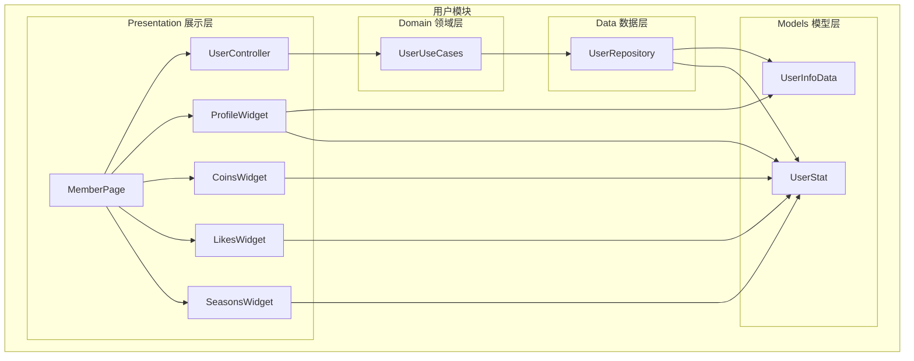
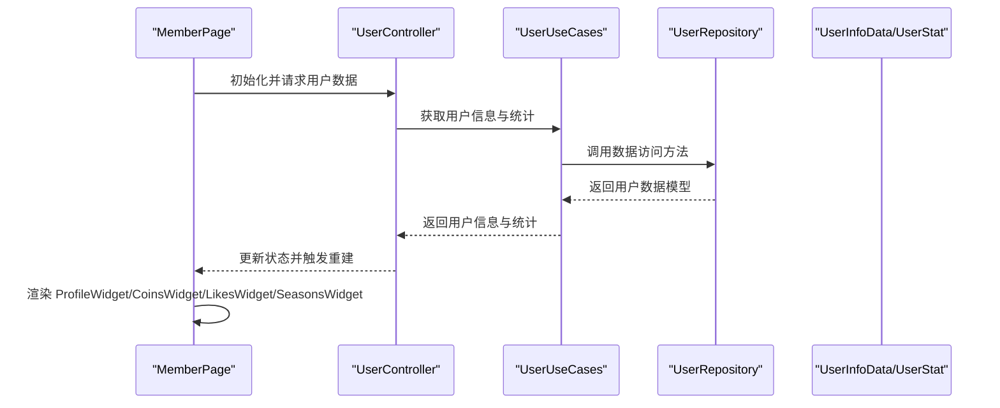
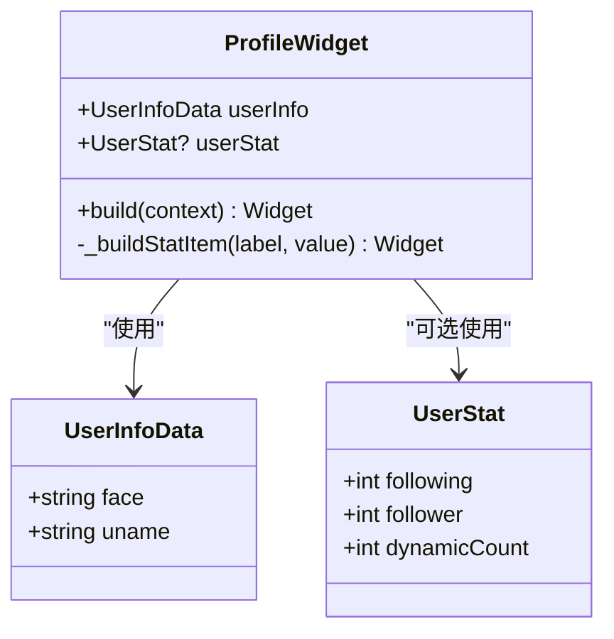
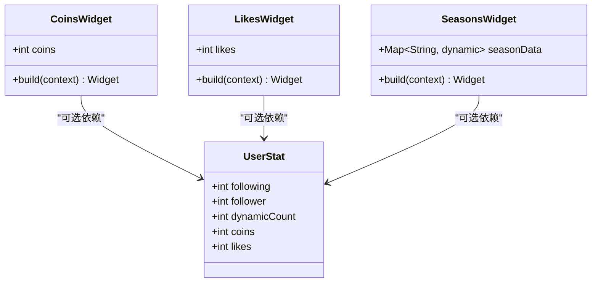
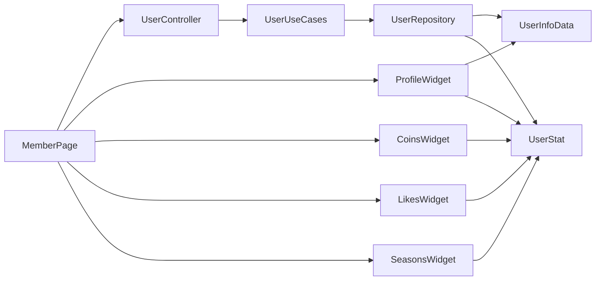

# 用户组件库

<cite>
**本文档引用的文件**
- [profile.dart](file://lib/features/user/presentation/widgets/profile.dart)
- [coins.dart](file://lib/features/user/presentation/widgets/coins.dart)
- [likes.dart](file://lib/features/user/presentation/widgets/likes.dart)
- [seasons.dart](file://lib/features/user/presentation/widgets/seasons.dart)
- [user_controller.dart](file://lib/features/user/presentation/user_controller.dart)
- [member_page.dart](file://lib/features/user/presentation/member_page.dart)
- [user_repository.dart](file://lib/features/user/data/user_repository.dart)
- [user_use_cases.dart](file://lib/features/user/domain/user_use_cases.dart)
- [info.dart](file://lib/models/user/info.dart)
- [stat.dart](file://lib/models/user/stat.dart)
- [user_panel.dart](file://lib/pages/search_panel/widgets/user_panel.dart)
- [user_repository_test.dart](file://test/unit/repository/user_repository_test.dart)
- [patterns.md](file://docs/spec/testing/patterns.md)
- [strategy.md](file://docs/spec/testing/strategy.md)
</cite>

## 目录
1. [简介](#简介)
2. [项目结构](#项目结构)
3. [核心组件](#核心组件)
4. [架构概览](#架构概览)
5. [详细组件分析](#详细组件分析)
6. [依赖关系分析](#依赖关系分析)
7. [性能考虑](#性能考虑)
8. [故障排除指南](#故障排除指南)
9. [结论](#结论)
10. [附录](#附录)

## 简介
本文件为用户模块组件库的详细技术文档，重点覆盖以下组件的设计与实现：
- 用户资料卡片（ProfileWidget）
- 统计徽章（CoinsWidget、LikesWidget、SeasonsWidget）
- 设置项组件（基于现有组件的扩展模式）

文档将从系统架构、组件关系、数据流、处理逻辑、集成点、错误处理、性能特征等维度进行深入分析，并提供可复用性、样式定制与主题适配机制说明，以及组件间通信模式、数据绑定和生命周期管理策略。同时包含单元测试、集成测试与性能优化建议，以及扩展组件功能和实现组件组合模式的方法。

## 项目结构
用户模块位于 features/user 目录下，采用领域驱动设计（DDD）分层组织：
- data 层：用户仓库（UserRepository），负责数据访问与持久化
- domain 层：用户用例（UserUseCases），封装业务规则
- presentation 层：用户控制器（UserController）、成员页（MemberPage）与用户相关小部件（ProfileWidget、CoinsWidget、LikesWidget、SeasonsWidget）
- models 层：用户信息模型（UserInfoData）与用户统计模型（UserStat）
- pages 目录：其他页面中的用户面板组件（如搜索面板中的用户面板）

**图表来源**
- [user_controller.dart](file://lib/features/user/presentation/user_controller.dart)
- [member_page.dart](file://lib/features/user/presentation/member_page.dart)
- [profile.dart](file://lib/features/user/presentation/widgets/profile.dart)
- [coins.dart](file://lib/features/user/presentation/widgets/coins.dart)
- [likes.dart](file://lib/features/user/presentation/widgets/likes.dart)
- [seasons.dart](file://lib/features/user/presentation/widgets/seasons.dart)
- [user_repository.dart](file://lib/features/user/data/user_repository.dart)
- [user_use_cases.dart](file://lib/features/user/domain/user_use_cases.dart)
- [info.dart](file://lib/models/user/info.dart)
- [stat.dart](file://lib/models/user/stat.dart)

**章节来源**
- [user_controller.dart](file://lib/features/user/presentation/user_controller.dart)
- [member_page.dart](file://lib/features/user/presentation/member_page.dart)
- [profile.dart](file://lib/features/user/presentation/widgets/profile.dart)
- [coins.dart](file://lib/features/user/presentation/widgets/coins.dart)
- [likes.dart](file://lib/features/user/presentation/widgets/likes.dart)
- [seasons.dart](file://lib/features/user/presentation/widgets/seasons.dart)
- [user_repository.dart](file://lib/features/user/data/user_repository.dart)
- [user_use_cases.dart](file://lib/features/user/domain/user_use_cases.dart)
- [info.dart](file://lib/models/user/info.dart)
- [stat.dart](file://lib/models/user/stat.dart)

## 核心组件
本节概述用户模块的核心组件及其职责：
- ProfileWidget：展示用户头像、昵称及基础统计数据（关注、粉丝、动态）
- CoinsWidget：展示用户硬币数量的徽章式组件
- LikesWidget：展示用户获赞数的徽章式组件
- SeasonsWidget：展示用户年度统计或季度统计的徽章式组件
- UserController：协调用户数据获取与状态管理
- MemberPage：承载用户信息展示的页面容器
- UserRepository/UserUseCases：数据访问与业务用例

这些组件通过模型（UserInfoData、UserStat）进行数据绑定，遵循单向数据流与不可变属性传递原则，确保组件的可复用性与可测试性。

**章节来源**
- [profile.dart](file://lib/features/user/presentation/widgets/profile.dart)
- [coins.dart](file://lib/features/user/presentation/widgets/coins.dart)
- [likes.dart](file://lib/features/user/presentation/widgets/likes.dart)
- [seasons.dart](file://lib/features/user/presentation/widgets/seasons.dart)
- [user_controller.dart](file://lib/features/user/presentation/user_controller.dart)
- [member_page.dart](file://lib/features/user/presentation/member_page.dart)
- [user_repository.dart](file://lib/features/user/data/user_repository.dart)
- [user_use_cases.dart](file://lib/features/user/domain/user_use_cases.dart)
- [info.dart](file://lib/models/user/info.dart)
- [stat.dart](file://lib/models/user/stat.dart)

## 架构概览
用户模块采用分层架构，展示层仅依赖模型与控制器，不直接操作数据源；领域层封装业务规则；数据层负责数据持久化与网络访问。组件间通过属性传递与回调事件进行通信，避免直接耦合。

**图表来源**
- [member_page.dart](file://lib/features/user/presentation/member_page.dart)
- [user_controller.dart](file://lib/features/user/presentation/user_controller.dart)
- [user_use_cases.dart](file://lib/features/user/domain/user_use_cases.dart)
- [user_repository.dart](file://lib/features/user/data/user_repository.dart)
- [info.dart](file://lib/models/user/info.dart)
- [stat.dart](file://lib/models/user/stat.dart)

## 详细组件分析

### 用户资料卡片（ProfileWidget）
- 设计目标：以卡片形式展示用户头像、昵称与基础统计数据，支持可选统计信息显示
- 关键属性：
  - userInfo：用户基本信息（头像URL、昵称等）
  - userStat：用户统计信息（关注、粉丝、动态等）
- 处理逻辑：
  - 使用圆角头像展示用户头像
  - 文本样式继承主题文本样式，突出昵称权重
  - 条件渲染统计项，避免空值导致的布局异常
- 主题适配：通过 Theme.of(context) 获取文本样式，自动适配明暗主题
- 可复用性：无副作用的无状态组件，通过属性注入数据，便于在不同页面复用

**图表来源**
- [profile.dart](file://lib/features/user/presentation/widgets/profile.dart)
- [info.dart](file://lib/models/user/info.dart)
- [stat.dart](file://lib/models/user/stat.dart)

**章节来源**
- [profile.dart](file://lib/features/user/presentation/widgets/profile.dart)
- [info.dart](file://lib/models/user/info.dart)
- [stat.dart](file://lib/models/user/stat.dart)

### 统计徽章组件（CoinsWidget、LikesWidget、SeasonsWidget）
- 设计目标：以徽章形式展示用户统计数据，支持不同类型的统计指标
- 共同特性：
  - 接收数值型统计参数
  - 使用主题色彩与字体样式，保证视觉一致性
  - 支持空值与零值的安全显示
- CoinsWidget：展示用户硬币数量
- LikesWidget：展示用户获赞总数
- SeasonsWidget：展示用户年度或季度统计（如播放量、收藏数等）
- 可复用性：组件接口一致，便于在不同页面按需组合使用

**图表来源**
- [coins.dart](file://lib/features/user/presentation/widgets/coins.dart)
- [likes.dart](file://lib/features/user/presentation/widgets/likes.dart)
- [seasons.dart](file://lib/features/user/presentation/widgets/seasons.dart)
- [stat.dart](file://lib/models/user/stat.dart)

**章节来源**
- [coins.dart](file://lib/features/user/presentation/widgets/coins.dart)
- [likes.dart](file://lib/features/user/presentation/widgets/likes.dart)
- [seasons.dart](file://lib/features/user/presentation/widgets/seasons.dart)
- [stat.dart](file://lib/models/user/stat.dart)

### 设置项组件（扩展模式）
- 设计目标：基于现有组件的组合模式，构建设置项组件，支持标题、描述、开关、点击跳转等场景
- 实现思路：
  - 复用 ProfileWidget 的头像与文本样式，结合徽章组件展示当前设置值
  - 通过回调事件与状态管理实现交互（如开关切换、跳转到设置页面）
  - 使用 Container 或 Card 包裹，统一间距与对齐
- 可复用性：通过属性注入标题、描述、当前值与回调函数，实现高度可复用的设置项模板

[本节为概念性说明，不直接分析具体文件，故不附加章节来源]

## 依赖关系分析
- 组件依赖模型：ProfileWidget、CoinsWidget、LikesWidget、SeasonsWidget 依赖 UserInfoData 与 UserStat
- 控制器依赖用例：UserController 依赖 UserUseCases 进行数据获取
- 用例依赖仓库：UserUseCases 依赖 UserRepository 访问数据
- 页面依赖控制器：MemberPage 依赖 UserController 管理状态与数据流

**图表来源**
- [profile.dart](file://lib/features/user/presentation/widgets/profile.dart)
- [coins.dart](file://lib/features/user/presentation/widgets/coins.dart)
- [likes.dart](file://lib/features/user/presentation/widgets/likes.dart)
- [seasons.dart](file://lib/features/user/presentation/widgets/seasons.dart)
- [user_controller.dart](file://lib/features/user/presentation/user_controller.dart)
- [user_use_cases.dart](file://lib/features/user/domain/user_use_cases.dart)
- [user_repository.dart](file://lib/features/user/data/user_repository.dart)
- [info.dart](file://lib/models/user/info.dart)
- [stat.dart](file://lib/models/user/stat.dart)
- [member_page.dart](file://lib/features/user/presentation/member_page.dart)

**章节来源**
- [profile.dart](file://lib/features/user/presentation/widgets/profile.dart)
- [coins.dart](file://lib/features/user/presentation/widgets/coins.dart)
- [likes.dart](file://lib/features/user/presentation/widgets/likes.dart)
- [seasons.dart](file://lib/features/user/presentation/widgets/seasons.dart)
- [user_controller.dart](file://lib/features/user/presentation/user_controller.dart)
- [user_use_cases.dart](file://lib/features/user/domain/user_use_cases.dart)
- [user_repository.dart](file://lib/features/user/data/user_repository.dart)
- [info.dart](file://lib/models/user/info.dart)
- [stat.dart](file://lib/models/user/stat.dart)
- [member_page.dart](file://lib/features/user/presentation/member_page.dart)

## 性能考虑
- 图片加载优化：头像使用网络图片时，建议结合缓存与占位图，避免频繁重绘
- 条件渲染：统计信息为空时避免渲染，减少不必要的子树构建
- 主题样式：通过 Theme.of(context) 获取样式，避免重复计算
- 列表渲染：在大量用户信息展示时，优先使用 ListView.builder 或类似惰性渲染组件
- 状态更新：使用 setState 或更细粒度的状态管理（如 Provider/GetX）避免全量重建

[本节提供通用指导，不直接分析具体文件，故不附加章节来源]

## 故障排除指南
- 空数据处理：当 userInfo 或 userStat 为空时，组件应安全降级，避免崩溃
- 错误状态：在数据获取失败时，展示占位图或错误提示，并提供重试机制
- 回调事件：确保回调事件的可选性与空安全，避免未注册回调导致的异常
- 测试策略：参考测试规范与策略文档，确保单元测试与集成测试覆盖关键路径

**章节来源**
- [user_repository_test.dart](file://test/unit/repository/user_repository_test.dart)
- [patterns.md](file://docs/spec/testing/patterns.md)
- [strategy.md](file://docs/spec/testing/strategy.md)

## 结论
用户模块组件库通过清晰的分层架构与无状态组件设计，实现了高内聚、低耦合的可复用组件体系。ProfileWidget、CoinsWidget、LikesWidget、SeasonsWidget 在数据绑定、主题适配与可扩展性方面表现良好。通过组合模式与设置项组件的扩展，可以快速构建丰富的用户界面。建议在后续迭代中完善错误处理与性能监控，并持续补充测试覆盖。

## 附录
- 扩展组件功能：新增统计类型时，遵循现有组件接口，保持属性与事件的一致性
- 添加新UI元素：在现有组件基础上增加可选参数，避免破坏既有行为
- 组件组合模式：通过容器组件聚合多个用户组件，实现复杂页面布局与交互

[本节为概念性说明，不直接分析具体文件，故不附加章节来源]