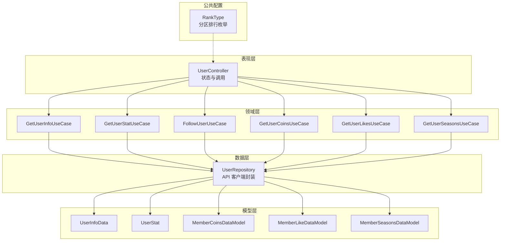
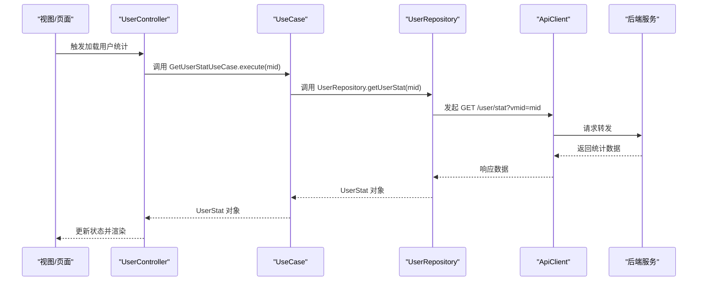
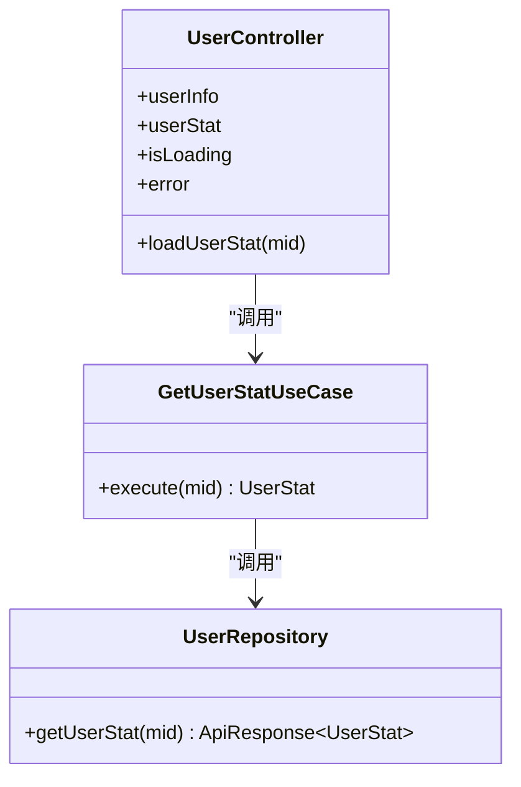
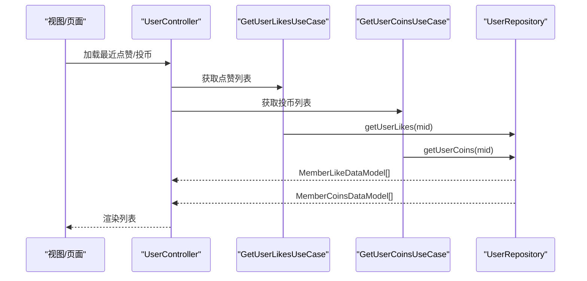
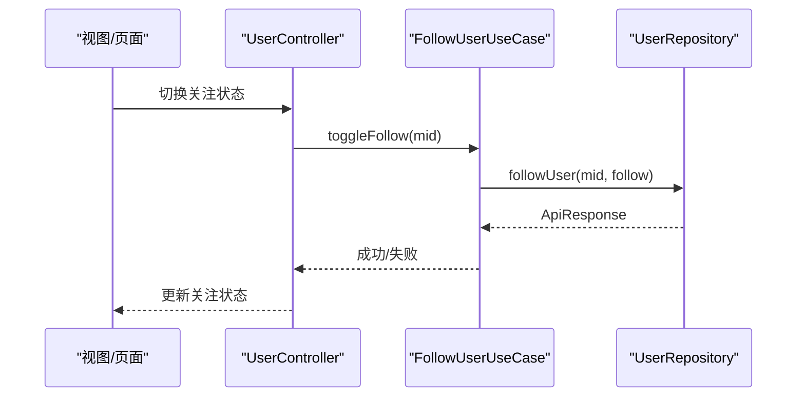
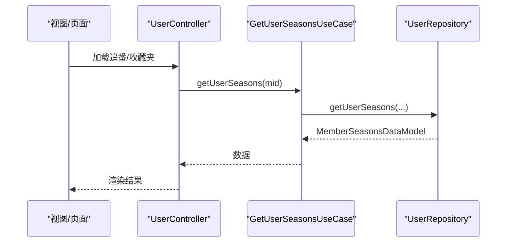
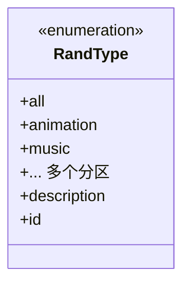
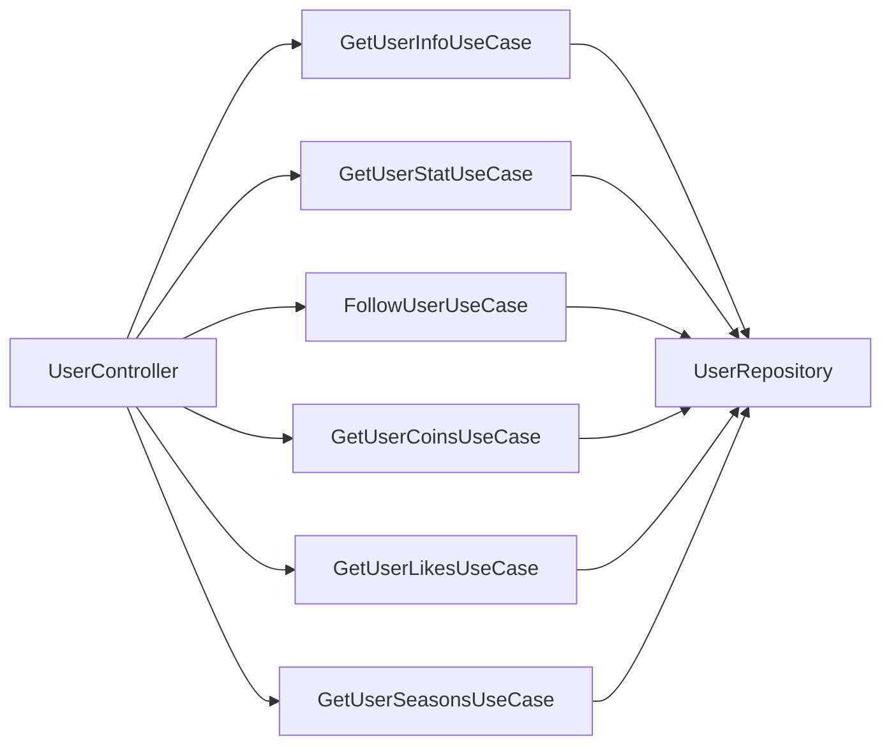

# 用户统计信息

<cite>
**本文引用的文件**
- [lib/features/user/user.dart](file://lib/features/user/user.dart)
- [lib/features/user/data/user_repository.dart](file://lib/features/user/data/user_repository.dart)
- [lib/features/user/domain/user_use_cases.dart](file://lib/features/user/domain/user_use_cases.dart)
- [lib/features/user/presentation/user_controller.dart](file://lib/features/user/presentation/user_controller.dart)
- [lib/models/common/rank_type.dart](file://lib/models/common/rank_type.dart)
</cite>

## 目录
1. [简介](#简介)
2. [项目结构](#项目结构)
3. [核心组件](#核心组件)
4. [架构总览](#架构总览)
5. [详细组件分析](#详细组件分析)
6. [依赖关系分析](#依赖关系分析)
7. [性能考虑](#性能考虑)
8. [故障排查指南](#故障排查指南)
9. [结论](#结论)
10. [附录](#附录)

## 简介
本文件围绕“用户统计信息”主题，系统性梳理并文档化当前代码库中与用户统计相关的能力边界与实现路径。重点覆盖以下方面：
- 用户统计接口与数据模型：粉丝数、关注数等基础统计项
- 积分与等级体系：当前仓库未直接暴露积分/等级字段，但为后续扩展预留了清晰的数据模型与调用链
- 点赞与投币统计：通过“最近点赞视频列表”“最近投币视频列表”间接反映用户行为统计
- 金币获取、消耗与余额管理：当前仓库未直接暴露金币余额字段，但已具备相关数据模型与调用入口
- 活跃度与贡献度评估：当前仓库未直接提供活跃度/贡献度算法，但可通过历史记录、点赞/投币/收藏等行为数据进行扩展
- 排名机制：当前仓库未直接提供排名算法，但已具备按分区维度的排行配置（枚举与页面映射）
- 实时更新、缓存策略与性能优化：当前仓库未直接实现缓存层，但控制器层具备加载状态与错误处理，便于在上层接入缓存与去抖策略
- 扩展统计维度与数据可视化：当前仓库未直接提供图表组件，但已具备丰富的数据模型与调用入口，便于在UI层进行可视化集成

## 项目结构
用户统计信息相关能力主要分布在以下层次：
- 表现层（Presentation）：UserController 负责状态管理与调用域用例
- 领域层（Domain）：各 UseCase 封装业务用法，统一异常处理
- 数据层（Data）：UserRepository 提供与后端 API 的交互能力
- 模型层（Models）：UserInfoData、UserStat、MemberCoinsDataModel、MemberLikeDataModel 等
- 公共配置（Common）：RankType 提供分区排行的类型与描述

**图示来源**
- [lib/features/user/presentation/user_controller.dart:13-145](file://lib/features/user/presentation/user_controller.dart#L13-L145)
- [lib/features/user/domain/user_use_cases.dart:10-133](file://lib/features/user/domain/user_use_cases.dart#L10-L133)
- [lib/features/user/data/user_repository.dart:16-234](file://lib/features/user/data/user_repository.dart#L16-L234)
- [lib/models/common/rank_type.dart:4-58](file://lib/models/common/rank_type.dart#L4-L58)

**章节来源**
- [lib/features/user/user.dart:1-12](file://lib/features/user/user.dart#L1-L12)
- [lib/features/user/presentation/user_controller.dart:13-145](file://lib/features/user/presentation/user_controller.dart#L13-L145)
- [lib/features/user/domain/user_use_cases.dart:10-133](file://lib/features/user/domain/user_use_cases.dart#L10-L133)
- [lib/features/user/data/user_repository.dart:16-234](file://lib/features/user/data/user_repository.dart#L16-L234)
- [lib/models/common/rank_type.dart:4-58](file://lib/models/common/rank_type.dart#L4-L58)

## 核心组件
- UserController：负责用户信息、统计、关注、最近投币视频、最近点赞视频、最近追番等数据的加载与状态管理；提供 Rx 状态与错误处理
- 各 UseCase：封装具体业务调用，统一返回数据或抛出异常
- UserRepository：封装 API 请求，将响应转换为对应模型对象
- 模型层：UserInfoData、UserStat、MemberCoinsDataModel、MemberLikeDataModel、MemberSeasonsDataModel 等
- RankType：提供分区排行的枚举与描述，用于后续扩展“按分区维度的用户排行”

**章节来源**
- [lib/features/user/presentation/user_controller.dart:13-145](file://lib/features/user/presentation/user_controller.dart#L13-L145)
- [lib/features/user/domain/user_use_cases.dart:10-133](file://lib/features/user/domain/user_use_cases.dart#L10-L133)
- [lib/features/user/data/user_repository.dart:16-234](file://lib/features/user/data/user_repository.dart#L16-L234)
- [lib/models/common/rank_type.dart:4-58](file://lib/models/common/rank_type.dart#L4-L58)

## 架构总览
用户统计信息的调用链遵循典型的 Clean Architecture 分层设计：
- 表现层通过控制器发起请求
- 控制器调用领域层 UseCase
- UseCase 调用数据层 UserRepository
- UserRepository 通过 API 客户端访问后端接口，并将响应映射到模型对象
- 模型对象承载用户统计所需的数据字段（如粉丝数、关注数、投币/点赞记录等）

**图示来源**
- [lib/features/user/presentation/user_controller.dart:74-86](file://lib/features/user/presentation/user_controller.dart#L74-L86)
- [lib/features/user/domain/user_use_cases.dart:36-44](file://lib/features/user/domain/user_use_cases.dart#L36-L44)
- [lib/features/user/data/user_repository.dart:52-64](file://lib/features/user/data/user_repository.dart#L52-L64)

## 详细组件分析

### 用户统计接口与数据模型
- 统计接口：UserRepository 提供 getUserStat(mid)，返回 UserStat 对象
- 关键字段：粉丝数、关注数等基础统计项
- 使用场景：个人主页、他人主页、排行榜等

**图示来源**
- [lib/features/user/presentation/user_controller.dart:74-86](file://lib/features/user/presentation/user_controller.dart#L74-L86)
- [lib/features/user/domain/user_use_cases.dart:36-44](file://lib/features/user/domain/user_use_cases.dart#L36-L44)
- [lib/features/user/data/user_repository.dart:52-64](file://lib/features/user/data/user_repository.dart#L52-L64)

**章节来源**
- [lib/features/user/data/user_repository.dart:52-64](file://lib/features/user/data/user_repository.dart#L52-L64)
- [lib/features/user/domain/user_use_cases.dart:36-44](file://lib/features/user/domain/user_use_cases.dart#L36-L44)
- [lib/features/user/presentation/user_controller.dart:74-86](file://lib/features/user/presentation/user_controller.dart#L74-L86)

### 点赞与投币统计
- 最近点赞视频：UserRepository.getUserLikes(mid)，返回 MemberLikeDataModel 列表
- 最近投币视频：UserRepository.getUserCoins(mid)，返回 MemberCoinsDataModel 列表
- 使用场景：个人主页“最近点赞/投币”展示，为后续活跃度与贡献度评估提供原始数据

**图示来源**
- [lib/features/user/presentation/user_controller.dart:117-129](file://lib/features/user/presentation/user_controller.dart#L117-L129)
- [lib/features/user/domain/user_use_cases.dart:97-105](file://lib/features/user/domain/user_use_cases.dart#L97-L105)
- [lib/features/user/domain/user_use_cases.dart:78-86](file://lib/features/user/domain/user_use_cases.dart#L78-L86)
- [lib/features/user/data/user_repository.dart:176-193](file://lib/features/user/data/user_repository.dart#L176-L193)
- [lib/features/user/data/user_repository.dart:156-173](file://lib/features/user/data/user_repository.dart#L156-L173)

**章节来源**
- [lib/features/user/data/user_repository.dart:156-193](file://lib/features/user/data/user_repository.dart#L156-L193)
- [lib/features/user/domain/user_use_cases.dart:78-105](file://lib/features/user/domain/user_use_cases.dart#L78-L105)
- [lib/features/user/presentation/user_controller.dart:117-129](file://lib/features/user/presentation/user_controller.dart#L117-L129)

### 关注/取关与历史记录
- 关注/取关：UserRepository.followUser(mid, follow)，返回通用响应
- 历史记录：UserRepository.getHistoryList(max, viewAt, business)，返回历史条目列表
- 使用场景：关注状态切换、历史播放记录展示

**图示来源**
- [lib/features/user/presentation/user_controller.dart:89-99](file://lib/features/user/presentation/user_controller.dart#L89-L99)
- [lib/features/user/domain/user_use_cases.dart:55-67](file://lib/features/user/domain/user_use_cases.dart#L55-L67)
- [lib/features/user/data/user_repository.dart:219-233](file://lib/features/user/data/user_repository.dart#L219-L233)

**章节来源**
- [lib/features/user/data/user_repository.dart:129-153](file://lib/features/user/data/user_repository.dart#L129-L153)
- [lib/features/user/data/user_repository.dart:219-233](file://lib/features/user/data/user_repository.dart#L219-L233)
- [lib/features/user/domain/user_use_cases.dart:55-67](file://lib/features/user/domain/user_use_cases.dart#L55-L67)
- [lib/features/user/presentation/user_controller.dart:89-99](file://lib/features/user/presentation/user_controller.dart#L89-L99)

### 追番与收藏夹
- 追番列表：UserRepository.getUserSeasons(mid, page, pageSize)，返回 MemberSeasonsDataModel
- 收藏夹列表：UserRepository.getFavFolders(mid, page, pageSize)
- 收藏夹详情：UserRepository.getFavFolderDetail(mediaId, page, pageSize)
- 使用场景：个人主页“追番/收藏夹”展示

**图示来源**
- [lib/features/user/presentation/user_controller.dart:132-144](file://lib/features/user/presentation/user_controller.dart#L132-L144)
- [lib/features/user/domain/user_use_cases.dart:116-132](file://lib/features/user/domain/user_use_cases.dart#L116-L132)
- [lib/features/user/data/user_repository.dart:196-216](file://lib/features/user/data/user_repository.dart#L196-L216)

**章节来源**
- [lib/features/user/data/user_repository.dart:67-110](file://lib/features/user/data/user_repository.dart#L67-L110)
- [lib/features/user/data/user_repository.dart:196-216](file://lib/features/user/data/user_repository.dart#L196-L216)
- [lib/features/user/domain/user_use_cases.dart:116-132](file://lib/features/user/domain/user_use_cases.dart#L116-L132)
- [lib/features/user/presentation/user_controller.dart:132-144](file://lib/features/user/presentation/user_controller.dart#L132-L144)

### 分区排行与扩展点
- RankType 提供全站与多个分区的枚举与描述，可用于后续扩展“按分区维度的用户排行”
- 使用场景：排行榜页面按分区筛选与跳转

**图示来源**
- [lib/models/common/rank_type.dart:4-58](file://lib/models/common/rank_type.dart#L4-L58)

**章节来源**
- [lib/models/common/rank_type.dart:4-58](file://lib/models/common/rank_type.dart#L4-L58)

## 依赖关系分析
- 控制器依赖 UseCase；UseCase 依赖 UserRepository；UserRepository 依赖 API 客户端与模型层
- 模块间耦合度低，职责清晰，便于扩展新的统计维度与指标类型

**图示来源**
- [lib/features/user/presentation/user_controller.dart:42-56](file://lib/features/user/presentation/user_controller.dart#L42-L56)
- [lib/features/user/domain/user_use_cases.dart:10-133](file://lib/features/user/domain/user_use_cases.dart#L10-L133)

**章节来源**
- [lib/features/user/presentation/user_controller.dart:42-56](file://lib/features/user/presentation/user_controller.dart#L42-L56)
- [lib/features/user/domain/user_use_cases.dart:10-133](file://lib/features/user/domain/user_use_cases.dart#L10-L133)

## 性能考虑
- 当前未实现专用缓存层，建议在上层引入内存缓存与去抖策略，以减少重复请求与网络开销
- 控制器层已具备加载状态与错误状态，可在 UI 层结合节流/防抖与本地缓存提升交互流畅度
- 对于高频接口（如用户统计），可采用“先显示缓存，再异步刷新”的策略，改善首屏体验

[本节为通用性能建议，不直接分析具体文件，故无“章节来源”]

## 故障排查指南
- 异常处理：UseCase 在失败时会抛出异常，控制器捕获后写入错误状态，便于 UI 展示
- 常见问题定位：
  - 网络请求失败：检查 API 客户端与后端接口可用性
  - 数据解析失败：检查响应结构与模型映射是否一致
  - 权限不足：关注登录态与 CSRF 参数（如涉及）

**章节来源**
- [lib/features/user/domain/user_use_cases.dart:24-25](file://lib/features/user/domain/user_use_cases.dart#L24-L25)
- [lib/features/user/domain/user_use_cases.dart:43-44](file://lib/features/user/domain/user_use_cases.dart#L43-L44)
- [lib/features/user/domain/user_use_cases.dart:64-67](file://lib/features/user/domain/user_use_cases.dart#L64-L67)
- [lib/features/user/domain/user_use_cases.dart:85-86](file://lib/features/user/domain/user_use_cases.dart#L85-L86)
- [lib/features/user/domain/user_use_cases.dart:104-105](file://lib/features/user/domain/user_use_cases.dart#L104-L105)
- [lib/features/user/domain/user_use_cases.dart:131-132](file://lib/features/user/domain/user_use_cases.dart#L131-L132)
- [lib/features/user/presentation/user_controller.dart:66-70](file://lib/features/user/presentation/user_controller.dart#L66-L70)
- [lib/features/user/presentation/user_controller.dart:81-85](file://lib/features/user/presentation/user_controller.dart#L81-L85)
- [lib/features/user/presentation/user_controller.dart:96-99](file://lib/features/user/presentation/user_controller.dart#L96-L99)
- [lib/features/user/presentation/user_controller.dart:109-114](file://lib/features/user/presentation/user_controller.dart#L109-L114)
- [lib/features/user/presentation/user_controller.dart:125-130](file://lib/features/user/presentation/user_controller.dart#L125-L130)
- [lib/features/user/presentation/user_controller.dart:140-144](file://lib/features/user/presentation/user_controller.dart#L140-L144)

## 结论
- 当前代码库已具备完善的用户统计信息调用链与数据模型支撑，能够满足基础统计与行为数据展示需求
- 积分/等级、金币余额、活跃度/贡献度评估、排名算法等尚未直接实现，但已为后续扩展提供了清晰的接口与数据模型
- 建议在上层引入缓存与去抖策略，并基于现有模型扩展更多统计维度与可视化能力

[本节为总结性内容，不直接分析具体文件，故无“章节来源”]

## 附录

### 扩展统计维度与算法建议
- 积分/等级体系
  - 新增字段：积分、等级阈值、经验值等
  - 触发条件：观看时长、点赞、投币、分享、评论等
  - 计算方式：加权累计或阶梯式增长
- 金币获取/消耗/余额
  - 获取：投币、签到、活动奖励
  - 消耗：充电、付费内容、礼物
  - 余额：实时查询与缓存同步
- 活跃度/贡献度评估
  - 指标：观看时长、互动次数、内容发布量、粉丝增长
  - 权重：不同行为赋予不同权重，按周期归一化
- 排名机制
  - 维度：综合分、分区分、周榜/月榜
  - 更新：定时任务或事件驱动刷新
- 可视化
  - 图表：折线图（趋势）、柱状图（分布）、环形图（占比）
  - 交互：筛选器（时间范围、分区）、排序（综合/分区）

[本节为概念性扩展建议，不直接分析具体文件，故无“章节来源”]