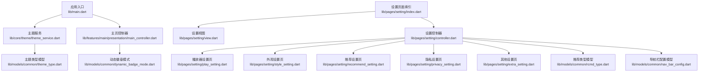
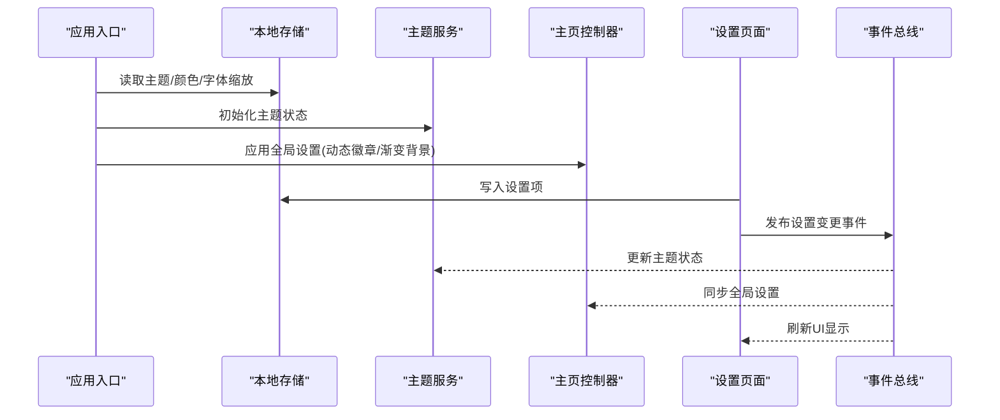
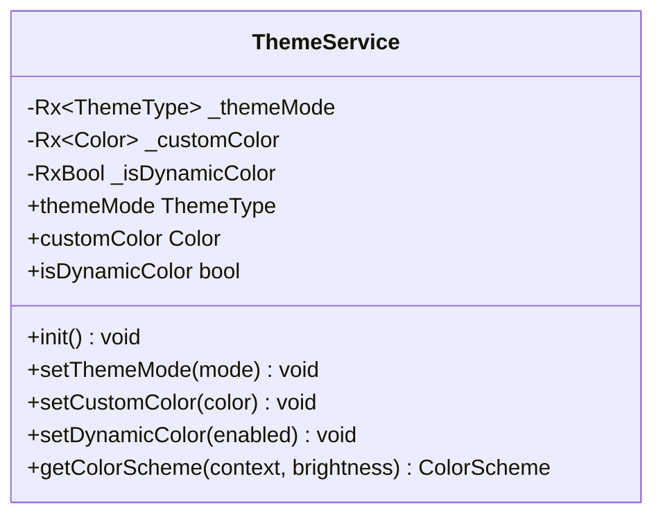
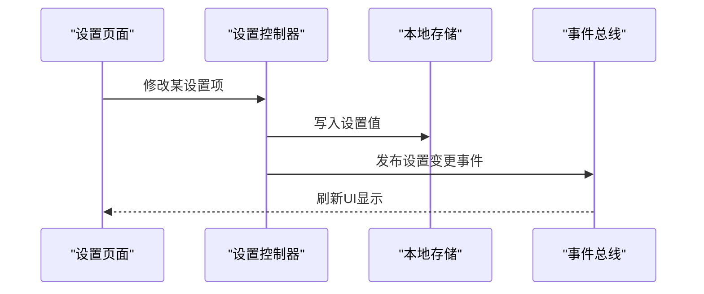
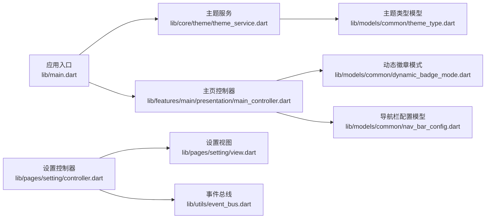

# 用户设置管理

<cite>
**本文档引用的文件**
- [docs/spec/features/setting/spec.md](file://docs/spec/features/setting/spec.md)
- [lib/main.dart](file://lib/main.dart)
- [lib/core/theme/theme_service.dart](file://lib/core/theme/theme_service.dart)
- [lib/features/main/presentation/main_controller.dart](file://lib/features/main/presentation/main_controller.dart)
- [lib/pages/setting/controller.dart](file://lib/pages/setting/controller.dart)
- [lib/pages/setting/index.dart](file://lib/pages/setting/index.dart)
- [lib/pages/setting/view.dart](file://lib/pages/setting/view.dart)
- [lib/pages/setting/play_setting.dart](file://lib/pages/setting/play_setting.dart)
- [lib/pages/setting/style_setting.dart](file://lib/pages/setting/style_setting.dart)
- [lib/pages/setting/recommend_setting.dart](file://lib/pages/setting/recommend_setting.dart)
- [lib/pages/setting/privacy_setting.dart](file://lib/pages/setting/privacy_setting.dart)
- [lib/pages/setting/extra_setting.dart](file://lib/pages/setting/extra_setting.dart)
- [lib/models/common/theme_type.dart](file://lib/models/common/theme_type.dart)
- [lib/models/common/dynamic_badge_mode.dart](file://lib/models/common/dynamic_badge_mode.dart)
- [lib/models/common/rcmd_type.dart](file://lib/models/common/rcmd_type.dart)
- [lib/models/common/nav_bar_config.dart](file://lib/models/common/nav_bar_config.dart)
- [lib/utils/cache_manage.dart](file://lib/utils/cache_manage.dart)
- [lib/utils/login.dart](file://lib/utils/login.dart)
- [lib/utils/live.dart](file://lib/utils/live.dart)
- [lib/utils/event_bus.dart](file://lib/utils/event_bus.dart)
</cite>

## 目录
1. [简介](#简介)
2. [项目结构](#项目结构)
3. [核心组件](#核心组件)
4. [架构总览](#架构总览)
5. [详细组件分析](#详细组件分析)
6. [依赖关系分析](#依赖关系分析)
7. [性能考虑](#性能考虑)
8. [故障排除指南](#故障排除指南)
9. [结论](#结论)
10. [附录](#附录)

## 简介
本文件系统性梳理并文档化用户设置管理功能，覆盖应用偏好设置、通知与隐私配置、界面主题与语言字体等外观设置、播放器行为设置、推荐算法过滤策略以及隐私黑名单管理。同时提供账号安全与登录设备管理的实现要点，并给出扩展新设置项、实现设置同步与处理冲突的最佳实践。

## 项目结构
设置功能主要由以下层次构成：
- 规格说明：定义设置项分类、键名与默认值约定
- 应用入口初始化：从本地存储加载主题、颜色、字体缩放等基础设置
- 主题服务：集中式主题状态管理与颜色方案生成
- 主页控制器：读取动态徽章、渐变背景、自动更新等全局设置
- 设置页面：按功能域拆分的设置页面与控制器，负责具体设置项的读写与UI交互
- 模型与工具：主题类型、动态徽章模式、推荐类型、导航栏配置等枚举与工具类

**图表来源**
- [lib/main.dart:82-118](file://lib/main.dart#L82-L118)
- [lib/core/theme/theme_service.dart:1-56](file://lib/core/theme/theme_service.dart#L1-L56)
- [lib/features/main/presentation/main_controller.dart:36-70](file://lib/features/main/presentation/main_controller.dart#L36-L70)
- [lib/pages/setting/index.dart](file://lib/pages/setting/index.dart)
- [lib/pages/setting/view.dart](file://lib/pages/setting/view.dart)
- [lib/pages/setting/controller.dart](file://lib/pages/setting/controller.dart)
- [lib/pages/setting/play_setting.dart](file://lib/pages/setting/play_setting.dart)
- [lib/pages/setting/style_setting.dart](file://lib/pages/setting/style_setting.dart)
- [lib/pages/setting/recommend_setting.dart](file://lib/pages/setting/recommend_setting.dart)
- [lib/pages/setting/privacy_setting.dart](file://lib/pages/setting/privacy_setting.dart)
- [lib/pages/setting/extra_setting.dart](file://lib/pages/setting/extra_setting.dart)
- [lib/models/common/theme_type.dart](file://lib/models/common/theme_type.dart)
- [lib/models/common/dynamic_badge_mode.dart](file://lib/models/common/dynamic_badge_mode.dart)
- [lib/models/common/rcmd_type.dart](file://lib/models/common/rcmd_type.dart)
- [lib/models/common/nav_bar_config.dart](file://lib/models/common/nav_bar_config.dart)

**章节来源**
- [lib/main.dart:82-118](file://lib/main.dart#L82-L118)
- [lib/core/theme/theme_service.dart:1-56](file://lib/core/theme/theme_service.dart#L1-L56)
- [lib/features/main/presentation/main_controller.dart:36-70](file://lib/features/main/presentation/main_controller.dart#L36-L70)
- [lib/pages/setting/index.dart](file://lib/pages/setting/index.dart)
- [lib/pages/setting/view.dart](file://lib/pages/setting/view.dart)
- [lib/pages/setting/controller.dart](file://lib/pages/setting/controller.dart)

## 核心组件
- 设置键名规范与默认值：通过规格文档定义统一的键名常量与默认值，确保跨平台一致性
- 应用初始化设置加载：在应用启动时从本地存储读取主题、颜色、字体缩放等基础设置
- 主题服务：提供响应式主题状态管理，支持主题模式、自定义颜色、动态取色与颜色方案生成
- 主页控制器：读取动态徽章模式、渐变背景、自动更新、隐藏标签栏等全局设置
- 设置页面：按功能域拆分页面，控制器负责设置项的持久化与UI交互
- 模型与工具：主题类型、动态徽章模式、推荐类型、导航栏配置等枚举与工具类支撑设置逻辑

**章节来源**
- [docs/spec/features/setting/spec.md:103-136](file://docs/spec/features/setting/spec.md#L103-L136)
- [lib/main.dart:82-118](file://lib/main.dart#L82-L118)
- [lib/core/theme/theme_service.dart:11-56](file://lib/core/theme/theme_service.dart#L11-L56)
- [lib/features/main/presentation/main_controller.dart:36-70](file://lib/features/main/presentation/main_controller.dart#L36-L70)

## 架构总览
设置系统的数据流从本地存储到应用初始化，再到主题服务与各设置页面的读写，最终通过事件总线或控制器进行状态传播。

**图表来源**
- [lib/main.dart:82-118](file://lib/main.dart#L82-L118)
- [lib/core/theme/theme_service.dart:24-47](file://lib/core/theme/theme_service.dart#L24-L47)
- [lib/features/main/presentation/main_controller.dart:36-70](file://lib/features/main/presentation/main_controller.dart#L36-L70)
- [lib/pages/setting/controller.dart](file://lib/pages/setting/controller.dart)
- [lib/utils/event_bus.dart](file://lib/utils/event_bus.dart)

## 详细组件分析

### 设置键名与默认值规范
- 键名采用统一的命名空间，如主题模式、自定义颜色、动态取色、字体缩放、首页单列、自定义列数、渐变背景等
- 默认值在规格文档中明确，确保首次安装或重置时的一致体验
- 推荐设置包含推荐动态开关、默认推荐类型、最小时长过滤、最小点赞率过滤、关注用户豁免、相关视频过滤等
- 隐私设置包含黑名单用户ID列表

**章节来源**
- [docs/spec/features/setting/spec.md:103-136](file://docs/spec/features/setting/spec.md#L103-L136)

### 应用初始化与基础设置加载
- 应用启动时从本地存储读取主题模式、自定义颜色、动态取色、字体缩放等设置
- 在非Web且Android环境下尝试根据存储的显示模式设置高帧率显示
- 将主题色、主题模式、动态取色与字体缩放注入到MaterialApp的主题构建中

**章节来源**
- [lib/main.dart:82-118](file://lib/main.dart#L82-L118)

### 主题服务与颜色方案
- 提供响应式主题状态：主题模式、自定义颜色、动态取色
- 支持从种子色生成ColorScheme，便于统一主题色彩
- 初始化方法预留从本地存储加载主题状态的实现位置

**图表来源**
- [lib/core/theme/theme_service.dart:11-56](file://lib/core/theme/theme_service.dart#L11-L56)

**章节来源**
- [lib/core/theme/theme_service.dart:11-56](file://lib/core/theme/theme_service.dart#L11-L56)

### 主页控制器与全局设置
- 读取动态徽章模式、渐变背景、自动更新、隐藏标签栏等设置
- 根据动态徽章模式决定是否显示未读动态
- 通过全局缓存与控制器状态实现设置的即时生效

**章节来源**
- [lib/features/main/presentation/main_controller.dart:36-70](file://lib/features/main/presentation/main_controller.dart#L36-L70)

### 设置页面与控制器
- 设置页面按功能域拆分：播放器设置、外观设置、推荐设置、隐私设置、其他设置
- 控制器负责设置项的读取、写入与UI交互，通过本地存储实现持久化
- 设置页面通过事件总线或直接调用控制器实现设置变更后的状态同步

**图表来源**
- [lib/pages/setting/controller.dart](file://lib/pages/setting/controller.dart)
- [lib/pages/setting/view.dart](file://lib/pages/setting/view.dart)
- [lib/utils/event_bus.dart](file://lib/utils/event_bus.dart)

**章节来源**
- [lib/pages/setting/index.dart](file://lib/pages/setting/index.dart)
- [lib/pages/setting/view.dart](file://lib/pages/setting/view.dart)
- [lib/pages/setting/controller.dart](file://lib/pages/setting/controller.dart)

### 播放器设置
- 默认清晰度、默认倍速、自动播放、弹幕设置、手势设置等
- 设置项通过控制器写入本地存储，并在播放器组件中读取生效

**章节来源**
- [docs/spec/features/setting/spec.md:12-17](file://docs/spec/features/setting/spec.md#L12-L17)
- [lib/pages/setting/play_setting.dart](file://lib/pages/setting/play_setting.dart)

### 外观设置
- 主题模式、主题色、动态取色、字体大小、首页单列、自定义列数、渐变背景等
- 主题服务负责颜色方案生成，应用入口负责初始加载与注入

**章节来源**
- [docs/spec/features/setting/spec.md:19-23](file://docs/spec/features/setting/spec.md#L19-L23)
- [lib/pages/setting/style_setting.dart](file://lib/pages/setting/style_setting.dart)
- [lib/main.dart:82-118](file://lib/main.dart#L82-L118)

### 推荐设置
- 推荐动态开关、默认推荐类型、最小时长过滤、最小点赞率过滤、关注用户豁免、相关视频过滤
- 设置项影响内容推荐策略，控制器负责读写与UI交互

**章节来源**
- [docs/spec/features/setting/spec.md:25-28](file://docs/spec/features/setting/spec.md#L25-L28)
- [lib/pages/setting/recommend_setting.dart](file://lib/pages/setting/recommend_setting.dart)
- [lib/models/common/rcmd_type.dart](file://lib/models/common/rcmd_type.dart)

### 隐私设置
- 黑名单用户ID列表，用于屏蔽特定用户的动态或内容
- 设置项通过控制器写入本地存储，影响内容过滤与展示

**章节来源**
- [docs/spec/features/setting/spec.md:30-31](file://docs/spec/features/setting/spec.md#L30-L31)
- [lib/pages/setting/privacy_setting.dart](file://lib/pages/setting/privacy_setting.dart)

### 其他设置
- 检查更新、清除缓存、关于等
- 清理缓存通过缓存管理工具实现，检查更新通过工具函数触发

**章节来源**
- [docs/spec/features/setting/spec.md:33-36](file://docs/spec/features/setting/spec.md#L33-L36)
- [lib/pages/setting/extra_setting.dart](file://lib/pages/setting/extra_setting.dart)
- [lib/utils/cache_manage.dart](file://lib/utils/cache_manage.dart)

### 账号安全与登录设备管理
- 登录设备管理：通过登录工具模块提供的接口实现设备列表查询与管理
- 密码修改：通过登录工具模块提供的接口实现密码修改流程
- 安全设置：结合登录状态与设备信息，提供安全相关的设置入口与操作

**章节来源**
- [lib/utils/login.dart](file://lib/utils/login.dart)
- [lib/utils/live.dart](file://lib/utils/live.dart)

## 依赖关系分析
设置系统的关键依赖关系如下：
- 应用入口依赖本地存储与主题服务，以完成初始设置加载
- 主题服务依赖主题类型模型与颜色方案生成
- 主页控制器依赖动态徽章模式与导航栏配置模型
- 设置页面依赖控制器与事件总线，实现设置项的读写与UI同步

**图表来源**
- [lib/main.dart:82-118](file://lib/main.dart#L82-L118)
- [lib/core/theme/theme_service.dart:11-56](file://lib/core/theme/theme_service.dart#L11-L56)
- [lib/models/common/theme_type.dart](file://lib/models/common/theme_type.dart)
- [lib/features/main/presentation/main_controller.dart:36-70](file://lib/features/main/presentation/main_controller.dart#L36-L70)
- [lib/models/common/dynamic_badge_mode.dart](file://lib/models/common/dynamic_badge_mode.dart)
- [lib/models/common/nav_bar_config.dart](file://lib/models/common/nav_bar_config.dart)
- [lib/pages/setting/controller.dart](file://lib/pages/setting/controller.dart)
- [lib/pages/setting/view.dart](file://lib/pages/setting/view.dart)
- [lib/utils/event_bus.dart](file://lib/utils/event_bus.dart)

**章节来源**
- [lib/main.dart:82-118](file://lib/main.dart#L82-L118)
- [lib/core/theme/theme_service.dart:11-56](file://lib/core/theme/theme_service.dart#L11-L56)
- [lib/features/main/presentation/main_controller.dart:36-70](file://lib/features/main/presentation/main_controller.dart#L36-L70)
- [lib/pages/setting/controller.dart](file://lib/pages/setting/controller.dart)
- [lib/pages/setting/view.dart](file://lib/pages/setting/view.dart)

## 性能考虑
- 主题切换与颜色方案生成：使用响应式状态避免不必要的重建；颜色方案生成基于种子色，建议缓存常用颜色以减少重复计算
- 设置读写：批量读取与合并写入，避免频繁I/O；对高频设置项可采用内存缓存
- 页面渲染：设置页面采用懒加载与按需渲染，减少初始化开销
- 缓存清理：定期清理过期缓存，避免占用过多存储空间

## 故障排除指南
- 设置不生效：检查本地存储键名是否正确，确认控制器已写入并发布事件；验证应用入口是否重新加载了设置
- 主题异常：确认主题服务初始化已完成，颜色方案生成逻辑正常；检查主题类型枚举值是否匹配
- 动态徽章不显示：确认动态徽章模式设置为显示，且未被隐藏；检查未读动态获取逻辑
- 推荐内容异常：核对推荐设置项的默认值与过滤条件，确认相关视频过滤策略是否启用
- 隐私设置无效：检查黑名单列表格式与写入逻辑，确认过滤策略已应用

**章节来源**
- [lib/pages/setting/controller.dart](file://lib/pages/setting/controller.dart)
- [lib/utils/event_bus.dart](file://lib/utils/event_bus.dart)

## 结论
用户设置管理功能通过统一的键名规范、响应式主题服务与模块化的设置页面实现了良好的可维护性与扩展性。建议在新增设置项时遵循现有规范，确保默认值一致、持久化可靠，并通过事件总线实现状态同步与UI刷新。

## 附录

### 添加新的设置项流程
- 在规格文档中定义键名与默认值
- 在设置控制器中添加读写逻辑
- 在对应设置页面中实现UI与交互
- 通过事件总线发布设置变更事件
- 在应用入口或相关控制器中读取并应用设置

**章节来源**
- [docs/spec/features/setting/spec.md:103-136](file://docs/spec/features/setting/spec.md#L103-L136)
- [lib/pages/setting/controller.dart](file://lib/pages/setting/controller.dart)
- [lib/utils/event_bus.dart](file://lib/utils/event_bus.dart)

### 设置同步与冲突处理
- 同步策略：采用事件总线在设置变更时广播，确保多处状态一致
- 冲突处理：优先级高的设置项覆盖低优先级；本地存储与远程配置冲突时，以本地为准并记录日志

**章节来源**
- [lib/utils/event_bus.dart](file://lib/utils/event_bus.dart)