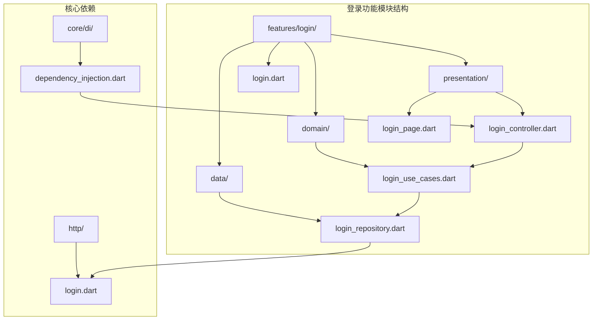
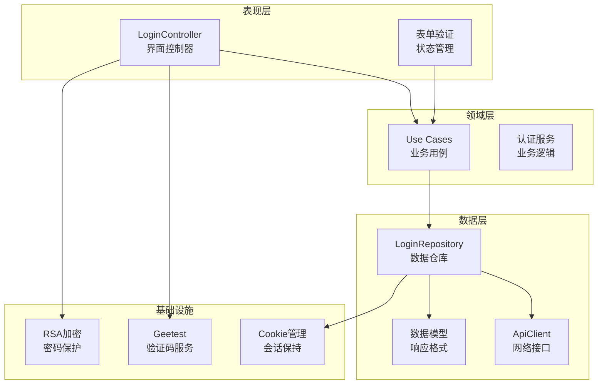
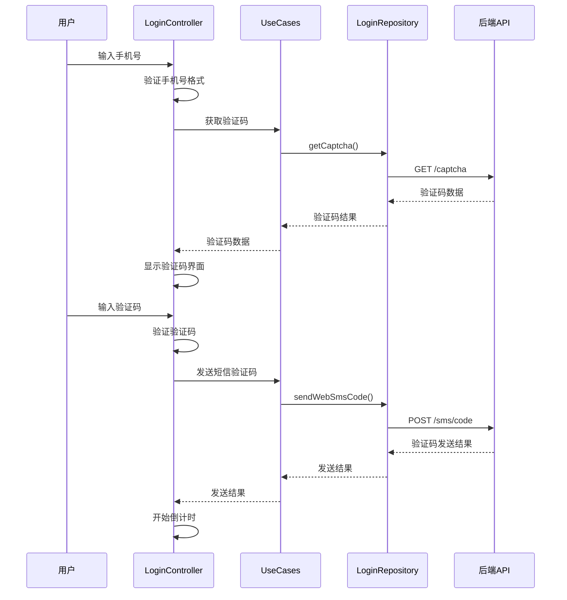
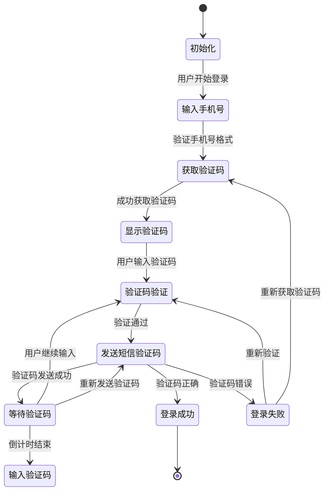
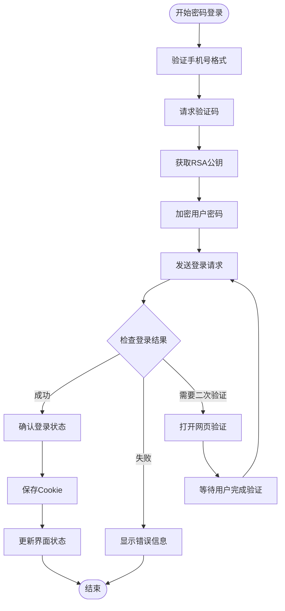
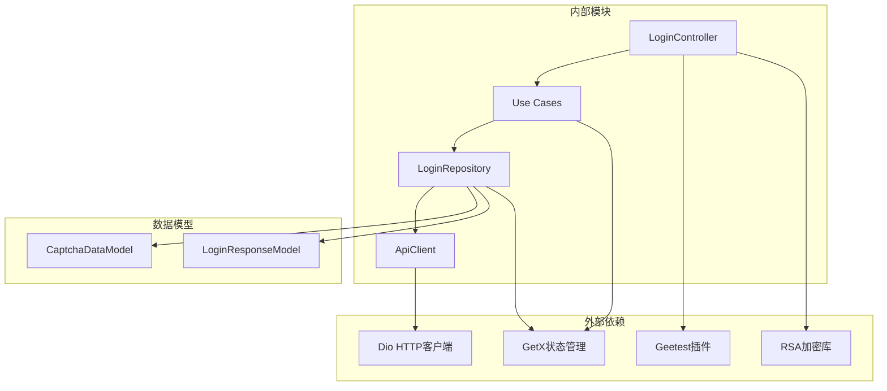

# 登录认证模块

<cite>
**本文档引用的文件**
- [lib/features/login/login.dart](file://lib/features/login/login.dart)
- [lib/features/login/presentation/login_controller.dart](file://lib/features/login/presentation/login_controller.dart)
- [lib/features/login/data/login_repository.dart](file://lib/features/login/data/login_repository.dart)
- [lib/features/login/domain/login_use_cases.dart](file://lib/features/login/domain/login_use_cases.dart)
- [lib/http/login.dart](file://lib/http/login.dart)
- [lib/core/di/dependency_injection.dart](file://lib/core/di/dependency_injection.dart)
- [docs/spec/features/login/spec.md](file://docs/spec/features/login/spec.md)
</cite>

## 目录
1. [简介](#简介)
2. [项目结构](#项目结构)
3. [核心组件](#核心组件)
4. [架构概览](#架构概览)
5. [详细组件分析](#详细组件分析)
6. [依赖关系分析](#依赖关系分析)
7. [性能考虑](#性能考虑)
8. [故障排除指南](#故障排除指南)
9. [结论](#结论)
10. [附录](#附录)

## 简介

登录认证模块是 Pilipala 应用程序的核心功能之一，负责处理用户的身份验证和会话管理。该模块实现了多种登录方式，包括传统的账号密码登录、手机验证码登录、二维码登录等，并提供了完整的安全验证机制。

本模块采用 Clean Architecture 设计模式，将业务逻辑、数据访问和表示层清晰分离，确保了代码的可维护性和可扩展性。模块支持极验（Geetest）验证码集成、RSA 密码加密、Cookie 会话管理等现代安全特性。

## 项目结构

登录认证模块遵循标准的 Flutter 项目结构，采用功能域驱动的组织方式：

**图表来源**
- [lib/features/login/login.dart:1-12](file://lib/features/login/login.dart#L1-L12)
- [lib/features/login/data/login_repository.dart:1-190](file://lib/features/login/data/login_repository.dart#L1-L190)
- [lib/features/login/domain/login_use_cases.dart:1-133](file://lib/features/login/domain/login_use_cases.dart#L1-L133)
- [lib/features/login/presentation/login_controller.dart:1-306](file://lib/features/login/presentation/login_controller.dart#L1-L306)

**章节来源**
- [lib/features/login/login.dart:1-12](file://lib/features/login/login.dart#L1-L12)
- [lib/core/di/dependency_injection.dart:78-87](file://lib/core/di/dependency_injection.dart#L78-L87)

## 核心组件

登录认证模块由四个主要层次组成，每层都有明确的职责分工：

### 数据层（Data Layer）
- **LoginRepository**: 提供登录相关的数据操作接口
- 实现了验证码获取、密码加密、登录请求等功能
- 处理与后端 API 的通信和数据转换

### 领域层（Domain Layer）
- **Use Cases**: 封装具体的业务用例
- 包括验证码获取、密码登录、短信登录、二维码登录等
- 提供统一的业务逻辑接口

### 表示层（Presentation Layer）
- **LoginController**: 管理登录界面的状态和交互
- 处理用户输入验证、表单状态管理
- 协调各种登录方式的执行流程

### 工具层（Utility Layer）
- **LoginUtils**: 提供登录相关的工具函数
- 处理 Cookie 管理、用户信息存储等

**章节来源**
- [lib/features/login/data/login_repository.dart:10-190](file://lib/features/login/data/login_repository.dart#L10-L190)
- [lib/features/login/domain/login_use_cases.dart:4-133](file://lib/features/login/domain/login_use_cases.dart#L4-L133)
- [lib/features/login/presentation/login_controller.dart:11-306](file://lib/features/login/presentation/login_controller.dart#L11-L306)

## 架构概览

登录认证模块采用 Clean Architecture 设计模式，实现了关注点分离和依赖倒置原则：

**图表来源**
- [lib/features/login/presentation/login_controller.dart:15-90](file://lib/features/login/presentation/login_controller.dart#L15-L90)
- [lib/features/login/domain/login_use_cases.dart:5-132](file://lib/features/login/domain/login_use_cases.dart#L5-L132)
- [lib/features/login/data/login_repository.dart:11-189](file://lib/features/login/data/login_repository.dart#L11-L189)

## 详细组件分析

### 登录控制器（LoginController）

LoginController 是登录功能的核心协调者，负责管理整个登录流程的状态和用户交互：

#### 主要功能特性

**状态管理**
- 页面导航控制：支持多步骤登录流程
- 表单状态管理：手机号、密码、验证码输入
- 加载状态控制：异步操作的加载指示器
- 登录类型切换：密码登录与短信登录模式

**用户交互处理**
- 表单验证：手机号格式、密码强度、验证码校验
- 键盘焦点管理：输入框间的焦点切换
- 倒计时功能：短信验证码发送间隔控制
- 弹窗提示：操作反馈和错误信息显示

**多登录方式支持**

**图表来源**
- [lib/features/login/presentation/login_controller.dart:143-243](file://lib/features/login/presentation/login_controller.dart#L143-L243)
- [lib/features/login/domain/login_use_cases.dart:65-88](file://lib/features/login/domain/login_use_cases.dart#L65-L88)

#### 登录流程状态图

**章节来源**
- [lib/features/login/presentation/login_controller.dart:106-140](file://lib/features/login/presentation/login_controller.dart#L106-L140)
- [lib/features/login/presentation/login_controller.dart:184-221](file://lib/features/login/presentation/login_controller.dart#L184-L221)

### 登录仓库（LoginRepository）

LoginRepository 作为数据访问层的核心组件，封装了所有与登录相关的网络请求和数据处理逻辑：

#### 核心方法分析

**验证码获取**
- 请求极验验证码配置
- 返回挑战参数和公钥信息
- 支持错误处理和重试机制

**密码加密**
- 获取服务器公钥和盐值
- 使用 RSA 算法加密用户密码
- 确保传输过程中的密码安全

**登录执行**
- 支持多种登录方式
- 处理登录响应和错误状态
- 管理登录会话和状态

**章节来源**
- [lib/features/login/data/login_repository.dart:17-89](file://lib/features/login/data/login_repository.dart#L17-L89)
- [lib/features/login/data/login_repository.dart:121-188](file://lib/features/login/data/login_repository.dart#L121-L188)

### 业务用例（Use Cases）

业务用例层提供了清晰的业务逻辑抽象，每个用例都封装了一个特定的登录场景：

#### 用例分类

**基础认证用例**
- GetCaptchaUseCase: 获取验证码配置
- GetWebKeyUseCase: 获取加密公钥
- EncryptPasswordUseCase: 密码加密处理

**登录执行用例**
- LoginByPasswordUseCase: 账号密码登录
- LoginBySmsCodeUseCase: 短信验证码登录
- QrCodeLoginUseCase: 二维码登录

**辅助用例**
- SendSmsCodeUseCase: 发送短信验证码

**章节来源**
- [lib/features/login/domain/login_use_cases.dart:4-133](file://lib/features/login/domain/login_use_cases.dart#L4-L133)

### 多登录方式实现

#### 账号密码登录流程

**图表来源**
- [lib/features/login/presentation/login_controller.dart:184-221](file://lib/features/login/presentation/login_controller.dart#L184-L221)
- [lib/features/login/data/login_repository.dart:48-89](file://lib/features/login/data/login_repository.dart#L48-L89)

#### 短信验证码登录流程

短信验证码登录提供了快速便捷的登录体验，特别适合移动设备用户：

**发送验证码流程**
1. 用户输入手机号并触发验证码请求
2. 系统获取极验验证码配置
3. 验证码发送到用户手机
4. 启动60秒倒计时限制重复发送

**验证码登录流程**
1. 用户输入收到的验证码
2. 系统验证验证码的有效性
3. 执行登录操作并处理结果
4. 自动保存登录状态

**章节来源**
- [lib/features/login/presentation/login_controller.dart:224-260](file://lib/features/login/presentation/login_controller.dart#L224-L260)
- [lib/features/login/data/login_repository.dart:91-149](file://lib/features/login/data/login_repository.dart#L91-L149)

#### 二维码登录实现

二维码登录为用户提供了无密码的登录方式，特别适合跨设备场景：

**二维码生成流程**
1. 请求服务器生成二维码
2. 设置180秒有效期倒计时
3. 定期轮询二维码状态
4. 用户使用手机扫描二维码

**状态轮询机制**
- 每秒检查一次二维码状态
- 有效期结束后自动刷新
- 登录成功后停止轮询并关闭界面

**章节来源**
- [lib/features/login/presentation/login_controller.dart:275-304](file://lib/features/login/presentation/login_controller.dart#L275-L304)
- [lib/features/login/data/login_repository.dart:151-180](file://lib/features/login/data/login_repository.dart#L151-L180)

## 依赖关系分析

登录认证模块的依赖关系体现了 Clean Architecture 的设计原则，实现了清晰的关注点分离：

**图表来源**
- [lib/features/login/presentation/login_controller.dart:1-10](file://lib/features/login/presentation/login_controller.dart#L1-L10)
- [lib/features/login/domain/login_use_cases.dart:1-2](file://lib/features/login/domain/login_use_cases.dart#L1-L2)
- [lib/features/login/data/login_repository.dart:1-8](file://lib/features/login/data/login_repository.dart#L1-L8)

### 依赖注入配置

系统使用 GetX 的依赖注入框架来管理组件的生命周期和依赖关系：

**注册流程**
1. LoginRepository 注册到容器中
2. 各种 Use Cases 作为 LoginRepository 的依赖
3. LoginController 依赖所有 Use Cases
4. 通过 Get.lazyPut 实现延迟初始化

**章节来源**
- [lib/core/di/dependency_injection.dart:78-87](file://lib/core/di/dependency_injection.dart#L78-L87)

## 性能考虑

登录认证模块在设计时充分考虑了性能优化和用户体验：

### 网络请求优化
- **连接复用**: 使用 Dio 的连接池管理
- **请求缓存**: 对验证码等静态数据进行缓存
- **超时控制**: 合理设置请求超时时间
- **重试机制**: 对临时性错误进行自动重试

### 内存管理
- **资源清理**: 及时释放定时器和控制器资源
- **状态优化**: 使用 Rx 状态管理减少不必要的重建
- **图片缓存**: 二维码等图片资源的缓存策略

### 用户体验优化
- **加载指示**: 异步操作时显示加载状态
- **错误处理**: 友好的错误提示和恢复机制
- **输入验证**: 实时的表单验证反馈

## 故障排除指南

### 常见问题及解决方案

**验证码相关问题**
- 验证码获取失败：检查网络连接和验证码服务状态
- 验证码无效：重新获取验证码或检查输入格式
- 验证码过期：验证码通常有5-10分钟有效期

**登录失败问题**
- 密码错误：检查大小写和特殊字符
- 账号不存在：确认手机号是否正确注册
- 网络异常：检查网络连接稳定性

**性能问题**
- 登录响应慢：检查服务器负载和网络状况
- 内存泄漏：确保及时释放定时器和控制器资源

**章节来源**
- [docs/spec/features/login/spec.md:167-186](file://docs/spec/features/login/spec.md#L167-L186)

### 调试技巧

**开发环境调试**
- 启用 Dio 日志拦截器查看请求详情
- 使用 Flutter DevTools 分析内存使用情况
- 监控网络请求和响应时间

**生产环境监控**
- 记录关键操作的性能指标
- 监控错误率和用户反馈
- 定期检查依赖服务的可用性

## 结论

登录认证模块通过采用 Clean Architecture 设计模式，成功实现了功能完整、结构清晰、易于维护的认证系统。模块支持多种登录方式，具备良好的扩展性和安全性。

### 主要优势
- **架构清晰**: 层次分明，职责明确
- **功能完整**: 支持多种登录方式和安全验证
- **易于扩展**: 插件化的架构便于添加新功能
- **用户体验良好**: 流畅的交互和及时的反馈

### 改进建议
- 完善 Token 持久化机制
- 增强安全防护措施
- 优化错误处理和用户提示
- 添加更多登录方式支持

## 附录

### API 接口规范

| 接口名称 | 方法 | URL | 功能描述 |
|---------|------|-----|----------|
| 获取验证码 | GET | `/captcha` | 获取极验验证码配置 |
| 获取公钥 | GET | `/web/key` | 获取RSA公钥和盐值 |
| 账号密码登录 | POST | `/web/password` | 使用密码登录 |
| 发送短信验证码 | POST | `/sms/code` | 发送短信验证码 |
| 短信验证码登录 | POST | `/sms/login` | 使用验证码登录 |
| 获取二维码 | GET | `/qrcode` | 生成登录二维码 |
| 查询二维码状态 | GET | `/qrcode/status` | 检查二维码登录状态 |

### 安全最佳实践

**密码安全**
- 使用 RSA 加密传输密码
- 服务器端进行密码哈希存储
- 定期更新加密算法和密钥

**会话管理**
- 合理设置 Cookie 过期时间
- 实现会话超时和自动登出
- 支持多设备登录管理

**验证码安全**
- 限制验证码发送频率
- 设置验证码有效期
- 防止暴力破解攻击