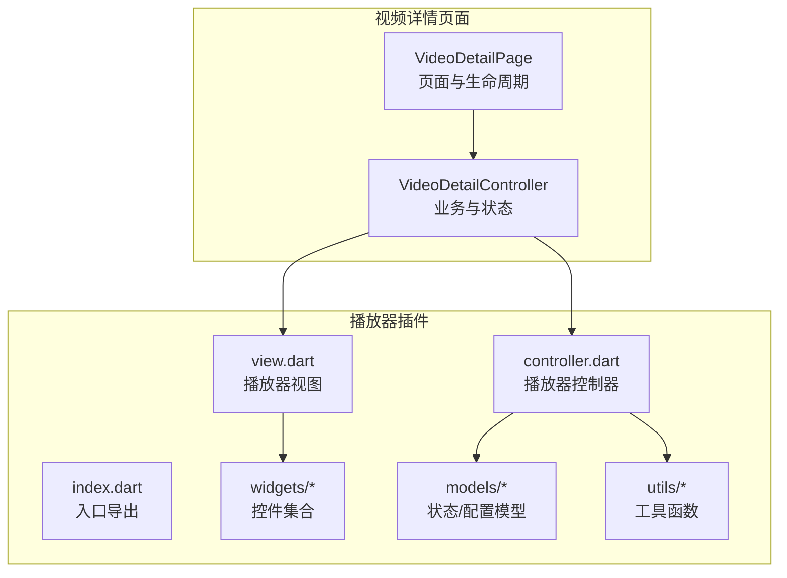
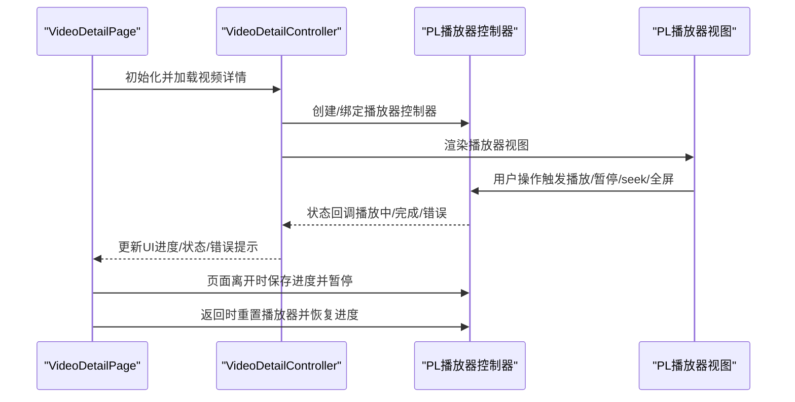
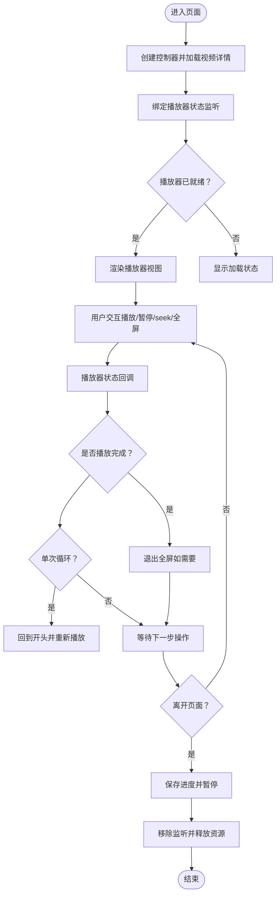
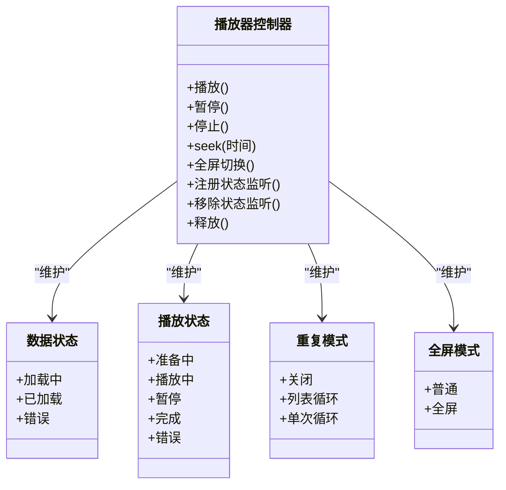
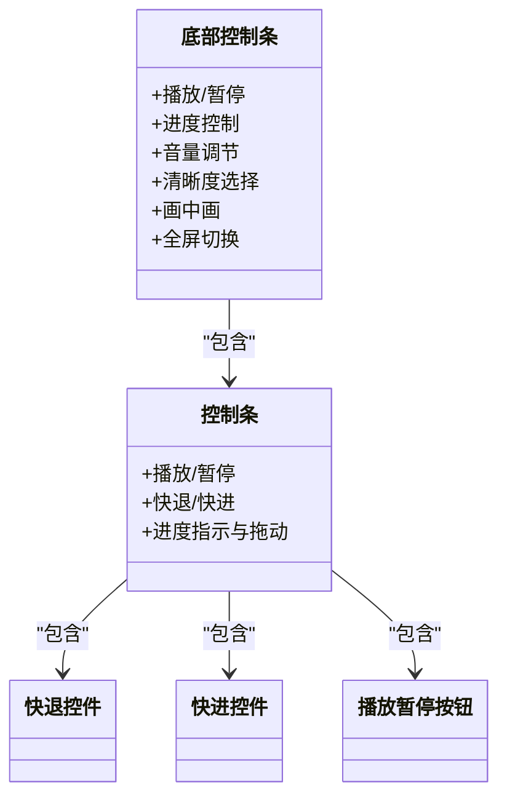
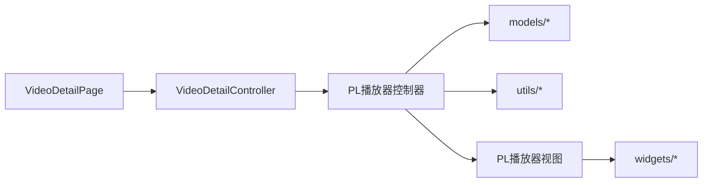

# 播放器集成与控制

<cite>
**本文引用的文件**
- [video_detail_page.dart](file://lib/features/video/presentation/video_detail_page.dart)
- [video_detail_controller.dart](file://lib/features/video/presentation/video_detail_controller.dart)
- [index.dart](file://lib/plugin/pl_player/index.dart)
- [controller.dart](file://lib/plugin/pl_player/controller.dart)
- [view.dart](file://lib/plugin/pl_player/view.dart)
- [bottom_control.dart](file://lib/plugin/pl_player/widgets/bottom_control.dart)
- [control_bar.dart](file://lib/plugin/pl_player/widgets/control_bar.dart)
- [backward_seek.dart](file://lib/plugin/pl_player/widgets/backward_seek.dart)
- [forward_seek.dart](file://lib/plugin/pl_player/widgets/forward_seek.dart)
- [play_pause_btn.dart](file://lib/plugin/pl_player/widgets/play_pause_btn.dart)
- [fullscreen.dart](file://lib/plugin/pl_player/utils/fullscreen.dart)
- [data_status.dart](file://lib/plugin/pl_player/models/data_status.dart)
- [play_status.dart](file://lib/plugin/pl_player/models/play_status.dart)
- [play_repeat.dart](file://lib/plugin/pl_player/models/play_repeat.dart)
- [fullscreen_mode.dart](file://lib/plugin/pl_player/models/fullscreen_mode.dart)
- [bottom_control_type.dart](file://lib/plugin/pl_player/models/bottom_control_type.dart)
- [bottom_progress_behavior.dart](file://lib/plugin/pl_player/models/bottom_progress_behavior.dart)
- [data_source.dart](file://lib/plugin/pl_player/models/data_source.dart)
- [duration.dart](file://lib/plugin/pl_player/models/duration.dart)
- [play_speed.dart](file://lib/plugin/pl_player/models/play_speed.dart)
</cite>

## 目录
1. [简介](#简介)
2. [项目结构](#项目结构)
3. [核心组件](#核心组件)
4. [架构总览](#架构总览)
5. [详细组件分析](#详细组件分析)
6. [依赖关系分析](#依赖关系分析)
7. [性能考虑](#性能考虑)
8. [故障排除指南](#故障排除指南)
9. [结论](#结论)
10. [附录](#附录)

## 简介
本文件系统性梳理了播放器在应用中的集成与控制方案，覆盖播放器生命周期管理、播放控制逻辑、用户交互处理、状态管理、缓冲策略、错误处理机制，以及播放控制组件（播放/暂停、进度控制、音量调节等）的实现细节。同时提供播放器配置选项、性能优化建议与常见问题解决方案，并展示如何扩展播放器功能与集成第三方播放器。

## 项目结构
播放器相关代码主要位于以下模块：
- 视频详情页面与控制器：负责页面生命周期、播放器实例管理、数据加载与错误处理
- 自研播放器插件（pl_player）：封装播放器视图、控制器、模型与工具类，提供统一的播放控制接口
- 控件层：底部控制条、播放/暂停按钮、快退/快进控件等

图表来源
- [video_detail_page.dart:1-105](file://lib/features/video/presentation/video_detail_page.dart#L1-L105)
- [video_detail_controller.dart:1-31](file://lib/features/video/presentation/video_detail_controller.dart#L1-L31)
- [index.dart](file://lib/plugin/pl_player/index.dart)
- [controller.dart](file://lib/plugin/pl_player/controller.dart)
- [view.dart](file://lib/plugin/pl_player/view.dart)

章节来源
- [video_detail_page.dart:1-105](file://lib/features/video/presentation/video_detail_page.dart#L1-L105)
- [video_detail_controller.dart:1-31](file://lib/features/video/presentation/video_detail_controller.dart#L1-L31)

## 核心组件
- 视频详情页面（VideoDetailPage）
  - 负责页面生命周期管理（进入/离开/返回）、播放器实例隔离与销毁
  - 监听播放器状态变化，处理播放完成、全屏切换等事件
  - 与控制器协作，实现播放进度保存与恢复
- 视频详情控制器（VideoDetailController）
  - 维护视频详情、播放地址、评论等状态
  - 持有播放器控制器引用，协调播放器初始化、重置与释放
  - 处理网络请求与本地存储，支持错误提示与加载状态
- 播放器插件（pl_player）
  - 提供统一的播放器控制器（controller.dart），封装播放、暂停、seek、全屏、重复模式等能力
  - 提供播放器视图（view.dart）与控件集合（widgets/*），包含底部控制条、播放/暂停按钮、快退/快进等
  - 定义播放状态、数据状态、全屏模式、重复模式、播放速度等模型（models/*）

章节来源
- [video_detail_page.dart:28-105](file://lib/features/video/presentation/video_detail_page.dart#L28-L105)
- [video_detail_controller.dart:16-31](file://lib/features/video/presentation/video_detail_controller.dart#L16-L31)
- [controller.dart](file://lib/plugin/pl_player/controller.dart)
- [view.dart](file://lib/plugin/pl_player/view.dart)

## 架构总览
下图展示了从页面到播放器控制器再到播放器视图的整体调用链路，以及状态与事件的流转：

图表来源
- [video_detail_page.dart:36-105](file://lib/features/video/presentation/video_detail_page.dart#L36-L105)
- [video_detail_controller.dart:16-31](file://lib/features/video/presentation/video_detail_controller.dart#L16-L31)
- [controller.dart](file://lib/plugin/pl_player/controller.dart)
- [view.dart](file://lib/plugin/pl_player/view.dart)

## 详细组件分析

### 页面生命周期与播放器管理
- 页面进入：通过路由参数获取视频标识，生成唯一 heroTag 以隔离控制器实例；注册播放器状态监听
- 页面离开：保存当前播放进度，移除状态监听，暂停播放，避免后台资源占用
- 页面返回：根据保存的进度重置播放器，恢复监听，保证用户体验连贯
- 全屏适配：根据横竖屏与全屏状态动态调整 AppBar 高度与系统 UI 显示

图表来源
- [video_detail_page.dart:36-105](file://lib/features/video/presentation/video_detail_page.dart#L36-L105)

章节来源
- [video_detail_page.dart:36-105](file://lib/features/video/presentation/video_detail_page.dart#L36-L105)

### 播放器控制器与状态管理
- 播放器控制器（controller.dart）提供：
  - 播放/暂停/停止/seek/全屏切换等核心方法
  - 播放状态（playStatus）、数据状态（dataStatus）、重复模式（playRepeat）、全屏模式（fullScreenMode）等状态属性
  - 状态监听器注册/移除，便于页面响应播放器事件
- 数据状态模型（data_status.dart）定义加载中、已加载、错误等状态，驱动 UI 分支渲染
- 播放状态模型（play_status.dart）定义准备中、播放中、暂停、完成、错误等状态
- 重复模式（play_repeat.dart）支持关闭、列表循环、单次循环等
- 全屏模式（fullscreen_mode.dart）与工具（fullscreen.dart）协同处理全屏切换与系统 UI

图表来源
- [controller.dart](file://lib/plugin/pl_player/controller.dart)
- [data_status.dart](file://lib/plugin/pl_player/models/data_status.dart)
- [play_status.dart](file://lib/plugin/pl_player/models/play_status.dart)
- [play_repeat.dart](file://lib/plugin/pl_player/models/play_repeat.dart)
- [fullscreen_mode.dart](file://lib/plugin/pl_player/models/fullscreen_mode.dart)

章节来源
- [controller.dart](file://lib/plugin/pl_player/controller.dart)
- [data_status.dart](file://lib/plugin/pl_player/models/data_status.dart)
- [play_status.dart](file://lib/plugin/pl_player/models/play_status.dart)
- [play_repeat.dart](file://lib/plugin/pl_player/models/play_repeat.dart)
- [fullscreen_mode.dart](file://lib/plugin/pl_player/models/fullscreen_mode.dart)

### 播放控制组件实现
- 底部控制条（bottom_control.dart）：聚合播放/暂停、进度条、音量、清晰度、画中画、全屏等控件
- 控制条（control_bar.dart）：提供播放/暂停按钮、快退/快进、进度指示与拖动
- 快退/快进控件（backward_seek.dart、forward_seek.dart）：支持按步长进行时间轴跳转
- 播放/暂停按钮（play_pause_btn.dart）：根据播放状态切换图标与行为
- 布局与交互：底部控制条与控制条通过回调与播放器控制器联动，实现播放控制与进度同步

图表来源
- [bottom_control.dart](file://lib/plugin/pl_player/widgets/bottom_control.dart)
- [control_bar.dart](file://lib/plugin/pl_player/widgets/control_bar.dart)
- [backward_seek.dart](file://lib/plugin/pl_player/widgets/backward_seek.dart)
- [forward_seek.dart](file://lib/plugin/pl_player/widgets/forward_seek.dart)
- [play_pause_btn.dart](file://lib/plugin/pl_player/widgets/play_pause_btn.dart)

章节来源
- [bottom_control.dart](file://lib/plugin/pl_player/widgets/bottom_control.dart)
- [control_bar.dart](file://lib/plugin/pl_player/widgets/control_bar.dart)
- [backward_seek.dart](file://lib/plugin/pl_player/widgets/backward_seek.dart)
- [forward_seek.dart](file://lib/plugin/pl_player/widgets/forward_seek.dart)
- [play_pause_btn.dart](file://lib/plugin/pl_player/widgets/play_pause_btn.dart)

### 错误处理与缓冲策略
- 错误处理：当数据状态为错误时，页面显示错误界面并提示用户；控制器维护错误信息状态，供 UI 展示
- 缓冲策略：播放器控制器内部维护数据状态与播放状态，页面根据状态切换加载指示或播放器视图；在页面离开时暂停播放，减少后台资源消耗
- 用户体验：播放完成后自动退出全屏（如处于全屏），单次循环模式下自动回到开头并重新播放

章节来源
- [video_detail_page.dart:273-288](file://lib/features/video/presentation/video_detail_page.dart#L273-L288)
- [data_status.dart](file://lib/plugin/pl_player/models/data_status.dart)
- [play_status.dart](file://lib/plugin/pl_player/models/play_status.dart)

### 配置选项与扩展点
- 播放器配置模型：
  - 数据源（data_source.dart）：支持不同来源的媒体数据
  - 播放速度（play_speed.dart）：支持多倍速播放
  - 进度行为（bottom_progress_behavior.dart）：自定义进度条交互行为
  - 底部控件类型（bottom_control_type.dart）：启用/禁用特定控件
  - 时长模型（duration.dart）：统一时长表示与格式化
- 扩展建议：
  - 新增播放器：在入口导出（index.dart）中统一导出新播放器组件，并在控制器中抽象统一接口
  - 新增控件：在 widgets 目录新增控件并在底部控制条中组合使用
  - 新增配置：在 models 目录新增配置模型并通过控制器注入

章节来源
- [data_source.dart](file://lib/plugin/pl_player/models/data_source.dart)
- [play_speed.dart](file://lib/plugin/pl_player/models/play_speed.dart)
- [bottom_progress_behavior.dart](file://lib/plugin/pl_player/models/bottom_progress_behavior.dart)
- [bottom_control_type.dart](file://lib/plugin/pl_player/models/bottom_control_type.dart)
- [duration.dart](file://lib/plugin/pl_player/models/duration.dart)
- [index.dart](file://lib/plugin/pl_player/index.dart)

## 依赖关系分析
- 页面依赖控制器：VideoDetailPage 通过 Get 容器管理控制器实例，确保页面间隔离
- 控制器依赖播放器：VideoDetailController 持有播放器控制器引用，协调播放器初始化与释放
- 播放器依赖模型与工具：播放器控制器使用 models 与 utils 中的状态与工具函数
- 控件依赖播放器：widgets 通过回调与播放器控制器交互，实现播放控制

图表来源
- [video_detail_page.dart:28-105](file://lib/features/video/presentation/video_detail_page.dart#L28-L105)
- [video_detail_controller.dart:16-31](file://lib/features/video/presentation/video_detail_controller.dart#L16-L31)
- [controller.dart](file://lib/plugin/pl_player/controller.dart)
- [view.dart](file://lib/plugin/pl_player/view.dart)

章节来源
- [video_detail_page.dart:28-105](file://lib/features/video/presentation/video_detail_page.dart#L28-L105)
- [video_detail_controller.dart:16-31](file://lib/features/video/presentation/video_detail_controller.dart#L16-L31)
- [controller.dart](file://lib/plugin/pl_player/controller.dart)
- [view.dart](file://lib/plugin/pl_player/view.dart)

## 性能考虑
- 生命周期管理：页面离开时暂停播放并移除监听，避免后台资源占用
- 进度保存与恢复：离开前保存进度，返回后快速恢复，提升连续观看体验
- 全屏适配：根据横竖屏与全屏状态动态计算布局高度，减少不必要的重绘
- 状态驱动渲染：通过状态模型驱动 UI 切换，避免手动 DOM 操作带来的性能损耗
- 控件解耦：控件通过回调与控制器交互，降低耦合度，便于独立优化

## 故障排除指南
- 播放器无法初始化
  - 检查数据状态是否为“已加载”，若为“错误”则查看错误信息状态
  - 确认播放器控制器已正确创建并绑定
- 播放完成后未退出全屏
  - 确认状态监听中对完成事件的处理逻辑
- 单次循环不生效
  - 检查重复模式设置是否为“单次循环”，并确认 seek 回到开头后的播放触发
- 页面返回后无声音或画面
  - 确认返回时重置播放器并恢复进度的流程是否执行
- 全屏切换异常
  - 检查全屏模式与工具函数的使用，确保与系统 UI 的切换一致

章节来源
- [video_detail_page.dart:53-63](file://lib/features/video/presentation/video_detail_page.dart#L53-L63)
- [play_repeat.dart](file://lib/plugin/pl_player/models/play_repeat.dart)
- [fullscreen.dart](file://lib/plugin/pl_player/utils/fullscreen.dart)

## 结论
该播放器集成方案通过清晰的分层设计实现了播放器生命周期管理、播放控制逻辑与用户交互处理的解耦。页面层负责生命周期与状态展示，控制器层负责业务编排与播放器协调，插件层提供可复用的播放器视图与控件。配合完善的状态模型与工具函数，系统具备良好的可扩展性与可维护性。建议在后续迭代中持续优化状态驱动渲染与控件解耦，进一步提升性能与用户体验。

## 附录
- 快速集成步骤
  - 在页面中创建并持有控制器实例，加载视频详情
  - 将播放器视图挂载到页面布局中，并传入控制器
  - 注册状态监听，处理播放完成、错误等事件
  - 在页面离开时保存进度并暂停播放，返回时重置播放器并恢复进度
- 第三方播放器集成建议
  - 在入口导出中统一导出新播放器组件
  - 抽象统一的播放器接口，确保与现有控制器兼容
  - 保持状态模型与工具函数的一致性，便于控件复用