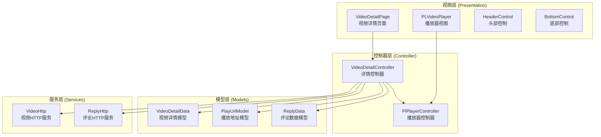
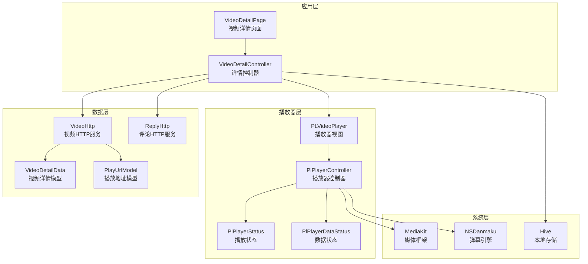
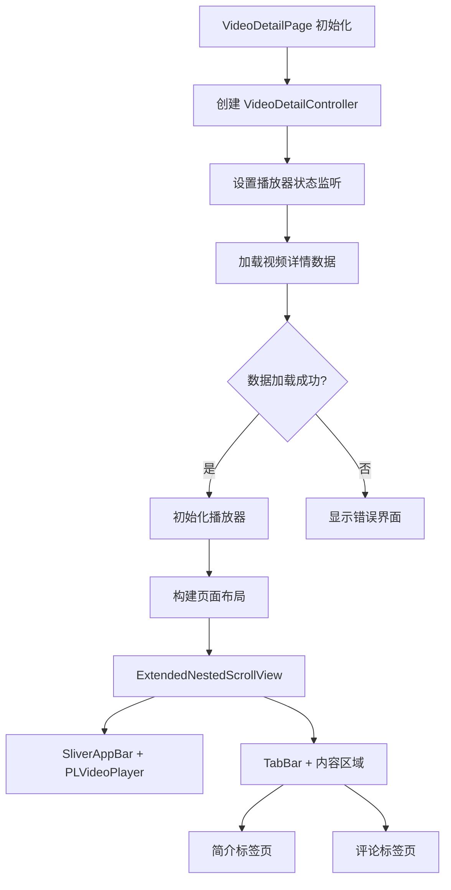
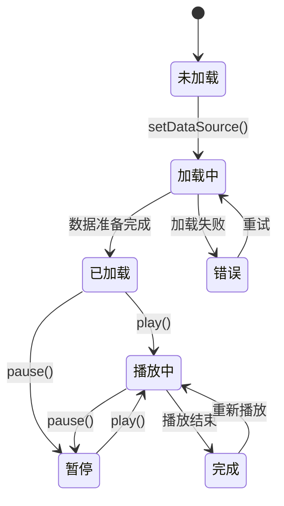
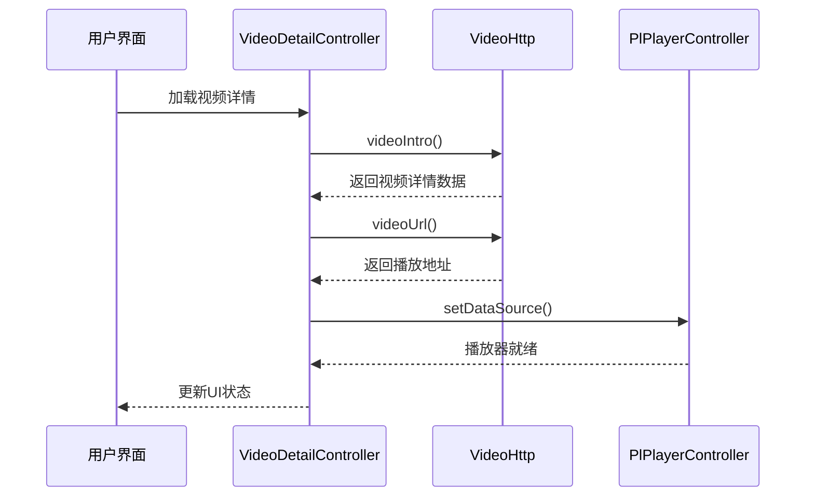
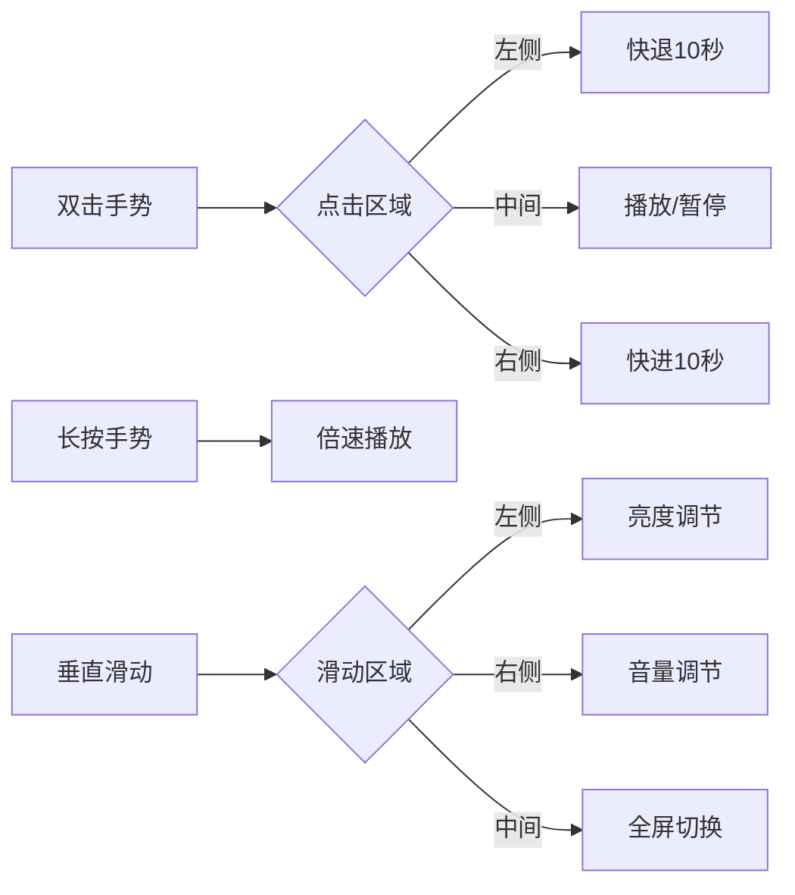
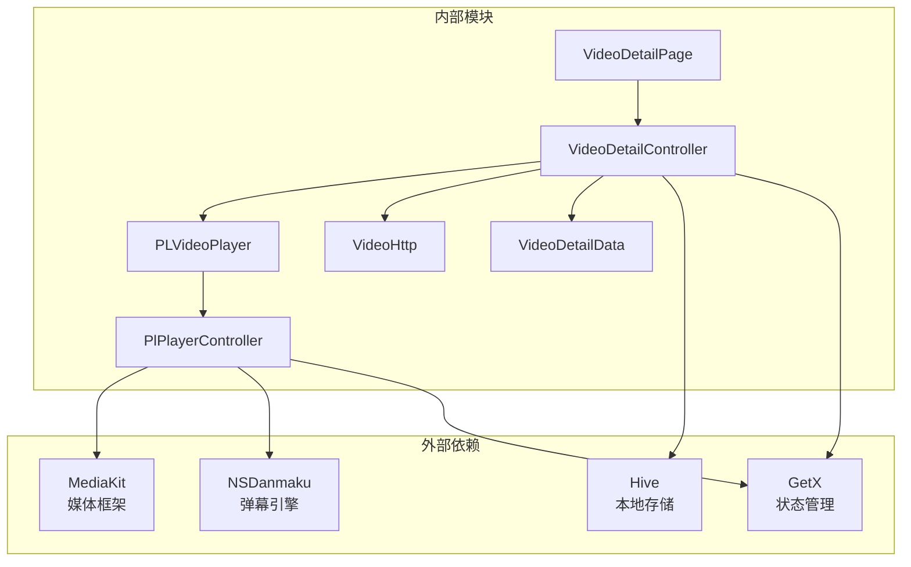

# 视频播放模块

<cite>
**本文档引用的文件**
- [video_detail_page.dart](file://lib/features/video/presentation/video_detail_page.dart)
- [video_detail_controller.dart](file://lib/features/video/presentation/video_detail_controller.dart)
- [index.dart](file://lib/plugin/pl_player/index.dart)
- [controller.dart](file://lib/plugin/pl_player/controller.dart)
- [view.dart](file://lib/plugin/pl_player/view.dart)
- [video_detail_res.dart](file://lib/models/video_detail_res.dart)
- [video.dart](file://lib/http/video.dart)
</cite>

## 目录
1. [简介](#简介)
2. [项目结构](#项目结构)
3. [核心组件](#核心组件)
4. [架构概览](#架构概览)
5. [详细组件分析](#详细组件分析)
6. [依赖关系分析](#依赖关系分析)
7. [性能考虑](#性能考虑)
8. [故障排除指南](#故障排除指南)
9. [结论](#结论)

## 简介

视频播放模块是 pilipala 应用中的核心功能之一，提供了完整的视频播放体验。该模块集成了自研的 PLVideoPlayer 播放器，支持多种播放格式、弹幕系统、用户交互功能，并与应用的整体架构无缝集成。

本模块采用 MVVM 架构模式，通过 GetX 进行状态管理，实现了响应式的数据绑定和组件通信。播放器支持多种播放模式，包括标准播放、全屏播放、直播播放等，并提供了丰富的用户交互功能。

## 项目结构

视频播放模块主要由以下层次组成：

**图表来源**
- [video_detail_page.dart:1-746](file://lib/features/video/presentation/video_detail_page.dart#L1-L746)
- [video_detail_controller.dart:1-498](file://lib/features/video/presentation/video_detail_controller.dart#L1-L498)
- [controller.dart:34-1102](file://lib/plugin/pl_player/controller.dart#L34-L1102)

**章节来源**
- [video_detail_page.dart:1-746](file://lib/features/video/presentation/video_detail_page.dart#L1-L746)
- [video_detail_controller.dart:1-498](file://lib/features/video/presentation/video_detail_controller.dart#L1-L498)

## 核心组件

### 播放器控制器 (PlPlayerController)

PlPlayerController 是播放器的核心控制器，负责管理播放状态、媒体控制和用户交互。它采用了单例模式设计，确保整个应用中只有一个播放器实例。

关键特性：
- **状态管理**：使用 Rx 响应式编程管理播放状态、缓冲状态、音量状态等
- **播放控制**：支持播放、暂停、跳转、倍速播放等基础控制
- **全屏管理**：提供全屏切换和方向控制功能
- **弹幕集成**：与弹幕系统深度集成，支持弹幕显示和控制
- **硬件加速**：支持硬件加速播放，提升性能表现

### 视频详情控制器 (VideoDetailController)

VideoDetailController 负责视频详情页面的状态管理，协调播放器与页面其他组件的交互。

主要职责：
- **数据加载**：管理视频详情、播放地址、评论等数据的加载和缓存
- **用户交互**：处理点赞、投币、收藏等用户操作
- **页面导航**：管理页面状态和路由跳转
- **播放器集成**：与 PlPlayerController 协作，实现播放控制

### 播放器视图 (PLVideoPlayer)

PLVideoPlayer 是播放器的 UI 组件，提供了完整的播放界面和用户交互功能。

核心功能：
- **手势控制**：支持双击快进、音量调节、亮度控制等手势操作
- **控制条**：提供播放/暂停、进度条、音量控制等用户控件
- **全屏模式**：支持全屏播放和横竖屏切换
- **弹幕显示**：集成弹幕系统，提供弹幕开关和样式设置

**章节来源**
- [controller.dart:34-1102](file://lib/plugin/pl_player/controller.dart#L34-L1102)
- [video_detail_controller.dart:20-498](file://lib/features/video/presentation/video_detail_controller.dart#L20-L498)
- [view.dart:33-958](file://lib/plugin/pl_player/view.dart#L33-L958)

## 架构概览

视频播放模块采用分层架构设计，各层职责清晰，耦合度低，便于维护和扩展。

**图表来源**
- [video_detail_page.dart:19-746](file://lib/features/video/presentation/video_detail_page.dart#L19-L746)
- [controller.dart:34-1102](file://lib/plugin/pl_player/controller.dart#L34-L1102)
- [video_detail_controller.dart:16-498](file://lib/features/video/presentation/video_detail_controller.dart#L16-L498)

## 详细组件分析

### 视频详情页面 (VideoDetailPage)

VideoDetailPage 是视频播放模块的入口页面，负责整合所有播放相关功能。

#### 页面结构设计

**图表来源**
- [video_detail_page.dart:36-105](file://lib/features/video/presentation/video_detail_page.dart#L36-L105)

#### 生命周期管理

页面实现了完整的生命周期管理，包括：

- **初始化阶段**：创建控制器、设置监听器、加载数据
- **前台/后台切换**：保存播放进度、暂停播放、恢复播放
- **销毁阶段**：清理资源、移除监听器、释放播放器

#### 状态管理机制

页面使用 Obx 组件实现响应式状态更新，当播放器状态变化时，UI 自动刷新。

**章节来源**
- [video_detail_page.dart:19-746](file://lib/features/video/presentation/video_detail_page.dart#L19-L746)

### 播放器控制器 (PlPlayerController)

PlPlayerController 是播放器的核心控制单元，实现了复杂的播放逻辑和状态管理。

#### 播放状态管理

**图表来源**
- [controller.dart:44-48](file://lib/plugin/pl_player/controller.dart#L44-L48)

#### 数据源配置

播放器支持多种数据源格式：

- **网络视频**：支持 HTTP/HTTPS 协议的视频流
- **本地资源**：支持本地文件播放
- **DASH 格式**：支持动态自适应流媒体
- **HLS 格式**：支持 HTTP Live Streaming

#### 缓冲策略

播放器实现了智能的缓冲策略：

- **预缓冲**：启动时预加载一定量的数据
- **动态调整**：根据网络状况动态调整缓冲大小
- **内存管理**：合理管理内存使用，避免内存泄漏

**章节来源**
- [controller.dart:317-391](file://lib/plugin/pl_player/controller.dart#L317-L391)
- [controller.dart:394-499](file://lib/plugin/pl_player/controller.dart#L394-L499)

### 视频详情控制器 (VideoDetailController)

VideoDetailController 负责管理视频详情页面的所有状态和业务逻辑。

#### 数据流管理

**图表来源**
- [video_detail_controller.dart:162-225](file://lib/features/video/presentation/video_detail_controller.dart#L162-L225)

#### 用户交互功能

控制器实现了完整的用户交互功能：

- **点赞/取消点赞**：支持视频点赞操作
- **投币**：支持投币功能，支持1-2个币
- **收藏**：支持视频收藏功能
- **关注UP主**：支持关注或取消关注UP主

**章节来源**
- [video_detail_controller.dart:410-497](file://lib/features/video/presentation/video_detail_controller.dart#L410-L497)

### 播放器视图 (PLVideoPlayer)

PLVideoPlayer 提供了完整的播放界面和丰富的用户交互功能。

#### 手势控制系统

播放器实现了多点触控手势系统：

**图表来源**
- [view.dart:582-704](file://lib/plugin/pl_player/view.dart#L582-L704)

#### 控制条设计

播放器提供了可定制的控制条：

- **播放/暂停按钮**：控制视频播放状态
- **进度条**：显示播放进度和缓冲状态
- **时间显示**：显示当前时间和总时长
- **全屏按钮**：切换全屏模式
- **画幅比例**：支持多种视频显示模式

**章节来源**
- [view.dart:214-371](file://lib/plugin/pl_player/view.dart#L214-L371)
- [view.dart:707-736](file://lib/plugin/pl_player/view.dart#L707-L736)

## 依赖关系分析

视频播放模块的依赖关系清晰，各组件之间通过接口进行通信，降低了耦合度。

**图表来源**
- [controller.dart:10-26](file://lib/plugin/pl_player/controller.dart#L10-L26)
- [video_detail_controller.dart:1-15](file://lib/features/video/presentation/video_detail_controller.dart#L1-L15)

### 核心依赖注入

模块采用了依赖注入的设计模式：

- **控制器注入**：通过 GetX 的依赖注入机制管理控制器实例
- **服务注入**：HTTP 服务通过构造函数注入，便于测试和替换
- **播放器注入**：播放器控制器作为单例提供全局访问

**章节来源**
- [index.dart:1-15](file://lib/plugin/pl_player/index.dart#L1-L15)
- [video_detail_page.dart:43-50](file://lib/features/video/presentation/video_detail_page.dart#L43-L50)

## 性能考虑

视频播放模块在性能方面进行了多项优化：

### 内存管理
- **播放器复用**：使用单例模式避免重复创建播放器实例
- **资源释放**：在页面销毁时及时释放播放器资源
- **图片缓存**：使用高效的图片缓存机制减少内存占用

### 网络优化
- **请求合并**：将多个小请求合并为批量请求
- **缓存策略**：实现智能缓存机制，减少重复网络请求
- **连接池**：使用连接池管理网络连接，提高效率

### 播放性能
- **硬件加速**：启用硬件加速播放，提升解码性能
- **预缓冲**：智能预缓冲策略，减少卡顿
- **格式适配**：支持多种视频格式，优化播放体验

## 故障排除指南

### 常见问题及解决方案

#### 播放器无法初始化
**症状**：播放器显示空白或报错
**原因**：数据源配置错误或网络问题
**解决方案**：
1. 检查视频URL的有效性
2. 验证HTTP头部设置
3. 确认网络连接正常

#### 播放卡顿
**症状**：视频播放过程中出现卡顿
**原因**：网络带宽不足或设备性能问题
**解决方案**：
1. 降低视频清晰度
2. 检查网络连接质量
3. 关闭其他占用网络的应用

#### 弹幕不显示
**症状**：弹幕无法正常显示
**原因**：弹幕服务器连接问题或配置错误
**解决方案**：
1. 检查弹幕服务器状态
2. 验证弹幕配置参数
3. 重启弹幕服务

#### 全屏模式异常
**症状**：全屏切换失败或显示异常
**原因**：系统权限问题或屏幕适配问题
**解决方案**：
1. 检查全屏权限设置
2. 验证屏幕方向检测逻辑
3. 更新系统兼容性

**章节来源**
- [controller.dart:387-390](file://lib/plugin/pl_player/controller.dart#L387-L390)
- [video_detail_page.dart:338-361](file://lib/features/video/presentation/video_detail_page.dart#L338-L361)

## 结论

视频播放模块是一个功能完整、架构清晰的播放系统。通过合理的分层设计和依赖管理，实现了良好的可维护性和扩展性。

模块的主要优势包括：
- **完整的播放功能**：支持多种播放格式和控制方式
- **优秀的用户体验**：流畅的播放体验和丰富的交互功能
- **良好的性能表现**：优化的内存管理和网络请求
- **易于扩展**：清晰的架构设计便于功能扩展

未来可以考虑的功能增强：
- 支持更多视频格式和编码
- 增强弹幕系统的功能
- 优化离线播放功能
- 添加更多播放器特效和滤镜