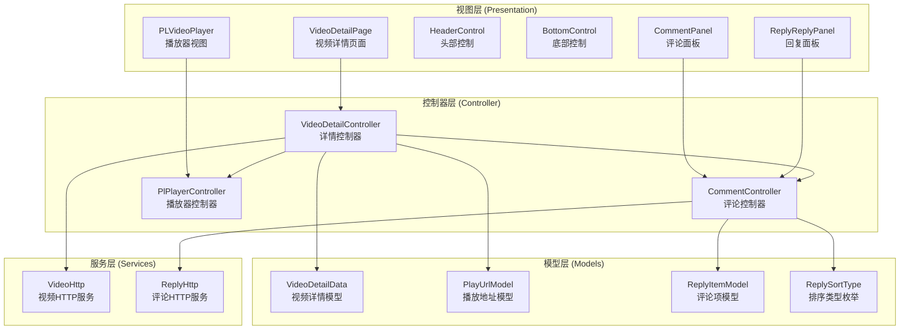
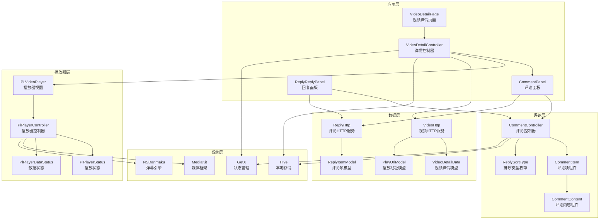
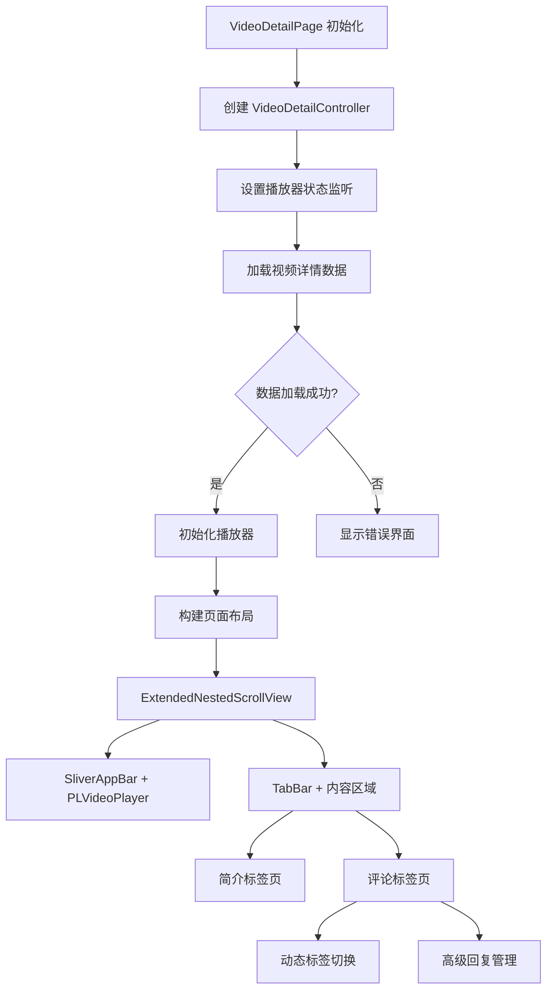
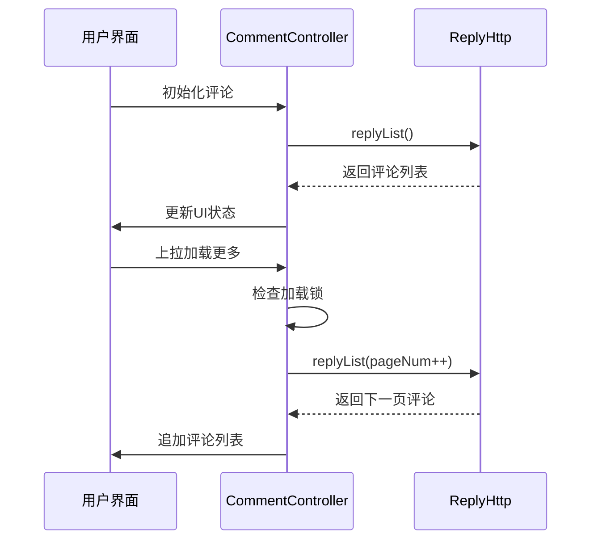
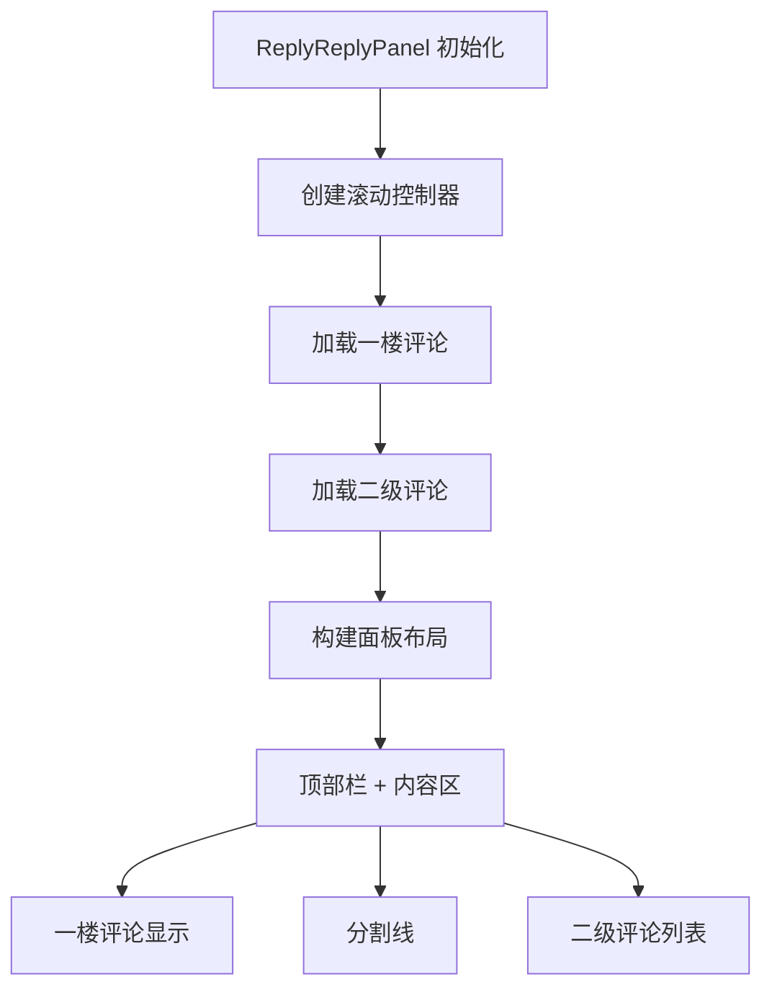
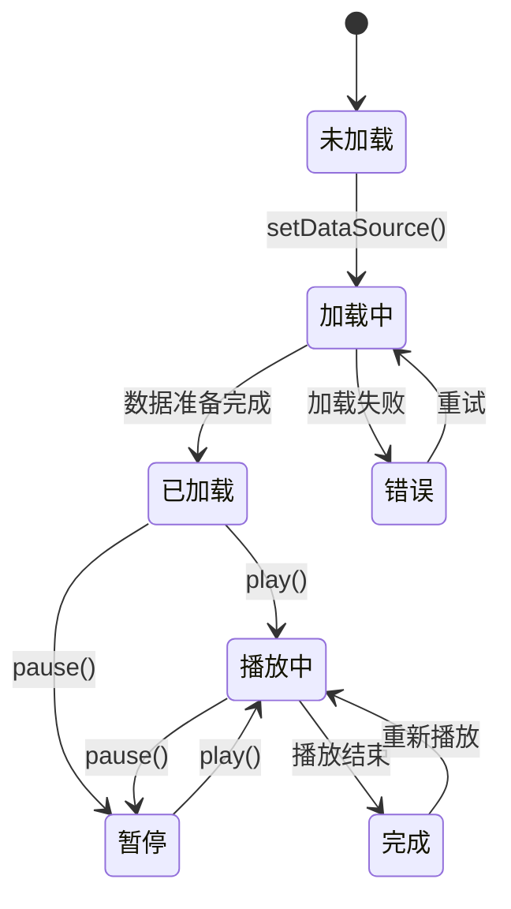
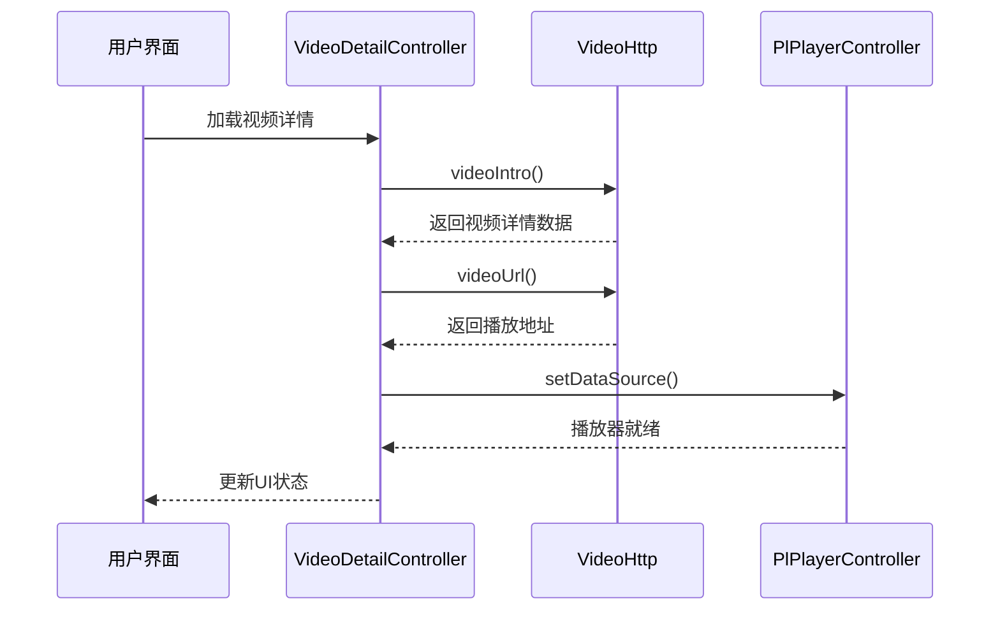
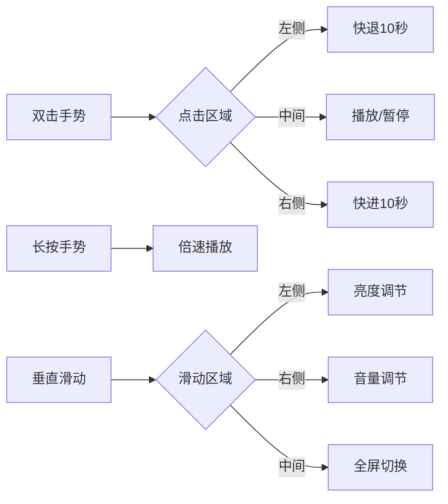
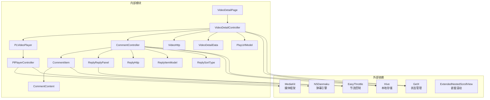

# 视频播放模块

<cite>
**本文档引用的文件**
- [video_detail_page.dart](file://lib/features/video/presentation/video_detail_page.dart)
- [video_detail_controller.dart](file://lib/features/video/presentation/video_detail_controller.dart)
- [comment_controller.dart](file://lib/features/video/presentation/widgets/comment_controller.dart)
- [comment_item.dart](file://lib/features/video/presentation/widgets/comment_item.dart)
- [comment_content.dart](file://lib/features/video/presentation/widgets/comment_content.dart)
- [reply_reply_panel.dart](file://lib/features/video/presentation/widgets/reply_reply_panel.dart)
- [index.dart](file://lib/plugin/pl_player/index.dart)
- [controller.dart](file://lib/plugin/pl_player/controller.dart)
- [view.dart](file://lib/plugin/pl_player/view.dart)
- [video_detail_res.dart](file://lib/models/video_detail_res.dart)
- [video.dart](file://lib/http/video.dart)
- [reply_sort_type.dart](file://lib/models/common/reply_sort_type.dart)
</cite>

## 更新摘要
**所做更改**
- 更新了视频详情页面的动态标签切换功能描述
- 新增了高级回复管理系统的技术实现
- 增强了评论排序功能的详细说明
- 完善了评论面板的交互设计文档

## 目录
1. [简介](#简介)
2. [项目结构](#项目结构)
3. [核心组件](#核心组件)
4. [架构概览](#架构概览)
5. [详细组件分析](#详细组件分析)
6. [依赖关系分析](#依赖关系分析)
7. [性能考虑](#性能考虑)
8. [故障排除指南](#故障排除指南)
9. [结论](#结论)

## 简介

视频播放模块是 pilipala 应用中的核心功能之一，提供了完整的视频播放体验。该模块集成了自研的 PLVideoPlayer 播放器，支持多种播放格式、弹幕系统、用户交互功能，并与应用的整体架构无缝集成。

本模块采用 MVVM 架构模式，通过 GetX 进行状态管理，实现了响应式的数据绑定和组件通信。播放器支持多种播放模式，包括标准播放、全屏播放、直播播放等，并提供了丰富的用户交互功能。

**更新** 本次更新重点增强了视频介绍页面和评论系统的功能，包括动态标签切换、高级回复管理、排序功能等新特性。

## 项目结构

视频播放模块主要由以下层次组成：

**图表来源**
- [video_detail_page.dart:1-1273](file://lib/features/video/presentation/video_detail_page.dart#L1-L1273)
- [video_detail_controller.dart:1-555](file://lib/features/video/presentation/video_detail_controller.dart#L1-L555)
- [comment_controller.dart:1-178](file://lib/features/video/presentation/widgets/comment_controller.dart#L1-L178)
- [controller.dart:34-1102](file://lib/plugin/pl_player/controller.dart#L34-L1102)

**章节来源**
- [video_detail_page.dart:1-1273](file://lib/features/video/presentation/video_detail_page.dart#L1-L1273)
- [video_detail_controller.dart:1-555](file://lib/features/video/presentation/video_detail_controller.dart#L1-L555)

## 核心组件

### 播放器控制器 (PlPlayerController)

PlPlayerController 是播放器的核心控制器，负责管理播放状态、媒体控制和用户交互。它采用了单例模式设计，确保整个应用中只有一个播放器实例。

关键特性：
- **状态管理**：使用 Rx 响应式编程管理播放状态、缓冲状态、音量状态等
- **播放控制**：支持播放、暂停、跳转、倍速播放等基础控制
- **全屏管理**：提供全屏切换和方向控制功能
- **弹幕集成**：与弹幕系统深度集成，支持弹幕显示和控制
- **硬件加速**：支持硬件加速播放，提升性能表现

### 视频详情控制器 (VideoDetailController)

VideoDetailController 负责视频详情页面的状态管理，协调播放器与页面其他组件的交互。

主要职责：
- **数据加载**：管理视频详情、播放地址、评论等数据的加载和缓存
- **用户交互**：处理点赞、投币、收藏等用户操作
- **页面导航**：管理页面状态和路由跳转
- **播放器集成**：与 PlPlayerController 协作，实现播放控制
- **动态标签管理**：实时更新评论标签的计数和状态

### 评论控制器 (CommentController)

**新增** CommentController 是评论系统的中央控制器，负责管理评论列表的加载、排序和交互。

核心功能：
- **评论列表管理**：支持分页加载、置顶评论、热评显示
- **排序功能**：支持按时间排序和按点赞数排序的动态切换
- **加载控制**：智能的加载锁机制，防止重复请求
- **状态同步**：与视频详情控制器协同工作，保持状态一致性

### 播放器视图 (PLVideoPlayer)

PLVideoPlayer 是播放器的 UI 组件，提供了完整的播放界面和用户交互功能。

核心功能：
- **手势控制**：支持双击快进、音量调节、亮度控制等手势操作
- **控制条**：提供播放/暂停、进度条、音量控制等用户控件
- **全屏模式**：支持全屏播放和横竖屏切换
- **弹幕显示**：集成弹幕系统，提供弹幕开关和样式设置

**章节来源**
- [controller.dart:34-1102](file://lib/plugin/pl_player/controller.dart#L34-L1102)
- [video_detail_controller.dart:20-555](file://lib/features/video/presentation/video_detail_controller.dart#L20-L555)
- [comment_controller.dart:11-178](file://lib/features/video/presentation/widgets/comment_controller.dart#L11-L178)
- [view.dart:33-958](file://lib/plugin/pl_player/view.dart#L33-L958)

## 架构概览

视频播放模块采用分层架构设计，各层职责清晰，耦合度低，便于维护和扩展。

**图表来源**
- [video_detail_page.dart:19-1273](file://lib/features/video/presentation/video_detail_page.dart#L19-L1273)
- [controller.dart:34-1102](file://lib/plugin/pl_player/controller.dart#L34-L1102)
- [comment_controller.dart:1-178](file://lib/features/video/presentation/widgets/comment_controller.dart#L1-L178)

## 详细组件分析

### 视频详情页面 (VideoDetailPage)

VideoDetailPage 是视频播放模块的入口页面，负责整合所有播放相关功能。

#### 页面结构设计

**图表来源**
- [video_detail_page.dart:36-105](file://lib/features/video/presentation/video_detail_page.dart#L36-L105)

#### 动态标签切换机制

**更新** 页面实现了智能的动态标签切换功能：

- **实时计数更新**：当评论控制器可用时，标签会显示实际的评论数量
- **条件显示**：如果评论数量为0，显示默认标签；如果有评论，显示带计数的标签
- **状态同步**：标签状态与评论控制器的计数状态保持实时同步

#### 生命周期管理

页面实现了完整的生命周期管理，包括：

- **初始化阶段**：创建控制器、设置监听器、加载数据
- **前台/后台切换**：保存播放进度、暂停播放、恢复播放
- **销毁阶段**：清理资源、移除监听器、释放播放器

#### 状态管理机制

页面使用 Obx 组件实现响应式状态更新，当播放器状态变化时，UI 自动刷新。

**章节来源**
- [video_detail_page.dart:19-1273](file://lib/features/video/presentation/video_detail_page.dart#L19-L1273)

### 评论控制器 (CommentController)

**新增** CommentController 是评论系统的核心控制器，实现了高级的评论管理功能。

#### 评论列表管理

**图表来源**
- [comment_controller.dart:63-128](file://lib/features/video/presentation/widgets/comment_controller.dart#L63-L128)

#### 排序功能实现

**更新** 评论支持两种排序方式的动态切换：

- **时间排序**：按发布时间从新到旧排列
- **点赞排序**：按点赞数从高到低排列
- **智能切换**：通过节流机制防止频繁切换
- **状态持久化**：排序偏好存储在本地设置中

#### 加载控制机制

控制器实现了智能的加载控制：

- **加载锁**：防止同时发起多个请求
- **分页管理**：自动管理页码和分页逻辑
- **无更多数据检测**：智能判断是否还有更多评论
- **错误处理**：优雅处理网络请求失败的情况

**章节来源**
- [comment_controller.dart:11-178](file://lib/features/video/presentation/widgets/comment_controller.dart#L11-L178)

### 评论项组件 (CommentItem)

CommentItem 是单个评论的渲染组件，提供了丰富的交互功能。

#### 评论内容渲染

**更新** 评论内容支持多种复杂元素：

- **表情符号**：支持自定义表情包的渲染和点击
- **@提及**：支持用户提及功能，点击跳转到用户主页
- **链接跳转**：支持多种类型的链接跳转，包括站内外链接
- **图片展示**：支持单张和多张图片的网格展示
- **投票内容**：支持投票内容的特殊渲染

#### 二级评论管理

**新增** 评论项组件支持二级评论的预览和管理：

- **预览显示**：显示前3条子评论的简略信息
- **查看更多**：支持展开查看所有子评论
- **回复交互**：支持直接回复二级评论
- **层级标识**：通过不同的样式区分一级和二级评论

#### 用户交互功能

组件实现了完整的用户交互功能：

- **用户头像点击**：跳转到用户主页
- **点赞功能**：支持对评论的点赞和取消点赞
- **回复功能**：支持回复评论和二级评论
- **热评标识**：特殊标识热门评论

**章节来源**
- [comment_item.dart:1-375](file://lib/features/video/presentation/widgets/comment_item.dart#L1-L375)

### 评论内容组件 (CommentContent)

CommentContent 专门负责评论内容的复杂渲染。

#### 特殊内容处理

**更新** 组件支持多种特殊内容的渲染：

- **HTML实体解码**：正确显示HTML特殊字符
- **表情包渲染**：支持自定义表情包的高质量显示
- **@用户链接**：支持用户提及的点击跳转
- **投票内容**：支持投票信息的特殊展示
- **图片网格**：支持多张图片的网格布局

#### 链接处理机制

组件实现了智能的链接处理：

- **站内链接**：自动识别并处理站内跳转
- **站外链接**：支持外部链接的安全跳转
- **搜索链接**：特殊处理搜索关键词的跳转
- **多媒体链接**：支持富文本链接的预览

**章节来源**
- [comment_content.dart:1-375](file://lib/features/video/presentation/widgets/comment_content.dart#L1-L375)

### 回复面板 (ReplyReplyPanel)

**新增** ReplyReplyPanel 是二级评论详情页面的专用组件。

#### 面板设计

**图表来源**
- [reply_reply_panel.dart:29-97](file://lib/features/video/presentation/widgets/reply_reply_panel.dart#L29-L97)

#### 交互功能

面板提供了完整的二级评论交互：

- **刷新功能**：支持下拉刷新获取最新回复
- **无限滚动**：支持上拉加载更多回复
- **回复输入**：支持在底部弹出回复输入框
- **状态同步**：实时同步回复状态和计数

#### 响应式设计

面板采用了响应式设计：

- **动态高度**：根据屏幕尺寸自动调整高度
- **滚动优化**：优化的滚动性能和用户体验
- **加载指示**：智能的加载状态指示器

**章节来源**
- [reply_reply_panel.dart:1-271](file://lib/features/video/presentation/widgets/reply_reply_panel.dart#L1-L271)

### 播放器控制器 (PlPlayerController)

PlPlayerController 是播放器的核心控制单元，实现了复杂的播放逻辑和状态管理。

#### 播放状态管理

**图表来源**
- [controller.dart:44-48](file://lib/plugin/pl_player/controller.dart#L44-L48)

#### 数据源配置

播放器支持多种数据源格式：

- **网络视频**：支持 HTTP/HTTPS 协议的视频流
- **本地资源**：支持本地文件播放
- **DASH 格式**：支持动态自适应流媒体
- **HLS 格式**：支持 HTTP Live Streaming

#### 缓冲策略

播放器实现了智能的缓冲策略：

- **预缓冲**：启动时预加载一定量的数据
- **动态调整**：根据网络状况动态调整缓冲大小
- **内存管理**：合理管理内存使用，避免内存泄漏

**章节来源**
- [controller.dart:317-391](file://lib/plugin/pl_player/controller.dart#L317-L391)
- [controller.dart:394-499](file://lib/plugin/pl_player/controller.dart#L394-L499)

### 视频详情控制器 (VideoDetailController)

VideoDetailController 负责管理视频详情页面的所有状态和业务逻辑。

#### 数据流管理

**图表来源**
- [video_detail_controller.dart:162-225](file://lib/features/video/presentation/video_detail_controller.dart#L162-L225)

#### 用户交互功能

控制器实现了完整的用户交互功能：

- **点赞/取消点赞**：支持视频点赞操作
- **投币**：支持投币功能，支持1-2个币
- **收藏**：支持视频收藏功能
- **关注UP主**：支持关注或取消关注UP主

**章节来源**
- [video_detail_controller.dart:410-555](file://lib/features/video/presentation/video_detail_controller.dart#L410-L555)

### 播放器视图 (PLVideoPlayer)

PLVideoPlayer 提供了完整的播放界面和丰富的用户交互功能。

#### 手势控制系统

播放器实现了多点触控手势系统：

**图表来源**
- [view.dart:582-704](file://lib/plugin/pl_player/view.dart#L582-L704)

#### 控制条设计

播放器提供了可定制的控制条：

- **播放/暂停按钮**：控制视频播放状态
- **进度条**：显示播放进度和缓冲状态
- **时间显示**：显示当前时间和总时长
- **全屏按钮**：切换全屏模式
- **画幅比例**：支持多种视频显示模式

**章节来源**
- [view.dart:214-371](file://lib/plugin/pl_player/view.dart#L214-L371)
- [view.dart:707-736](file://lib/plugin/pl_player/view.dart#L707-L736)

## 依赖关系分析

视频播放模块的依赖关系清晰，各组件之间通过接口进行通信，降低了耦合度。

**图表来源**
- [controller.dart:10-26](file://lib/plugin/pl_player/controller.dart#L10-L26)
- [video_detail_controller.dart:1-15](file://lib/features/video/presentation/video_detail_controller.dart#L1-L15)
- [comment_controller.dart:1-10](file://lib/features/video/presentation/widgets/comment_controller.dart#L1-L10)

### 核心依赖注入

模块采用了依赖注入的设计模式：

- **控制器注入**：通过 GetX 的依赖注入机制管理控制器实例
- **服务注入**：HTTP 服务通过构造函数注入，便于测试和替换
- **播放器注入**：播放器控制器作为单例提供全局访问

**章节来源**
- [index.dart:1-15](file://lib/plugin/pl_player/index.dart#L1-L15)
- [video_detail_page.dart:43-50](file://lib/features/video/presentation/video_detail_page.dart#L43-L50)

## 性能考虑

视频播放模块在性能方面进行了多项优化：

### 内存管理
- **播放器复用**：使用单例模式避免重复创建播放器实例
- **资源释放**：在页面销毁时及时释放播放器资源
- **图片缓存**：使用高效的图片缓存机制减少内存占用
- **控制器清理**：评论控制器在页面关闭时自动清理

### 网络优化
- **请求合并**：将多个小请求合并为批量请求
- **缓存策略**：实现智能缓存机制，减少重复网络请求
- **连接池**：使用连接池管理网络连接，提高效率
- **节流控制**：使用 EasyThrottle 防止频繁请求

### 播放性能
- **硬件加速**：启用硬件加速播放，提升解码性能
- **预缓冲**：智能预缓冲策略，减少卡顿
- **格式适配**：支持多种视频格式，优化播放体验

### 评论系统优化
- **懒加载**：评论内容按需加载，减少初始渲染压力
- **虚拟列表**：使用虚拟列表技术优化大量评论的显示
- **图片压缩**：评论中的图片进行适当的压缩处理
- **状态缓存**：评论状态和排序偏好进行本地缓存

## 故障排除指南

### 常见问题及解决方案

#### 播放器无法初始化
**症状**：播放器显示空白或报错
**原因**：数据源配置错误或网络问题
**解决方案**：
1. 检查视频URL的有效性
2. 验证HTTP头部设置
3. 确认网络连接正常

#### 播放卡顿
**症状**：视频播放过程中出现卡顿
**原因**：网络带宽不足或设备性能问题
**解决方案**：
1. 降低视频清晰度
2. 检查网络连接质量
3. 关闭其他占用网络的应用

#### 弹幕不显示
**症状**：弹幕无法正常显示
**原因**：弹幕服务器连接问题或配置错误
**解决方案**：
1. 检查弹幕服务器状态
2. 验证弹幕配置参数
3. 重启弹幕服务

#### 全屏模式异常
**症状**：全屏切换失败或显示异常
**原因**：系统权限问题或屏幕适配问题
**解决方案**：
1. 检查全屏权限设置
2. 验证屏幕方向检测逻辑
3. 更新系统兼容性

#### 评论加载失败
**症状**：评论列表无法加载或显示空白
**原因**：网络请求失败或API接口问题
**解决方案**：
1. 检查网络连接状态
2. 验证评论接口的可用性
3. 清除本地缓存后重试
4. 检查用户登录状态

#### 排序功能异常
**症状**：评论排序切换无效或显示错误
**原因**：排序状态管理问题或API参数错误
**解决方案**：
1. 检查排序类型的枚举值
2. 验证API请求参数的正确性
3. 清除排序偏好设置
4. 重启应用后重试

#### 二级评论显示问题
**症状**：二级评论无法显示或显示异常
**原因**：回复面板状态管理或数据加载问题
**解决方案**：
1. 检查回复面板的初始化状态
2. 验证二级评论数据的完整性
3. 检查滚动控制器的状态
4. 重新加载回复面板

**章节来源**
- [controller.dart:387-390](file://lib/plugin/pl_player/controller.dart#L387-L390)
- [video_detail_page.dart:338-361](file://lib/features/video/presentation/video_detail_page.dart#L338-L361)
- [comment_controller.dart:135-154](file://lib/features/video/presentation/widgets/comment_controller.dart#L135-L154)

## 结论

视频播放模块是一个功能完整、架构清晰的播放系统。通过合理的分层设计和依赖管理，实现了良好的可维护性和扩展性。

模块的主要优势包括：
- **完整的播放功能**：支持多种播放格式和控制方式
- **优秀的用户体验**：流畅的播放体验和丰富的交互功能
- **良好的性能表现**：优化的内存管理和网络请求
- **易于扩展**：清晰的架构设计便于功能扩展

**更新** 本次更新显著增强了评论系统的功能，包括：
- **动态标签切换**：智能的标签计数和状态管理
- **高级回复管理**：完善的二级评论浏览和交互
- **灵活排序功能**：支持多种排序方式的动态切换
- **优化的性能表现**：节流控制和智能缓存机制

未来可以考虑的功能增强：
- 支持更多视频格式和编码
- 增强弹幕系统的功能
- 优化离线播放功能
- 添加更多播放器特效和滤镜
- 扩展评论系统的社交功能