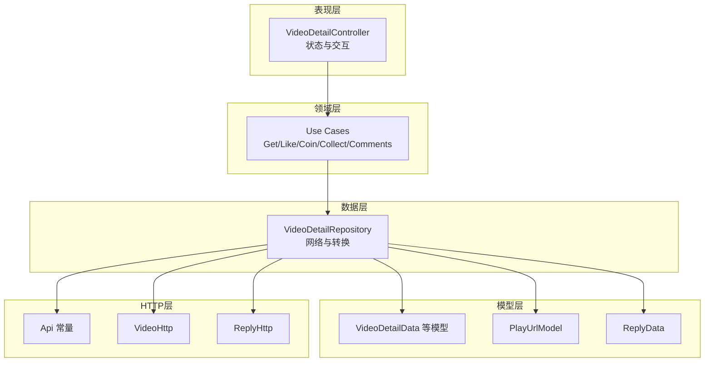
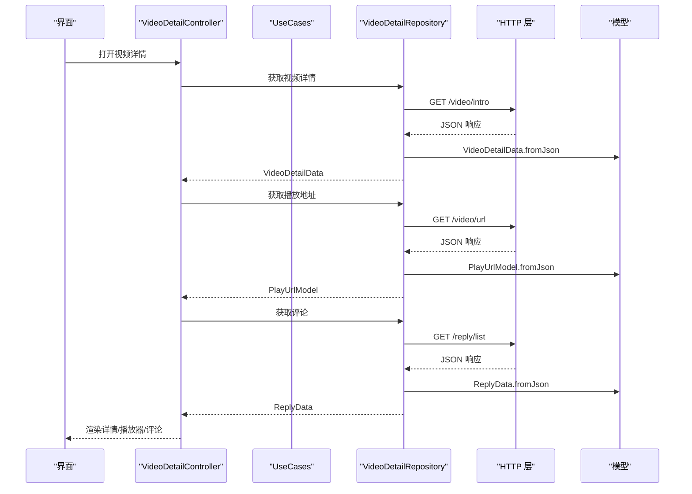
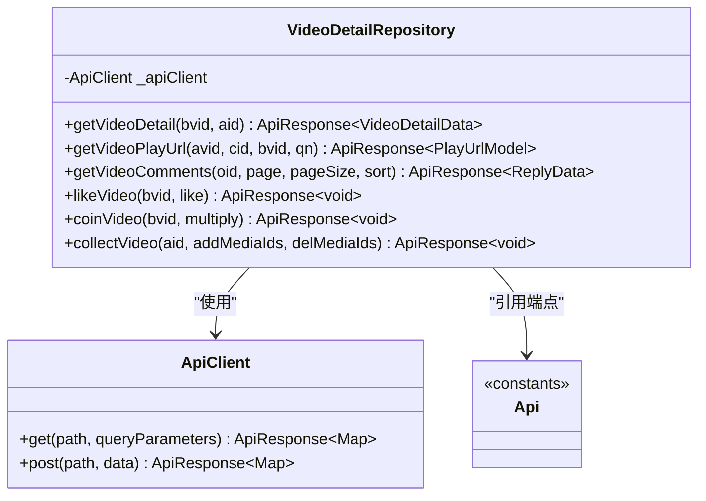
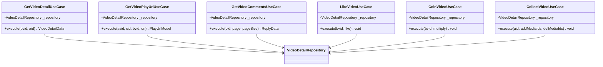
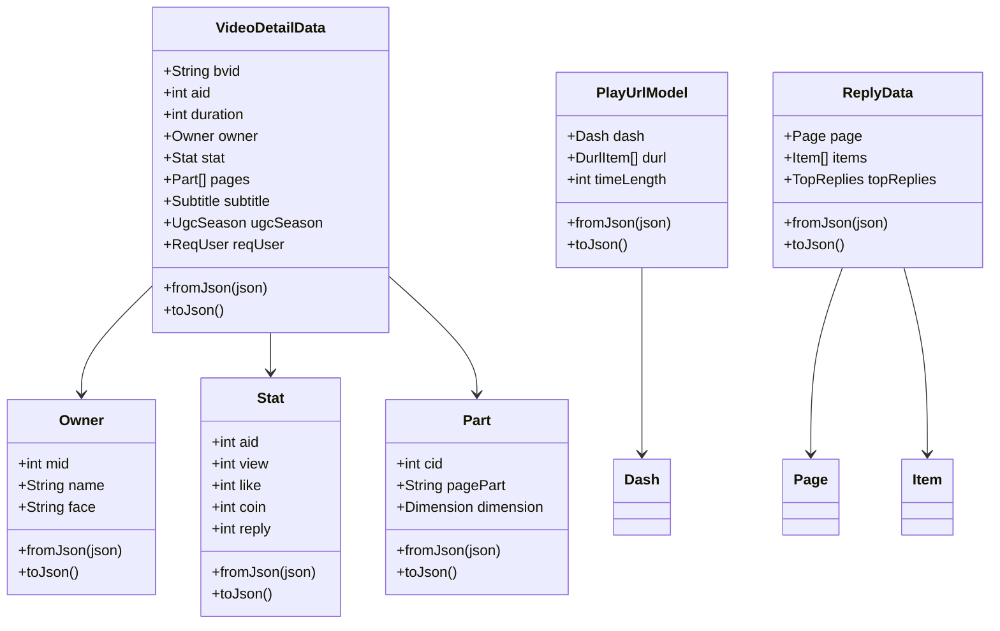
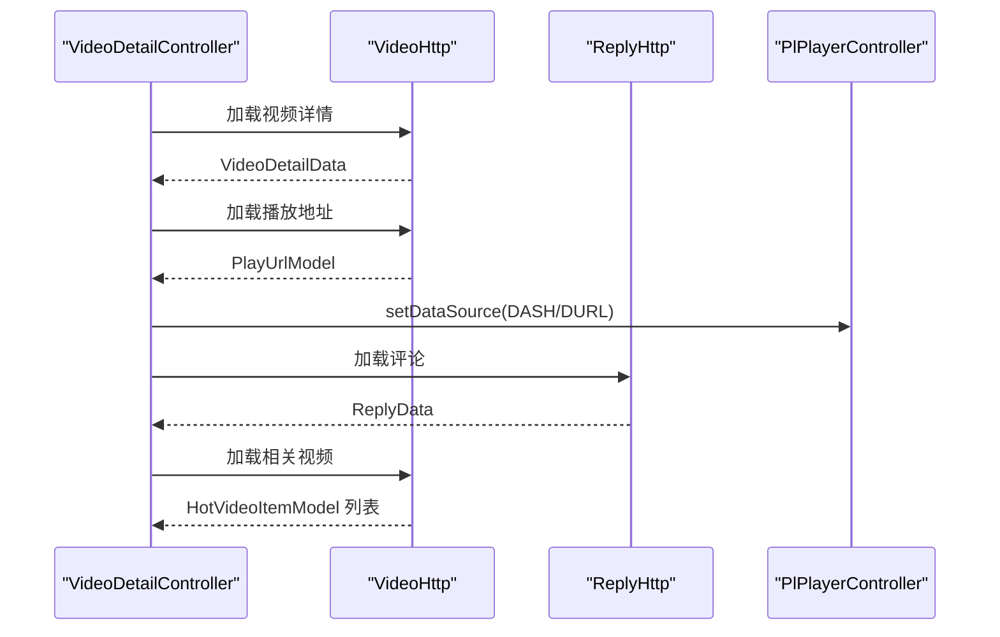
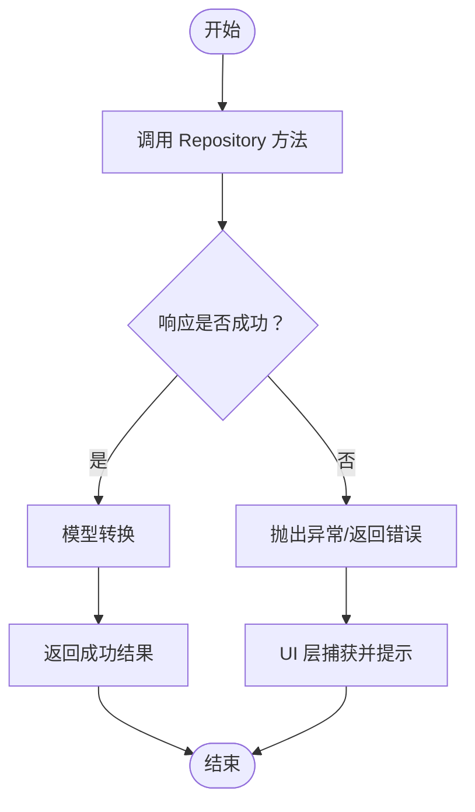
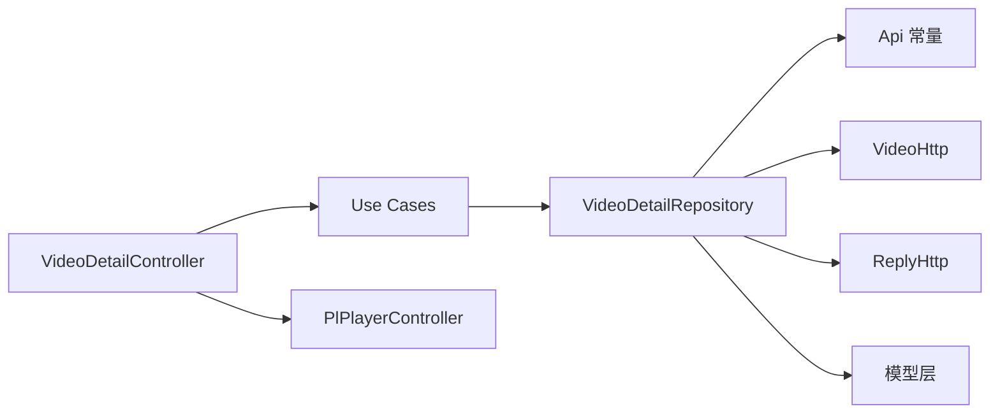

# 视频数据层

<cite>
**本文引用的文件**
- [video_detail_repository.dart](file://lib/features/video/data/video_detail_repository.dart)
- [video_detail_use_cases.dart](file://lib/features/video/domain/video_detail_use_cases.dart)
- [video_detail_res.dart](file://lib/models/video_detail_res.dart)
- [video_detail_controller.dart](file://lib/features/video/presentation/video_detail_controller.dart)
- [video.dart](file://lib/features/video/video.dart)
- [url.dart](file://lib/models/video/play/url.dart)
- [data.dart](file://lib/models/video/reply/data.dart)
- [api.dart](file://lib/http/api.dart)
- [init.dart](file://lib/http/init.dart)
- [index.dart](file://lib/http/index.dart)
- [video.dart](file://lib/http/video.dart)
- [reply.dart](file://lib/http/reply.dart)
- [model_hot_video_item.dart](file://lib/models/model_hot_video_item.dart)
</cite>

## 目录
1. [引言](#引言)
2. [项目结构](#项目结构)
3. [核心组件](#核心组件)
4. [架构总览](#架构总览)
5. [详细组件分析](#详细组件分析)
6. [依赖关系分析](#依赖关系分析)
7. [性能考虑](#性能考虑)
8. [故障排查指南](#故障排查指南)
9. [结论](#结论)
10. [附录](#附录)

## 引言
本文件系统性梳理视频数据层的设计与实现，聚焦于视频详情数据的获取、处理与存储机制，阐述Repository模式在数据源管理、缓存策略与网络请求中的应用；文档化Use Cases的业务封装与数据转换流程；明确数据模型定义、验证规则与错误处理策略；给出数据同步、离线支持与性能优化建议，并展示如何扩展数据层以集成新的数据源。

## 项目结构
视频数据层位于特性模块“video”下，采用分层设计：
- 数据层：负责网络请求与数据转换，典型实现为Repository类
- 领域层：封装业务用例，协调数据层与UI层交互
- 表现层：控制器负责状态管理、播放器初始化与用户交互
- 模型层：定义响应与实体模型，支持JSON序列化/反序列化
- HTTP层：统一API常量、拦截器与具体HTTP模块

**图表来源**
- [video_detail_controller.dart:1-498](file://lib/features/video/presentation/video_detail_controller.dart#L1-L498)
- [video_detail_use_cases.dart:1-155](file://lib/features/video/domain/video_detail_use_cases.dart#L1-L155)
- [video_detail_repository.dart:1-145](file://lib/features/video/data/video_detail_repository.dart#L1-L145)
- [video_detail_res.dart:1-732](file://lib/models/video_detail_res.dart#L1-L732)
- [url.dart](file://lib/models/video/play/url.dart)
- [data.dart](file://lib/models/video/reply/data.dart)
- [api.dart](file://lib/http/api.dart)
- [video.dart](file://lib/http/video.dart)
- [reply.dart](file://lib/http/reply.dart)

**章节来源**
- [video.dart:1-12](file://lib/features/video/video.dart#L1-L12)

## 核心组件
- Repository：集中管理视频详情、播放地址、评论、互动等数据源，封装网络请求与模型转换
- Use Cases：面向业务场景的用例封装，负责调用Repository并抛出语义化异常
- 控制器：负责页面生命周期、播放器初始化、状态更新与用户交互
- 模型：详尽的数据模型定义，支持复杂嵌套结构与JSON编解码
- HTTP模块：提供API常量与具体接口封装，统一请求参数与响应格式

**章节来源**
- [video_detail_repository.dart:10-145](file://lib/features/video/data/video_detail_repository.dart#L10-L145)
- [video_detail_use_cases.dart:7-155](file://lib/features/video/domain/video_detail_use_cases.dart#L7-L155)
- [video_detail_controller.dart:16-498](file://lib/features/video/presentation/video_detail_controller.dart#L16-L498)
- [video_detail_res.dart:34-732](file://lib/models/video_detail_res.dart#L34-L732)

## 架构总览
视频数据层遵循Clean Architecture分层思想：
- 表现层通过控制器触发业务流程，控制器持有Use Cases或直接调用Repository
- 领域层用例负责业务编排，避免UI细节侵入
- 数据层负责与HTTP层交互，完成数据获取与模型转换
- 模型层提供稳定的数据契约，便于测试与演进

**图表来源**
- [video_detail_controller.dart:161-225](file://lib/features/video/presentation/video_detail_controller.dart#L161-L225)
- [video_detail_repository.dart:17-89](file://lib/features/video/data/video_detail_repository.dart#L17-L89)
- [video_detail_use_cases.dart:14-82](file://lib/features/video/domain/video_detail_use_cases.dart#L14-L82)

## 详细组件分析

### Repository 模式与数据源管理
- 职责边界清晰：Repository仅负责数据获取、参数拼装、响应转换与错误包装
- 统一入口：通过ApiClient与HTTP模块对接，保证请求一致性
- 多数据源协同：视频详情、播放地址、评论分别对应不同端点，但共享统一的错误处理与转换流程

**图表来源**
- [video_detail_repository.dart:11-145](file://lib/features/video/data/video_detail_repository.dart#L11-L145)
- [api.dart](file://lib/http/api.dart)

**章节来源**
- [video_detail_repository.dart:17-143](file://lib/features/video/data/video_detail_repository.dart#L17-L143)

### Use Cases 设计与实现
- 单一职责：每个用例封装一个业务动作，如获取详情、播放地址、评论、点赞、投币、收藏
- 明确的输入输出：方法签名清晰表达参数与返回值类型
- 错误处理：当Repository返回失败时，用例抛出语义化异常，便于上层捕获与提示

**图表来源**
- [video_detail_use_cases.dart:8-155](file://lib/features/video/domain/video_detail_use_cases.dart#L8-L155)

**章节来源**
- [video_detail_use_cases.dart:14-154](file://lib/features/video/domain/video_detail_use_cases.dart#L14-L154)

### 数据模型定义与验证
- VideoDetailData：包含视频基础信息、统计、作者、分P、字幕、剧集等字段，支持复杂嵌套
- PlayUrlModel：播放地址模型，兼容DASH与DURL两种格式
- ReplyData：评论列表模型，包含分页、条目、成员等
- 模型均提供fromJson/toJson，确保与HTTP响应一致

**图表来源**
- [video_detail_res.dart:34-732](file://lib/models/video_detail_res.dart#L34-L732)
- [url.dart](file://lib/models/video/play/url.dart)
- [data.dart](file://lib/models/video/reply/data.dart)

**章节来源**
- [video_detail_res.dart:112-218](file://lib/models/video_detail_res.dart#L112-L218)
- [url.dart](file://lib/models/video/play/url.dart)
- [data.dart](file://lib/models/video/reply/data.dart)

### 表现层控制器与播放器集成
- 生命周期管理：onInit解析路由参数、初始化Tab与播放器；onClose释放资源
- 多阶段加载：先加载详情，再按需加载播放地址、评论、相关视频与关注状态
- 播放器初始化：优先DASH，回退DURL；设置HTTP头与自动播放
- 用户交互：点赞、投币、收藏、关注等操作通过HTTP模块直接调用（与遗留实现保持一致）

**图表来源**
- [video_detail_controller.dart:161-225](file://lib/features/video/presentation/video_detail_controller.dart#L161-L225)
- [video_detail_controller.dart:321-367](file://lib/features/video/presentation/video_detail_controller.dart#L321-L367)
- [video_detail_controller.dart:391-408](file://lib/features/video/presentation/video_detail_controller.dart#L391-L408)
- [video_detail_controller.dart:303-319](file://lib/features/video/presentation/video_detail_controller.dart#L303-L319)

**章节来源**
- [video_detail_controller.dart:92-114](file://lib/features/video/presentation/video_detail_controller.dart#L92-L114)
- [video_detail_controller.dart:161-225](file://lib/features/video/presentation/video_detail_controller.dart#L161-L225)
- [video_detail_controller.dart:321-367](file://lib/features/video/presentation/video_detail_controller.dart#L321-L367)

### 错误处理与健壮性
- Repository层：统一将HTTP响应包装为ApiResponse，区分成功/失败与消息码
- Use Cases层：当响应失败时抛出语义化异常，便于UI层统一提示
- 控制器层：对非关键流程（如评论）采用静默失败，避免阻塞主流程

**图表来源**
- [video_detail_repository.dart:30-36](file://lib/features/video/data/video_detail_repository.dart#L30-L36)
- [video_detail_use_cases.dart:21-26](file://lib/features/video/domain/video_detail_use_cases.dart#L21-L26)
- [video_detail_controller.dart:405-408](file://lib/features/video/presentation/video_detail_controller.dart#L405-L408)

**章节来源**
- [video_detail_repository.dart:30-36](file://lib/features/video/data/video_detail_repository.dart#L30-L36)
- [video_detail_use_cases.dart:21-26](file://lib/features/video/domain/video_detail_use_cases.dart#L21-L26)
- [video_detail_controller.dart:405-408](file://lib/features/video/presentation/video_detail_controller.dart#L405-L408)

## 依赖关系分析
- 分层耦合：表现层依赖领域层（或直接依赖Repository），领域层依赖数据层，数据层依赖HTTP与模型层
- 组件内聚：Repository聚合了所有视频详情相关的网络请求与转换逻辑
- 外部依赖：HTTP层提供API常量与具体接口；模型层提供稳定契约；播放器插件负责媒体播放

**图表来源**
- [video_detail_controller.dart:16-498](file://lib/features/video/presentation/video_detail_controller.dart#L16-L498)
- [video_detail_use_cases.dart:1-155](file://lib/features/video/domain/video_detail_use_cases.dart#L1-L155)
- [video_detail_repository.dart:1-145](file://lib/features/video/data/video_detail_repository.dart#L1-L145)

**章节来源**
- [video_detail_controller.dart:16-498](file://lib/features/video/presentation/video_detail_controller.dart#L16-L498)
- [video_detail_use_cases.dart:1-155](file://lib/features/video/domain/video_detail_use_cases.dart#L1-L155)
- [video_detail_repository.dart:1-145](file://lib/features/video/data/video_detail_repository.dart#L1-L145)

## 性能考虑
- 请求合并与串行控制：当前控制器按步骤顺序加载详情、播放地址、评论与相关视频，建议在UI层进行必要的并发优化与节流
- 播放器初始化：优先DASH可提升质量与稳定性，回退DURL保障兼容性
- 缓存策略：当前未见本地持久化缓存实现，建议针对详情与播放地址增加短期缓存，结合网络状态与过期策略
- 网络拦截：统一使用HTTP层拦截器，建议在拦截器中加入重试、超时与日志记录
- UI渲染：评论列表与相关视频列表建议采用懒加载与分页，减少首屏压力

[本节为通用性能建议，不直接分析具体文件]

## 故障排查指南
- 无播放地址：检查播放地址加载分支与HTTP返回；确认DASH与DURL回退路径
- 评论加载失败：评论为非关键流程，控制器采用静默失败，可在UI层补充重试按钮
- 互动操作失败：点赞/投币/收藏等操作依赖登录态，需检查登录状态与CSRF参数
- 相关视频为空：相关视频接口可能受内容策略影响，建议降级显示或提示

**章节来源**
- [video_detail_controller.dart:344-347](file://lib/features/video/presentation/video_detail_controller.dart#L344-L347)
- [video_detail_controller.dart:405-408](file://lib/features/video/presentation/video_detail_controller.dart#L405-L408)
- [video_detail_controller.dart:416-444](file://lib/features/video/presentation/video_detail_controller.dart#L416-L444)

## 结论
视频数据层通过清晰的分层与职责划分，实现了从网络请求到UI渲染的完整闭环。Repository与Use Cases分别承担数据与业务编排职责，模型层提供稳定的契约，HTTP层统一接入。当前实现具备良好的可维护性与扩展性，后续可在缓存、离线与性能方面进一步增强。

## 附录

### 数据同步策略与离线支持
- 同步策略：以Repository为中心，统一拉取与转换，UI层只消费稳定数据
- 离线支持：建议引入短期缓存（内存/磁盘）与失效策略；播放地址可缓存至过期时间；详情与评论按需刷新

[本节为通用建议，不直接分析具体文件]

### 扩展数据层与集成新数据源
- 新增端点：在HTTP层新增模块与API常量，Repository中新增对应方法
- 新增模型：在模型层定义新模型并提供fromJson/toJson
- 用例扩展：新增Use Case封装业务动作，或复用现有模式
- UI集成：控制器中新增加载流程与状态管理

**章节来源**
- [api.dart](file://lib/http/api.dart)
- [video.dart](file://lib/http/video.dart)
- [reply.dart](file://lib/http/reply.dart)
- [video_detail_res.dart:1-732](file://lib/models/video_detail_res.dart#L1-L732)