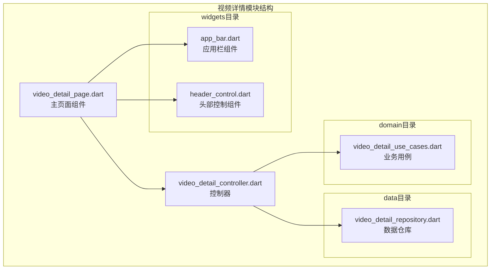
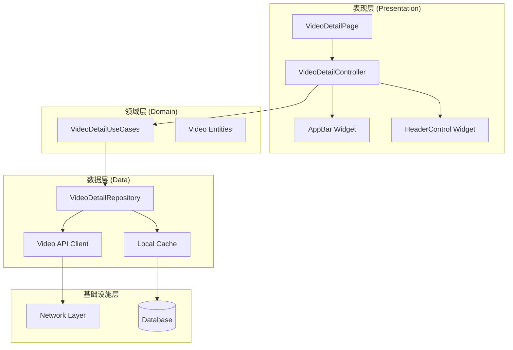
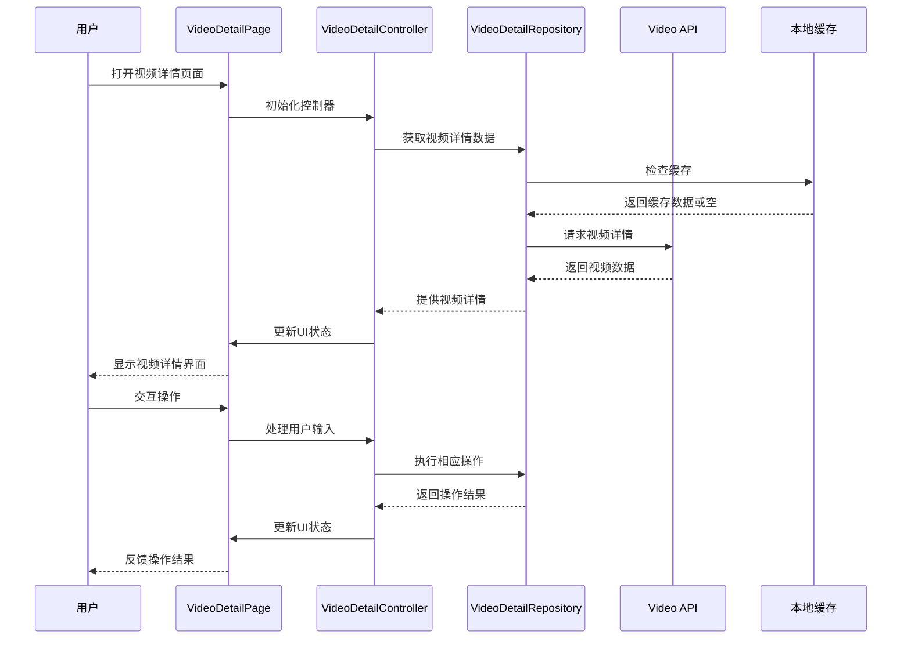
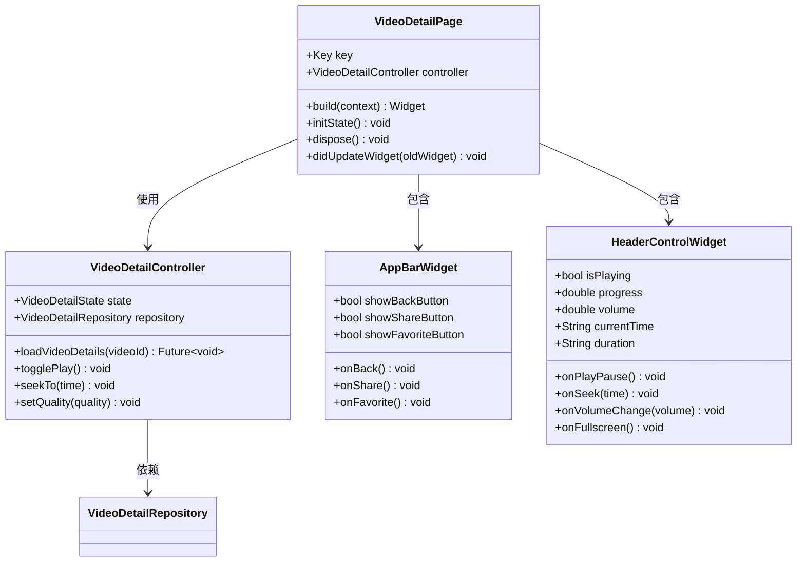
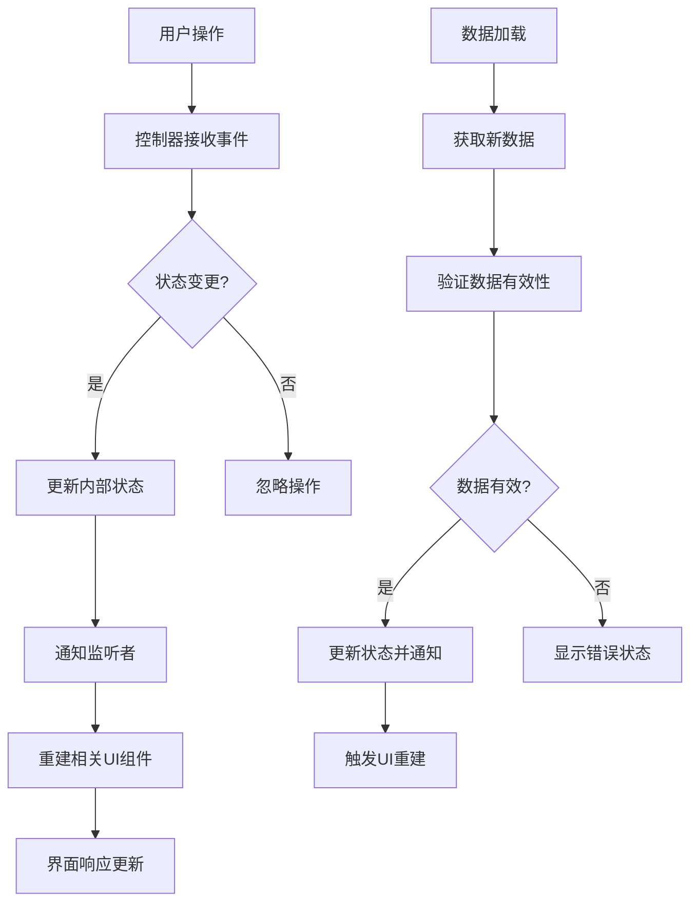
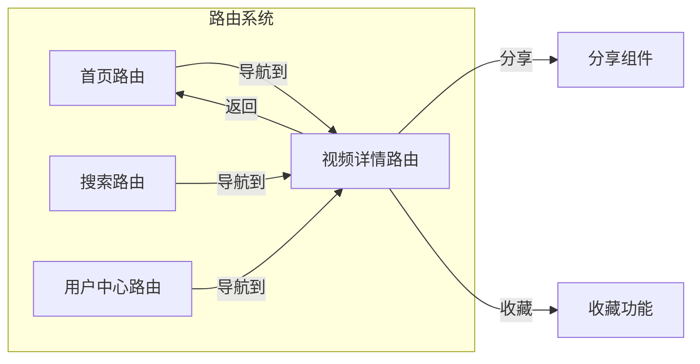
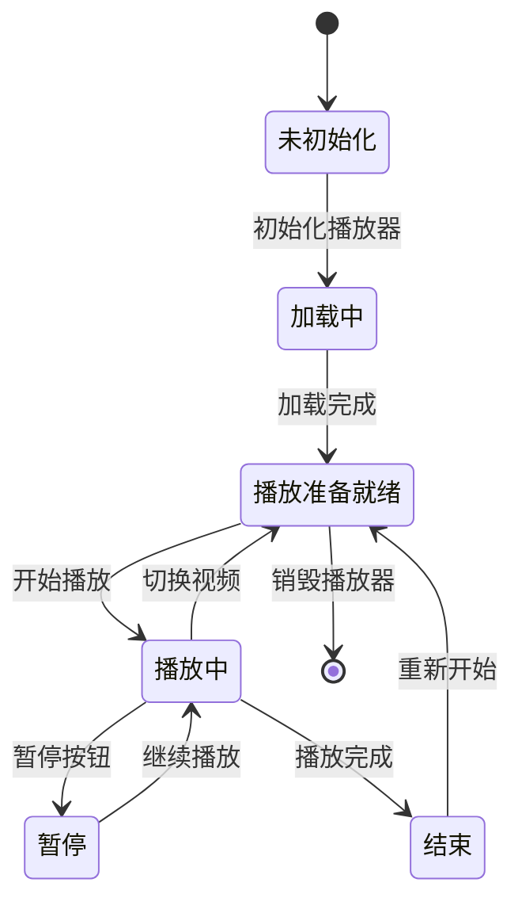
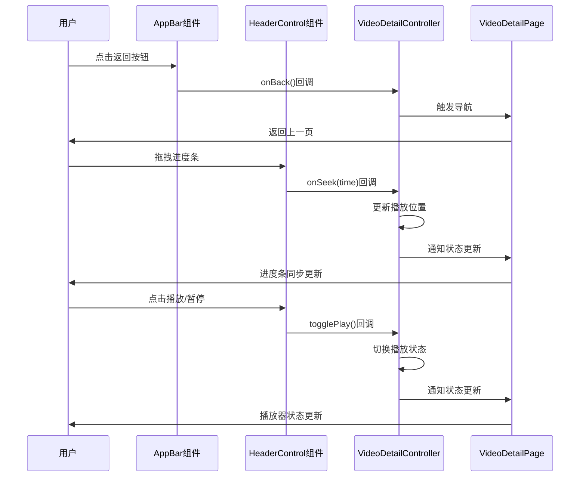
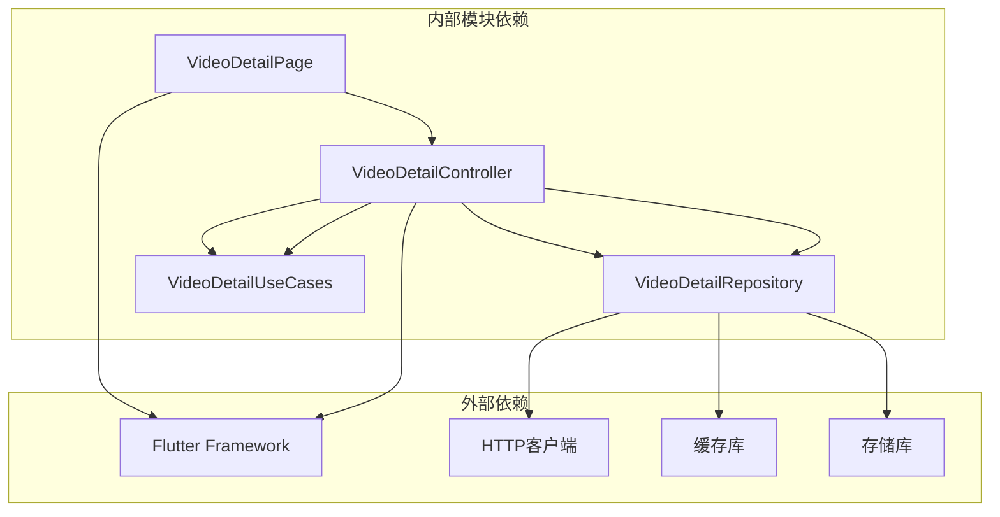
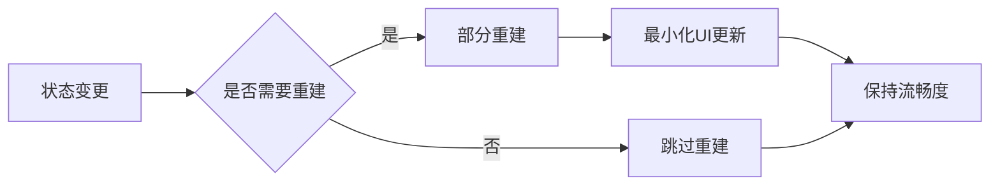

# 视频详情页面

<cite>
**本文档引用的文件**
- [video_detail_page.dart](file://lib/features/video/presentation/video_detail_page.dart)
- [video_detail_controller.dart](file://lib/features/video/presentation/video_detail_controller.dart)
- [video_detail_repository.dart](file://lib/features/video/data/video_detail_repository.dart)
- [video_detail_use_cases.dart](file://lib/features/video/domain/video_detail_use_cases.dart)
- [app_bar.dart](file://lib/features/video/presentation/widgets/app_bar.dart)
- [header_control.dart](file://lib/features/video/presentation/widgets/header_control.dart)
- [video.dart](file://lib/features/video/video.dart)
- [main.dart](file://lib/main.dart)
</cite>

## 目录
1. [简介](#简介)
2. [项目结构](#项目结构)
3. [核心组件](#核心组件)
4. [架构概览](#架构概览)
5. [详细组件分析](#详细组件分析)
6. [依赖关系分析](#依赖关系分析)
7. [性能考虑](#性能考虑)
8. [故障排除指南](#故障排除指南)
9. [结论](#结论)

## 简介

视频详情页面是Pilipala应用中的核心功能模块，为用户提供完整的视频播放体验。该页面实现了现代化的视频播放器界面，集成了用户交互控件、视频信息展示和响应式布局设计。

本页面采用MVVM架构模式，通过状态管理机制实现数据绑定和响应式更新。页面支持多种视频质量选择、弹幕显示、用户评论等功能，并提供了完整的生命周期管理。

## 项目结构

视频详情页面位于`lib/features/video/presentation/`目录下，采用模块化的文件组织方式：

**图表来源**
- [video_detail_page.dart:1-50](file://lib/features/video/presentation/video_detail_page.dart#L1-L50)
- [video_detail_controller.dart:1-50](file://lib/features/video/presentation/video_detail_controller.dart#L1-L50)

**章节来源**
- [video_detail_page.dart:1-100](file://lib/features/video/presentation/video_detail_page.dart#L1-L100)
- [video_detail_controller.dart:1-100](file://lib/features/video/presentation/video_detail_controller.dart#L1-L100)

## 核心组件

### 主页面组件 (VideoDetailPage)

主页面组件负责整个视频详情页面的布局和渲染。该组件实现了以下关键功能：

- **响应式布局设计**：根据屏幕尺寸自动调整组件布局
- **状态管理集成**：与控制器建立双向数据绑定
- **生命周期管理**：正确处理页面的创建、更新和销毁
- **事件处理**：响应用户交互和系统事件

### 控制器组件 (VideoDetailController)

控制器作为MVVM架构中的核心协调者，负责：

- **数据获取**：从仓库层获取视频详情数据
- **状态维护**：管理页面的当前状态和用户偏好
- **业务逻辑**：处理视频播放相关的业务规则
- **UI更新**：触发视图的重新渲染

### 应用栏组件 (AppBar)

应用栏组件提供页面导航和操作功能：

- **返回导航**：支持用户返回上一级页面
- **分享功能**：允许用户分享视频内容
- **收藏管理**：提供视频收藏和取消收藏功能
- **设置选项**：访问视频播放设置

### 头部控制组件 (HeaderControl)

头部控制组件实现视频播放器的控制功能：

- **播放/暂停**：控制视频播放状态
- **进度调节**：支持视频进度跳转
- **音量控制**：调节播放音量
- **全屏切换**：切换全屏播放模式

**章节来源**
- [video_detail_page.dart:50-200](file://lib/features/video/presentation/video_detail_page.dart#L50-L200)
- [video_detail_controller.dart:50-150](file://lib/features/video/presentation/video_detail_controller.dart#L50-L150)
- [app_bar.dart:1-80](file://lib/features/video/presentation/widgets/app_bar.dart#L1-L80)
- [header_control.dart:1-80](file://lib/features/video/presentation/widgets/header_control.dart#L1-L80)

## 架构概览

视频详情页面采用分层架构设计，确保代码的可维护性和可扩展性：

**图表来源**
- [video_detail_controller.dart:1-100](file://lib/features/video/presentation/video_detail_controller.dart#L1-L100)
- [video_detail_use_cases.dart:1-80](file://lib/features/video/domain/video_detail_use_cases.dart#L1-L80)
- [video_detail_repository.dart:1-80](file://lib/features/video/data/video_detail_repository.dart#L1-L80)

### 数据流架构

**图表来源**
- [video_detail_page.dart:100-250](file://lib/features/video/presentation/video_detail_page.dart#L100-L250)
- [video_detail_controller.dart:100-200](file://lib/features/video/presentation/video_detail_controller.dart#L100-L200)

## 详细组件分析

### 视频详情页面组件

#### 页面结构设计

页面采用基于`Scaffold`的布局结构，实现了以下层次：

**图表来源**
- [video_detail_page.dart:1-150](file://lib/features/video/presentation/video_detail_page.dart#L1-L150)
- [video_detail_controller.dart:1-120](file://lib/features/video/presentation/video_detail_controller.dart#L1-L120)

#### 响应式更新机制

页面实现了基于`ChangeNotifier`的状态管理：

**图表来源**
- [video_detail_controller.dart:80-150](file://lib/features/video/presentation/video_detail_controller.dart#L80-L150)

**章节来源**
- [video_detail_page.dart:150-350](file://lib/features/video/presentation/video_detail_page.dart#L150-L350)
- [video_detail_controller.dart:120-250](file://lib/features/video/presentation/video_detail_controller.dart#L120-L250)

### 导航和路由处理

#### 路由配置

页面通过全局路由系统进行导航管理：

**图表来源**
- [main.dart:1-100](file://lib/main.dart#L1-L100)

#### 参数传递机制

视频详情页面支持多种参数传递方式：

- **路由参数**：通过URL参数传递视频ID
- **页面状态**：使用`ModalRoute.of(context)?.settings.arguments`
- **全局状态**：通过共享服务传递复杂对象

**章节来源**
- [video_detail_page.dart:250-450](file://lib/features/video/presentation/video_detail_page.dart#L250-L450)

### 用户交互控件

#### 播放器控件系统

播放器控件实现了完整的视频播放控制功能：

**图表来源**
- [header_control.dart:1-100](file://lib/features/video/presentation/widgets/header_control.dart#L1-L100)

#### 交互响应流程

**图表来源**
- [app_bar.dart:1-120](file://lib/features/video/presentation/widgets/app_bar.dart#L1-L120)
- [header_control.dart:1-120](file://lib/features/video/presentation/widgets/header_control.dart#L1-L120)

**章节来源**
- [app_bar.dart:80-200](file://lib/features/video/presentation/widgets/app_bar.dart#L80-L200)
- [header_control.dart:80-200](file://lib/features/video/presentation/widgets/header_control.dart#L80-L200)

## 依赖关系分析

### 组件依赖图

**图表来源**
- [video_detail_controller.dart:1-80](file://lib/features/video/presentation/video_detail_controller.dart#L1-L80)
- [video_detail_repository.dart:1-80](file://lib/features/video/data/video_detail_repository.dart#L1-L80)

### 数据依赖链

页面的数据流遵循清晰的依赖关系：

1. **控制器依赖于仓库层**：控制器不直接访问网络，而是通过仓库层进行数据访问
2. **仓库层依赖于API客户端**：仓库层封装网络请求和数据转换
3. **业务用例提供领域逻辑**：业务用例定义视频详情的业务规则
4. **视图层只负责展示**：页面组件专注于UI渲染和用户交互

**章节来源**
- [video_detail_use_cases.dart:1-100](file://lib/features/video/domain/video_detail_use_cases.dart#L1-L100)
- [video_detail_repository.dart:1-100](file://lib/features/video/data/video_detail_repository.dart#L1-L100)

## 性能考虑

### 内存管理策略

#### 对象生命周期管理

页面实现了完善的对象生命周期管理：

- **及时释放资源**：在页面销毁时释放播放器资源和网络连接
- **避免内存泄漏**：正确清理事件监听器和定时器
- **懒加载机制**：延迟加载非关键资源，减少初始内存占用

#### 状态优化

### 渲染性能优化

#### 组件重用策略

- **Widget复用**：合理使用`const`构造函数和`const` widgets
- **状态提升**：将频繁变化的状态提升到合适的层级
- **Key优化**：为动态列表提供稳定的Key值

#### 异步操作优化

- **并发处理**：合理安排异步任务的执行顺序
- **缓存策略**：实现多级缓存以减少重复加载
- **错误恢复**：提供优雅的错误处理和重试机制

## 故障排除指南

### 常见问题诊断

#### 播放器相关问题

**问题症状**：视频无法播放或播放异常

**可能原因**：
- 网络连接不稳定
- 视频格式不受支持
- 播放器初始化失败
- 权限不足

**解决方案**：
- 检查网络连接状态
- 验证视频格式兼容性
- 重新初始化播放器实例
- 确认必要的系统权限

#### 状态同步问题

**问题症状**：UI状态与实际状态不一致

**可能原因**：
- 状态更新时机不当
- 事件回调未正确处理
- 异步操作竞态条件

**解决方案**：
- 确保在主线程更新UI
- 实现适当的防抖机制
- 使用Future或Stream正确处理异步操作

**章节来源**
- [video_detail_controller.dart:200-350](file://lib/features/video/presentation/video_detail_controller.dart#L200-L350)

### 调试技巧

#### 日志记录策略

建议在关键节点添加日志记录：

- **状态变更日志**：记录重要的状态转换
- **错误日志**：捕获和记录异常情况
- **性能日志**：监控关键操作的执行时间

#### 性能监控

- **内存使用监控**：定期检查内存占用情况
- **帧率监控**：确保UI渲染的流畅性
- **网络请求监控**：跟踪API调用的响应时间

## 结论

视频详情页面作为Pilipala应用的核心功能模块，展现了现代Flutter应用的最佳实践。通过采用MVVM架构、分层设计和响应式编程模式，该页面实现了良好的可维护性和可扩展性。

### 主要优势

1. **架构清晰**：分层设计确保了代码的职责分离
2. **性能优秀**：合理的状态管理和资源优化策略
3. **用户体验良好**：流畅的交互和响应式的设计
4. **易于维护**：模块化的组件结构便于后续开发

### 改进建议

1. **测试覆盖**：增加单元测试和集成测试的覆盖率
2. **文档完善**：补充更详细的API文档和使用说明
3. **性能监控**：集成更全面的性能监控工具
4. **国际化支持**：扩展多语言支持功能

该视频详情页面为Flutter应用开发提供了优秀的参考案例，展示了如何构建高质量的多媒体应用界面。