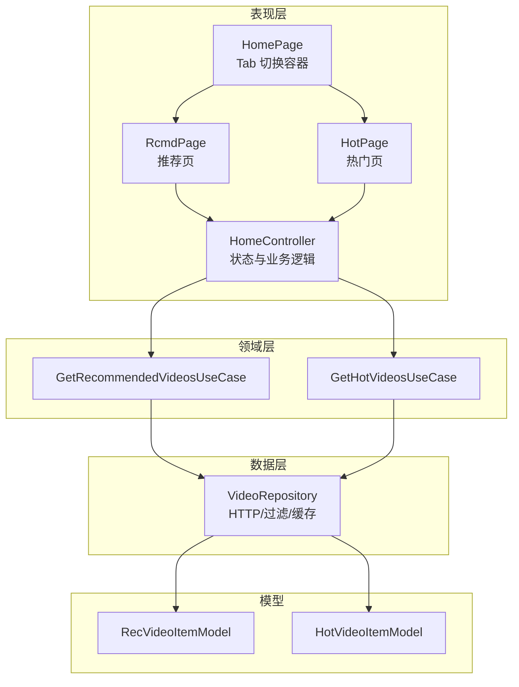
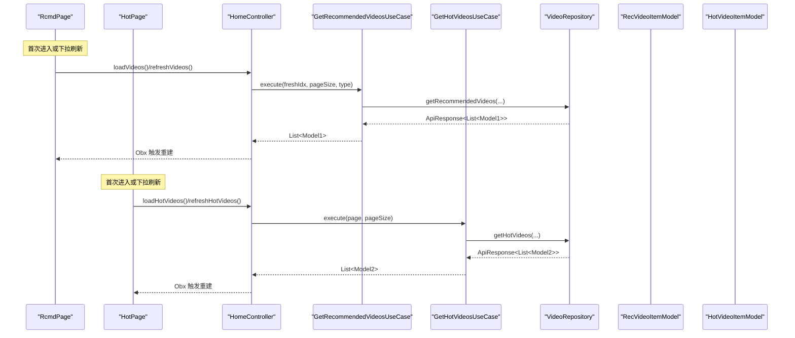
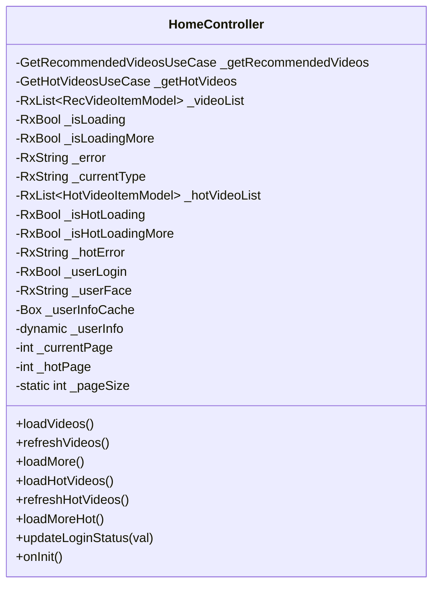
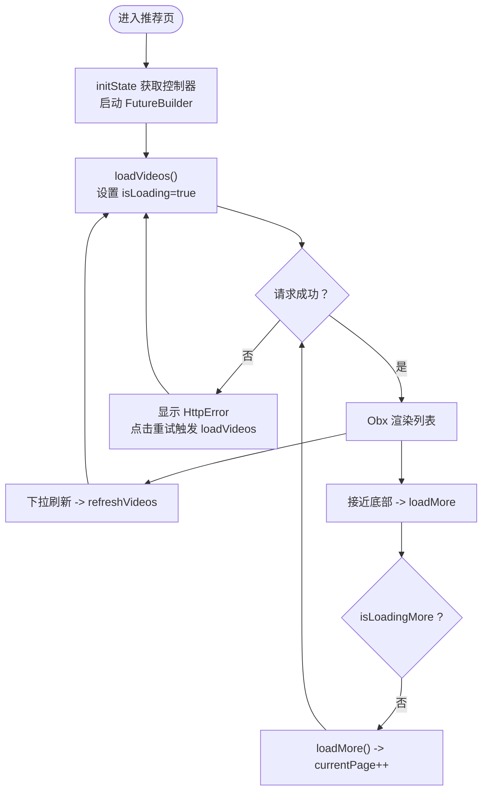
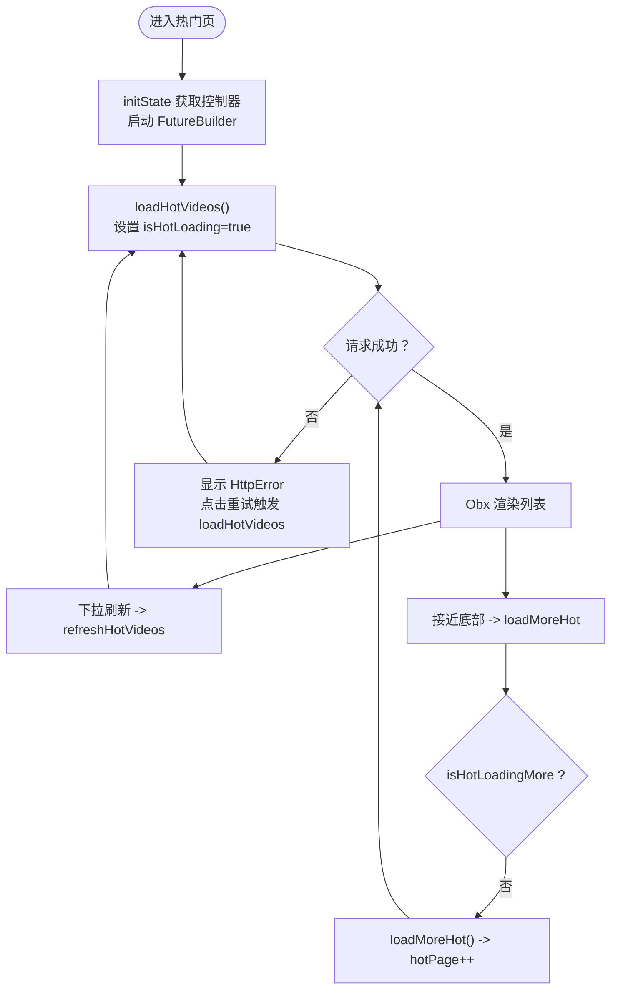
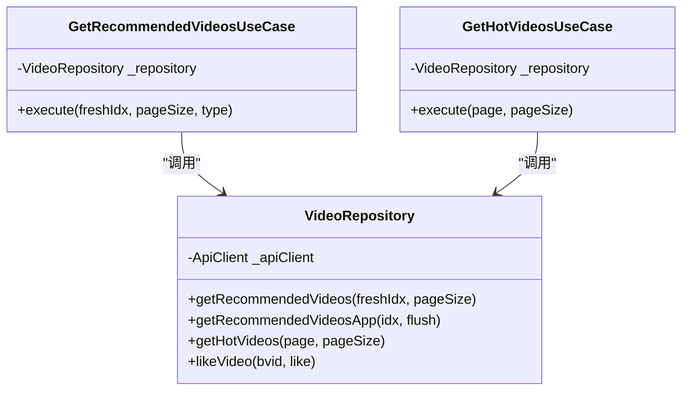
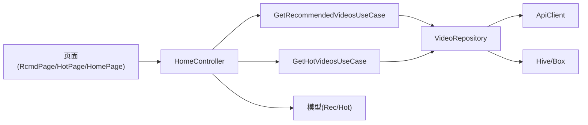

# 控制器与状态管理

<cite>
**本文引用的文件**
- [lib/features/home/presentation/home_controller.dart](file://lib/features/home/presentation/home_controller.dart)
- [lib/features/home/presentation/home_page.dart](file://lib/features/home/presentation/home_page.dart)
- [lib/features/home/presentation/hot_page.dart](file://lib/features/home/presentation/hot_page.dart)
- [lib/features/home/presentation/rcmd_page.dart](file://lib/features/home/presentation/rcmd_page.dart)
- [lib/features/home/domain/video_use_cases.dart](file://lib/features/home/domain/video_use_cases.dart)
- [lib/features/home/data/video_repository.dart](file://lib/features/home/data/video_repository.dart)
- [lib/models/model_rec_video_item.dart](file://lib/models/model_rec_video_item.dart)
- [lib/models/model_hot_video_item.dart](file://lib/models/model_hot_video_item.dart)
</cite>

## 目录
1. [简介](#简介)
2. [项目结构](#项目结构)
3. [核心组件](#核心组件)
4. [架构总览](#架构总览)
5. [详细组件分析](#详细组件分析)
6. [依赖关系分析](#依赖关系分析)
7. [性能考量](#性能考量)
8. [故障排查指南](#故障排查指南)
9. [结论](#结论)
10. [附录：扩展与测试策略](#附录扩展与测试策略)

## 简介
本文件系统性梳理首页模块的控制器与状态管理设计，重点覆盖以下方面：
- GetX 状态管理与响应式绑定机制
- 推荐页与热门页的状态分离与切换时的状态保存/恢复
- 数据获取流程、错误处理与加载状态管理
- 控制器与视图之间的通信（事件传递、回调、状态更新）
- 单元测试策略与调试技巧
- 扩展控制器功能与新增状态管理逻辑的方法

## 项目结构
首页模块采用“表现层-领域层-数据层”的分层架构，配合 GetX 实现响应式状态管理与依赖注入。

图表来源
- [lib/features/home/presentation/home_page.dart:10-62](file://lib/features/home/presentation/home_page.dart#L10-L62)
- [lib/features/home/presentation/rcmd_page.dart:13-123](file://lib/features/home/presentation/rcmd_page.dart#L13-L123)
- [lib/features/home/presentation/hot_page.dart:13-122](file://lib/features/home/presentation/hot_page.dart#L13-L122)
- [lib/features/home/presentation/home_controller.dart:9-190](file://lib/features/home/presentation/home_controller.dart#L9-L190)
- [lib/features/home/domain/video_use_cases.dart:10-87](file://lib/features/home/domain/video_use_cases.dart#L10-L87)
- [lib/features/home/data/video_repository.dart:17-181](file://lib/features/home/data/video_repository.dart#L17-L181)
- [lib/models/model_rec_video_item.dart:3-74](file://lib/models/model_rec_video_item.dart#L3-L74)
- [lib/models/model_hot_video_item.dart:3-167](file://lib/models/model_hot_video_item.dart#L3-L167)

章节来源
- [lib/features/home/presentation/home_page.dart:10-62](file://lib/features/home/presentation/home_page.dart#L10-L62)
- [lib/features/home/presentation/rcmd_page.dart:13-123](file://lib/features/home/presentation/rcmd_page.dart#L13-L123)
- [lib/features/home/presentation/hot_page.dart:13-122](file://lib/features/home/presentation/hot_page.dart#L13-L122)
- [lib/features/home/presentation/home_controller.dart:9-190](file://lib/features/home/presentation/home_controller.dart#L9-L190)
- [lib/features/home/domain/video_use_cases.dart:10-87](file://lib/features/home/domain/video_use_cases.dart#L10-L87)
- [lib/features/home/data/video_repository.dart:17-181](file://lib/features/home/data/video_repository.dart#L17-L181)
- [lib/models/model_rec_video_item.dart:3-74](file://lib/models/model_rec_video_item.dart#L3-L74)
- [lib/models/model_hot_video_item.dart:3-167](file://lib/models/model_hot_video_item.dart#L3-L167)

## 核心组件
- HomeController：首页状态中心，封装推荐与热门视频列表、加载/刷新/加载更多、错误信息、登录态等状态，并通过 GetX 的 Rx 响应式类型驱动 UI 更新。
- RcmdPage/HoPage：两个子页面分别消费 HomeController 中的推荐/热门状态，使用 Obx/响应式 getter 触发局部重建。
- UseCases：封装业务逻辑，屏蔽数据源细节，统一返回类型。
- VideoRepository：HTTP 访问与数据清洗（过滤直播/广告、黑名单用户、推荐过滤器），并返回类型安全的数据。
- 模型：RecVideoItemModel/HotVideoItemModel 定义推荐/热门视频的数据结构。

章节来源
- [lib/features/home/presentation/home_controller.dart:9-190](file://lib/features/home/presentation/home_controller.dart#L9-L190)
- [lib/features/home/presentation/rcmd_page.dart:13-123](file://lib/features/home/presentation/rcmd_page.dart#L13-L123)
- [lib/features/home/presentation/hot_page.dart:13-122](file://lib/features/home/presentation/hot_page.dart#L13-L122)
- [lib/features/home/domain/video_use_cases.dart:10-87](file://lib/features/home/domain/video_use_cases.dart#L10-L87)
- [lib/features/home/data/video_repository.dart:17-181](file://lib/features/home/data/video_repository.dart#L17-L181)
- [lib/models/model_rec_video_item.dart:3-74](file://lib/models/model_rec_video_item.dart#L3-L74)
- [lib/models/model_hot_video_item.dart:3-167](file://lib/models/model_hot_video_item.dart#L3-L167)

## 架构总览
下图展示从页面到控制器、UseCase、Repository 的调用链路及状态流：

图表来源
- [lib/features/home/presentation/rcmd_page.dart:57-60](file://lib/features/home/presentation/rcmd_page.dart#L57-L60)
- [lib/features/home/presentation/hot_page.dart:57-59](file://lib/features/home/presentation/hot_page.dart#L57-L59)
- [lib/features/home/presentation/home_controller.dart:98-116](file://lib/features/home/presentation/home_controller.dart#L98-L116)
- [lib/features/home/presentation/home_controller.dart:146-163](file://lib/features/home/presentation/home_controller.dart#L146-L163)
- [lib/features/home/domain/video_use_cases.dart:21-38](file://lib/features/home/domain/video_use_cases.dart#L21-L38)
- [lib/features/home/domain/video_use_cases.dart:52-63](file://lib/features/home/domain/video_use_cases.dart#L52-L63)
- [lib/features/home/data/video_repository.dart:24-67](file://lib/features/home/data/video_repository.dart#L24-L67)
- [lib/features/home/data/video_repository.dart:94-127](file://lib/features/home/data/video_repository.dart#L94-L127)
- [lib/models/model_rec_video_item.dart:3-52](file://lib/models/model_rec_video_item.dart#L3-L52)
- [lib/models/model_hot_video_item.dart:3-89](file://lib/models/model_hot_video_item.dart#L3-L89)

## 详细组件分析

### HomeController 设计与状态管理
- 状态字段
  - 推荐页：视频列表、是否加载中、是否加载更多、错误信息、当前推荐类型
  - 热门页：视频列表、是否加载中、是否加载更多、错误信息
  - 登录态兼容：用户是否已登录、头像、本地缓存箱
  - 分页参数：当前页码、热门页码、每页大小
- 关键方法
  - 初始化：onInit 中确保用户信息缓存箱可用，避免异常
  - 加载/刷新/加载更多：loadVideos/refreshVideos/loadMore；loadHotVideos/refreshHotVideos/loadMoreHot
  - 登录态更新：updateLoginStatus 兼容旧逻辑
- 响应式绑定
  - 使用 RxList/RxBool/RxString 包装状态，配合 Obx 在视图层自动重建
- 生命周期
  - onInit：初始化登录态
  - 页面 dispose：由各子页面负责释放滚动监听与控制器

图表来源
- [lib/features/home/presentation/home_controller.dart:9-190](file://lib/features/home/presentation/home_controller.dart#L9-L190)

章节来源
- [lib/features/home/presentation/home_controller.dart:9-190](file://lib/features/home/presentation/home_controller.dart#L9-L190)

### 推荐页（RcmdPage）状态分离与交互
- 状态分离
  - 使用 AutomaticKeepAliveClientMixin 保持页面重建时状态不丢失
  - 通过 FutureBuilder 首次加载，Obx 响应式渲染列表
- 交互机制
  - 下拉刷新：RefreshIndicator 调用 refreshVideos
  - 上滑加载更多：滚动监听触发 loadMore
  - 错误重试：HttpError 回调重新发起 loadVideos
- 生命周期
  - initState 注册/获取 HomeController，初始化滚动控制器
  - dispose 移除监听

图表来源
- [lib/features/home/presentation/rcmd_page.dart:20-123](file://lib/features/home/presentation/rcmd_page.dart#L20-L123)
- [lib/features/home/presentation/home_controller.dart:98-143](file://lib/features/home/presentation/home_controller.dart#L98-L143)

章节来源
- [lib/features/home/presentation/rcmd_page.dart:13-123](file://lib/features/home/presentation/rcmd_page.dart#L13-L123)
- [lib/features/home/presentation/home_controller.dart:98-143](file://lib/features/home/presentation/home_controller.dart#L98-L143)

### 热门页（HotPage）状态分离与交互
- 状态分离
  - 同样使用 AutomaticKeepAliveClientMixin 保持状态
  - 使用独立的热门列表与分页变量，避免与推荐页互相干扰
- 交互机制
  - 下拉刷新：refreshHotVideos
  - 上滑加载更多：loadMoreHot
  - 错误重试：HttpError 回调重新发起 loadHotVideos
- 生命周期
  - initState 注册/获取 HomeController，初始化滚动控制器
  - dispose 移除监听

图表来源
- [lib/features/home/presentation/hot_page.dart:20-122](file://lib/features/home/presentation/hot_page.dart#L20-L122)
- [lib/features/home/presentation/home_controller.dart:146-189](file://lib/features/home/presentation/home_controller.dart#L146-L189)

章节来源
- [lib/features/home/presentation/hot_page.dart:13-122](file://lib/features/home/presentation/hot_page.dart#L13-L122)
- [lib/features/home/presentation/home_controller.dart:146-189](file://lib/features/home/presentation/home_controller.dart#L146-L189)

### UseCases 与 Repository 的职责边界
- UseCases
  - 封装业务规则：根据类型选择不同接口、组装参数
  - 统一错误处理：失败时抛出异常，交由控制器捕获
- Repository
  - HTTP 请求与数据解析
  - 黑名单过滤、推荐过滤器、返回类型安全的 ApiResponse

图表来源
- [lib/features/home/domain/video_use_cases.dart:10-87](file://lib/features/home/domain/video_use_cases.dart#L10-L87)
- [lib/features/home/data/video_repository.dart:17-181](file://lib/features/home/data/video_repository.dart#L17-L181)

章节来源
- [lib/features/home/domain/video_use_cases.dart:10-87](file://lib/features/home/domain/video_use_cases.dart#L10-L87)
- [lib/features/home/data/video_repository.dart:17-181](file://lib/features/home/data/video_repository.dart#L17-L181)

### 模型定义与数据结构
- RecVideoItemModel：推荐视频项，包含基础信息、作者、统计、推荐原因等
- HotVideoItemModel：热门视频项，包含更丰富的统计与维度信息
- Stat/Dimension/RcmdReason：嵌套模型，用于承载复杂字段

章节来源
- [lib/models/model_rec_video_item.dart:3-74](file://lib/models/model_rec_video_item.dart#L3-L74)
- [lib/models/model_hot_video_item.dart:3-167](file://lib/models/model_hot_video_item.dart#L3-L167)

## 依赖关系分析
- 控制器依赖 UseCases，UseCases 依赖 Repository，Repository 依赖网络客户端与存储工具
- 视图通过 Get.find 获取控制器实例，避免直接耦合具体实现
- 状态通过 Rx 类型在控制器与视图之间单向流动，形成清晰的响应式数据流

图表来源
- [lib/features/home/presentation/home_page.dart:10-62](file://lib/features/home/presentation/home_page.dart#L10-L62)
- [lib/features/home/presentation/rcmd_page.dart:13-123](file://lib/features/home/presentation/rcmd_page.dart#L13-L123)
- [lib/features/home/presentation/hot_page.dart:13-122](file://lib/features/home/presentation/hot_page.dart#L13-L122)
- [lib/features/home/presentation/home_controller.dart:9-190](file://lib/features/home/presentation/home_controller.dart#L9-L190)
- [lib/features/home/domain/video_use_cases.dart:10-87](file://lib/features/home/domain/video_use_cases.dart#L10-L87)
- [lib/features/home/data/video_repository.dart:17-181](file://lib/features/home/data/video_repository.dart#L17-L181)

章节来源
- [lib/features/home/presentation/home_page.dart:10-62](file://lib/features/home/presentation/home_page.dart#L10-L62)
- [lib/features/home/presentation/home_controller.dart:9-190](file://lib/features/home/presentation/home_controller.dart#L9-L190)
- [lib/features/home/domain/video_use_cases.dart:10-87](file://lib/features/home/domain/video_use_cases.dart#L10-L87)
- [lib/features/home/data/video_repository.dart:17-181](file://lib/features/home/data/video_repository.dart#L17-L181)

## 性能考量
- 自动保持状态：使用 AutomaticKeepAliveClientMixin 减少重建开销，提升 Tab 切换体验
- 滚动触底加载：仅在接近底部时触发加载更多，避免频繁网络请求
- 响应式渲染：通过 Obx 精准重建，减少不必要的 Widget 重建
- 分页与去抖：控制器内部对“正在加载更多”进行保护，防止并发请求
- 数据过滤：在 Repository 层完成黑名单与推荐过滤，降低 UI 层负担

## 故障排查指南
- 加载失败
  - 检查控制器错误字段是否被赋值，视图中通过 HttpError 提示并支持重试
  - 关注 UseCases 抛出的异常消息，定位业务层问题
- 登录态异常
  - 确认用户信息缓存箱 isOpen 状态，必要时在 onInit 中进行保护
  - 使用 updateLoginStatus 更新登录态，避免空引用
- 加载更多无效
  - 确认 isLoadingMore/isHotLoadingMore 保护逻辑生效
  - 检查滚动监听阈值与页面高度计算
- 状态未恢复
  - 确保页面启用了 AutomaticKeepAliveClientMixin 并正确返回 wantKeepAlive

章节来源
- [lib/features/home/presentation/home_controller.dart:71-95](file://lib/features/home/presentation/home_controller.dart#L71-L95)
- [lib/features/home/presentation/rcmd_page.dart:35-44](file://lib/features/home/presentation/rcmd_page.dart#L35-L44)
- [lib/features/home/presentation/hot_page.dart:34-44](file://lib/features/home/presentation/hot_page.dart#L34-L44)

## 结论
该首页控制器采用清晰的分层架构与 GetX 响应式状态管理，实现了推荐与热门两个子页面的状态分离与高效复用。通过 UseCases 抽象业务逻辑、Repository 封装数据访问与过滤，控制器集中处理状态与生命周期，视图专注渲染与交互。整体设计具备良好的可维护性与扩展性。

## 附录：扩展与测试策略

### 扩展控制器功能建议
- 新增状态字段
  - 在控制器中声明新的 Rx 值，如收藏状态、播放进度等
  - 对应在视图中通过 Obx 订阅并渲染
- 新增业务方法
  - 在 UseCases 中新增 UseCase 类，封装新业务规则
  - 在 Repository 中新增数据访问方法，保持返回类型一致
- 新增页面
  - 复用现有状态分离模式，为新页面单独维护分页与错误状态
  - 在 HomePage 中注册并加入 TabBarView

章节来源
- [lib/features/home/presentation/home_controller.dart:9-190](file://lib/features/home/presentation/home_controller.dart#L9-L190)
- [lib/features/home/domain/video_use_cases.dart:10-87](file://lib/features/home/domain/video_use_cases.dart#L10-L87)
- [lib/features/home/data/video_repository.dart:17-181](file://lib/features/home/data/video_repository.dart#L17-L181)
- [lib/features/home/presentation/home_page.dart:40-61](file://lib/features/home/presentation/home_page.dart#L40-L61)

### 单元测试策略
- 控制器测试
  - 使用 Get.put 注入 MockUseCases，断言状态变化与方法调用次数
  - 测试错误分支：模拟异常并验证错误字段与 UI 行为
- UseCases 测试
  - Mock Repository 返回成功/失败场景，验证 execute 的返回与异常抛出
- Repository 测试
  - Mock ApiClient 返回不同响应，验证数据解析与过滤逻辑
- 视图测试
  - 使用 WidgetTester 检查 Obx 渲染、下拉刷新、滚动加载更多等交互

章节来源
- [lib/features/home/presentation/home_controller.dart:9-190](file://lib/features/home/presentation/home_controller.dart#L9-L190)
- [lib/features/home/domain/video_use_cases.dart:10-87](file://lib/features/home/domain/video_use_cases.dart#L10-L87)
- [lib/features/home/data/video_repository.dart:17-181](file://lib/features/home/data/video_repository.dart#L17-L181)