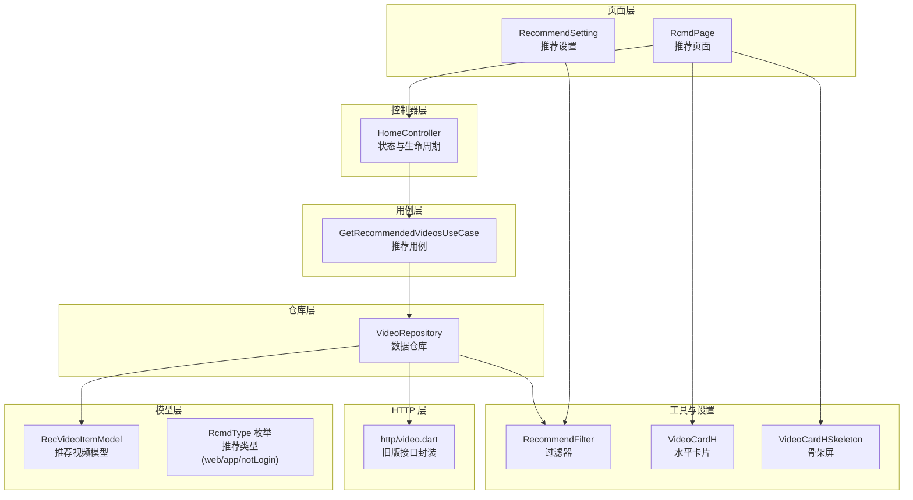
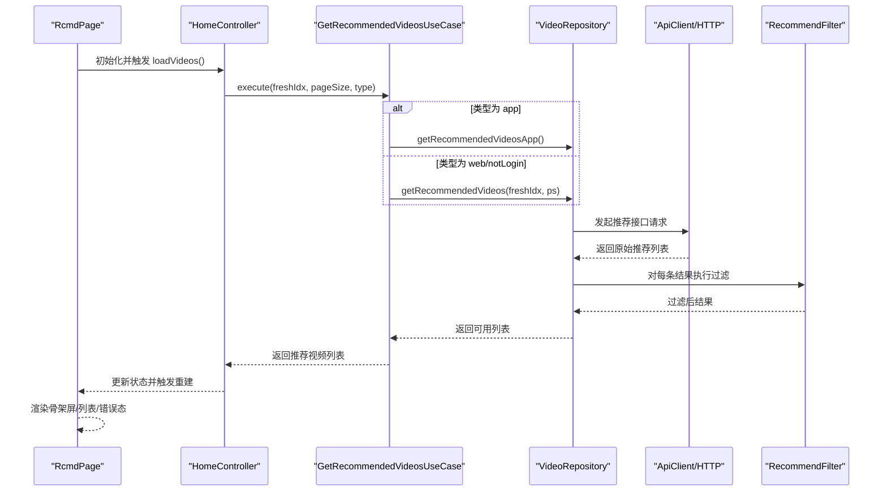
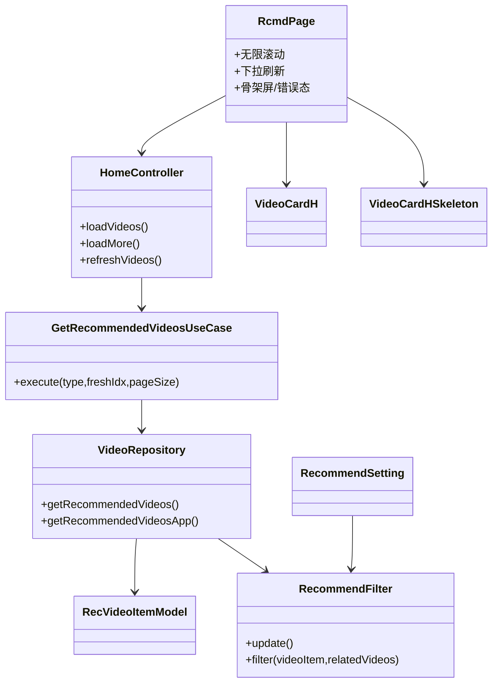
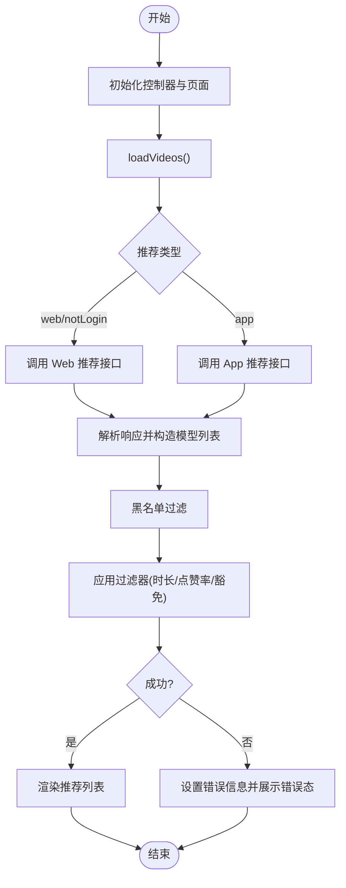

# 推荐页面

<cite>
**本文引用的文件**
- [lib/features/home/presentation/rcmd_page.dart](file://lib/features/home/presentation/rcmd_page.dart)
- [lib/features/home/presentation/home_controller.dart](file://lib/features/home/presentation/home_controller.dart)
- [lib/features/home/domain/video_use_cases.dart](file://lib/features/home/domain/video_use_cases.dart)
- [lib/features/home/data/video_repository.dart](file://lib/features/home/data/video_repository.dart)
- [lib/models/model_rec_video_item.dart](file://lib/models/model_rec_video_item.dart)
- [lib/models/common/rcmd_type.dart](file://lib/models/common/rcmd_type.dart)
- [lib/utils/recommend_filter.dart](file://lib/utils/recommend_filter.dart)
- [lib/pages/setting/recommend_setting.dart](file://lib/pages/setting/recommend_setting.dart)
- [lib/common/widgets/video_card_h.dart](file://lib/common/widgets/video_card_h.dart)
- [lib/common/skeleton/video_card_h.dart](file://lib/common/skeleton/video_card_h.dart)
- [lib/http/video.dart](file://lib/http/video.dart)
- [docs/spec/features/home/spec.md](file://docs/spec/features/home/spec.md)
</cite>

## 目录
1. [简介](#简介)
2. [项目结构](#项目结构)
3. [核心组件](#核心组件)
4. [架构总览](#架构总览)
5. [详细组件分析](#详细组件分析)
6. [依赖关系分析](#依赖关系分析)
7. [性能考量](#性能考量)
8. [故障排查指南](#故障排查指南)
9. [结论](#结论)
10. [附录](#附录)

## 简介
本文件系统性梳理推荐页面的设计与实现，覆盖以下主题：
- 推荐算法与数据来源：基于 Web/App 推荐接口、过滤策略与分页加载
- 数据获取流程：从 API 调用到数据处理与展示
- 展示组件：视频卡片布局、骨架屏与无限滚动
- 参数配置：推荐类型、过滤阈值与开关
- A/B 测试与评估：如何通过配置与埋点扩展实验能力
- 自定义策略：如何调整推荐权重与策略

## 项目结构
推荐页面采用“页面层-控制器-用例层-仓库层-模型层”的分层架构，配合设置页面完成参数化控制。

图表来源
- [lib/features/home/presentation/rcmd_page.dart:1-124](file://lib/features/home/presentation/rcmd_page.dart#L1-L124)
- [lib/features/home/presentation/home_controller.dart:1-191](file://lib/features/home/presentation/home_controller.dart#L1-L191)
- [lib/features/home/domain/video_use_cases.dart:1-43](file://lib/features/home/domain/video_use_cases.dart#L1-L43)
- [lib/features/home/data/video_repository.dart:1-91](file://lib/features/home/data/video_repository.dart#L1-L91)
- [lib/models/model_rec_video_item.dart](file://lib/models/model_rec_video_item.dart)
- [lib/models/common/rcmd_type.dart:1-7](file://lib/models/common/rcmd_type.dart#L1-L7)
- [lib/utils/recommend_filter.dart:1-53](file://lib/utils/recommend_filter.dart#L1-L53)
- [lib/common/widgets/video_card_h.dart:1-431](file://lib/common/widgets/video_card_h.dart#L1-L431)
- [lib/common/skeleton/video_card_h.dart:1-41](file://lib/common/skeleton/video_card_h.dart#L1-L41)
- [lib/http/video.dart:31-68](file://lib/http/video.dart#L31-L68)

章节来源
- [lib/features/home/presentation/rcmd_page.dart:1-124](file://lib/features/home/presentation/rcmd_page.dart#L1-L124)
- [lib/features/home/presentation/home_controller.dart:1-191](file://lib/features/home/presentation/home_controller.dart#L1-L191)
- [lib/features/home/domain/video_use_cases.dart:1-43](file://lib/features/home/domain/video_use_cases.dart#L1-L43)
- [lib/features/home/data/video_repository.dart:1-91](file://lib/features/home/data/video_repository.dart#L1-L91)
- [lib/models/model_rec_video_item.dart](file://lib/models/model_rec_video_item.dart)
- [lib/models/common/rcmd_type.dart:1-7](file://lib/models/common/rcmd_type.dart#L1-L7)
- [lib/utils/recommend_filter.dart:1-53](file://lib/utils/recommend_filter.dart#L1-L53)
- [lib/common/widgets/video_card_h.dart:1-431](file://lib/common/widgets/video_card_h.dart#L1-L431)
- [lib/common/skeleton/video_card_h.dart:1-41](file://lib/common/skeleton/video_card_h.dart#L1-L41)
- [lib/http/video.dart:31-68](file://lib/http/video.dart#L31-L68)

## 核心组件
- 推荐页面：负责无限滚动、下拉刷新、骨架屏与错误态展示，并将数据交由卡片组件渲染。
- 控制器：统一管理推荐列表的加载、刷新、分页与错误状态。
- 用例层：封装推荐数据获取的业务逻辑，支持不同推荐类型。
- 仓库层：对接 HTTP 接口，解析响应并执行过滤。
- 过滤器：基于用户设置对推荐结果进行二次过滤。
- 设置页面：提供推荐类型切换、过滤阈值与开关项。
- 展示组件：视频卡片与骨架屏，支持多种统计信息与交互。

章节来源
- [lib/features/home/presentation/rcmd_page.dart:1-124](file://lib/features/home/presentation/rcmd_page.dart#L1-L124)
- [lib/features/home/presentation/home_controller.dart:1-191](file://lib/features/home/presentation/home_controller.dart#L1-L191)
- [lib/features/home/domain/video_use_cases.dart:1-43](file://lib/features/home/domain/video_use_cases.dart#L1-L43)
- [lib/features/home/data/video_repository.dart:1-91](file://lib/features/home/data/video_repository.dart#L1-L91)
- [lib/utils/recommend_filter.dart:1-53](file://lib/utils/recommend_filter.dart#L1-L53)
- [lib/pages/setting/recommend_setting.dart:1-261](file://lib/pages/setting/recommend_setting.dart#L1-L261)
- [lib/common/widgets/video_card_h.dart:1-431](file://lib/common/widgets/video_card_h.dart#L1-L431)
- [lib/common/skeleton/video_card_h.dart:1-41](file://lib/common/skeleton/video_card_h.dart#L1-L41)

## 架构总览
推荐页面的数据流遵循“页面 -> 控制器 -> 用例 -> 仓库 -> API/本地”的路径，过滤器贯穿仓库与设置层，最终由页面渲染。

图表来源
- [lib/features/home/presentation/rcmd_page.dart:29-46](file://lib/features/home/presentation/rcmd_page.dart#L29-L46)
- [lib/features/home/presentation/home_controller.dart:97-116](file://lib/features/home/presentation/home_controller.dart#L97-L116)
- [lib/features/home/domain/video_use_cases.dart:21-38](file://lib/features/home/domain/video_use_cases.dart#L21-L38)
- [lib/features/home/data/video_repository.dart:23-67](file://lib/features/home/data/video_repository.dart#L23-L67)
- [lib/utils/recommend_filter.dart:29-51](file://lib/utils/recommend_filter.dart#L29-L51)

## 详细组件分析

### 推荐页面（RcmdPage）
- 功能要点
  - 下拉刷新：触发控制器刷新逻辑
  - 无限滚动：接近底部时触发加载更多
  - 骨架屏：首次加载与空数据时展示
  - 错误态：网络异常时展示错误组件并支持重试
  - 卡片渲染：使用水平视频卡片组件展示推荐项
- 关键实现位置
  - 无限滚动监听与加载更多触发
  - 骨架屏与错误态分支
  - 列表渲染与卡片组件传参

章节来源
- [lib/features/home/presentation/rcmd_page.dart:29-46](file://lib/features/home/presentation/rcmd_page.dart#L29-L46)
- [lib/features/home/presentation/rcmd_page.dart:57-122](file://lib/features/home/presentation/rcmd_page.dart#L57-L122)

### 控制器（HomeController）
- 职责
  - 维护推荐列表、加载状态与错误信息
  - 提供初始化加载、刷新与分页加载方法
  - 维护当前推荐类型与分页游标
- 关键实现位置
  - 加载初始列表
  - 加载更多（分页游标递增）
  - 刷新列表

章节来源
- [lib/features/home/presentation/home_controller.dart:97-116](file://lib/features/home/presentation/home_controller.dart#L97-L116)
- [lib/features/home/presentation/home_controller.dart:123-143](file://lib/features/home/presentation/home_controller.dart#L123-L143)
- [lib/features/home/presentation/home_controller.dart:145-169](file://lib/features/home/presentation/home_controller.dart#L145-L169)

### 用例（GetRecommendedVideosUseCase）
- 职责
  - 封装推荐数据获取的业务逻辑
  - 根据类型选择 Web 或 App 推荐接口
  - 统一错误处理
- 关键实现位置
  - 执行入口与类型判断
  - 返回结果或抛出异常

章节来源
- [lib/features/home/domain/video_use_cases.dart:16-38](file://lib/features/home/domain/video_use_cases.dart#L16-L38)

### 仓库（VideoRepository）
- 职责
  - 对接 Web/App 推荐接口
  - 解析响应并构造模型列表
  - 应用黑名单与过滤器
- 关键实现位置
  - Web 推荐接口调用与参数
  - App 推荐接口调用与参数
  - 黑名单过滤与过滤器应用

章节来源
- [lib/features/home/data/video_repository.dart:23-67](file://lib/features/home/data/video_repository.dart#L23-L67)
- [lib/features/home/data/video_repository.dart:69-91](file://lib/features/home/data/video_repository.dart#L69-L91)

### 推荐数据模型（RecVideoItemModel）
- 字段概览
  - 基础标识：id、bvid、cid、goto、uri
  - 媒体信息：pic、title、duration、pubdate
  - UP 主与统计：owner、stat、isFollowed
  - 推荐原因：rcmdReason
- 关键实现位置
  - 模型定义与字段说明

章节来源
- [docs/spec/features/home/spec.md:60-82](file://docs/spec/features/home/spec.md#L60-L82)
- [lib/models/model_rec_video_item.dart](file://lib/models/model_rec_video_item.dart)

### 推荐类型（RcmdType）
- 类型枚举
  - web：Web 端推荐
  - app：App 端推荐
  - notLogin：模拟未登录推荐
- 关键实现位置
  - 枚举与扩展方法

章节来源
- [lib/models/common/rcmd_type.dart:1-7](file://lib/models/common/rcmd_type.dart#L1-L7)

### 推荐过滤器（RecommendFilter）
- 过滤策略
  - 最小视频时长过滤
  - 最小点赞率过滤（基于播放量与点赞数）
  - 已关注 Up 豁免过滤
  - 是否对“相关视频”应用过滤
- 关键实现位置
  - 过滤器更新与读取配置
  - 过滤判定逻辑

章节来源
- [lib/utils/recommend_filter.dart:15-27](file://lib/utils/recommend_filter.dart#L15-L27)
- [lib/utils/recommend_filter.dart:29-51](file://lib/utils/recommend_filter.dart#L29-L51)

### 推荐设置（RecommendSetting）
- 设置项
  - 默认推荐类型（web/app/notLogin）
  - 是否启用 App 推荐动态
  - 首页推荐刷新策略
  - 点赞率过滤阈值
  - 视频时长过滤阈值
  - 已关注 Up 豁免过滤
  - 是否对“相关视频”应用过滤
- 关键实现位置
  - 设置项与交互
  - 过滤器配置变更后触发更新

章节来源
- [lib/pages/setting/recommend_setting.dart:34-46](file://lib/pages/setting/recommend_setting.dart#L34-L46)
- [lib/pages/setting/recommend_setting.dart:145-198](file://lib/pages/setting/recommend_setting.dart#L145-L198)
- [lib/pages/setting/recommend_setting.dart:199-240](file://lib/pages/setting/recommend_setting.dart#L199-L240)

### 展示组件（VideoCardH 与骨架屏）
- 视频卡片（VideoCardH）
  - 布局：左右结构（封面 + 文字信息）
  - 信息：标题、UP 主、播放/弹幕统计、时长徽标、更多菜单
  - 交互：点击进入播放、长按保存封面、更多面板
- 骨架屏（VideoCardHSkeleton）
  - 占位样式：与卡片一致的宽高比与间距
  - 用于首次加载与空数据场景

章节来源
- [lib/common/widgets/video_card_h.dart:19-167](file://lib/common/widgets/video_card_h.dart#L19-L167)
- [lib/common/widgets/video_card_h.dart:169-323](file://lib/common/widgets/video_card_h.dart#L169-L323)
- [lib/common/skeleton/video_card_h.dart:1-41](file://lib/common/skeleton/video_card_h.dart#L1-L41)

### 旧版接口封装（http/video.dart）
- 作用
  - 旧版 Web 推荐接口封装，包含黑名单过滤与过滤器应用
- 关键实现位置
  - 接口调用与返回数据组装

章节来源
- [lib/http/video.dart:31-68](file://lib/http/video.dart#L31-L68)

## 依赖关系分析
- 页面依赖控制器，控制器依赖用例，用例依赖仓库，仓库依赖 API 客户端与过滤器
- 设置页面依赖过滤器与存储，用于持久化用户偏好
- 展示组件依赖模型与常量，渲染推荐项

图表来源
- [lib/features/home/presentation/rcmd_page.dart:1-124](file://lib/features/home/presentation/rcmd_page.dart#L1-L124)
- [lib/features/home/presentation/home_controller.dart:1-191](file://lib/features/home/presentation/home_controller.dart#L1-L191)
- [lib/features/home/domain/video_use_cases.dart:1-43](file://lib/features/home/domain/video_use_cases.dart#L1-L43)
- [lib/features/home/data/video_repository.dart:1-91](file://lib/features/home/data/video_repository.dart#L1-L91)
- [lib/utils/recommend_filter.dart:1-53](file://lib/utils/recommend_filter.dart#L1-L53)
- [lib/pages/setting/recommend_setting.dart:1-261](file://lib/pages/setting/recommend_setting.dart#L1-L261)
- [lib/common/widgets/video_card_h.dart:1-431](file://lib/common/widgets/video_card_h.dart#L1-L431)
- [lib/common/skeleton/video_card_h.dart:1-41](file://lib/common/skeleton/video_card_h.dart#L1-L41)

## 性能考量
- 分页加载
  - 使用游标分页（freshIdx/page）降低单次请求数据量
  - 控制每页大小以平衡首屏速度与滚动体验
- 过滤成本
  - 过滤器在仓库层执行，避免 UI 层重复计算
  - 建议缓存过滤配置，减少频繁读取存储
- 渲染优化
  - 使用骨架屏缩短感知等待时间
  - 卡片组件按需渲染统计信息，避免冗余 UI
- 网络与缓存
  - 接口参数包含版本号与刷选标识，有助于服务端缓存命中
  - 建议引入客户端缓存策略，减少重复请求

## 故障排查指南
- 无数据或为空
  - 检查推荐类型与接口返回；确认过滤器阈值是否过于严格
  - 查看错误态组件与控制器错误信息
- 无法加载更多
  - 确认滚动监听是否触发与 isLoadingMore 状态
  - 检查分页游标是否正确递增
- App 推荐不可用
  - 确认是否已获取 access_key，必要时在设置中确认风险提示
- 过滤不生效
  - 检查过滤器配置是否更新（RecommendFilter.update）
  - 确认设置页面的开关项是否开启

章节来源
- [lib/features/home/presentation/rcmd_page.dart:35-45](file://lib/features/home/presentation/rcmd_page.dart#L35-L45)
- [lib/features/home/presentation/home_controller.dart:123-143](file://lib/features/home/presentation/home_controller.dart#L123-L143)
- [lib/pages/setting/recommend_setting.dart:87-120](file://lib/pages/setting/recommend_setting.dart#L87-L120)
- [lib/utils/recommend_filter.dart:15-27](file://lib/utils/recommend_filter.dart#L15-L27)

## 结论
推荐页面通过清晰的分层架构实现了“数据获取—过滤—渲染”的闭环，具备良好的可扩展性与可维护性。通过设置页面与过滤器，用户可以灵活定制推荐质量；通过分页与骨架屏，提升了用户体验。后续可在用例层引入更复杂的排序与加权策略，结合埋点与 A/B 实验完善推荐效果评估。

## 附录

### 推荐数据获取流程（细化）

图表来源
- [lib/features/home/data/video_repository.dart:23-67](file://lib/features/home/data/video_repository.dart#L23-L67)
- [lib/features/home/data/video_repository.dart:69-91](file://lib/features/home/data/video_repository.dart#L69-L91)
- [lib/utils/recommend_filter.dart:29-51](file://lib/utils/recommend_filter.dart#L29-L51)

### 推荐算法与策略说明
- 协同过滤与内容相似度
  - 当前实现主要基于接口返回与过滤策略，未见显式的协同过滤或内容相似度计算代码
- 机器学习模型
  - 未发现 ML 模型直接集成代码；可通过用例层扩展“排序/打分”逻辑，将模型输出作为排序权重
- 权重与策略调整建议
  - 在用例层新增“排序用例”，将仓库返回的列表与权重向量相乘，再进行降序排序
  - 在设置页面新增“权重调节项”，通过存储持久化权重并在排序用例中读取

### A/B 测试与效果评估
- A/B 测试
  - 通过设置页面切换推荐类型（web/app/notLogin）实现简单 A/B
  - 可扩展：新增“实验组/对照组”标识，埋点上报实验分组与关键指标
- 效果评估指标
  - 曝光/点击率、观看时长、完播率、互动率、留存率
  - 建议在卡片点击、播放完成、互动操作处埋点上报

### 代码示例路径（不展示具体代码）
- 如何调整推荐权重与自定义策略
  - 在用例层新增排序逻辑：参考 [lib/features/home/domain/video_use_cases.dart:16-38](file://lib/features/home/domain/video_use_cases.dart#L16-L38)
  - 在设置页面新增权重调节项：参考 [lib/pages/setting/recommend_setting.dart:145-198](file://lib/pages/setting/recommend_setting.dart#L145-L198)
  - 在控制器中接入排序结果：参考 [lib/features/home/presentation/home_controller.dart:97-116](file://lib/features/home/presentation/home_controller.dart#L97-L116)