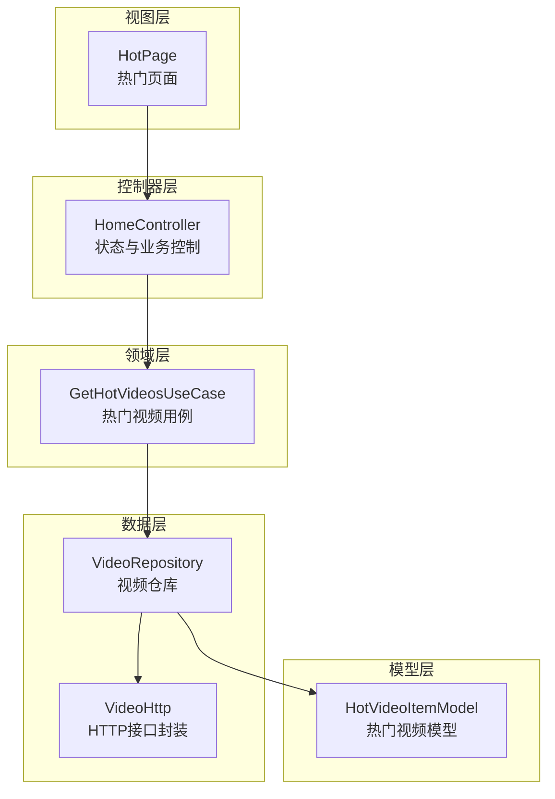
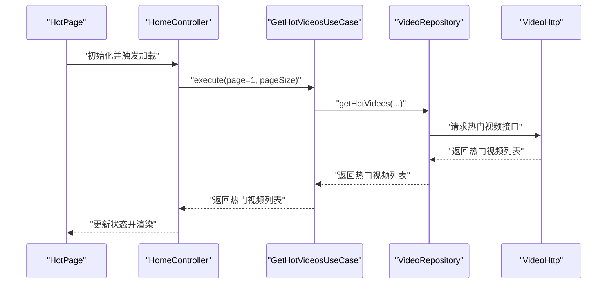
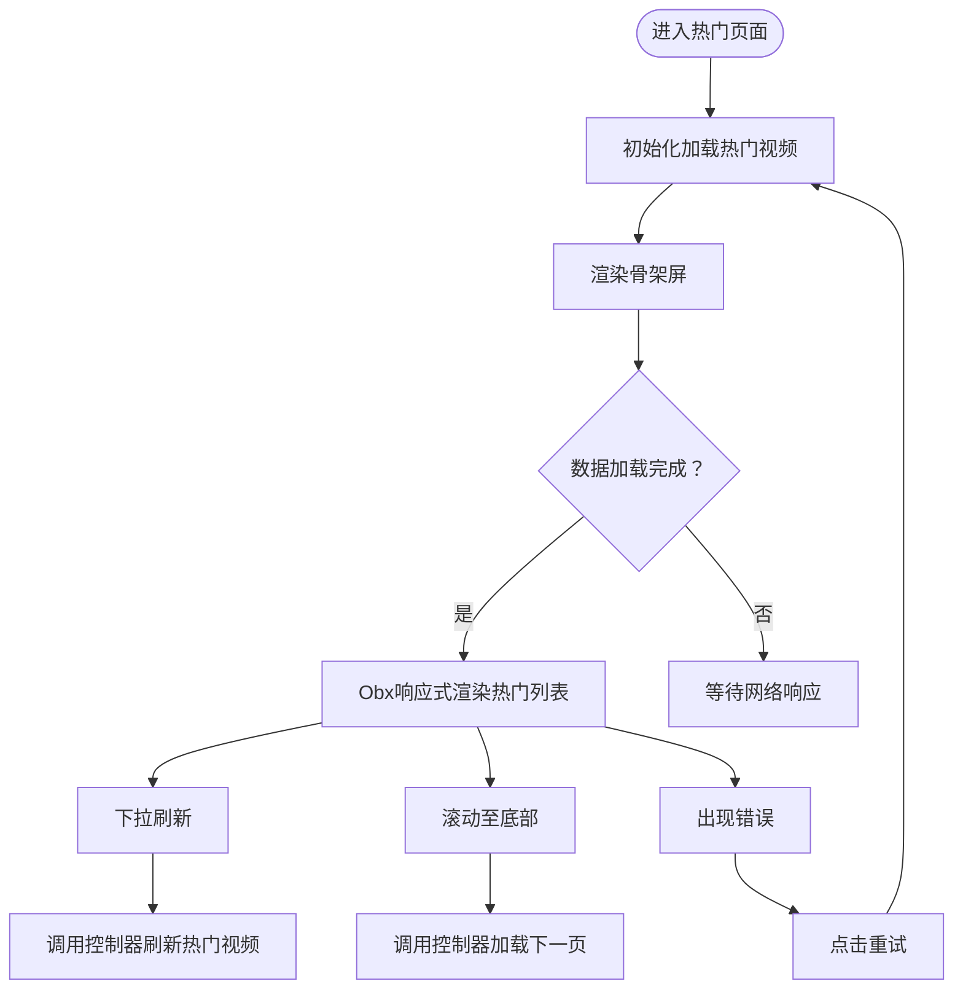
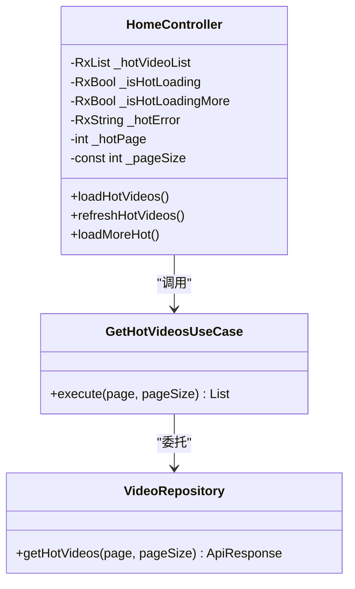
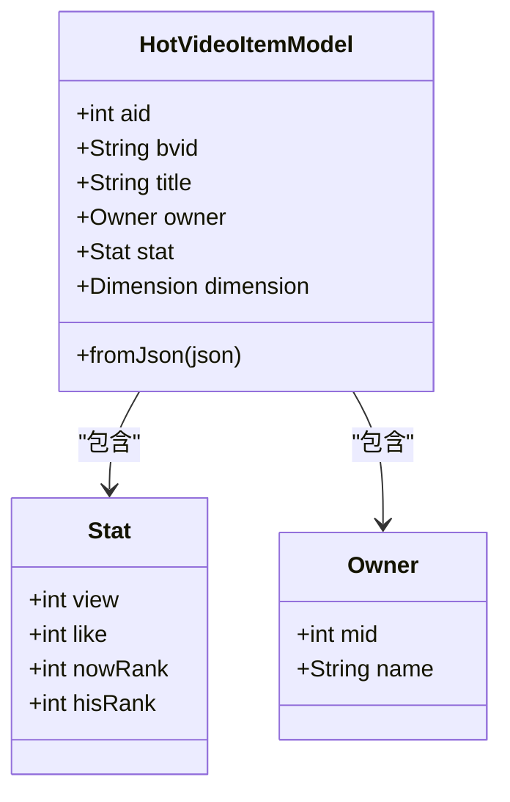
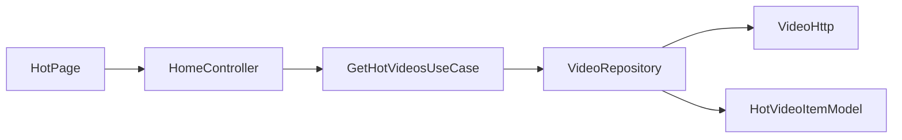

# 热门页面

<cite>
**本文引用的文件**
- [hot_page.dart](file://lib/features/home/presentation/hot_page.dart)
- [home_controller.dart](file://lib/features/home/presentation/home_controller.dart)
- [video_use_cases.dart](file://lib/features/home/domain/video_use_cases.dart)
- [video_repository.dart](file://lib/features/home/data/video_repository.dart)
- [video_http.dart](file://lib/http/video.dart)
- [model_hot_video_item.dart](file://lib/models/model_hot_video_item.dart)
- [rank_type.dart](file://lib/models/common/rank_type.dart)
- [search_use_cases.dart](file://lib/features/search/domain/search_use_cases.dart)
- [search_repository.dart](file://lib/features/search/data/search_repository.dart)
- [hot_keyword.dart（搜索）](file://lib/features/search/presentation/widgets/hot_keyword.dart)
- [hot_keyword.dart（页面）](file://lib/pages/search/widgets/hot_keyword.dart)
</cite>

## 目录
1. [简介](#简介)
2. [项目结构](#项目结构)
3. [核心组件](#核心组件)
4. [架构总览](#架构总览)
5. [详细组件分析](#详细组件分析)
6. [依赖关系分析](#依赖关系分析)
7. [性能考量](#性能考量)
8. [故障排查指南](#故障排查指南)
9. [结论](#结论)
10. [附录：扩展与自定义](#附录扩展与自定义)

## 简介
本文件系统性梳理“热门页面”的实现与设计，覆盖以下主题：
- 热门内容的数据来源与展示模型
- 排行榜的加载、刷新与分页机制
- 播放量统计、点赞数排序与时间衰减的可扩展设计
- 实时更新与缓存策略建议
- 展示组件（榜单列表、骨架屏、错误处理）
- 分类标签、筛选与排序选项的实现思路
- 如何扩展热门算法与新增排序维度

## 项目结构
热门页面采用典型的 MVVM + Use Case + Repository 架构，围绕 HomeController 组织状态与交互，通过 Use Cases 调用 Repository，Repository 再调用 HTTP 层获取数据。

图表来源
- [hot_page.dart:13-122](file://lib/features/home/presentation/hot_page.dart#L13-L122)
- [home_controller.dart:9-190](file://lib/features/home/presentation/home_controller.dart#L9-L190)
- [video_use_cases.dart:41-64](file://lib/features/home/domain/video_use_cases.dart#L41-L64)
- [video_repository.dart:17-120](file://lib/features/home/data/video_repository.dart#L17-L120)
- [video_http.dart:24-544](file://lib/http/video.dart#L24-L544)
- [model_hot_video_item.dart:3-121](file://lib/models/model_hot_video_item.dart#L3-L121)

章节来源
- [hot_page.dart:13-122](file://lib/features/home/presentation/hot_page.dart#L13-L122)
- [home_controller.dart:9-190](file://lib/features/home/presentation/home_controller.dart#L9-L190)
- [video_use_cases.dart:41-64](file://lib/features/home/domain/video_use_cases.dart#L41-L64)
- [video_repository.dart:17-120](file://lib/features/home/data/video_repository.dart#L17-L120)
- [video_http.dart:24-544](file://lib/http/video.dart#L24-L544)
- [model_hot_video_item.dart:3-121](file://lib/models/model_hot_video_item.dart#L3-L121)

## 核心组件
- 热门页面视图：负责下拉刷新、滚动触底加载、骨架屏与错误占位渲染。
- 控制器：管理热门视频列表、加载状态、错误信息与分页页码。
- 用例：封装热门视频获取的业务逻辑，支持分页参数传递。
- 仓库：抽象 HTTP 访问，统一响应格式与错误处理。
- HTTP 层：封装具体 API 调用，如“视频排行”等。
- 模型：热门视频数据结构，包含播放量、点赞等统计字段。

章节来源
- [hot_page.dart:13-122](file://lib/features/home/presentation/hot_page.dart#L13-L122)
- [home_controller.dart:9-190](file://lib/features/home/presentation/home_controller.dart#L9-L190)
- [video_use_cases.dart:41-64](file://lib/features/home/domain/video_use_cases.dart#L41-L64)
- [video_repository.dart:17-120](file://lib/features/home/data/video_repository.dart#L17-L120)
- [video_http.dart:513-534](file://lib/http/video.dart#L513-L534)
- [model_hot_video_item.dart:3-121](file://lib/models/model_hot_video_item.dart#L3-L121)

## 架构总览
热门页面的数据流从视图层触发，经由控制器协调，调用用例，再由仓库访问 HTTP 接口，最终回填到视图进行渲染。

图表来源
- [hot_page.dart:28-45](file://lib/features/home/presentation/hot_page.dart#L28-L45)
- [home_controller.dart:145-168](file://lib/features/home/presentation/home_controller.dart#L145-L168)
- [video_use_cases.dart:48-63](file://lib/features/home/domain/video_use_cases.dart#L48-L63)
- [video_repository.dart:86-120](file://lib/features/home/data/video_repository.dart#L86-L120)
- [video_http.dart:513-534](file://lib/http/video.dart#L513-L534)

## 详细组件分析

### 热门页面视图（HotPage）
- 功能要点
  - 下拉刷新：触发控制器刷新热门视频。
  - 滚动监听：接近底部时自动加载下一页。
  - 渲染策略：使用 FutureBuilder 预渲染骨架屏；Obx 响应式更新列表；错误时显示错误占位。
  - 组件复用：使用 VideoCardH 展示每条热门视频项。
- 关键行为
  - 初始化加载：在组件初始化时调用控制器加载热门视频。
  - 加载更多：滚动至底部阈值后调用控制器加载下一页。
  - 错误重试：错误占位提供重试按钮，重新触发加载。

图表来源
- [hot_page.dart:28-45](file://lib/features/home/presentation/hot_page.dart#L28-L45)
- [hot_page.dart:66-111](file://lib/features/home/presentation/hot_page.dart#L66-L111)

章节来源
- [hot_page.dart:13-122](file://lib/features/home/presentation/hot_page.dart#L13-L122)

### 控制器（HomeController）
- 负责热门视频列表的状态管理与业务流程控制。
- 提供加载、刷新、加载更多方法，并维护页码与加载状态。
- 使用 Rx 响应式状态驱动视图更新。

图表来源
- [home_controller.dart:9-190](file://lib/features/home/presentation/home_controller.dart#L9-L190)
- [video_use_cases.dart:41-64](file://lib/features/home/domain/video_use_cases.dart#L41-L64)
- [video_repository.dart:17-120](file://lib/features/home/data/video_repository.dart#L17-L120)

章节来源
- [home_controller.dart:9-190](file://lib/features/home/presentation/home_controller.dart#L9-L190)

### 用例（GetHotVideosUseCase）
- 封装热门视频获取的业务逻辑，支持传入页码与分页大小。
- 对仓库返回的响应进行校验，失败时抛出异常。

章节来源
- [video_use_cases.dart:41-64](file://lib/features/home/domain/video_use_cases.dart#L41-L64)

### 仓库（VideoRepository）
- 通过 ApiClient 调用后端接口，封装热门视频列表的获取。
- 统一响应格式与错误处理，便于上层用例与控制器消费。

章节来源
- [video_repository.dart:17-120](file://lib/features/home/data/video_repository.dart#L17-L120)

### HTTP 层（VideoHttp）
- 提供“视频排行”等接口封装，返回热门视频列表。
- 可按分区 ID 查询对应排行，过滤黑名单 UP 主。

章节来源
- [video_http.dart:513-534](file://lib/http/video.dart#L513-L534)

### 数据模型（HotVideoItemModel）
- 定义热门视频的字段集合，包含基础信息、UP 主信息、统计数据等。
- 统一的 JSON 解析构造函数，确保数据一致性。

图表来源
- [model_hot_video_item.dart:3-121](file://lib/models/model_hot_video_item.dart#L3-L121)

章节来源
- [model_hot_video_item.dart:3-121](file://lib/models/model_hot_video_item.dart#L3-L121)

### 分类标签与排序（RankType 与搜索热词）
- 分类标签：通过枚举定义分区类型，用于热门排行的分区筛选。
- 搜索热词：提供热门搜索关键词列表，辅助用户发现内容。

章节来源
- [rank_type.dart:4-58](file://lib/models/common/rank_type.dart#L4-L58)
- [search_use_cases.dart:7-23](file://lib/features/search/domain/search_use_cases.dart#L7-L23)
- [search_repository.dart:9-29](file://lib/features/search/data/search_repository.dart#L9-L29)
- [hot_keyword.dart（搜索）](file://lib/features/search/presentation/widgets/hot_keyword.dart)
- [hot_keyword.dart（页面）](file://lib/pages/search/widgets/hot_keyword.dart)

## 依赖关系分析
- 视图层依赖控制器；控制器依赖用例；用例依赖仓库；仓库依赖 HTTP 层与模型。
- 热门视频列表的加载、刷新与分页均通过控制器集中管理，职责清晰、耦合度低。
- 模型与 HTTP 层解耦，便于替换数据源或扩展字段。

图表来源
- [hot_page.dart:13-122](file://lib/features/home/presentation/hot_page.dart#L13-L122)
- [home_controller.dart:9-190](file://lib/features/home/presentation/home_controller.dart#L9-L190)
- [video_use_cases.dart:41-64](file://lib/features/home/domain/video_use_cases.dart#L41-L64)
- [video_repository.dart:17-120](file://lib/features/home/data/video_repository.dart#L17-L120)
- [video_http.dart:24-544](file://lib/http/video.dart#L24-L544)
- [model_hot_video_item.dart:3-121](file://lib/models/model_hot_video_item.dart#L3-L121)

章节来源
- [hot_page.dart:13-122](file://lib/features/home/presentation/hot_page.dart#L13-L122)
- [home_controller.dart:9-190](file://lib/features/home/presentation/home_controller.dart#L9-L190)
- [video_use_cases.dart:41-64](file://lib/features/home/domain/video_use_cases.dart#L41-L64)
- [video_repository.dart:17-120](file://lib/features/home/data/video_repository.dart#L17-L120)
- [video_http.dart:24-544](file://lib/http/video.dart#L24-L544)
- [model_hot_video_item.dart:3-121](file://lib/models/model_hot_video_item.dart#L3-L121)

## 性能考量
- 列表渲染
  - 使用骨架屏减少首屏等待感知，提升用户体验。
  - 使用 Obx 响应式更新，避免全量重建。
- 分页与加载
  - 控制器集中管理页码与加载状态，防止重复请求。
  - 滚动监听仅在接近底部时触发加载更多，降低网络压力。
- 缓存与去抖
  - 建议在仓库层引入本地缓存与去抖策略，减少频繁请求。
  - 对热门接口设置合理的缓存过期时间，结合下拉刷新强制更新。
- 图片与首帧
  - 使用首帧或封面图作为占位，提升视觉连续性。
- 排序与算法
  - 当前仓库与 HTTP 层未直接暴露时间衰减参数；可在仓库层增加配置项，以支持不同维度的排序权重与衰减周期。

[本节为通用性能建议，不直接分析具体文件]

## 故障排查指南
- 网络异常
  - 控制器捕获异常并设置错误信息，视图层通过错误占位提示用户重试。
- 数据为空
  - 若接口返回空列表，视图层仍会渲染骨架屏，避免界面闪烁。
- 刷新无响应
  - 检查控制器是否处于加载中状态，确认下拉刷新回调已正确绑定。
- 加载更多无效
  - 检查滚动监听阈值与加载状态，确保未重复触发。

章节来源
- [home_controller.dart:145-189](file://lib/features/home/presentation/home_controller.dart#L145-L189)
- [hot_page.dart:66-111](file://lib/features/home/presentation/hot_page.dart#L66-L111)

## 结论
热门页面当前实现了稳定的加载、刷新与分页机制，数据模型与视图组件解耦良好。若需引入更丰富的热门算法（如播放量、点赞、互动率与时间衰减），建议在仓库层扩展参数与缓存策略，并在视图层提供分区筛选与排序选项入口，以满足多场景需求。

[本节为总结性内容，不直接分析具体文件]

## 附录：扩展与自定义

### 热门算法与排序维度扩展
- 在仓库层增加参数
  - 例如：支持传入排序维度（播放量、点赞、互动率）、时间窗口、权重系数等。
  - 参考路径：[video_repository.dart:86-120](file://lib/features/home/data/video_repository.dart#L86-L120)
- 在控制器层暴露配置
  - 通过控制器方法接收新参数并透传给用例。
  - 参考路径：[home_controller.dart:145-189](file://lib/features/home/presentation/home_controller.dart#L145-L189)
- 在视图层提供筛选入口
  - 新增分区标签与排序选项，联动控制器刷新。
  - 参考路径：[rank_type.dart:4-58](file://lib/models/common/rank_type.dart#L4-L58)

### 时间衰减算法建议
- 设计思路
  - 以发布时间为基准，对播放量与点赞数施加指数衰减权重。
  - 合成分数 = Σ(播放量_i × w_view × decay(t_i)) + Σ(点赞_i × w_like × decay(t_i))。
  - 其中 decay(t) = exp(-λ × t)，λ 为衰减系数，t 为距当前时间的小时数。
- 参数配置
  - λ 与权重 w_view、w_like 可通过设置中心动态调整。
- 实现位置
  - 建议在仓库层或服务层进行二次加工，保持模型与视图层稳定。

[本节为概念性扩展建议，不直接分析具体文件]

### 展示组件增强
- 排名变化动画
  - 可在 Obx 更新后对比前后排名，使用过渡动画高亮变化项。
- 视频预览
  - 在卡片上集成缩略图与首帧图，结合悬浮预览组件提升交互体验。
- 错误与空态
  - 错误占位提供重试按钮；空态展示引导内容。

章节来源
- [hot_page.dart:66-111](file://lib/features/home/presentation/hot_page.dart#L66-L111)