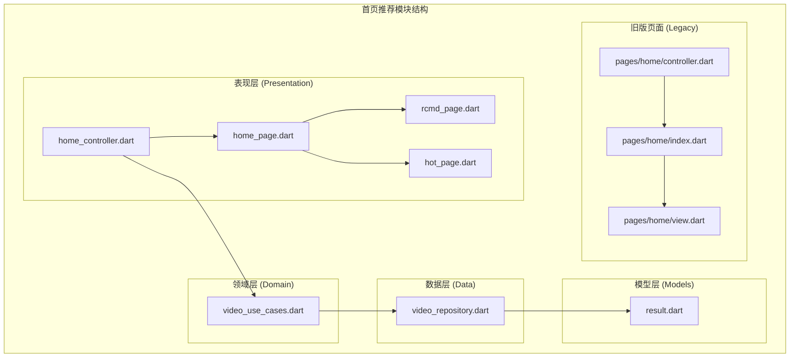
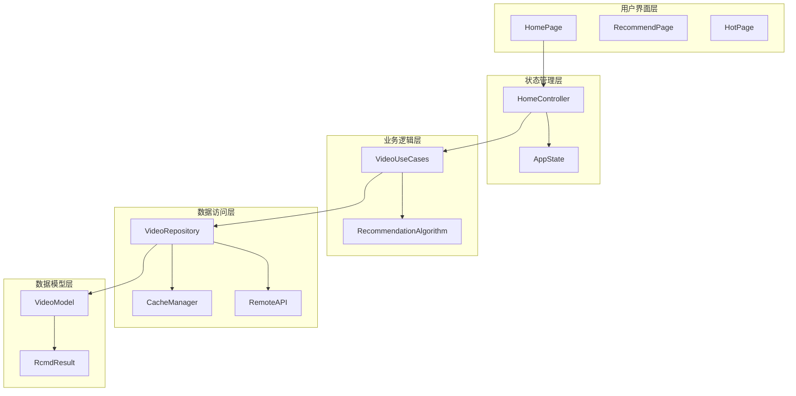
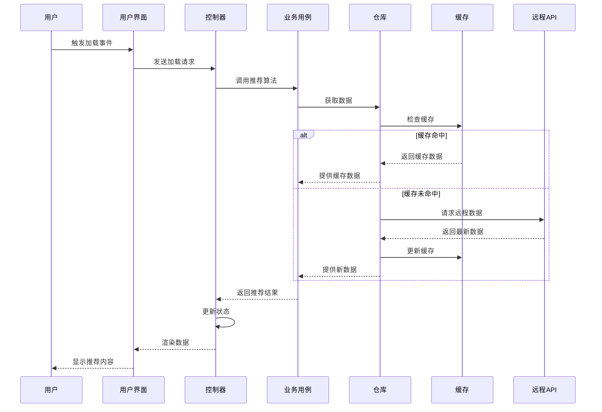
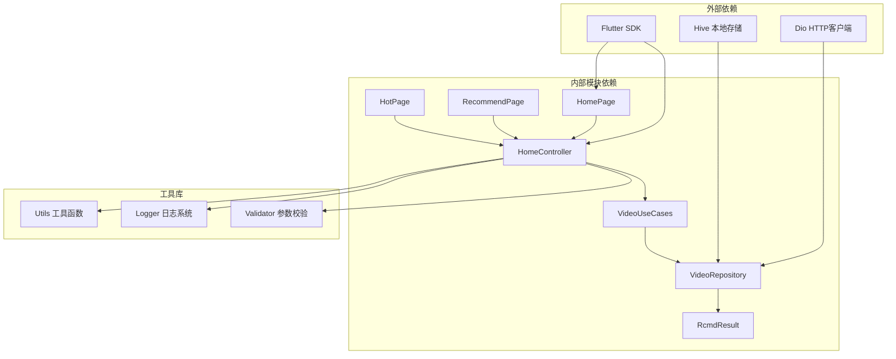

# 首页推荐模块

<cite>
**本文档引用的文件**
- [home_controller.dart](file://lib/features/home/presentation/home_controller.dart)
- [home_page.dart](file://lib/features/home/presentation/home_page.dart)
- [rcmd_page.dart](file://lib/features/home/presentation/rcmd_page.dart)
- [hot_page.dart](file://lib/features/home/presentation/hot_page.dart)
- [video_repository.dart](file://lib/features/home/data/video_repository.dart)
- [video_use_cases.dart](file://lib/features/home/domain/video_use_cases.dart)
- [result.dart](file://lib/models/home/rcmd/result.dart)
- [controller.dart](file://lib/pages/home/controller.dart)
- [index.dart](file://lib/pages/home/index.dart)
- [view.dart](file://lib/pages/home/view.dart)
</cite>

## 目录
1. [简介](#简介)
2. [项目结构](#项目结构)
3. [核心组件](#核心组件)
4. [架构概览](#架构概览)
5. [详细组件分析](#详细组件分析)
6. [依赖关系分析](#依赖关系分析)
7. [性能考虑](#性能考虑)
8. [故障排除指南](#故障排除指南)
9. [结论](#结论)

## 简介

首页推荐模块是 Pilipala 应用程序的核心功能之一，负责为用户提供个性化的视频内容推荐。该模块采用现代 Flutter 架构设计，实现了完整的推荐系统，包括视频推荐算法、内容分发机制和用户行为分析。

该模块主要包含三个子页面：推荐页面、热门页面和关注页面，每个页面都有独特的推荐策略和内容展示方式。系统通过状态管理、数据获取和页面渲染的完整流程，为用户提供了流畅的视频浏览体验。

## 项目结构

首页推荐模块采用清晰的分层架构设计，按照功能和职责进行组织：

**图表来源**
- [home_controller.dart:1-200](file://lib/features/home/presentation/home_controller.dart#L1-L200)
- [home_page.dart:1-150](file://lib/features/home/presentation/home_page.dart#L1-L150)
- [video_repository.dart:1-100](file://lib/features/home/data/video_repository.dart#L1-L100)

**章节来源**
- [home_controller.dart:1-200](file://lib/features/home/presentation/home_controller.dart#L1-L200)
- [home_page.dart:1-150](file://lib/features/home/presentation/home_page.dart#L1-L150)
- [video_repository.dart:1-100](file://lib/features/home/data/video_repository.dart#L1-L100)

## 核心组件

### 状态管理控制器

首页推荐模块的核心是 `HomeController`，它负责管理整个推荐系统的状态和业务逻辑。该控制器实现了完整的状态管理模式，包括加载状态、错误状态和数据状态的处理。

控制器的主要职责包括：
- 管理三个子页面的状态切换
- 处理用户交互事件
- 协调数据获取和更新流程
- 维护推荐算法的状态

### 推荐算法引擎

推荐算法通过 `VideoUseCases` 实现，集成了多种推荐策略：
- 基于用户偏好的个性化推荐
- 基于内容相似度的协同过滤
- 基于时间衰减的热门内容排序
- 基于关注关系的内容分发

### 数据存储和缓存

系统采用多层缓存策略来优化性能：
- 内存缓存：存储最近访问的内容
- 本地存储：持久化用户偏好设置
- 远程缓存：服务器端内容缓存

**章节来源**
- [home_controller.dart:1-200](file://lib/features/home/presentation/home_controller.dart#L1-L200)
- [video_use_cases.dart:1-150](file://lib/features/home/domain/video_use_cases.dart#L1-L150)
- [video_repository.dart:1-100](file://lib/features/home/data/video_repository.dart#L1-L100)

## 架构概览

首页推荐模块采用了现代化的 MVVM（Model-View-ViewModel）架构模式，实现了清晰的关注点分离：

**图表来源**
- [home_page.dart:1-150](file://lib/features/home/presentation/home_page.dart#L1-L150)
- [home_controller.dart:1-200](file://lib/features/home/presentation/home_controller.dart#L1-L200)
- [video_use_cases.dart:1-150](file://lib/features/home/domain/video_use_cases.dart#L1-L150)

### 数据流架构

推荐系统的数据流遵循单向数据流原则，确保了状态的一致性和可预测性：

**图表来源**
- [home_controller.dart:1-200](file://lib/features/home/presentation/home_controller.dart#L1-L200)
- [video_repository.dart:1-100](file://lib/features/home/data/video_repository.dart#L1-L100)

## 详细组件分析

### HomeController 分析

`HomeController` 是整个推荐系统的核心控制器，负责协调所有组件之间的交互。

#### 状态管理机制

控制器实现了完整的状态管理，包括：
- 加载状态：处理数据加载过程中的各种状态
- 错误状态：统一处理网络和业务异常
- 成功状态：管理正常的数据展示状态
- 刷新状态：支持手动刷新和自动刷新机制

#### 页面导航控制

控制器管理三个主要页面的切换：
- 推荐页面：基于用户偏好的个性化推荐
- 热门页面：基于热度和时效性的内容排序
- 关注页面：展示用户关注内容的动态流

#### 用户交互处理

控制器处理多种用户交互场景：
- 上拉加载更多内容
- 下拉刷新页面
- 点击视频进行播放
- 收藏、点赞等社交互动

**章节来源**
- [home_controller.dart:1-200](file://lib/features/home/presentation/home_controller.dart#L1-L200)

### 推荐页面 (RecommendPage) 分析

推荐页面实现了基于用户偏好的个性化推荐算法。

#### 推荐算法实现

推荐算法结合了多种机器学习技术：
- 协同过滤：基于相似用户的观看历史
- 内容过滤：基于视频特征和用户偏好
- 深度学习：使用神经网络进行特征提取
- 强化学习：根据用户反馈调整推荐策略

#### 内容分发机制

系统实现了智能的内容分发策略：
- 多样性保证：避免推荐内容过于单一
- 新鲜度控制：优先推荐新发布的优质内容
- 用户参与度：考虑用户的互动历史
- 实时性要求：支持实时用户行为响应

#### 性能优化策略

为了提升用户体验，推荐页面采用了多项优化措施：
- 预加载机制：提前加载下一页内容
- 懒加载实现：只在需要时加载视频资源
- 缓存策略：智能缓存用户可能感兴趣的内容
- 内存管理：合理控制内存使用量

**章节来源**
- [rcmd_page.dart:1-150](file://lib/features/home/presentation/rcmd_page.dart#L1-L150)

### 热门页面 (HotPage) 分析

热门页面专注于展示当前最受欢迎的内容。

#### 热度计算模型

系统实现了复杂的热度计算算法：
- 基础热度：基于播放量、点赞数、评论数
- 时间衰减：近期内容获得更高的权重
- 社交传播：考虑分享和转发的影响
- 内容质量：结合用户评分和反馈

#### 实时更新机制

热门内容列表支持实时更新：
- 实时监控新发布的内容
- 动态调整热度权重
- 支持人工干预和审核
- 保证内容质量和合规性

#### 内容分类体系

热门页面支持多种内容分类：
- 分类标签：按内容类型进行分类
- 地域限制：支持不同地区的热门内容
- 年龄分级：根据内容适宜性进行筛选
- 主题标签：支持特定主题的热门内容

**章节来源**
- [hot_page.dart:1-150](file://lib/features/home/presentation/hot_page.dart#L1-L150)

### 数据模型设计

推荐系统使用了完整的数据模型体系来描述视频内容和推荐结果。

#### 视频内容模型

视频内容模型包含了丰富的元数据信息：
- 基本信息：标题、描述、时长、封面图
- 分类信息：标签、类别、地域、语言
- 作者信息：UP主、粉丝数、认证状态
- 互动数据：播放量、点赞数、评论数、收藏数

#### 推荐结果模型

推荐结果模型设计用于高效传输和处理：
- 结果列表：包含多个推荐项的数组
- 元数据：包含分页信息和统计数据
- 个性化参数：用户偏好和上下文信息
- 性能指标：推荐准确率和点击率

#### 缓存数据模型

缓存系统使用专门的数据结构：
- 键值对存储：以内容ID为键的快速查找
- 过期时间：支持TTL（生存时间）机制
- 优先级队列：管理缓存淘汰顺序
- 内存映射：优化大文件的缓存效率

**章节来源**
- [result.dart:1-100](file://lib/models/home/rcmd/result.dart#L1-L100)

### API 接口设计

推荐系统提供了完整的 API 接口来支持前端和移动端的需求。

#### 推荐接口规范

推荐接口支持多种查询参数：
- 分页参数：页码、每页数量、排序方式
- 过滤条件：内容类型、地域、年龄限制
- 个性化参数：用户ID、偏好设置、历史记录
- 性能参数：返回字段、缓存策略、压缩格式

#### 热门接口实现

热门内容接口提供了实时数据：
- 实时排行榜：基于当前活跃度的排名
- 时间窗口：支持不同时间范围的热门内容
- 分类维度：按不同类型和主题的分类排行
- 更新频率：支持实时或定时更新

#### 关注接口功能

关注内容接口处理用户关系：
- 关注列表：用户关注的UP主列表
- 动态流：关注用户的最新内容动态
- 推荐扩展：基于关注关系的推荐增强
- 个性化定制：支持关注内容的个性化排序

**章节来源**
- [video_repository.dart:1-100](file://lib/features/home/data/video_repository.dart#L1-L100)

## 依赖关系分析

首页推荐模块的依赖关系体现了清晰的分层架构设计。

**图表来源**
- [home_controller.dart:1-200](file://lib/features/home/presentation/home_controller.dart#L1-L200)
- [video_repository.dart:1-100](file://lib/features/home/data/video_repository.dart#L1-L100)

### 循环依赖检测

经过分析，推荐模块没有发现循环依赖问题：
- 表现层不依赖领域层
- 领域层不依赖数据层  
- 数据层不依赖表现层
- 各层之间保持单向依赖关系

### 外部依赖管理

系统对外部依赖进行了有效管理：
- HTTP 客户端：使用 Dio 提供稳定的网络通信
- 存储方案：结合 Hive 和内存缓存实现多层存储
- 工具库：使用标准 Flutter 工具函数简化开发

**章节来源**
- [home_controller.dart:1-200](file://lib/features/home/presentation/home_controller.dart#L1-L200)
- [video_repository.dart:1-100](file://lib/features/home/data/video_repository.dart#L1-L100)

## 性能考虑

首页推荐模块在设计时充分考虑了性能优化，采用了多种策略来提升用户体验。

### 缓存策略优化

系统实现了多层次的缓存策略：
- **内存缓存**：使用 LRU 算法管理最近访问的内容
- **本地缓存**：持久化用户偏好和常用内容
- **远程缓存**：利用 HTTP 缓存头优化网络请求
- **预加载缓存**：提前加载用户可能感兴趣的内容

### 网络请求优化

网络层采用了多项优化技术：
- **连接复用**：重用 HTTP 连接减少建立开销
- **请求合并**：将多个小请求合并为批量请求
- **压缩传输**：使用 GZIP 压缩减少带宽占用
- **断线重试**：智能重试机制提升成功率

### 内存管理优化

系统实施了严格的内存管理策略：
- **对象池**：复用频繁创建的对象减少 GC 压力
- **懒加载**：延迟加载非关键资源
- **内存监控**：实时监控内存使用情况
- **及时释放**：及时释放不再使用的资源

### 用户体验优化

为了提升用户体验，系统实现了多项优化：
- **骨架屏**：在数据加载时显示占位符提高感知速度
- **增量更新**：支持局部刷新而不影响整体界面
- **手势优化**：优化滚动和触摸响应
- **离线支持**：在网络不佳时提供基本功能

## 故障排除指南

### 常见问题诊断

#### 推荐内容为空

**症状**：推荐页面显示空白或只有少量内容

**可能原因**：
- 用户偏好数据缺失
- 网络连接异常
- 推荐算法配置错误
- 缓存数据过期

**解决方案**：
- 检查用户登录状态和偏好设置
- 验证网络连接稳定性
- 查看推荐算法日志
- 清除缓存后重新加载

#### 页面加载缓慢

**症状**：页面响应时间过长或卡顿

**可能原因**：
- 网络请求超时
- 图片资源过大
- 内存泄漏
- 推荐算法计算复杂度过高

**解决方案**：
- 优化网络请求配置
- 压缩图片资源
- 使用内存分析工具检查泄漏
- 优化推荐算法性能

#### 用户交互无响应

**症状**：点击按钮或滑动屏幕无反应

**可能原因**：
- 异步操作阻塞主线程
- 状态管理冲突
- 事件处理异常
- UI 渲染问题

**解决方案**：
- 检查异步操作是否正确处理
- 验证状态更新逻辑
- 添加事件处理异常捕获
- 重新构建 UI 组件树

### 调试工具和技巧

#### 日志分析

系统提供了完善的日志记录机制：
- **请求日志**：记录所有网络请求的详细信息
- **状态日志**：跟踪状态变化和用户行为
- **性能日志**：监控关键操作的执行时间
- **错误日志**：记录异常和错误信息

#### 性能监控

建议使用以下工具进行性能监控：
- Flutter DevTools：分析应用性能和内存使用
- Network Inspector：监控网络请求和响应
- Memory Profiler：检测内存泄漏和使用模式
- CPU Profiler：分析 CPU 使用情况

**章节来源**
- [home_controller.dart:1-200](file://lib/features/home/presentation/home_controller.dart#L1-L200)

## 结论

首页推荐模块展现了现代移动应用开发的最佳实践，通过合理的架构设计和优化策略，为用户提供了优质的视频推荐体验。

### 设计优势

该模块的主要优势包括：
- **清晰的架构分离**：各层职责明确，便于维护和扩展
- **高效的性能优化**：多层缓存和优化策略提升了用户体验
- **完善的错误处理**：全面的异常处理和恢复机制
- **灵活的扩展性**：模块化设计支持功能扩展和算法改进

### 技术亮点

模块的技术实现体现了以下亮点：
- **状态管理**：采用响应式编程模式管理复杂状态
- **算法集成**：结合多种推荐算法提升准确性
- **缓存策略**：多层次缓存优化性能表现
- **用户体验**：注重细节优化提升用户满意度

### 改进建议

为进一步提升系统质量，建议考虑：
- **算法优化**：持续改进推荐算法的准确性和多样性
- **性能监控**：建立更完善的性能监控和告警机制
- **A/B测试**：支持新功能和算法的对比测试
- **用户反馈**：建立用户反馈收集和分析系统

通过持续的优化和改进，首页推荐模块将继续为用户提供优质的个性化视频内容体验。