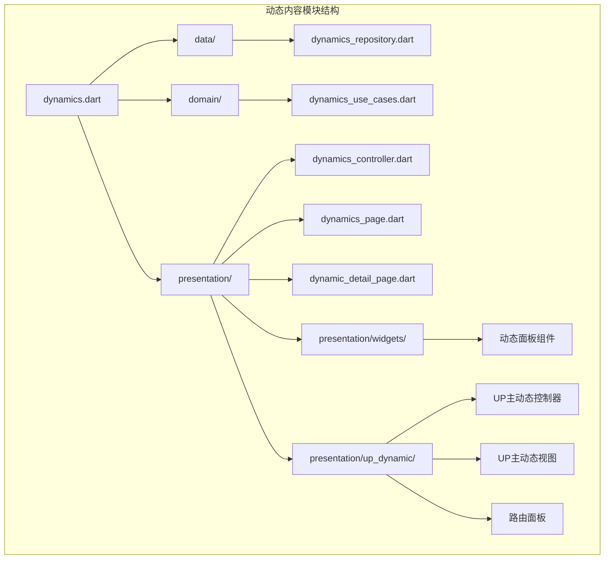
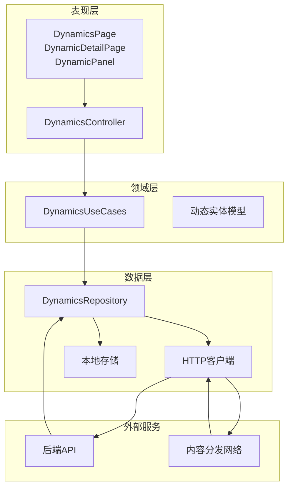
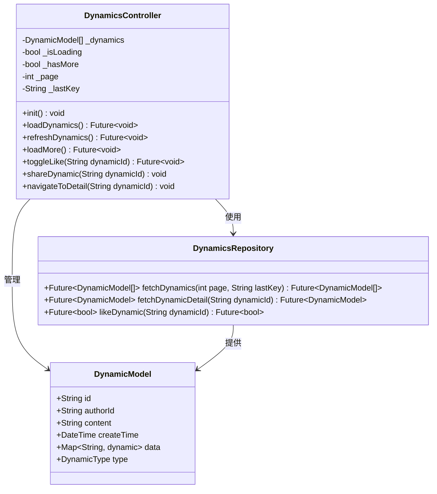
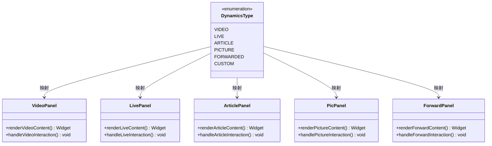
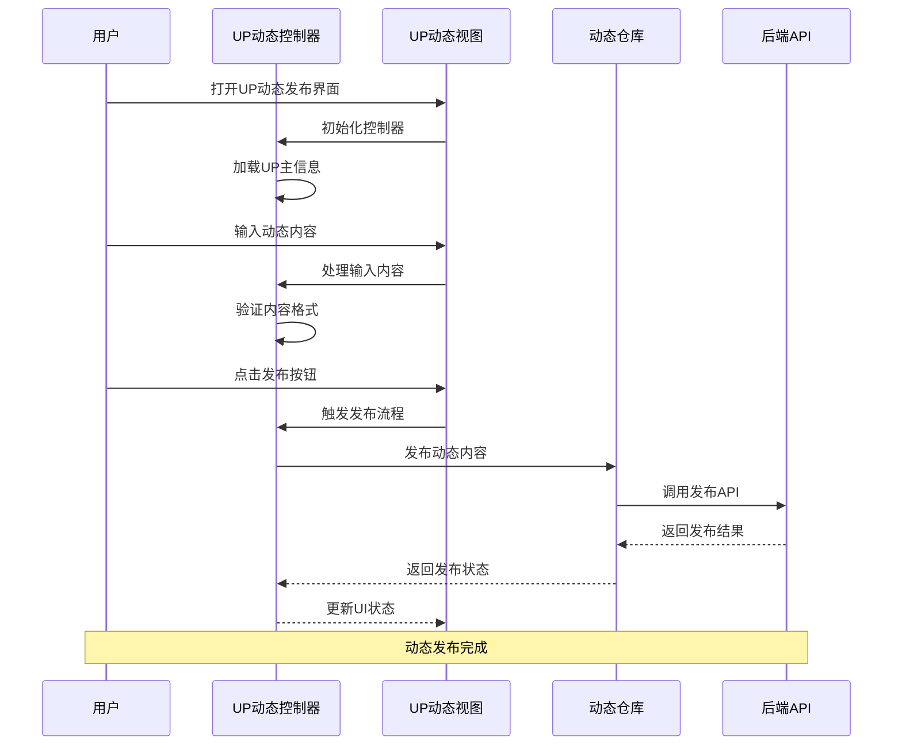
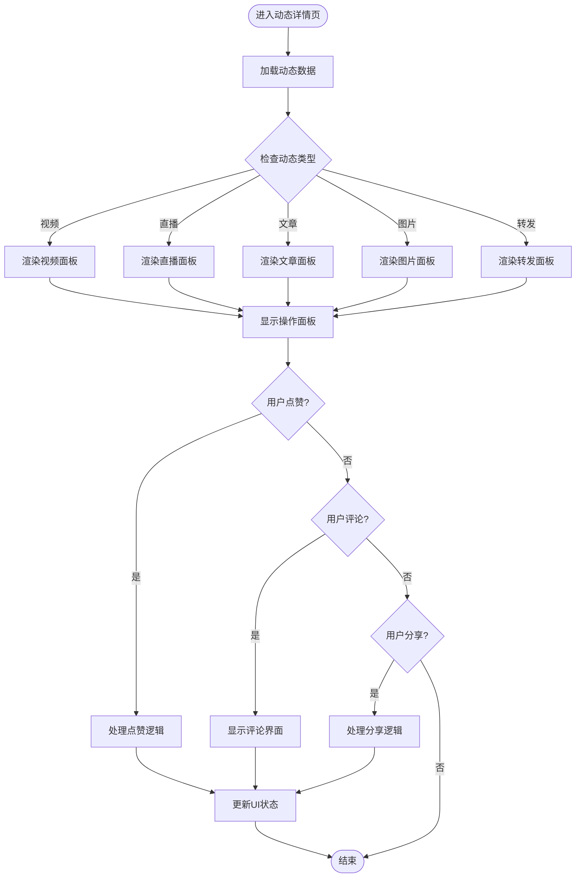
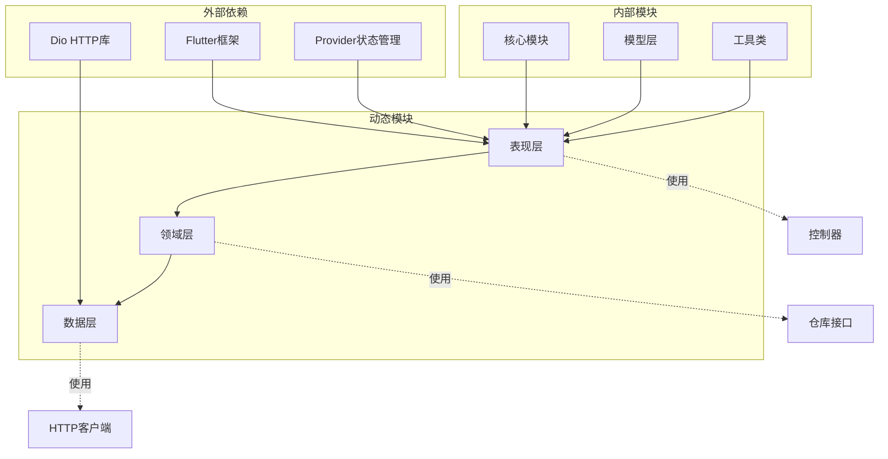

# 动态内容模块

<cite>
**本文档引用的文件**
- [lib/features/dynamics/dynamics.dart](file://lib/features/dynamics/dynamics.dart)
- [lib/features/dynamics/data/dynamics_repository.dart](file://lib/features/dynamics/data/dynamics_repository.dart)
- [lib/features/dynamics/domain/dynamics_use_cases.dart](file://lib/features/dynamics/domain/dynamics_use_cases.dart)
- [lib/features/dynamics/presentation/dynamics_controller.dart](file://lib/features/dynamics/presentation/dynamics_controller.dart)
- [lib/features/dynamics/presentation/dynamics_page.dart](file://lib/features/dynamics/presentation/dynamics_page.dart)
- [lib/features/dynamics/presentation/dynamic_detail_page.dart](file://lib/features/dynamics/presentation/dynamic_detail_page.dart)
- [lib/features/dynamics/presentation/widgets/dynamic_panel.dart](file://lib/features/dynamics/presentation/widgets/dynamic_panel.dart)
- [lib/features/dynamics/presentation/up_dynamic/controller.dart](file://lib/features/dynamics/presentation/up_dynamic/controller.dart)
- [lib/features/dynamics/presentation/up_dynamic/view.dart](file://lib/features/dynamics/presentation/up_dynamic/view.dart)
- [lib/features/dynamics/presentation/up_dynamic/route_panel.dart](file://lib/features/dynamics/presentation/up_dynamic/route_panel.dart)
- [lib/http/dynamics.dart](file://lib/http/dynamics.dart)
- [lib/models/common/dynamics_type.dart](file://lib/models/common/dynamics_type.dart)
</cite>

## 目录
1. [简介](#简介)
2. [项目结构](#项目结构)
3. [核心组件](#核心组件)
4. [架构概览](#架构概览)
5. [详细组件分析](#详细组件分析)
6. [依赖关系分析](#依赖关系分析)
7. [性能考虑](#性能考虑)
8. [故障排除指南](#故障排除指南)
9. [结论](#结论)

## 简介

动态内容模块是Pilipala应用中的一个核心功能模块，主要负责处理和展示用户生成的内容（UGC）动态。该模块支持多种动态类型，包括视频、直播、文章等多媒体内容，并提供了完整的动态内容浏览、交互和管理功能。

该模块采用Clean Architecture设计模式，将数据层、领域层和表现层清晰分离，确保了代码的可维护性和可扩展性。模块支持UP主动态发布、动态详情展示、动态互动等功能，为用户提供了丰富的社交化内容体验。

## 项目结构

动态内容模块位于`lib/features/dynamics/`目录下，采用标准的Clean Architecture分层结构：

**图表来源**
- [lib/features/dynamics/dynamics.dart](file://lib/features/dynamics/dynamics.dart)
- [lib/features/dynamics/data/dynamics_repository.dart](file://lib/features/dynamics/data/dynamics_repository.dart)
- [lib/features/dynamics/domain/dynamics_use_cases.dart](file://lib/features/dynamics/domain/dynamics_use_cases.dart)
- [lib/features/dynamics/presentation/dynamics_controller.dart](file://lib/features/dynamics/presentation/dynamics_controller.dart)
- [lib/features/dynamics/presentation/dynamics_page.dart](file://lib/features/dynamics/presentation/dynamics_page.dart)

**章节来源**
- [lib/features/dynamics/dynamics.dart](file://lib/features/dynamics/dynamics.dart)
- [lib/features/dynamics/data/dynamics_repository.dart](file://lib/features/dynamics/data/dynamics_repository.dart)
- [lib/features/dynamics/domain/dynamics_use_cases.dart](file://lib/features/dynamics/domain/dynamics_use_cases.dart)
- [lib/features/dynamics/presentation/dynamics_controller.dart](file://lib/features/dynamics/presentation/dynamics_controller.dart)
- [lib/features/dynamics/presentation/dynamics_page.dart](file://lib/features/dynamics/presentation/dynamics_page.dart)

## 核心组件

动态内容模块包含以下核心组件：

### 数据层组件
- **DynamicsRepository**: 负责动态内容的数据获取和存储，提供与后端API的交互接口
- **HTTP层**: 处理网络请求和响应，管理API调用和错误处理

### 领域层组件
- **DynamicsUseCases**: 定义业务逻辑用例，封装动态内容的各种操作场景
- **DynamicsType**: 动态内容类型定义，支持多种内容格式

### 表现层组件
- **DynamicsController**: 控制器类，管理动态页面的状态和业务逻辑
- **DynamicsPage**: 主页面组件，展示动态内容列表
- **DynamicDetailPage**: 动态详情页面，显示单个动态的完整信息
- **DynamicPanel**: 动态内容面板组件，用于渲染不同类型的动态内容

**章节来源**
- [lib/features/dynamics/data/dynamics_repository.dart](file://lib/features/dynamics/data/dynamics_repository.dart)
- [lib/features/dynamics/domain/dynamics_use_cases.dart](file://lib/features/dynamics/domain/dynamics_use_cases.dart)
- [lib/features/dynamics/presentation/dynamics_controller.dart](file://lib/features/dynamics/presentation/dynamics_controller.dart)
- [lib/features/dynamics/presentation/dynamics_page.dart](file://lib/features/dynamics/presentation/dynamics_page.dart)
- [lib/features/dynamics/presentation/dynamic_detail_page.dart](file://lib/features/dynamics/presentation/dynamic_detail_page.dart)
- [lib/features/dynamics/presentation/widgets/dynamic_panel.dart](file://lib/features/dynamics/presentation/widgets/dynamic_panel.dart)
- [lib/models/common/dynamics_type.dart](file://lib/models/common/dynamics_type.dart)

## 架构概览

动态内容模块采用Clean Architecture设计模式，实现了关注点分离和依赖倒置原则：

**图表来源**
- [lib/features/dynamics/presentation/dynamics_page.dart](file://lib/features/dynamics/presentation/dynamics_page.dart)
- [lib/features/dynamics/presentation/dynamics_controller.dart](file://lib/features/dynamics/presentation/dynamics_controller.dart)
- [lib/features/dynamics/domain/dynamics_use_cases.dart](file://lib/features/dynamics/domain/dynamics_use_cases.dart)
- [lib/features/dynamics/data/dynamics_repository.dart](file://lib/features/dynamics/data/dynamics_repository.dart)
- [lib/http/dynamics.dart](file://lib/http/dynamics.dart)

该架构的主要特点：
- **依赖倒置**: 表现层不直接依赖具体的数据实现
- **关注点分离**: 每一层都有明确的职责分工
- **可测试性**: 通过接口抽象，便于单元测试和集成测试
- **可扩展性**: 新增功能时只需在相应层次添加实现

## 详细组件分析

### DynamicsController 分析

DynamicsController是动态内容模块的核心控制器，负责管理动态页面的状态和业务逻辑：

**图表来源**
- [lib/features/dynamics/presentation/dynamics_controller.dart](file://lib/features/dynamics/presentation/dynamics_controller.dart)
- [lib/features/dynamics/data/dynamics_repository.dart](file://lib/features/dynamics/data/dynamics_repository.dart)

**章节来源**
- [lib/features/dynamics/presentation/dynamics_controller.dart](file://lib/features/dynamics/presentation/dynamics_controller.dart)

### 动态内容类型系统

动态内容模块支持多种内容类型，通过DynamicsType枚举进行统一管理：

**图表来源**
- [lib/models/common/dynamics_type.dart](file://lib/models/common/dynamics_type.dart)
- [lib/features/dynamics/presentation/widgets/video_panel.dart](file://lib/features/dynamics/presentation/widgets/video_panel.dart)
- [lib/features/dynamics/presentation/widgets/live_panel.dart](file://lib/features/dynamics/presentation/widgets/live_panel.dart)
- [lib/features/dynamics/presentation/widgets/article_panel.dart](file://lib/features/dynamics/presentation/widgets/article_panel.dart)
- [lib/features/dynamics/presentation/widgets/pic_panel.dart](file://lib/features/dynamics/presentation/widgets/pic_panel.dart)
- [lib/features/dynamics/presentation/widgets/forward_panel.dart](file://lib/features/dynamics/presentation/widgets/forward_panel.dart)

### UP主动态功能

UP主动态功能允许内容创作者发布和管理自己的动态内容：

**图表来源**
- [lib/features/dynamics/presentation/up_dynamic/controller.dart](file://lib/features/dynamics/presentation/up_dynamic/controller.dart)
- [lib/features/dynamics/presentation/up_dynamic/view.dart](file://lib/features/dynamics/presentation/up_dynamic/view.dart)
- [lib/features/dynamics/data/dynamics_repository.dart](file://lib/features/dynamics/data/dynamics_repository.dart)

**章节来源**
- [lib/features/dynamics/presentation/up_dynamic/controller.dart](file://lib/features/dynamics/presentation/up_dynamic/controller.dart)
- [lib/features/dynamics/presentation/up_dynamic/view.dart](file://lib/features/dynamics/presentation/up_dynamic/view.dart)
- [lib/features/dynamics/presentation/up_dynamic/route_panel.dart](file://lib/features/dynamics/presentation/up_dynamic/route_panel.dart)

### 动态详情展示流程

动态详情页面提供了完整的动态内容展示和交互功能：

**图表来源**
- [lib/features/dynamics/presentation/dynamic_detail_page.dart](file://lib/features/dynamics/presentation/dynamic_detail_page.dart)
- [lib/features/dynamics/presentation/widgets/dynamic_panel.dart](file://lib/features/dynamics/presentation/widgets/dynamic_panel.dart)

**章节来源**
- [lib/features/dynamics/presentation/dynamic_detail_page.dart](file://lib/features/dynamics/presentation/dynamic_detail_page.dart)
- [lib/features/dynamics/presentation/widgets/dynamic_panel.dart](file://lib/features/dynamics/presentation/widgets/dynamic_panel.dart)

## 依赖关系分析

动态内容模块的依赖关系体现了Clean Architecture的设计原则：

**图表来源**
- [lib/features/dynamics/dynamics.dart](file://lib/features/dynamics/dynamics.dart)
- [lib/http/dynamics.dart](file://lib/http/dynamics.dart)

**章节来源**
- [lib/features/dynamics/dynamics.dart](file://lib/features/dynamics/dynamics.dart)
- [lib/http/dynamics.dart](file://lib/http/dynamics.dart)

## 性能考虑

动态内容模块在设计时充分考虑了性能优化：

### 内存管理
- 使用懒加载机制，只在需要时加载动态内容
- 实现对象池模式，复用已创建的组件实例
- 合理设置缓存策略，平衡内存使用和性能

### 网络优化
- 实现请求去重机制，避免重复网络请求
- 使用分页加载，减少单次数据传输量
- 采用CDN加速，提升静态资源加载速度

### UI渲染优化
- 实现虚拟列表，只渲染可见区域的内容
- 使用异步加载，避免阻塞主线程
- 优化图片加载，支持渐进式显示

## 故障排除指南

### 常见问题及解决方案

**动态内容加载失败**
- 检查网络连接状态
- 验证API接口可用性
- 查看错误日志获取详细信息

**UI渲染异常**
- 确认数据模型字段完整性
- 检查组件状态更新逻辑
- 验证BuildContext有效性

**内存泄漏问题**
- 检查订阅者是否正确取消订阅
- 确认Timer和Stream是否正确释放
- 验证异步任务的生命周期管理

**章节来源**
- [lib/features/dynamics/data/dynamics_repository.dart](file://lib/features/dynamics/data/dynamics_repository.dart)
- [lib/features/dynamics/presentation/dynamics_controller.dart](file://lib/features/dynamics/presentation/dynamics_controller.dart)

## 结论

动态内容模块是Pilipala应用中功能最复杂的模块之一，它成功地实现了内容驱动的社交化体验。通过采用Clean Architecture设计模式，模块具备了良好的可维护性和可扩展性。

模块的主要优势包括：
- 清晰的分层架构，便于理解和维护
- 完整的功能覆盖，支持多种动态类型
- 良好的性能优化，提供流畅的用户体验
- 完善的错误处理机制，确保系统稳定性

未来可以考虑的改进方向：
- 增加更多动态内容类型的支持
- 优化搜索和推荐算法
- 增强实时互动功能
- 改进内容审核机制

该模块为整个应用的用户生成内容生态奠定了坚实的基础，是Pilipala平台内容价值的重要体现。