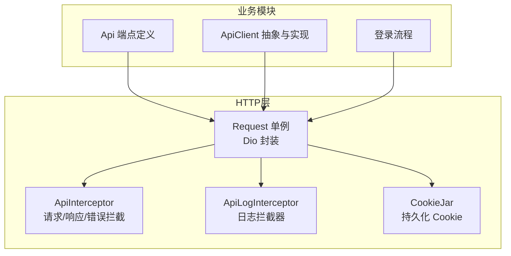
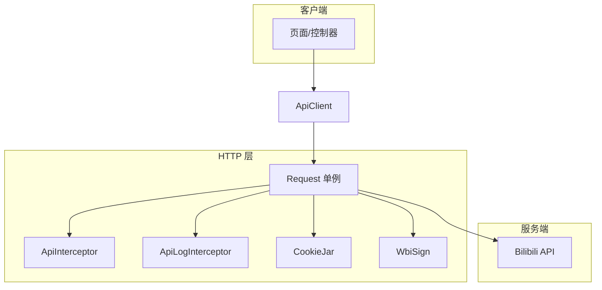
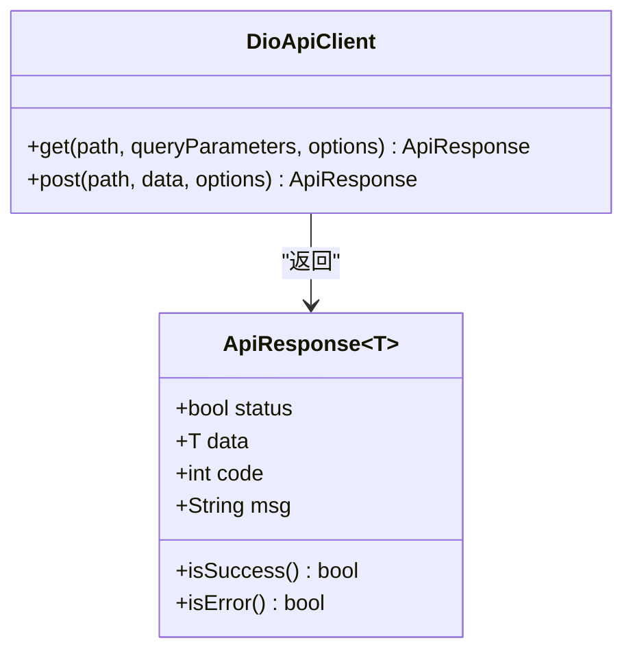
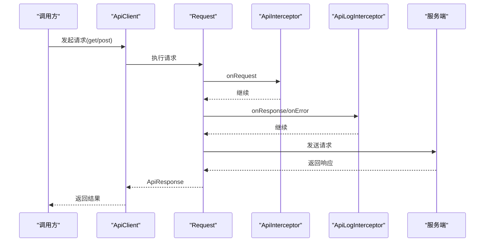
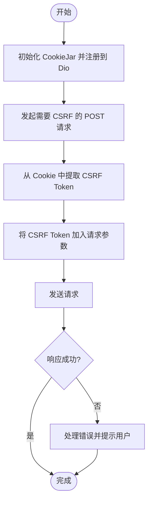
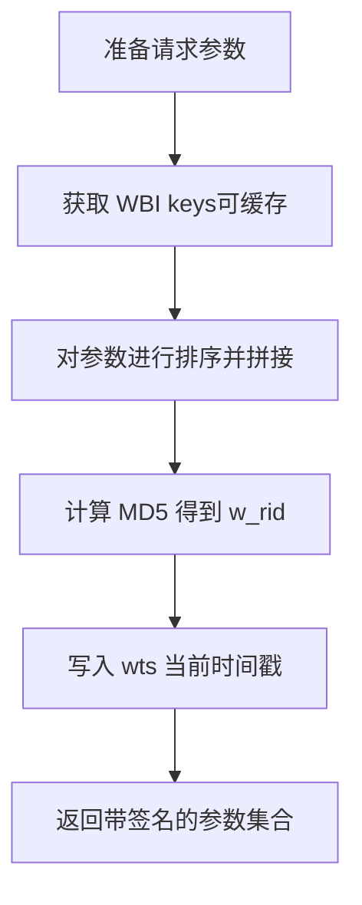
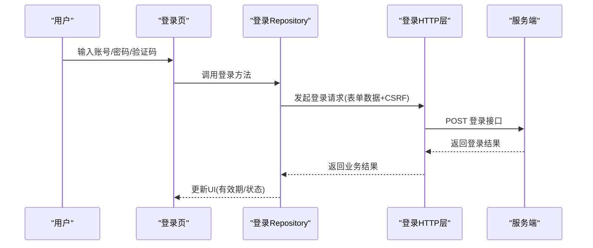
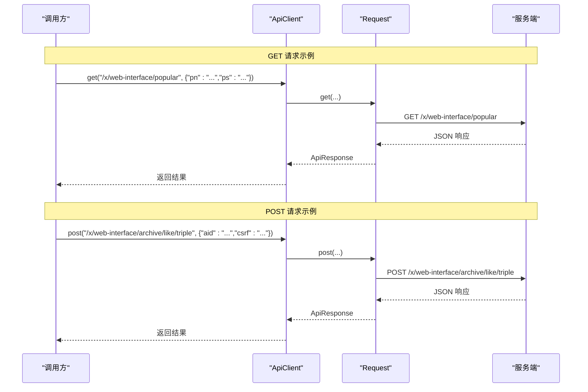
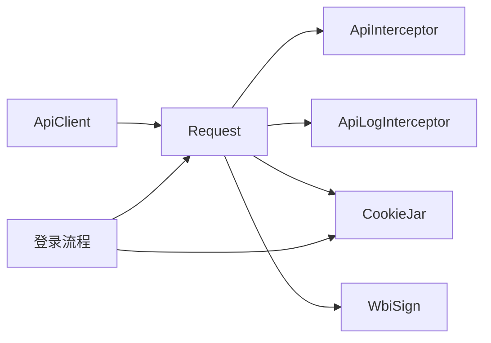

# API接口设计

<cite>
**本文引用的文件**
- [docs/spec/architecture/03-http-layer.md](file://docs/spec/architecture/03-http-layer.md)
- [docs/spec/api/README.md](file://docs/spec/api/README.md)
- [lib/core/network/api_client.dart](file://lib/core/network/api_client.dart)
- [lib/http/api_log_interceptor.dart](file://lib/http/api_log_interceptor.dart)
- [lib/http/init.dart](file://lib/http/init.dart)
- [lib/http/api.dart](file://lib/http/api.dart)
- [lib/http/interceptor.dart](file://lib/http/interceptor.dart)
- [lib/http/constants.dart](file://lib/http/constants.dart)
- [lib/http/login.dart](file://lib/http/login.dart)
- [lib/features/login/data/login_repository.dart](file://lib/features/login/data/login_repository.dart)
- [lib/features/login/presentation/login_page.dart](file://lib/features/login/presentation/login_page.dart)
</cite>

## 目录
1. [引言](#引言)
2. [项目结构](#项目结构)
3. [核心组件](#核心组件)
4. [架构总览](#架构总览)
5. [详细组件分析](#详细组件分析)
6. [依赖关系分析](#依赖关系分析)
7. [性能考量](#性能考量)
8. [故障排查指南](#故障排查指南)
9. [结论](#结论)
10. [附录](#附录)

## 引言
本文件系统性梳理 PiliPala 的 API 接口设计，覆盖 RESTful 设计原则、URL 结构与 HTTP 方法使用、版本管理策略、请求头与响应格式标准化、拦截器实现机制（请求/响应/错误/日志）、认证与 Token 管理、安全考虑、性能优化与最佳实践，并提供具体调用示例与排障指引。内容基于仓库中 HTTP 层规范文档、API 统一封装、拦截器与登录流程等关键文件整理而成。

## 项目结构
- HTTP 层采用 Dio 封装为单例 Request，集中管理 Base URL、超时、拦截器与 Cookie。
- API 端点按模块在 api.dart 中集中定义，便于维护与复用。
- 统一的 ApiResponse 包装类确保所有接口返回一致的数据结构。
- 日志拦截器对请求/响应/错误进行统一打印，便于调试与监控。
- 登录流程通过 HTTP 层发起，结合 Cookie 管理与 CSRF Token 使用。

图表来源
- [docs/spec/architecture/03-http-layer.md:30-72](file://docs/spec/architecture/03-http-layer.md#L30-L72)
- [lib/core/network/api_client.dart:64-74](file://lib/core/network/api_client.dart#L64-L74)
- [lib/http/api_log_interceptor.dart:42-83](file://lib/http/api_log_interceptor.dart#L42-L83)
- [lib/http/interceptor.dart](file://lib/http/interceptor.dart)
- [lib/http/api.dart](file://lib/http/api.dart)

章节来源
- [docs/spec/architecture/03-http-layer.md:3-27](file://docs/spec/architecture/03-http-layer.md#L3-L27)
- [lib/http/init.dart](file://lib/http/init.dart)
- [lib/http/api.dart](file://lib/http/api.dart)

## 核心组件
- Request 单例：封装 Dio，统一配置 Base URL、超时、状态码校验与拦截器。
- ApiClient 抽象与实现：提供类型安全的 get/post 方法，统一返回 ApiResponse 包装对象。
- ApiResponse：标准化响应结构，包含业务状态、HTTP 码、数据与消息。
- 拦截器体系：ApiInterceptor（认证/UA/重定向处理）、ApiLogInterceptor（请求/响应/错误日志）。
- Cookie 管理：PersistCookieJar 持久化 Cookie，自动携带认证信息；CSRF Token 从 Cookie 中提取。
- WBI 签名：对特定 API 参数进行排序、拼接与 MD5 计算，生成 w_rid/wts。
- API 端点：按模块集中定义，支持相对路径与完整 URL。

章节来源
- [lib/core/network/api_client.dart:11-61](file://lib/core/network/api_client.dart#L11-L61)
- [lib/http/api_log_interceptor.dart:42-83](file://lib/http/api_log_interceptor.dart#L42-L83)
- [docs/spec/architecture/03-http-layer.md:201-235](file://docs/spec/architecture/03-http-layer.md#L201-L235)
- [docs/spec/architecture/03-http-layer.md:237-279](file://docs/spec/architecture/03-http-layer.md#L237-L279)
- [lib/http/api.dart](file://lib/http/api.dart)

## 架构总览
下图展示了 HTTP 层与各业务模块之间的交互关系，以及拦截器在请求生命周期中的作用。

图表来源
- [docs/spec/architecture/03-http-layer.md:9-27](file://docs/spec/architecture/03-http-layer.md#L9-L27)
- [lib/http/init.dart](file://lib/http/init.dart)
- [lib/http/api_log_interceptor.dart:42-83](file://lib/http/api_log_interceptor.dart#L42-L83)
- [docs/spec/architecture/03-http-layer.md:264-279](file://docs/spec/architecture/03-http-layer.md#L264-L279)

## 详细组件分析

### 1) 统一响应包装与标准化
- ApiResponse 提供 success/error 工厂方法，统一业务状态与 HTTP 码。
- DioApiClient 在 get/post 中解析后端 Map 响应，转换为 ApiResponse，便于上层判断与展示。
- isSuccess/isError 提供便捷的状态判定。

图表来源
- [lib/core/network/api_client.dart:36-61](file://lib/core/network/api_client.dart#L36-L61)
- [lib/core/network/api_client.dart:64-99](file://lib/core/network/api_client.dart#L64-L99)

章节来源
- [lib/core/network/api_client.dart:11-61](file://lib/core/network/api_client.dart#L11-L61)
- [lib/core/network/api_client.dart:64-99](file://lib/core/network/api_client.dart#L64-L99)

### 2) 拦截器实现机制
- 请求拦截：添加认证信息、User-Agent 等。
- 响应拦截：处理 302 重定向、提取 access_key 等。
- 错误拦截：网络错误提示、状态码处理。
- 日志拦截：统一输出请求/响应/错误信息，支持排除特定 URL。

图表来源
- [lib/http/interceptor.dart](file://lib/http/interceptor.dart)
- [lib/http/api_log_interceptor.dart:42-83](file://lib/http/api_log_interceptor.dart#L42-L83)
- [lib/core/network/api_client.dart:76-99](file://lib/core/network/api_client.dart#L76-L99)

章节来源
- [docs/spec/architecture/03-http-layer.md:199-235](file://docs/spec/architecture/03-http-layer.md#L199-L235)
- [lib/http/api_log_interceptor.dart:42-83](file://lib/http/api_log_interceptor.dart#L42-L83)

### 3) Cookie 管理与 CSRF Token
- 使用 PersistCookieJar 管理 Cookie，自动携带认证信息。
- 从 Cookie 中提取 CSRF Token（如 bili_jct），用于需要 CSRF 校验的 POST 请求。

图表来源
- [docs/spec/architecture/03-http-layer.md:237-262](file://docs/spec/architecture/03-http-layer.md#L237-L262)

章节来源
- [docs/spec/architecture/03-http-layer.md:237-262](file://docs/spec/architecture/03-http-layer.md#L237-L262)

### 4) WBI 签名机制
- 针对部分 API 需要 w_rid 与 wts 参数，通过获取 WBI keys、参数排序拼接与 MD5 计算生成签名。
- 签名逻辑在 WbiSign 中实现，调用方在请求前注入签名参数。

图表来源
- [docs/spec/architecture/03-http-layer.md:264-279](file://docs/spec/architecture/03-http-layer.md#L264-L279)

章节来源
- [docs/spec/architecture/03-http-layer.md:264-279](file://docs/spec/architecture/03-http-layer.md#L264-L279)

### 5) 认证机制与 Token 管理
- Cookie 认证：通过 CookieJar 自动携带登录态 Cookie。
- 登录流程：前端发起登录请求，接收返回数据后更新本地状态；登录页展示有效期倒计时与状态检查按钮。
- Token 管理：登录成功后由后端返回的响应数据承载业务 Token，后续请求通过 Cookie 或参数携带。

图表来源
- [lib/features/login/data/login_repository.dart:48-89](file://lib/features/login/data/login_repository.dart#L48-L89)
- [lib/http/login.dart:206-252](file://lib/http/login.dart#L206-L252)
- [lib/features/login/presentation/login_page.dart:396-440](file://lib/features/login/presentation/login_page.dart#L396-L440)

章节来源
- [docs/spec/api/README.md:61-71](file://docs/spec/api/README.md#L61-L71)
- [lib/http/login.dart:206-252](file://lib/http/login.dart#L206-L252)
- [lib/features/login/data/login_repository.dart:48-89](file://lib/features/login/data/login_repository.dart#L48-L89)
- [lib/features/login/presentation/login_page.dart:396-440](file://lib/features/login/presentation/login_page.dart#L396-L440)

### 6) API 调用示例（GET/POST/PUT/DELETE）
- GET 示例：带分页参数的热门视频列表请求。
- POST 示例：点赞/一键三连等需要 CSRF 的操作。
- PUT/DELETE：与 POST 类似，仅方法不同，均需携带 CSRF Token。

图表来源
- [docs/spec/architecture/03-http-layer.md:162-197](file://docs/spec/architecture/03-http-layer.md#L162-L197)
- [lib/core/network/api_client.dart:76-99](file://lib/core/network/api_client.dart#L76-L99)

章节来源
- [docs/spec/architecture/03-http-layer.md:162-197](file://docs/spec/architecture/03-http-layer.md#L162-L197)
- [lib/http/api.dart](file://lib/http/api.dart)

### 7) 请求头与响应格式标准化
- 请求头：统一添加 UA、Cookie；特殊场景可自定义 UA 或二进制响应类型。
- 响应格式：后端标准格式包含 code/message/ttl/data；HTTP 层统一封装为 status/data/code/msg。

章节来源
- [docs/spec/architecture/03-http-layer.md:188-197](file://docs/spec/architecture/03-http-layer.md#L188-L197)
- [docs/spec/api/README.md:26-48](file://docs/spec/api/README.md#L26-L48)

### 8) 版本管理策略
- Base URL 按模块区分（Web/App/Live/Passport），避免跨域与路径冲突。
- 端点常量集中管理，便于迁移与兼容。

章节来源
- [docs/spec/api/README.md:11-15](file://docs/spec/api/README.md#L11-L15)
- [lib/http/constants.dart](file://lib/http/constants.dart)

## 依赖关系分析
- ApiClient 依赖 Request 单例，间接依赖拦截器与 Cookie 管理。
- 登录流程依赖 HTTP 层与 Cookie 管理，最终更新页面状态。
- WBI 签名与 Cookie 管理共同服务于需要签名与认证的接口。

图表来源
- [lib/core/network/api_client.dart:64-74](file://lib/core/network/api_client.dart#L64-L74)
- [lib/http/init.dart](file://lib/http/init.dart)
- [lib/http/interceptor.dart](file://lib/http/interceptor.dart)
- [lib/http/api_log_interceptor.dart:42-83](file://lib/http/api_log_interceptor.dart#L42-L83)
- [docs/spec/architecture/03-http-layer.md:264-279](file://docs/spec/architecture/03-http-layer.md#L264-L279)

章节来源
- [lib/core/network/api_client.dart:64-74](file://lib/core/network/api_client.dart#L64-L74)
- [lib/http/init.dart](file://lib/http/init.dart)

## 性能考量
- 连接与接收超时统一配置，避免长时间阻塞。
- 使用持久化 Cookie 减少重复登录开销。
- 对频繁请求进行节流与缓存策略（如热门列表分页缓存）。
- 二进制响应（如弹幕）按需启用，避免不必要的内存占用。
- 日志拦截器默认排除高频接口，降低 IO 压力。

章节来源
- [docs/spec/architecture/03-http-layer.md:65-72](file://docs/spec/architecture/03-http-layer.md#L65-L72)
- [lib/http/api_log_interceptor.dart:42-83](file://lib/http/api_log_interceptor.dart#L42-L83)

## 故障排查指南
- 常见错误码与处理：登录态失效、资源不存在、请求频繁、服务器错误等。
- 日志定位：通过 ApiLogInterceptor 输出请求方法、URL、HTTP 码、业务码与消息，快速定位问题。
- Cookie 与 CSRF：确认 Cookie 是否正确持久化，POST 请求是否携带 CSRF Token。
- WBI 签名：若接口报签名错误，检查参数排序、MD5 计算与时间戳有效性。

章节来源
- [docs/spec/api/README.md:50-60](file://docs/spec/api/README.md#L50-L60)
- [lib/http/api_log_interceptor.dart:42-83](file://lib/http/api_log_interceptor.dart#L42-L83)
- [docs/spec/architecture/03-http-layer.md:237-279](file://docs/spec/architecture/03-http-layer.md#L237-L279)

## 结论
PiliPala 的 API 设计以 Dio 单例为核心，配合统一的响应包装、拦截器体系与 Cookie/WBI 管理，实现了清晰的请求生命周期控制与标准化的响应格式。通过模块化的端点定义与严格的错误处理，提升了系统的稳定性与可维护性。建议在生产环境中进一步完善缓存策略、限流与埋点，持续优化用户体验与性能表现。

## 附录
- 端点定义参考：按模块分组的 API 常量集中于 api.dart。
- 登录流程参考：登录页、Repository 与 HTTP 层的协作。
- 日志拦截器参考：请求/响应/错误的统一输出与格式化。

章节来源
- [lib/http/api.dart](file://lib/http/api.dart)
- [lib/features/login/presentation/login_page.dart:396-440](file://lib/features/login/presentation/login_page.dart#L396-L440)
- [lib/features/login/data/login_repository.dart:48-89](file://lib/features/login/data/login_repository.dart#L48-L89)
- [lib/http/api_log_interceptor.dart:42-83](file://lib/http/api_log_interceptor.dart#L42-L83)