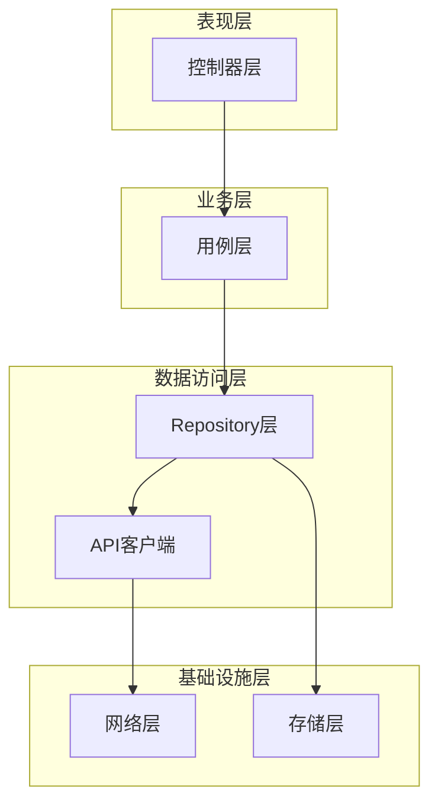
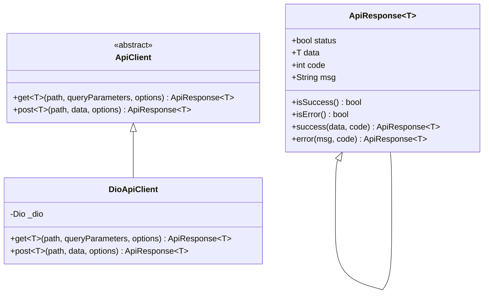
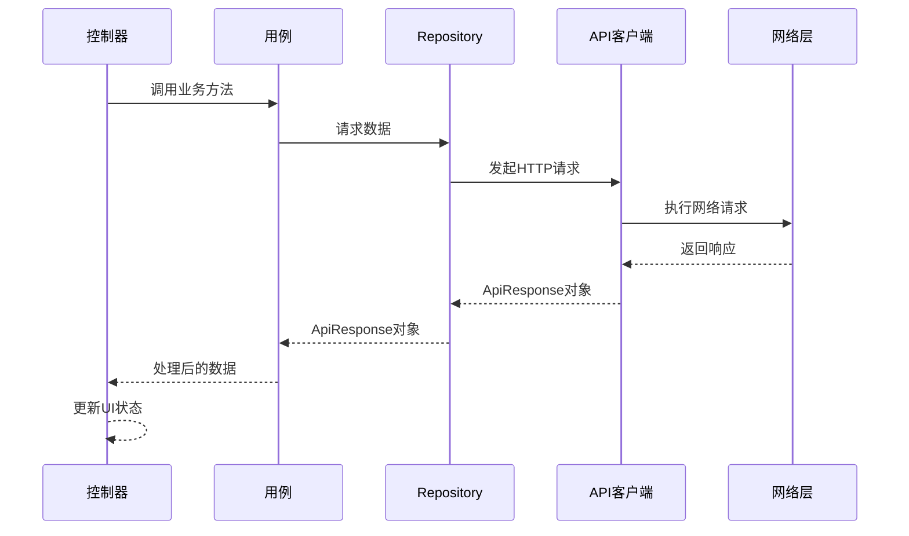
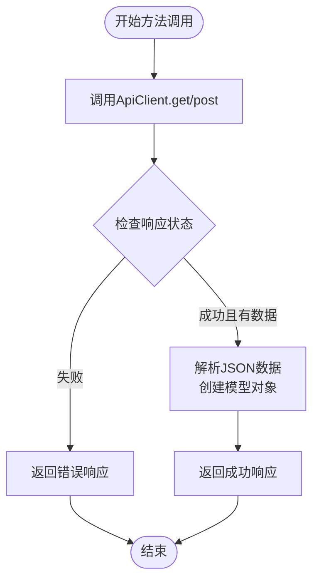
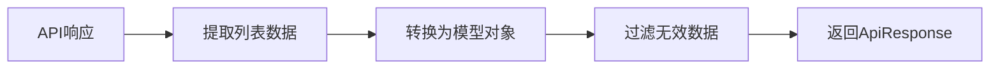
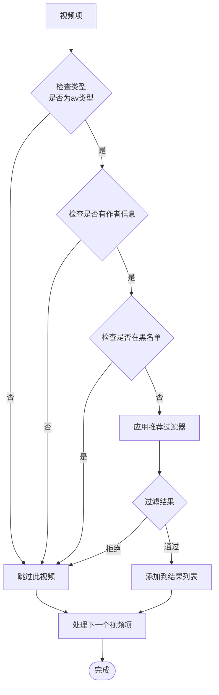
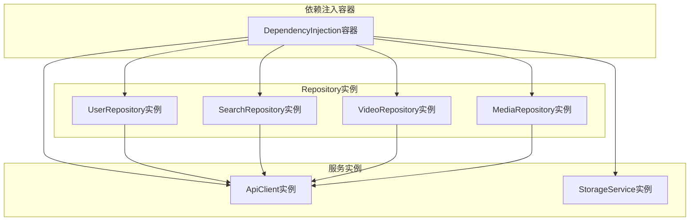
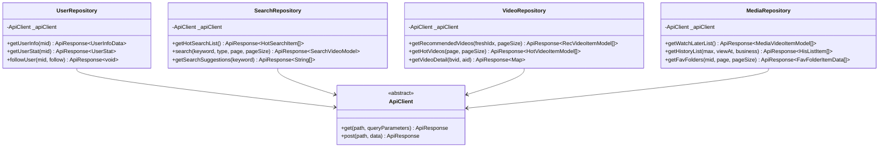

# Repository模式实现

<cite>
**本文档引用的文件**
- [api_client.dart](file://lib/core/network/api_client.dart)
- [dependency_injection.dart](file://lib/core/di/dependency_injection.dart)
- [user_repository.dart](file://lib/features/user/data/user_repository.dart)
- [search_repository.dart](file://lib/features/search/data/search_repository.dart)
- [video_repository.dart](file://lib/features/home/data/video_repository.dart)
- [media_repository.dart](file://lib/features/media/data/media_repository.dart)
- [user_repository_test.dart](file://test/unit/repository/user_repository_test.dart)
- [search_repository_test.dart](file://test/unit/repository/search_repository_test.dart)
- [user_use_cases.dart](file://lib/features/user/domain/user_use_cases.dart)
- [search_use_cases.dart](file://lib/features/search/domain/search_use_cases.dart)
- [bindings.dart](file://lib/router/bindings.dart)
</cite>

## 目录
1. [简介](#简介)
2. [项目结构](#项目结构)
3. [核心组件](#核心组件)
4. [架构概览](#架构概览)
5. [详细组件分析](#详细组件分析)
6. [依赖分析](#依赖分析)
7. [性能考虑](#性能考虑)
8. [故障排除指南](#故障排除指南)
9. [结论](#结论)

## 简介

PiliPala项目采用Repository模式实现了数据访问层的抽象化设计。Repository模式作为领域驱动设计中的重要概念，在本项目中提供了以下核心价值：

- **数据访问抽象**：通过Repository接口隐藏底层数据源的复杂性
- **统一错误处理**：标准化的ApiResponse格式确保一致的错误处理机制
- **可测试性**：清晰的接口定义便于单元测试和模拟对象的创建
- **依赖注入**：结合GetX框架实现松耦合的依赖管理
- **业务逻辑分离**：Repository专注于数据获取，业务逻辑在Use Cases中处理

## 项目结构

PiliPala项目的Repository模式实现遵循清晰的分层架构：

**图表来源**
- [dependency_injection.dart:31-89](file://lib/core/di/dependency_injection.dart#L31-L89)
- [user_repository.dart:15-235](file://lib/features/user/data/user_repository.dart#L15-L235)

**章节来源**
- [dependency_injection.dart:1-90](file://lib/core/di/dependency_injection.dart#L1-L90)
- [user_repository.dart:1-235](file://lib/features/user/data/user_repository.dart#L1-L235)

## 核心组件

### ApiClient抽象层

ApiClient是Repository模式的核心抽象，提供了统一的HTTP请求接口：

**图表来源**
- [api_client.dart:11-151](file://lib/core/network/api_client.dart#L11-L151)

### Repository基类设计

所有Repository类都遵循统一的设计模式：

- **依赖注入**：通过构造函数接收ApiClient实例
- **统一错误处理**：返回ApiResponse<T>格式
- **类型安全**：使用泛型参数确保编译时类型检查
- **一致性**：所有Repository提供相似的方法签名和行为

**章节来源**
- [api_client.dart:25-61](file://lib/core/network/api_client.dart#L25-L61)
- [user_repository.dart:15-235](file://lib/features/user/data/user_repository.dart#L15-L235)

## 架构概览

PiliPala的Repository模式实现展现了清晰的分层架构：

**图表来源**
- [user_repository.dart:23-49](file://lib/features/user/data/user_repository.dart#L23-L49)
- [api_client.dart:76-110](file://lib/core/network/api_client.dart#L76-L110)

## 详细组件分析

### UserRepository实现

UserRepository是用户相关数据操作的核心实现：

#### 核心功能特性

1. **用户信息管理**：获取用户基本信息和统计信息
2. **关注关系处理**：支持用户关注和取消关注操作
3. **收藏夹管理**：获取用户收藏夹及其详细内容
4. **历史记录追踪**：管理观看历史和稍后再看列表
5. **互动数据获取**：获取用户的点赞和投币视频

#### 方法设计模式

所有方法都遵循统一的实现模式：

**图表来源**
- [user_repository.dart:23-35](file://lib/features/user/data/user_repository.dart#L23-L35)
- [user_repository.dart:52-64](file://lib/features/user/data/user_repository.dart#L52-L64)

#### 关键实现细节

- **参数验证**：对必需参数进行验证和过滤
- **数据转换**：使用模型类进行JSON到对象的转换
- **错误处理**：统一的错误响应格式
- **CSRF处理**：POST请求自动处理CSRF令牌

**章节来源**
- [user_repository.dart:15-235](file://lib/features/user/data/user_repository.dart#L15-L235)

### SearchRepository实现

SearchRepository负责搜索相关的数据操作：

#### 主要功能

1. **热门搜索**：获取当前热门搜索关键词
2. **内容搜索**：支持多种类型的内容搜索
3. **搜索建议**：提供实时搜索建议功能

#### 数据处理流程

**图表来源**
- [search_repository.dart:16-29](file://lib/features/search/data/search_repository.dart#L16-L29)
- [search_repository.dart:32-56](file://lib/features/search/data/search_repository.dart#L32-L56)

**章节来源**
- [search_repository.dart:1-75](file://lib/features/search/data/search_repository.dart#L1-L75)

### VideoRepository实现

VideoRepository处理视频相关的核心功能：

#### 特殊功能

1. **推荐算法集成**：内置视频推荐过滤逻辑
2. **多API支持**：同时支持Web和App两种API
3. **黑名单过滤**：基于用户设置的视频过滤机制

#### 推荐过滤流程

**图表来源**
- [video_repository.dart:47-63](file://lib/features/home/data/video_repository.dart#L47-L63)

**章节来源**
- [video_repository.dart:1-182](file://lib/features/home/data/video_repository.dart#L1-L182)

### MediaRepository实现

MediaRepository专注于媒体管理和用户个人内容：

#### 核心功能

1. **稍后再看**：管理用户的视频收藏
2. **观看历史**：跟踪用户的观看记录
3. **收藏夹管理**：提供完整的收藏夹功能

**章节来源**
- [media_repository.dart:1-144](file://lib/features/media/data/media_repository.dart#L1-L144)

## 依赖分析

### 依赖注入架构

PiliPala使用GetX框架实现依赖注入，确保Repository的松耦合设计：

**图表来源**
- [dependency_injection.dart:31-89](file://lib/core/di/dependency_injection.dart#L31-L89)

### 组件间依赖关系

**图表来源**
- [user_repository.dart:16-235](file://lib/features/user/data/user_repository.dart#L16-L235)
- [search_repository.dart:9-75](file://lib/features/search/data/search_repository.dart#L9-L75)
- [video_repository.dart:17-182](file://lib/features/home/data/video_repository.dart#L17-L182)
- [media_repository.dart:10-144](file://lib/features/media/data/media_repository.dart#L10-L144)

**章节来源**
- [dependency_injection.dart:31-89](file://lib/core/di/dependency_injection.dart#L31-L89)

## 性能考虑

### 缓存策略

Repository层实现了多层次的缓存机制：

1. **内存缓存**：短期数据缓存在内存中
2. **持久化存储**：重要数据存储在本地数据库
3. **智能刷新**：根据数据时效性决定是否刷新

### 性能优化技术

- **懒加载**：使用GetX的lazyPut实现延迟初始化
- **批量操作**：支持批量数据获取减少网络请求
- **数据预处理**：在Repository层进行必要的数据转换

## 故障排除指南

### 常见问题及解决方案

#### API响应格式不匹配

**问题描述**：API响应格式与预期不符导致解析失败

**解决方案**：
1. 检查ApiResponse的data字段是否存在
2. 验证JSON数据结构的正确性
3. 实现适当的错误处理逻辑

#### 网络请求超时

**问题描述**：网络请求长时间无响应

**解决方案**：
1. 设置合理的超时时间
2. 实现重试机制
3. 提供用户友好的错误提示

#### CSRF令牌失效

**问题描述**：POST请求因CSRF令牌过期而失败

**解决方案**：
1. 实现CSRF令牌的自动刷新
2. 在请求前检查令牌有效性
3. 提供令牌刷新的回退机制

**章节来源**
- [user_repository_test.dart:1-132](file://test/unit/repository/user_repository_test.dart#L1-L132)
- [search_repository_test.dart:1-148](file://test/unit/repository/search_repository_test.dart#L1-L148)

## 结论

PiliPala项目的Repository模式实现展现了现代Flutter应用的最佳实践：

### 设计优势

1. **清晰的职责分离**：Repository专注于数据访问，业务逻辑在Use Cases中处理
2. **强大的可测试性**：抽象接口使得单元测试变得简单直观
3. **灵活的扩展性**：新的数据源可以通过实现ApiClient接口轻松集成
4. **统一的错误处理**：标准化的ApiResponse格式简化了错误处理逻辑

### 技术亮点

- **类型安全**：泛型参数确保编译时类型检查
- **依赖注入**：GetX框架实现松耦合的依赖管理
- **错误处理**：统一的错误响应格式
- **测试友好**：清晰的接口设计便于单元测试

### 改进建议

1. **增加缓存层**：可以考虑添加专门的缓存Repository
2. **异步处理**：实现更完善的异步数据同步机制
3. **监控指标**：添加数据访问性能监控
4. **配置管理**：实现Repository级别的配置管理

这个Repository模式实现为PiliPala项目提供了坚实的数据访问基础，为后续的功能扩展和维护奠定了良好的技术基础。