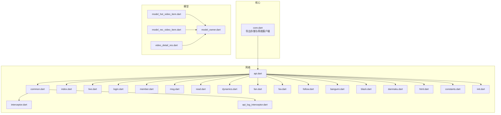
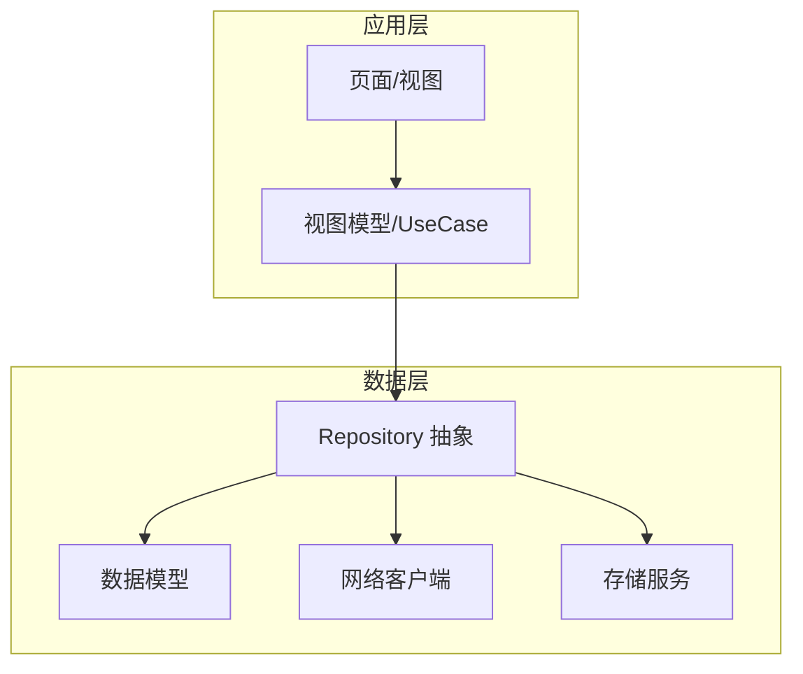
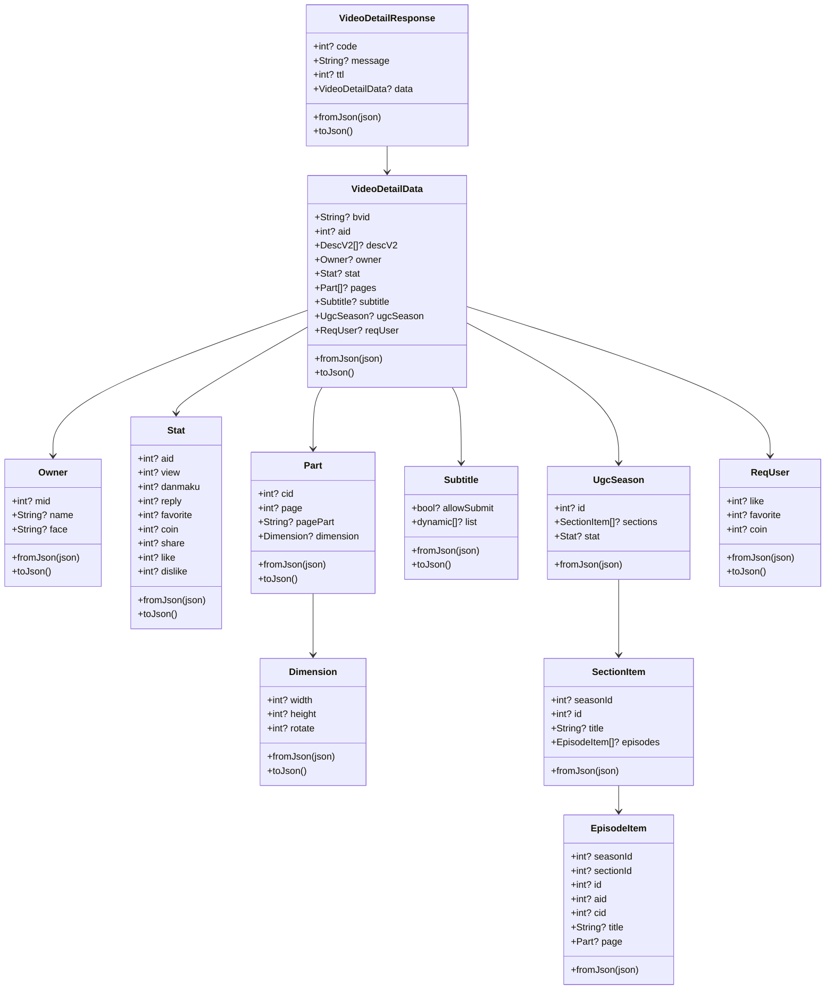
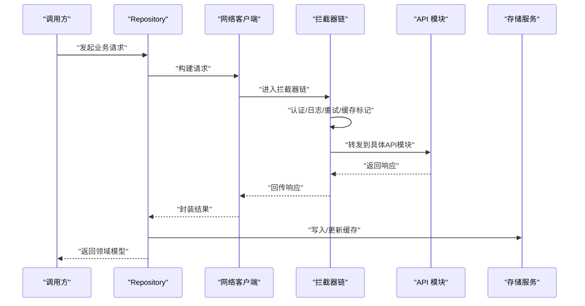
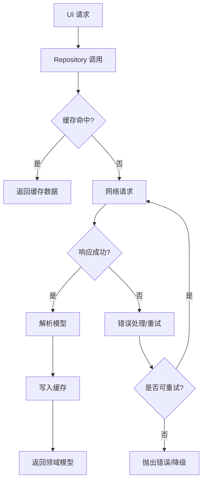
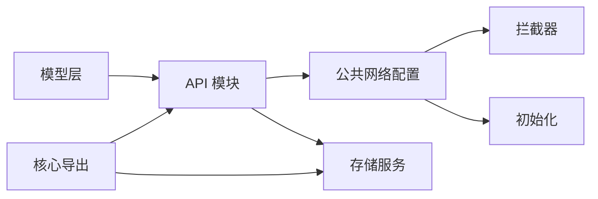

# 数据层设计

<cite>
**本文引用的文件**
- [lib/core/core.dart](file://lib/core/core.dart)
- [lib/models/model_hot_video_item.dart](file://lib/models/model_hot_video_item.dart)
- [lib/models/model_rec_video_item.dart](file://lib/models/model_rec_video_item.dart)
- [lib/models/model_owner.dart](file://lib/models/model_owner.dart)
- [lib/models/video_detail_res.dart](file://lib/models/video_detail_res.dart)
- [lib/http/api.dart](file://lib/http/api.dart)
- [lib/http/common.dart](file://lib/http/common.dart)
- [lib/http/interceptor.dart](file://lib/http/interceptor.dart)
- [lib/http/api_log_interceptor.dart](file://lib/http/api_log_interceptor.dart)
- [lib/http/index.dart](file://lib/http/index.dart)
- [lib/http/live.dart](file://lib/http/live.dart)
- [lib/http/login.dart](file://lib/http/login.dart)
- [lib/http/member.dart](file://lib/http/member.dart)
- [lib/http/msg.dart](file://lib/http/msg.dart)
- [lib/http/read.dart](file://lib/http/read.dart)
- [lib/http/dynamics.dart](file://lib/http/dynamics.dart)
- [lib/http/fan.dart](file://lib/http/fan.dart)
- [lib/http/fav.dart](file://lib/http/fav.dart)
- [lib/http/follow.dart](file://lib/http/follow.dart)
- [lib/http/bangumi.dart](file://lib/http/bangumi.dart)
- [lib/http/black.dart](file://lib/http/black.dart)
- [lib/http/danmaku.dart](file://lib/http/danmaku.dart)
- [lib/http/html.dart](file://lib/http/html.dart)
- [lib/http/constants.dart](file://lib/http/constants.dart)
- [lib/http/init.dart](file://lib/http/init.dart)
- [test/unit/repository/search_repository_test.dart](file://test/unit/repository/search_repository_test.dart)
- [test/unit/repository/user_repository_test.dart](file://test/unit/repository/user_repository_test.dart)
- [test/unit/repository/video_repository_test.dart](file://test/unit/repository/video_repository_test.dart)
</cite>

## 目录
1. [引言](#引言)
2. [项目结构](#项目结构)
3. [核心组件](#核心组件)
4. [架构总览](#架构总览)
5. [详细组件分析](#详细组件分析)
6. [依赖分析](#依赖分析)
7. [性能考虑](#性能考虑)
8. [故障排查指南](#故障排查指南)
9. [结论](#结论)
10. [附录](#附录)

## 引言
本文件系统性梳理 PiliPala 的数据层设计，重点围绕 Repository 模式、数据访问层抽象、API 接口设计与数据模型定义展开；同时覆盖网络请求处理、缓存策略、错误处理与重试机制，并提供数据流图、架构分层图与依赖关系图。文档还解释 Model 类的设计原则、序列化/反序列化与数据验证策略，以及数据层的扩展性、性能优化与安全考量。

## 项目结构
数据层主要由以下模块构成：
- 核心导出：通过核心模块统一导出存储服务与网络客户端，便于上层按需注入与替换。
- 模型层：定义视频、用户、统计等数据模型及其序列化/反序列化逻辑。
- 网络层：按功能拆分 API 模块（如直播、登录、动态、收藏等），统一通过拦截器与公共配置进行网络治理。
- 测试层：针对各 Repository 提供单元测试，验证数据流与边界条件。

**图表来源**
- [lib/core/core.dart:1-12](file://lib/core/core.dart#L1-L12)
- [lib/http/api.dart](file://lib/http/api.dart)
- [lib/http/common.dart](file://lib/http/common.dart)
- [lib/http/interceptor.dart](file://lib/http/interceptor.dart)
- [lib/http/api_log_interceptor.dart](file://lib/http/api_log_interceptor.dart)
- [lib/http/index.dart](file://lib/http/index.dart)
- [lib/http/live.dart](file://lib/http/live.dart)
- [lib/http/login.dart](file://lib/http/login.dart)
- [lib/http/member.dart](file://lib/http/member.dart)
- [lib/http/msg.dart](file://lib/http/msg.dart)
- [lib/http/read.dart](file://lib/http/read.dart)
- [lib/http/dynamics.dart](file://lib/http/dynamics.dart)
- [lib/http/fan.dart](file://lib/http/fan.dart)
- [lib/http/fav.dart](file://lib/http/fav.dart)
- [lib/http/follow.dart](file://lib/http/follow.dart)
- [lib/http/bangumi.dart](file://lib/http/bangumi.dart)
- [lib/http/black.dart](file://lib/http/black.dart)
- [lib/http/danmaku.dart](file://lib/http/danmaku.dart)
- [lib/http/html.dart](file://lib/http/html.dart)
- [lib/http/constants.dart](file://lib/http/constants.dart)
- [lib/http/init.dart](file://lib/http/init.dart)
- [lib/models/model_hot_video_item.dart:1-168](file://lib/models/model_hot_video_item.dart#L1-L168)
- [lib/models/model_rec_video_item.dart:1-75](file://lib/models/model_rec_video_item.dart#L1-L75)
- [lib/models/model_owner.dart:1-18](file://lib/models/model_owner.dart#L1-L18)
- [lib/models/video_detail_res.dart:1-732](file://lib/models/video_detail_res.dart#L1-L732)

**章节来源**
- [lib/core/core.dart:1-12](file://lib/core/core.dart#L1-L12)

## 核心组件
- 存储服务：通过核心模块导出，为数据层提供持久化能力（如本地缓存、偏好设置等）。
- 网络客户端：统一初始化与配置，集中处理超时、重试、日志与认证等横切关注点。
- 模型体系：围绕视频详情、推荐/热门视频项、作者信息等构建，支持 JSON 序列化/反序列化与嵌套对象映射。
- API 模块：按业务域划分，每个模块封装一组相关接口，便于维护与演进。

**章节来源**
- [lib/core/core.dart:1-12](file://lib/core/core.dart#L1-L12)
- [lib/http/api.dart](file://lib/http/api.dart)
- [lib/http/common.dart](file://lib/http/common.dart)
- [lib/models/video_detail_res.dart:1-732](file://lib/models/video_detail_res.dart#L1-L732)

## 架构总览
数据层采用“模型-网络-存储”三层协作：
- 模型层负责数据结构与序列化，确保与后端响应一致且可扩展。
- 网络层负责请求构建、拦截与错误处理，提供统一的 API 调用入口。
- 存储层负责数据持久化与缓存策略，提升性能与离线体验。

[此图为概念性架构示意，不直接映射具体源码文件，故无图表来源]

## 详细组件分析

### 模型层设计与序列化/反序列化
- 设计原则
  - 命名与字段对齐后端响应，避免隐式转换导致的歧义。
  - 嵌套对象独立建模，支持递归序列化/反序列化。
  - 可选字段与默认值处理，保证解析健壮性。
  - 针对复杂字段（如列表、字典、JSON 字符串）提供 toRawJson/fromRawJson 辅助方法，便于跨层传递与展示。
- 关键模型
  - 视频详情响应：顶层包含状态码、消息与数据体，数据体进一步拆分为基础信息、统计、分页、字幕、荣誉等子结构。
  - 推荐/热门视频项：统一字段集合，兼容不同接口返回差异。
  - 作者信息：最小必要字段，便于复用。
- 序列化/反序列化
  - 所有模型均提供 fromJson 与 toJson 方法，部分复杂模型提供 toRawJson/fromRawJson 以适配特殊字段。
  - 列表与嵌套对象通过工厂构造与映射函数完成批量转换。
- 数据验证
  - 在模型层进行基本类型校验与空值处理，减少上层分支判断。
  - 对于可选字段，提供默认值或空对象，避免空指针异常。

**图表来源**
- [lib/models/video_detail_res.dart:1-732](file://lib/models/video_detail_res.dart#L1-L732)

**章节来源**
- [lib/models/video_detail_res.dart:1-732](file://lib/models/video_detail_res.dart#L1-L732)
- [lib/models/model_hot_video_item.dart:1-168](file://lib/models/model_hot_video_item.dart#L1-L168)
- [lib/models/model_rec_video_item.dart:1-75](file://lib/models/model_rec_video_item.dart#L1-L75)
- [lib/models/model_owner.dart:1-18](file://lib/models/model_owner.dart#L1-L18)

### 网络层与API接口设计
- 统一初始化与配置
  - 通过初始化模块集中配置客户端、超时、拦截器与日志记录。
- 拦截器体系
  - 认证拦截器：统一添加鉴权头或刷新令牌。
  - 日志拦截器：输出请求/响应摘要，便于调试与审计。
  - 公共拦截器：统一处理通用逻辑（如重试、缓存标记、错误码映射）。
- API 模块划分
  - 按业务域拆分模块（直播、登录、会员、消息、动态、番剧、黑名单、弹幕、HTML 页面等），每个模块暴露一组接口方法。
  - 模块内部统一使用公共网络客户端与拦截器，降低重复与耦合。
- 错误处理与重试
  - 在拦截器或调用层对常见网络错误与业务错误进行分类处理。
  - 对瞬时错误（如网络抖动、超时）支持指数退避重试，避免雪崩效应。
- 安全考虑
  - 敏感参数不落日志，必要时进行脱敏。
  - 使用 HTTPS 与证书固定策略，防止中间人攻击。
  - 对鉴权信息进行加密存储与传输。

**图表来源**
- [lib/http/init.dart](file://lib/http/init.dart)
- [lib/http/common.dart](file://lib/http/common.dart)
- [lib/http/interceptor.dart](file://lib/http/interceptor.dart)
- [lib/http/api_log_interceptor.dart](file://lib/http/api_log_interceptor.dart)
- [lib/http/api.dart](file://lib/http/api.dart)
- [lib/http/live.dart](file://lib/http/live.dart)
- [lib/http/login.dart](file://lib/http/login.dart)
- [lib/http/member.dart](file://lib/http/member.dart)
- [lib/http/msg.dart](file://lib/http/msg.dart)
- [lib/http/read.dart](file://lib/http/read.dart)
- [lib/http/dynamics.dart](file://lib/http/dynamics.dart)
- [lib/http/fan.dart](file://lib/http/fan.dart)
- [lib/http/fav.dart](file://lib/http/fav.dart)
- [lib/http/follow.dart](file://lib/http/follow.dart)
- [lib/http/bangumi.dart](file://lib/http/bangumi.dart)
- [lib/http/black.dart](file://lib/http/black.dart)
- [lib/http/danmaku.dart](file://lib/http/danmaku.dart)
- [lib/http/html.dart](file://lib/http/html.dart)

**章节来源**
- [lib/http/init.dart](file://lib/http/init.dart)
- [lib/http/common.dart](file://lib/http/common.dart)
- [lib/http/interceptor.dart](file://lib/http/interceptor.dart)
- [lib/http/api_log_interceptor.dart](file://lib/http/api_log_interceptor.dart)
- [lib/http/api.dart](file://lib/http/api.dart)

### 缓存策略
- 多级缓存
  - 内存缓存：短期高频访问数据，如当前页面列表。
  - 磁盘缓存：长期稳定数据，如用户信息、静态配置。
- 缓存键与失效
  - 以请求参数与URL组合生成唯一键，支持版本化与失效时间控制。
  - 对易变数据设置短 TTL，对稳定数据设置长 TTL 或永久缓存。
- 写入策略
  - 成功响应写入缓存，失败不覆盖旧值，保持一致性。
  - 并发写入时采用互斥或合并策略，避免脏写。
- 读取策略
  - 先命中缓存再请求网络，网络成功后更新缓存。
  - 对离线场景优先返回缓存，后台异步刷新。

[本节为通用策略说明，未直接分析具体源码文件，故无章节来源]

### 错误处理与重试机制
- 错误分类
  - 网络错误：连接超时、DNS 解析失败、协议错误等。
  - 业务错误：后端返回错误码、参数校验失败、权限不足等。
  - 解析错误：JSON 结构变更、字段缺失或类型不匹配。
- 重试策略
  - 对瞬时网络错误与 5xx 服务器错误进行指数退避重试，最大重试次数与上限时间可控。
  - 对 4xx 客户端错误不重试，直接上抛。
- 上报与降级
  - 将错误信息与上下文埋点上报，辅助定位问题。
  - 在极端情况下启用降级策略（如只读缓存、简化数据）保障可用性。

[本节为通用策略说明，未直接分析具体源码文件，故无章节来源]

### 数据流图

[此图为概念性数据流示意，不直接映射具体源码文件，故无图表来源]

## 依赖分析
- 模块内聚与解耦
  - 模型层与网络层通过清晰的接口隔离，便于替换与测试。
  - API 模块按业务域划分，降低耦合度，提高可维护性。
- 外部依赖
  - 网络库与 JSON 解析库作为基础设施，集中管理版本与配置。
  - 存储服务抽象化，支持多种实现（内存、磁盘、加密存储）。
- 循环依赖
  - 通过模块导出与分层设计避免循环导入，保持单向依赖。

**图表来源**
- [lib/core/core.dart:1-12](file://lib/core/core.dart#L1-L12)
- [lib/http/api.dart](file://lib/http/api.dart)
- [lib/http/common.dart](file://lib/http/common.dart)
- [lib/http/interceptor.dart](file://lib/http/interceptor.dart)
- [lib/http/init.dart](file://lib/http/init.dart)

**章节来源**
- [lib/core/core.dart:1-12](file://lib/core/core.dart#L1-L12)
- [lib/http/api.dart](file://lib/http/api.dart)
- [lib/http/common.dart](file://lib/http/common.dart)

## 性能考虑
- 网络优化
  - 连接池与复用，减少握手开销。
  - 压缩传输（Gzip/Br），降低带宽占用。
  - 分片加载与懒加载，提升首屏与滚动性能。
- 序列化优化
  - 避免不必要的深拷贝，使用不可变对象减少 GC 压力。
  - 对大列表采用流式解析，降低内存峰值。
- 缓存优化
  - 合理设置 TTL 与失效策略，平衡新鲜度与性能。
  - 使用多级缓存与预热策略，缩短冷启动时间。
- UI 协同
  - 在 UI 层对数据进行二次格式化，避免模型层承担过多展示逻辑。

[本节为通用性能建议，未直接分析具体源码文件，故无章节来源]

## 故障排查指南
- 常见问题定位
  - 网络层：检查拦截器日志与响应状态，确认鉴权头与超时配置。
  - 模型层：核对后端字段变更，确保 fromJson 映射完整。
  - 缓存层：验证缓存键生成规则与失效时间，排查并发写入问题。
- 单元测试
  - 针对 Repository 的测试用例覆盖正常路径、错误路径与边界条件，确保数据流稳定。
  - 示例测试文件：
    - [search_repository_test.dart](file://test/unit/repository/search_repository_test.dart)
    - [user_repository_test.dart](file://test/unit/repository/user_repository_test.dart)
    - [video_repository_test.dart](file://test/unit/repository/video_repository_test.dart)

**章节来源**
- [test/unit/repository/search_repository_test.dart](file://test/unit/repository/search_repository_test.dart)
- [test/unit/repository/user_repository_test.dart](file://test/unit/repository/user_repository_test.dart)
- [test/unit/repository/video_repository_test.dart](file://test/unit/repository/video_repository_test.dart)

## 结论
PiliPala 的数据层以 Repository 模式为核心，结合清晰的模型体系、统一的网络配置与拦截器链路，实现了高内聚、低耦合的数据访问层。通过多级缓存、完善的错误处理与重试机制，兼顾了性能与可靠性。未来可在以下方面持续演进：
- 进一步抽象存储服务，支持插件化与多后端切换。
- 引入更细粒度的缓存失效策略与增量更新。
- 加强安全与合规（如数据脱敏、传输加密、审计日志）。

[本节为总结性内容，未直接分析具体源码文件，故无章节来源]

## 附录
- 关键文件索引
  - 核心导出：[core.dart](file://lib/core/core.dart)
  - 模型定义：[video_detail_res.dart](file://lib/models/video_detail_res.dart), [model_hot_video_item.dart](file://lib/models/model_hot_video_item.dart), [model_rec_video_item.dart](file://lib/models/model_rec_video_item.dart), [model_owner.dart](file://lib/models/model_owner.dart)
  - 网络配置：[api.dart](file://lib/http/api.dart), [common.dart](file://lib/http/common.dart), [interceptor.dart](file://lib/http/interceptor.dart), [api_log_interceptor.dart](file://lib/http/api_log_interceptor.dart), [init.dart](file://lib/http/init.dart)
  - 业务模块：[index.dart](file://lib/http/index.dart), [live.dart](file://lib/http/live.dart), [login.dart](file://lib/http/login.dart), [member.dart](file://lib/http/member.dart), [msg.dart](file://lib/http/msg.dart), [read.dart](file://lib/http/read.dart), [dynamics.dart](file://lib/http/dynamics.dart), [fan.dart](file://lib/http/fan.dart), [fav.dart](file://lib/http/fav.dart), [follow.dart](file://lib/http/follow.dart), [bangumi.dart](file://lib/http/bangumi.dart), [black.dart](file://lib/http/black.dart), [danmaku.dart](file://lib/http/danmaku.dart), [html.dart](file://lib/http/html.dart), [constants.dart](file://lib/http/constants.dart)

[本节为补充索引，未直接分析具体源码文件，故无章节来源]