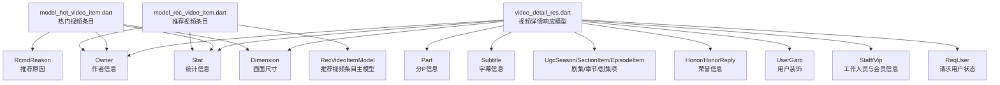
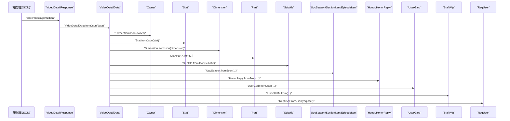
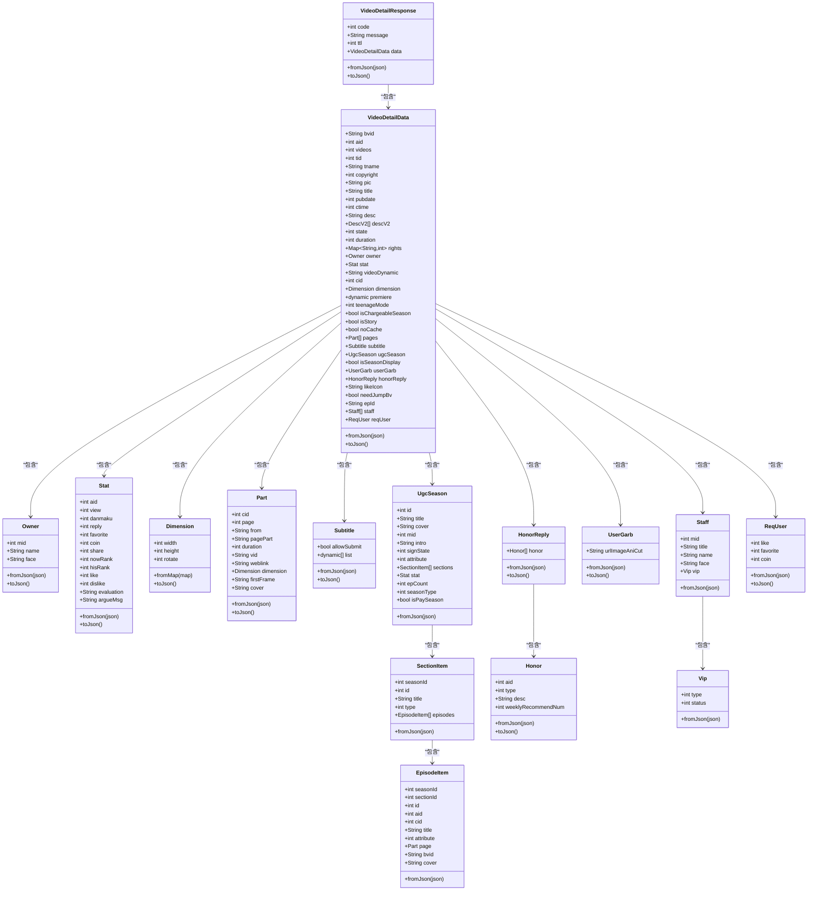

# 数据模型定义

<cite>
**本文引用的文件**
- [lib/models/model_hot_video_item.dart](file://lib/models/model_hot_video_item.dart)
- [lib/models/model_rec_video_item.dart](file://lib/models/model_rec_video_item.dart)
- [lib/models/model_owner.dart](file://lib/models/model_owner.dart)
- [lib/models/video_detail_res.dart](file://lib/models/video_detail_res.dart)
</cite>

## 目录
1. [引言](#引言)
2. [项目结构](#项目结构)
3. [核心组件](#核心组件)
4. [架构总览](#架构总览)
5. [详细组件分析](#详细组件分析)
6. [依赖分析](#依赖分析)
7. [性能考虑](#性能考虑)
8. [故障排查指南](#故障排查指南)
9. [结论](#结论)
10. [附录](#附录)

## 引言
本文件系统性梳理 PiliPala 的数据模型定义与实现，重点覆盖以下方面：
- 模型设计原则：可序列化、可反序列化、字段命名与 JSON 映射、默认值策略、可空性与兼容性。
- 字段定义与类型约束：基础类型、嵌套对象、数组、可选字段与别名属性。
- 序列化/反序列化机制：fromJson/toJson 的映射关系、数组与嵌套对象的递归处理。
- 具体模型示例：用户模型、视频模型、直播模型、动态模型的结构与用途。
- 数据验证与完整性：空值处理、默认值、类型校验与边界条件。
- 扩展与版本兼容：向后兼容、字段弃用、别名与兼容性适配。

## 项目结构
本仓库的数据模型主要位于 lib/models 目录，围绕“视频详情”“推荐/热门视频条目”“作者信息”等核心领域构建。下图展示与本文相关的核心模型文件及其关系：

图表来源
- [lib/models/video_detail_res.dart:34-218](file://lib/models/video_detail_res.dart#L34-L218)
- [lib/models/model_hot_video_item.dart:3-90](file://lib/models/model_hot_video_item.dart#L3-L90)
- [lib/models/model_rec_video_item.dart:3-52](file://lib/models/model_rec_video_item.dart#L3-L52)

章节来源
- [lib/models/video_detail_res.dart:1-732](file://lib/models/video_detail_res.dart#L1-L732)
- [lib/models/model_hot_video_item.dart:1-168](file://lib/models/model_hot_video_item.dart#L1-L168)
- [lib/models/model_rec_video_item.dart:1-75](file://lib/models/model_rec_video_item.dart#L1-L75)
- [lib/models/model_owner.dart:1-18](file://lib/models/model_owner.dart#L1-L18)

## 核心组件
本节对关键模型进行概览式说明，涵盖字段语义、类型与默认值策略，并指出 JSON 映射关系与兼容性处理点。

- 视频详情响应模型（VideoDetailResponse）
  - 负责承载服务端返回的整体结构，包含状态码、消息与数据主体。
  - 数据主体 VideoDetailData 提供完整的视频元数据、统计、分P、字幕、剧集、荣誉、用户装饰、工作人员与请求用户状态等。
  - 关键点：data 字段存在性判断；数组与嵌套对象的空列表初始化；URL 解析提取 epId 的兼容处理。

- 热门视频条目模型（HotVideoItemModel）
  - 表示推荐/热门流中的单个视频条目，包含基础元信息、作者、统计、尺寸、推荐原因等。
  - 关键点：JSON 键名映射（如 middion_id、short_link_v2、first_frame 等）；可选字段与空值安全；推荐原因 RcmdReason 的条件解析。

- 推荐视频条目模型（RecVideoItemModel）
  - 用于推荐卡片或列表展示，提供简洁字段集合与兼容性别名（如 aid 对应 id）。
  - 关键点：默认值策略（如字符串字段默认空串、数值字段默认 -1）；is_followed 的默认值；rcmd_reason 的内容提取。

- 作者信息模型（Owner）
  - 最小化作者信息，包含 mid、name、face。
  - 关键点：标准的 JSON 映射与空值处理。

- 统计信息模型（Stat）
  - 包含播放、弹幕、回复、收藏、投币、分享、当前/历史排名、点赞/不喜欢、评价与争议信息等。
  - 关键点：字段命名与语义清晰；部分字段在视图层做格式化处理，避免在模型层过度转换。

- 尺寸模型（Dimension）
  - 宽、高、旋转角度，支持 fromMap 与 toMap。

- 分P模型（Part）
  - 描述多分P视频的每个片段，包含 cid、page、来源、标题、时长、链接、首帧、封面等。
  - 关键点：first_frame 与 cover 的默认空串处理。

- 剧集/章节/剧集项（UgcSeason/SectionItem/EpisodeItem）
  - 支持剧集结构化展示，包含章节列表与剧集项的分P信息。

- 荣誉信息（Honor/HonorReply）
  - 展示视频荣誉与相关统计。

- 用户装饰（UserGarb）
  - 用户头像动画裁剪资源。

- 工作人员与会员（Staff/Vip）
  - 工作人员信息与会员状态。

- 请求用户状态（ReqUser）
  - 当前登录用户对视频的操作状态（点赞、收藏、投币）。

章节来源
- [lib/models/video_detail_res.dart:3-32](file://lib/models/video_detail_res.dart#L3-L32)
- [lib/models/video_detail_res.dart:34-218](file://lib/models/video_detail_res.dart#L34-L218)
- [lib/models/model_hot_video_item.dart:3-90](file://lib/models/model_hot_video_item.dart#L3-L90)
- [lib/models/model_rec_video_item.dart:3-52](file://lib/models/model_rec_video_item.dart#L3-L52)
- [lib/models/model_owner.dart:1-18](file://lib/models/model_owner.dart#L1-L18)

## 架构总览
下图展示从服务端 JSON 到模型对象的反序列化流程，以及模型到 JSON 的序列化流程。该流程贯穿视频详情、推荐/热门条目、作者、统计、尺寸、分P、字幕、剧集、荣誉、用户装饰、工作人员与请求用户状态等。

图表来源
- [lib/models/video_detail_res.dart:16-21](file://lib/models/video_detail_res.dart#L16-L21)
- [lib/models/video_detail_res.dart:112-166](file://lib/models/video_detail_res.dart#L112-L166)

## 详细组件分析

### 视频详情响应模型（VideoDetailResponse）
- 设计原则
  - 顶层响应封装，便于统一处理错误码与消息。
  - data 字段按需解析，null 安全。
- 字段与类型
  - code: 整数，状态码
  - message: 字符串，消息
  - ttl: 整数，生存时间
  - data: VideoDetailData，视频详情数据主体
- JSON 映射
  - 直接映射键名；data 为空时为 null。
- 默认值与兼容性
  - 未设置默认值；通过空值检查保障安全。
- 验证与完整性
  - 顶层字段存在性由调用方保证；data 的子字段在模型层进行空值与类型校验。

章节来源
- [lib/models/video_detail_res.dart:3-32](file://lib/models/video_detail_res.dart#L3-L32)

### 视频详情数据模型（VideoDetailData）
- 设计原则
  - 聚合视频所有相关信息，支持复杂嵌套与数组。
  - 数组字段默认空列表，避免空指针。
- 字段与类型
  - 基础字段：bvid、aid、videos、tid、tname、copyright、pic、title、pubdate、ctime、desc、state、duration、rights（Map<String,int>）、cid、teenageMode、isChargeableSeason、isStory、noCache、isSeasonDisplay、likeIcon、needJumpBv、epId、reqUser（ReqUser）。
  - 嵌套对象：owner（Owner）、stat（Stat）、dimension（Dimension）、subtitle（Subtitle）、ugcSeason（UgcSeason）、userGarb（UserGarb）、honorReply（HonorReply）、staff（List<Staff>）、pages（List<Part>）。
- JSON 映射与默认值
  - descV2、pages、subtitle、ugcSeason、userGarb、honorReply、staff、reqUser 等字段在为空时初始化为空集合或 null。
  - epId 通过 redirect_url 解析提取。
- 验证与完整性
  - 使用空值检查与类型断言确保安全；数组字段统一转为 List<T> 并逐项解析。

章节来源
- [lib/models/video_detail_res.dart:34-218](file://lib/models/video_detail_res.dart#L34-L218)

### 热门视频条目模型（HotVideoItemModel）
- 设计原则
  - 适配热门/推荐流的轻量结构，包含必要元信息与作者、统计、尺寸等嵌套对象。
- 字段与类型
  - 基础字段：aid、cid、bvid、videos、tid、tname、copyright、pic、title、pubdate、ctime、desc、state、duration、middionId、vDynamic、shortLinkV2、firstFrame、cover、pubLocation、seasontype、isOgv、rcmdReason（RcmdReason）。
  - 嵌套对象：owner（Owner）、stat（Stat）、dimension（Dimension）。
- JSON 映射与默认值
  - 键名映射：middion_id、short_link_v2、first_frame、pub_location 等。
  - rcmdReason 条件解析：当内容非空且非 null 时才解析。
- 验证与完整性
  - 可空字段与嵌套对象均进行空值检查；推荐原因为空时置为 null。

章节来源
- [lib/models/model_hot_video_item.dart:3-90](file://lib/models/model_hot_video_item.dart#L3-L90)

### 推荐视频条目模型（RecVideoItemModel）
- 设计原则
  - 为 UI 卡片提供简洁字段集合，同时保留兼容性别名与默认值。
- 字段与类型
  - 基础字段：id（默认 -1）、bvid（默认空串）、cid（默认 -1）、goto（默认空串）、uri（默认空串）、pic（默认空串）、title（默认空串）、duration（默认 -1）、pubdate（默认 -1）、isFollowed、rcmdReason。
  - 嵌套对象：owner（Owner）、stat（Stat）。
- JSON 映射与默认值
  - aid 为 id 的只读别名，便于复用现有 UI 组件。
  - is_followed 缺省时默认 0。
  - rcmd_reason 内容提取为字符串。
- 验证与完整性
  - 默认值策略提升 UI 渲染稳定性；空值安全处理保证不抛异常。

章节来源
- [lib/models/model_rec_video_item.dart:3-52](file://lib/models/model_rec_video_item.dart#L3-L52)

### 作者信息模型（Owner）
- 设计原则
  - 最小化作者信息，仅包含必要字段。
- 字段与类型
  - mid、name、face。
- JSON 映射与默认值
  - 标准映射；无默认值策略。
- 验证与完整性
  - 空值安全；UI 层兜底显示。

章节来源
- [lib/models/model_owner.dart:1-18](file://lib/models/model_owner.dart#L1-L18)

### 统计信息模型（Stat）
- 设计原则
  - 聚合播放、弹幕、回复、收藏、投币、分享、排名、点赞/不喜欢、评价与争议等指标。
- 字段与类型
  - aid、view、danmaku、reply、favorite、coin、share、nowRank、hisRank、like、dislike、vt、vv、evaluation、argueMsg。
- JSON 映射与默认值
  - 字段命名与含义明确；danmu 为 danmaku 的别名，便于兼容旧字段。
- 验证与完整性
  - 在模型层保留原始数据，格式化在视图层完成。

章节来源
- [lib/models/model_rec_video_item.dart:54-75](file://lib/models/model_rec_video_item.dart#L54-L75)
- [lib/models/video_detail_res.dart:438-507](file://lib/models/video_detail_res.dart#L438-L507)

### 尺寸模型（Dimension）
- 设计原则
  - 描述视频画面宽、高、旋转角度。
- 字段与类型
  - width、height、rotate。
- JSON 映射与默认值
  - fromMap 与 toMap 支持 JSON 序列化/反序列化。
- 验证与完整性
  - 空值安全；默认值策略由上层决定。

章节来源
- [lib/models/video_detail_res.dart:254-285](file://lib/models/video_detail_res.dart#L254-L285)
- [lib/models/model_hot_video_item.dart:140-152](file://lib/models/model_hot_video_item.dart#L140-L152)

### 分P模型（Part）
- 设计原则
  - 描述多分P视频的每个片段，包含元信息与媒体参数。
- 字段与类型
  - cid、page、from、pagePart、duration、vid、weblink、dimension（Dimension）、firstFrame、cover。
- JSON 映射与默认值
  - firstFrame 与 cover 缺省时为空串。
- 验证与完整性
  - 空值安全；dimension 可为空。

章节来源
- [lib/models/video_detail_res.dart:379-436](file://lib/models/video_detail_res.dart#L379-L436)

### 字幕模型（Subtitle）
- 设计原则
  - 字幕提交权限与字幕列表。
- 字段与类型
  - allowSubmit、list（动态列表）。
- JSON 映射与默认值
  - list 为空时为空数组。
- 验证与完整性
  - 动态列表不做深度解析，保持灵活性。

章节来源
- [lib/models/video_detail_res.dart:509-536](file://lib/models/video_detail_res.dart#L509-L536)

### 剧集/章节/剧集项（UgcSeason/SectionItem/EpisodeItem）
- 设计原则
  - 支持剧集结构化展示，包含章节列表与剧集项的分P信息。
- 字段与类型
  - UgcSeason：sections（List<SectionItem>）、stat（Stat）、epCount、seasonType、isPaySeason。
  - SectionItem：episodes（List<EpisodeItem>）。
  - EpisodeItem：page（Part）。
- JSON 映射与默认值
  - 列表字段为空时为空集合；嵌套对象逐项解析。
- 验证与完整性
  - 严格空值检查与类型断言。

章节来源
- [lib/models/video_detail_res.dart:558-669](file://lib/models/video_detail_res.dart#L558-L669)

### 荣誉信息（Honor/HonorReply）
- 设计原则
  - 展示视频荣誉与相关统计。
- 字段与类型
  - HonorReply：honor（List<Honor>）。
  - Honor：aid、type、desc、weeklyRecommendNum。
- JSON 映射与默认值
  - honor 为空时为空集合。
- 验证与完整性
  - 列表字段统一处理为空集合。

章节来源
- [lib/models/video_detail_res.dart:287-347](file://lib/models/video_detail_res.dart#L287-L347)

### 用户装饰（UserGarb）
- 设计原则
  - 用户头像动画裁剪资源。
- 字段与类型
  - urlImageAniCut。
- JSON 映射与默认值
  - 字段映射直接完成。
- 验证与完整性
  - 空值安全。

章节来源
- [lib/models/video_detail_res.dart:538-554](file://lib/models/video_detail_res.dart#L538-L554)

### 工作人员与会员（Staff/Vip）
- 设计原则
  - 工作人员信息与会员状态。
- 字段与类型
  - Staff：mid、title、name、face、vip（Vip）。
  - Vip：type、status。
- JSON 映射与默认值
  - 嵌套对象解析。
- 验证与完整性
  - 空值安全。

章节来源
- [lib/models/video_detail_res.dart:671-709](file://lib/models/video_detail_res.dart#L671-L709)

### 请求用户状态（ReqUser）
- 设计原则
  - 当前登录用户对视频的操作状态。
- 字段与类型
  - like、favorite、coin。
- JSON 映射与默认值
  - 字段映射直接完成。
- 验证与完整性
  - 空值安全。

章节来源
- [lib/models/video_detail_res.dart:711-731](file://lib/models/video_detail_res.dart#L711-L731)

## 依赖分析
- 模块耦合
  - VideoDetailData 依赖 Owner、Stat、Dimension、Part、Subtitle、UgcSeason、HonorReply、UserGarb、Staff、ReqUser 等多个子模型。
  - RecVideoItemModel 与 HotVideoItemModel 依赖 Owner、Stat。
- 外部依赖
  - Dart 标准库（json 编解码、集合操作）。
- 循环依赖
  - 未发现循环依赖；各模型职责单一，相互之间为组合关系。
- 接口契约
  - 所有模型均提供 fromJson 与 toJson 方法，遵循统一的序列化/反序列化接口。

图表来源
- [lib/models/video_detail_res.dart:3-732](file://lib/models/video_detail_res.dart#L3-L732)

## 性能考虑
- 序列化/反序列化成本
  - 大型数组与嵌套对象的解析会带来额外开销；建议在 UI 层延迟渲染或懒加载。
- 默认值与空值处理
  - 默认值策略减少空指针风险，但可能增加序列化体积；可根据场景调整。
- JSON 键名映射
  - 频繁的键名映射与条件解析会影响性能；可在网络层统一转换以减少重复工作。
- 建议
  - 对高频访问的字段进行缓存；对大型对象采用惰性解析；在 UI 层进行必要的格式化以减轻模型层负担。

## 故障排查指南
- 常见问题
  - 字段缺失或类型不匹配：检查 fromJson 中的空值检查与类型断言。
  - 数组字段为空：确认是否初始化为空集合。
  - 嵌套对象为空：确认是否为 null 或空对象。
  - 键名不一致：核对 JSON 映射与服务端返回是否一致。
- 排查步骤
  - 打印原始 JSON 与解析后的对象，定位具体字段。
  - 逐步注释 fromJson 中的字段解析，缩小问题范围。
  - 验证默认值策略是否符合预期。
- 相关实现参考
  - VideoDetailData 的空值检查与数组解析。
  - HotVideoItemModel 的条件解析与键名映射。
  - RecVideoItemModel 的默认值与别名处理。

章节来源
- [lib/models/video_detail_res.dart:112-166](file://lib/models/video_detail_res.dart#L112-L166)
- [lib/models/model_hot_video_item.dart:60-89](file://lib/models/model_hot_video_item.dart#L60-L89)
- [lib/models/model_rec_video_item.dart:37-51](file://lib/models/model_rec_video_item.dart#L37-L51)

## 结论
本数据模型体系以“可序列化、可反序列化、空值安全、兼容性强”为核心设计目标，围绕视频详情与推荐/热门条目构建了完整的数据结构族。通过统一的 fromJson/toJson 接口、默认值策略与空值检查，有效提升了系统的健壮性与可维护性。后续可在网络层优化键名映射、在 UI 层承担更多格式化任务，并引入更严格的类型校验与单元测试，进一步增强数据完整性与一致性。

## 附录
- 模型扩展建议
  - 新增字段时优先添加可空字段并提供默认值，避免破坏既有序列化。
  - 对于废弃字段保留映射但标注弃用，避免影响解析。
  - 对于复杂嵌套对象，提供 fromRawJson/toRawJson 辅助方法，便于调试与日志记录。
- 版本兼容方案
  - 通过顶层字段（如 code、message、ttl）与 data 的存在性判断，实现不同版本响应的兼容。
  - 对于字段命名变更，提供别名映射与条件解析，确保旧数据仍可正确解析。
  - 对于数组字段，始终提供空集合默认值，避免 UI 层出现空指针。