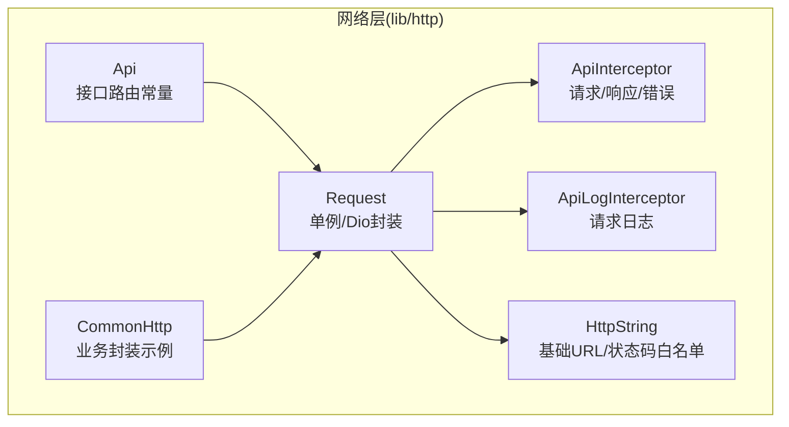
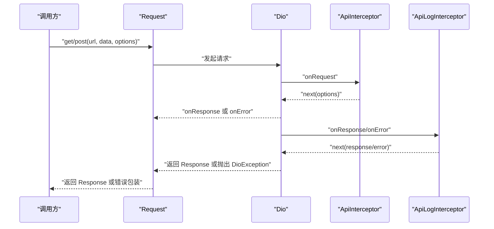
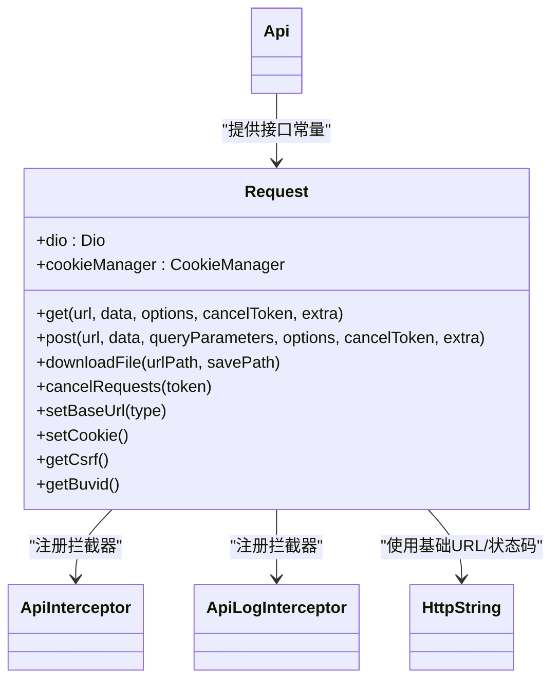
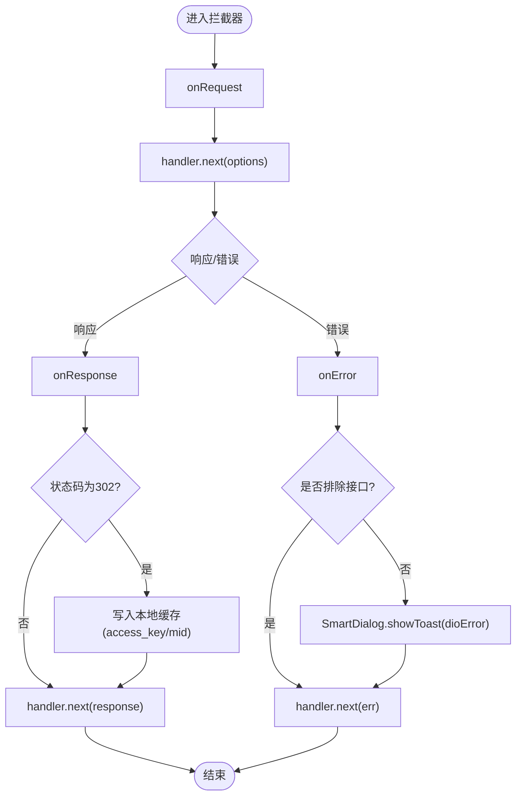
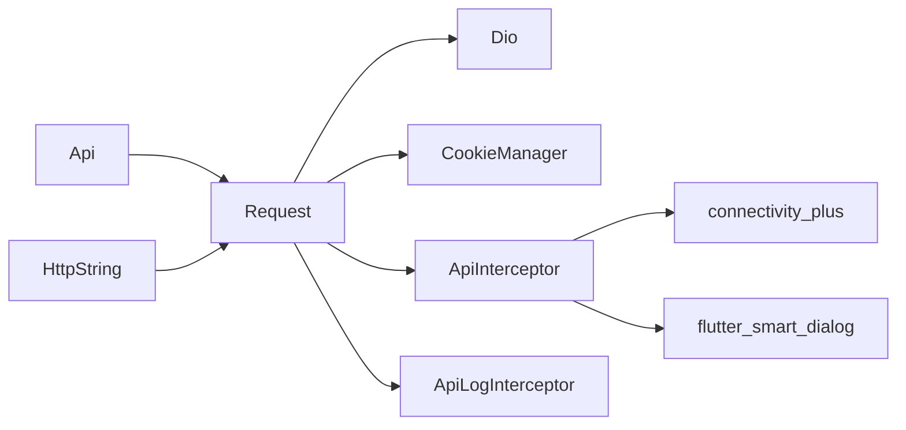

# 网络层架构

<cite>
**本文引用的文件**
- [lib/http/init.dart](file://lib/http/init.dart)
- [lib/http/interceptor.dart](file://lib/http/interceptor.dart)
- [lib/http/api_log_interceptor.dart](file://lib/http/api_log_interceptor.dart)
- [lib/http/constants.dart](file://lib/http/constants.dart)
- [lib/http/api.dart](file://lib/http/api.dart)
- [lib/http/common.dart](file://lib/http/common.dart)
- [lib/http/index.dart](file://lib/http/index.dart)
</cite>

## 目录
1. [简介](#简介)
2. [项目结构](#项目结构)
3. [核心组件](#核心组件)
4. [架构总览](#架构总览)
5. [详细组件分析](#详细组件分析)
6. [依赖分析](#依赖分析)
7. [性能考量](#性能考量)
8. [故障排查指南](#故障排查指南)
9. [结论](#结论)
10. [附录](#附录)

## 简介
本文件系统性梳理 PiliPala 的网络层架构，重点围绕 Dio 客户端的初始化、拦截器体系、请求生命周期、超时与重试策略、错误分类与用户提示、网络监控与调试、安全与 HTTPS 配置、离线模式与网络状态感知等方面进行深入解析。文档旨在帮助开发者快速理解并高效扩展网络层能力。

## 项目结构
网络层主要集中在 lib/http 目录下，采用“集中式客户端 + 多拦截器 + 常量与 API 路由”的组织方式：
- 初始化与客户端：Request 单例封装 Dio，统一配置基础选项、代理、Cookie、校验策略与 UA。
- 拦截器：ApiInterceptor（请求/响应/错误）、ApiLogInterceptor（请求日志输出）。
- 常量与路由：HttpString 基础地址与状态码白名单；Api 统一维护各业务接口路径。
- 通用 HTTP 封装：CommonHttp 提供部分业务级调用示例。

图表来源
- [lib/http/init.dart:22-339](file://lib/http/init.dart#L22-L339)
- [lib/http/interceptor.dart:9-103](file://lib/http/interceptor.dart#L9-L103)
- [lib/http/api_log_interceptor.dart:8-84](file://lib/http/api_log_interceptor.dart#L8-L84)
- [lib/http/constants.dart:1-44](file://lib/http/constants.dart#L1-L44)
- [lib/http/api.dart:3-599](file://lib/http/api.dart#L3-L599)
- [lib/http/common.dart:3-18](file://lib/http/common.dart#L3-L18)

章节来源
- [lib/http/index.dart:1-3](file://lib/http/index.dart#L1-L3)
- [lib/http/init.dart:22-339](file://lib/http/init.dart#L22-L339)
- [lib/http/constants.dart:1-44](file://lib/http/constants.dart#L1-L44)
- [lib/http/api.dart:3-599](file://lib/http/api.dart#L3-L599)
- [lib/http/interceptor.dart:9-103](file://lib/http/interceptor.dart#L9-L103)
- [lib/http/api_log_interceptor.dart:8-84](file://lib/http/api_log_interceptor.dart#L8-L84)
- [lib/http/common.dart:3-18](file://lib/http/common.dart#L3-L18)

## 核心组件
- Request 单例：负责 Dio 实例化、基础选项、Cookie 管理、CSRF/BUID 获取、UA 选择、代理设置、请求/响应/下载封装、取消请求、基础 URL 切换。
- ApiInterceptor：请求前透传、响应后处理（如 302 重定向携带参数写入本地缓存）、错误统一提示与网络状态检测。
- ApiLogInterceptor：请求/响应/错误日志输出，支持高频接口排除、数据格式化与截断显示。
- HttpString：统一管理各域名基础地址与业务状态码白名单。
- Api：集中维护各业务接口路径常量。
- CommonHttp：对具体业务的 HTTP 调用进行封装示例。

章节来源
- [lib/http/init.dart:22-339](file://lib/http/init.dart#L22-L339)
- [lib/http/interceptor.dart:9-103](file://lib/http/interceptor.dart#L9-L103)
- [lib/http/api_log_interceptor.dart:8-84](file://lib/http/api_log_interceptor.dart#L8-L84)
- [lib/http/constants.dart:1-44](file://lib/http/constants.dart#L1-L44)
- [lib/http/api.dart:3-599](file://lib/http/api.dart#L3-L599)
- [lib/http/common.dart:3-18](file://lib/http/common.dart#L3-L18)

## 架构总览
Dio 客户端通过 Request 单例集中配置，拦截器链路在请求前、响应后、错误时分别执行，日志拦截器独立输出便于调试。业务通过 Api 常量拼接 URL，调用 Request 的 get/post/download 封装方法完成请求。

图表来源
- [lib/http/init.dart:218-277](file://lib/http/init.dart#L218-L277)
- [lib/http/interceptor.dart:10-57](file://lib/http/interceptor.dart#L10-L57)
- [lib/http/api_log_interceptor.dart:34-64](file://lib/http/api_log_interceptor.dart#L34-L64)

## 详细组件分析

### Request 单例与 Dio 客户端配置
- 基础选项：baseUrl、connectTimeout、receiveTimeout、headers。
- Cookie 管理：持久化 CookieJar，自动注入 Cookie，按需刷新 CSRF 与 BUVID。
- 代理设置：在非 Web 平台根据设置启用系统代理，允许忽略证书错误。
- 拦截器：ApiInterceptor、ApiLogInterceptor、BackgroundTransformer。
- 校验策略：自定义 validateStatus，将特定业务状态码视为有效。
- 请求封装：get/post 支持额外 UA 与响应类型；downloadFile 支持进度回调；cancelRequests 支持取消令牌。
- 基础 URL 切换：支持 default/bangumi 两种环境。

图表来源
- [lib/http/init.dart:22-339](file://lib/http/init.dart#L22-L339)
- [lib/http/interceptor.dart:9-103](file://lib/http/interceptor.dart#L9-L103)
- [lib/http/api_log_interceptor.dart:8-84](file://lib/http/api_log_interceptor.dart#L8-L84)
- [lib/http/constants.dart:1-44](file://lib/http/constants.dart#L1-L44)
- [lib/http/api.dart:3-599](file://lib/http/api.dart#L3-L599)

章节来源
- [lib/http/init.dart:154-213](file://lib/http/init.dart#L154-L213)
- [lib/http/init.dart:37-78](file://lib/http/init.dart#L37-L78)
- [lib/http/init.dart:218-277](file://lib/http/init.dart#L218-L277)
- [lib/http/init.dart:282-297](file://lib/http/init.dart#L282-L297)
- [lib/http/init.dart:305-307](file://lib/http/init.dart#L305-L307)
- [lib/http/init.dart:326-337](file://lib/http/init.dart#L326-L337)

### 拦截器体系
- ApiInterceptor
  - onRequest：透传请求。
  - onResponse：处理 302 重定向中的第三方登录参数，写入本地缓存。
  - onError：统一错误提示，排除高频接口；结合网络状态检测生成用户提示文案。
- ApiLogInterceptor
  - onRequest/onResponse/onError：输出请求/响应/错误日志，支持高频接口排除、数据截断与格式化。
- 网络状态检测
  - 使用 connectivity_plus 检测网络类型（移动/WiFi/以太网/VPN/蓝牙/其他/无），在未知错误时辅助提示。

图表来源
- [lib/http/interceptor.dart:10-57](file://lib/http/interceptor.dart#L10-L57)
- [lib/http/interceptor.dart:59-101](file://lib/http/interceptor.dart#L59-L101)
- [lib/http/api_log_interceptor.dart:34-64](file://lib/http/api_log_interceptor.dart#L34-L64)

章节来源
- [lib/http/interceptor.dart:9-103](file://lib/http/interceptor.dart#L9-L103)
- [lib/http/api_log_interceptor.dart:8-84](file://lib/http/api_log_interceptor.dart#L8-L84)

### 请求生命周期与超时设置
- 生命周期
  - 请求阶段：onRequest -> Dio 发起 -> onResponse/onError。
  - 响应阶段：ApiLogInterceptor 输出日志 -> ApiInterceptor 处理业务逻辑 -> 返回调用方。
- 超时设置
  - connectTimeout：连接超时。
  - receiveTimeout：接收数据间隔超时。
- 重试机制
  - 代码未实现自动重试；可通过上层封装在业务层进行指数退避重试或条件重试。

章节来源
- [lib/http/init.dart:156-165](file://lib/http/init.dart#L156-L165)
- [lib/http/init.dart:218-277](file://lib/http/init.dart#L218-L277)

### 错误分类处理、错误码映射与用户提示
- 错误类型映射
  - 证书错误、响应异常、请求取消、连接错误、连接超时、接收超时、发送超时、未知错误。
- 用户提示
  - 未知错误时调用网络状态检测，生成“正在使用...”提示文案。
  - 对高频心跳/流媒体接口进行排除，避免频繁弹窗。
- 业务状态码白名单
  - HttpString.validateStatusCodes 定义了可视为成功的业务状态集合，配合 validateStatus 生效。

章节来源
- [lib/http/interceptor.dart:59-79](file://lib/http/interceptor.dart#L59-L79)
- [lib/http/interceptor.dart:81-101](file://lib/http/interceptor.dart#L81-L101)
- [lib/http/constants.dart:10-42](file://lib/http/constants.dart#L10-L42)

### 网络监控与调试
- 请求日志
  - ApiLogInterceptor 输出请求方法、短 URL、HTTP 状态码、业务 code/message、数据摘要。
  - 支持正则排除高频接口（心跳、流媒体等）。
- 响应时间统计
  - 代码未内置响应时间统计；可在拦截器或上层封装中增加时间戳计算并上报。
- 网络状态监听
  - 通过 connectivity_plus 获取当前网络类型，辅助错误提示与行为决策。

章节来源
- [lib/http/api_log_interceptor.dart:8-84](file://lib/http/api_log_interceptor.dart#L8-L84)
- [lib/http/interceptor.dart:81-101](file://lib/http/interceptor.dart#L81-L101)

### 网络安全与 HTTPS 配置
- HTTPS 与证书
  - 默认启用 HTTPS 基础地址；代理场景允许忽略证书错误（存在安全风险，建议仅在受控环境下使用）。
- Cookie 与 CSRF
  - 自动加载持久化 Cookie，按需获取 CSRF 与 BUVID，确保跨站请求安全。
- 代理与系统代理
  - 在非 Web 平台支持系统代理配置，便于内网或测试环境访问。

章节来源
- [lib/http/constants.dart:2-9](file://lib/http/constants.dart#L2-L9)
- [lib/http/init.dart:186-200](file://lib/http/init.dart#L186-L200)
- [lib/http/init.dart:37-89](file://lib/http/init.dart#L37-L89)

### 离线模式与网络状态感知
- 离线模式
  - 代码未实现离线缓存与离线模式切换；可在业务层基于网络状态与本地缓存实现离线展示。
- 网络状态感知
  - 使用 connectivity_plus 获取当前网络类型，用于错误提示与行为控制。

章节来源
- [lib/http/interceptor.dart:81-101](file://lib/http/interceptor.dart#L81-L101)

## 依赖分析
- 组件耦合
  - Request 与拦截器强耦合（注册顺序影响处理流程）。
  - Api 与 Request 解耦，通过字符串路径组合调用。
- 外部依赖
  - Dio、cookie_jar、dio_cookie_manager、connectivity_plus、flutter_smart_dialog。
- 潜在循环依赖
  - 未发现直接循环导入；拦截器之间通过 handler.next 串联。

图表来源
- [lib/http/init.dart:22-339](file://lib/http/init.dart#L22-L339)
- [lib/http/interceptor.dart:3-7](file://lib/http/interceptor.dart#L3-L7)
- [lib/http/api.dart:1-2](file://lib/http/api.dart#L1-L2)
- [lib/http/constants.dart:1-1](file://lib/http/constants.dart#L1-L1)

章节来源
- [lib/http/init.dart:22-339](file://lib/http/init.dart#L22-L339)
- [lib/http/interceptor.dart:3-7](file://lib/http/interceptor.dart#L3-L7)
- [lib/http/api.dart:1-2](file://lib/http/api.dart#L1-L2)
- [lib/http/constants.dart:1-1](file://lib/http/constants.dart#L1-L1)

## 性能考量
- 高频接口排除：日志拦截器已对心跳/流媒体等高频接口进行排除，减少日志噪声与 I/O 开销。
- 响应类型：get/post 支持自定义 responseType，避免不必要的数据解析。
- 代理与证书：忽略证书错误可能带来安全风险，建议在开发/测试环境使用，生产环境保持严格校验。
- 重试策略：未内置自动重试，建议在业务层按接口特性实现指数退避重试，避免雪崩效应。

## 故障排查指南
- 常见问题定位
  - 请求无响应：检查 connectTimeout/receiveTimeout 是否过短；确认代理配置是否正确。
  - 302 登录失败：检查 ApiInterceptor 对 location 参数的处理与本地缓存写入。
  - 证书错误：确认代理是否开启忽略证书错误；生产环境请勿忽略证书。
  - 频繁弹窗：确认高频接口是否被排除；调整 ApiLogInterceptor 排除规则。
- 日志与诊断
  - 启用 ApiLogInterceptor 输出；观察请求/响应/错误日志；关注业务 code/message。
  - 结合网络状态检测结果，判断是否为无网络或代理网络导致的问题。

章节来源
- [lib/http/interceptor.dart:45-57](file://lib/http/interceptor.dart#L45-L57)
- [lib/http/api_log_interceptor.dart:67-82](file://lib/http/api_log_interceptor.dart#L67-L82)
- [lib/http/init.dart:186-200](file://lib/http/init.dart#L186-L200)

## 结论
PiliPala 的网络层以 Request 单例为核心，结合 Dio 拦截器体系实现了统一的 Cookie 管理、错误提示、日志输出与基础 URL 切换。通过 HttpString 与 Api 的常量化管理，提升了可维护性。当前未实现自动重试与离线模式，建议在业务层补充相应能力；同时注意代理与证书配置的安全性。

## 附录
- 接口路由示例：参考 Api 常量，按需拼接 baseUrl 与路径。
- 业务封装示例：参考 CommonHttp，将通用逻辑抽象为更高层的调用入口。

章节来源
- [lib/http/api.dart:3-599](file://lib/http/api.dart#L3-L599)
- [lib/http/common.dart:3-18](file://lib/http/common.dart#L3-L18)