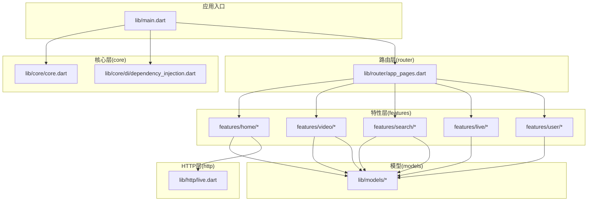
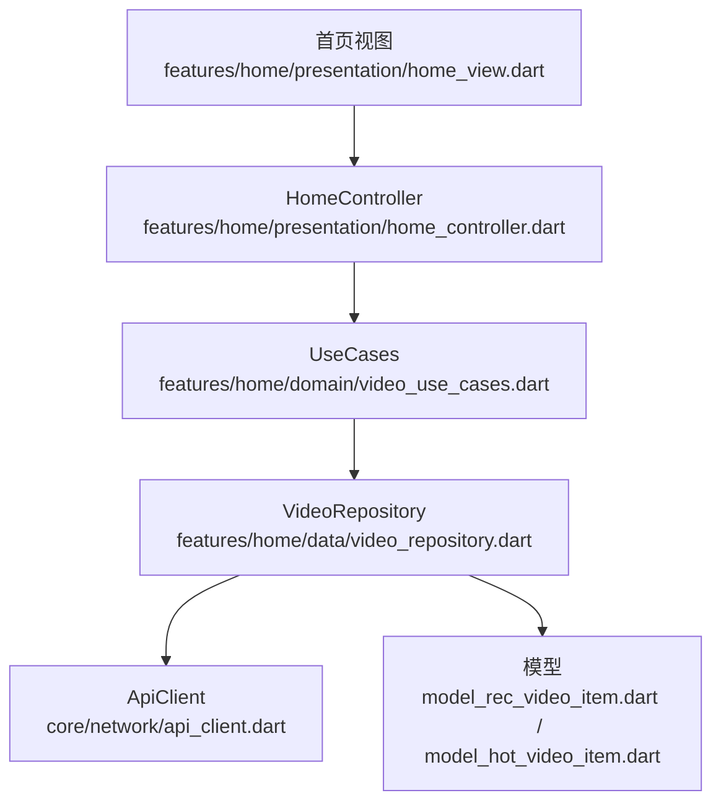
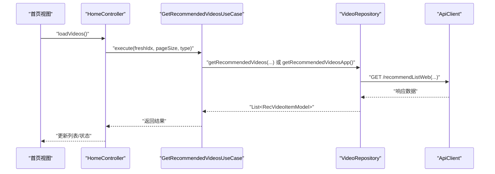
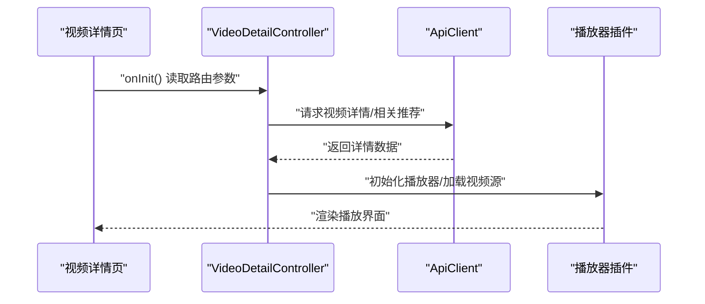
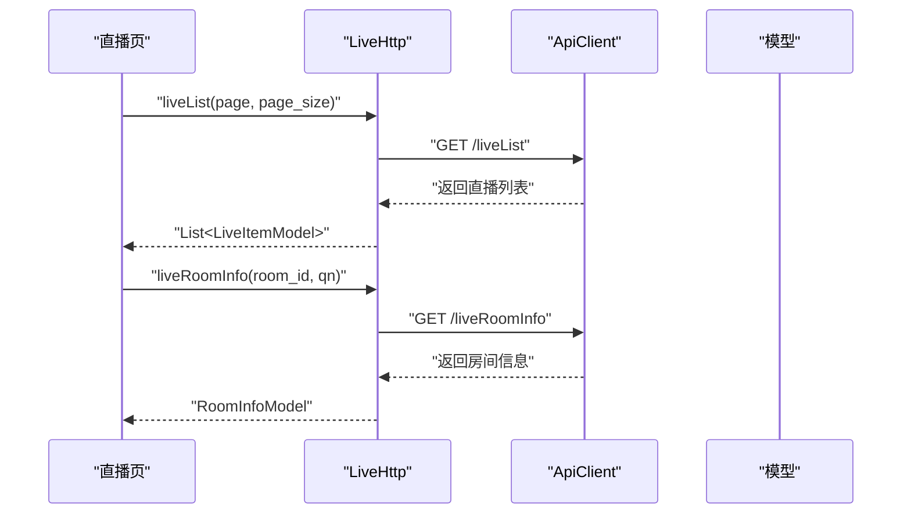
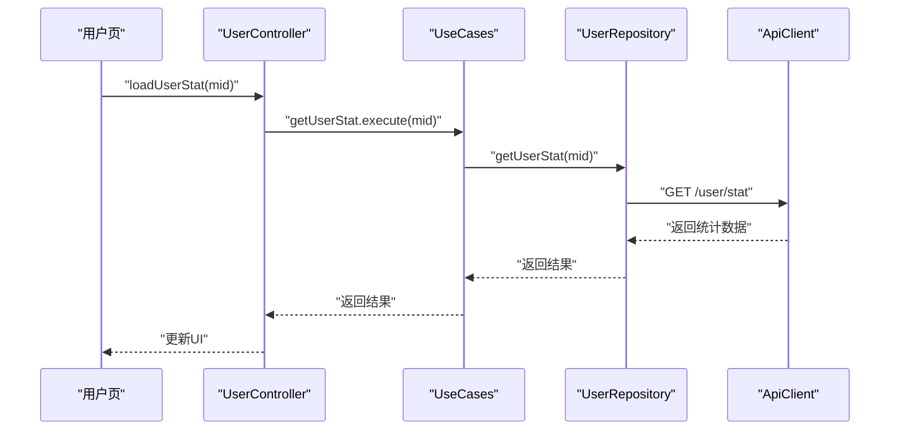
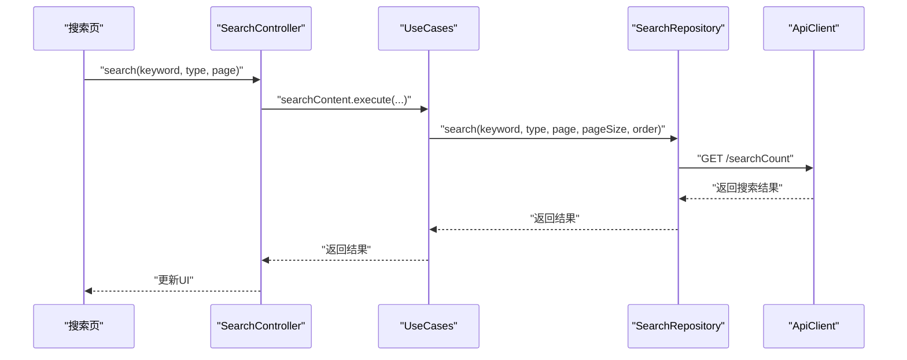
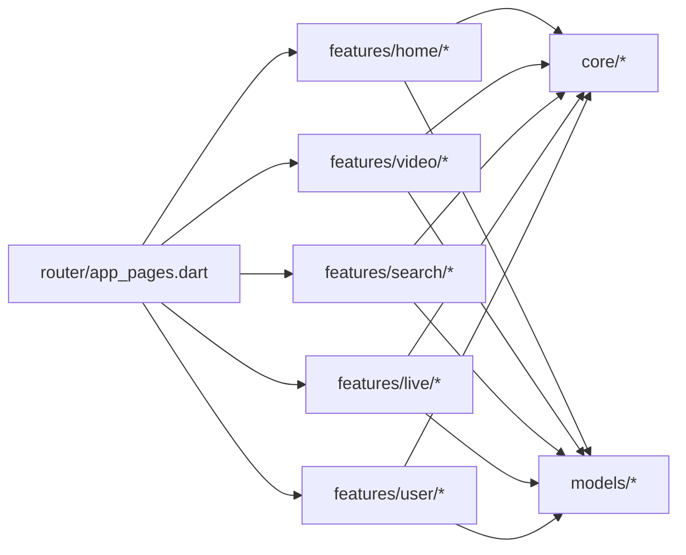

# 核心模块

<cite>
**本文档引用的文件**
- [lib/main.dart](file://lib/main.dart)
- [lib/core/core.dart](file://lib/core/core.dart)
- [lib/core/di/dependency_injection.dart](file://lib/core/di/dependency_injection.dart)
- [lib/router/app_pages.dart](file://lib/router/app_pages.dart)
- [docs/spec/architecture/02-state-management.md](file://docs/spec/architecture/02-state-management.md)
- [docs/spec/architecture/05-navigation.md](file://docs/spec/architecture/05-navigation.md)
- [lib/features/home/presentation/home_controller.dart](file://lib/features/home/presentation/home_controller.dart)
- [lib/features/home/domain/video_use_cases.dart](file://lib/features/home/domain/video_use_cases.dart)
- [lib/features/home/data/video_repository.dart](file://lib/features/home/data/video_repository.dart)
- [lib/features/search/data/search_repository.dart](file://lib/features/search/data/search_repository.dart)
- [lib/http/live.dart](file://lib/http/live.dart)
- [lib/features/user/presentation/user_controller.dart](file://lib/features/user/presentation/user_controller.dart)
- [lib/features/user/data/user_repository.dart](file://lib/features/user/data/user_repository.dart)
- [lib/features/video/presentation/video_detail_page.dart](file://lib/features/video/presentation/video_detail_page.dart)
- [lib/models/model_hot_video_item.dart](file://lib/models/model_hot_video_item.dart)
- [lib/models/model_rec_video_item.dart](file://lib/models/model_rec_video_item.dart)
</cite>

## 目录
1. [简介](#简介)
2. [项目结构](#项目结构)
3. [核心组件](#核心组件)
4. [架构总览](#架构总览)
5. [详细组件分析](#详细组件分析)
6. [依赖分析](#依赖分析)
7. [性能考虑](#性能考虑)
8. [故障排查指南](#故障排查指南)
9. [结论](#结论)
10. [附录](#附录)

## 简介
本文件面向开发者与产品团队，系统性梳理 PiliPala 的核心模块，覆盖首页推荐、视频播放、直播观看、用户管理、搜索等关键业务模块。文档从架构设计、模块职责、内部结构、模块交互、数据流与调用时序、依赖关系、性能优化策略、配置与扩展点等方面进行深入说明，并提供可操作的开发指导与最佳实践。

## 项目结构
应用采用多模块分层组织，核心模块位于 lib/features 下，配合 lib/core 提供网络、存储、主题等基础设施；lib/router 统一路由与页面绑定；lib/http 提供底层 HTTP 访问封装；lib/models 定义数据模型；lib/services、lib/shared、lib/utils 提供通用能力与工具。

图表来源
- [lib/main.dart](file://lib/main.dart)
- [lib/core/core.dart](file://lib/core/core.dart)
- [lib/core/di/dependency_injection.dart](file://lib/core/di/dependency_injection.dart)
- [lib/router/app_pages.dart](file://lib/router/app_pages.dart)
- [lib/http/live.dart](file://lib/http/live.dart)
- [lib/models/model_hot_video_item.dart](file://lib/models/model_hot_video_item.dart)
- [lib/models/model_rec_video_item.dart](file://lib/models/model_rec_video_item.dart)

章节来源
- [lib/main.dart](file://lib/main.dart)
- [lib/core/core.dart](file://lib/core/core.dart)
- [lib/core/di/dependency_injection.dart](file://lib/core/di/dependency_injection.dart)
- [lib/router/app_pages.dart](file://lib/router/app_pages.dart)

## 核心组件
- 首页推荐模块：负责推荐/热门视频列表的获取、分页与状态管理。
- 视频播放模块：负责视频详情页、播放器集成、弹幕、全屏等功能。
- 直播观看模块：负责直播列表、直播间信息获取与播放参数选择。
- 用户管理模块：负责用户资料、关注/取关、个人收藏/动态等数据获取。
- 搜索模块：负责关键词搜索、热搜、搜索建议与结果聚合。

章节来源
- [lib/features/home/presentation/home_controller.dart](file://lib/features/home/presentation/home_controller.dart)
- [lib/features/video/presentation/video_detail_page.dart](file://lib/features/video/presentation/video_detail_page.dart)
- [lib/http/live.dart](file://lib/http/live.dart)
- [lib/features/user/presentation/user_controller.dart](file://lib/features/user/presentation/user_controller.dart)
- [lib/features/search/data/search_repository.dart](file://lib/features/search/data/search_repository.dart)

## 架构总览
系统采用 GetX 驱动的 MVVM 架构：View 仅负责展示与交互，Controller 负责状态与业务编排，Repository 负责数据访问抽象，ApiClient 提供网络访问能力。依赖注入集中于 DependencyInjection，路由通过 AppPages 统一注册与管理。

图表来源
- [lib/features/home/presentation/home_controller.dart](file://lib/features/home/presentation/home_controller.dart)
- [lib/features/home/domain/video_use_cases.dart](file://lib/features/home/domain/video_use_cases.dart)
- [lib/features/home/data/video_repository.dart](file://lib/features/home/data/video_repository.dart)
- [lib/models/model_rec_video_item.dart](file://lib/models/model_rec_video_item.dart)
- [lib/models/model_hot_video_item.dart](file://lib/models/model_hot_video_item.dart)

## 详细组件分析

### 首页推荐模块
职责边界
- 负责首页推荐与热门视频列表的加载、刷新、分页。
- 管理登录态兼容与用户头像缓存。
- 通过 UseCase 解耦业务逻辑，Repository 抽象数据源。

内部结构
- Controller：维护推荐/热门列表、加载状态、错误信息、当前页与分页大小、登录态等。
- UseCase：封装“获取推荐视频”“获取热门视频”的业务语义，支持类型切换（web/app/notLogin）。
- Repository：封装 HTTP 请求与数据解析，提供类型安全的 ApiResponse。

数据流与时序

图表来源
- [lib/features/home/presentation/home_controller.dart](file://lib/features/home/presentation/home_controller.dart)
- [lib/features/home/domain/video_use_cases.dart](file://lib/features/home/domain/video_use_cases.dart)
- [lib/features/home/data/video_repository.dart](file://lib/features/home/data/video_repository.dart)

模块交互
- 与路由层：通过路由参数传递初始状态或标识。
- 与模型层：依赖 RecVideoItemModel、HotVideoItemModel。
- 与网络层：通过 ApiClient 统一发起请求。

错误处理
- 统一捕获异常并设置错误状态，避免 UI 异常崩溃。
- 分页加载失败不影响已有数据展示。

性能优化
- 合理的分页大小与懒加载策略。
- 缓存用户登录态与头像，减少重复读取。

章节来源
- [lib/features/home/presentation/home_controller.dart](file://lib/features/home/presentation/home_controller.dart)
- [lib/features/home/domain/video_use_cases.dart](file://lib/features/home/domain/video_use_cases.dart)
- [lib/features/home/data/video_repository.dart](file://lib/features/home/data/video_repository.dart)
- [lib/models/model_rec_video_item.dart](file://lib/models/model_rec_video_item.dart)
- [lib/models/model_hot_video_item.dart](file://lib/models/model_hot_video_item.dart)

### 视频播放模块
职责边界
- 负责视频详情页展示、播放器集成、弹幕、全屏控制等。
- 与首页/搜索结果页联动，支持通过路由参数进入详情页。

内部结构
- 视图：VideoDetailPage，承载播放器、头部控制、相关推荐等。
- 控制器：负责视频信息加载、播放状态管理、全屏切换等。
- 播放器插件：集成第三方播放器能力，支持全屏、重复播放等。

数据流与时序

图表来源
- [lib/features/video/presentation/video_detail_page.dart](file://lib/features/video/presentation/video_detail_page.dart)

模块交互
- 与路由层：通过路由参数传递视频标识。
- 与模型层：依赖视频详情模型与相关推荐模型。
- 与播放器插件：通过播放器接口进行控制。

性能优化
- 按需加载视频源与封面。
- 全屏切换时释放非必要资源。

章节来源
- [lib/features/video/presentation/video_detail_page.dart](file://lib/features/video/presentation/video_detail_page.dart)

### 直播观看模块
职责边界
- 负责直播列表与直播间信息获取，支持协议/清晰度/编解码参数选择。

内部结构
- HTTP 封装：LiveHttp 提供直播列表与房间信息的静态方法。
- 模型：LiveItemModel、RoomInfoModel 等。

数据流与时序

图表来源
- [lib/http/live.dart](file://lib/http/live.dart)

模块交互
- 与模型层：依赖直播项与房间信息模型。
- 与网络层：通过 ApiClient 统一请求。

性能优化
- 合理的分页参数与缓存策略。
- 按需加载房间信息，避免无意义请求。

章节来源
- [lib/http/live.dart](file://lib/http/live.dart)

### 用户管理模块
职责边界
- 负责用户资料、关注/取关、最近点赞/投币视频、个人剧集等数据获取与展示。

内部结构
- Controller：封装加载统计、关注/取关、加载最近内容等方法。
- Repository：封装用户相关 API，如最近点赞、剧集列表、关注关系变更等。

数据流与时序

图表来源
- [lib/features/user/presentation/user_controller.dart](file://lib/features/user/presentation/user_controller.dart)
- [lib/features/user/data/user_repository.dart](file://lib/features/user/data/user_repository.dart)

模块交互
- 与路由层：通过路由参数传递用户标识 mid。
- 与模型层：依赖用户统计、点赞/投币视频、剧集等模型。
- 与网络层：通过 ApiClient 统一请求。

性能优化
- 对频繁请求的接口进行节流与缓存。
- 列表懒加载与分页。

章节来源
- [lib/features/user/presentation/user_controller.dart](file://lib/features/user/presentation/user_controller.dart)
- [lib/features/user/data/user_repository.dart](file://lib/features/user/data/user_repository.dart)

### 搜索模块
职责边界
- 负责关键词搜索、热搜、搜索建议与结果聚合。

内部结构
- Repository：封装搜索计数、搜索建议等 API。
- UseCases：封装热搜、搜索内容、搜索建议等业务语义。
- Controller：管理搜索状态、关键词、排序、分页等。

数据流与时序

图表来源
- [lib/features/search/data/search_repository.dart](file://lib/features/search/data/search_repository.dart)

模块交互
- 与模型层：依赖搜索结果模型与建议列表。
- 与网络层：通过 ApiClient 统一请求。

性能优化
- 输入防抖与去重请求。
- 搜索建议按前缀匹配，减少网络开销。

章节来源
- [lib/features/search/data/search_repository.dart](file://lib/features/search/data/search_repository.dart)

## 依赖分析
模块间依赖关系
- 路由层依赖各特性模块的页面与绑定。
- 特性模块依赖核心层的网络、存储、主题服务。
- 特性模块之间低耦合，通过模型与网络层交互。
- 依赖注入集中管理，降低模块间耦合。

图表来源
- [lib/router/app_pages.dart](file://lib/router/app_pages.dart)
- [lib/core/core.dart](file://lib/core/core.dart)
- [lib/models/model_hot_video_item.dart](file://lib/models/model_hot_video_item.dart)
- [lib/models/model_rec_video_item.dart](file://lib/models/model_rec_video_item.dart)

章节来源
- [lib/router/app_pages.dart](file://lib/router/app_pages.dart)
- [lib/core/core.dart](file://lib/core/core.dart)

## 性能考虑
- 状态管理：使用 GetX 响应式状态，避免不必要的重建；列表状态使用 isLoading、hasMore、error 等字段统一管理。
- 网络请求：统一通过 ApiClient，结合分页参数与缓存策略，减少重复请求。
- 图片与媒体：使用骨架屏与懒加载，避免首屏阻塞。
- 播放器：按需初始化，全屏切换时释放非必要资源。
- 依赖注入：使用 lazyPut 与 tag 隔离，避免重复创建与内存泄漏。

## 故障排查指南
常见问题与定位
- 首页推荐/热门列表不刷新：检查 Controller 的 loadVideos/refreshVideos 是否正确调用 UseCase 并更新状态。
- 播放器无法加载：确认路由参数是否正确传递，播放器初始化是否在数据就绪后进行。
- 直播列表为空：检查 LiveHttp 的请求参数与返回状态，确认接口可用性。
- 用户数据异常：核对 UserController 的参数 mid 与路由传参，确认 UserRepository 的接口返回。
- 搜索无结果：检查关键词与排序参数，确认 SearchRepository 的接口返回。

章节来源
- [lib/features/home/presentation/home_controller.dart](file://lib/features/home/presentation/home_controller.dart)
- [lib/features/video/presentation/video_detail_page.dart](file://lib/features/video/presentation/video_detail_page.dart)
- [lib/http/live.dart](file://lib/http/live.dart)
- [lib/features/user/presentation/user_controller.dart](file://lib/features/user/presentation/user_controller.dart)
- [lib/features/search/data/search_repository.dart](file://lib/features/search/data/search_repository.dart)

## 结论
PiliPala 的核心模块遵循清晰的分层与职责划分：路由层统一管理页面与导航，特性层聚焦业务域，核心层提供基础设施，模型层保证数据一致性。通过 UseCase/Repository 解耦与 GetX 响应式状态管理，系统具备良好的可维护性与扩展性。建议在后续迭代中持续完善错误处理、性能监控与测试覆盖。

## 附录
- 开发者指南
  - 新增特性：在 features 下新建子模块，按 MVVM 结构组织 Controller/Domain/Data/View，并在路由层注册。
  - 状态管理：遵循 GetX 规范，使用 .obs 管理状态，避免在 View 中直接操作状态。
  - 依赖注入：在 DependencyInjection 中注册服务与仓库，确保生命周期与作用域正确。
  - 路由规范：参考导航规范，统一命名与传参方式，避免深层嵌套。
- 最佳实践
  - 列表加载：统一使用 isLoading/hasMore/error 管理状态，支持刷新与加载更多。
  - 错误处理：在 Controller 层统一捕获异常并提示用户。
  - 性能优化：合理分页、缓存与懒加载，避免阻塞 UI。
  - 测试策略：单元测试覆盖 UseCase/Repository，集成测试覆盖关键流程。

章节来源
- [docs/spec/architecture/02-state-management.md](file://docs/spec/architecture/02-state-management.md)
- [docs/spec/architecture/05-navigation.md](file://docs/spec/architecture/05-navigation.md)
- [lib/core/di/dependency_injection.dart](file://lib/core/di/dependency_injection.dart)
- [lib/router/app_pages.dart](file://lib/router/app_pages.dart)