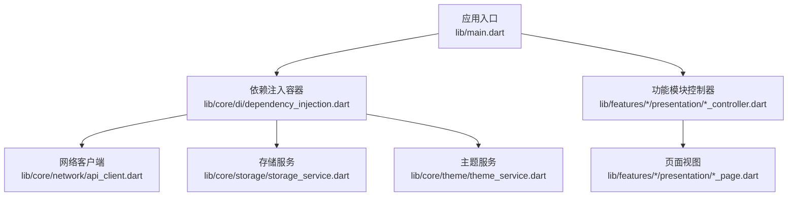
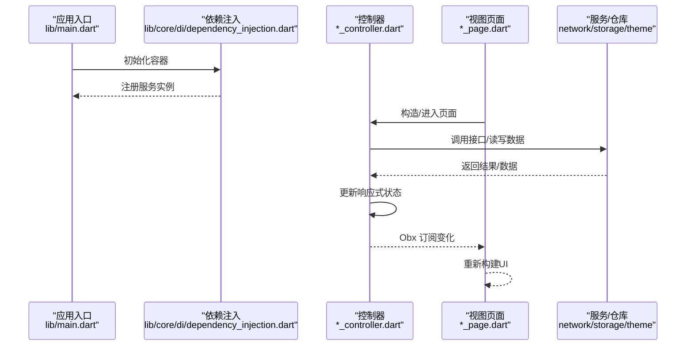
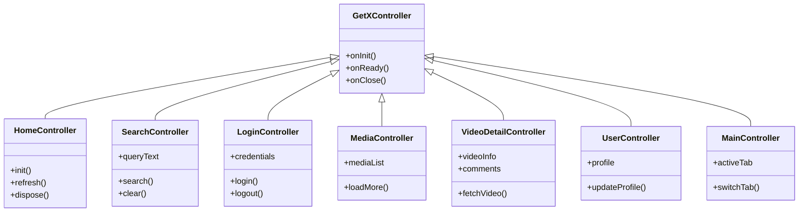
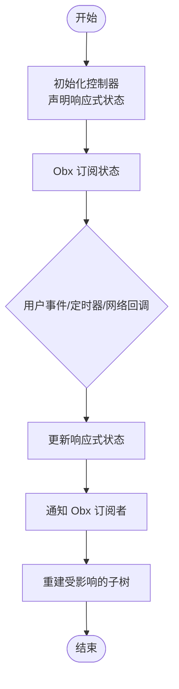
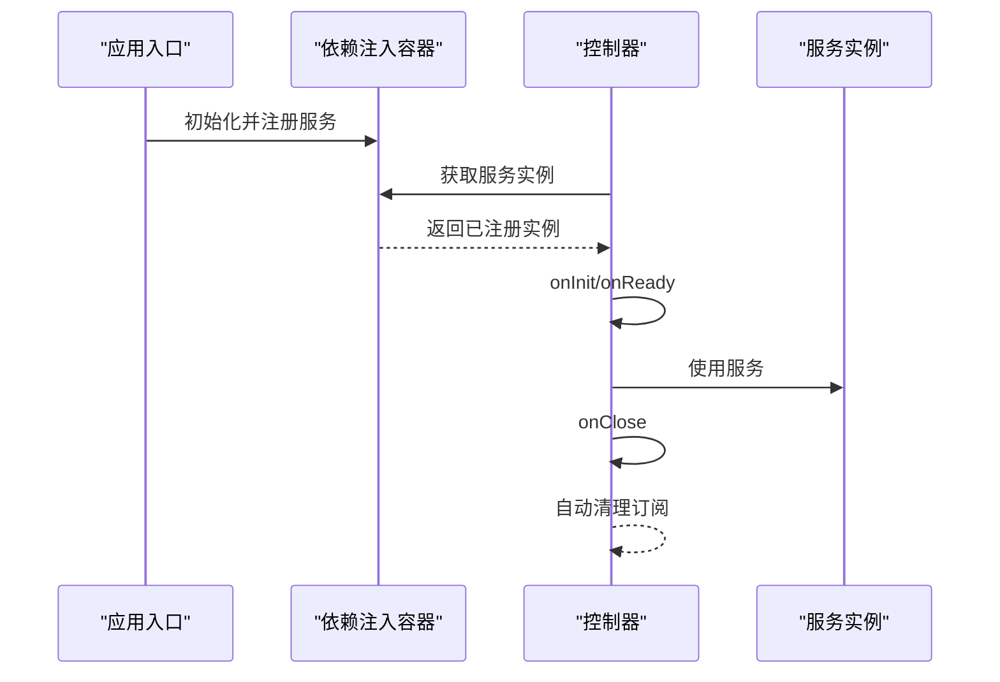
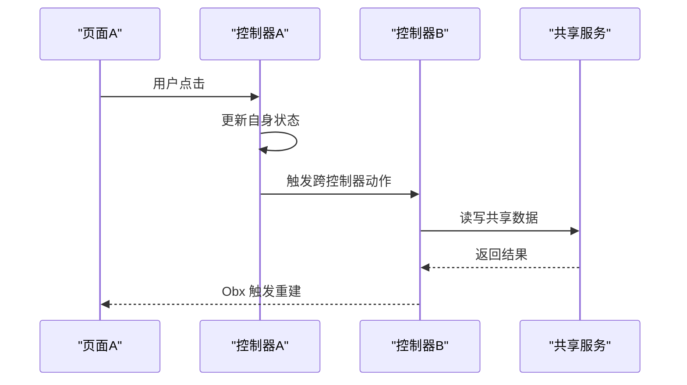
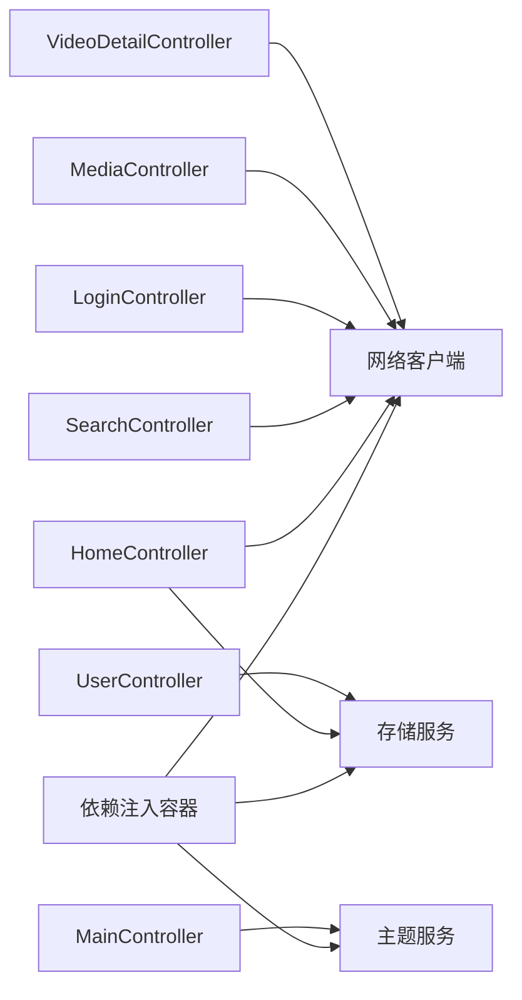

# 状态管理

<cite>
**本文引用的文件**
- [lib/main.dart](file://lib/main.dart)
- [lib/core/di/dependency_injection.dart](file://lib/core/di/dependency_injection.dart)
- [lib/features/home/presentation/home_controller.dart](file://lib/features/home/presentation/home_controller.dart)
- [lib/features/search/presentation/search_controller.dart](file://lib/features/search/presentation/search_controller.dart)
- [lib/features/login/presentation/login_controller.dart](file://lib/features/login/presentation/login_controller.dart)
- [lib/features/media/presentation/media_controller.dart](file://lib/features/media/presentation/media_controller.dart)
- [lib/features/video/presentation/video_detail_controller.dart](file://lib/features/video/presentation/video_detail_controller.dart)
- [lib/features/user/presentation/user_controller.dart](file://lib/features/user/presentation/user_controller.dart)
- [lib/features/main/presentation/main_controller.dart](file://lib/features/main/presentation/main_controller.dart)
- [lib/core/theme/theme_service.dart](file://lib/core/theme/theme_service.dart)
- [lib/core/storage/storage_service.dart](file://lib/core/storage/storage_service.dart)
- [lib/core/network/api_client.dart](file://lib/core/network/api_client.dart)
- [docs/spec/architecture/02-state-management.md](file://docs/spec/architecture/02-state-management.md)
</cite>

## 目录
1. [简介](#简介)
2. [项目结构](#项目结构)
3. [核心组件](#核心组件)
4. [架构总览](#架构总览)
5. [详细组件分析](#详细组件分析)
6. [依赖关系分析](#依赖关系分析)
7. [性能考虑](#性能考虑)
8. [故障排查指南](#故障排查指南)
9. [结论](#结论)
10. [附录](#附录)

## 简介
本文件系统性梳理 PiliPala 的状态管理方案，基于 GetX 框架实现，覆盖 Controller 设计模式、响应式数据绑定、依赖注入与生命周期管理；解释 Obx 组件、Bindings 类与自动清理机制的工作原理；给出状态管理模式图、数据流向图与组件通信示例；明确全局状态、局部状态与临时状态的边界与使用场景；并总结最佳实践、性能优化与调试技巧。

## 项目结构
- 应用入口位于 lib/main.dart，负责初始化依赖注入容器与应用启动。
- 核心服务通过 lib/core/di/dependency_injection.dart 集中注册，包括网络层、存储层与主题服务等。
- 功能模块采用 Feature 分层：data（仓库）、domain（用例）、presentation（控制器+页面）。
- 控制器均继承自 GetX 的 GetXController，利用其生命周期钩子与自动清理能力。
- 文档规范位于 docs/spec/architecture/02-state-management.md，定义了状态管理策略与约定。

**图表来源**
- [lib/main.dart](file://lib/main.dart)
- [lib/core/di/dependency_injection.dart](file://lib/core/di/dependency_injection.dart)
- [lib/core/network/api_client.dart](file://lib/core/network/api_client.dart)
- [lib/core/storage/storage_service.dart](file://lib/core/storage/storage_service.dart)
- [lib/core/theme/theme_service.dart](file://lib/core/theme/theme_service.dart)

**章节来源**
- [lib/main.dart](file://lib/main.dart)
- [lib/core/di/dependency_injection.dart](file://lib/core/di/dependency_injection.dart)
- [docs/spec/architecture/02-state-management.md](file://docs/spec/architecture/02-state-management.md)

## 核心组件
- 控制器（GetXController 子类）
  - 所有业务控制器（如首页、搜索、登录、媒体、视频详情、用户、主页面）均以 GetXController 为基础，具备响应式状态、生命周期钩子与自动清理。
  - 典型职责：封装页面状态、处理交互、调用用例或仓库、触发视图更新。
- Obx 组件
  - 基于 GetBuilder/Obx 的响应式视图绑定，仅在依赖的响应式变量变化时重建相关子树，提升渲染效率。
- Bindings 类
  - 用于在路由切换时按需注入依赖，支持页面级依赖隔离与懒加载。
- 自动清理机制
  - 控制器在销毁时自动释放绑定的响应式订阅，避免内存泄漏；配合 Get.delete 或 Get.lazyPut 的作用域控制更佳。

**章节来源**
- [lib/features/home/presentation/home_controller.dart](file://lib/features/home/presentation/home_controller.dart)
- [lib/features/search/presentation/search_controller.dart](file://lib/features/search/presentation/search_controller.dart)
- [lib/features/login/presentation/login_controller.dart](file://lib/features/login/presentation/login_controller.dart)
- [lib/features/media/presentation/media_controller.dart](file://lib/features/media/presentation/media_controller.dart)
- [lib/features/video/presentation/video_detail_controller.dart](file://lib/features/video/presentation/video_detail_controller.dart)
- [lib/features/user/presentation/user_controller.dart](file://lib/features/user/presentation/user_controller.dart)
- [lib/features/main/presentation/main_controller.dart](file://lib/features/main/presentation/main_controller.dart)

## 架构总览
下图展示从入口到控制器、再到视图的典型状态流转：应用启动后通过依赖注入容器提供服务实例；控制器持有响应式状态并通过 Obx 订阅；当用户交互或异步任务完成时，状态变更驱动视图重建。

**图表来源**
- [lib/main.dart](file://lib/main.dart)
- [lib/core/di/dependency_injection.dart](file://lib/core/di/dependency_injection.dart)
- [lib/features/home/presentation/home_controller.dart](file://lib/features/home/presentation/home_controller.dart)
- [lib/core/network/api_client.dart](file://lib/core/network/api_client.dart)
- [lib/core/storage/storage_service.dart](file://lib/core/storage/storage_service.dart)
- [lib/core/theme/theme_service.dart](file://lib/core/theme/theme_service.dart)

## 详细组件分析

### 控制器类层次与关系
所有业务控制器均遵循统一的基类与职责划分，形成清晰的层次结构。

**图表来源**
- [lib/features/home/presentation/home_controller.dart](file://lib/features/home/presentation/home_controller.dart)
- [lib/features/search/presentation/search_controller.dart](file://lib/features/search/presentation/search_controller.dart)
- [lib/features/login/presentation/login_controller.dart](file://lib/features/login/presentation/login_controller.dart)
- [lib/features/media/presentation/media_controller.dart](file://lib/features/media/presentation/media_controller.dart)
- [lib/features/video/presentation/video_detail_controller.dart](file://lib/features/video/presentation/video_detail_controller.dart)
- [lib/features/user/presentation/user_controller.dart](file://lib/features/user/presentation/user_controller.dart)
- [lib/features/main/presentation/main_controller.dart](file://lib/features/main/presentation/main_controller.dart)

**章节来源**
- [lib/features/home/presentation/home_controller.dart](file://lib/features/home/presentation/home_controller.dart)
- [lib/features/search/presentation/search_controller.dart](file://lib/features/search/presentation/search_controller.dart)
- [lib/features/login/presentation/login_controller.dart](file://lib/features/login/presentation/login_controller.dart)
- [lib/features/media/presentation/media_controller.dart](file://lib/features/media/presentation/media_controller.dart)
- [lib/features/video/presentation/video_detail_controller.dart](file://lib/features/video/presentation/video_detail_controller.dart)
- [lib/features/user/presentation/user_controller.dart](file://lib/features/user/presentation/user_controller.dart)
- [lib/features/main/presentation/main_controller.dart](file://lib/features/main/presentation/main_controller.dart)

### 数据流与响应式绑定
- 响应式状态：控制器内部维护可观察的数据（如列表、对象、布尔值），通过 GetX 的响应式机制进行追踪。
- Obx 订阅：视图侧使用 Obx/GetBuilder 包裹需要响应的部分，仅在对应状态变化时重建。
- 异步流程：控制器发起网络请求或本地读写，完成后更新状态并触发视图刷新。

[此图为概念性流程示意，无需图表来源]

### 依赖注入与生命周期
- 依赖注入：在依赖注入容器中集中注册网络客户端、存储服务、主题服务等，控制器通过 Get.find<T>() 获取所需实例。
- 生命周期：控制器在 onInit/onReady/onClose 中执行初始化、准备就绪与资源清理逻辑，确保自动清理与手动释放相结合。

**图表来源**
- [lib/main.dart](file://lib/main.dart)
- [lib/core/di/dependency_injection.dart](file://lib/core/di/dependency_injection.dart)
- [lib/core/network/api_client.dart](file://lib/core/network/api_client.dart)
- [lib/core/storage/storage_service.dart](file://lib/core/storage/storage_service.dart)
- [lib/core/theme/theme_service.dart](file://lib/core/theme/theme_service.dart)

**章节来源**
- [lib/main.dart](file://lib/main.dart)
- [lib/core/di/dependency_injection.dart](file://lib/core/di/dependency_injection.dart)

### 组件通信示例
- 页面内通信：同一控制器内的方法通过更新响应式状态驱动 Obx 重建。
- 页面间通信：通过路由参数传递或全局状态（如主题、用户信息）共享；也可使用 GetX 的 Get.offAllNamed 等导航工具配合控制器切换。
- 多控制器协作：控制器之间通过服务实例或共享仓库交互，避免直接耦合。

[此图为概念性通信示意，无需图表来源]

## 依赖关系分析
- 控制器对服务的依赖通过依赖注入容器集中管理，降低耦合度。
- 网络、存储、主题等服务各自独立，便于替换与测试。
- 控制器之间尽量通过服务交互，避免直接互相持有引用。

**图表来源**
- [lib/core/di/dependency_injection.dart](file://lib/core/di/dependency_injection.dart)
- [lib/core/network/api_client.dart](file://lib/core/network/api_client.dart)
- [lib/core/storage/storage_service.dart](file://lib/core/storage/storage_service.dart)
- [lib/core/theme/theme_service.dart](file://lib/core/theme/theme_service.dart)
- [lib/features/home/presentation/home_controller.dart](file://lib/features/home/presentation/home_controller.dart)
- [lib/features/search/presentation/search_controller.dart](file://lib/features/search/presentation/search_controller.dart)
- [lib/features/login/presentation/login_controller.dart](file://lib/features/login/presentation/login_controller.dart)
- [lib/features/media/presentation/media_controller.dart](file://lib/features/media/presentation/media_controller.dart)
- [lib/features/video/presentation/video_detail_controller.dart](file://lib/features/video/presentation/video_detail_controller.dart)
- [lib/features/user/presentation/user_controller.dart](file://lib/features/user/presentation/user_controller.dart)
- [lib/features/main/presentation/main_controller.dart](file://lib/features/main/presentation/main_controller.dart)

**章节来源**
- [lib/core/di/dependency_injection.dart](file://lib/core/di/dependency_injection.dart)
- [lib/core/network/api_client.dart](file://lib/core/network/api_client.dart)
- [lib/core/storage/storage_service.dart](file://lib/core/storage/storage_service.dart)
- [lib/core/theme/theme_service.dart](file://lib/core/theme/theme_service.dart)
- [lib/features/home/presentation/home_controller.dart](file://lib/features/home/presentation/home_controller.dart)
- [lib/features/search/presentation/search_controller.dart](file://lib/features/search/presentation/search_controller.dart)
- [lib/features/login/presentation/login_controller.dart](file://lib/features/login/presentation/login_controller.dart)
- [lib/features/media/presentation/media_controller.dart](file://lib/features/media/presentation/media_controller.dart)
- [lib/features/video/presentation/video_detail_controller.dart](file://lib/features/video/presentation/video_detail_controller.dart)
- [lib/features/user/presentation/user_controller.dart](file://lib/features/user/presentation/user_controller.dart)
- [lib/features/main/presentation/main_controller.dart](file://lib/features/main/presentation/main_controller.dart)

## 性能考虑
- 响应式范围最小化：仅将真正影响 UI 的状态放入 Obx 订阅，避免过度重建。
- 列表渲染优化：使用分页加载与懒加载策略，减少一次性渲染压力。
- 依赖注入作用域：合理使用 Get.lazyPut 与 Get.put 的作用域，避免重复创建与内存占用。
- 自动清理优先：优先依赖控制器的自动清理，必要时手动释放长连接或定时器。
- 主题与样式：通过主题服务集中管理样式，减少重复计算与重绘。

[本节为通用指导，无需章节来源]

## 故障排查指南
- 状态未更新：检查控制器是否正确更新响应式状态，确认 Obx 是否包裹了相关区域。
- 内存泄漏：确认控制器在 onClose 中释放了外部资源，避免闭包持有控制器实例导致无法释放。
- 依赖未注入：核对依赖注入容器中的注册顺序与类型，确保 Get.find<T>() 能正确解析。
- 导航后状态异常：检查路由切换时是否正确清理旧控制器，避免跨页面状态污染。
- 网络/存储错误：查看网络客户端与存储服务的日志输出，定位失败原因并重试或降级。

**章节来源**
- [lib/features/home/presentation/home_controller.dart](file://lib/features/home/presentation/home_controller.dart)
- [lib/features/search/presentation/search_controller.dart](file://lib/features/search/presentation/search_controller.dart)
- [lib/core/di/dependency_injection.dart](file://lib/core/di/dependency_injection.dart)

## 结论
PiliPala 的状态管理以 GetX 为核心，结合依赖注入与控制器生命周期，实现了清晰、可维护且高性能的状态管理方案。通过响应式数据绑定与自动清理机制，开发者可以专注于业务逻辑，同时获得良好的开发体验与运行性能。建议在实际开发中严格遵循本文的状态管理模式与最佳实践，持续优化响应式范围与依赖作用域，确保长期可维护性。

## 附录
- 状态管理模式要点
  - 全局状态：通过依赖注入容器提供的服务实例共享，适用于主题、用户信息等跨页面数据。
  - 局部状态：页面级控制器内的响应式状态，仅在当前页面有效，适合临时显示数据。
  - 临时状态：仅在特定交互或过渡期间使用的状态，交互结束后及时清理。
- 参考文档
  - 状态管理规范：docs/spec/architecture/02-state-management.md

**章节来源**
- [docs/spec/architecture/02-state-management.md](file://docs/spec/architecture/02-state-management.md)