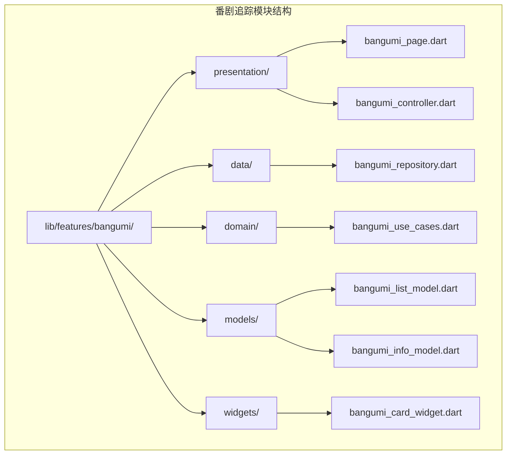
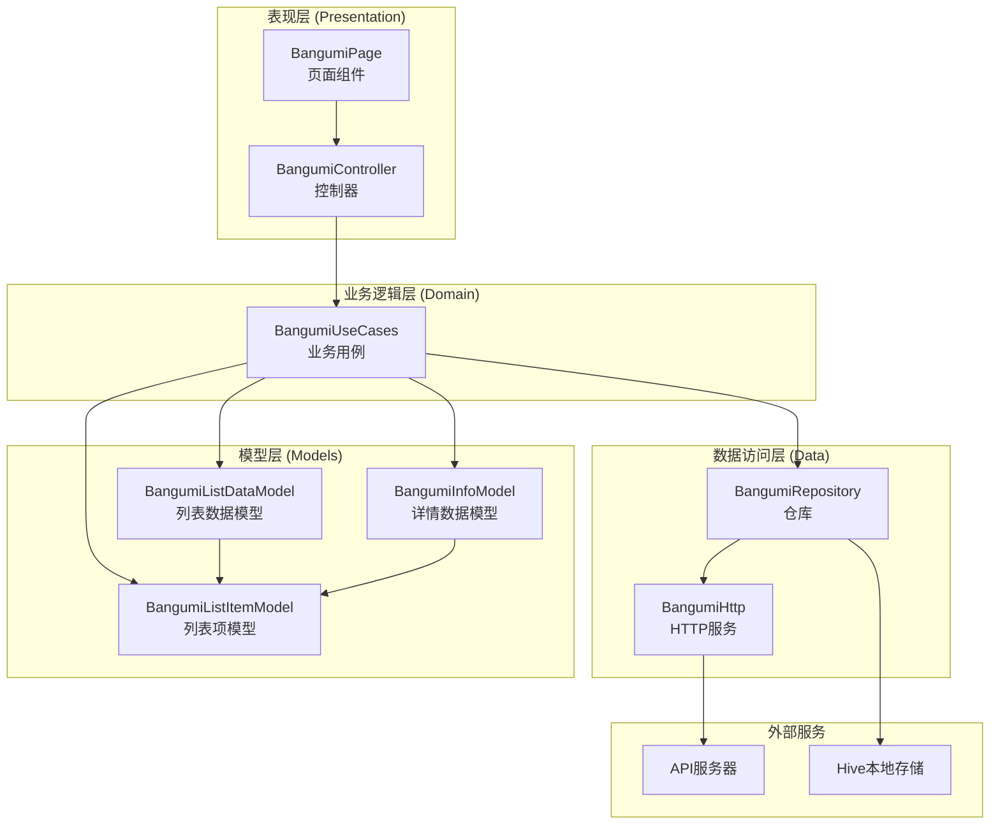
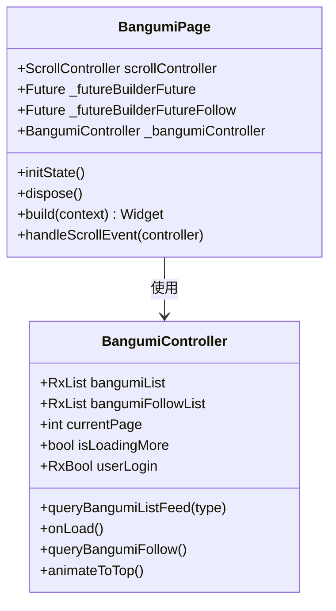
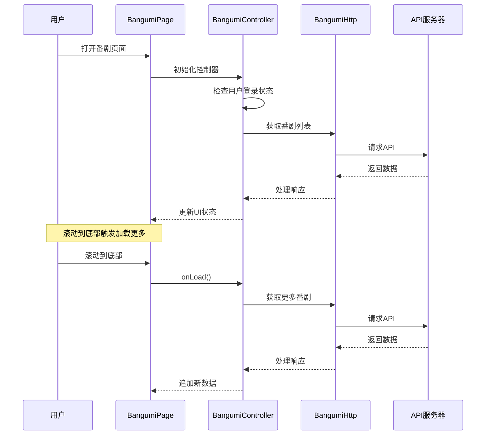
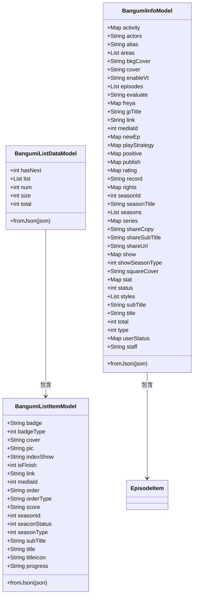
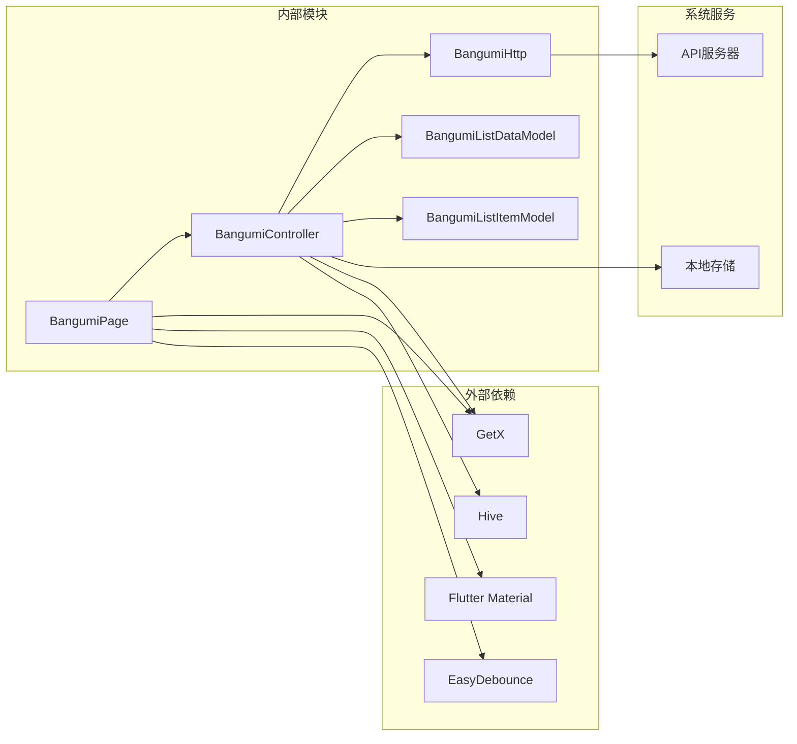

# 番剧追踪模块

<cite>
**本文档引用的文件**
- [bangumi_page.dart](file://lib/features/bangumi/presentation/bangumi_page.dart)
- [bangumi_controller.dart](file://lib/features/bangumi/presentation/bangumi_controller.dart)
- [bangumi.dart](file://lib/http/bangumi.dart)
- [list.dart](file://lib/models/bangumi/list.dart)
- [info.dart](file://lib/models/bangumi/info.dart)
</cite>

## 目录
1. [简介](#简介)
2. [项目结构](#项目结构)
3. [核心组件](#核心组件)
4. [架构概览](#架构概览)
5. [详细组件分析](#详细组件分析)
6. [依赖关系分析](#依赖关系分析)
7. [性能考虑](#性能考虑)
8. [故障排除指南](#故障排除指南)
9. [结论](#结论)

## 简介

番剧追踪模块是Pilipala应用中的一个重要功能模块，主要负责展示和管理用户的番剧订阅信息。该模块提供了两个核心功能：显示用户最近追番列表和展示全站番剧推荐列表。模块采用MVVM架构模式，结合GetX状态管理和响应式编程，实现了流畅的用户体验。

该模块的设计目标是为用户提供便捷的番剧追踪服务，包括个人订阅管理、番剧信息展示、分页加载等功能。通过与后端API的集成，用户可以实时获取最新的番剧更新信息和推荐内容。

## 项目结构

番剧追踪模块位于应用的features目录下，采用标准的Flutter模块组织方式：



**图表来源**
- [bangumi_page.dart:1-189](file://lib/features/bangumi/presentation/bangumi_page.dart#L1-L189)
- [bangumi_controller.dart:1-72](file://lib/features/bangumi/presentation/bangumi_controller.dart#L1-L72)

**章节来源**
- [bangumi_page.dart:1-189](file://lib/features/bangumi/presentation/bangumi_page.dart#L1-L189)
- [bangumi_controller.dart:1-72](file://lib/features/bangumi/presentation/bangumi_controller.dart#L1-L72)

## 核心组件

番剧追踪模块由以下核心组件构成：

### 页面组件 (BangumiPage)
页面组件负责UI渲染和用户交互处理，采用StatefulWidget实现，并集成了自动保活功能。

### 控制器组件 (BangumiController)
控制器组件是模块的核心逻辑处理单元，负责数据获取、状态管理和业务逻辑处理。

### 数据模型
模块包含完整的数据模型体系，用于处理API响应和本地存储的数据格式。

### HTTP服务
封装了与后端API的通信逻辑，提供标准化的数据获取接口。

**章节来源**
- [bangumi_page.dart:12-189](file://lib/features/bangumi/presentation/bangumi_page.dart#L12-L189)
- [bangumi_controller.dart:8-72](file://lib/features/bangumi/presentation/bangumi_controller.dart#L8-L72)

## 架构概览

番剧追踪模块采用了清晰的分层架构设计，确保了代码的可维护性和扩展性：



**图表来源**
- [bangumi_page.dart:1-189](file://lib/features/bangumi/presentation/bangumi_page.dart#L1-L189)
- [bangumi_controller.dart:1-72](file://lib/features/bangumi/presentation/bangumi_controller.dart#L1-L72)
- [bangumi.dart:1-37](file://lib/http/bangumi.dart#L1-L37)

## 详细组件分析

### BangumiPage 组件分析

BangumiPage是模块的主要UI组件，实现了复杂的滚动和加载逻辑：



**图表来源**
- [bangumi_page.dart:12-189](file://lib/features/bangumi/presentation/bangumi_page.dart#L12-L189)
- [bangumi_controller.dart:8-72](file://lib/features/bangumi/presentation/bangumi_controller.dart#L8-L72)

#### 核心功能特性

1. **自动保活机制**: 集成了AutomaticKeepAliveClientMixin，确保页面切换时保持状态
2. **双列表展示**: 同时展示"最近追番"和个人订阅列表
3. **智能滚动加载**: 实现了基于滚动位置的分页加载
4. **刷新机制**: 支持下拉刷新和手动刷新

**章节来源**
- [bangumi_page.dart:19-53](file://lib/features/bangumi/presentation/bangumi_page.dart#L19-L53)

### BangumiController 控制器分析

控制器组件是模块的核心逻辑处理单元：



**图表来源**
- [bangumi_controller.dart:29-48](file://lib/features/bangumi/presentation/bangumi_controller.dart#L29-L48)
- [bangumi.dart:5-19](file://lib/http/bangumi.dart#L5-L19)

#### 关键方法说明

1. **queryBangumiListFeed**: 获取番剧列表数据，支持初始化和加载更多两种模式
2. **onLoad**: 处理加载更多操作
3. **queryBangumiFollow**: 获取用户订阅的番剧列表
4. **animateToTop**: 提供回到顶部的动画效果

**章节来源**
- [bangumi_controller.dart:29-60](file://lib/features/bangumi/presentation/bangumi_controller.dart#L29-L60)

### 数据模型分析

模块包含完整的数据模型体系，用于处理不同场景下的数据格式：



**图表来源**
- [list.dart:1-94](file://lib/models/bangumi/list.dart#L1-L94)
- [info.dart:1-218](file://lib/models/bangumi/info.dart#L1-L218)

#### 模型设计特点

1. **类型安全**: 所有字段都定义了明确的数据类型
2. **空值处理**: 正确处理可能为空的字段
3. **JSON序列化**: 提供fromJson工厂构造函数支持JSON解析
4. **字段映射**: 处理API响应中字段名与模型属性名的差异

**章节来源**
- [list.dart:1-94](file://lib/models/bangumi/list.dart#L1-L94)
- [info.dart:1-127](file://lib/models/bangumi/info.dart#L1-L127)

### HTTP服务分析

HTTP服务层封装了所有网络请求逻辑：

```mermaid
flowchart TD
A[BangumiHttp] --> B[bangumiList]
A --> C[bangumiFollow]
B --> D[Request().get(Api.bangumiList)]
C --> E[Request().get(Api.bangumiFollow)]
D --> F{响应检查}
E --> F
F --> |code == 0| G[成功响应]
F --> |其他| H[失败响应]
G --> I[BangumiListDataModel.fromJson]
H --> J[返回错误信息]
I --> K[返回 {status: true, data}]
J --> L[返回 {status: false, msg}]
```

**图表来源**
- [bangumi.dart:4-36](file://lib/http/bangumi.dart#L4-L36)

#### 服务特点

1. **统一错误处理**: 所有API调用都经过统一的状态码检查
2. **数据转换**: 自动将原始响应转换为对应的模型对象
3. **错误传播**: 将API错误信息传递给上层组件
4. **参数验证**: 对传入的参数进行基本验证

**章节来源**
- [bangumi.dart:5-36](file://lib/http/bangumi.dart#L5-L36)

## 依赖关系分析

番剧追踪模块的依赖关系清晰明确，遵循了良好的分层设计原则：



**图表来源**
- [bangumi_page.dart:1-11](file://lib/features/bangumi/presentation/bangumi_page.dart#L1-L11)
- [bangumi_controller.dart:1-7](file://lib/features/bangumi/presentation/bangumi_controller.dart#L1-L7)

### 依赖注入和生命周期

模块采用了GetX框架的依赖注入机制，控制器通过Get.put()自动注册到全局状态管理中。页面组件在initState()中初始化控制器实例，并在dispose()中清理资源。

**章节来源**
- [bangumi_page.dart:21-27](file://lib/features/bangumi/presentation/bangumi_page.dart#L21-L27)
- [bangumi_controller.dart:19-27](file://lib/features/bangumi/presentation/bangumi_controller.dart#L19-L27)

## 性能考虑

番剧追踪模块在设计时充分考虑了性能优化：

### 内存管理
- 使用AutomaticKeepAliveClientMixin避免重复构建
- 合理的列表项复用机制
- 及时清理滚动监听器和控制器

### 网络优化
- 实现了防抖机制防止频繁请求
- 分页加载减少单次数据量
- 缓存策略提升用户体验

### UI渲染优化
- 使用FutureBuilder处理异步数据加载
- 响应式状态管理减少不必要的重建
- 智能的滚动事件处理

## 故障排除指南

### 常见问题及解决方案

1. **数据加载失败**
   - 检查网络连接状态
   - 验证API端点可用性
   - 查看错误日志获取具体原因

2. **列表显示异常**
   - 确认数据模型匹配
   - 检查JSON字段映射
   - 验证数据完整性

3. **滚动性能问题**
   - 检查是否启用了自动保活
   - 确认监听器正确移除
   - 优化列表项渲染

**章节来源**
- [bangumi.dart:12-18](file://lib/http/bangumi.dart#L12-L18)
- [bangumi_page.dart:174-178](file://lib/features/bangumi/presentation/bangumi_page.dart#L174-L178)

## 结论

番剧追踪模块展现了良好的软件工程实践，具有以下特点：

1. **架构清晰**: 采用MVVM模式，职责分离明确
2. **扩展性强**: 模块化设计便于功能扩展
3. **用户体验佳**: 流畅的交互和响应式设计
4. **代码质量高**: 良好的命名规范和注释习惯

该模块为Pilipala应用提供了完整的番剧追踪功能，为用户提供了便捷的番剧管理体验。模块的设计理念和实现方式可以作为其他功能模块开发的参考模板。