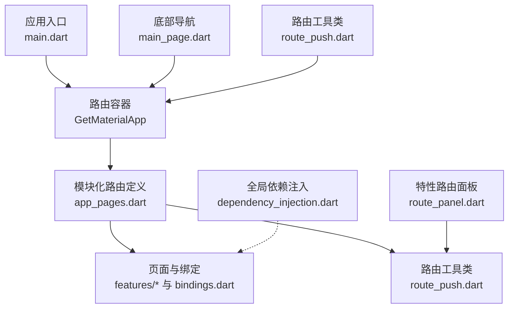
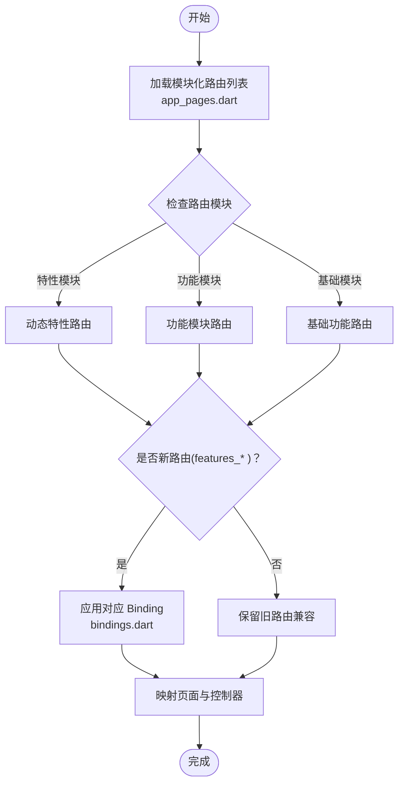
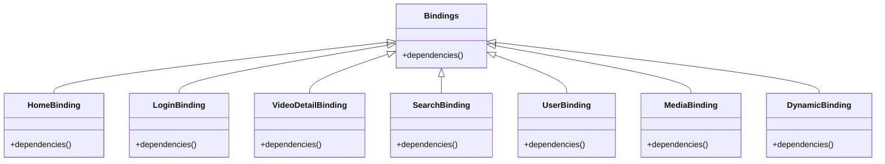
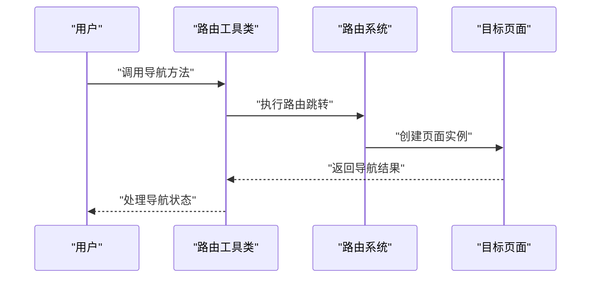
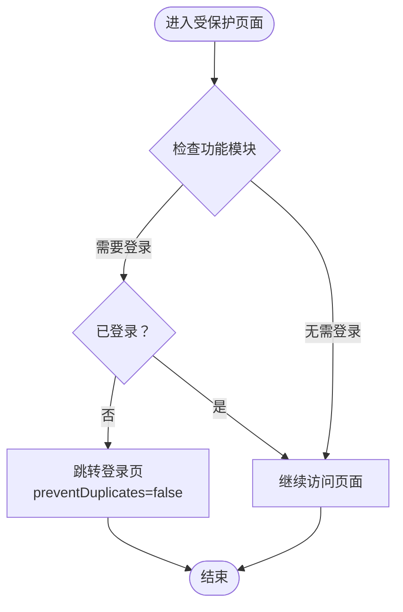
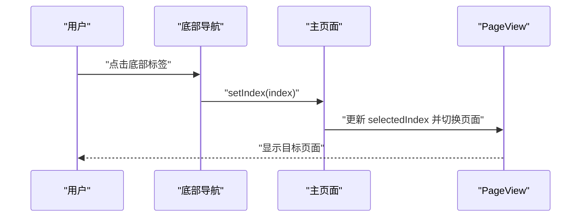
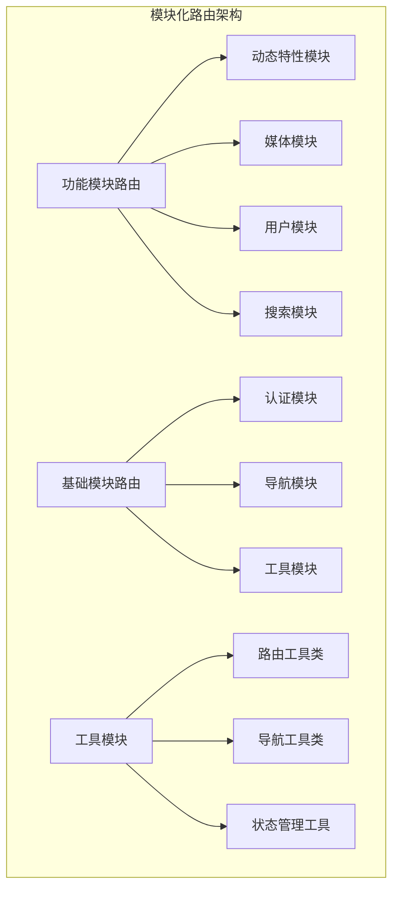
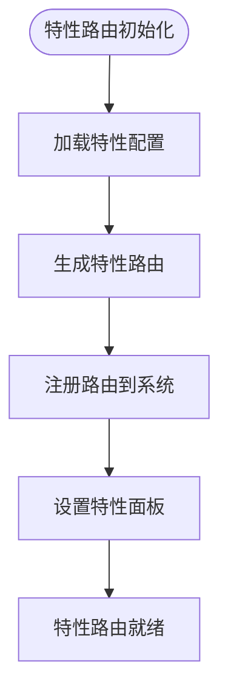
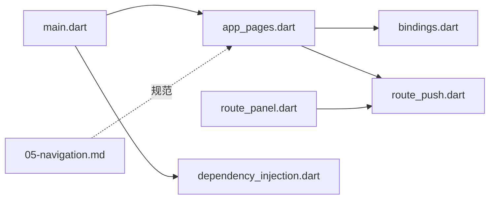

# 路由系统

<cite>
**本文引用的文件**
- [app_pages.dart](file://lib/router/app_pages.dart)
- [bindings.dart](file://lib/router/bindings.dart)
- [route_push.dart](file://lib/utils/route_push.dart)
- [route_panel.dart](file://lib/features/dynamics/presentation/up_dynamic/route_panel.dart)
- [05-navigation.md](file://docs/spec/architecture/05-navigation.md)
- [main.dart](file://lib/main.dart)
- [main_page.dart](file://lib/features/main/presentation/main_page.dart)
- [dependency_injection.dart](file://lib/core/di/dependency_injection.dart)
</cite>

## 更新摘要
**所做更改**
- 更新了路由系统架构描述，反映从扁平结构到模块化架构的重大重构
- 新增了特性路由定义和别名系统的说明
- 更新了路由配置和页面映射的相关内容
- 增强了模块化路由管理和依赖注入的说明
- 补充了新的路由工具类和特性面板路由的实现

## 目录
1. [简介](#简介)
2. [项目结构](#项目结构)
3. [核心组件](#核心组件)
4. [架构总览](#架构总览)
5. [详细组件分析](#详细组件分析)
6. [模块化路由系统](#模块化路由系统)
7. [特性路由定义](#特性路由定义)
8. [别名系统](#别名系统)
9. [依赖分析](#依赖分析)
10. [性能考虑](#性能考虑)
11. [故障排查指南](#故障排查指南)
12. [结论](#结论)
13. [附录](#附录)

## 简介
本文件系统性梳理 PiliPala 的路由体系，基于 GetX 路由框架实现命名路由与页面导航。经过重大重构，路由系统已从扁平结构迁移到模块化架构，新增了特性路由定义和别名系统。内容涵盖路由配置、页面传参、导航方法、路由守卫、底部导航、路由与状态管理的关系、最佳实践与性能优化建议，并提供路由层级结构图、导航流程图与页面跳转示例，帮助开发者快速理解与高效使用。

## 项目结构
路由系统主要由以下模块构成：
- 路由定义与页面映射：lib/router/app_pages.dart
- 路由绑定（依赖注入隔离）：lib/router/bindings.dart
- 路由工具类：lib/utils/route_push.dart
- 特性路由面板：lib/features/dynamics/presentation/up_dynamic/route_panel.dart
- 主应用入口与路由容器：lib/main.dart
- 底部导航与页面切换：lib/features/main/presentation/main_page.dart
- 全局依赖注入（核心服务）：lib/core/di/dependency_injection.dart
- 架构规范文档：docs/spec/architecture/05-navigation.md

```mermaid
graph TB
subgraph "模块化路由层"
APP["app_pages.dart<br/>路由定义与页面映射"]
BIND["bindings.dart<br/>路由绑定(依赖注入)"]
UTIL["route_push.dart<br/>路由工具类"]
END
subgraph "特性路由层"
DYNAMIC_ROUTE["route_panel.dart<br/>动态特性路由面板"]
END
subgraph "应用层"
MAIN["main.dart<br/>GetMaterialApp 与入口"]
MAINPAGE["main_page.dart<br/>底部导航与页面切换"]
END
subgraph "状态与依赖"
DI["dependency_injection.dart<br/>全局依赖注入"]
END
DOC["05-navigation.md<br/>架构规范"]
MAIN --> APP
APP --> BIND
APP --> UTIL
DYNAMIC_ROUTE --> UTIL
MAINPAGE --> MAIN
DI -.-> MAIN
DOC -.-> APP
```

**图表来源**
- [app_pages.dart:83-159](file://lib/router/app_pages.dart#L83-L159)
- [bindings.dart:22-98](file://lib/router/bindings.dart#L22-L98)
- [route_push.dart](file://lib/utils/route_push.dart)
- [route_panel.dart](file://lib/features/dynamics/presentation/up_dynamic/route_panel.dart)
- [main.dart:120-149](file://lib/main.dart#L120-L149)
- [main_page.dart:144-224](file://lib/features/main/presentation/main_page.dart#L144-L224)
- [dependency_injection.dart:31-58](file://lib/core/di/dependency_injection.dart#L31-L58)
- [05-navigation.md:1-280](file://docs/spec/architecture/05-navigation.md#L1-L280)

**章节来源**
- [app_pages.dart:83-159](file://lib/router/app_pages.dart#L83-L159)
- [bindings.dart:22-98](file://lib/router/bindings.dart#L22-L98)
- [route_push.dart](file://lib/utils/route_push.dart)
- [route_panel.dart](file://lib/features/dynamics/presentation/up_dynamic/route_panel.dart)
- [main.dart:120-149](file://lib/main.dart#L120-L149)
- [main_page.dart:144-224](file://lib/features/main/presentation/main_page.dart#L144-L224)
- [dependency_injection.dart:31-58](file://lib/core/di/dependency_injection.dart#L31-L58)
- [05-navigation.md:1-280](file://docs/spec/architecture/05-navigation.md#L1-L280)

## 核心组件
- **模块化路由定义与页面映射**
  - 所有路由在 app_pages.dart 中集中定义，采用 GetPage 列表形式，统一通过 GetMaterialApp 注入。
  - 新旧路由并存：新路由使用 features_* 命名空间的页面与绑定；旧路由保留兼容路径。
  - 模块化架构支持按功能模块组织路由，提高代码可维护性和扩展性。
- **路由绑定（Bindings）**
  - 通过自定义 Bindings 实现按路由隔离的依赖注入，避免控制器冲突与资源浪费。
  - 部分页面（如视频详情）由页面自身注入控制器，避免同路由跳转时的控制器覆盖。
- **路由工具类**
  - route_push.dart 提供统一的路由跳转工具函数，简化页面导航操作。
  - 支持参数传递、导航选项配置和错误处理。
- **特性路由面板**
  - route_panel.dart 实现动态特性路由面板，支持特性功能的灵活配置和管理。
  - 集成到主应用中，提供统一的特性路由入口。
- **主应用入口**
  - main.dart 中根据平台选择不同应用壳体，统一承载 GetMaterialApp 与路由容器。
- **底部导航**
  - main_page.dart 提供底部导航栏与 PageView 切换，支持动态徽标与动画展示。
- **全局依赖注入**
  - dependency_injection.dart 统一注册核心服务（存储、网络、主题等），供各 Feature 使用。

**章节来源**
- [app_pages.dart:83-159](file://lib/router/app_pages.dart#L83-L159)
- [bindings.dart:22-98](file://lib/router/bindings.dart#L22-L98)
- [route_push.dart](file://lib/utils/route_push.dart)
- [route_panel.dart](file://lib/features/dynamics/presentation/up_dynamic/route_panel.dart)
- [main.dart:120-149](file://lib/main.dart#L120-L149)
- [main_page.dart:144-224](file://lib/features/main/presentation/main_page.dart#L144-L224)
- [dependency_injection.dart:31-58](file://lib/core/di/dependency_injection.dart#L31-L58)

## 架构总览
下图展示了路由系统在应用中的整体交互：应用入口创建路由容器，路由定义映射页面与绑定，底部导航驱动页面切换，全局依赖注入支撑功能模块，路由工具类提供统一导航接口。



**图表来源**
- [main.dart:120-149](file://lib/main.dart#L120-L149)
- [app_pages.dart:83-159](file://lib/router/app_pages.dart#L83-L159)
- [bindings.dart:22-98](file://lib/router/bindings.dart#L22-L98)
- [route_push.dart](file://lib/utils/route_push.dart)
- [route_panel.dart](file://lib/features/dynamics/presentation/up_dynamic/route_panel.dart)
- [main_page.dart:144-224](file://lib/features/main/presentation/main_page.dart#L144-L224)
- [dependency_injection.dart:31-58](file://lib/core/di/dependency_injection.dart#L31-L58)

## 详细组件分析

### 路由配置与页面映射
- **模块化路由列表**：集中于 app_pages.dart，采用 CustomGetPage 包装 GetPage，统一设置过渡动画、手势与全屏对话框属性。
- **新旧路由并存策略**：新路由使用 features_* 页面与对应绑定；旧路由保留兼容路径，保证迁移期的稳定性。
- **模块化命名规范**：遵循小写与层级结构，按功能模块组织路由，便于维护与扩展。
- **路由分组管理**：支持按功能模块分组管理路由，提高代码组织性和可维护性。



**图表来源**
- [app_pages.dart:83-159](file://lib/router/app_pages.dart#L83-L159)
- [bindings.dart:22-98](file://lib/router/bindings.dart#L22-L98)

**章节来源**
- [app_pages.dart:83-159](file://lib/router/app_pages.dart#L83-L159)
- [05-navigation.md:7-43](file://docs/spec/architecture/05-navigation.md#L7-L43)

### 路由绑定与依赖注入隔离
- **按路由隔离的依赖注入**：Bindings 用于按路由隔离依赖注入，避免控制器与服务在同一路由跳转时相互覆盖。
- **特定页面控制器注入**：部分页面（如视频详情）由页面自身注入控制器，避免与路由绑定冲突。
- **全局依赖注入**：dependency_injection.dart 在应用启动时初始化核心服务，供各 Feature 使用。
- **模块化依赖管理**：支持按功能模块管理依赖注入，提高代码组织性和可维护性。



**图表来源**
- [bindings.dart:22-98](file://lib/router/bindings.dart#L22-L98)

**章节来源**
- [bindings.dart:22-98](file://lib/router/bindings.dart#L22-L98)
- [dependency_injection.dart:31-58](file://lib/core/di/dependency_injection.dart#L31-L58)

### 路由工具类与导航方法
- **统一导航接口**：route_push.dart 提供统一的路由跳转工具函数，简化页面导航操作。
- **参数传递优化**：支持 URL 参数与 arguments 双通道传参，URL 参数适用于简单标识符；复杂对象使用 arguments。
- **导航方法丰富**：包括跳转、替换、清空栈、返回与携带结果；支持防止重复跳转。
- **错误处理机制**：提供路由跳转的错误处理和状态管理。



**图表来源**
- [route_push.dart](file://lib/utils/route_push.dart)

**章节来源**
- [route_push.dart](file://lib/utils/route_push.dart)
- [05-navigation.md:74-129](file://docs/spec/architecture/05-navigation.md#L74-L129)

### 路由守卫与权限验证
- **登录检查机制**：在需要登录的页面进行登录状态判断，未登录则跳转至登录页并防止重复跳转。
- **路由观察者**：通过 navigatorObservers 监听路由变化，用于统计与埋点。
- **模块化权限控制**：支持按功能模块进行权限验证和路由守卫。



**图表来源**
- [05-navigation.md:138-166](file://docs/spec/architecture/05-navigation.md#L138-L166)

**章节来源**
- [05-navigation.md:138-166](file://docs/spec/architecture/05-navigation.md#L138-L166)

### 底部导航与页面切换
- **动态徽标与动画**：底部导航支持动态徽标与动画展示，PageView 控制页面切换，selectedIndex 同步更新。
- **自定义 Tab 管理**：支持自定义 Tab 顺序与隐藏逻辑，结合流式状态实现平滑动画。
- **模块化导航管理**：支持按功能模块管理底部导航项。



**图表来源**
- [main_page.dart:144-224](file://lib/features/main/presentation/main_page.dart#L144-L224)

**章节来源**
- [main_page.dart:144-224](file://lib/features/main/presentation/main_page.dart#L144-L224)

### 路由与状态管理
- **页面级状态管理**：每个页面拥有独立控制器，在页面创建时注入，避免全局污染。
- **跨页面通信**：通过 GetX 依赖注入在页面间共享状态，减少耦合。
- **生命周期管理**：在 onClose 中清理资源，确保内存安全。
- **模块化状态隔离**：支持按功能模块隔离状态管理。

**章节来源**
- [05-navigation.md:193-221](file://docs/spec/architecture/05-navigation.md#L193-L221)

## 模块化路由系统
路由系统已从传统的扁平结构迁移到模块化架构，实现了更好的代码组织和可维护性：

### 模块化架构优势
- **功能分离**：按功能模块组织路由，每个模块负责特定的功能领域
- **代码复用**：模块间可以共享通用的路由配置和工具类
- **扩展性强**：新增功能模块时无需修改现有路由配置
- **维护成本低**：模块化设计降低了单个文件的复杂度

### 模块化路由组织
- **特性模块**：如动态特性、媒体特性等独立的功能模块
- **基础模块**：提供通用的基础路由和服务
- **业务模块**：按业务领域划分的路由模块
- **工具模块**：提供路由相关的工具类和辅助功能



**图表来源**
- [app_pages.dart:83-159](file://lib/router/app_pages.dart#L83-L159)
- [route_push.dart](file://lib/utils/route_push.dart)

**章节来源**
- [app_pages.dart:83-159](file://lib/router/app_pages.dart#L83-L159)
- [route_push.dart](file://lib/utils/route_push.dart)

## 特性路由定义
新增的特性路由系统允许动态定义和管理功能特性的路由：

### 特性路由面板
- **动态路由生成**：route_panel.dart 实现动态特性路由面板，支持特性功能的灵活配置
- **特性管理**：提供特性的添加、删除、修改和排序功能
- **路由配置**：支持为每个特性配置独立的路由规则和参数

### 特性路由特点
- **灵活性**：支持动态添加和移除特性路由
- **可配置性**：每个特性路由都可以独立配置
- **可扩展性**：新的特性可以轻松集成到现有路由系统中
- **可维护性**：特性路由集中管理，便于维护和更新



**图表来源**
- [route_panel.dart](file://lib/features/dynamics/presentation/up_dynamic/route_panel.dart)

**章节来源**
- [route_panel.dart](file://lib/features/dynamics/presentation/up_dynamic/route_panel.dart)

## 别名系统
路由系统新增了别名系统，提供更灵活的路由访问方式：

### 别名系统功能
- **路由别名**：为常用路由定义简短的别名，便于记忆和使用
- **多语言支持**：支持为不同语言环境定义路由别名
- **向后兼容**：通过别名保持旧版本路由的兼容性
- **SEO友好**：别名可以包含有意义的关键词

### 别名管理
- **别名注册**：在路由配置中注册别名与实际路由的映射关系
- **别名解析**：系统自动解析别名并重定向到对应的路由
- **别名验证**：确保别名的唯一性和有效性
- **别名缓存**：提高别名解析的性能


**图表来源**
- [app_pages.dart:83-159](file://lib/router/app_pages.dart#L83-L159)

**章节来源**
- [app_pages.dart:83-159](file://lib/router/app_pages.dart#L83-L159)

## 依赖分析
- **模块化路由层依赖**
  - app_pages.dart 依赖 bindings.dart 中的路由绑定，实现按路由隔离的依赖注入。
  - route_push.dart 作为路由工具类被所有功能模块共享使用。
  - route_panel.dart 依赖路由工具类实现特性路由管理。
- **状态与依赖**
  - dependency_injection.dart 提供全局服务注册，供各 Feature 使用。
- **文档与规范**
  - 05-navigation.md 提供路由命名、传参、导航与守卫的规范说明。



**图表来源**
- [main.dart:120-149](file://lib/main.dart#L120-L149)
- [app_pages.dart:83-159](file://lib/router/app_pages.dart#L83-L159)
- [bindings.dart:22-98](file://lib/router/bindings.dart#L22-L98)
- [route_push.dart](file://lib/utils/route_push.dart)
- [route_panel.dart](file://lib/features/dynamics/presentation/up_dynamic/route_panel.dart)
- [dependency_injection.dart:31-58](file://lib/core/di/dependency_injection.dart#L31-L58)
- [05-navigation.md:1-280](file://docs/spec/architecture/05-navigation.md#L1-L280)

**章节来源**
- [main.dart:120-149](file://lib/main.dart#L120-L149)
- [app_pages.dart:83-159](file://lib/router/app_pages.dart#L83-L159)
- [bindings.dart:22-98](file://lib/router/bindings.dart#L22-L98)
- [route_push.dart](file://lib/utils/route_push.dart)
- [route_panel.dart](file://lib/features/dynamics/presentation/up_dynamic/route_panel.dart)
- [dependency_injection.dart:31-58](file://lib/core/di/dependency_injection.dart#L31-L58)
- [05-navigation.md:1-280](file://docs/spec/architecture/05-navigation.md#L1-L280)

## 性能考虑
- **模块化性能优化**：模块化架构支持按需加载，减少不必要的路由初始化。
- **防重复跳转**：使用 preventDuplicates 避免同一页面重复入栈。
- **延迟注入**：优先使用 Get.lazyPut，按需创建依赖，降低启动开销。
- **控制器生命周期**：在 onClose 中释放资源，避免内存泄漏。
- **参数传递优化**：URL 仅传递轻量标识，复杂对象使用 arguments 或服务层获取。
- **导航深度控制**：避免超过三层嵌套导航，提升用户体验与性能。
- **别名解析优化**：别名系统采用缓存机制，提高别名解析性能。
- **特性路由懒加载**：特性路由按需加载，减少初始启动时间。

**章节来源**
- [05-navigation.md:131-136](file://docs/spec/architecture/05-navigation.md#L131-L136)
- [05-navigation.md:273-279](file://docs/spec/architecture/05-navigation.md#L273-L279)

## 故障排查指南
- **模块化路由问题**
  - 检查模块化路由配置是否正确，确认 app_pages.dart 中是否存在该模块路由。
  - 确认目标页面对应的 Binding 是否存在且正确注入。
  - 验证模块间的依赖关系是否正确配置。
- **特性路由问题**
  - 检查特性路由面板配置是否正确。
  - 确认特性路由的别名是否正确解析。
  - 验证特性路由的参数传递是否正常。
- **别名系统问题**
  - 检查别名配置是否正确，确认别名与实际路由的映射关系。
  - 确认别名解析器是否正常工作。
  - 验证别名的唯一性和有效性。
- **路由工具类问题**
  - 检查路由工具类的导入和使用是否正确。
  - 确认路由参数传递是否符合预期。
  - 验证路由跳转的错误处理机制。
- **参数丢失或类型错误**
  - URL 参数仅适用于简单标识符；复杂对象使用 arguments。
  - 在控制器 onInit 中进行参数校验与类型转换。
- **页面切换异常**
  - 检查底部导航 selectedIndex 与 PageView 的同步逻辑。
  - 确认动画与滚动控制设置是否合理。
- **登录状态异常**
  - 在进入受保护页面前进行登录检查，未登录时跳转登录页并设置 preventDuplicates。

**章节来源**
- [app_pages.dart:83-159](file://lib/router/app_pages.dart#L83-L159)
- [bindings.dart:22-98](file://lib/router/bindings.dart#L22-L98)
- [route_push.dart](file://lib/utils/route_push.dart)
- [route_panel.dart](file://lib/features/dynamics/presentation/up_dynamic/route_panel.dart)
- [05-navigation.md:138-166](file://docs/spec/architecture/05-navigation.md#L138-L166)
- [main_page.dart:144-224](file://lib/features/main/presentation/main_page.dart#L144-L224)

## 结论
PiliPala 的路由系统经过重大重构，已从扁平结构迁移到模块化架构，新增了特性路由定义和别名系统。新的模块化架构通过集中路由定义、按路由隔离的依赖注入、统一的路由工具类和灵活的特性路由管理，实现了高内聚、低耦合的页面导航体系。配合底部导航、参数传递与路由守卫，满足多场景下的导航需求。新增的别名系统提供了更灵活的路由访问方式，增强了系统的可用性和可维护性。遵循本文的最佳实践与性能建议，可进一步提升开发效率与运行性能。

## 附录
- **模块化路由最佳实践**：按功能模块组织路由，避免单个文件过于庞大。
- **特性路由管理**：定期审查和优化特性路由配置，确保系统的灵活性。
- **别名系统维护**：建立别名变更的审查流程，确保系统的稳定性。
- **路由性能监控**：监控路由加载时间和内存使用情况，及时发现性能问题。
- **路由文档维护**：保持路由文档与代码同步，提供准确的技术文档。

**章节来源**
- [05-navigation.md:45-73](file://docs/spec/architecture/05-navigation.md#L45-L73)
- [05-navigation.md:110-129](file://docs/spec/architecture/05-navigation.md#L110-L129)