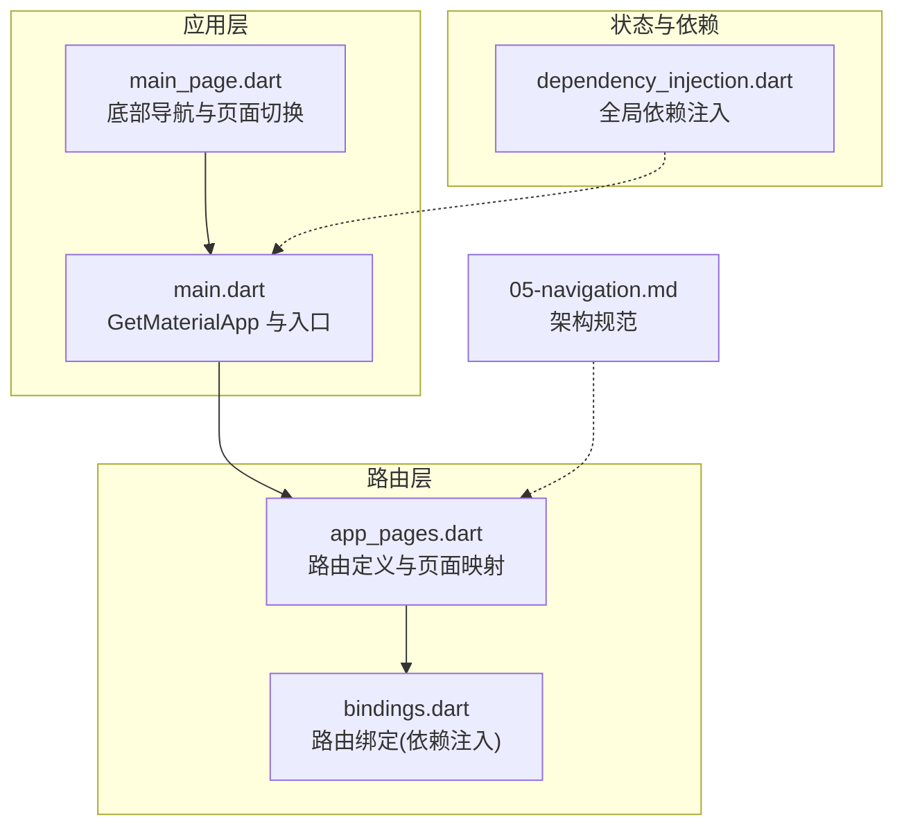
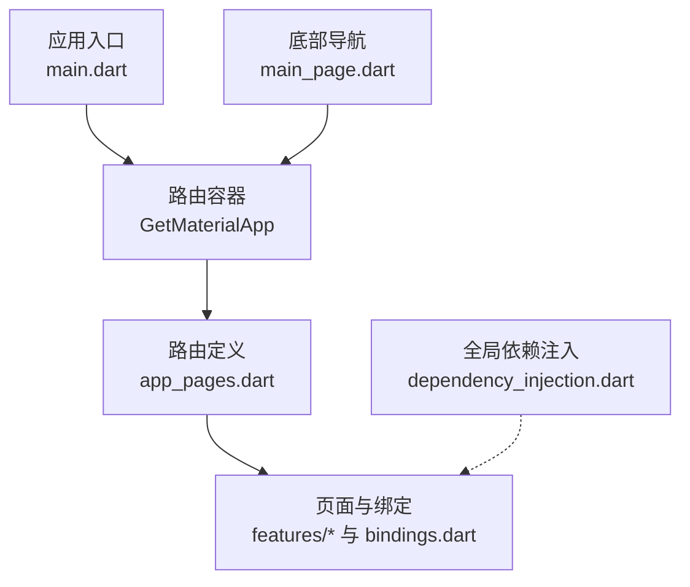
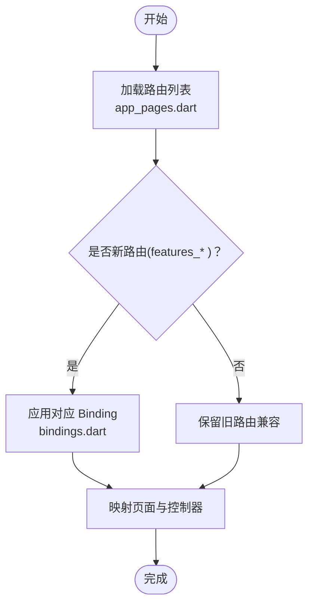
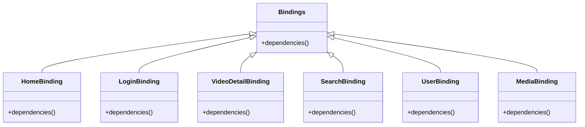
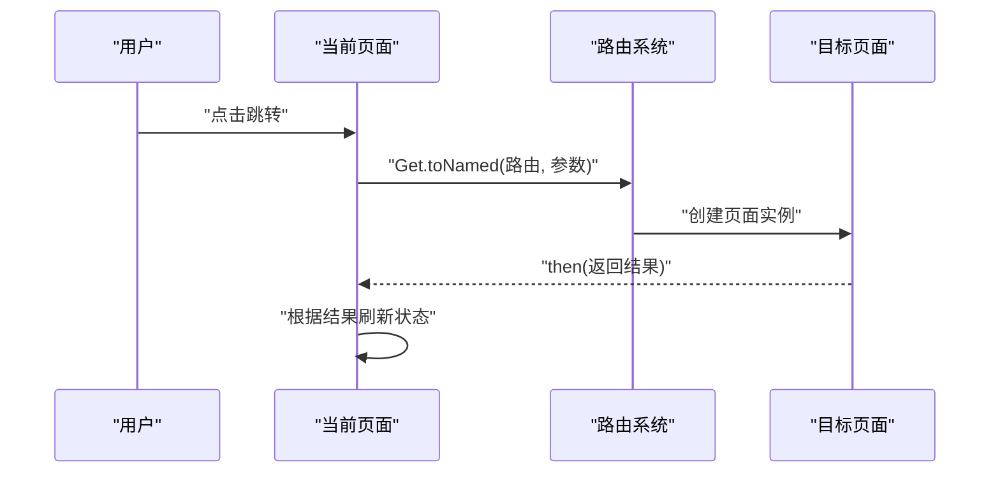
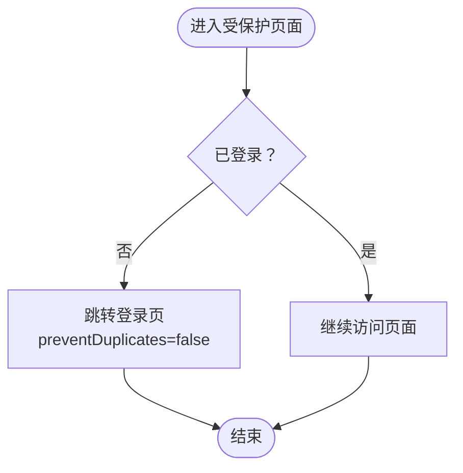
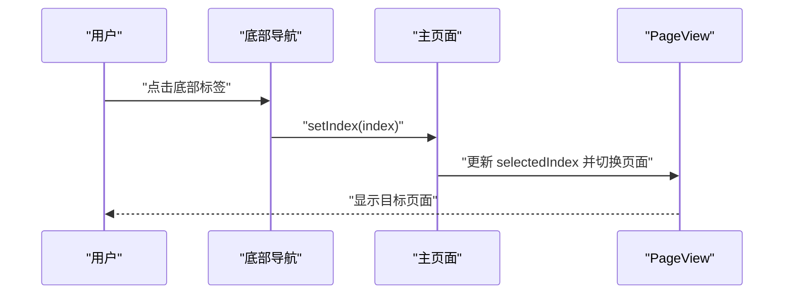
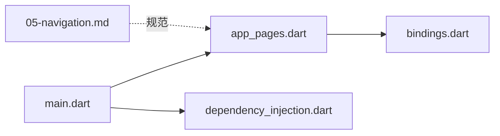

# 路由系统

<cite>
**本文引用的文件**
- [app_pages.dart](file://lib/router/app_pages.dart)
- [bindings.dart](file://lib/router/bindings.dart)
- [05-navigation.md](file://docs/spec/architecture/05-navigation.md)
- [main.dart](file://lib/main.dart)
- [main_page.dart](file://lib/features/main/presentation/main_page.dart)
- [dependency_injection.dart](file://lib/core/di/dependency_injection.dart)
</cite>

## 目录
1. [简介](#简介)
2. [项目结构](#项目结构)
3. [核心组件](#核心组件)
4. [架构总览](#架构总览)
5. [详细组件分析](#详细组件分析)
6. [依赖分析](#依赖分析)
7. [性能考虑](#性能考虑)
8. [故障排查指南](#故障排查指南)
9. [结论](#结论)
10. [附录](#附录)

## 简介
本文件系统性梳理 PiliPala 的路由体系，基于 GetX 路由框架实现命名路由与页面导航。内容涵盖路由配置、页面传参、导航方法、路由守卫、底部导航、路由与状态管理的关系、最佳实践与性能优化建议，并提供路由层级结构图、导航流程图与页面跳转示例，帮助开发者快速理解与高效使用。

## 项目结构
路由系统主要由以下模块构成：
- 路由定义与页面映射：lib/router/app_pages.dart
- 路由绑定（依赖注入隔离）：lib/router/bindings.dart
- 主应用入口与路由容器：lib/main.dart
- 底部导航与页面切换：lib/features/main/presentation/main_page.dart
- 全局依赖注入（核心服务）：lib/core/di/dependency_injection.dart
- 架构规范文档：docs/spec/architecture/05-navigation.md

图表来源
- [app_pages.dart:83-159](file://lib/router/app_pages.dart#L83-L159)
- [bindings.dart:22-98](file://lib/router/bindings.dart#L22-L98)
- [main.dart:120-149](file://lib/main.dart#L120-L149)
- [main_page.dart:144-224](file://lib/features/main/presentation/main_page.dart#L144-L224)
- [dependency_injection.dart:31-58](file://lib/core/di/dependency_injection.dart#L31-L58)
- [05-navigation.md:1-280](file://docs/spec/architecture/05-navigation.md#L1-L280)

章节来源
- [app_pages.dart:83-159](file://lib/router/app_pages.dart#L83-L159)
- [bindings.dart:22-98](file://lib/router/bindings.dart#L22-L98)
- [main.dart:120-149](file://lib/main.dart#L120-L149)
- [main_page.dart:144-224](file://lib/features/main/presentation/main_page.dart#L144-L224)
- [dependency_injection.dart:31-58](file://lib/core/di/dependency_injection.dart#L31-L58)
- [05-navigation.md:1-280](file://docs/spec/architecture/05-navigation.md#L1-L280)

## 核心组件
- 路由定义与页面映射
  - 所有路由在 app_pages.dart 中集中定义，采用 GetPage 列表形式，统一通过 GetMaterialApp 注入。
  - 新旧路由并存：新路由使用 features_* 命名空间的页面与绑定；旧路由保留兼容路径。
- 路由绑定（Bindings）
  - 通过自定义 Bindings 实现按路由隔离的依赖注入，避免控制器冲突与资源浪费。
  - 部分页面（如视频详情）由页面自身注入控制器，避免同路由跳转时的控制器覆盖。
- 主应用入口
  - main.dart 中根据平台选择不同应用壳体，统一承载 GetMaterialApp 与路由容器。
- 底部导航
  - main_page.dart 提供底部导航栏与 PageView 切换，支持动态徽标与动画展示。
- 全局依赖注入
  - dependency_injection.dart 统一注册核心服务（存储、网络、主题等），供各 Feature 使用。

章节来源
- [app_pages.dart:83-159](file://lib/router/app_pages.dart#L83-L159)
- [bindings.dart:22-98](file://lib/router/bindings.dart#L22-L98)
- [main.dart:120-149](file://lib/main.dart#L120-L149)
- [main_page.dart:144-224](file://lib/features/main/presentation/main_page.dart#L144-L224)
- [dependency_injection.dart:31-58](file://lib/core/di/dependency_injection.dart#L31-L58)

## 架构总览
下图展示了路由系统在应用中的整体交互：应用入口创建路由容器，路由定义映射页面与绑定，底部导航驱动页面切换，全局依赖注入支撑功能模块。

图表来源
- [main.dart:120-149](file://lib/main.dart#L120-L149)
- [app_pages.dart:83-159](file://lib/router/app_pages.dart#L83-L159)
- [bindings.dart:22-98](file://lib/router/bindings.dart#L22-L98)
- [main_page.dart:144-224](file://lib/features/main/presentation/main_page.dart#L144-L224)
- [dependency_injection.dart:31-58](file://lib/core/di/dependency_injection.dart#L31-L58)

## 详细组件分析

### 路由配置与页面映射
- 路由列表集中于 app_pages.dart，采用 CustomGetPage 包装 GetPage，统一设置过渡动画、手势与全屏对话框属性。
- 新旧路由并存策略：新路由使用 features_* 页面与对应绑定；旧路由保留兼容路径，保证迁移期的稳定性。
- 路由命名规范遵循小写与层级结构，便于维护与扩展。

图表来源
- [app_pages.dart:83-159](file://lib/router/app_pages.dart#L83-L159)
- [bindings.dart:22-98](file://lib/router/bindings.dart#L22-L98)

章节来源
- [app_pages.dart:83-159](file://lib/router/app_pages.dart#L83-L159)
- [05-navigation.md:7-43](file://docs/spec/architecture/05-navigation.md#L7-L43)

### 路由绑定与依赖注入隔离
- Bindings 用于按路由隔离依赖注入，避免控制器与服务在同一路由跳转时相互覆盖。
- 特定页面（如视频详情）由页面自身注入控制器，避免与路由绑定冲突。
- 全局依赖注入在应用启动时初始化核心服务，供各 Feature 使用。

图表来源
- [bindings.dart:22-98](file://lib/router/bindings.dart#L22-L98)

章节来源
- [bindings.dart:22-98](file://lib/router/bindings.dart#L22-L98)
- [dependency_injection.dart:31-58](file://lib/core/di/dependency_injection.dart#L31-L58)

### 页面传参与导航方法
- URL 参数与 arguments 双通道传参：URL 参数适用于简单标识符；复杂对象使用 arguments。
- 导航方法包括跳转、替换、清空栈、返回与携带结果；支持防止重复跳转。
- 参数验证与页面返回监听：在控制器初始化阶段校验参数，使用 then 监听返回结果。

图表来源
- [05-navigation.md:74-129](file://docs/spec/architecture/05-navigation.md#L74-L129)

章节来源
- [05-navigation.md:74-129](file://docs/spec/architecture/05-navigation.md#L74-L129)

### 路由守卫与权限验证
- 登录检查：在需要登录的页面进行登录状态判断，未登录则跳转至登录页并防止重复跳转。
- 路由观察者：通过 navigatorObservers 监听路由变化，用于统计与埋点。

图表来源
- [05-navigation.md:138-166](file://docs/spec/architecture/05-navigation.md#L138-L166)

章节来源
- [05-navigation.md:138-166](file://docs/spec/architecture/05-navigation.md#L138-L166)

### 底部导航与页面切换
- 底部导航支持动态徽标与动画展示，PageView 控制页面切换，selectedIndex 同步更新。
- 支持自定义 Tab 顺序与隐藏逻辑，结合流式状态实现平滑动画。

图表来源
- [main_page.dart:144-224](file://lib/features/main/presentation/main_page.dart#L144-L224)

章节来源
- [main_page.dart:144-224](file://lib/features/main/presentation/main_page.dart#L144-L224)

### 路由与状态管理
- 页面级状态：每个页面拥有独立控制器，在页面创建时注入，避免全局污染。
- 跨页面通信：通过 GetX 依赖注入在页面间共享状态，减少耦合。
- 生命周期管理：在 onClose 中清理资源，确保内存安全。

章节来源
- [05-navigation.md:193-221](file://docs/spec/architecture/05-navigation.md#L193-L221)

## 依赖分析
- 路由层依赖
  - app_pages.dart 依赖 bindings.dart 中的路由绑定，实现按路由隔离的依赖注入。
  - main.dart 作为入口，承载 GetMaterialApp 与路由容器。
- 状态与依赖
  - dependency_injection.dart 提供全局服务注册，供各 Feature 使用。
- 文档与规范
  - 05-navigation.md 提供路由命名、传参、导航与守卫的规范说明。

图表来源
- [main.dart:120-149](file://lib/main.dart#L120-L149)
- [app_pages.dart:83-159](file://lib/router/app_pages.dart#L83-L159)
- [bindings.dart:22-98](file://lib/router/bindings.dart#L22-L98)
- [dependency_injection.dart:31-58](file://lib/core/di/dependency_injection.dart#L31-L58)
- [05-navigation.md:1-280](file://docs/spec/architecture/05-navigation.md#L1-L280)

章节来源
- [main.dart:120-149](file://lib/main.dart#L120-L149)
- [app_pages.dart:83-159](file://lib/router/app_pages.dart#L83-L159)
- [bindings.dart:22-98](file://lib/router/bindings.dart#L22-L98)
- [dependency_injection.dart:31-58](file://lib/core/di/dependency_injection.dart#L31-L58)
- [05-navigation.md:1-280](file://docs/spec/architecture/05-navigation.md#L1-L280)

## 性能考虑
- 防止重复跳转：使用 preventDuplicates 避免同一页面重复入栈。
- 延迟注入：优先使用 Get.lazyPut，按需创建依赖，降低启动开销。
- 控制器生命周期：在 onClose 中释放资源，避免内存泄漏。
- 参数传递优化：URL 仅传递轻量标识，复杂对象使用 arguments 或服务层获取。
- 导航深度控制：避免超过三层嵌套导航，提升用户体验与性能。

章节来源
- [05-navigation.md:131-136](file://docs/spec/architecture/05-navigation.md#L131-L136)
- [05-navigation.md:273-279](file://docs/spec/architecture/05-navigation.md#L273-L279)

## 故障排查指南
- 路由无法跳转
  - 检查路由名称是否正确，确认 app_pages.dart 中是否存在该路由。
  - 确认目标页面对应的 Binding 是否存在且正确注入。
- 参数丢失或类型错误
  - URL 参数仅适用于简单标识符；复杂对象使用 arguments。
  - 在控制器 onInit 中进行参数校验与类型转换。
- 页面切换异常
  - 检查底部导航 selectedIndex 与 PageView 的同步逻辑。
  - 确认动画与滚动控制设置是否合理。
- 登录状态异常
  - 在进入受保护页面前进行登录检查，未登录时跳转登录页并设置 preventDuplicates。

章节来源
- [app_pages.dart:83-159](file://lib/router/app_pages.dart#L83-L159)
- [bindings.dart:22-98](file://lib/router/bindings.dart#L22-L98)
- [05-navigation.md:138-166](file://docs/spec/architecture/05-navigation.md#L138-L166)
- [main_page.dart:144-224](file://lib/features/main/presentation/main_page.dart#L144-L224)

## 结论
PiliPala 的路由系统以 GetX 为核心，通过集中路由定义、按路由隔离的依赖注入与清晰的导航规范，实现了高内聚、低耦合的页面导航体系。配合底部导航、参数传递与路由守卫，满足多场景下的导航需求。遵循本文的最佳实践与性能建议，可进一步提升开发效率与运行性能。

## 附录
- 路由命名规范与常用路由列表可参考架构规范文档。
- 页面跳转示例与参数传递方法请参考导航规范中的示例与说明。

章节来源
- [05-navigation.md:45-73](file://docs/spec/architecture/05-navigation.md#L45-L73)
- [05-navigation.md:110-129](file://docs/spec/architecture/05-navigation.md#L110-L129)