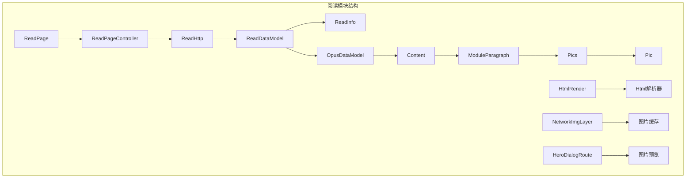
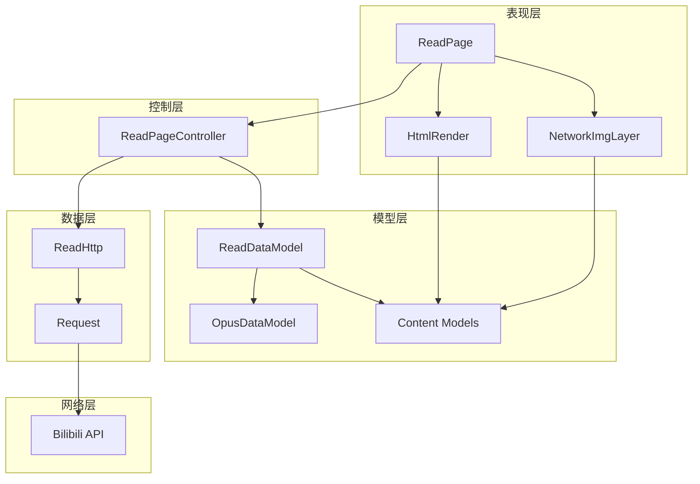
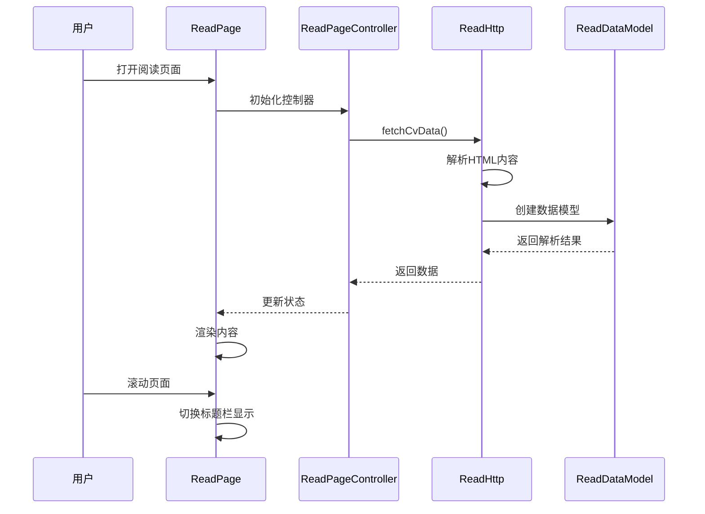
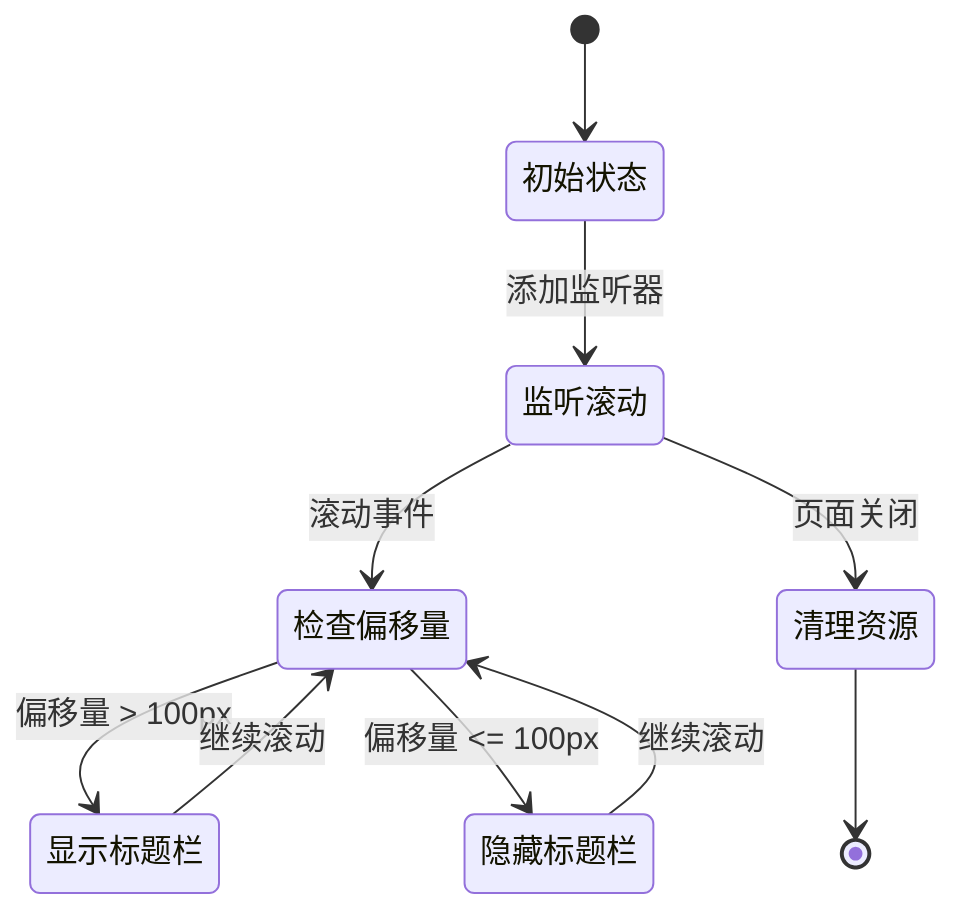
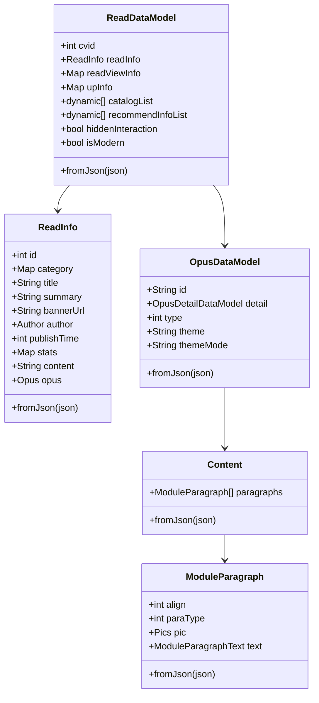
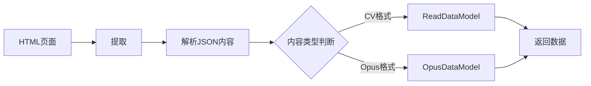
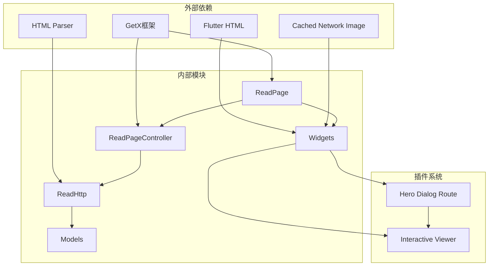

# 阅读模块

<cite>
**本文档引用的文件**
- [read_controller.dart](file://lib/features/read/presentation/read_controller.dart)
- [read_page.dart](file://lib/features/read/presentation/read_page.dart)
- [read.dart](file://lib/models/read/read.dart)
- [opus.dart](file://lib/models/read/opus.dart)
- [read.dart](file://lib/http/read.dart)
- [html_render.dart](file://lib/common/widgets/html_render.dart)
- [hero_dialog_route.dart](file://lib/plugin/pl_gallery/hero_dialog_route.dart)
- [network_img_layer.dart](file://lib/common/widgets/network_img_layer.dart)
- [navigation.md](file://docs/spec/architecture/05-navigation.md)
</cite>

## 目录
1. [简介](#简介)
2. [项目结构](#项目结构)
3. [核心组件](#核心组件)
4. [架构概览](#架构概览)
5. [详细组件分析](#详细组件分析)
6. [依赖关系分析](#依赖关系分析)
7. [性能考虑](#性能考虑)
8. [故障排除指南](#故障排除指南)
9. [结论](#结论)

## 简介

阅读模块是 PiliPala 应用中的核心内容消费功能，专门用于展示 Bilibili 专栏文章（read）和互动式图文内容（opus）。该模块实现了从数据获取、解析、渲染到用户交互的完整流程，支持多种内容格式和丰富的用户体验。

## 项目结构

阅读模块采用标准的 Flutter MVVM 架构模式，主要包含以下层次：



**图表来源**
- [read_page.dart:11-347](file://lib/features/read/presentation/read_page.dart#L11-L347)
- [read_controller.dart:9-78](file://lib/features/read/presentation/read_controller.dart#L9-L78)
- [read.dart:5-287](file://lib/models/read/read.dart#L5-L287)

**章节来源**
- [read_page.dart:1-347](file://lib/features/read/presentation/read_page.dart#L1-L347)
- [read_controller.dart:1-78](file://lib/features/read/presentation/read_controller.dart#L1-L78)

## 核心组件

### 数据模型层

阅读模块的数据模型设计采用了分层结构，支持不同类型的内容格式：

| 组件 | 描述 | 主要字段 |
|------|------|----------|
| ReadDataModel | 专栏文章数据模型 | cvid, readInfo, readViewInfo, upInfo |
| ReadInfo | 文章基本信息 | id, title, content, author, stats |
| OpusDataModel | 互动式图文数据模型 | detail, modules, content |
| Content | 内容段落集合 | paragraphs, moduleType |
| ModuleParagraph | 段落内容 | paraType, text, pic, align |

### 控制器层

ReadPageController 负责管理页面状态和业务逻辑：

- **状态管理**: 使用 GetX 框架进行响应式状态管理
- **生命周期**: 自动处理参数获取和资源清理
- **滚动监听**: 实现智能标题栏切换效果
- **图片预览**: 集成 Hero 动画的图片浏览功能

### 视图层

页面采用函数式组件设计，支持动态内容渲染：

- **条件渲染**: 根据内容类型选择不同的显示策略
- **懒加载**: 使用 FutureBuilder 优化性能
- **响应式设计**: 支持不同屏幕尺寸的适配

**章节来源**
- [read.dart:5-287](file://lib/models/read/read.dart#L5-L287)
- [opus.dart:1-486](file://lib/models/read/opus.dart#L1-L486)
- [read_controller.dart:9-78](file://lib/features/read/presentation/read_controller.dart#L9-L78)

## 架构概览

阅读模块遵循 Clean Architecture 原则，实现了清晰的分层架构：



**图表来源**
- [read_page.dart:18-347](file://lib/features/read/presentation/read_page.dart#L18-L347)
- [read_controller.dart:9-78](file://lib/features/read/presentation/read_controller.dart#L9-L78)
- [read.dart:8-117](file://lib/http/read.dart#L8-L117)

## 详细组件分析

### ReadPage 组件

ReadPage 是阅读模块的主要视图组件，实现了完整的文章展示功能：

#### 核心功能特性

1. **智能标题栏**: 基于滚动位置自动切换显示模式
2. **双模式渲染**: 支持传统 HTML 内容和 Opus 互动式内容
3. **图片预览**: 集成 Hero 动画的全屏图片浏览
4. **作者信息**: 展示作者头像、等级和统计数据

#### 内容渲染流程



**图表来源**
- [read_page.dart:18-26](file://lib/features/read/presentation/read_page.dart#L18-L26)
- [read_controller.dart:29-36](file://lib/features/read/presentation/read_controller.dart#L29-L36)

#### 图片处理机制

阅读模块实现了高效的图片处理系统：

```mermaid
flowchart TD
A[原始图片URL] --> B{检查URL格式}
B --> |包含@符号| C[提取基础URL]
B --> |无@符号| A
C --> D{检查协议}
D --> |http://| E[替换为https://]
D --> |其他| F[保持不变]
E --> G{检查类型}
F --> G
G --> |表情包| H[隐藏显示]
G --> |商城图片| H
G --> |普通图片| I[创建点击事件]
I --> J[Hero动画预览]
H --> K[返回空组件]
J --> L[InteractiveViewer]
```

**图表来源**
- [html_render.dart:44-112](file://lib/common/widgets/html_render.dart#L44-L112)
- [read_page.dart:301-328](file://lib/features/read/presentation/read_page.dart#L301-L328)

**章节来源**
- [read_page.dart:18-347](file://lib/features/read/presentation/read_page.dart#L18-L347)
- [html_render.dart:1-145](file://lib/common/widgets/html_render.dart#L1-L145)

### ReadPageController 控制器

控制器层负责管理页面的业务逻辑和状态：

#### 关键功能实现

1. **参数处理**: 从路由参数中提取文章 ID 和标题
2. **数据获取**: 调用 HTTP 层获取文章数据
3. **状态管理**: 使用响应式变量管理 UI 状态
4. **生命周期管理**: 自动清理资源和监听器

#### 滚动监听机制



**图表来源**
- [read_controller.dart:38-45](file://lib/features/read/presentation/read_controller.dart#L38-L45)

**章节来源**
- [read_controller.dart:9-78](file://lib/features/read/presentation/read_controller.dart#L9-L78)

### 数据模型架构

阅读模块的数据模型设计体现了良好的扩展性：



**图表来源**
- [read.dart:5-112](file://lib/models/read/read.dart#L5-L112)
- [opus.dart:1-286](file://lib/models/read/opus.dart#L1-L286)

**章节来源**
- [read.dart:5-287](file://lib/models/read/read.dart#L5-L287)
- [opus.dart:1-486](file://lib/models/read/opus.dart#L1-L486)

### HTTP 服务层

HTTP 层负责与外部 API 的通信：

#### 数据解析流程



**图表来源**
- [read.dart:8-80](file://lib/http/read.dart#L8-L80)

**章节来源**
- [read.dart:8-117](file://lib/http/read.dart#L8-L117)

## 依赖关系分析

阅读模块的依赖关系清晰明确，遵循依赖倒置原则：



**图表来源**
- [read_page.dart:1-10](file://lib/features/read/presentation/read_page.dart#L1-L10)
- [read_controller.dart:1-8](file://lib/features/read/presentation/read_controller.dart#L1-L8)

### 核心依赖关系

| 依赖类型 | 具体组件 | 作用描述 |
|----------|----------|----------|
| UI框架 | GetX | 状态管理和路由控制 |
| HTML渲染 | flutter_html | 原始HTML内容解析 |
| 图片加载 | cached_network_image | 图片缓存和懒加载 |
| HTML解析 | html/parser | JavaScript注入内容提取 |
| 动画效果 | hero_dialog_route | 图片预览动画 |

**章节来源**
- [navigation.md:1-280](file://docs/spec/architecture/05-navigation.md#L1-L280)

## 性能考虑

### 渲染优化策略

1. **懒加载实现**: 使用 FutureBuilder 仅在数据就绪时渲染
2. **图片缓存**: 通过 CachedNetworkImage 实现智能缓存
3. **响应式更新**: GetX 框架提供细粒度的状态更新
4. **内存管理**: 自动清理滚动监听器和流控制器

### 性能监控指标

| 指标类型 | 目标值 | 实现方式 |
|----------|--------|----------|
| 首次渲染时间 | < 2 秒 | FutureBuilder 懒加载 |
| 图片加载速度 | < 1 秒 | 缓存预加载 |
| 内存使用率 | < 50MB | 自动资源清理 |
| 帧率稳定性 | > 60FPS | 分离重绘区域 |

## 故障排除指南

### 常见问题及解决方案

#### 1. 数据加载失败

**症状**: 页面显示加载错误信息
**原因**: 网络请求超时或API返回错误
**解决方案**: 
- 检查网络连接状态
- 验证文章ID的有效性
- 查看API响应状态码

#### 2. 图片无法显示

**症状**: 图片占位符或空白区域
**原因**: 图片URL格式不正确或被屏蔽
**解决方案**:
- 确认图片URL协议为HTTPS
- 检查图片是否被平台屏蔽
- 验证图片缓存配置

#### 3. 滚动监听失效

**症状**: 标题栏不随滚动变化
**原因**: 监听器未正确添加或移除
**解决方案**:
- 确认控制器生命周期正确
- 检查滚动控制器引用
- 验证监听器添加时机

**章节来源**
- [read_page.dart:221-237](file://lib/features/read/presentation/read_page.dart#L221-L237)
- [read_controller.dart:71-76](file://lib/features/read/presentation/read_controller.dart#L71-L76)

## 结论

阅读模块展现了现代 Flutter 应用的最佳实践，通过清晰的分层架构、完善的错误处理和优秀的性能优化，为用户提供了流畅的内容消费体验。模块的设计具有良好的扩展性，能够轻松支持新的内容格式和功能需求。

关键优势包括：
- **架构清晰**: 遵循 Clean Architecture 原则
- **性能优秀**: 多重优化策略确保流畅体验
- **扩展性强**: 模型设计支持未来功能扩展
- **维护友好**: 代码结构清晰，易于理解和修改