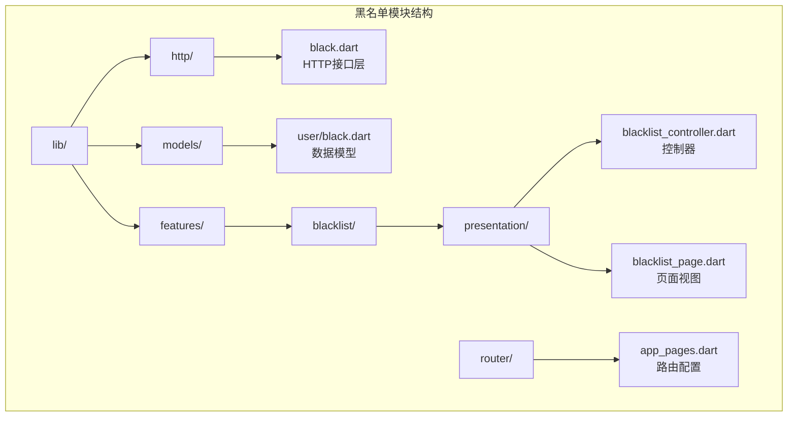
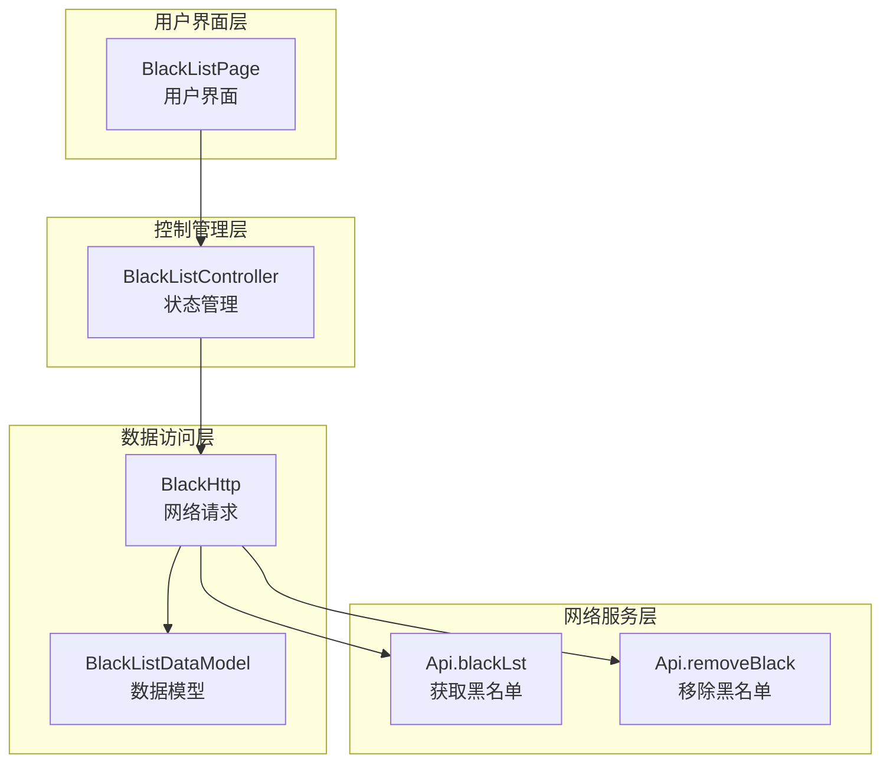
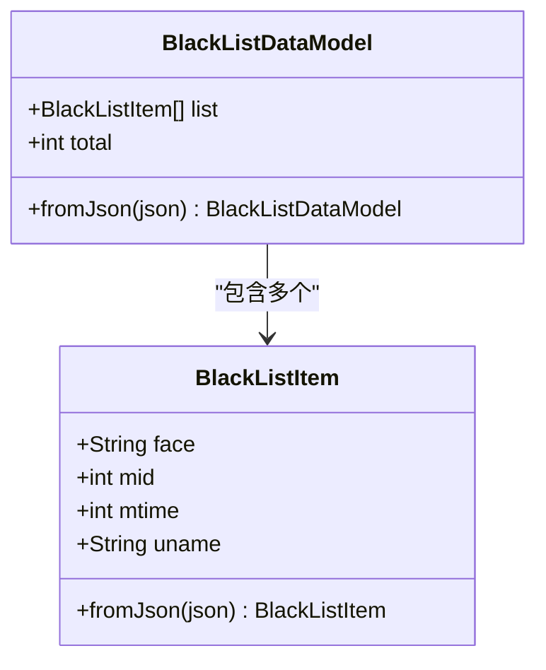
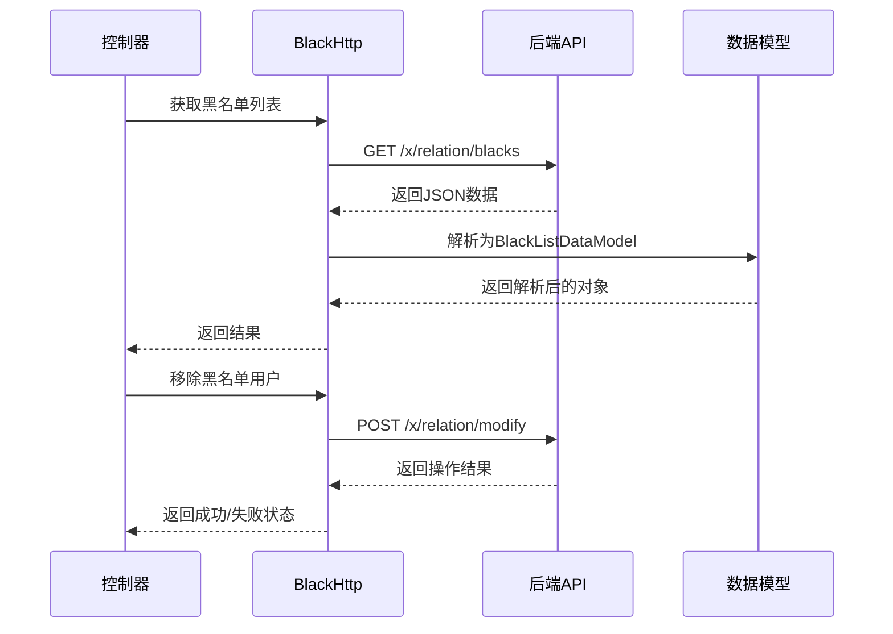
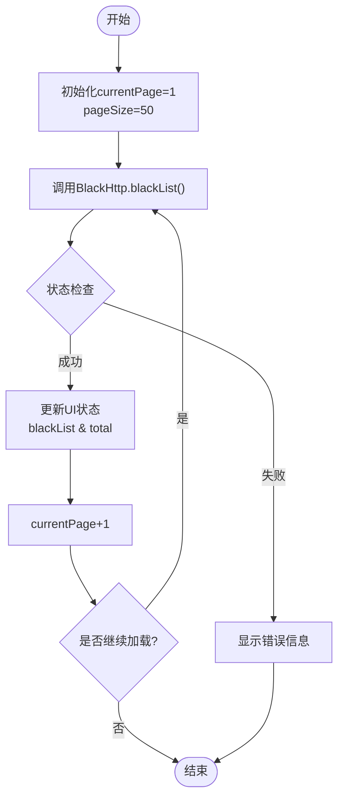
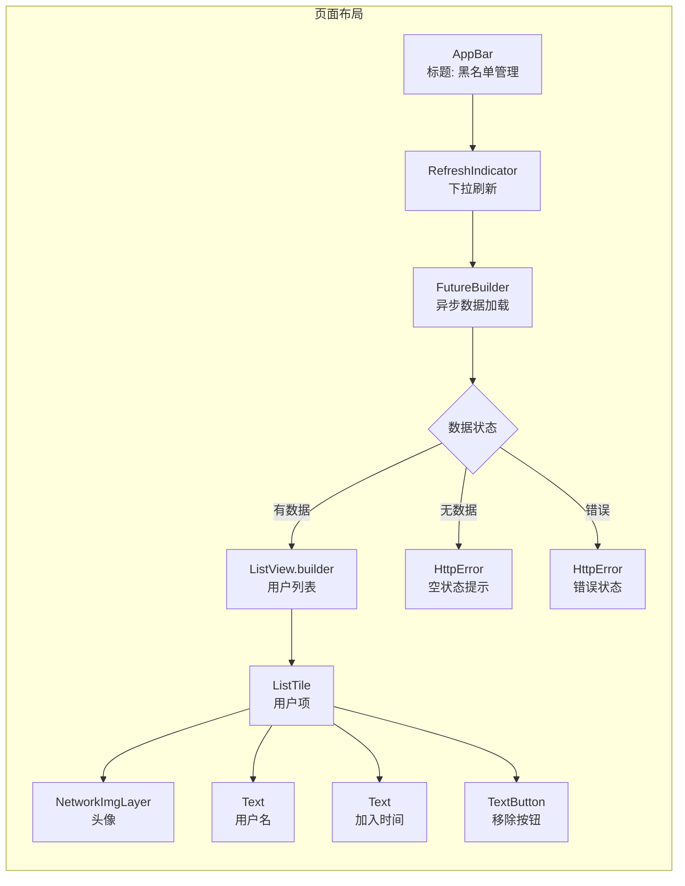
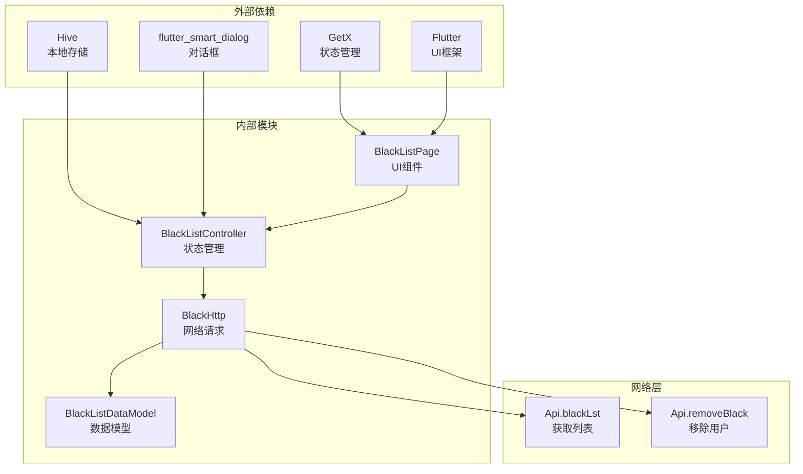

# 黑名单模块

<cite>
**本文档引用的文件**
- [lib/http/black.dart](file://lib/http/black.dart)
- [lib/models/user/black.dart](file://lib/models/user/black.dart)
- [lib/features/blacklist/presentation/blacklist_controller.dart](file://lib/features/blacklist/presentation/blacklist_controller.dart)
- [lib/features/blacklist/presentation/blacklist_page.dart](file://lib/features/blacklist/presentation/blacklist_page.dart)
- [lib/http/api.dart](file://lib/http/api.dart)
- [lib/router/app_pages.dart](file://lib/router/app_pages.dart)
</cite>

## 目录
1. [简介](#简介)
2. [项目结构](#项目结构)
3. [核心组件](#核心组件)
4. [架构概览](#架构概览)
5. [详细组件分析](#详细组件分析)
6. [依赖关系分析](#依赖关系分析)
7. [性能考虑](#性能考虑)
8. [故障排除指南](#故障排除指南)
9. [结论](#结论)

## 简介

黑名单模块是 pilipala 应用程序中用于管理用户屏蔽列表的核心功能模块。该模块允许用户查看、管理和移除他们屏蔽的用户，提供了一个完整的黑名单管理系统，包括数据获取、状态管理和用户界面展示。

该模块基于 Flutter 框架构建，采用 MVVM 架构模式，使用 GetX 进行状态管理，实现了响应式的数据绑定和高效的用户交互体验。

## 项目结构

黑名单模块在项目中的组织结构如下：

**图表来源**
- [lib/http/black.dart:1-54](file://lib/http/black.dart#L1-L54)
- [lib/models/user/black.dart:1-38](file://lib/models/user/black.dart#L1-L38)
- [lib/features/blacklist/presentation/blacklist_controller.dart:1-41](file://lib/features/blacklist/presentation/blacklist_controller.dart#L1-L41)
- [lib/features/blacklist/presentation/blacklist_page.dart:1-140](file://lib/features/blacklist/presentation/blacklist_page.dart#L1-L140)

**章节来源**
- [lib/http/black.dart:1-54](file://lib/http/black.dart#L1-L54)
- [lib/models/user/black.dart:1-38](file://lib/models/user/black.dart#L1-L38)
- [lib/features/blacklist/presentation/blacklist_controller.dart:1-41](file://lib/features/blacklist/presentation/blacklist_controller.dart#L1-L41)
- [lib/features/blacklist/presentation/blacklist_page.dart:1-140](file://lib/features/blacklist/presentation/blacklist_page.dart#L1-L140)

## 核心组件

黑名单模块包含以下核心组件：

### 数据模型层
- **BlackListDataModel**: 封装黑名单列表的完整数据结构
- **BlackListItem**: 表示单个黑名单用户的详细信息

### HTTP 接口层
- **BlackHttp**: 提供黑名单相关的网络请求功能
  - 获取黑名单列表
  - 移除指定用户出黑名单

### 控制器层
- **BlackListController**: 管理黑名单状态和业务逻辑
  - 分页加载黑名单数据
  - 处理用户移除操作
  - 维护当前页码和总数

### 视图层
- **BlackListPage**: 实现黑名单管理界面
  - 展示用户头像、昵称和加入时间
  - 支持下拉刷新和无限滚动
  - 提供移除按钮功能

**章节来源**
- [lib/models/user/black.dart:1-38](file://lib/models/user/black.dart#L1-L38)
- [lib/http/black.dart:1-54](file://lib/http/black.dart#L1-L54)
- [lib/features/blacklist/presentation/blacklist_controller.dart:1-41](file://lib/features/blacklist/presentation/blacklist_controller.dart#L1-L41)
- [lib/features/blacklist/presentation/blacklist_page.dart:1-140](file://lib/features/blacklist/presentation/blacklist_page.dart#L1-L140)

## 架构概览

黑名单模块采用分层架构设计，确保了良好的代码组织和可维护性：

**图表来源**
- [lib/features/blacklist/presentation/blacklist_page.dart:12-17](file://lib/features/blacklist/presentation/blacklist_page.dart#L12-L17)
- [lib/features/blacklist/presentation/blacklist_controller.dart:9-13](file://lib/features/blacklist/presentation/blacklist_controller.dart#L9-L13)
- [lib/http/black.dart:4-53](file://lib/http/black.dart#L4-L53)
- [lib/http/api.dart:308](file://lib/http/api.dart#L308)

该架构遵循单一职责原则，每个组件都有明确的职责分工：

- **UI 层**: 负责用户交互和界面展示
- **Controller 层**: 处理业务逻辑和状态管理
- **HTTP 层**: 处理网络通信和数据获取
- **Model 层**: 定义数据结构和序列化方法

## 详细组件分析

### 数据模型组件

数据模型组件负责定义和处理黑名单相关的数据结构：

**图表来源**
- [lib/models/user/black.dart:1-38](file://lib/models/user/black.dart#L1-L38)

数据模型具有以下特点：
- 使用泛型列表存储黑名单用户信息
- 提供 JSON 反序列化功能
- 包含完整的用户标识信息（头像、用户ID、用户名等）

**章节来源**
- [lib/models/user/black.dart:1-38](file://lib/models/user/black.dart#L1-L38)

### HTTP 接口组件

HTTP 接口组件处理与后端服务器的通信：

**图表来源**
- [lib/http/black.dart:5-25](file://lib/http/black.dart#L5-L25)
- [lib/http/black.dart:28-52](file://lib/http/black.dart#L28-L52)

HTTP 接口组件实现了以下功能：
- 分页获取黑名单列表（默认每页50条）
- 验证 CSRF 令牌安全性
- 错误处理和状态码检查
- JSONP 格式支持

**章节来源**
- [lib/http/black.dart:1-54](file://lib/http/black.dart#L1-L54)

### 控制器组件

控制器组件管理黑名单的状态和业务逻辑：

**图表来源**
- [lib/features/blacklist/presentation/blacklist_controller.dart:15-30](file://lib/features/blacklist/presentation/blacklist_controller.dart#L15-L30)

控制器组件具有以下特性：
- 响应式状态管理（GetX）
- 自动分页加载机制
- 实时数据更新
- 错误状态处理

**章节来源**
- [lib/features/blacklist/presentation/blacklist_controller.dart:1-41](file://lib/features/blacklist/presentation/blacklist_controller.dart#L1-L41)

### 页面组件

页面组件负责用户界面的渲染和交互：

**图表来源**
- [lib/features/blacklist/presentation/blacklist_page.dart:56-138](file://lib/features/blacklist/presentation/blacklist_page.dart#L56-L138)

页面组件实现了以下功能：
- 下拉刷新机制
- 无限滚动加载
- 响应式 UI 更新
- 用户友好的错误处理

**章节来源**
- [lib/features/blacklist/presentation/blacklist_page.dart:1-140](file://lib/features/blacklist/presentation/blacklist_page.dart#L1-L140)

## 依赖关系分析

黑名单模块的依赖关系清晰明确，遵循依赖倒置原则：

**图表来源**
- [lib/features/blacklist/presentation/blacklist_page.dart:1-11](file://lib/features/blacklist/presentation/blacklist_page.dart#L1-L11)
- [lib/features/blacklist/presentation/blacklist_controller.dart:1-8](file://lib/features/blacklist/presentation/blacklist_controller.dart#L1-L8)
- [lib/http/black.dart:1](file://lib/http/black.dart#L1)

**章节来源**
- [lib/features/blacklist/presentation/blacklist_page.dart:1-11](file://lib/features/blacklist/presentation/blacklist_page.dart#L1-L11)
- [lib/features/blacklist/presentation/blacklist_controller.dart:1-8](file://lib/features/blacklist/presentation/blacklist_controller.dart#L1-L8)
- [lib/http/black.dart:1](file://lib/http/black.dart#L1)

## 性能考虑

黑名单模块在设计时充分考虑了性能优化：

### 内存管理
- 使用响应式变量减少不必要的重建
- 按需加载数据，避免一次性加载大量数据
- 合理的缓存策略

### 网络优化
- 分页加载机制，限制每次请求的数据量
- CSRF 令牌验证，确保请求安全性
- 错误重试机制

### 用户体验
- 下拉刷新提供即时反馈
- 无限滚动优化滚动性能
- 空状态和错误状态的友好提示

## 故障排除指南

### 常见问题及解决方案

**问题1：无法获取黑名单数据**
- 检查网络连接状态
- 验证用户登录状态
- 查看 API 响应状态码

**问题2：移除用户失败**
- 确认用户权限
- 检查 CSRF 令牌有效性
- 验证用户 ID 的正确性

**问题3：界面不更新**
- 检查响应式变量的使用
- 确认状态更新的触发
- 验证 UI 组件的监听机制

**章节来源**
- [lib/http/black.dart:13-24](file://lib/http/black.dart#L13-L24)
- [lib/http/black.dart:39-51](file://lib/http/black.dart#L39-L51)

## 结论

黑名单模块是一个设计良好、结构清晰的功能模块，具有以下优势：

1. **架构清晰**: 采用分层架构，职责分离明确
2. **易于维护**: 代码结构规范，依赖关系简单
3. **用户体验佳**: 提供流畅的交互体验和友好的错误处理
4. **扩展性强**: 模块化设计便于功能扩展和修改

该模块为用户提供了完整的黑名单管理功能，包括数据获取、状态管理和用户界面展示，是 pilipala 应用程序的重要组成部分。通过合理的架构设计和性能优化，确保了模块的稳定性和可维护性。