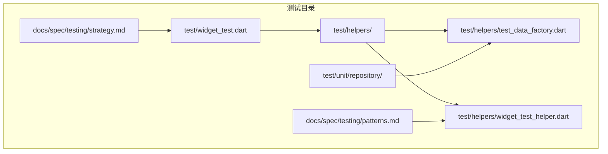
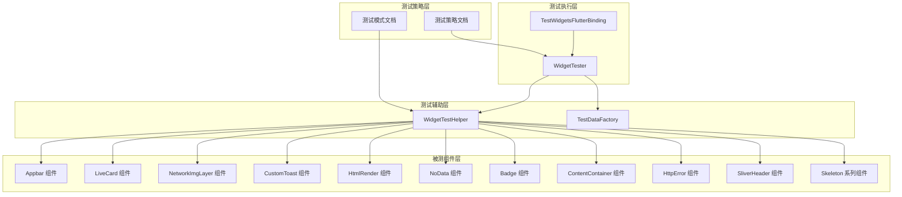
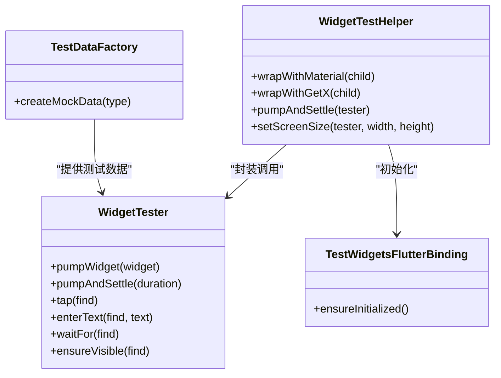
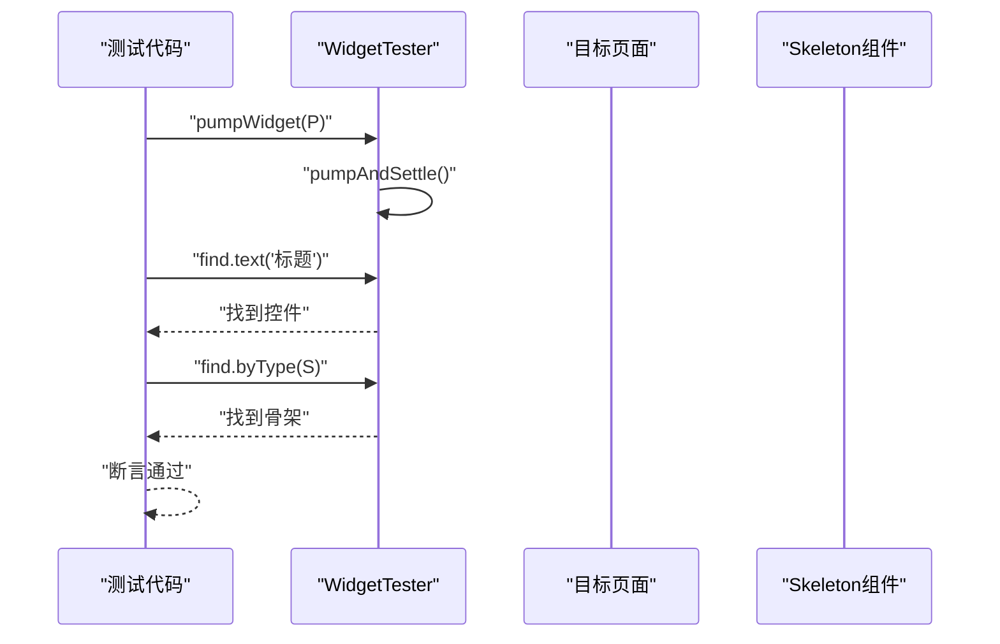
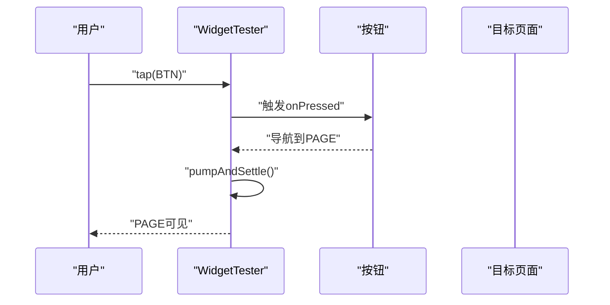
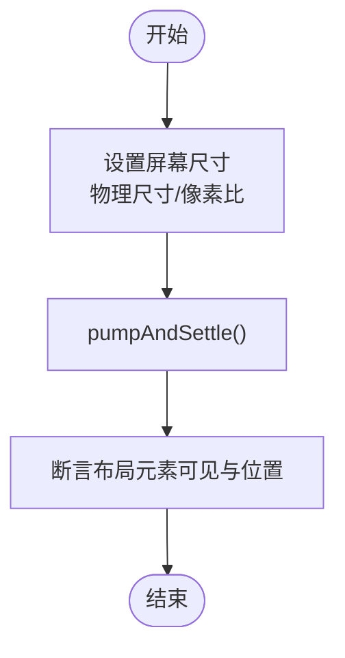
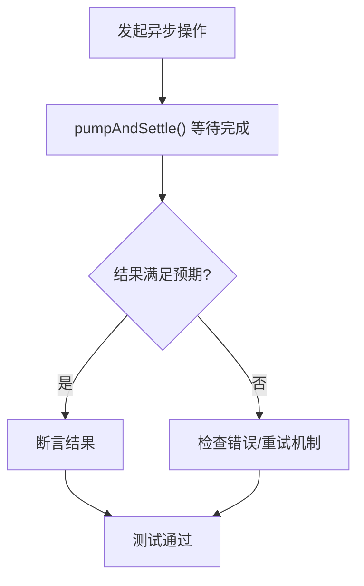
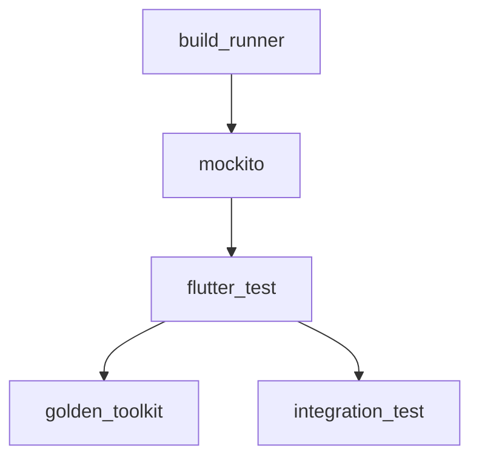

# Widget测试

<cite>
**本文引用的文件**
- [docs/spec/testing/strategy.md](file://docs/spec/testing/strategy.md)
- [docs/spec/testing/patterns.md](file://docs/spec/testing/patterns.md)
- [test/widget_test.dart](file://test/widget_test.dart)
- [test/helpers/widget_test_helper.dart](file://test/helpers/widget_test_helper.dart)
- [test/helpers/test_data_factory.dart](file://test/helpers/test_data_factory.dart)
- [test/unit/repository/search_repository_test.dart](file://test/unit/repository/search_repository_test.dart)
- [test/unit/repository/user_repository_test.dart](file://test/unit/repository/user_repository_test.dart)
- [test/unit/repository/video_repository_test.dart](file://test/unit/repository/video_repository_test.dart)
- [lib/common/widgets/appbar.dart](file://lib/common/widgets/appbar.dart)
- [lib/common/widgets/live_card.dart](file://lib/common/widgets/live_card.dart)
- [lib/common/widgets/network_img_layer.dart](file://lib/common/widgets/network_img_layer.dart)
- [lib/common/widgets/custom_toast.dart](file://lib/common/widgets/custom_toast.dart)
- [lib/common/widgets/html_render.dart](file://lib/common/widgets/html_render.dart)
- [lib/common/widgets/no_data.dart](file://lib/common/widgets/no_data.dart)
- [lib/common/widgets/badge.dart](file://lib/common/widgets/badge.dart)
- [lib/common/widgets/content_container.dart](file://lib/common/widgets/content_container.dart)
- [lib/common/widgets/http_error.dart](file://lib/common/widgets/http_error.dart)
- [lib/common/widgets/sliver_header.dart](file://lib/common/widgets/sliver_header.dart)
- [lib/common/skeleton/video_card_h.dart](file://lib/common/skeleton/video_card_h.dart)
- [lib/common/skeleton/video_card_v.dart](file://lib/common/skeleton/video_card_v.dart)
- [lib/common/skeleton/media_bangumi.dart](file://lib/common/skeleton/media_bangumi.dart)
- [lib/common/skeleton/dynamic_card.dart](file://lib/common/skeleton/dynamic_card.dart)
- [lib/common/skeleton/video_reply.dart](file://lib/common/skeleton/video_reply.dart)
- [lib/common/skeleton/skeleton.dart](file://lib/common/skeleton/skeleton.dart)
- [lib/common/pages_bottom_sheet.dart](file://lib/common/pages_bottom_sheet.dart)
- [lib/common/widgets/animated_dialog.dart](file://lib/common/widgets/animated_dialog.dart)
- [lib/common/widgets/app_expansion_panel_list.dart](file://lib/common/widgets/app_expansion_panel_list.dart)
- [lib/common/widgets/animated_dialog.dart](file://lib/common/widgets/animated_dialog.dart)
- [lib/common/widgets/custom_toast.dart](file://lib/common/widgets/custom_toast.dart)
- [lib/common/widgets/network_img_layer.dart](file://lib/common/widgets/network_img_layer.dart)
- [lib/common/widgets/html_render.dart](file://lib/common/widgets/html_render.dart)
- [lib/common/widgets/no_data.dart](file://lib/common/widgets/no_data.dart)
- [lib/common/widgets/badge.dart](file://lib/common/widgets/badge.dart)
- [lib/common/widgets/content_container.dart](file://lib/common/widgets/content_container.dart)
- [lib/common/widgets/http_error.dart](file://lib/common/widgets/http_error.dart)
- [lib/common/widgets/sliver_header.dart](file://lib/common/widgets/sliver_header.dart)
- [lib/common/skeleton/video_card_h.dart](file://lib/common/skeleton/video_card_h.dart)
- [lib/common/skeleton/video_card_v.dart](file://lib/common/skeleton/video_card_v.dart)
- [lib/common/skeleton/media_bangumi.dart](file://lib/common/skeleton/media_bangumi.dart)
- [lib/common/skeleton/dynamic_card.dart](file://lib/common/skeleton/dynamic_card.dart)
- [lib/common/skeleton/video_reply.dart](file://lib/common/skeleton/video_reply.dart)
- [lib/common/skeleton/skeleton.dart](file://lib/common/skeleton/skeleton.dart)
- [lib/common/pages_bottom_sheet.dart](file://lib/common/pages_bottom_sheet.dart)
- [lib/common/widgets/animated_dialog.dart](file://lib/common/widgets/animated_dialog.dart)
- [lib/common/widgets/app_expansion_panel_list.dart](file://lib/common/widgets/app_expansion_panel_list.dart)
</cite>

## 目录
1. [引言](#引言)
2. [项目结构](#项目结构)
3. [核心组件](#核心组件)
4. [架构总览](#架构总览)
5. [详细组件分析](#详细组件分析)
6. [依赖分析](#依赖分析)
7. [性能考虑](#性能考虑)
8. [故障排查指南](#故障排查指南)
9. [结论](#结论)
10. [附录](#附录)

## 引言
本文件面向PiliPala项目的Flutter Widget测试，系统性阐述测试理论与实践，覆盖页面组件测试、交互测试、布局测试、渲染与事件模拟、异步操作测试、断言技巧、测试数据注入与性能优化，并提供可直接落地的测试策略与流程。文档基于仓库内现有测试规范与辅助工具，结合通用Flutter测试最佳实践，帮助开发者建立完善的UI质量保障体系。

## 项目结构
测试相关目录与文件组织如下：
- test/widget_test.dart：全局入口测试文件，用于初始化测试环境与运行基础测试。
- test/helpers/：测试辅助工具与数据工厂
  - widget_test_helper.dart：封装Widget包装、屏幕尺寸设置、pumpAndSettle等常用测试能力。
  - test_data_factory.dart：提供测试数据构造器，便于快速生成Mock数据。
- test/unit/repository/*_repository_test.dart：单元测试示例，展示如何在Widget测试之外补充对Repository层的验证。
- docs/spec/testing/strategy.md：测试策略与分层说明，包含Widget测试示例与集成测试示例。
- docs/spec/testing/patterns.md：测试模式与辅助工具示例，包含Widget测试辅助类与屏幕尺寸模拟等。

**图表来源**
- [test/widget_test.dart](file://test/widget_test.dart)
- [test/helpers/widget_test_helper.dart](file://test/helpers/widget_test_helper.dart)
- [test/helpers/test_data_factory.dart](file://test/helpers/test_data_factory.dart)
- [test/unit/repository/search_repository_test.dart](file://test/unit/repository/search_repository_test.dart)
- [docs/spec/testing/strategy.md](file://docs/spec/testing/strategy.md)
- [docs/spec/testing/patterns.md](file://docs/spec/testing/patterns.md)

**章节来源**
- [docs/spec/testing/strategy.md](file://docs/spec/testing/strategy.md)
- [docs/spec/testing/patterns.md](file://docs/spec/testing/patterns.md)
- [test/widget_test.dart](file://test/widget_test.dart)
- [test/helpers/widget_test_helper.dart](file://test/helpers/widget_test_helper.dart)
- [test/helpers/test_data_factory.dart](file://test/helpers/test_data_factory.dart)

## 核心组件
- WidgetTester：Flutter测试框架提供的核心工具，负责构建Widget树、驱动渲染、模拟输入事件、等待异步完成等。
- TestWidgetsFlutterBinding：测试绑定，确保测试环境具备渲染与事件处理能力。
- WidgetTestHelper：封装常用测试辅助方法，如包装MaterialApp、GetX、pumpAndSettle、设置屏幕尺寸等。
- TestDataFactory：提供测试数据构造器，便于在测试中注入一致且可控的数据源。
- 测试策略与模式：通过策略文档定义测试分层、命名规范、测试结构与CI集成方式。

**章节来源**
- [docs/spec/testing/strategy.md](file://docs/spec/testing/strategy.md)
- [docs/spec/testing/patterns.md](file://docs/spec/testing/patterns.md)
- [test/helpers/widget_test_helper.dart](file://test/helpers/widget_test_helper.dart)
- [test/helpers/test_data_factory.dart](file://test/helpers/test_data_factory.dart)

## 架构总览
下图展示了Widget测试在PiliPala中的整体架构与关键交互：

**图表来源**
- [docs/spec/testing/strategy.md](file://docs/spec/testing/strategy.md)
- [docs/spec/testing/patterns.md](file://docs/spec/testing/patterns.md)
- [test/helpers/widget_test_helper.dart](file://test/helpers/widget_test_helper.dart)
- [test/helpers/test_data_factory.dart](file://test/helpers/test_data_factory.dart)
- [lib/common/widgets/appbar.dart](file://lib/common/widgets/appbar.dart)
- [lib/common/widgets/live_card.dart](file://lib/common/widgets/live_card.dart)
- [lib/common/widgets/network_img_layer.dart](file://lib/common/widgets/network_img_layer.dart)
- [lib/common/widgets/custom_toast.dart](file://lib/common/widgets/custom_toast.dart)
- [lib/common/widgets/html_render.dart](file://lib/common/widgets/html_render.dart)
- [lib/common/widgets/no_data.dart](file://lib/common/widgets/no_data.dart)
- [lib/common/widgets/badge.dart](file://lib/common/widgets/badge.dart)
- [lib/common/widgets/content_container.dart](file://lib/common/widgets/content_container.dart)
- [lib/common/widgets/http_error.dart](file://lib/common/widgets/http_error.dart)
- [lib/common/widgets/sliver_header.dart](file://lib/common/widgets/sliver_header.dart)
- [lib/common/skeleton/skeleton.dart](file://lib/common/skeleton/skeleton.dart)

## 详细组件分析

### Widget测试工具与环境
- WidgetTester：用于构建Widget树、触发渲染、查找控件、模拟点击/输入、等待异步完成等。
- TestWidgetsFlutterBinding：确保测试环境具备渲染与事件处理能力；在集成测试中需显式初始化。
- WidgetTestHelper：提供包装MaterialApp/GetX、pumpAndSettle、设置屏幕尺寸等便捷方法，提升测试一致性与可维护性。
- TestDataFactory：提供统一的数据构造入口，便于在测试中注入Mock数据，减少重复代码。

**图表来源**
- [docs/spec/testing/patterns.md](file://docs/spec/testing/patterns.md)
- [test/helpers/widget_test_helper.dart](file://test/helpers/widget_test_helper.dart)
- [test/helpers/test_data_factory.dart](file://test/helpers/test_data_factory.dart)

**章节来源**
- [docs/spec/testing/patterns.md](file://docs/spec/testing/patterns.md)
- [test/helpers/widget_test_helper.dart](file://test/helpers/widget_test_helper.dart)
- [test/helpers/test_data_factory.dart](file://test/helpers/test_data_factory.dart)

### 页面组件测试
- 页面渲染验证：通过构建页面并调用pumpAndSettle，验证页面标题、关键控件是否存在。
- 列表/卡片渲染：验证列表项类型、数量与占位骨架是否正确显示。
- 布局与可见性：验证关键元素的可见性、定位与层级关系。

**图表来源**
- [docs/spec/testing/strategy.md](file://docs/spec/testing/strategy.md)

**章节来源**
- [docs/spec/testing/strategy.md](file://docs/spec/testing/strategy.md)

### 交互测试
- 点击测试：模拟用户点击按钮或卡片，验证回调触发、路由跳转或状态更新。
- 表单输入测试：模拟输入文本、选择选项，验证输入框内容与校验提示。
- 导航测试：验证从A页面到B页面的导航行为与参数传递。

**图表来源**
- [docs/spec/testing/strategy.md](file://docs/spec/testing/strategy.md)

**章节来源**
- [docs/spec/testing/strategy.md](file://docs/spec/testing/strategy.md)

### 布局测试
- 屏幕尺寸模拟：通过设置物理尺寸与像素比，验证不同设备下的布局表现。
- 自适应布局：验证在小屏/大屏下的控件排列与间距变化。
- 骨架屏与占位：验证加载态与错误态下的布局一致性。

**图表来源**
- [docs/spec/testing/patterns.md](file://docs/spec/testing/patterns.md)

**章节来源**
- [docs/spec/testing/patterns.md](file://docs/spec/testing/patterns.md)

### 渲染、事件模拟与异步操作测试
- 渲染驱动：使用pump/pumpAndSettle驱动Widget重新渲染，等待动画与异步任务完成。
- 事件模拟：tap/enterText/scrollTo等，模拟真实用户交互。
- 异步等待：等待Future完成、网络请求返回、定时器触发等。

**图表来源**
- [docs/spec/testing/strategy.md](file://docs/spec/testing/strategy.md)
- [docs/spec/testing/patterns.md](file://docs/spec/testing/patterns.md)

**章节来源**
- [docs/spec/testing/strategy.md](file://docs/spec/testing/strategy.md)
- [docs/spec/testing/patterns.md](file://docs/spec/testing/patterns.md)

### 断言技巧与测试数据注入
- 断言策略：使用finders定位控件，结合expect进行数量、可见性、文本、颜色等断言。
- 数据注入：通过TestDataFactory构造Mock数据，注入到被测组件或其依赖的服务/仓库。
- 状态断言：断言组件状态变化（如Loading/Error/Success）与UI反馈一致。

**章节来源**
- [test/helpers/test_data_factory.dart](file://test/helpers/test_data_factory.dart)
- [docs/spec/testing/strategy.md](file://docs/spec/testing/strategy.md)

### 性能与稳定性优化
- 减少不必要的pump：仅在必要时调用pump/pumpAndSettle，避免过度渲染。
- 批量断言：将相关断言合并，减少测试运行时间。
- Mock外部依赖：使用Mock与Fake替换网络请求、本地存储等，提升稳定性与速度。
- 屏幕尺寸复用：通过WidgetTestHelper统一设置屏幕尺寸，避免重复配置。

**章节来源**
- [docs/spec/testing/patterns.md](file://docs/spec/testing/patterns.md)
- [docs/spec/testing/strategy.md](file://docs/spec/testing/strategy.md)

## 依赖分析
- 测试框架依赖：flutter_test为核心，golden_toolkit用于Golden测试，integration_test用于端到端场景。
- Mock与生成：mockito用于生成Mock对象，build_runner用于代码生成。
- 测试策略与工具：策略文档定义了测试分层与命名规范，模式文档提供了辅助工具与最佳实践。

**图表来源**
- [docs/spec/testing/strategy.md](file://docs/spec/testing/strategy.md)

**章节来源**
- [docs/spec/testing/strategy.md](file://docs/spec/testing/strategy.md)

## 性能考虑
- 渲染优化：合理使用pumpAndSettle，避免过长等待；对复杂动画分步断言。
- 数据注入：优先使用轻量Mock数据，减少序列化/反序列化开销。
- 并发与隔离：每个测试独立初始化与清理，避免共享状态导致的不稳定。
- 报告与覆盖率：通过CI收集测试报告与覆盖率，持续改进测试质量。

[本节为通用建议，无需特定文件引用]

## 故障排查指南
- 测试不渲染或无响应：确认已调用pump/pumpAndSettle，必要时增加超时时间。
- 控件找不到：检查Finder匹配条件（类型/文本/属性），确保控件已渲染。
- 异步未完成：使用pumpAndSettle等待Future完成，或在测试中Mock异步源。
- 屏幕尺寸异常：通过WidgetTestHelper设置屏幕尺寸，确保断言基于正确的布局上下文。
- 集成测试失败：确保TestWidgetsFlutterBinding已初始化，且应用启动顺序正确。

**章节来源**
- [docs/spec/testing/patterns.md](file://docs/spec/testing/patterns.md)
- [docs/spec/testing/strategy.md](file://docs/spec/testing/strategy.md)

## 结论
通过策略化的测试分层、标准化的测试工具与辅助方法，以及严格的断言与数据注入实践，PiliPala项目可以建立起稳定可靠的Widget测试体系。建议在后续迭代中逐步完善页面与组件的覆盖度，强化异步与交互场景的验证，并将测试纳入CI流程，持续保障UI质量与交付效率。

[本节为总结性内容，无需特定文件引用]

## 附录
- 测试策略与示例：参考策略文档中的Widget测试与集成测试示例，按需迁移至实际页面与组件。
- 辅助工具使用：优先使用WidgetTestHelper与TestDataFactory，减少重复代码与提高一致性。
- 目录结构与命名：遵循策略文档中的目录结构与命名规范，保持测试组织清晰。

**章节来源**
- [docs/spec/testing/strategy.md](file://docs/spec/testing/strategy.md)
- [docs/spec/testing/patterns.md](file://docs/spec/testing/patterns.md)