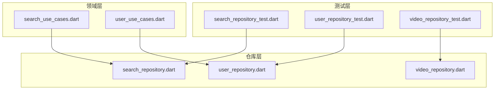
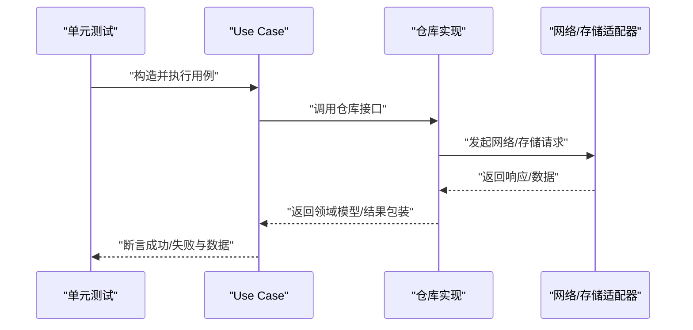
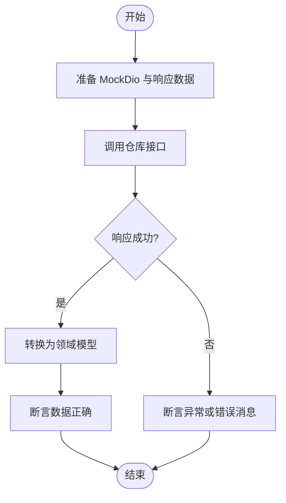
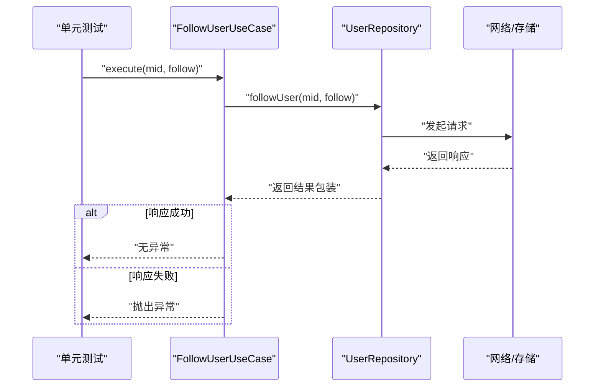
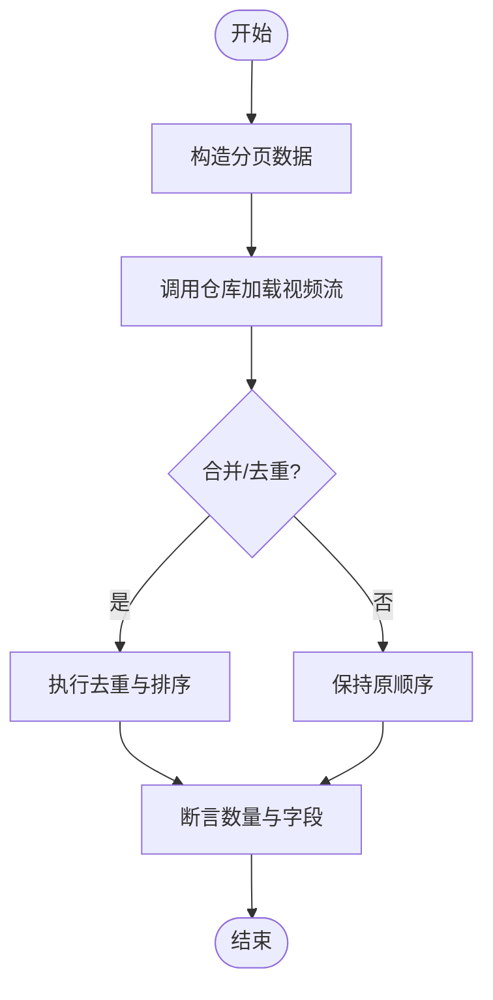
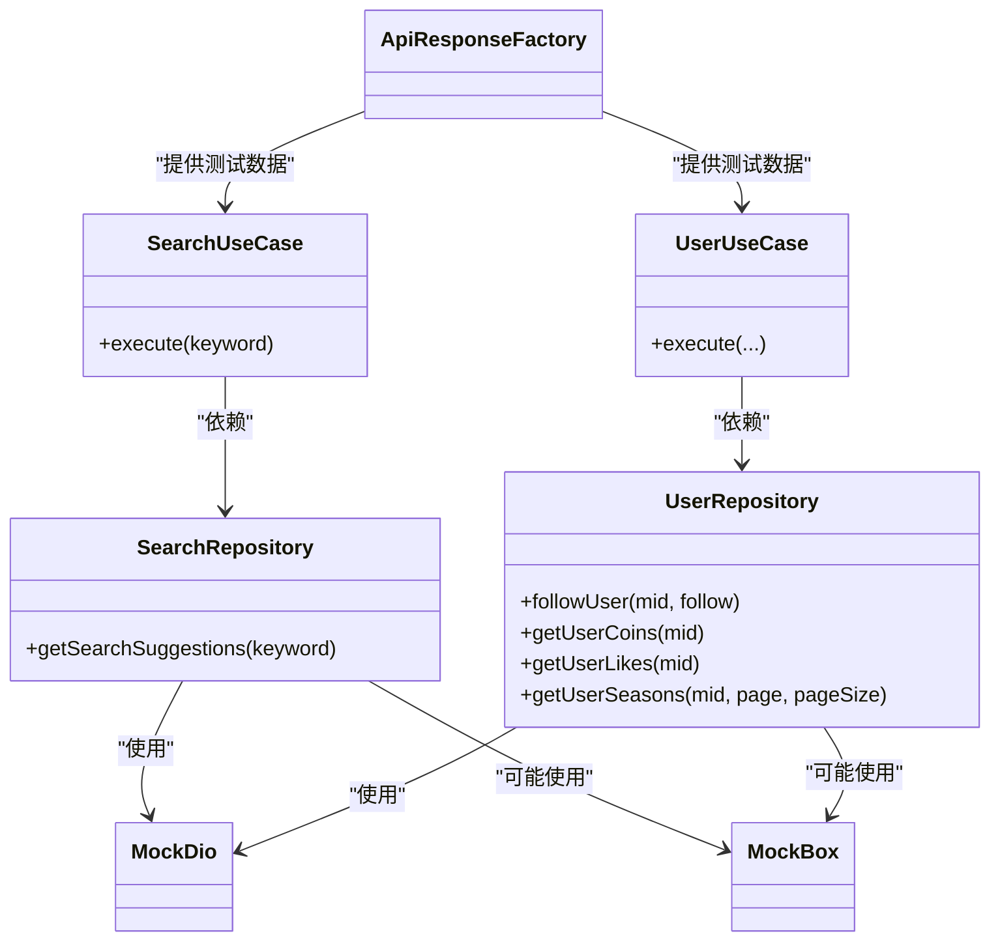

# 仓库测试

<cite>
**本文引用的文件**
- [search_repository_test.dart](file://test/unit/repository/search_repository_test.dart)
- [user_repository_test.dart](file://test/unit/repository/user_repository_test.dart)
- [video_repository_test.dart](file://test/unit/repository/video_repository_test.dart)
- [patterns.md](file://docs/spec/testing/patterns.md)
- [strategy.md](file://docs/spec/testing/strategy.md)
- [search_repository.dart](file://lib/features/search/data/search_repository.dart)
- [user_repository.dart](file://lib/features/user/data/user_repository.dart)
- [video_repository.dart](file://lib/features/home/data/video_repository.dart)
- [login_repository.dart](file://lib/features/login/data/login_repository.dart)
- [media_repository.dart](file://lib/features/media/data/media_repository.dart)
- [video_detail_repository.dart](file://lib/features/video/data/video_detail_repository.dart)
- [search_use_cases.dart](file://lib/features/search/domain/search_use_cases.dart)
- [user_use_cases.dart](file://lib/features/user/domain/user_use_cases.dart)
- [test_data_factory.dart](file://test/helpers/test_data_factory.dart)
</cite>

## 目录
1. [引言](#引言)
2. [项目结构](#项目结构)
3. [核心组件](#核心组件)
4. [架构总览](#架构总览)
5. [详细组件分析](#详细组件分析)
6. [依赖关系分析](#依赖关系分析)
7. [性能考虑](#性能考虑)
8. [故障排查指南](#故障排查指南)
9. [结论](#结论)
10. [附录](#附录)

## 引言
本文件面向开发者，系统性梳理 PiliPala 项目中仓库层（Repository）的单元测试策略与实践，覆盖数据访问层测试、API 接口测试、缓存策略测试、Mock 网络请求、数据库/存储操作测试、数据转换测试等关键维度。文档以现有仓库测试用例为基础，结合测试规范与策略文档，给出可复用的测试设计模式、依赖注入方式、异步操作处理与错误场景覆盖方案，并提供搜索、用户、视频三大仓库的具体测试实现思路与最佳实践。

## 项目结构
仓库层位于功能模块的数据层，负责封装数据源（HTTP、本地存储）与业务模型之间的适配与转换；上层通过 Use Case 调用仓库接口，实现领域逻辑与数据访问解耦。单元测试集中在 test/unit/repository 目录下，分别对搜索、用户、视频仓库进行独立测试。

图表来源
- [search_repository_test.dart](file://test/unit/repository/search_repository_test.dart)
- [user_repository_test.dart](file://test/unit/repository/user_repository_test.dart)
- [video_repository_test.dart](file://test/unit/repository/video_repository_test.dart)
- [search_repository.dart](file://lib/features/search/data/search_repository.dart)
- [user_repository.dart](file://lib/features/user/data/user_repository.dart)
- [video_repository.dart](file://lib/features/home/data/video_repository.dart)
- [search_use_cases.dart](file://lib/features/search/domain/search_use_cases.dart)
- [user_use_cases.dart](file://lib/features/user/domain/user_use_cases.dart)

章节来源
- [search_repository_test.dart](file://test/unit/repository/search_repository_test.dart)
- [user_repository_test.dart](file://test/unit/repository/user_repository_test.dart)
- [video_repository_test.dart](file://test/unit/repository/video_repository_test.dart)

## 核心组件
- 仓库接口与实现：各功能模块在 data 层提供具体仓库实现，封装网络请求与数据转换。
- Use Case 依赖注入：Use Case 通过构造函数或依赖注入容器获取仓库实例，便于测试时替换为 Mock。
- 测试规范与策略：遵循统一的 Mock 模式、异步测试与测试数据工厂，确保测试稳定性与可维护性。

章节来源
- [patterns.md](file://docs/spec/testing/patterns.md)
- [strategy.md](file://docs/spec/testing/strategy.md)
- [search_use_cases.dart](file://lib/features/search/domain/search_use_cases.dart)
- [user_use_cases.dart](file://lib/features/user/domain/user_use_cases.dart)

## 架构总览
仓库层测试围绕“依赖注入 + Mock 数据源 + 断言结果”的模式展开，典型调用链如下：

图表来源
- [search_use_cases.dart](file://lib/features/search/domain/search_use_cases.dart)
- [user_use_cases.dart](file://lib/features/user/domain/user_use_cases.dart)
- [search_repository.dart](file://lib/features/search/data/search_repository.dart)
- [user_repository.dart](file://lib/features/user/data/user_repository.dart)
- [video_repository.dart](file://lib/features/home/data/video_repository.dart)

## 详细组件分析

### 搜索仓库测试
目标：验证搜索建议与搜索结果的加载、数据转换与错误处理。
- Mock 网络：使用 MockDio 或 MockDioAdapter 提供稳定的响应，避免真实网络波动影响测试。
- 数据工厂：通过 ApiResponseFactory 生成标准的成功/失败响应，确保断言一致性。
- 异步断言：等待仓库返回 Future，断言数据列表非空或抛出预期异常。
- 错误场景：模拟无数据、字段缺失、HTTP 错误码等情况，验证 Use Case 的异常处理是否正确。

图表来源
- [patterns.md](file://docs/spec/testing/patterns.md)
- [strategy.md](file://docs/spec/testing/strategy.md)
- [search_repository_test.dart](file://test/unit/repository/search_repository_test.dart)
- [search_repository.dart](file://lib/features/search/data/search_repository.dart)
- [search_use_cases.dart](file://lib/features/search/domain/search_use_cases.dart)

章节来源
- [search_repository_test.dart](file://test/unit/repository/search_repository_test.dart)
- [search_repository.dart](file://lib/features/search/data/search_repository.dart)
- [search_use_cases.dart](file://lib/features/search/domain/search_use_cases.dart)

### 用户仓库测试
目标：验证用户统计、关注/取消关注、用户硬币/点赞/剧单等数据的加载与转换。
- Mock 关注流程：通过 Mock 仓库返回成功/失败响应，验证 FollowUserUseCase 的异常抛出逻辑。
- Mock 列表数据：使用测试数据工厂生成用户相关模型，断言列表长度与字段完整性。
- 异常路径：模拟网络失败或服务端错误码，验证 Use Case 抛出的异常消息与类型。
- 缓存策略：若仓库包含本地缓存逻辑，需断言缓存命中/更新行为与数据一致性。

图表来源
- [user_repository_test.dart](file://test/unit/repository/user_repository_test.dart)
- [user_repository.dart](file://lib/features/user/data/user_repository.dart)
- [user_use_cases.dart](file://lib/features/user/domain/user_use_cases.dart)

章节来源
- [user_repository_test.dart](file://test/unit/repository/user_repository_test.dart)
- [user_repository.dart](file://lib/features/user/data/user_repository.dart)
- [user_use_cases.dart](file://lib/features/user/domain/user_use_cases.dart)

### 视频仓库测试
目标：验证首页视频流、媒体库、视频详情等仓库的数据加载、分页与转换。
- Mock 分页：构造多页数据，断言分页参数传递与合并逻辑。
- Mock 详情：模拟详情页数据与关联推荐，验证仓库转换与缓存策略。
- 异常与边界：空数据、部分字段缺失、网络超时等，确保上层 Use Case 能正确处理。
- 性能与并发：在测试中模拟高并发场景下的重复请求与缓存命中率。

图表来源
- [video_repository_test.dart](file://test/unit/repository/video_repository_test.dart)
- [video_repository.dart](file://lib/features/home/data/video_repository.dart)
- [media_repository.dart](file://lib/features/media/data/media_repository.dart)
- [video_detail_repository.dart](file://lib/features/video/data/video_detail_repository.dart)

章节来源
- [video_repository_test.dart](file://test/unit/repository/video_repository_test.dart)
- [video_repository.dart](file://lib/features/home/data/video_repository.dart)
- [media_repository.dart](file://lib/features/media/data/media_repository.dart)
- [video_detail_repository.dart](file://lib/features/video/data/video_detail_repository.dart)

## 依赖关系分析
- 依赖注入：Use Case 通过构造函数接收仓库实例，便于在测试中注入 Mock 仓库。
- 统一 Mock：MockDio、MockBox、MockController 等模板化 Mock 类，降低重复代码与维护成本。
- 测试数据工厂：VideoFactory、ApiResponseFactory 等，确保测试数据的一致性与可扩展性。
- 错误处理：仓库与 Use Case 对错误的封装与抛出，测试中需覆盖成功与失败分支。

图表来源
- [search_use_cases.dart](file://lib/features/search/domain/search_use_cases.dart)
- [user_use_cases.dart](file://lib/features/user/domain/user_use_cases.dart)
- [search_repository.dart](file://lib/features/search/data/search_repository.dart)
- [user_repository.dart](file://lib/features/user/data/user_repository.dart)
- [patterns.md](file://docs/spec/testing/patterns.md)
- [strategy.md](file://docs/spec/testing/strategy.md)

章节来源
- [patterns.md](file://docs/spec/testing/patterns.md)
- [strategy.md](file://docs/spec/testing/strategy.md)

## 性能考虑
- 减少真实网络请求：优先使用 MockDio，避免外部依赖导致的不稳定与耗时。
- 合理使用异步等待：使用 untilCalled 或 pump 等机制等待状态变化，避免过长的 sleep。
- 缓存命中率：在测试中验证缓存策略，减少重复请求与转换开销。
- 并发与重试：在测试中模拟高并发与网络抖动，评估仓库的幂等性与重试策略。

## 故障排查指南
- 网络异常：检查 MockDio 的响应配置，确认状态码与响应体结构与真实接口一致。
- 数据转换失败：核对模型字段映射与默认值设置，确保空值与缺字段场景被覆盖。
- 缓存不一致：验证缓存写入时机与失效策略，确保读写一致性。
- 异步未完成：确认测试中等待了正确的回调或状态变更，避免竞态条件。

章节来源
- [patterns.md](file://docs/spec/testing/patterns.md)
- [strategy.md](file://docs/spec/testing/strategy.md)

## 结论
仓库层单元测试的关键在于“可控的 Mock 数据源 + 明确的断言边界 + 完整的错误路径覆盖”。通过依赖注入与测试数据工厂，可以快速搭建稳定且可维护的测试环境；结合异步测试与缓存策略验证，能够有效保障数据访问质量与用户体验。

## 附录
- 测试用例清单（示例）
  - 搜索仓库：关键词建议、空结果、错误码、网络异常。
  - 用户仓库：关注成功/失败、硬币/点赞/剧单列表、分页与去重。
  - 视频仓库：首页流分页、媒体库过滤、详情页关联推荐、缓存命中。
- 推荐实践
  - 为每个仓库编写独立的测试文件，聚焦单一职责。
  - 使用测试数据工厂统一构造输入数据，减少重复样板代码。
  - 在测试中明确区分“成功路径”与“失败路径”，并断言异常类型与消息。
  - 对缓存策略进行专项测试，验证命中率与一致性。