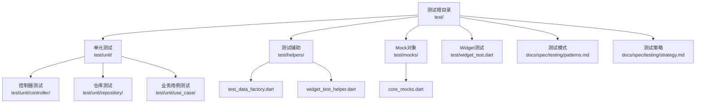
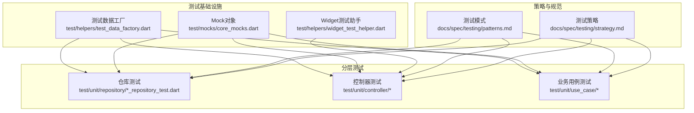
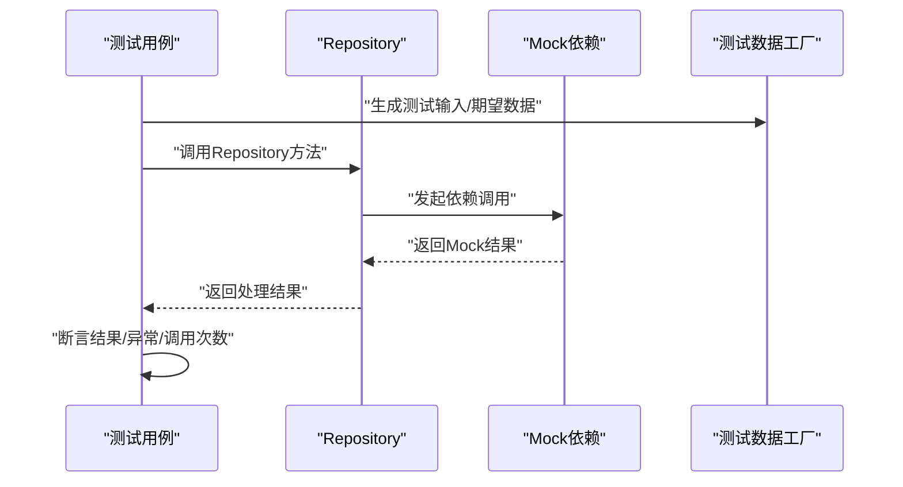
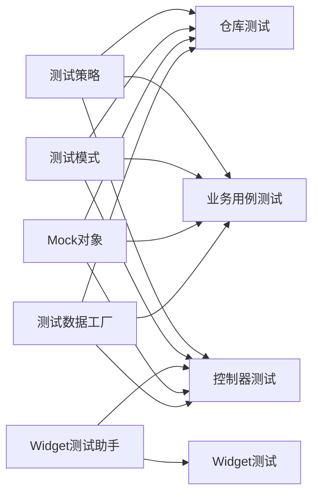

# 单元测试

<cite>
**本文引用的文件**
- [test/unit/repository/search_repository_test.dart](file://test/unit/repository/search_repository_test.dart)
- [test/unit/repository/user_repository_test.dart](file://test/unit/repository/user_repository_test.dart)
- [test/unit/repository/video_repository_test.dart](file://test/unit/repository/video_repository_test.dart)
- [test/helpers/test_data_factory.dart](file://test/helpers/test_data_factory.dart)
- [test/helpers/widget_test_helper.dart](file://test/helpers/widget_test_helper.dart)
- [test/mocks/core_mocks.dart](file://test/mocks/core_mocks.dart)
- [test/widget_test.dart](file://test/widget_test.dart)
- [docs/spec/testing/patterns.md](file://docs/spec/testing/patterns.md)
- [docs/spec/testing/strategy.md](file://docs/spec/testing/strategy.md)
</cite>

## 目录
1. [引言](#引言)
2. [项目结构](#项目结构)
3. [核心组件](#核心组件)
4. [架构总览](#架构总览)
5. [详细组件分析](#详细组件分析)
6. [依赖关系分析](#依赖关系分析)
7. [性能考虑](#性能考虑)
8. [故障排查指南](#故障排查指南)
9. [结论](#结论)
10. [附录](#附录)

## 引言
本文件面向PiliPala项目的开发者，系统化梳理单元测试的组织结构与实施策略，覆盖控制器测试、仓库（Repository）测试与业务用例（Use Case）测试的实践要点。文档重点阐述Mock对象的使用、测试数据工厂的应用、测试隔离技术，并给出GetX控制器测试、Repository模式测试与业务用例测试的最佳实践。同时，提供断言方法、异常处理测试与边界条件测试的指导，明确测试覆盖率要求、命名规范与维护策略，帮助团队建立高质量的单元测试体系。

## 项目结构
PiliPala的测试目录采用按“层次+功能”混合组织方式：unit目录下按模块类型划分controller、repository、use_case三个子目录；helpers提供测试辅助工具（如测试数据工厂与Widget测试助手）；mocks集中存放通用Mock对象；widget与widget_test.dart用于UI层测试；docs/spec/testing提供测试策略与模式文档作为规范依据。

**图表来源**
- [test/unit/repository/search_repository_test.dart](file://test/unit/repository/search_repository_test.dart)
- [test/unit/repository/user_repository_test.dart](file://test/unit/repository/user_repository_test.dart)
- [test/unit/repository/video_repository_test.dart](file://test/unit/repository/video_repository_test.dart)
- [test/helpers/test_data_factory.dart](file://test/helpers/test_data_factory.dart)
- [test/helpers/widget_test_helper.dart](file://test/helpers/widget_test_helper.dart)
- [test/mocks/core_mocks.dart](file://test/mocks/core_mocks.dart)
- [test/widget_test.dart](file://test/widget_test.dart)
- [docs/spec/testing/patterns.md](file://docs/spec/testing/patterns.md)
- [docs/spec/testing/strategy.md](file://docs/spec/testing/strategy.md)

**章节来源**
- [test/unit/repository/search_repository_test.dart](file://test/unit/repository/search_repository_test.dart)
- [test/unit/repository/user_repository_test.dart](file://test/unit/repository/user_repository_test.dart)
- [test/unit/repository/video_repository_test.dart](file://test/unit/repository/video_repository_test.dart)
- [test/helpers/test_data_factory.dart](file://test/helpers/test_data_factory.dart)
- [test/helpers/widget_test_helper.dart](file://test/helpers/widget_test_helper.dart)
- [test/mocks/core_mocks.dart](file://test/mocks/core_mocks.dart)
- [test/widget_test.dart](file://test/widget_test.dart)
- [docs/spec/testing/patterns.md](file://docs/spec/testing/patterns.md)
- [docs/spec/testing/strategy.md](file://docs/spec/testing/strategy.md)

## 核心组件
- 测试数据工厂：提供可复用、可扩展的测试数据生成器，确保测试用例的稳定性和一致性。
- Mock对象：集中管理跨模块复用的Mock接口与桩对象，降低耦合并提升测试隔离性。
- Widget测试助手：封装Flutter Widget测试常用步骤，统一setUp/tearDown与渲染流程。
- 仓库测试：针对Repository层进行隔离测试，验证网络/存储交互与数据转换逻辑。
- 控制器测试：结合GetX控制器特性，验证状态变更、事件响应与副作用控制。
- 业务用例测试：围绕Use Case编排业务流程，验证输入校验、异常分支与边界条件。

**章节来源**
- [test/helpers/test_data_factory.dart](file://test/helpers/test_data_factory.dart)
- [test/mocks/core_mocks.dart](file://test/mocks/core_mocks.dart)
- [test/helpers/widget_test_helper.dart](file://test/helpers/widget_test_helper.dart)
- [test/unit/repository/search_repository_test.dart](file://test/unit/repository/search_repository_test.dart)
- [test/unit/repository/user_repository_test.dart](file://test/unit/repository/user_repository_test.dart)
- [test/unit/repository/video_repository_test.dart](file://test/unit/repository/video_repository_test.dart)

## 架构总览
单元测试架构以“测试数据工厂 + Mock对象 + 测试助手”为基础支撑，通过分层测试（仓库/控制器/用例）实现对业务逻辑的全面覆盖。测试策略与模式文档为测试设计提供规范指引，确保团队在不同模块中采用一致的方法论。

**图表来源**
- [test/helpers/test_data_factory.dart](file://test/helpers/test_data_factory.dart)
- [test/mocks/core_mocks.dart](file://test/mocks/core_mocks.dart)
- [test/helpers/widget_test_helper.dart](file://test/helpers/widget_test_helper.dart)
- [test/unit/repository/search_repository_test.dart](file://test/unit/repository/search_repository_test.dart)
- [test/unit/repository/user_repository_test.dart](file://test/unit/repository/user_repository_test.dart)
- [test/unit/repository/video_repository_test.dart](file://test/unit/repository/video_repository_test.dart)
- [docs/spec/testing/patterns.md](file://docs/spec/testing/patterns.md)
- [docs/spec/testing/strategy.md](file://docs/spec/testing/strategy.md)

## 详细组件分析

### 测试数据工厂（Test Data Factory）
- 职责：为各类模型与DTO生成标准化的测试数据，支持随机化与定制化字段组合，避免硬编码数据带来的脆弱性。
- 应用场景：仓库测试中的实体构造、控制器测试中的状态初始化、业务用例测试中的输入参数准备。
- 最佳实践：
  - 将默认值与可选值分离，便于快速切换不同测试场景。
  - 提供“最小可用数据集”与“边界数据集”，覆盖正常与异常分支。
  - 对易变字段（如时间戳、ID）提供可控的生成策略，确保可重复性。

**章节来源**
- [test/helpers/test_data_factory.dart](file://test/helpers/test_data_factory.dart)

### Mock对象（Mock Objects）
- 职责：替代外部依赖（如网络客户端、数据库访问层），返回预设结果或记录调用轨迹，确保测试隔离与可预测性。
- 组织：集中于test/mocks/core_mocks.dart，便于跨模块共享与统一维护。
- 使用建议：
  - 明确Mock接口与期望行为，避免过度Mock导致测试与实现紧耦合。
  - 结合测试数据工厂，为Mock注入合理的输入输出数据。
  - 在测试结束后清理状态，防止用例间相互影响。

**章节来源**
- [test/mocks/core_mocks.dart](file://test/mocks/core_mocks.dart)

### Widget测试助手（Widget Test Helper）
- 职责：封装Flutter Widget测试的通用流程（如setUp/tearDown、渲染、等待、断言），减少重复代码，提升测试一致性。
- 应用：控制器测试与页面相关逻辑的UI层验证。
- 建议：
  - 将公共配置（如Theme、Localizations、Navigator）集中到助手函数中。
  - 提供轻量级的“最小渲染树”构建方法，加速测试执行。

**章节来源**
- [test/helpers/widget_test_helper.dart](file://test/helpers/widget_test_helper.dart)

### 仓库测试（Repository Tests）
- 目标：验证Repository层的数据获取、转换与错误处理逻辑，确保与上游服务（网络/存储）解耦。
- 关键点：
  - 使用Mock对象模拟网络/存储返回，覆盖成功、失败与超时等场景。
  - 利用测试数据工厂构造边界输入（空列表、空字符串、极大值等）。
  - 断言数据映射正确性与异常传播路径。
- 示例参考：
  - 搜索仓库测试：[search_repository_test.dart](file://test/unit/repository/search_repository_test.dart)
  - 用户仓库测试：[user_repository_test.dart](file://test/unit/repository/user_repository_test.dart)
  - 视频仓库测试：[video_repository_test.dart](file://test/unit/repository/video_repository_test.dart)

**图表来源**
- [test/unit/repository/search_repository_test.dart](file://test/unit/repository/search_repository_test.dart)
- [test/unit/repository/user_repository_test.dart](file://test/unit/repository/user_repository_test.dart)
- [test/unit/repository/video_repository_test.dart](file://test/unit/repository/video_repository_test.dart)
- [test/helpers/test_data_factory.dart](file://test/helpers/test_data_factory.dart)
- [test/mocks/core_mocks.dart](file://test/mocks/core_mocks.dart)

**章节来源**
- [test/unit/repository/search_repository_test.dart](file://test/unit/repository/search_repository_test.dart)
- [test/unit/repository/user_repository_test.dart](file://test/unit/repository/user_repository_test.dart)
- [test/unit/repository/video_repository_test.dart](file://test/unit/repository/video_repository_test.dart)

### 控制器测试（GetX Controllers）
- 目标：验证控制器的状态更新、事件回调与副作用（如导航、弹窗、请求触发）。
- 方法：
  - 使用Widget测试助手进行渲染与交互模拟。
  - 通过Mock替换控制器依赖的服务，隔离外部影响。
  - 使用测试数据工厂构造输入参数与期望状态。
- 断言建议：
  - 状态断言：检查控制器内部状态是否符合预期。
  - 行为断言：验证是否触发了正确的副作用（如请求发起、页面跳转）。
  - 异常断言：捕获并验证错误提示或回退状态。
- 边界条件：
  - 输入为空、格式不合法、网络不可用等场景。
- 参考入口：
  - 控制器测试目录：[test/unit/controller/](file://test/unit/controller/)

**章节来源**
- [test/helpers/widget_test_helper.dart](file://test/helpers/widget_test_helper.dart)
- [test/mocks/core_mocks.dart](file://test/mocks/core_mocks.dart)
- [test/helpers/test_data_factory.dart](file://test/helpers/test_data_factory.dart)

### 业务用例测试（Use Cases）
- 目标：以独立用例为粒度验证业务规则、输入校验与异常分支。
- 方法：
  - 使用Mock对象注入依赖，确保用例只关注业务逻辑。
  - 使用测试数据工厂构造多组输入场景（含边界值）。
  - 验证输出结果与异常抛出是否符合预期。
- 参考入口：
  - 业务用例测试目录：[test/unit/use_case/](file://test/unit/use_case/)

**章节来源**
- [test/mocks/core_mocks.dart](file://test/mocks/core_mocks.dart)
- [test/helpers/test_data_factory.dart](file://test/helpers/test_data_factory.dart)

### UI层测试（Widget Tests）
- 目标：验证页面与组件的渲染、交互与状态变化。
- 方法：
  - 使用widget_test_helper.dart统一设置环境与断言流程。
  - 通过Mock替换服务层依赖，聚焦UI逻辑。
- 参考入口：
  - 入口文件：[test/widget_test.dart](file://test/widget_test.dart)

**章节来源**
- [test/widget_test.dart](file://test/widget_test.dart)
- [test/helpers/widget_test_helper.dart](file://test/helpers/widget_test_helper.dart)

## 依赖关系分析
- 测试数据工厂与Mock对象是仓库/控制器/用例测试的共同依赖，确保测试数据与外部依赖的一致性与可控性。
- Widget测试助手为UI层测试提供统一入口，降低环境差异带来的不确定性。
- 测试策略与模式文档为各模块测试提供方法论与规范，保障测试质量与一致性。

**图表来源**
- [test/helpers/test_data_factory.dart](file://test/helpers/test_data_factory.dart)
- [test/mocks/core_mocks.dart](file://test/mocks/core_mocks.dart)
- [test/helpers/widget_test_helper.dart](file://test/helpers/widget_test_helper.dart)
- [test/unit/repository/search_repository_test.dart](file://test/unit/repository/search_repository_test.dart)
- [test/unit/repository/user_repository_test.dart](file://test/unit/repository/user_repository_test.dart)
- [test/unit/repository/video_repository_test.dart](file://test/unit/repository/video_repository_test.dart)
- [test/unit/controller/](file://test/unit/controller/)
- [test/unit/use_case/](file://test/unit/use_case/)
- [test/widget_test.dart](file://test/widget_test.dart)
- [docs/spec/testing/patterns.md](file://docs/spec/testing/patterns.md)
- [docs/spec/testing/strategy.md](file://docs/spec/testing/strategy.md)

**章节来源**
- [test/helpers/test_data_factory.dart](file://test/helpers/test_data_factory.dart)
- [test/mocks/core_mocks.dart](file://test/mocks/core_mocks.dart)
- [test/helpers/widget_test_helper.dart](file://test/helpers/widget_test_helper.dart)
- [test/unit/repository/search_repository_test.dart](file://test/unit/repository/search_repository_test.dart)
- [test/unit/repository/user_repository_test.dart](file://test/unit/repository/user_repository_test.dart)
- [test/unit/repository/video_repository_test.dart](file://test/unit/repository/video_repository_test.dart)
- [test/unit/controller/](file://test/unit/controller/)
- [test/unit/use_case/](file://test/unit/use_case/)
- [test/widget_test.dart](file://test/widget_test.dart)
- [docs/spec/testing/patterns.md](file://docs/spec/testing/patterns.md)
- [docs/spec/testing/strategy.md](file://docs/spec/testing/strategy.md)

## 性能考虑
- 使用Mock对象替代真实网络/存储调用，显著降低测试执行时间与资源消耗。
- 通过测试数据工厂生成最小必要数据，避免复杂对象构造带来的开销。
- 合理拆分测试用例，优先运行快速断言，将耗时场景放在独立套件中。
- 在Widget测试中尽量缩小渲染树范围，仅渲染与当前测试直接相关的组件。

## 故障排查指南
- 测试不稳定（时好时坏）：
  - 检查是否存在未重置的全局状态或静态Mock。
  - 确认测试数据工厂生成的数据是否满足依赖约束。
- 断言失败：
  - 使用更细粒度的断言（如逐字段对比、异常类型断言）定位问题。
  - 在Mock中开启调用轨迹记录，核对实际调用序列与次数。
- UI测试失败：
  - 确认Widget测试助手中的环境配置与实际应用一致。
  - 检查异步操作是否正确等待与断言。

## 结论
通过测试数据工厂、Mock对象与测试助手的协同，PiliPala实现了高内聚、低耦合的单元测试体系。结合测试策略与模式文档，团队可在仓库、控制器与业务用例层面系统性地覆盖正常与异常路径，确保代码质量与可维护性。建议持续完善测试覆盖率指标与回归策略，保持测试与业务演进同步。

## 附录

### 测试断言方法
- 状态断言：验证控制器/用例内部状态与外部依赖调用结果。
- 行为断言：验证副作用（请求、导航、弹窗）是否按预期触发。
- 异常断言：捕获并断言异常类型与消息内容。
- 边界断言：覆盖空值、极值、非法格式等边界条件。

### 异常处理测试
- 模拟网络/存储失败，验证错误提示与降级逻辑。
- 模拟解析异常，验证异常传播与用户反馈。
- 模拟超时与重试，验证重试策略与最终失败路径。

### 边界条件测试
- 输入为空、长度为0、数值越界、非法字符等。
- 返回空集合、单元素、大量数据等场景。
- 时间戳边界、ID重复、权限不足等业务边界。

### 测试覆盖率要求
- 建议仓库层与业务用例层达到较高覆盖率（如≥80%），控制器与UI层次之（如≥60%）。
- 关键路径与异常分支必须覆盖，新增功能需配套相应测试。

### 测试命名规范
- 仓库测试：以“*_repository_test.dart”命名，文件内以“测试场景描述”的形式组织用例。
- 控制器测试：以“*_controller_test.dart”命名，用例描述清晰的输入、行为与期望。
- 业务用例测试：以“*_use_case_test.dart”命名，用例聚焦单一业务规则。
- 辅助文件：test_data_factory.dart、widget_test_helper.dart、core_mocks.dart，分别对应数据、UI与Mock。

### 测试维护策略
- 定期重构测试：当被测代码演进时，同步调整测试用例与Mock。
- 回归测试：每次提交后自动运行单元测试，确保不引入回归。
- 文档驱动：以测试策略与模式文档为基准，统一团队测试方法论。