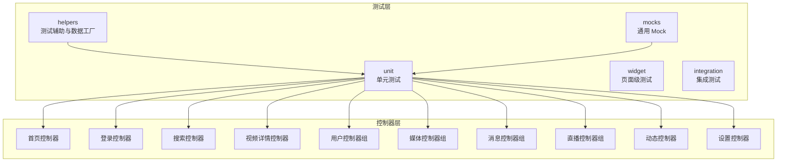
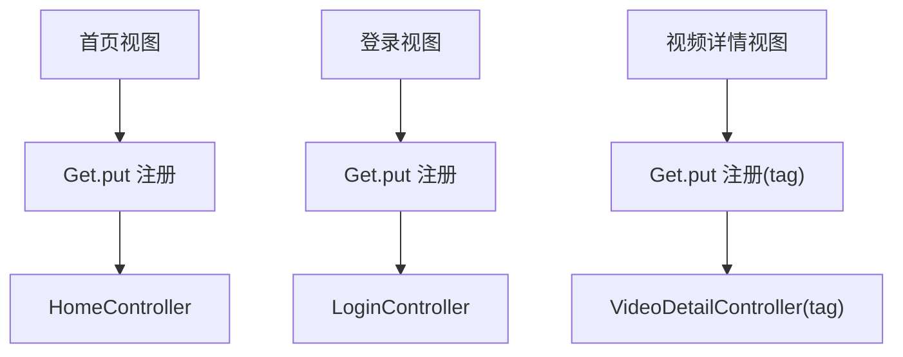
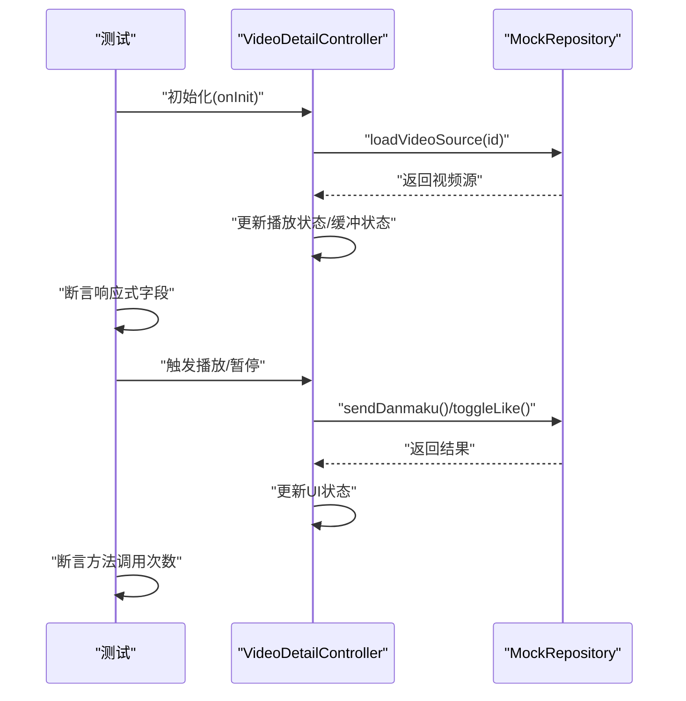
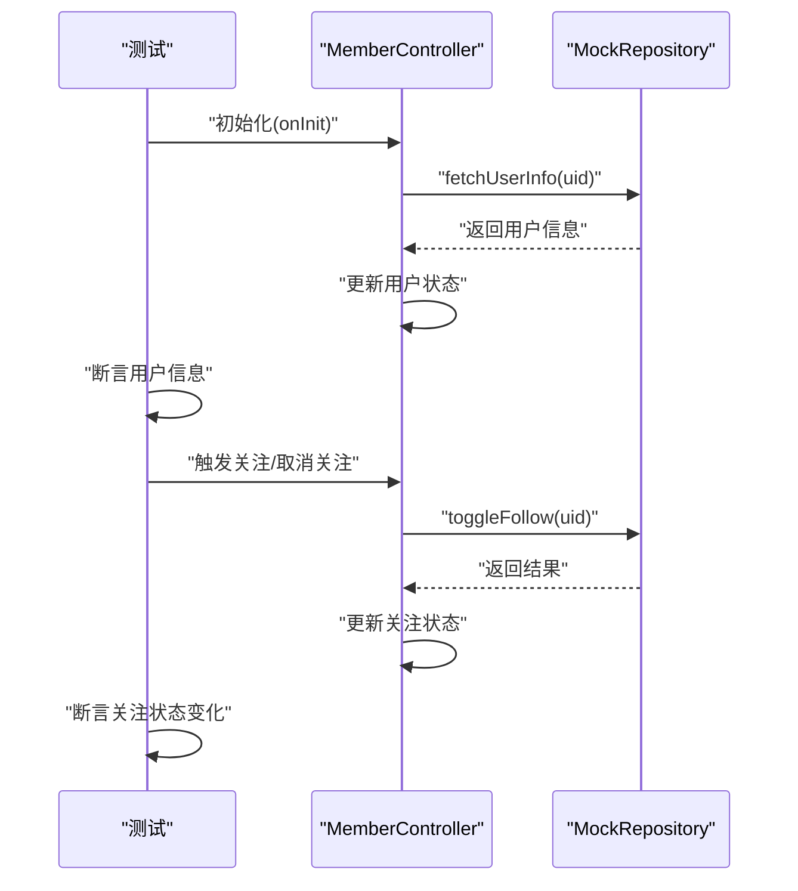
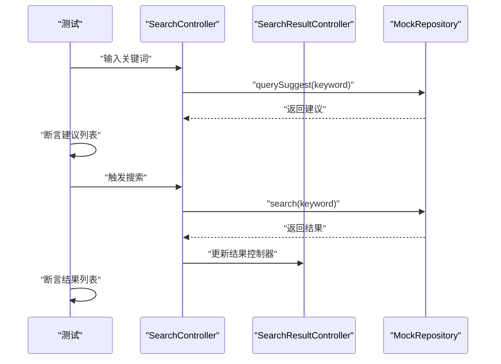
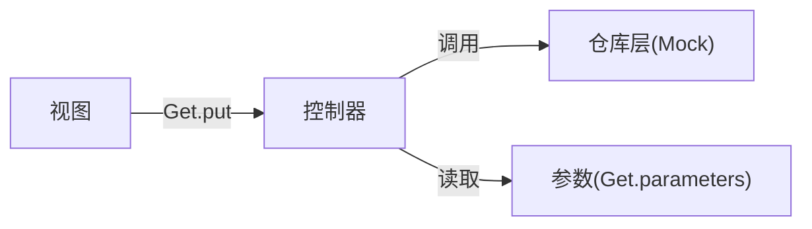

# 控制器测试

<cite>
**本文引用的文件**
- [patterns.md](file://docs/spec/testing/patterns.md)
- [02-state-management.md](file://docs/spec/architecture/02-state-management.md)
- [05-navigation.md](file://docs/spec/architecture/05-navigation.md)
- [test_data_factory.dart](file://test/helpers/test_data_factory.dart)
- [widget_test_helper.dart](file://test/helpers/widget_test_helper.dart)
- [core_mocks.dart](file://test/mocks/core_mocks.dart)
- [search_repository_test.dart](file://test/unit/repository/search_repository_test.dart)
- [user_repository_test.dart](file://test/unit/repository/user_repository_test.dart)
- [video_repository_test.dart](file://test/unit/repository/video_repository_test.dart)
- [home_page.dart](file://lib/features/home/presentation/home_page.dart)
- [login_page.dart](file://lib/features/login/presentation/login_page.dart)
- [main_page.dart](file://lib/features/main/presentation/main_page.dart)
- [video_detail_page.dart](file://lib/features/video/presentation/video_detail_page.dart)
- [home_controller.dart](file://lib/features/home/presentation/home_controller.dart)
- [login_controller.dart](file://lib/features/login/presentation/login_controller.dart)
- [search_controller.dart](file://lib/features/search/presentation/search_controller.dart)
- [search_result_controller.dart](file://lib/features/search/presentation/search_result_controller.dart)
- [video_detail_controller.dart](file://lib/features/video/presentation/video_detail_controller.dart)
- [member_controller.dart](file://lib/features/user/presentation/member_controller.dart)
- [mine_controller.dart](file://lib/features/user/presentation/mine_controller.dart)
- [later_controller.dart](file://lib/features/media/presentation/later_controller.dart)
- [history_controller.dart](file://lib/features/media/presentation/history_controller.dart)
- [fav_controller.dart](file://lib/features/media/presentation/fav_controller.dart)
- [whisper_controller.dart](file://lib/features/message/presentation/whisper_controller.dart)
- [message_reply_controller.dart](file://lib/features/message/presentation/message_reply_controller.dart)
- [live_controller.dart](file://lib/features/live/presentation/live_controller.dart)
- [live_room_controller.dart](file://lib/features/live/presentation/live_room_controller.dart)
- [dynamics_controller.dart](file://lib/features/dynamics/presentation/dynamics_controller.dart)
- [setting_controller.dart](file://lib/features/setting/presentation/setting_controller.dart)
</cite>

## 目录
1. [简介](#简介)
2. [项目结构](#项目结构)
3. [核心组件](#核心组件)
4. [架构概览](#架构概览)
5. [详细组件分析](#详细组件分析)
6. [依赖分析](#依赖分析)
7. [性能考虑](#性能考虑)
8. [故障排查指南](#故障排查指南)
9. [结论](#结论)
10. [附录](#附录)

## 简介
本文件面向开发者，系统性阐述 PiliPala 项目中基于 GetX 的控制器单元测试方法与最佳实践。内容覆盖控制器初始化测试、状态管理测试、事件处理测试、Mock 方法调用验证、响应式数据测试、异步操作测试、生命周期测试、依赖注入测试、错误处理测试等，并提供视频播放、用户管理、搜索等典型控制器的测试实现思路与断言策略。文档同时给出测试数据准备、测试隔离技术以及质量保证流程建议，帮助团队建立稳定高效的控制器测试体系。

## 项目结构
- 测试相关目录与文件
  - helpers：测试辅助工具与测试数据工厂
  - mocks：通用 Mock 定义
  - unit：单元测试，按功能域划分（controller、repository、use_case）
  - integration：集成测试
  - widget：页面级 Widget 测试
- 控制器分布
  - 主要控制器位于各特性模块的 presentation 层，如首页、登录、搜索、视频详情、用户、媒体、消息、直播、动态、设置等
- 测试规范与策略
  - 测试模式与最佳实践集中在 testing 文档
  - 状态管理与控制器生命周期在架构文档中有明确规范

**章节来源**
- [patterns.md:136-395](file://docs/spec/testing/patterns.md#L136-L395)
- [02-state-management.md:58-259](file://docs/spec/architecture/02-state-management.md#L58-L259)

## 核心组件
- 测试辅助与数据工厂
  - 测试数据工厂用于生成可复用的测试数据，便于不同场景下的断言
  - Widget 测试辅助提供包装 Material/GetX 环境、等待异步完成、模拟屏幕尺寸等能力
- 通用 Mock
  - 提供通用 Mock 接口与实现，便于替换真实依赖，隔离外部副作用
- 控制器规范与生命周期
  - 控制器应遵循 onInit/onReady/onClose 生命周期，在对应阶段完成初始化、首次加载与资源清理
  - 错误处理需统一设置加载状态与错误信息，避免 UI 直接参与
- 依赖注入与标签隔离
  - 使用 Get.put/Get.lazyPut 注册控制器；多实例场景使用 tag 区分
  - 测试中通过 Get.put 注入控制器，确保 Get.find 可用

**章节来源**
- [test_data_factory.dart](file://test/helpers/test_data_factory.dart)
- [widget_test_helper.dart](file://test/helpers/widget_test_helper.dart)
- [core_mocks.dart](file://test/mocks/core_mocks.dart)
- [patterns.md:247-395](file://docs/spec/testing/patterns.md#L247-L395)
- [02-state-management.md:60-82](file://docs/spec/architecture/02-state-management.md#L60-L82)
- [02-state-management.md:172-182](file://docs/spec/architecture/02-state-management.md#L172-L182)

## 架构概览
- 控制器与视图的绑定关系
  - 视图在构建时通过 Get.put 注册控制器，形成“视图-控制器”一对一或一对多的关系
  - 多实例场景使用 tag 将控制器与特定页面实例关联
- 依赖注入与路由参数
  - 控制器通过 Get.put 注入，支持立即创建与懒加载两种策略
  - 路由跳转时可通过参数传递，控制器中读取 Get.parameters

**图表来源**
- [home_page.dart:26](file://lib/features/home/presentation/home_page.dart#L26)
- [login_page.dart:17](file://lib/features/login/presentation/login_page.dart#L17)
- [video_detail_page.dart:42](file://lib/features/video/presentation/video_detail_page.dart#L42)

**章节来源**
- [02-state-management.md:149-166](file://docs/spec/architecture/02-state-management.md#L149-L166)
- [02-state-management.md:172-182](file://docs/spec/architecture/02-state-management.md#L172-L182)
- [05-navigation.md:205-216](file://docs/spec/architecture/05-navigation.md#L205-L216)

## 详细组件分析

### 测试策略与通用方法
- Mock 控制器与方法调用验证
  - 使用 MockController 模拟响应式状态字段（列表、布尔、字符串），并通过 setMockData/setMockError 快速切换状态
  - 使用 verify 对控制器内部方法进行调用次数验证，结合 FakeAsync 实现定时器场景的精确控制
- 响应式数据测试
  - 通过访问控制器的响应式字段（如 RxList/RxBool/RxString）验证状态变更是否正确传播
  - 结合 pump/pumpAndSettle 等测试辅助方法等待状态更新完成
- 异步操作测试
  - 使用 untilCalled/waitFor 等机制等待异步任务完成
  - 对防抖、节流等行为使用 FakeAsync 进行时间推进与断言
- 依赖注入测试
  - 在 setUp 中通过 Get.put 注入控制器实例，tearDown 中删除，确保每次测试独立
  - 多实例场景使用 tag 注入与查找，避免实例污染
- 错误处理测试
  - 统一设置 isLoading/error 状态，断言错误信息与 UI 表现一致
  - 对网络异常、解析失败等边界条件进行覆盖

**章节来源**
- [patterns.md:247-395](file://docs/spec/testing/patterns.md#L247-L395)

### 视频播放控制器测试（VideoDetailController）
- 测试目标
  - 初始化：加载视频元数据、弹幕配置、播放历史记录
  - 事件处理：播放/暂停、进度更新、全屏切换、清晰度选择
  - 响应式状态：播放状态、缓冲状态、错误状态、弹幕开关
  - 异步操作：加载视频源、发送弹幕、收藏/取消收藏
- 关键断言
  - 响应式字段断言：播放中/暂停、缓冲中、错误信息为空
  - 方法调用断言：加载视频源、发送弹幕、收藏接口调用次数
  - 生命周期断言：onInit/onClose 资源释放
- 测试隔离
  - 使用 tag 注入控制器实例，避免与其他页面实例冲突
  - 使用 MockRepository 替换真实网络请求，固定返回值

**图表来源**
- [video_detail_controller.dart](file://lib/features/video/presentation/video_detail_controller.dart)
- [video_detail_page.dart:42](file://lib/features/video/presentation/video_detail_page.dart#L42)

**章节来源**
- [video_detail_controller.dart](file://lib/features/video/presentation/video_detail_controller.dart)
- [video_detail_page.dart:42](file://lib/features/video/presentation/video_detail_page.dart#L42)

### 用户管理控制器测试（MemberController/MineController）
- 测试目标
  - 初始化：加载用户资料、粉丝数、关注数、个人统计
  - 事件处理：切换关注/取消关注、修改资料、退出登录
  - 响应式状态：用户信息、关注状态、错误信息
  - 异步操作：获取资料、关注/取消关注、更新头像/昵称
- 关键断言
  - 响应式字段断言：用户信息完整、关注状态正确
  - 方法调用断言：获取资料、关注/取消关注接口调用
  - 生命周期断言：onReady 加载数据、onClose 释放资源
- 测试隔离
  - 使用 Get.put 注入控制器，必要时使用 tag 区分不同用户实例

**图表来源**
- [member_controller.dart](file://lib/features/user/presentation/member_controller.dart)
- [mine_controller.dart](file://lib/features/user/presentation/mine_controller.dart)

**章节来源**
- [member_controller.dart](file://lib/features/user/presentation/member_controller.dart)
- [mine_controller.dart](file://lib/features/user/presentation/mine_controller.dart)

### 搜索控制器测试（SearchController/SearchResultController）
- 测试目标
  - 初始化：清空历史记录、重置搜索状态
  - 事件处理：输入关键词、触发搜索、加载更多、清空历史
  - 响应式状态：关键词、搜索结果列表、加载状态、错误信息
  - 异步操作：搜索建议、搜索结果、加载更多
- 关键断言
  - 响应式字段断言：关键词变化、结果列表长度、加载状态
  - 方法调用断言：querySuggest()/search()/loadMore() 调用次数
  - 防抖断言：FakeAsync 推进时间后仅触发一次搜索
- 测试隔离
  - 使用 MockRepository 替换真实搜索服务，固定返回值
  - 使用 WidgetTestHelper 包装 GetMaterialApp 环境

**图表来源**
- [search_controller.dart](file://lib/features/search/presentation/search_controller.dart)
- [search_result_controller.dart](file://lib/features/search/presentation/search_result_controller.dart)

**章节来源**
- [search_controller.dart](file://lib/features/search/presentation/search_controller.dart)
- [search_result_controller.dart](file://lib/features/search/presentation/search_result_controller.dart)
- [patterns.md:291-311](file://docs/spec/testing/patterns.md#L291-L311)

### 媒体控制器测试（LaterController/HistoryController/FavController）
- 测试目标
  - 初始化：加载稍后再看、历史记录、收藏列表
  - 事件处理：添加/移除稍后再看、清空历史、批量删除收藏
  - 响应式状态：列表数据、空态、错误信息
  - 异步操作：批量操作、分页加载
- 关键断言
  - 响应式字段断言：列表长度、空态显示
  - 方法调用断言：批量操作接口调用次数
- 测试隔离
  - 使用 MockRepository 固定返回值，避免真实数据库影响

**章节来源**
- [later_controller.dart](file://lib/features/media/presentation/later_controller.dart)
- [history_controller.dart](file://lib/features/media/presentation/history_controller.dart)
- [fav_controller.dart](file://lib/features/media/presentation/fav_controller.dart)

### 消息控制器测试（WhisperController/MessageReplyController）
- 测试目标
  - 初始化：加载私信/回复列表
  - 事件处理：发送消息、查看回复、标记已读
  - 响应式状态：消息列表、未读数、错误信息
  - 异步操作：发送消息、拉取回复
- 关键断言
  - 响应式字段断言：消息列表、未读数
  - 方法调用断言：发送消息、拉取回复接口调用
- 测试隔离
  - 使用 MockRepository 固定返回值

**章节来源**
- [whisper_controller.dart](file://lib/features/message/presentation/whisper_controller.dart)
- [message_reply_controller.dart](file://lib/features/message/presentation/message_reply_controller.dart)

### 直播控制器测试（LiveController/LiveRoomController）
- 测试目标
  - 初始化：加载直播列表、房间信息
  - 事件处理：进入房间、点赞、送礼物
  - 响应式状态：房间状态、礼物数量、错误信息
  - 异步操作：进入房间、发送弹幕
- 关键断言
  - 响应式字段断言：房间状态、礼物数量
  - 方法调用断言：进入房间、发送弹幕接口调用
- 测试隔离
  - 使用 MockRepository 固定返回值

**章节来源**
- [live_controller.dart](file://lib/features/live/presentation/live_controller.dart)
- [live_room_controller.dart](file://lib/features/live/presentation/live_room_controller.dart)

### 动态与设置控制器测试（DynamicsController/SettingController）
- 测试目标
  - 动态：加载动态列表、点赞/取消点赞
  - 设置：切换主题、语言、通知开关
- 关键断言
  - 响应式字段断言：列表长度、点赞状态
  - 方法调用断言：点赞/取消点赞、设置更新接口调用

**章节来源**
- [dynamics_controller.dart](file://lib/features/dynamics/presentation/dynamics_controller.dart)
- [setting_controller.dart](file://lib/features/setting/presentation/setting_controller.dart)

## 依赖分析
- 控制器与视图的耦合
  - 视图通过 Get.put 注册控制器，控制器不直接依赖具体视图组件，降低耦合
- 控制器与仓库层的依赖
  - 控制器通过仓库层发起网络请求，测试中以 Mock 仓库替代，确保可控性
- 依赖注入策略
  - Get.put：立即创建并注册
  - Get.lazyPut：首次使用时创建
  - tag：多实例场景区分控制器实例

**图表来源**
- [02-state-management.md:149-166](file://docs/spec/architecture/02-state-management.md#L149-L166)
- [02-state-management.md:172-182](file://docs/spec/architecture/02-state-management.md#L172-L182)
- [05-navigation.md:205-216](file://docs/spec/architecture/05-navigation.md#L205-L216)

**章节来源**
- [02-state-management.md:149-182](file://docs/spec/architecture/02-state-management.md#L149-L182)
- [05-navigation.md:205-216](file://docs/spec/architecture/05-navigation.md#L205-L216)

## 性能考虑
- 渲染性能
  - 使用 Stopwatch 记录页面渲染耗时，断言在合理阈值内
- 异步性能
  - 使用 pump/pumpAndSettle 等方法等待异步完成，避免过早断言
- 防抖与节流
  - 使用 FakeAsync 推进时间，验证高频输入仅触发一次有效操作

**章节来源**
- [patterns.md:330-346](file://docs/spec/testing/patterns.md#L330-L346)
- [patterns.md:291-311](file://docs/spec/testing/patterns.md#L291-L311)

## 故障排查指南
- Get.find() 抛出异常
  - 在 setUp 中通过 Get.put 注入控制器，在 tearDown 中删除，确保测试前后环境干净
- Widget 测试找不到元素
  - 确保测试 Widget 包装在 MaterialApp/GetMaterialApp 中，使元素可见
- Mock 未生效
  - 确认 Mock 在 Get.put 之前定义，并在测试开始前完成注入
- 状态未更新
  - 使用 pump/pumpAndSettle 等方法等待响应式状态更新完成

**章节来源**
- [patterns.md:383-395](file://docs/spec/testing/patterns.md#L383-L395)
- [patterns.md:136-172](file://docs/spec/testing/patterns.md#L136-L172)

## 结论
通过规范化的控制器测试策略与最佳实践，PiliPala 项目能够有效保障控制器的初始化、状态管理、事件处理、生命周期与依赖注入等关键行为的正确性。配合 Mock 与测试辅助工具，可以实现高隔离度、高可重复性的测试用例，提升整体代码质量与交付稳定性。

## 附录
- 测试数据准备
  - 使用 test_data_factory 生成统一的测试数据，减少重复构造
- 测试隔离技术
  - 使用 Get.put/Get.delete 管理控制器生命周期
  - 使用 tag 区分多实例控制器
- 覆盖率与质量保证
  - 使用 flutter test --coverage 生成覆盖率报告，持续改进测试覆盖面

**章节来源**
- [test_data_factory.dart](file://test/helpers/test_data_factory.dart)
- [patterns.md:350-372](file://docs/spec/testing/patterns.md#L350-L372)