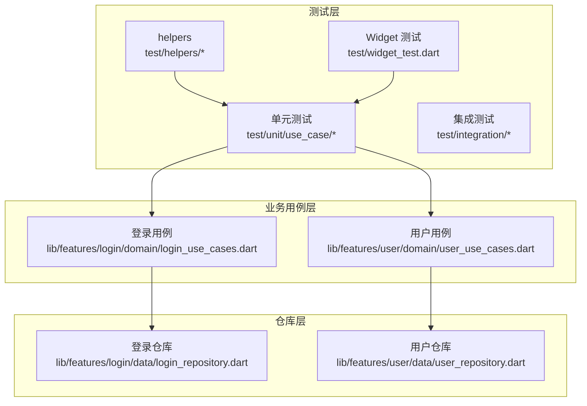
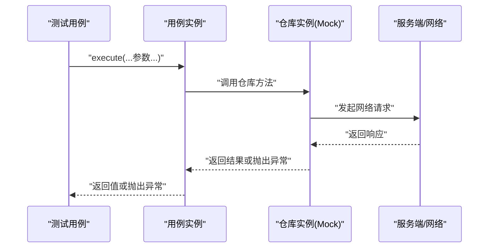
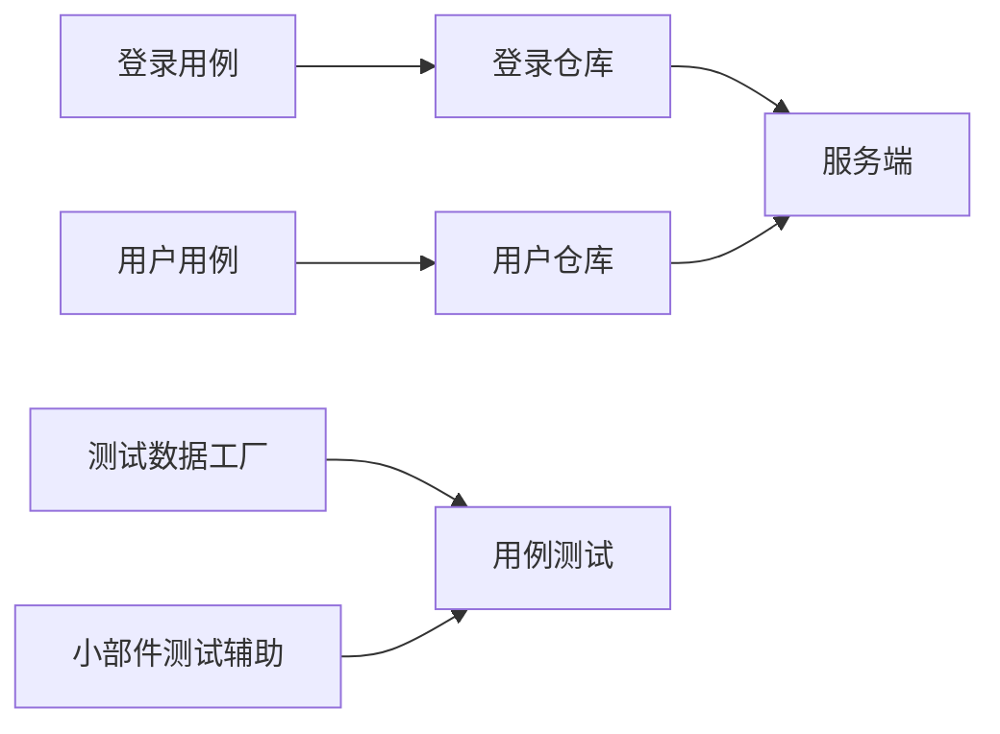

# 用例测试

<cite>
**本文引用的文件**
- [login_use_cases.dart](file://lib/features/login/domain/login_use_cases.dart)
- [user_use_cases.dart](file://lib/features/user/domain/user_use_cases.dart)
- [patterns.md](file://docs/spec/testing/patterns.md)
- [strategy.md](file://docs/spec/testing/strategy.md)
- [search_repository_test.dart](file://test/unit/repository/search_repository_test.dart)
- [user_repository_test.dart](file://test/unit/repository/user_repository_test.dart)
- [video_repository_test.dart](file://test/unit/repository/video_repository_test.dart)
- [test_data_factory.dart](file://test/helpers/test_data_factory.dart)
- [widget_test_helper.dart](file://test/helpers/widget_test_helper.dart)
- [widget_test.dart](file://test/widget_test.dart)
</cite>

## 目录
1. [简介](#简介)
2. [项目结构](#项目结构)
3. [核心组件](#核心组件)
4. [架构总览](#架构总览)
5. [详细组件分析](#详细组件分析)
6. [依赖分析](#依赖分析)
7. [性能考虑](#性能考虑)
8. [故障排查指南](#故障排查指南)
9. [结论](#结论)
10. [附录](#附录)

## 简介
本文件面向开发者与测试工程师，系统化梳理 PiliPala 项目中 Use Cases 层的测试策略与实践，重点覆盖以下方面：
- 用例执行测试：验证用例对外接口行为与返回值
- 参数验证测试：覆盖必填参数、类型约束与业务参数范围
- 返回值验证测试：断言成功/失败分支与错误消息
- 异常处理验证：用例内部抛出异常的场景与边界条件
- 组合测试：多用例协作、前置条件与依赖关系
- 性能与并发测试：在隔离环境中评估用例的稳定性与吞吐
- 质量保证流程：从命名规范、测试结构到 CI/CD 集成的最佳实践

## 项目结构
围绕 Use Cases 层的测试，项目采用分层组织方式：
- 用例定义位于 domain 层，封装业务逻辑与调用仓库层
- 单元测试位于 test/unit/use_case，按功能域划分
- 辅助工具位于 test/helpers，包括测试数据工厂与小部件测试辅助
- 文档规范位于 docs/spec/testing，提供测试模式与策略

**图表来源**
- [login_use_cases.dart:1-104](file://lib/features/login/domain/login_use_cases.dart#L1-L104)
- [user_use_cases.dart:43-94](file://lib/features/user/domain/user_use_cases.dart#L43-L94)

**章节来源**
- [strategy.md:290-357](file://docs/spec/testing/strategy.md#L290-L357)

## 核心组件
本节聚焦 Use Cases 层的关键用例与测试关注点。

- 登录用例
  - 获取验证码：验证网络请求与返回结构
  - 密码登录：校验参数完整性与安全参数
  - 短信登录：校验手机号、验证码与图形验证码键
  - 发送短信：校验发送参数与风控参数
  - 二维码登录：校验二维码生成与状态轮询

- 用户用例
  - 关注/取消关注：校验 mid 与 follow 参数，以及响应状态
  - 获取用户硬币视频：校验 mid 参数与数据返回
  - 获取用户点赞视频：校验 mid 参数与数据返回

**章节来源**
- [login_use_cases.dart:1-104](file://lib/features/login/domain/login_use_cases.dart#L1-L104)
- [user_use_cases.dart:43-94](file://lib/features/user/domain/user_use_cases.dart#L43-L94)

## 架构总览
下图展示用例层的典型调用链路与测试关注点：

**图表来源**
- [login_use_cases.dart:11-40](file://lib/features/login/domain/login_use_cases.dart#L11-L40)
- [user_use_cases.dart:54-86](file://lib/features/user/domain/user_use_cases.dart#L54-L86)

## 详细组件分析

### 登录用例测试
- 用例清单
  - 获取验证码：验证返回结构与字段存在性
  - Web 密码登录：验证用户名、密码、token、challenge、validate、seccode 全部必填
  - 短信登录：验证 cid、tel、code、captchaKey 的参数校验
  - 发送短信：验证发送参数与风控参数
  - 二维码登录：验证二维码生成与状态轮询

- 测试要点
  - 参数验证：缺失任一必填参数应触发异常或返回错误
  - 返回值验证：成功时返回结构包含必要字段；失败时抛出异常或返回错误信息
  - 异常处理：网络异常、服务端错误、参数非法等场景
  - 边界条件：空字符串、超长字符串、非法数字、特殊字符
  - 组合测试：验证码获取后，再进行登录；二维码登录的状态轮询

- 示例测试思路（不包含具体代码）
  - 密码登录用例
    - 正向：提供完整参数，期望返回成功结构
    - 反向：缺少任意参数，期望抛出异常或返回错误
    - 边界：用户名为 0 或极大值，密码为空，验证码参数为空
  - 短信登录用例
    - 正向：提供完整参数，期望返回成功结构
    - 反向：手机号格式错误、验证码过期或错误、图形验证码键无效
  - 二维码登录用例
    - 正向：生成二维码后轮询状态，直到成功或超时
    - 反向：二维码已过期、状态轮询超时

**章节来源**
- [login_use_cases.dart:1-104](file://lib/features/login/domain/login_use_cases.dart#L1-L104)

### 用户用例测试
- 用例清单
  - 关注/取消关注：校验 mid 与 follow 参数，检查响应状态
  - 获取用户硬币视频：校验 mid 参数，检查数据列表
  - 获取用户点赞视频：校验 mid 参数，检查数据列表

- 测试要点
  - 参数验证：mid 必须为正整数；follow 为布尔值
  - 返回值验证：成功时返回数据列表；失败时抛出异常或返回错误信息
  - 异常处理：用户不存在、权限不足、网络异常
  - 边界条件：mid 为 0、负数、极大值；列表为空、单条数据、大量数据
  - 组合测试：先关注后取消关注，再查询硬币/点赞视频

- 示例测试思路（不包含具体代码）
  - 关注用例
    - 正向：mid 存在且 follow=true，期望成功
    - 反向：mid 不存在或非法，期望抛出异常
  - 获取硬币视频用例
    - 正向：mid 存在，期望返回非空列表
    - 反向：mid 非法或无数据，期望抛出异常或返回空列表

**章节来源**
- [user_use_cases.dart:43-94](file://lib/features/user/domain/user_use_cases.dart#L43-L94)

### 用例测试通用流程
- 测试命名规范
  - 文件命名：{feature}_use_case_test.dart
  - 分组：group('FeatureName', () { ... })
  - 用例：test('should ... when ...', () { ... })

- 测试结构
  - Arrange：准备输入参数、Mock 仓库、注入依赖
  - Act：调用用例 execute 方法
  - Assert：断言返回值或异常
  - TearDown：释放资源与清理状态

- 最佳实践
  - 避免测试框架与第三方库；仅测试业务逻辑
  - 每个测试只验证一个概念
  - 使用描述性测试名称

**章节来源**
- [strategy.md:290-357](file://docs/spec/testing/strategy.md#L290-L357)

## 依赖分析
- 用例对仓库的依赖
  - 用例通过 Get.find 注入仓库实例，测试中以 Mock 替换
  - 仓库负责网络请求与数据转换，用例负责业务规则与异常处理

- 测试辅助工具
  - 测试数据工厂：统一创建模型与 API 响应
  - 小部件测试辅助：用于 UI 场景下的用例驱动

**图表来源**
- [login_use_cases.dart:1-104](file://lib/features/login/domain/login_use_cases.dart#L1-L104)
- [user_use_cases.dart:43-94](file://lib/features/user/domain/user_use_cases.dart#L43-L94)

**章节来源**
- [test_data_factory.dart](file://test/helpers/test_data_factory.dart)
- [widget_test_helper.dart](file://test/helpers/widget_test_helper.dart)

## 性能考虑
- 并发测试
  - 多线程并发调用同一用例，验证线程安全与幂等性
  - 并发调用不同用例，验证资源竞争与共享状态一致性

- 性能测试
  - 在 Mock 环境下批量执行用例，统计平均耗时与 P95/P99
  - 验证异常路径的快速失败与低开销

- 资源管理
  - 确保每次测试后释放 Mock 资源与连接
  - 控制测试数据规模，避免内存泄漏

**章节来源**
- [strategy.md:265-357](file://docs/spec/testing/strategy.md#L265-L357)

## 故障排查指南
- 常见问题
  - 用例未触发异常：检查仓库返回结构与用例判断逻辑
  - 参数校验失败：确认输入参数类型与范围是否符合用例要求
  - Mock 不生效：确保用例通过依赖注入获取仓库实例

- 排查步骤
  - 打印用例输入与仓库返回值，定位异常分支
  - 使用最小化用例复现问题，逐步增加复杂度
  - 对比成功与失败用例的差异，缩小问题范围

- 相关参考
  - 测试命名与结构规范
  - 测试数据工厂的使用

**章节来源**
- [strategy.md:290-357](file://docs/spec/testing/strategy.md#L290-L357)
- [patterns.md:72-134](file://docs/spec/testing/patterns.md#L72-L134)

## 结论
Use Cases 层的测试应聚焦于业务规则、参数验证与异常处理，结合 Mock 仓库与测试数据工厂，构建稳定、可维护的测试体系。通过规范化的命名与结构、完善的组合与边界测试，以及持续集成中的覆盖率与报告机制，确保用例质量与交付效率。

## 附录

### 用例测试示例（路径指引）
- 登录用例
  - 密码登录：参考 [login_use_cases.dart:17-40](file://lib/features/login/domain/login_use_cases.dart#L17-L40)
  - 短信登录：参考 [login_use_cases.dart:42-62](file://lib/features/login/domain/login_use_cases.dart#L42-L62)
  - 发送短信：参考 [login_use_cases.dart:64-88](file://lib/features/login/domain/login_use_cases.dart#L64-L88)
  - 二维码登录：参考 [login_use_cases.dart:90-104](file://lib/features/login/domain/login_use_cases.dart#L90-L104)

- 用户用例
  - 关注/取消关注：参考 [user_use_cases.dart:48-68](file://lib/features/user/domain/user_use_cases.dart#L48-L68)
  - 获取用户硬币视频：参考 [user_use_cases.dart:70-87](file://lib/features/user/domain/user_use_cases.dart#L70-L87)

- 测试数据与辅助
  - 测试数据工厂：参考 [patterns.md:72-134](file://docs/spec/testing/patterns.md#L72-L134)
  - 小部件测试辅助：参考 [widget_test_helper.dart](file://test/helpers/widget_test_helper.dart)
  - 用例测试入口：参考 [widget_test.dart](file://test/widget_test.dart)

**章节来源**
- [login_use_cases.dart:1-104](file://lib/features/login/domain/login_use_cases.dart#L1-L104)
- [user_use_cases.dart:43-94](file://lib/features/user/domain/user_use_cases.dart#L43-L94)
- [patterns.md:72-134](file://docs/spec/testing/patterns.md#L72-L134)
- [widget_test_helper.dart](file://test/helpers/widget_test_helper.dart)
- [widget_test.dart](file://test/widget_test.dart)