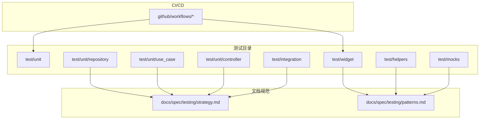
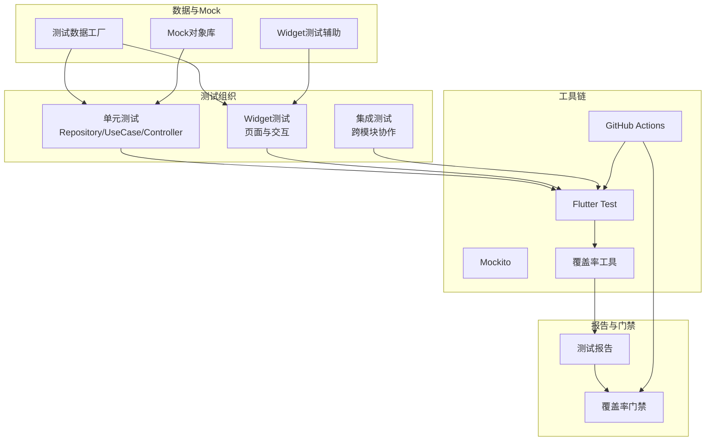
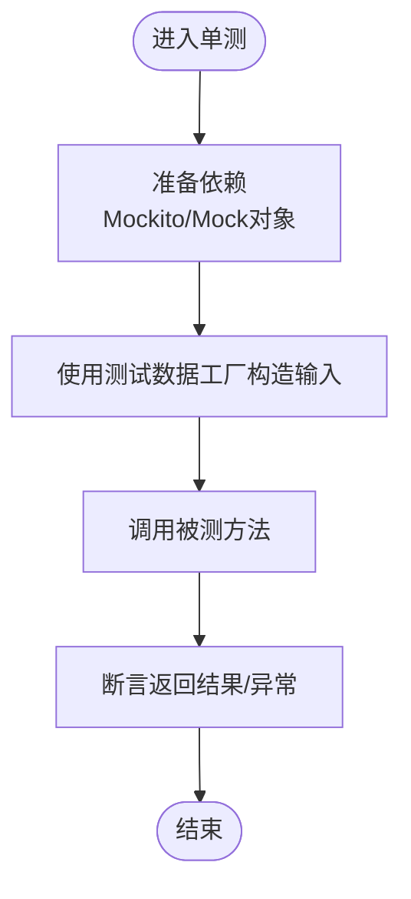
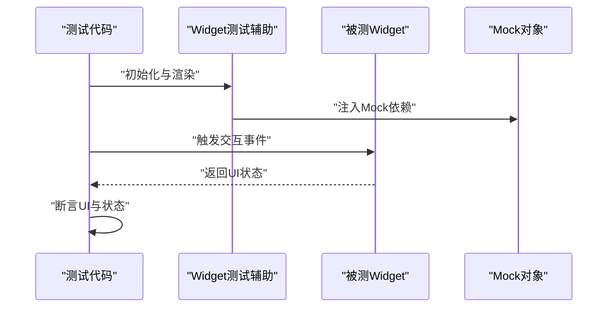
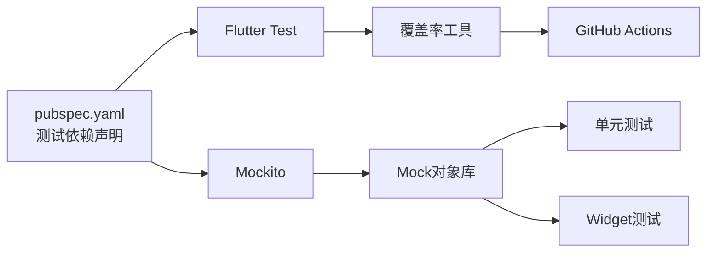

# 测试策略

<cite>
**本文引用的文件**
- [pubspec.yaml](file://pubspec.yaml)
- [test/unit/repository/search_repository_test.dart](file://test/unit/repository/search_repository_test.dart)
- [test/unit/repository/user_repository_test.dart](file://test/unit/repository/user_repository_test.dart)
- [test/unit/repository/video_repository_test.dart](file://test/unit/repository/video_repository_test.dart)
- [test/helpers/test_data_factory.dart](file://test/helpers/test_data_factory.dart)
- [test/helpers/widget_test_helper.dart](file://test/helpers/widget_test_helper.dart)
- [test/mocks/core_mocks.dart](file://test/mocks/core_mocks.dart)
- [test/widget_test.dart](file://test/widget_test.dart)
- [docs/spec/testing/strategy.md](file://docs/spec/testing/strategy.md)
- [docs/spec/testing/patterns.md](file://docs/spec/testing/patterns.md)
- [.github/workflows](file://.github/workflows)
</cite>

## 目录
1. [引言](#引言)
2. [项目结构](#项目结构)
3. [核心组件](#核心组件)
4. [架构总览](#架构总览)
5. [详细组件分析](#详细组件分析)
6. [依赖分析](#依赖分析)
7. [性能考虑](#性能考虑)
8. [故障排查指南](#故障排查指南)
9. [结论](#结论)
10. [附录](#附录)

## 引言
本测试策略文档面向PiliPala项目，系统化阐述测试体系与实施方法，覆盖单元测试、集成测试与Widget测试三大层次；明确测试框架与工具链选择（Flutter Test、Mockito等），给出测试用例编写指南、Mock对象与测试数据工厂的使用方法；制定覆盖率目标与性能测试方法，并规划自动化测试流程与CI/CD集成要点。同时总结测试驱动开发（TDD）实践、最佳实践与常见陷阱，帮助团队建立可持续的质量保障流程。

## 项目结构
测试相关目录与文件分布如下：
- test/unit：按领域分层组织的单元测试，覆盖controller、repository、use_case等
- test/integration：集成测试（当前为空或待填充）
- test/widget：Widget测试入口与页面级Widget测试
- test/helpers：测试数据工厂与Widget测试辅助工具
- test/mocks：Mock对象定义（如core_mocks.dart）
- docs/spec/testing：测试策略与模式规范文档
- .github/workflows：CI工作流（用于自动化测试与质量门禁）

**图表来源**
- [test/unit/repository/search_repository_test.dart](file://test/unit/repository/search_repository_test.dart)
- [test/unit/repository/user_repository_test.dart](file://test/unit/repository/user_repository_test.dart)
- [test/unit/repository/video_repository_test.dart](file://test/unit/repository/video_repository_test.dart)
- [test/helpers/test_data_factory.dart](file://test/helpers/test_data_factory.dart)
- [test/helpers/widget_test_helper.dart](file://test/helpers/widget_test_helper.dart)
- [test/mocks/core_mocks.dart](file://test/mocks/core_mocks.dart)
- [test/widget_test.dart](file://test/widget_test.dart)
- [docs/spec/testing/strategy.md](file://docs/spec/testing/strategy.md)
- [docs/spec/testing/patterns.md](file://docs/spec/testing/patterns.md)
- [.github/workflows](file://.github/workflows)

**章节来源**
- [test/unit/repository/search_repository_test.dart](file://test/unit/repository/search_repository_test.dart)
- [test/unit/repository/user_repository_test.dart](file://test/unit/repository/user_repository_test.dart)
- [test/unit/repository/video_repository_test.dart](file://test/unit/repository/video_repository_test.dart)
- [test/helpers/test_data_factory.dart](file://test/helpers/test_data_factory.dart)
- [test/helpers/widget_test_helper.dart](file://test/helpers/widget_test_helper.dart)
- [test/mocks/core_mocks.dart](file://test/mocks/core_mocks.dart)
- [test/widget_test.dart](file://test/widget_test.dart)
- [docs/spec/testing/strategy.md](file://docs/spec/testing/strategy.md)
- [docs/spec/testing/patterns.md](file://docs/spec/testing/patterns.md)
- [.github/workflows](file://.github/workflows)

## 核心组件
- 测试框架与工具链
  - Flutter Test：官方测试框架，支持Widget测试、单元测试与集成测试
  - Mockito：用于生成Mock对象，隔离外部依赖
  - 持续集成：通过GitHub Actions在PR与主分支上运行测试
- 测试组织
  - 单元测试：按领域分层组织，覆盖Repository、Use Case、Controller
  - Widget测试：页面级与交互级测试，配合Widget测试辅助工具
  - 集成测试：跨模块协作验证（当前目录存在，建议逐步完善）
- 测试数据与Mock
  - 测试数据工厂：统一构造测试数据，提升可维护性
  - Mock对象：集中管理Mock接口与行为，便于替换真实依赖
- 覆盖率与质量门禁
  - 建议设置覆盖率阈值（如语句、分支、函数、行），在CI中作为质量门禁

**章节来源**
- [pubspec.yaml](file://pubspec.yaml)
- [test/helpers/test_data_factory.dart](file://test/helpers/test_data_factory.dart)
- [test/mocks/core_mocks.dart](file://test/mocks/core_mocks.dart)
- [test/widget_test.dart](file://test/widget_test.dart)
- [docs/spec/testing/strategy.md](file://docs/spec/testing/strategy.md)
- [docs/spec/testing/patterns.md](file://docs/spec/testing/patterns.md)
- [.github/workflows](file://.github/workflows)

## 架构总览
测试体系由"测试组织—工具链—数据与Mock—执行与报告—CI/CD"构成，形成闭环的质量保障流程。

**图表来源**
- [pubspec.yaml](file://pubspec.yaml)
- [test/helpers/test_data_factory.dart](file://test/helpers/test_data_factory.dart)
- [test/helpers/widget_test_helper.dart](file://test/helpers/widget_test_helper.dart)
- [test/mocks/core_mocks.dart](file://test/mocks/core_mocks.dart)
- [test/widget_test.dart](file://test/widget_test.dart)
- [docs/spec/testing/strategy.md](file://docs/spec/testing/strategy.md)
- [docs/spec/testing/patterns.md](file://docs/spec/testing/patterns.md)
- [.github/workflows](file://.github/workflows)

## 详细组件分析

### 单元测试：Repository层
- 组织方式
  - 按功能模块划分测试文件，如搜索、用户、视频等Repository测试
  - 使用Mockito模拟HTTP层与存储层依赖，确保测试隔离
- 关键实践
  - 使用测试数据工厂构造输入与期望输出
  - 对异常路径进行断言，覆盖成功与失败场景
  - 保持单测粒度小、命名清晰、断言明确
- 示例参考
  - [search_repository_test.dart](file://test/unit/repository/search_repository_test.dart)
  - [user_repository_test.dart](file://test/unit/repository/user_repository_test.dart)
  - [video_repository_test.dart](file://test/unit/repository/video_repository_test.dart)

**图表来源**
- [test/unit/repository/search_repository_test.dart](file://test/unit/repository/search_repository_test.dart)
- [test/unit/repository/user_repository_test.dart](file://test/unit/repository/user_repository_test.dart)
- [test/unit/repository/video_repository_test.dart](file://test/unit/repository/video_repository_test.dart)
- [test/helpers/test_data_factory.dart](file://test/helpers/test_data_factory.dart)
- [test/mocks/core_mocks.dart](file://test/mocks/core_mocks.dart)

**章节来源**
- [test/unit/repository/search_repository_test.dart](file://test/unit/repository/search_repository_test.dart)
- [test/unit/repository/user_repository_test.dart](file://test/unit/repository/user_repository_test.dart)
- [test/unit/repository/video_repository_test.dart](file://test/unit/repository/video_repository_test.dart)
- [test/helpers/test_data_factory.dart](file://test/helpers/test_data_factory.dart)
- [test/mocks/core_mocks.dart](file://test/mocks/core_mocks.dart)

### Widget测试：页面与交互
- 组织方式
  - 页面级测试集中在widget/pages目录
  - 使用Widget测试辅助工具简化setUp与渲染逻辑
- 关键实践
  - 使用Finder定位控件，模拟点击、输入等用户操作
  - 验证UI状态变化与路由跳转
  - 结合Mock对象隔离网络与存储依赖
- 示例参考
  - [widget_test.dart](file://test/widget_test.dart)
  - [widget_test_helper.dart](file://test/helpers/widget_test_helper.dart)

**图表来源**
- [test/widget_test.dart](file://test/widget_test.dart)
- [test/helpers/widget_test_helper.dart](file://test/helpers/widget_test_helper.dart)
- [test/mocks/core_mocks.dart](file://test/mocks/core_mocks.dart)

**章节来源**
- [test/widget_test.dart](file://test/widget_test.dart)
- [test/helpers/widget_test_helper.dart](file://test/helpers/widget_test_helper.dart)
- [test/mocks/core_mocks.dart](file://test/mocks/core_mocks.dart)

### 测试数据工厂与Mock对象
- 测试数据工厂
  - 提供统一的数据构造入口，减少重复代码，提升可维护性
  - 建议按领域模型拆分工厂方法，便于扩展与复用
- Mock对象
  - 将Mock集中管理，避免分散定义导致的维护成本
  - 明确Mock行为与返回值，确保测试稳定性

**章节来源**
- [test/helpers/test_data_factory.dart](file://test/helpers/test_data_factory.dart)
- [test/mocks/core_mocks.dart](file://test/mocks/core_mocks.dart)

### 测试策略与模式规范
- 策略文档
  - 明确测试层级划分、覆盖率目标与执行顺序
- 模式文档
  - 规范测试命名、断言风格与Mock使用模式，统一团队实践

**章节来源**
- [docs/spec/testing/strategy.md](file://docs/spec/testing/strategy.md)
- [docs/spec/testing/patterns.md](file://docs/spec/testing/patterns.md)

## 依赖分析
- 测试框架与工具
  - Flutter Test：提供测试运行器、Finder、Mockito集成能力
  - Mockito：生成Mock对象，控制外部依赖行为
  - 覆盖率工具：收集覆盖率数据并在CI中作为门禁
- 外部依赖
  - HTTP层与存储层通过Mock隔离，确保测试独立性
- CI/CD集成
  - GitHub Actions工作流在PR与主分支触发测试，失败时阻止合并

**图表来源**
- [pubspec.yaml](file://pubspec.yaml)
- [test/mocks/core_mocks.dart](file://test/mocks/core_mocks.dart)
- [.github/workflows](file://.github/workflows)

**章节来源**
- [pubspec.yaml](file://pubspec.yaml)
- [test/mocks/core_mocks.dart](file://test/mocks/core_mocks.dart)
- [.github/workflows](file://.github/workflows)

## 性能考虑
- 单测性能
  - 使用Mock替代耗时依赖，避免真实网络与IO
  - 控制测试数据规模，优先使用轻量数据工厂
- Widget测试性能
  - 合理拆分测试用例，避免冗长渲染链路
  - 使用最小化渲染树，仅覆盖关键交互路径
- 集成测试性能
  - 采用内存数据库或本地服务，缩短启动时间
  - 并行化可并行的测试任务，提升整体效率

## 故障排查指南
- 常见问题
  - Mock行为未生效：检查Mock注入时机与作用域
  - 断言不准确：确认Finder匹配规则与断言点位置
  - 覆盖率异常：核对测试文件是否被CI扫描到
- 排查步骤
  - 在本地启用详细日志，逐步缩小问题范围
  - 使用最小可复现用例定位问题根因
  - 对比历史提交，确认变更引入点

## 结论
PiliPala项目的测试体系以Flutter Test为核心，结合Mockito实现高隔离度的单元与Widget测试，并通过文档规范统一团队实践。建议在现有基础上完善集成测试、设定明确的覆盖率门禁，并持续优化Mock与测试数据工厂，以提升测试效率与质量稳定性。

## 附录
- 测试用例编写指南
  - 命名规范：以被测方法+场景+期望结果命名
  - 断言策略：优先断言业务结果，其次断言副作用
  - 数据策略：使用测试数据工厂，避免硬编码
- Mock对象使用方法
  - 集中定义Mock接口，明确返回值与调用次数
  - 在setUp阶段注入Mock，避免跨用例污染
- 测试数据工厂
  - 按领域模型拆分工厂方法，支持默认值与可选覆盖
- 覆盖率要求
  - 建议语句覆盖率≥80%，分支覆盖率≥60%
- 性能测试方法
  - 使用基准测试工具测量关键路径耗时，定期回归
- 自动化测试流程
  - PR触发单元与Widget测试，主分支触发全量测试与覆盖率上报
- TDD实践
  - 先写失败用例，再写最小实现，最后重构
- 最佳实践
  - 保持测试独立、可读、可维护
  - 避免过度Mock，关注真实行为
- 常见陷阱
  - 过度依赖真实环境
  - 忽视边界条件与异常路径
  - 测试耦合业务实现细节