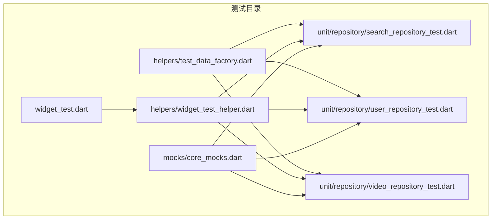
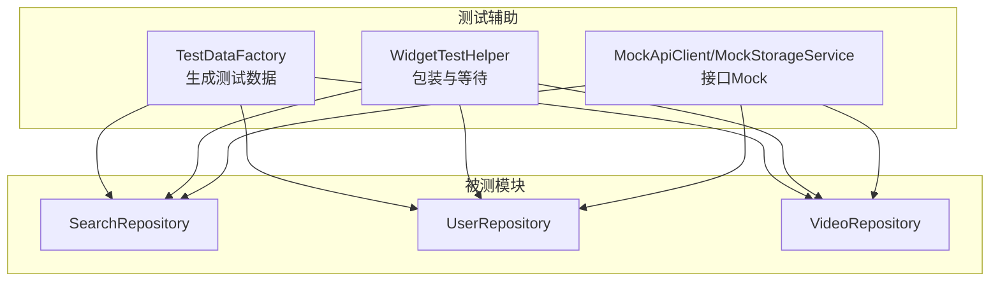
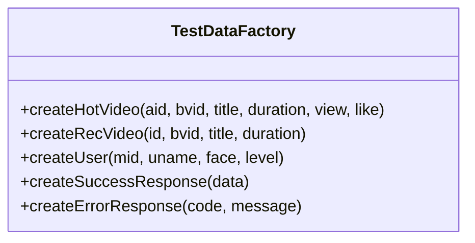
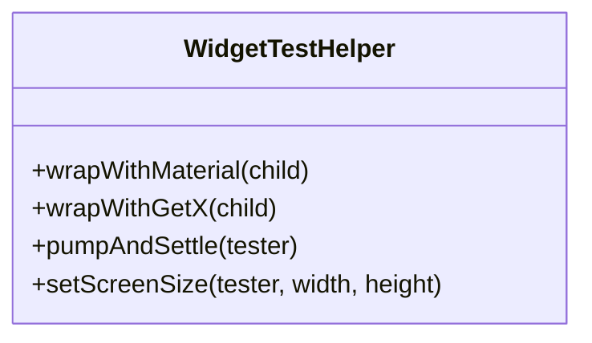
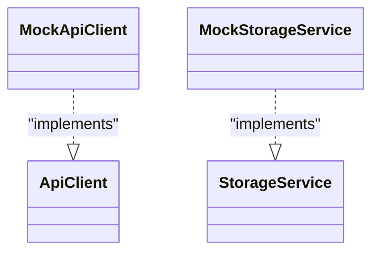
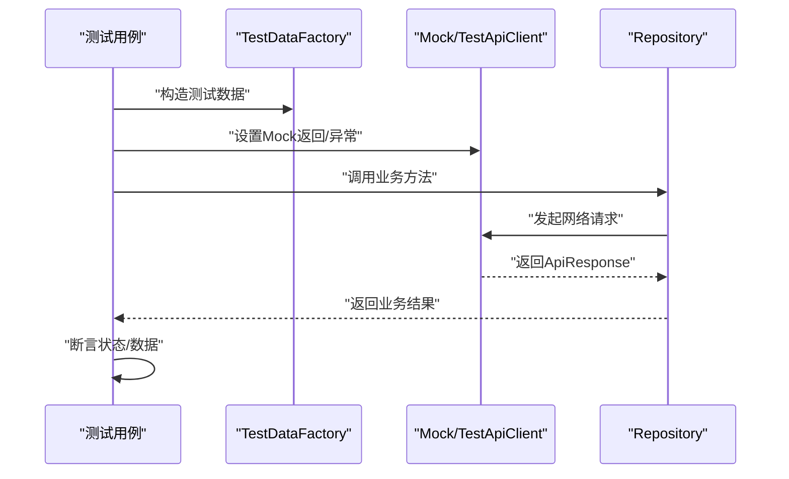
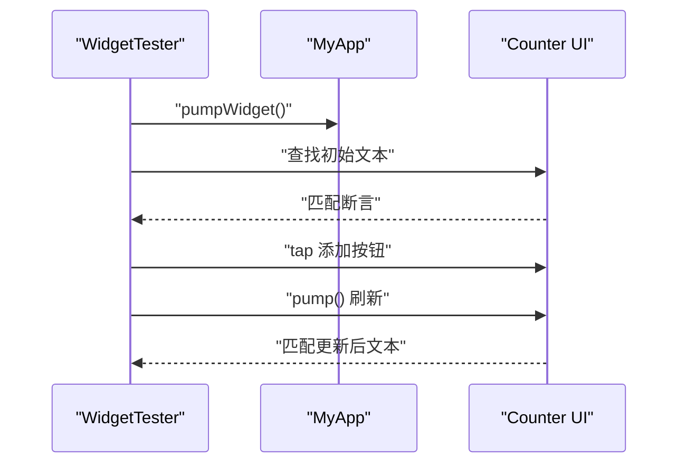
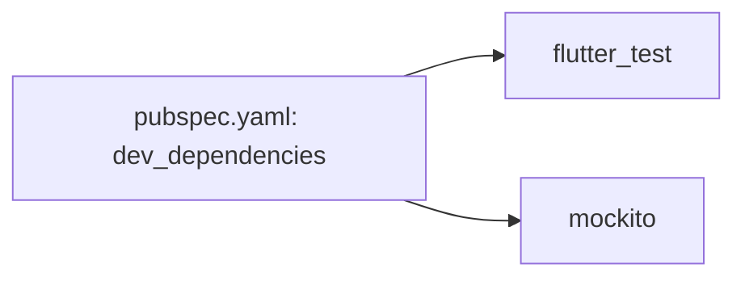

# 测试辅助工具

<cite>
**本文引用的文件**
- [test/helpers/test_data_factory.dart](file://test/helpers/test_data_factory.dart)
- [test/helpers/widget_test_helper.dart](file://test/helpers/widget_test_helper.dart)
- [test/mocks/core_mocks.dart](file://test/mocks/core_mocks.dart)
- [test/widget_test.dart](file://test/widget_test.dart)
- [test/unit/repository/search_repository_test.dart](file://test/unit/repository/search_repository_test.dart)
- [test/unit/repository/user_repository_test.dart](file://test/unit/repository/user_repository_test.dart)
- [test/unit/repository/video_repository_test.dart](file://test/unit/repository/video_repository_test.dart)
- [pubspec.yaml](file://pubspec.yaml)
</cite>

## 目录
1. [简介](#简介)
2. [项目结构](#项目结构)
3. [核心组件](#核心组件)
4. [架构总览](#架构总览)
5. [详细组件分析](#详细组件分析)
6. [依赖分析](#依赖分析)
7. [性能考量](#性能考量)
8. [故障排查指南](#故障排查指南)
9. [结论](#结论)
10. [附录](#附录)

## 简介
本文件系统性梳理 PiliPala 项目的测试辅助工具与基础设施，覆盖测试数据工厂、Widget 测试助手以及 Mock 对象库三大部分。文档从设计模式、数据生成策略、复用机制出发，结合具体测试用例展示如何在单元测试与集成测试中高效使用这些工具；同时给出扩展方法、最佳实践、性能优化与维护策略，帮助开发者快速上手并提升测试效率。

## 项目结构
测试相关代码主要位于 test 目录下，按职责划分为：
- helpers：测试辅助工具（数据工厂、Widget 测试助手）
- mocks：基于 Mockito 的接口 Mock
- unit/repository：针对仓库层的单元测试
- widget_test.dart：基础的 Widget 风味测试入口
- pubspec.yaml：声明测试依赖（flutter_test、mockito）

**图表来源**
- [test/helpers/test_data_factory.dart:1-87](file://test/helpers/test_data_factory.dart#L1-L87)
- [test/helpers/widget_test_helper.dart:1-40](file://test/helpers/widget_test_helper.dart#L1-L40)
- [test/mocks/core_mocks.dart:1-10](file://test/mocks/core_mocks.dart#L1-L10)
- [test/unit/repository/search_repository_test.dart:1-148](file://test/unit/repository/search_repository_test.dart#L1-L148)
- [test/unit/repository/user_repository_test.dart:1-132](file://test/unit/repository/user_repository_test.dart#L1-L132)
- [test/unit/repository/video_repository_test.dart:1-143](file://test/unit/repository/video_repository_test.dart#L1-L143)
- [test/widget_test.dart:1-31](file://test/widget_test.dart#L1-L31)

**章节来源**
- [pubspec.yaml:155-172](file://pubspec.yaml#L155-L172)

## 核心组件
- 测试数据工厂（TestDataFactory）：提供统一的数据生成入口，支持视频、用户、API 响应等常见结构，便于在测试中快速构造稳定可预期的输入数据。
- Widget 测试助手（WidgetTestHelper）：封装 Widget 测试常用前置条件，如应用壳、GetX 支持、异步等待、屏幕尺寸设置等，减少重复样板代码。
- Mock 对象库（MockApiClient、MockStorageService）：基于 Mockito 生成接口 Mock，用于隔离外部依赖，确保测试的可控性与稳定性。

**章节来源**
- [test/helpers/test_data_factory.dart:5-86](file://test/helpers/test_data_factory.dart#L5-L86)
- [test/helpers/widget_test_helper.dart:5-39](file://test/helpers/widget_test_helper.dart#L5-L39)
- [test/mocks/core_mocks.dart:1-10](file://test/mocks/core_mocks.dart#L1-L10)

## 架构总览
测试辅助工具与被测模块之间的关系如下：

**图表来源**
- [test/helpers/test_data_factory.dart:1-87](file://test/helpers/test_data_factory.dart#L1-L87)
- [test/helpers/widget_test_helper.dart:1-40](file://test/helpers/widget_test_helper.dart#L1-L40)
- [test/mocks/core_mocks.dart:1-10](file://test/mocks/core_mocks.dart#L1-L10)
- [test/unit/repository/search_repository_test.dart:1-148](file://test/unit/repository/search_repository_test.dart#L1-L148)
- [test/unit/repository/user_repository_test.dart:1-132](file://test/unit/repository/user_repository_test.dart#L1-L132)
- [test/unit/repository/video_repository_test.dart:1-143](file://test/unit/repository/video_repository_test.dart#L1-L143)

## 详细组件分析

### 测试数据工厂（TestDataFactory）
- 设计模式与职责
  - 工厂模式：集中生成测试数据，避免在各测试用例中重复构造相同结构的对象。
  - 可选参数与默认值：通过可选参数与默认值实现“按需覆盖”，既保证一致性又允许灵活定制。
  - 数据类型覆盖：涵盖视频（热门、推荐）、用户信息、API 成功/错误响应等。
- 数据生成策略
  - 视频类：提供热门视频与推荐视频的构造函数，内部嵌套统计字段，便于直接驱动业务逻辑。
  - 用户类：构造用户信息与等级信息，满足用户相关接口的输入需求。
  - API 响应：提供统一的成功/失败响应模板，便于模拟网络层返回。
- 复用机制
  - 在多个仓库层测试中复用同一工厂，降低重复代码与维护成本。
  - 通过统一的工厂方法调用，确保测试数据的一致性与可追踪性。

**图表来源**
- [test/helpers/test_data_factory.dart:6-86](file://test/helpers/test_data_factory.dart#L6-L86)

**章节来源**
- [test/helpers/test_data_factory.dart:9-86](file://test/helpers/test_data_factory.dart#L9-L86)

### Widget 测试助手（WidgetTestHelper）
- 职责与能力
  - 应用壳包装：提供 GetMaterialApp 包装，确保测试 Widget 能访问路由与状态管理。
  - 异步等待：统一封装 pumpAndSettle，避免在各测试中重复设置超时。
  - 屏幕尺寸设置：支持在测试前设定物理尺寸与像素密度，并自动在测试结束后恢复默认值，避免跨用例污染。
- 使用建议
  - 在需要路由或状态管理的页面测试中优先使用该助手进行包装。
  - 对于复杂交互，配合 pumpAndSettle 提升断言稳定性。

**图表来源**
- [test/helpers/widget_test_helper.dart:6-39](file://test/helpers/widget_test_helper.dart#L6-L39)

**章节来源**
- [test/helpers/widget_test_helper.dart:7-39](file://test/helpers/widget_test_helper.dart#L7-L39)

### Mock 对象库（MockApiClient、MockStorageService）
- 设计与用途
  - 基于 Mockito 的接口 Mock，用于隔离外部依赖（如网络客户端、存储服务），使测试专注于被测逻辑。
  - 与手动 Mock（见仓库测试中的 TestApiClient）对比，Mockito 生成的 Mock 更简洁，适合接口明确且无需复杂行为控制的场景。
- 使用方式
  - 在 setUp 中创建 Mock 实例并注入到被测对象。
  - 使用 when/verify 等 API 控制返回值与验证调用次数。

**图表来源**
- [test/mocks/core_mocks.dart:1-10](file://test/mocks/core_mocks.dart#L1-L10)

**章节来源**
- [test/mocks/core_mocks.dart:5-10](file://test/mocks/core_mocks.dart#L5-L10)

### 仓库层测试中的数据与 Mock 使用
- 共同模式
  - setUp 中初始化被测仓库与 Mock 或手动 Mock 实例。
  - 通过工厂或手动构造 mockData，设置 Mock 返回值或抛出异常，驱动成功/失败分支。
  - 断言结果的状态、数据长度、关键字段等。
- 关键流程示意

**图表来源**
- [test/helpers/test_data_factory.dart:1-87](file://test/helpers/test_data_factory.dart#L1-L87)
- [test/unit/repository/search_repository_test.dart:8-52](file://test/unit/repository/search_repository_test.dart#L8-L52)
- [test/unit/repository/user_repository_test.dart:8-52](file://test/unit/repository/user_repository_test.dart#L8-L52)
- [test/unit/repository/video_repository_test.dart:9-53](file://test/unit/repository/video_repository_test.dart#L9-L53)

**章节来源**
- [test/unit/repository/search_repository_test.dart:54-146](file://test/unit/repository/search_repository_test.dart#L54-L146)
- [test/unit/repository/user_repository_test.dart:54-131](file://test/unit/repository/user_repository_test.dart#L54-L131)
- [test/unit/repository/video_repository_test.dart:55-142](file://test/unit/repository/video_repository_test.dart#L55-L142)

### Widget 基础测试示例
- 示例目标：验证应用主界面在初始状态与交互后的 UI 行为。
- 关键点：构建应用树、断言初始文本、触发点击、再次断言更新。

**图表来源**
- [test/widget_test.dart:13-30](file://test/widget_test.dart#L13-L30)

**章节来源**
- [test/widget_test.dart:14-30](file://test/widget_test.dart#L14-L30)

## 依赖分析
- 测试框架与工具
  - flutter_test：Flutter 官方测试包，提供 WidgetTester、测试生命周期等。
  - mockito：用于生成接口 Mock，简化依赖隔离。
- 依赖声明位置
  - dev_dependencies 中声明了 flutter_test 与 mockito。

**图表来源**
- [pubspec.yaml:155-172](file://pubspec.yaml#L155-L172)

**章节来源**
- [pubspec.yaml:155-172](file://pubspec.yaml#L155-L172)

## 性能考量
- 测试执行速度
  - 合理使用 pumpAndSettle，避免过长等待导致整体测试时间膨胀。
  - 尽量在 setUp 中完成一次性准备，减少重复构造。
- 数据构造成本
  - 使用工厂方法批量生成相似数据，减少重复代码与内存分配。
- 并发与隔离
  - 屏幕尺寸设置后及时恢复默认值，避免用例间相互影响。
- Mock 选择
  - 接口简单且无需复杂行为控制时优先使用 Mockito 生成的 Mock，以降低维护成本。

## 故障排查指南
- 测试卡顿或不稳定
  - 检查是否遗漏 pumpAndSettle 或等待时间过短。
  - 确认屏幕尺寸设置已正确恢复。
- Mock 未生效
  - 确认 Mock 注入路径与被测对象一致。
  - 若使用手动 Mock，检查 setMockResponse/setMockError 是否在调用前设置。
- 数据不一致
  - 统一通过 TestDataFactory 生成数据，避免硬编码差异。
  - 对关键字段添加断言，确保数据结构完整。

## 结论
本测试辅助体系通过工厂化数据生成、标准化 Widget 包装与接口 Mock，显著提升了测试的可读性、可维护性与执行效率。建议在新功能开发中遵循现有模式，统一使用工厂与助手，逐步完善 Mock 覆盖面，持续优化测试执行性能与稳定性。

## 附录
- 扩展方法
  - 新增数据类型：在 TestDataFactory 中添加对应工厂方法，保持命名与参数风格一致。
  - 新增 Widget 场景：在 WidgetTestHelper 中扩展包装或等待策略。
  - 新增 Mock 接口：在 mocks 目录新增 Mock 类，保持与接口契约一致。
- 自定义测试助手
  - 可根据页面特性封装更具体的包装器（如带主题、带路由表等）。
- 测试配置管理
  - 将公共配置（如默认屏幕尺寸、通用响应模板）集中管理，便于全局调整。