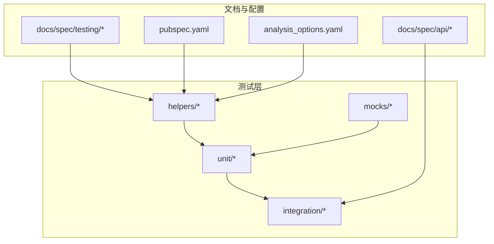
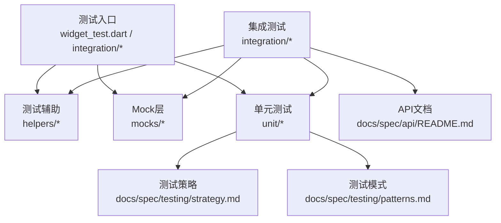
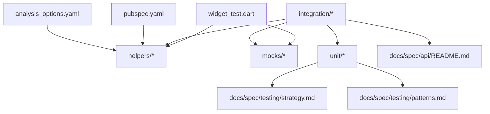

# 集成测试

<cite>
**本文引用的文件**
- [test_data_factory.dart](file://test/helpers/test_data_factory.dart)
- [widget_test_helper.dart](file://test/helpers/widget_test_helper.dart)
- [core_mocks.dart](file://test/mocks/core_mocks.dart)
- [search_repository_test.dart](file://test/unit/repository/search_repository_test.dart)
- [user_repository_test.dart](file://test/unit/repository/user_repository_test.dart)
- [video_repository_test.dart](file://test/unit/repository/video_repository_test.dart)
- [widget_test.dart](file://test/widget_test.dart)
- [patterns.md](file://docs/spec/testing/patterns.md)
- [strategy.md](file://docs/spec/testing/strategy.md)
- [README.md](file://docs/spec/api/README.md)
- [pubspec.yaml](file://pubspec.yaml)
- [analysis_options.yaml](file://analysis_options.yaml)
</cite>

## 目录
1. [简介](#简介)
2. [项目结构](#项目结构)
3. [核心组件](#核心组件)
4. [架构总览](#架构总览)
5. [详细组件分析](#详细组件分析)
6. [依赖关系分析](#依赖关系分析)
7. [性能考虑](#性能考虑)
8. [故障排查指南](#故障排查指南)
9. [结论](#结论)
10. [附录](#附录)

## 简介
本文件面向PiliPala项目的集成测试体系，系统性阐述测试设计理念与实施策略，覆盖API接口测试、数据库集成测试与外部服务集成测试三大领域。文档从测试环境配置、测试数据准备、测试场景设计入手，提供可操作的测试用例路径与执行建议，并解释测试隔离、依赖管理与执行顺序等工程实践。同时，结合现有测试辅助模块（测试工厂、小部件测试助手、Mock）与测试规范文档，给出可复用的测试模式与最佳实践，帮助开发者构建稳定可靠的系统级质量保障流程。

## 项目结构
围绕集成测试的关键目录与文件如下：
- 测试辅助层：helpers（测试数据工厂、小部件测试助手）
- 单元测试：unit（仓库与用例测试）
- 集成测试：integration（待补充）
- Mock层：mocks（核心Mock）
- 文档：docs/spec/testing（测试模式与策略）
- API文档：docs/spec/api（接口定义）
- 工程配置：pubspec.yaml（依赖）、analysis_options.yaml（静态检查）

**图表来源**
- [test_data_factory.dart](file://test/helpers/test_data_factory.dart)
- [widget_test_helper.dart](file://test/helpers/widget_test_helper.dart)
- [patterns.md](file://docs/spec/testing/patterns.md)
- [strategy.md](file://docs/spec/testing/strategy.md)
- [pubspec.yaml](file://pubspec.yaml)
- [analysis_options.yaml](file://analysis_options.yaml)

**章节来源**
- [test_data_factory.dart](file://test/helpers/test_data_factory.dart)
- [widget_test_helper.dart](file://test/helpers/widget_test_helper.dart)
- [patterns.md](file://docs/spec/testing/patterns.md)
- [strategy.md](file://docs/spec/testing/strategy.md)
- [pubspec.yaml](file://pubspec.yaml)
- [analysis_options.yaml](file://analysis_options.yaml)

## 核心组件
- 测试数据工厂：用于生成标准化的测试数据，确保测试可重复与可维护。
- 小部件测试助手：封装Flutter小部件测试常用逻辑，提升UI测试效率与一致性。
- 核心Mock：在单元与集成测试中替换真实依赖，实现可控的测试环境。
- 单元测试仓库与用例：验证业务逻辑与数据访问层的行为。
- 测试策略与模式文档：提供测试分层、断言与组织方式的指导原则。

**章节来源**
- [test_data_factory.dart](file://test/helpers/test_data_factory.dart)
- [widget_test_helper.dart](file://test/helpers/widget_test_helper.dart)
- [core_mocks.dart](file://test/mocks/core_mocks.dart)
- [search_repository_test.dart](file://test/unit/repository/search_repository_test.dart)
- [user_repository_test.dart](file://test/unit/repository/user_repository_test.dart)
- [video_repository_test.dart](file://test/unit/repository/video_repository_test.dart)

## 架构总览
下图展示从测试入口到被测系统的交互路径，以及Mock与文档对测试策略的支撑作用：

**图表来源**
- [widget_test.dart](file://test/widget_test.dart)
- [test_data_factory.dart](file://test/helpers/test_data_factory.dart)
- [widget_test_helper.dart](file://test/helpers/widget_test_helper.dart)
- [core_mocks.dart](file://test/mocks/core_mocks.dart)
- [strategy.md](file://docs/spec/testing/strategy.md)
- [patterns.md](file://docs/spec/testing/patterns.md)
- [README.md](file://docs/spec/api/README.md)

## 详细组件分析

### 测试数据工厂（测试数据准备）
- 职责：集中管理测试数据的构造与注入，避免硬编码与分散的fixture。
- 关键点：提供可配置的数据模板、默认值与边界值；支持多场景复用。
- 建议：与测试场景参数化结合，按需扩展工厂方法以覆盖不同业务域。

**章节来源**
- [test_data_factory.dart](file://test/helpers/test_data_factory.dart)

### 小部件测试助手（UI测试）
- 职责：封装常见的小部件渲染、交互与断言流程，减少重复样板代码。
- 关键点：统一等待策略、手势触发、状态断言与错误处理。
- 建议：将常用断言抽象为可复用函数，配合测试数据工厂形成“数据+行为”的完整测试单元。

**章节来源**
- [widget_test_helper.dart](file://test/helpers/widget_test_helper.dart)

### 核心Mock（依赖隔离与控制）
- 职责：在测试中替换真实服务或存储，确保测试的确定性与可控性。
- 关键点：清晰的接口契约、稳定的返回值与异常模拟；避免过度Mock导致测试脆弱。
- 建议：优先Mock对外部依赖（如HTTP客户端、数据库驱动），内部纯逻辑尽量通过单元测试覆盖。

**章节来源**
- [core_mocks.dart](file://test/mocks/core_mocks.dart)

### 单元测试仓库与用例（业务逻辑验证）
- 搜索仓库测试：验证搜索逻辑、分页与过滤条件。
- 用户仓库测试：验证用户查询、更新与权限校验。
- 视频仓库测试：验证视频列表、详情与播放相关逻辑。
- 建议：每个用例聚焦单一行为，前置条件明确，断言清晰可追踪。

**章节来源**
- [search_repository_test.dart](file://test/unit/repository/search_repository_test.dart)
- [user_repository_test.dart](file://test/unit/repository/user_repository_test.dart)
- [video_repository_test.dart](file://test/unit/repository/video_repository_test.dart)

### 测试策略与模式（测试分层与组织）
- 测试分层：单元测试（快速、精确）、集成测试（关注交互与端到端流程）、UI测试（用户路径验证）。
- 断言策略：行为断言优先于状态断言；对异步流程使用超时与重试。
- 组织方式：按功能域分组、命名清晰、失败信息具体。
- 可靠性：隔离测试间共享资源、最小化外部依赖、使用Mock与临时环境。

**章节来源**
- [strategy.md](file://docs/spec/testing/strategy.md)
- [patterns.md](file://docs/spec/testing/patterns.md)

### API接口测试（集成测试重点）
- 目标：验证HTTP端点的请求/响应、鉴权、错误码与数据一致性。
- 场景设计：
  - 正常路径：构造有效请求，断言成功响应与数据结构。
  - 异常路径：缺失参数、非法格式、权限不足、服务不可用。
  - 并发与边界：高并发下的稳定性、超时与重试策略。
- 数据准备：使用测试数据工厂生成用户、资源与关联对象；必要时预置数据库记录。
- 外部服务：通过Mock或沙箱环境替代第三方服务，确保测试可重复。

**章节来源**
- [README.md](file://docs/spec/api/README.md)
- [test_data_factory.dart](file://test/helpers/test_data_factory.dart)
- [core_mocks.dart](file://test/mocks/core_mocks.dart)

### 数据库集成测试（数据持久化）
- 目标：验证写入、查询、事务与一致性约束。
- 场景设计：
  - 写入流程：插入、更新、删除，断言最终状态与索引。
  - 事务边界：回滚与提交行为，异常中断后的恢复。
  - 并发冲突：锁策略与重试逻辑。
- 环境要求：独立测试数据库或内存数据库；迁移脚本在测试前执行。
- 清理策略：每个测试后回滚或清空表，避免污染。

**章节来源**
- [strategy.md](file://docs/spec/testing/strategy.md)
- [patterns.md](file://docs/spec/testing/patterns.md)

### 外部服务集成测试（第三方服务调用）
- 目标：验证与外部系统的交互，包括网络请求、认证与错误处理。
- 场景设计：
  - 成功路径：正确参数与响应格式。
  - 网络异常：超时、连接失败、DNS解析问题。
  - 服务端错误：HTTP错误码、限流、鉴权失败。
- 模拟技术：使用Mock服务器或本地代理拦截真实调用；对关键路径进行契约测试。
- 清理与隔离：每个测试独立的Mock配置，避免跨用例干扰。

**章节来源**
- [core_mocks.dart](file://test/mocks/core_mocks.dart)
- [strategy.md](file://docs/spec/testing/strategy.md)

### 测试执行顺序与依赖管理
- 执行顺序：先运行无副作用的单元测试，再运行可能影响全局状态的集成测试；UI测试最后执行。
- 依赖管理：通过依赖注入在测试中注入Mock；避免全局状态共享。
- 依赖链：集成测试依赖API文档与测试数据工厂；单元测试依赖Mock与数据工厂。

**章节来源**
- [strategy.md](file://docs/spec/testing/strategy.md)
- [patterns.md](file://docs/spec/testing/patterns.md)
- [pubspec.yaml](file://pubspec.yaml)

### 测试隔离策略
- 进程隔离：每个测试在独立进程或容器中运行，避免共享内存与文件句柄。
- 网络隔离：使用本地Mock或沙箱，避免真实网络调用。
- 存储隔离：独立数据库实例或临时表，测试结束后清理。
- 状态隔离：测试前后恢复默认状态，避免副作用传播。

**章节来源**
- [strategy.md](file://docs/spec/testing/strategy.md)
- [patterns.md](file://docs/spec/testing/patterns.md)

### 测试模拟技术
- HTTP Mock：拦截网络请求，返回预设响应与错误。
- 数据库Mock：使用内存数据库或Mock驱动，快速回放SQL。
- 文件系统Mock：使用临时目录与虚拟文件系统。
- 事件与定时器：冻结时间、控制事件循环，确保非确定性因素可控。

**章节来源**
- [core_mocks.dart](file://test/mocks/core_mocks.dart)
- [strategy.md](file://docs/spec/testing/strategy.md)

### 测试清理机制
- 数据清理：测试后删除新增记录、回滚事务、清空缓存。
- 资源释放：关闭数据库连接、释放文件句柄、停止网络监听。
- 环境还原：恢复配置、日志级别与全局状态。

**章节来源**
- [strategy.md](file://docs/spec/testing/strategy.md)
- [patterns.md](file://docs/spec/testing/patterns.md)

### 测试报告生成
- 报告维度：覆盖率、失败率、耗时分布、失败详情与堆栈。
- 输出格式：JUnit XML、Coverage报告、HTML摘要。
- 分析与改进：基于失败趋势识别薄弱环节，优化测试用例与Mock策略。

**章节来源**
- [strategy.md](file://docs/spec/testing/strategy.md)
- [patterns.md](file://docs/spec/testing/patterns.md)

## 依赖关系分析
- 测试入口依赖测试辅助与Mock；单元测试依赖策略与模式文档；集成测试依赖API文档与数据工厂。
- 工程配置（pubspec与analysis_options）影响测试工具链与静态检查规则。

**图表来源**
- [widget_test.dart](file://test/widget_test.dart)
- [test_data_factory.dart](file://test/helpers/test_data_factory.dart)
- [widget_test_helper.dart](file://test/helpers/widget_test_helper.dart)
- [core_mocks.dart](file://test/mocks/core_mocks.dart)
- [strategy.md](file://docs/spec/testing/strategy.md)
- [patterns.md](file://docs/spec/testing/patterns.md)
- [README.md](file://docs/spec/api/README.md)
- [pubspec.yaml](file://pubspec.yaml)
- [analysis_options.yaml](file://analysis_options.yaml)

**章节来源**
- [widget_test.dart](file://test/widget_test.dart)
- [pubspec.yaml](file://pubspec.yaml)
- [analysis_options.yaml](file://analysis_options.yaml)

## 性能考虑
- 测试执行速度：优先使用Mock与内存数据库；避免真实网络与IO。
- 覆盖率与质量：平衡用例数量与深度，确保关键路径与异常分支被覆盖。
- 资源占用：限制并发测试数量，合理分配CPU与内存。
- 回归效率：将高频失败用例前置，缩短反馈周期。

[本节为通用指导，无需特定文件引用]

## 故障排查指南
- 常见问题：
  - 网络请求失败：检查Mock配置与超时设置；确认端点与鉴权头。
  - 数据不一致：核对事务边界与并发控制；确保测试前后的清理逻辑。
  - UI不稳定：增加等待策略与重试；避免隐式依赖。
- 排查步骤：
  - 逐步缩小范围：从单元到集成再到UI。
  - 记录上下文：请求/响应、状态快照、日志与时间戳。
  - 复现与回归：编写最小可复现用例，加入回归集。

**章节来源**
- [strategy.md](file://docs/spec/testing/strategy.md)
- [patterns.md](file://docs/spec/testing/patterns.md)

## 结论
通过将测试数据工厂、小部件测试助手与核心Mock有机结合，配合测试策略与模式文档，PiliPala项目可以建立一套高效、可维护且可扩展的集成测试体系。建议在现有基础上完善integration目录的用例设计，强化API与数据库的端到端验证，并持续优化测试执行与报告流程，以实现系统级质量保障闭环。

[本节为总结性内容，无需特定文件引用]

## 附录
- 测试用例示例路径（请参考以下文件定位具体实现）：
  - [搜索仓库测试](file://test/unit/repository/search_repository_test.dart)
  - [用户仓库测试](file://test/unit/repository/user_repository_test.dart)
  - [视频仓库测试](file://test/unit/repository/video_repository_test.dart)
  - [小部件测试入口](file://test/widget_test.dart)
  - [测试数据工厂](file://test/helpers/test_data_factory.dart)
  - [小部件测试助手](file://test/helpers/widget_test_helper.dart)
  - [核心Mock](file://test/mocks/core_mocks.dart)
  - [测试策略](file://docs/spec/testing/strategy.md)
  - [测试模式](file://docs/spec/testing/patterns.md)
  - [API文档](file://docs/spec/api/README.md)
  - [工程依赖](file://pubspec.yaml)
  - [静态检查](file://analysis_options.yaml)

[本节为附录汇总，无需特定文件引用]