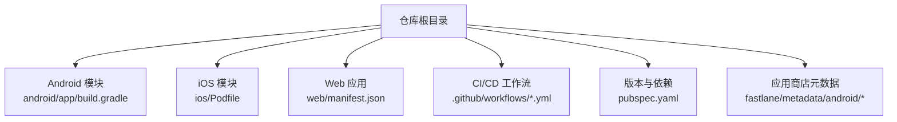
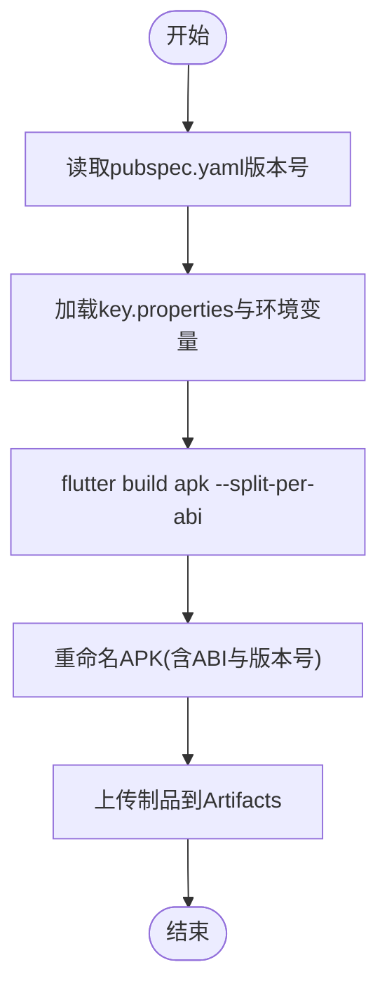
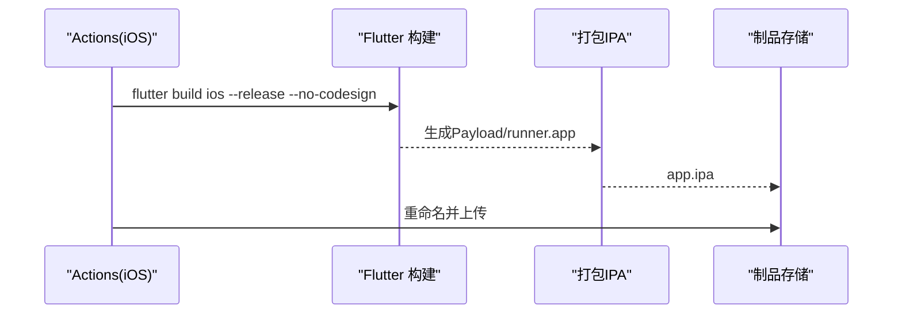
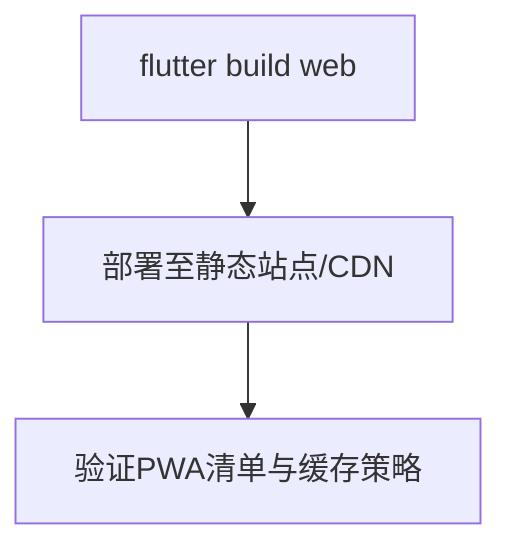
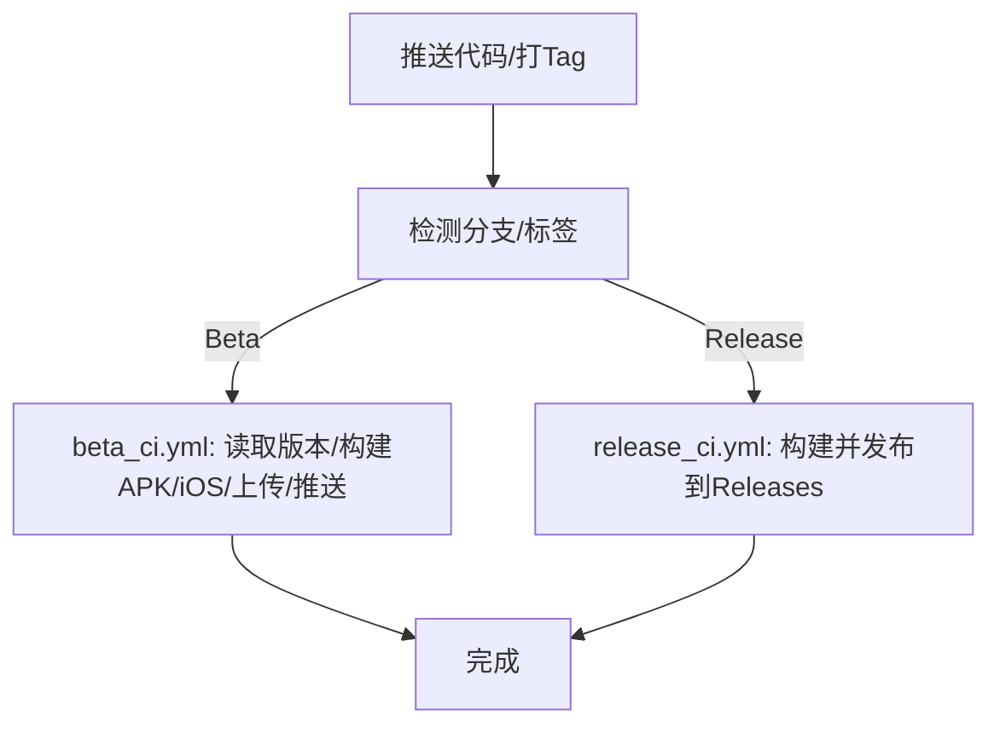
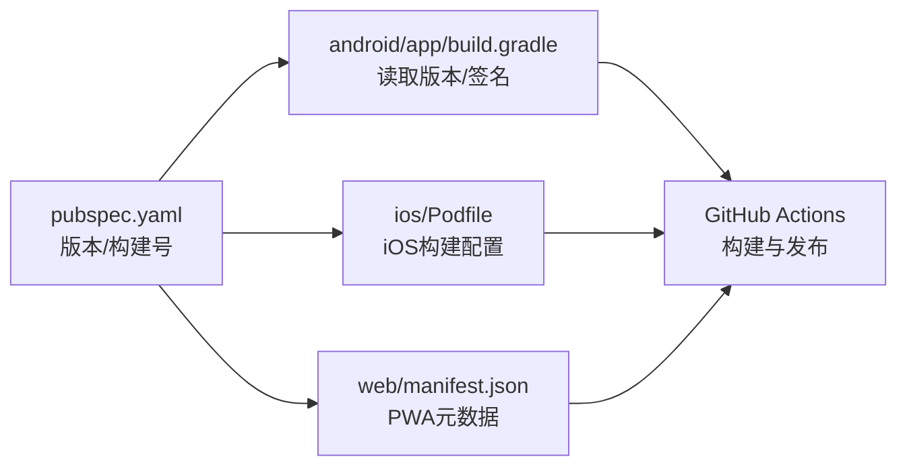

# 部署指南

<cite>
**本文档引用的文件**
- [pubspec.yaml](file://pubspec.yaml)
- [android/app/build.gradle](file://android/app/build.gradle)
- [android/key.properties](file://android/key.properties)
- [android/local.properties](file://android/local.properties)
- [ios/Podfile](file://ios/Podfile)
- [web/manifest.json](file://web/manifest.json)
- [.github/workflows/beta_ci.yml](file://.github/workflows/beta_ci.yml)
- [.github/workflows/release_ci.yml](file://.github/workflows/release_ci.yml)
- [fastlane/metadata/android/en-US/full_description.txt](file://fastlane/metadata/android/en-US/full_description.txt)
- [fastlane/metadata/android/zh-CN/full_description.txt](file://fastlane/metadata/android/zh-CN/full_description.txt)
- [README.md](file://README.md)
- [CLAUDE.md](file://CLAUDE.md)
</cite>

## 目录
1. [简介](#简介)
2. [项目结构](#项目结构)
3. [核心组件](#核心组件)
4. [架构总览](#架构总览)
5. [详细组件分析](#详细组件分析)
6. [依赖关系分析](#依赖关系分析)
7. [性能考虑](#性能考虑)
8. [故障排除指南](#故障排除指南)
9. [结论](#结论)
10. [附录](#附录)

## 简介
本指南面向运维与开发团队，提供PiliPala项目的多平台部署方案，覆盖Android APK/iOS IPA构建、Web应用部署、F-Droid发布、CI/CD流水线配置、版本管理策略、发布检查清单、热更新与灰度发布建议、以及监控与回滚策略。文档基于仓库现有配置与工作流进行整理，并对需要扩展的功能（如热更新、A/B测试、灰度发布）给出可落地的实施建议。

## 项目结构
PiliPala采用Flutter多端统一工程，包含Android、iOS、Web、Windows、Linux、macOS等目标平台；通过GitHub Actions实现自动化构建与发布；Fastlane用于应用商店元数据管理；版本号与构建号在pubspec.yaml中集中定义。



图表来源
- [pubspec.yaml:1-246](file://pubspec.yaml#L1-L246)
- [android/app/build.gradle:1-139](file://android/app/build.gradle#L1-L139)
- [ios/Podfile:1-48](file://ios/Podfile#L1-L48)
- [web/manifest.json:1-36](file://web/manifest.json#L1-L36)
- [.github/workflows/beta_ci.yml:1-209](file://.github/workflows/beta_ci.yml#L1-L209)
- [.github/workflows/release_ci.yml:1-158](file://.github/workflows/release_ci.yml#L1-L158)
- [fastlane/metadata/android/en-US/full_description.txt:1-10](file://fastlane/metadata/android/en-US/full_description.txt#L1-L10)
- [fastlane/metadata/android/zh-CN/full_description.txt:1-10](file://fastlane/metadata/android/zh-CN/full_description.txt#L1-L10)

章节来源
- [pubspec.yaml:1-246](file://pubspec.yaml#L1-L246)
- [android/app/build.gradle:1-139](file://android/app/build.gradle#L1-L139)
- [ios/Podfile:1-48](file://ios/Podfile#L1-L48)
- [web/manifest.json:1-36](file://web/manifest.json#L1-L36)
- [.github/workflows/beta_ci.yml:1-209](file://.github/workflows/beta_ci.yml#L1-L209)
- [.github/workflows/release_ci.yml:1-158](file://.github/workflows/release_ci.yml#L1-L158)
- [fastlane/metadata/android/en-US/full_description.txt:1-10](file://fastlane/metadata/android/en-US/full_description.txt#L1-L10)
- [fastlane/metadata/android/zh-CN/full_description.txt:1-10](file://fastlane/metadata/android/zh-CN/full_description.txt#L1-L10)

## 核心组件
- 版本与构建号：在pubspec.yaml中定义，Android/iOS构建时会读取该版本号与构建号，用于APK/IPA的版本标注与Google Play/iOS App Store识别。
- Android签名：通过key.properties与环境变量注入密钥库参数，构建时启用V1/V2签名。
- iOS打包：使用Flutter命令生成未签名归档，再通过zip打包为IPA。
- Web部署：通过web/manifest.json定义PWA元数据，可直接部署至静态站点或CDN。
- CI/CD：beta_ci.yml负责Beta版本自动构建与Telegram推送；release_ci.yml在打Tag后自动构建并发布到GitHub Releases。

章节来源
- [pubspec.yaml:19-19](file://pubspec.yaml#L19-L19)
- [android/app/build.gradle:25-34](file://android/app/build.gradle#L25-L34)
- [android/app/build.gradle:66-91](file://android/app/build.gradle#L66-L91)
- [ios/Podfile:2-48](file://ios/Podfile#L2-L48)
- [web/manifest.json:1-36](file://web/manifest.json#L1-L36)
- [.github/workflows/beta_ci.yml:104-137](file://.github/workflows/beta_ci.yml#L104-L137)
- [.github/workflows/release_ci.yml:45-87](file://.github/workflows/release_ci.yml#L45-L87)

## 架构总览
下图展示从代码提交到多平台产物产出与发布的整体流程，包括版本号计算、签名、打包、产物上传与发布渠道。

```mermaid
sequenceDiagram
participant Dev as "开发者"
participant Repo as "Git 仓库"
participant GA as "GitHub Actions"
participant And as "Android 构建"
participant iOS as "iOS 构建"
participant Art as "制品存储"
participant Rel as "发布渠道"
Dev->>Repo : 推送代码/打Tag
Repo-->>GA : 触发工作流
GA->>GA : 读取版本号/计算构建号
GA->>And : 解码JKS/设置签名参数
And-->>Art : 上传APK产物
GA->>iOS : 生成未签名IPA
iOS-->>Art : 上传IPA产物
GA->>Rel : 上传到GitHub Releases/推送Telegram
```

图表来源
- [.github/workflows/beta_ci.yml:1-209](file://.github/workflows/beta_ci.yml#L1-L209)
- [.github/workflows/release_ci.yml:1-158](file://.github/workflows/release_ci.yml#L1-L158)
- [android/app/build.gradle:25-34](file://android/app/build.gradle#L25-L34)

## 详细组件分析

### Android 构建与签名配置
- 版本与构建号：pubspec.yaml中定义版本号，Gradle脚本读取flutter.versionName与flutter.versionCode用于APK标注。
- 签名配置：通过key.properties与环境变量注入storeFile、storePassword、keyAlias、keyPassword，构建类型release启用V1/V2签名。
- ABI拆分：构建时使用--split-per-abi生成多ABI产物，便于体积优化与分发。
- 产物命名：工作流中对APK进行重命名，包含ABI与版本号，便于识别与管理。
- Google Play 16KB页面对齐：Gradle任务对.so文件执行patchelf以满足新要求。



图表来源
- [pubspec.yaml:19-19](file://pubspec.yaml#L19-L19)
- [android/app/build.gradle:15-23](file://android/app/build.gradle#L15-L23)
- [android/app/build.gradle:25-34](file://android/app/build.gradle#L25-L34)
- [android/app/build.gradle:104-127](file://android/app/build.gradle#L104-L127)
- [.github/workflows/beta_ci.yml:115-129](file://.github/workflows/beta_ci.yml#L115-L129)

章节来源
- [pubspec.yaml:19-19](file://pubspec.yaml#L19-L19)
- [android/app/build.gradle:15-23](file://android/app/build.gradle#L15-L23)
- [android/app/build.gradle:25-34](file://android/app/build.gradle#L25-L34)
- [android/app/build.gradle:66-91](file://android/app/build.gradle#L66-L91)
- [android/app/build.gradle:104-127](file://android/app/build.gradle#L104-L127)
- [android/key.properties:1-5](file://android/key.properties#L1-L5)
- [android/local.properties:1-5](file://android/local.properties#L1-L5)
- [.github/workflows/beta_ci.yml:115-129](file://.github/workflows/beta_ci.yml#L115-L129)

### iOS 构建与发布准备
- 未签名构建：使用flutter build ios --release --no-codesign生成未签名归档，随后通过符号链接与zip打包生成IPA。
- 产物命名：根据版本号重命名IPA，便于识别与管理。
- 发布渠道：release工作流将IPA上传至GitHub Releases；README中提供F-Droid安装入口。



图表来源
- [.github/workflows/beta_ci.yml:162-174](file://.github/workflows/beta_ci.yml#L162-L174)
- [.github/workflows/release_ci.yml:103-119](file://.github/workflows/release_ci.yml#L103-L119)
- [README.md:147-153](file://README.md#L147-L153)

章节来源
- [.github/workflows/beta_ci.yml:162-174](file://.github/workflows/beta_ci.yml#L162-L174)
- [.github/workflows/release_ci.yml:103-119](file://.github/workflows/release_ci.yml#L103-L119)
- [README.md:147-153](file://README.md#L147-L153)

### Web 应用部署
- PWA清单：web/manifest.json定义应用名称、显示模式、主题色、图标等，支持安装为PWA。
- 部署建议：可将Flutter Web产物部署至静态站点、CDN或托管平台（如GitHub Pages、Vercel等），确保CORS与缓存策略正确。



图表来源
- [web/manifest.json:1-36](file://web/manifest.json#L1-L36)

章节来源
- [web/manifest.json:1-36](file://web/manifest.json#L1-L36)

### CI/CD 流水线与版本管理
- Beta流水线（beta_ci.yml）
  - 触发条件：分支x-main变更（忽略文档与特定文件）、手动触发。
  - 版本号：基于最近稳定tag计算增量，生成形如1.0.28-beta.N的版本号。
  - 构建：Android使用--split-per-abi，iOS生成未签名IPA；产物上传Artifacts并通过Telegram频道推送。
- Release流水线（release_ci.yml）
  - 触发条件：推送以v*.*.*开头的标签。
  - 构建：Android构建两次（带与不带--split-per-abi），iOS生成IPA；产物上传Artifacts并发布到GitHub Releases。



图表来源
- [.github/workflows/beta_ci.yml:1-209](file://.github/workflows/beta_ci.yml#L1-L209)
- [.github/workflows/release_ci.yml:1-158](file://.github/workflows/release_ci.yml#L1-L158)

章节来源
- [.github/workflows/beta_ci.yml:1-209](file://.github/workflows/beta_ci.yml#L1-L209)
- [.github/workflows/release_ci.yml:1-158](file://.github/workflows/release_ci.yml#L1-L158)

### F-Droid 发布准备
- 应用商店元数据：fastlane/metadata/android/zh-CN与en-US目录包含简短描述、完整描述、截图等，可用于F-Droid镜像站或本地化发布。
- 发布入口：README提供F-Droid安装徽章与链接，便于用户从F-Droid安装。

章节来源
- [fastlane/metadata/android/en-US/full_description.txt:1-10](file://fastlane/metadata/android/en-US/full_description.txt#L1-L10)
- [fastlane/metadata/android/zh-CN/full_description.txt:1-10](file://fastlane/metadata/android/zh-CN/full_description.txt#L1-L10)
- [README.md:147-153](file://README.md#L147-L153)

### 热更新、A/B测试与灰度发布（建议）
- 热更新：建议引入热更方案（如内置资源包/脚本热更），在发布前进行灰度验证，避免影响主流量。
- A/B测试：通过服务端开关或客户端特性标志区分实验组与对照组，结合埋点统计评估效果。
- 灰度发布：按地区/设备/用户分层逐步放量，结合健康指标（崩溃率、启动时延、网络错误率）动态调整。
- 以上为通用实践建议，需结合业务与技术栈评估落地成本与风险。

## 依赖关系分析
- 版本耦合：pubspec.yaml的version与build-number直接影响Android的versionName/versionCode与iOS的CFBundleShortVersionString/CFBundleVersion。
- 构建链路：Android依赖key.properties与环境变量提供签名参数；iOS依赖Flutter工具链与未签名归档；Web依赖PWA清单。
- 发布链路：GitHub Actions在构建完成后将产物上传至Artifacts或GitHub Releases，Beta版本同时推送Telegram频道。



图表来源
- [pubspec.yaml:19-19](file://pubspec.yaml#L19-L19)
- [android/app/build.gradle:15-23](file://android/app/build.gradle#L15-L23)
- [ios/Podfile:2-48](file://ios/Podfile#L2-L48)
- [web/manifest.json:1-36](file://web/manifest.json#L1-L36)
- [.github/workflows/beta_ci.yml:1-209](file://.github/workflows/beta_ci.yml#L1-L209)
- [.github/workflows/release_ci.yml:1-158](file://.github/workflows/release_ci.yml#L1-L158)

章节来源
- [pubspec.yaml:19-19](file://pubspec.yaml#L19-L19)
- [android/app/build.gradle:15-23](file://android/app/build.gradle#L15-L23)
- [ios/Podfile:2-48](file://ios/Podfile#L2-L48)
- [web/manifest.json:1-36](file://web/manifest.json#L1-L36)
- [.github/workflows/beta_ci.yml:1-209](file://.github/workflows/beta_ci.yml#L1-L209)
- [.github/workflows/release_ci.yml:1-158](file://.github/workflows/release_ci.yml#L1-L158)

## 性能考虑
- Android APK体积：使用--split-per-abi按ABI拆分产物，减少单APK体积；配合混淆与压缩策略进一步优化。
- 启动性能：确保关键初始化逻辑异步化，避免阻塞主线程；合理使用懒加载与按需资源。
- 网络与缓存：在HTTP层配置合理的超时与重试策略，结合本地缓存降低重复请求。
- Web性能：启用PWA缓存策略与离线资源，优化首屏加载与交互响应。

## 故障排除指南
- Android签名失败
  - 检查key.properties与环境变量是否正确注入；确认storeFile路径与密码一致。
  - 确认构建类型为release且启用了V1/V2签名。
- iOS打包失败
  - 确保Flutter版本与Xcode兼容；检查--no-codesign参数与归档路径。
- 版本号不一致
  - 核对pubspec.yaml中的version与构建脚本中读取的版本号；确保CI中替换逻辑正确。
- Telegram推送失败
  - 检查Bot Token、Chat ID、API ID与API Hash是否配置正确；确认Artifacts命名与路径一致。

章节来源
- [android/app/build.gradle:25-34](file://android/app/build.gradle#L25-L34)
- [android/app/build.gradle:66-91](file://android/app/build.gradle#L66-L91)
- [.github/workflows/beta_ci.yml:104-137](file://.github/workflows/beta_ci.yml#L104-L137)
- [.github/workflows/release_ci.yml:45-87](file://.github/workflows/release_ci.yml#L45-L87)

## 结论
本指南基于仓库现有配置，梳理了PiliPala的多平台部署流程与CI/CD实践，并提供了版本管理、发布渠道与运维建议。对于热更新、A/B测试与灰度发布等高级能力，建议结合业务需求与技术栈进行渐进式引入与验证。

## 附录

### 发布检查清单
- 版本与构建号核对：pubspec.yaml、Android Gradle、iOS配置一致。
- 签名材料：key.properties与环境变量齐全，密钥库可用。
- CI工作流：Beta与Release工作流均能成功运行并产出产物。
- 渠道发布：GitHub Releases、Telegram推送、F-Droid元数据准备就绪。
- Web部署：PWA清单有效，静态站点可访问。

### 运维监控与回滚
- 监控指标：崩溃率、启动时延、网络错误率、用户活跃度与留存。
- 回滚策略：保留最近N个稳定版本，出现异常时快速回滚至上一稳定版本；灰度回滚时按分层逐步回收流量。