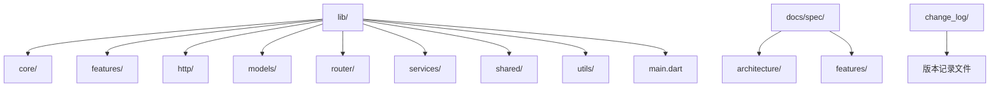
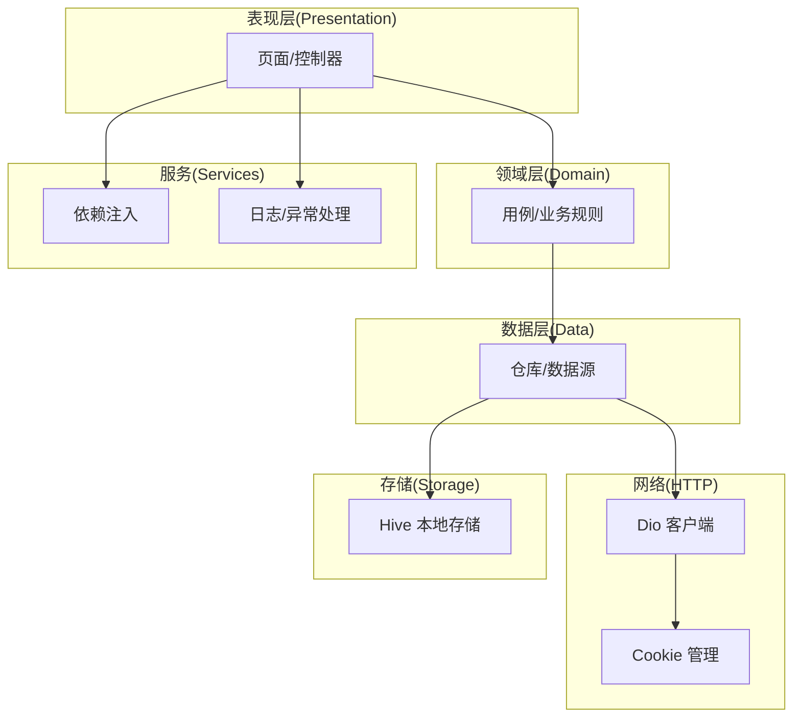
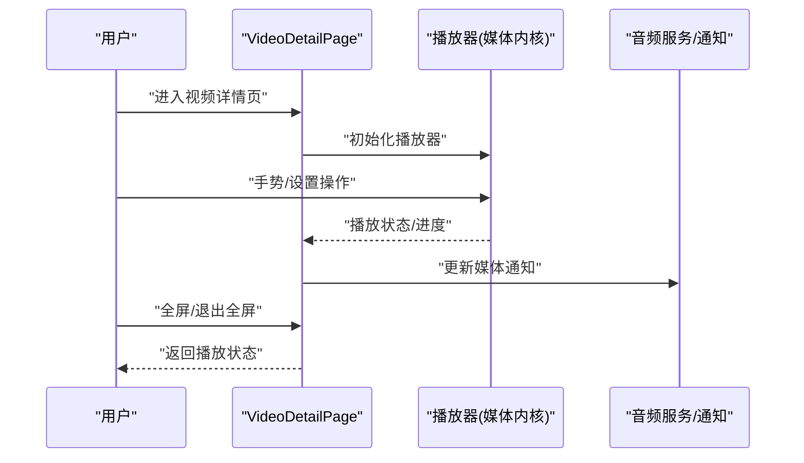
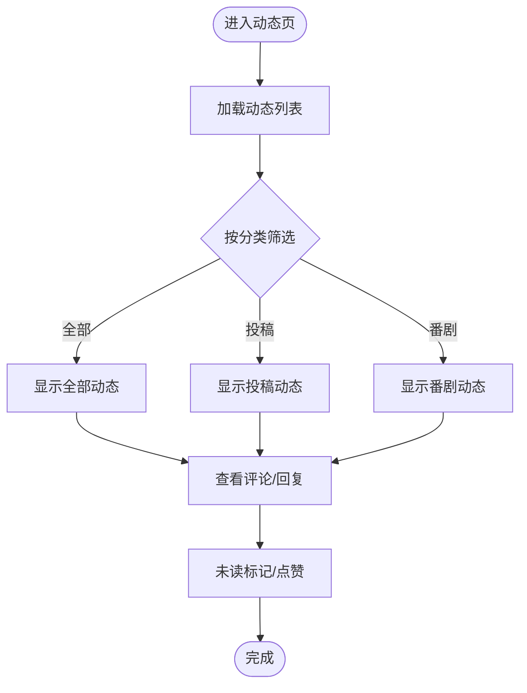
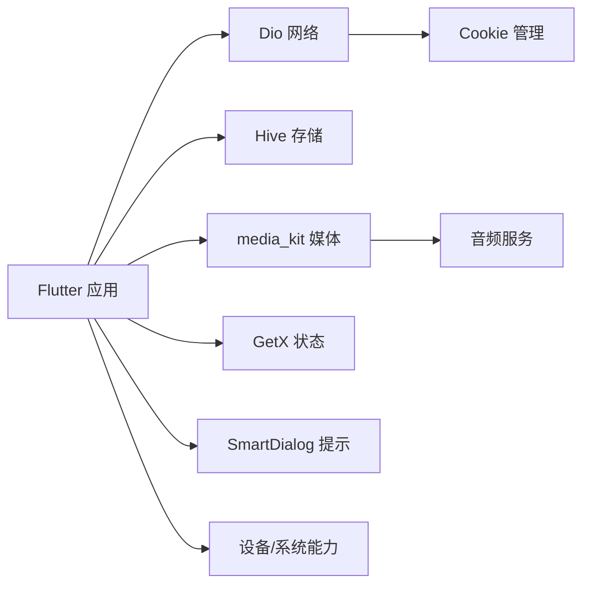

# 项目概述

<cite>
**本文引用的文件**
- [README.md](file://README.md)
- [pubspec.yaml](file://pubspec.yaml)
- [lib/main.dart](file://lib/main.dart)
- [LICENSE](file://LICENSE)
- [change_log/1.0.25.1010.md](file://change_log/1.0.25.1010.md)
- [change_log/1.0.24.0626.md](file://change_log/1.0.24.0626.md)
- [change_log/1.0.23.0505.md](file://change_log/1.0.23.0505.md)
- [docs/spec/README.md](file://docs/spec/README.md)
- [docs/spec/architecture/02-state-management.md](file://docs/spec/architecture/02-state-management.md)
- [docs/spec/architecture/03-http-layer.md](file://docs/spec/architecture/03-http-layer.md)
- [docs/spec/architecture/04-storage.md](file://docs/spec/architecture/04-storage.md)
- [docs/spec/architecture/05-navigation.md](file://docs/spec/architecture/05-navigation.md)
- [docs/spec/features/home/spec.md](file://docs/spec/features/home/spec.md)
- [docs/spec/features/video/spec.md](file://docs/spec/features/video/spec.md)
- [docs/spec/features/search/spec.md](file://docs/spec/features/search/spec.md)
- [docs/spec/features/user/spec.md](file://docs/spec/features/user/spec.md)
- [docs/spec/features/media/spec.md](file://docs/spec/features/media/spec.md)
- [docs/spec/features/login/spec.md](file://docs/spec/features/login/spec.md)
- [docs/spec/features/dynamics/spec.md](file://docs/spec/features/dynamics/spec.md)
- [docs/spec/features/message/spec.md](file://docs/spec/features/message/spec.md)
- [docs/spec/features/live/spec.md](file://docs/spec/features/live/spec.md)
- [docs/spec/features/setting/spec.md](file://docs/spec/features/setting/spec.md)
</cite>

## 目录
1. [引言](#引言)
2. [项目结构](#项目结构)
3. [核心组件](#核心组件)
4. [架构总览](#架构总览)
5. [详细组件分析](#详细组件分析)
6. [依赖关系分析](#依赖关系分析)
7. [性能考虑](#性能考虑)
8. [故障排除指南](#故障排除指南)
9. [结论](#结论)
10. [附录](#附录)

## 引言
PiliPala 是一个基于 Flutter 开发的 Bilibili 第三方客户端，旨在为用户提供流畅、稳定且功能丰富的视频与直播体验。项目以移动端（Android/iOS）为核心，持续迭代并引入现代化架构与工程化实践。其核心目标包括：
- 提供接近官方体验的第三方客户端能力
- 通过模块化与三层架构提升可维护性与扩展性
- 支持多平台运行（Android、iOS、Web、Windows、macOS、Linux），并逐步完善跨平台体验
- 保持开源与社区协作，欢迎贡献者参与功能与问题修复

项目当前版本为 1.0.28（构建号 1028），处于持续演进阶段，近期版本聚焦于播放器体验、交互细节与稳定性优化。

章节来源
- [README.md:1-169](file://README.md#L1-L169)
- [pubspec.yaml:19](file://pubspec.yaml#L19)

## 项目结构
仓库采用按功能域划分的目录组织方式，核心模块包括：
- lib/core：核心基础设施与通用工具
- lib/features：业务功能域（home、video、search、user、media、login、live、message、dynamics、setting 等）
- lib/http：网络层封装与 API 调用
- lib/models：数据模型定义
- lib/router：路由与页面导航
- lib/services：服务层（依赖注入、日志、全局状态等）
- lib/shared：共享组件与样式
- lib/utils：工具类与配置
- docs/spec：架构与特性规格文档
- change_log：版本变更记录

下图展示项目顶层结构与关键目录的关系：

章节来源
- [README.md:1-169](file://README.md#L1-L169)
- [docs/spec/README.md](file://docs/spec/README.md)

## 核心组件
- 应用入口与初始化
  - 应用在入口处完成媒体库初始化、系统方向限制、存储初始化、网络请求与 Cookie 设置、依赖注入初始化、异常捕获与日志、沉浸式系统界面适配、自定义 Scheme 初始化以及全局缓存初始化。
- 主题与国际化
  - 支持动态取色与品牌色回退、亮/暗/跟随系统主题切换、文本缩放、国际化语言配置与本地化委托。
- 导航与页面
  - 使用路由系统统一管理页面跳转，并在特定页面注册路由观察器以支持页面生命周期与交互状态管理。
- 状态与服务
  - 通过依赖注入与服务定位器提供全局服务访问；结合 GetX 实现响应式状态管理与页面间通信。

章节来源
- [lib/main.dart:33-80](file://lib/main.dart#L33-L80)
- [lib/main.dart:82-289](file://lib/main.dart#L82-L289)

## 架构总览
项目正从传统的 pages/ 扁平结构向 features/ 三层架构迁移（data/domain/presentation）。当前已完成 home、video、search、user 四个模块的完整迁移，其余模块按优先级逐步推进。整体架构要点如下：
- 三层架构
  - data：数据源与仓库实现（网络/存储）
  - domain：用例与业务规则
  - presentation：页面与控制器
- 网络层
  - 基于 Dio 的 HTTP 客户端封装，支持 Cookie 管理、连接状态检测、HTTP/2 适配与重试策略
- 存储层
  - 基于 Hive 的本地存储，支持设置、缓存与离线数据
- 导航与路由
  - 统一路由表与页面注册，支持页面观察与生命周期管理
- 状态管理
  - 结合 GetX 与服务定位器，实现模块化状态与依赖注入

图表来源
- [docs/spec/architecture/02-state-management.md](file://docs/spec/architecture/02-state-management.md)
- [docs/spec/architecture/03-http-layer.md](file://docs/spec/architecture/03-http-layer.md)
- [docs/spec/architecture/04-storage.md](file://docs/spec/architecture/04-storage.md)
- [docs/spec/architecture/05-navigation.md](file://docs/spec/architecture/05-navigation.md)

章节来源
- [README.md:122-142](file://README.md#L122-L142)
- [docs/spec/architecture/02-state-management.md](file://docs/spec/architecture/02-state-management.md)
- [docs/spec/architecture/03-http-layer.md](file://docs/spec/architecture/03-http-layer.md)
- [docs/spec/architecture/04-storage.md](file://docs/spec/architecture/04-storage.md)
- [docs/spec/architecture/05-navigation.md](file://docs/spec/architecture/05-navigation.md)

## 详细组件分析

### 视频播放模块
- 核心能力
  - 手势控制：双击快进/后退、双击播放/暂停、垂直方向亮度/音量调节、上滑全屏/下滑退出全屏、水平方向快进/快退
  - 播放设置：倍速选择/长按 2 倍速、硬件加速、画质/音质/解码格式选择、弹幕/字幕、记忆播放、视频比例（适配/填充/包含）、视频快照
  - 直播弹幕支持
- 技术实现
  - 基于 media_kit 的播放内核，结合音频服务与媒体通知，提供稳定的播放体验
  - 页面观察器用于生命周期与状态同步

图表来源
- [lib/main.dart:277-281](file://lib/main.dart#L277-L281)
- [docs/spec/features/video/spec.md](file://docs/spec/features/video/spec.md)

章节来源
- [README.md:77-95](file://README.md#L77-L95)
- [lib/main.dart:277-281](file://lib/main.dart#L277-L281)
- [docs/spec/features/video/spec.md](file://docs/spec/features/video/spec.md)

### 动态社交模块
- 核心能力
  - 动态分类查看：全部、投稿、番剧
  - 评论查看与回复：主楼/二楼评论、表情回复、评论点赞
  - 未读标记与历史管理
- 技术实现
  - 页面与用例分离，结合网络层与存储层实现动态数据的获取、缓存与展示

图表来源
- [docs/spec/features/dynamics/spec.md](file://docs/spec/features/dynamics/spec.md)

章节来源
- [README.md:71-76](file://README.md#L71-L76)
- [docs/spec/features/dynamics/spec.md](file://docs/spec/features/dynamics/spec.md)

### 用户管理模块
- 核心能力
  - 关注/取关用户、粉丝与黑名单查看、用户主页查看
  - 稍后再看、观看记录、我的收藏、黑名单管理
- 技术实现
  - 通过用户仓库与网络层实现用户信息与互动数据的同步与持久化

章节来源
- [README.md:61-70](file://README.md#L61-L70)
- [docs/spec/features/user/spec.md](file://docs/spec/features/user/spec.md)

### 搜索模块
- 核心能力
  - 热搜、搜索历史、默认搜索词、投稿/番剧/直播间/用户搜索、视频搜索排序与时长筛选
- 技术实现
  - 搜索用例与仓库解耦，支持防抖与结果缓存

章节来源
- [README.md:96-102](file://README.md#L96-L102)
- [docs/spec/features/search/spec.md](file://docs/spec/features/search/spec.md)

### 媒体与登录模块
- 媒体库与登录模块作为迁移中的重点，当前路由与依赖注入尚未完全接入，后续将补齐注册流程与 DI 连接

章节来源
- [README.md:122-142](file://README.md#L122-L142)
- [docs/spec/features/media/spec.md](file://docs/spec/features/media/spec.md)
- [docs/spec/features/login/spec.md](file://docs/spec/features/login/spec.md)

### 设置模块
- 核心能力
  - 画质/音质/解码方式预设、图片质量设定、主题模式（亮/暗/跟随系统）、震动反馈、高帧率、自动全屏
- 技术实现
  - 设置项持久化至 Hive，运行时动态应用到播放器与 UI 主题

章节来源
- [README.md:113-121](file://README.md#L113-L121)
- [docs/spec/features/setting/spec.md](file://docs/spec/features/setting/spec.md)

## 依赖关系分析
- 核心依赖
  - Flutter SDK 与本地化、动态取色、Material 组件
  - 网络：Dio、Cookie 管理、连接状态检测、HTTP/2 适配
  - 存储：Hive、路径提供
  - 媒体：media_kit、audio_service、音频/视频进度条
  - UI 与交互：GetX、SmartDialog、FontAwesome、滑动与刷新组件
  - 设备与系统：设备信息、权限、分享、WebView、屏幕亮度/唤醒锁、方向控制
- 开发与构建
  - 生成器与 Mock：Hive 生成器、BuildRunner、Mockito
  - 启动图标与字体：启动图标生成、自定义字体

图表来源
- [pubspec.yaml:30-173](file://pubspec.yaml#L30-L173)

章节来源
- [pubspec.yaml:30-173](file://pubspec.yaml#L30-L173)

## 性能考虑
- 媒体播放性能
  - 硬件加速与解码格式选择可提升播放流畅度；建议根据设备能力调整预设
  - 音频服务与媒体通知减少后台播放干扰
- 网络与缓存
  - HTTP/2 适配与 Cookie 管理提升请求效率与会话稳定性
  - Hive 本地缓存降低重复请求与冷启动时间
- UI 与交互
  - 高帧率模式与文本缩放提升用户体验；避免过度动画影响性能
- 跨平台差异
  - Web 平台禁用部分原生能力（如自动旋转），需在入口处做平台分支处理

章节来源
- [lib/main.dart:33-80](file://lib/main.dart#L33-L80)
- [pubspec.yaml:43-98](file://pubspec.yaml#L43-L98)

## 故障排除指南
- 异常捕获与日志
  - 使用 Catcher2 在发布模式下输出到文件，在 Web 平台输出到控制台，便于定位问题
- 系统界面与权限
  - Android 10+ 的沉浸式系统界面需要在入口处判断系统版本并设置透明样式
  - 权限与分享组件需在页面中正确申请与处理
- 媒体初始化
  - 非 Web 平台需在入口调用媒体库初始化，避免播放器初始化失败
- 网络与 Cookie
  - 确保网络初始化与 Cookie 设置在应用启动早期完成，避免请求失败

章节来源
- [lib/main.dart:51-61](file://lib/main.dart#L51-L61)
- [lib/main.dart:64-74](file://lib/main.dart#L64-L74)
- [lib/main.dart:41-46](file://lib/main.dart#L41-L46)

## 结论
PiliPala 以 Flutter 为基础，围绕视频与直播场景构建了功能完备的第三方客户端。项目在持续演进中，逐步完成从扁平结构到三层架构的迁移，强化了可维护性与扩展性。当前版本在播放体验、社交互动与设置灵活性方面具备良好基础，未来将继续完善媒体库与登录模块的路由与依赖注入接入，并持续优化跨平台体验与稳定性。

## 附录

### 版本与更新
- 最新版本：1.0.28（构建号 1028）
- 近期版本更新要点（节选）
  - 1.0.25：优化播放器交互与稳定性
  - 1.0.24：增强直播与弹幕体验
  - 1.0.23：改进搜索与动态加载性能
- 变更记录可在 change_log 目录中查阅

章节来源
- [pubspec.yaml:19](file://pubspec.yaml#L19)
- [change_log/1.0.25.1010.md](file://change_log/1.0.25.1010.md)
- [change_log/1.0.24.0626.md](file://change_log/1.0.24.0626.md)
- [change_log/1.0.23.0505.md](file://change_log/1.0.23.0505.md)

### 许可证
- 本项目采用 GNU GPLv3 许可证，允许自由使用、复制、修改与再分发，但需遵循许可证条款与版权说明。

章节来源
- [LICENSE:1-675](file://LICENSE#L1-L675)

### 致谢
- 感谢以下开源项目的贡献与支持：bilibili-API-collect、flutter_meedu_videoplayer、media-kit、dio 等

章节来源
- [README.md:162-169](file://README.md#L162-L169)

### 社区与联系方式
- 技术交流与讨论
  - Telegram：群组与频道链接
  - QQ 频道：官方频道

章节来源
- [README.md:40-47](file://README.md#L40-L47)